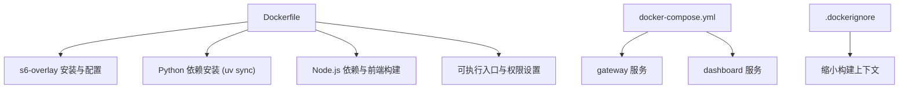
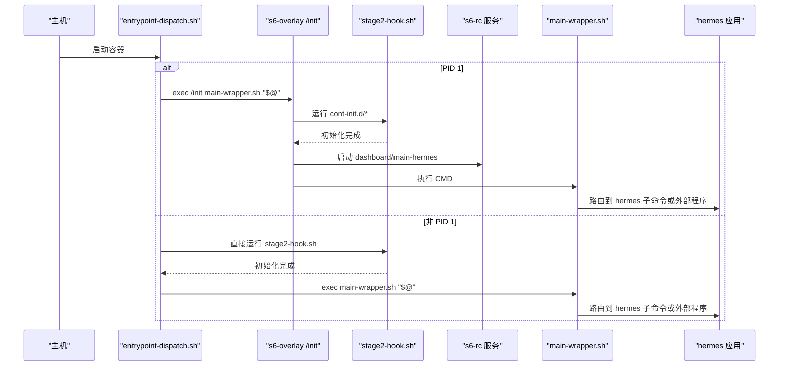
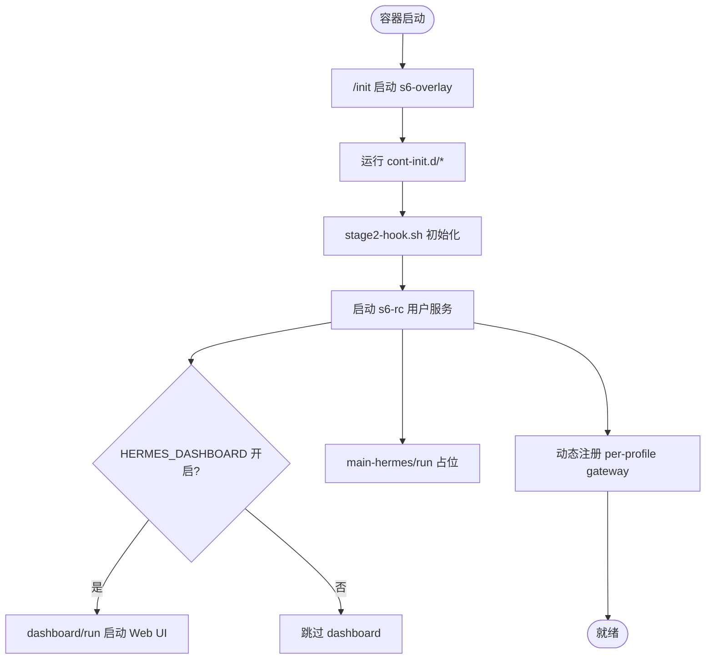
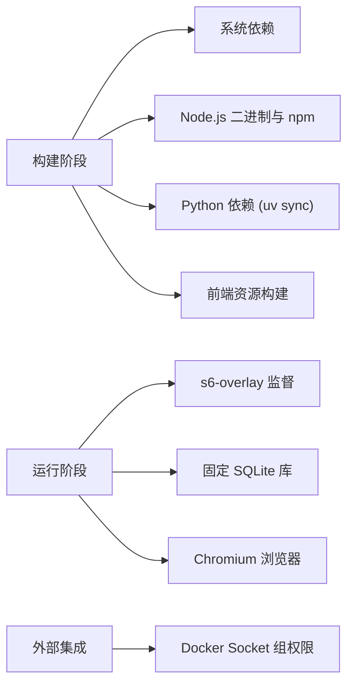

# Docker 容器化部署

<cite>
**本文引用的文件**
- [Dockerfile](file://Dockerfile)
- [docker-compose.yml](file://docker-compose.yml)
- [entrypoint-dispatch.sh](file://docker/entrypoint-dispatch.sh)
- [main-wrapper.sh](file://docker/main-wrapper.sh)
- [stage2-hook.sh](file://docker/stage2-hook.sh)
- [015-supervise-perms](file://docker/cont-init.d/015-supervise-perms)
- [02-reconcile-profiles](file://docker/cont-init.d/02-reconcile-profiles)
- [dashboard/run](file://docker/s6-rc.d/dashboard/run)
- [main-hermes/run](file://docker/s6-rc.d/main-hermes/run)
- [.dockerignore](file://.dockerignore)
</cite>

## 目录
1. [简介](#简介)
2. [项目结构](#项目结构)
3. [核心组件](#核心组件)
4. [架构总览](#架构总览)
5. [详细组件分析](#详细组件分析)
6. [依赖关系分析](#依赖关系分析)
7. [性能与优化](#性能与优化)
8. [故障排除指南](#故障排除指南)
9. [结论](#结论)
10. [附录](#附录)

## 简介
本文件面向运维团队，提供 Hermes Agent 的完整 Docker 容器化部署方案。内容涵盖：
- 多阶段构建：固定版本 SQLite、Node.js 环境、Python 依赖安装与前端资源构建
- s6-overlay 服务管理：主进程、仪表板与网关服务的监督机制
- 镜像优化策略、层缓存利用与安全最佳实践
- docker-compose 编排、环境变量、数据卷挂载与服务编排
- 容器启动流程、权限管理与日志收集配置
- 性能调优建议、资源限制与故障排除

## 项目结构
与容器化相关的关键目录与文件：
- 根级 Dockerfile：定义多阶段构建、系统依赖、s6-overlay 安装、Python/Node 依赖与前端构建、运行时入口
- docker/：包含 s6-overlay 服务脚本、初始化钩子、入口调度器、权限与生命周期处理脚本
- docker-compose.yml：定义 gateway 与 dashboard 两个服务，绑定数据卷与环境变量
- .dockerignore：控制构建上下文，避免将 node_modules、venv、测试与文档等无关内容打入镜像

**图表来源**
- [Dockerfile:1-458](file://Dockerfile#L1-L458)
- [docker-compose.yml:1-77](file://docker-compose.yml#L1-L77)
- [.dockerignore:1-106](file://.dockerignore#L1-L106)

**章节来源**
- [Dockerfile:1-458](file://Dockerfile#L1-L458)
- [docker-compose.yml:1-77](file://docker-compose.yml#L1-L77)
- [.dockerignore:1-106](file://.dockerignore#L1-L106)

## 核心组件
- 多阶段构建
  - SQLite 固定版本编译并替换系统库，修复已知 WAL-reset 问题
  - Node.js 26 二进制与 npm 从上游镜像拷贝，确保工具链一致
  - Python 依赖通过 uv 安装，锁定版本并裁剪生产所需 extras
  - 前端资源（web、ui-tui）预构建，减少运行时开销
- s6-overlay 服务管理器
  - 以 /init 作为 PID 1，运行 cont-init.d 初始化脚本，再启动用户服务
  - 静态服务：main-hermes（占位）、dashboard（可选）
  - 动态服务：按 profile 在 /run/service/ 下注册 per-profile gateway
- 入口与生命周期
  - entrypoint-dispatch.sh：判断是否 PID 1，选择 s6 监督路径或直连引导
  - main-wrapper.sh：参数路由、环境准备、权限降级与命令执行
  - stage2-hook.sh：UID/GID 重映射、数据卷权限修复、配置种子、技能同步、浏览器发现等
- 安全与权限
  - 非 root 用户 hermes，只读安装树，可变状态位于 /opt/data
  - 禁止使用 --user 指定任意 UID；通过 HERMES_UID/HERMES_GID 实现宿主 UID 对齐
  - 敏感文件权限收紧（如 .env 600），配置迁移与自动修复

**章节来源**
- [Dockerfile:1-458](file://Dockerfile#L1-L458)
- [entrypoint-dispatch.sh:1-26](file://docker/entrypoint-dispatch.sh#L1-L26)
- [main-wrapper.sh:1-92](file://docker/main-wrapper.sh#L1-L92)
- [stage2-hook.sh:1-592](file://docker/stage2-hook.sh#L1-L592)
- [015-supervise-perms:1-91](file://docker/cont-init.d/015-supervise-perms#L1-L91)
- [02-reconcile-profiles:1-48](file://docker/cont-init.d/02-reconcile-profiles#L1-L48)

## 架构总览
容器启动时，entrypoint-dispatch.sh 决定走 s6-overlay 监督路径或直接引导；随后 stage2-hook.sh 完成初始化，s6-rc 启动用户服务（dashboard 与 main-hermes），CMD 由 main-wrapper.sh 路由到 hermes 子命令或外部可执行。

**图表来源**
- [entrypoint-dispatch.sh:1-26](file://docker/entrypoint-dispatch.sh#L1-L26)
- [main-wrapper.sh:1-92](file://docker/main-wrapper.sh#L1-L92)
- [stage2-hook.sh:1-592](file://docker/stage2-hook.sh#L1-L592)

**章节来源**
- [entrypoint-dispatch.sh:1-26](file://docker/entrypoint-dispatch.sh#L1-L26)
- [main-wrapper.sh:1-92](file://docker/main-wrapper.sh#L1-L92)
- [stage2-hook.sh:1-592](file://docker/stage2-hook.sh#L1-L592)

## 详细组件分析

### 多阶段构建与依赖安装
- SQLite 固定版本编译
  - 在独立阶段下载源码并启用 FTS5、RTREE、GEOPOLY 等特性，安装到 /opt/sqlite-fixed
  - 运行时链接固定版本的 libsqlite3.so，并通过 ldconfig 与自测验证版本与功能
- Node.js 环境配置
  - 从 node:26-bookworm-slim 拷贝 node/npm/npx，确保工具链一致且兼容 glibc 版本
  - 通过 npm install 安装 monorepo 依赖，Playwright Chromium 预装并缓存
- Python 依赖安装
  - 使用 uv sync 冻结安装，仅包含生产所需的 extras（all、messaging、otlp 及若干 provider）
  - 禁用懒加载，避免运行时写入只读 venv；可选后端 SDK 安装到 /opt/data/lazy-packages
- 前端资源构建
  - web 与 ui-tui 预构建产物打入镜像，TUI 启动走预构建 bundle，避免运行时 npm install
- 层缓存优化
  - 先复制 package.json/lock 与 pyproject.toml/uv.lock，再安装依赖，减少冷构建时间
  - .dockerignore 排除 node_modules、venv、tests、docs 等，减小上下文与无效重建

**章节来源**
- [Dockerfile:1-458](file://Dockerfile#L1-L458)
- [.dockerignore:1-106](file://.dockerignore#L1-L106)

### s6-overlay 服务管理
- 服务声明
  - main-hermes：当前为占位服务，满足 s6-rc 要求并为未来长期进程预留
  - dashboard：受环境变量控制，默认关闭；开启后监听端口并提供 Web UI
- 监督机制
  - /init 作为 PID 1，运行 cont-init.d 初始化脚本，再启动用户服务
  - 每个服务通过 run 脚本以 with-contenv 加载环境变量，必要时通过 s6-setuidgid 降级权限
- 动态服务
  - 按 profile 在 /run/service/ 下注册 per-profile gateway，重启后由 reconciler 恢复
  - 权限调整：015-supervise-perms 修正 supervise 树权限，使 hermes 用户可查询与控制

**图表来源**
- [dashboard/run:1-57](file://docker/s6-rc.d/dashboard/run#L1-L57)
- [main-hermes/run:1-28](file://docker/s6-rc.d/main-hermes/run#L1-L28)
- [015-supervise-perms:1-91](file://docker/cont-init.d/015-supervise-perms#L1-L91)
- [02-reconcile-profiles:1-48](file://docker/cont-init.d/02-reconcile-profiles#L1-L48)

**章节来源**
- [dashboard/run:1-57](file://docker/s6-rc.d/dashboard/run#L1-L57)
- [main-hermes/run:1-28](file://docker/s6-rc.d/main-hermes/run#L1-L28)
- [015-supervise-perms:1-91](file://docker/cont-init.d/015-supervise-perms#L1-L91)
- [02-reconcile-profiles:1-48](file://docker/cont-init.d/02-reconcile-profiles#L1-L48)

### 入口调度与权限管理
- entrypoint-dispatch.sh
  - 若为 PID 1，则 exec /init 进入 s6 监督模式；否则直接运行 stage2-hook.sh + main-wrapper.sh
- main-wrapper.sh
  - 参数路由：无参执行 hermes，首参为可执行则透传，否则作为 hermes 子命令
  - 拒绝不支持的 --user 方式，提示通过 HERMES_UID/HERMES_GID 对齐宿主 UID
  - 激活 venv、切换工作目录、以 hermes 用户执行最终命令
- stage2-hook.sh
  - UID/GID 重映射、数据卷 chown、配置文件种子、配置迁移、auth.json 注入、skills 同步、Chromium 发现
  - 对 /run/service 与 s6-svscan 控制 FIFO 进行权限调整，支持运行时动态注册服务

**章节来源**
- [entrypoint-dispatch.sh:1-26](file://docker/entrypoint-dispatch.sh#L1-L26)
- [main-wrapper.sh:1-92](file://docker/main-wrapper.sh#L1-L92)
- [stage2-hook.sh:1-592](file://docker/stage2-hook.sh#L1-L592)

### docker-compose 编排
- 服务定义
  - gateway：构建镜像、host 网络、挂载 ~/.hermes 到 /opt/data，默认运行 gateway run
  - dashboard：依赖 gateway，host 网络，挂载相同数据卷，默认本地监听 127.0.0.1:9119
- 环境变量
  - HERMES_UID/HERMES_GID：用于 UID/GID 重映射与数据卷权限对齐
  - API_SERVER_HOST/API_SERVER_KEY：暴露 OpenAI 兼容 API 时需同时设置
  - 其他平台集成（Teams、Google Chat）可按需启用
- 安全建议
  - dashboard 默认仅本地访问；远程访问应通过 SSH 隧道或反向代理加认证
  - 不要使用 --insecure 暴露未认证的 dashboard

**章节来源**
- [docker-compose.yml:1-77](file://docker-compose.yml#L1-L77)

## 依赖关系分析
- 构建期依赖
  - 系统包：ca-certificates、python3、ffmpeg、gcc/g++、cmake、git、openssh-client、docker-cli 等
  - Node.js：从上游镜像拷贝二进制与 npm，确保工具链一致性
  - Python：uv 管理虚拟环境与依赖，锁定版本并裁剪 extras
- 运行时依赖
  - s6-overlay：服务监督与生命周期管理
  - 固定 SQLite：修复 WAL-reset 漏洞并启用必要扩展
  - Playwright Chromium：预装并自动发现二进制路径
- 外部集成
  - Docker socket 组权限：当挂载宿主机 Docker socket 时，自动加入对应组以便内嵌终端后端工作

**图表来源**
- [Dockerfile:1-458](file://Dockerfile#L1-L458)
- [stage2-hook.sh:118-172](file://docker/stage2-hook.sh#L118-L172)

**章节来源**
- [Dockerfile:1-458](file://Dockerfile#L1-L458)
- [stage2-hook.sh:118-172](file://docker/stage2-hook.sh#L118-L172)

## 性能与优化
- 层缓存策略
  - 先复制 manifest 文件再安装依赖，减少冷构建时间
  - 前端构建与 Python 依赖解耦，变更源文件不触发全量重建
- 构建优化
  - 使用 --prefer-offline、--no-audit、重试机制提升稳定性
  - 清理 npm cache 与 apt 列表，减小镜像体积
- 运行时优化
  - 预构建 TUI 与 web 资源，避免运行时 npm install 竞争与失败
  - 固定 SQLite 与启用 FTS5，提升搜索性能
  - 通过 s6-overlay 监督服务，自动回收僵尸进程
- 资源限制建议
  - 在编排层设置 CPU 与内存限制（例如 Kubernetes limits/requests 或 compose deploy.resources）
  - 根据并发会话数调整 gateway 的线程/进程上限（通过 hermes 配置项）
- 安全最佳实践
  - 只读安装树，可变状态置于 /opt/data
  - 敏感文件权限收紧（.env 600），配置迁移与自动修复
  - 禁止未认证 dashboard 暴露公网

[本节为通用指导，不直接分析具体文件]

## 故障排除指南
- 常见错误与定位
  - 启动时报错“container started with --user ... not supported”
    - 原因：使用了不支持的 --user 方式导致初始化被跳过
    - 解决：改用 HERMES_UID/HERMES_GID 或 PUID/PGID 对齐宿主 UID
  - dashboard 无法启动或报认证缺失
    - 原因：非本地绑定需要认证提供者（Basic 或 OAuth）
    - 解决：设置 HERMES_DASHBOARD_BASIC_AUTH_USERNAME/PASSWORD 或 OAuth 客户端 ID
  - 浏览器工具找不到 Chromium
    - 原因：未正确发现 Playwright 安装的浏览器二进制
    - 解决：确保 PLAYWRIGHT_BROWSERS_PATH 存在，stage2-hook 会自动导出 AGENT_BROWSER_EXECUTABLE_PATH
  - docker exec 写入文件属主为 root，网关无法读取
    - 原因：exec 默认以 root 运行，写入的文件归属 hermes 不可读
    - 解决：使用 hermes-exec-shim 或显式 -u hermes；stage2-hook 会尝试修复部分文件属主
- 日志与监控
  - 日志位置：/opt/data/logs（可通过 volume 持久化）
  - 服务状态：使用 s6-svstat 查看各服务状态（已授权 hermes 用户）
  - 健康检查：结合 Gateway Health Export（OTLP extra）采集指标
- 权限与所有权修复
  - stage2-hook 会在启动时修复 profiles/cron/logs/pairing 等目录与关键文件的属主
  - 如遇 rootless 容器 chown 失败，会记录警告并继续启动

**章节来源**
- [main-wrapper.sh:33-59](file://docker/main-wrapper.sh#L33-L59)
- [dashboard/run:30-57](file://docker/s6-rc.d/dashboard/run#L30-L57)
- [stage2-hook.sh:228-360](file://docker/stage2-hook.sh#L228-L360)
- [stage2-hook.sh:543-589](file://docker/stage2-hook.sh#L543-L589)

## 结论
该容器化方案通过多阶段构建、固定依赖、s6-overlay 监督与严格的权限模型，提供了稳定、安全、易维护的生产级部署能力。配合 docker-compose 的环境变量与数据卷管理，可实现快速编排与横向扩展。建议在生产环境中结合资源限制、日志集中与监控告警，形成完整的运维闭环。

[本节为总结性内容，不直接分析具体文件]

## 附录
- 常用环境变量
  - HERMES_UID/HERMES_GID：UID/GID 重映射
  - HERMES_HOME：数据目录（默认 /opt/data）
  - HERMES_DASHBOARD：启用 dashboard
  - HERMES_DASHBOARD_HOST/PORT：dashboard 监听地址与端口
  - API_SERVER_HOST/API_SERVER_KEY：OpenAI 兼容 API 暴露与鉴权
  - TEAMS_*、GOOGLE_CHAT_*：平台集成配置
- 数据卷挂载
  - ~/.hermes:/opt/data：持久化配置、会话、日志与技能
- 启动命令示例
  - docker compose up -d：启动 gateway 与 dashboard
  - docker run -e HERMES_UID=$(id -u) -e HERMES_GID=$(id -g) -v ~/.hermes:/opt/data hermes-agent gateway run：单容器运行

**章节来源**
- [docker-compose.yml:1-77](file://docker-compose.yml#L1-L77)
- [Dockerfile:359-422](file://Dockerfile#L359-L422)