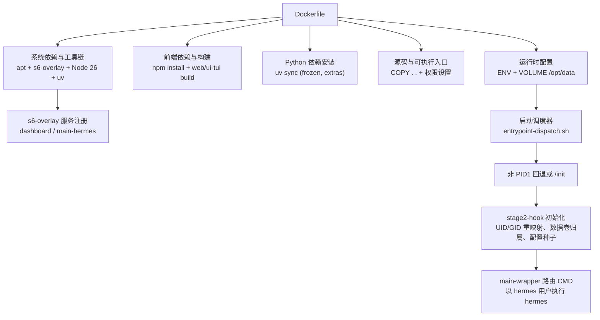
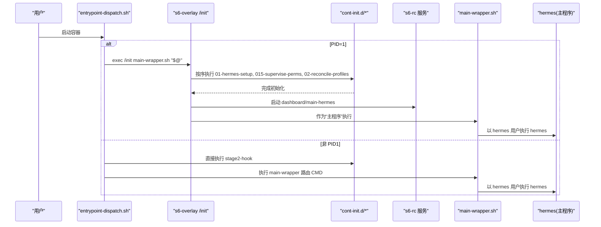
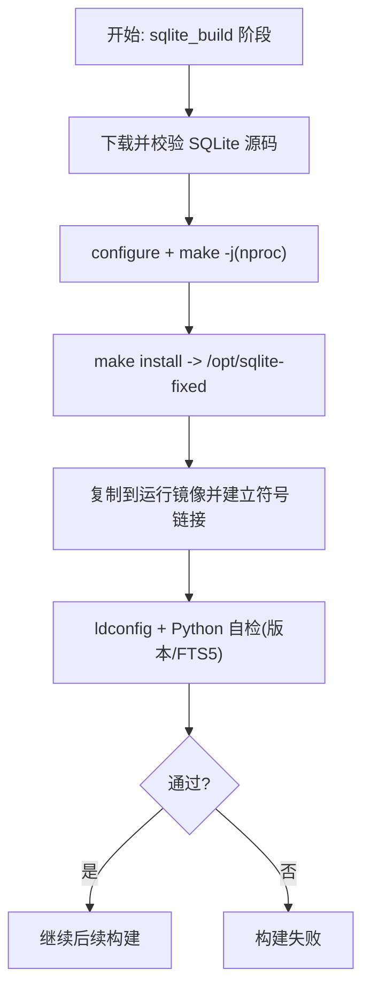
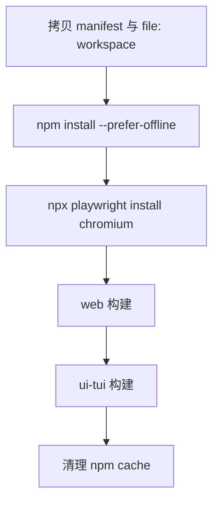
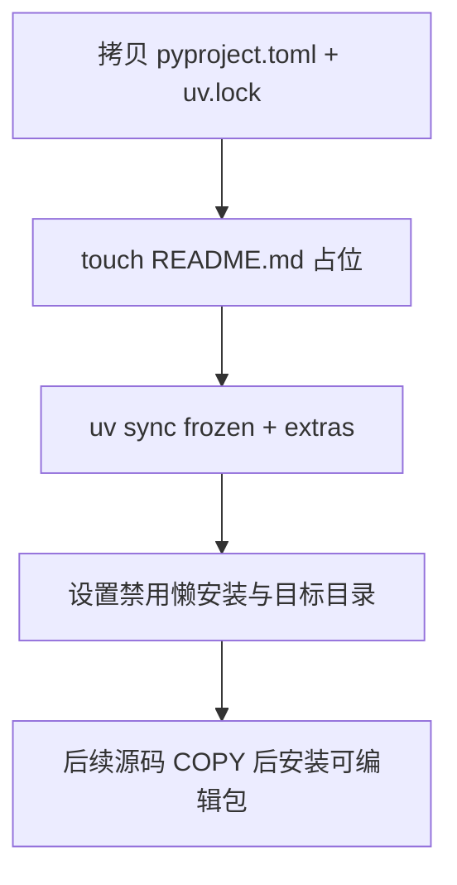
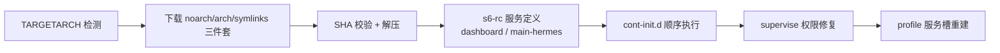
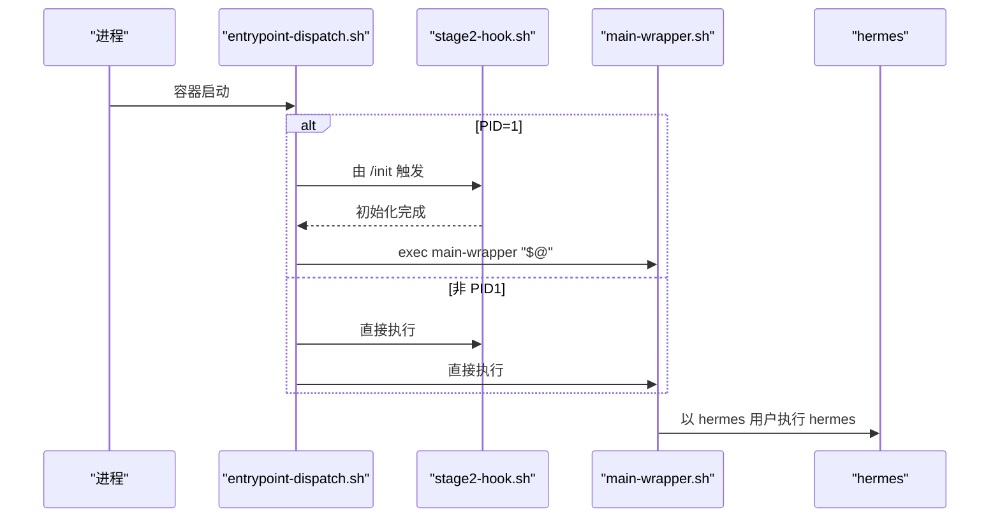
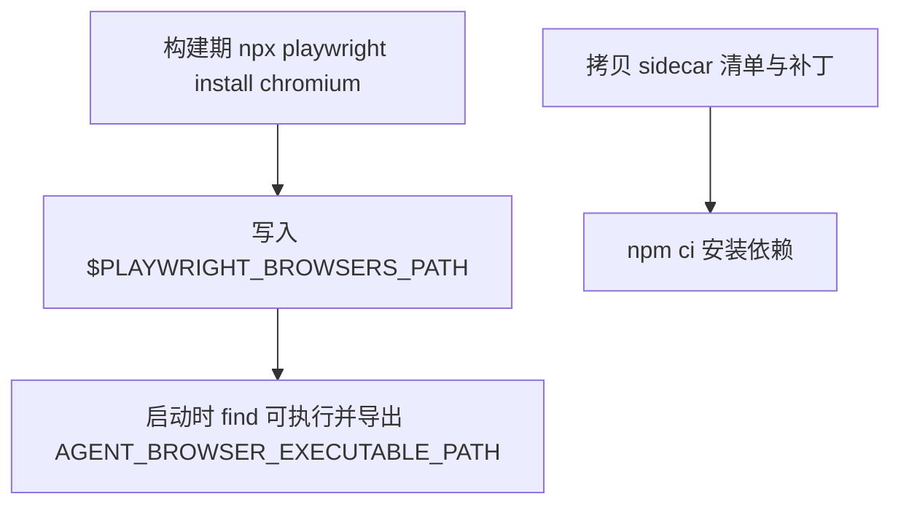
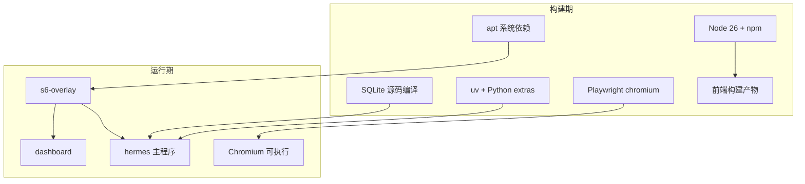

# Docker 镜像构建

<cite>
**本文引用的文件**
- [Dockerfile](file://Dockerfile)
- [docker/entrypoint-dispatch.sh](file://docker/entrypoint-dispatch.sh)
- [docker/main-wrapper.sh](file://docker/main-wrapper.sh)
- [docker/stage2-hook.sh](file://docker/stage2-hook.sh)
- [docker/tini-shim.sh](file://docker/tini-shim.sh)
- [docker/cont-init.d/015-supervise-perms](file://docker/cont-init.d/015-supervise-perms)
- [docker/cont-init.d/02-reconcile-profiles](file://docker/cont-init.d/02-reconcile-profiles)
- [docker/s6-rc.d/dashboard/run](file://docker/s6-rc.d/dashboard/run)
- [docker/s6-rc.d/main-hermes/run](file://docker/s6-rc.d/main-hermes/run)
- [.github/workflows/docker.yml](file://.github/workflows/docker.yml)
</cite>

## 目录
1. [简介](#简介)
2. [项目结构](#项目结构)
3. [核心组件](#核心组件)
4. [架构总览](#架构总览)
5. [详细组件分析](#详细组件分析)
6. [依赖关系分析](#依赖关系分析)
7. [性能与缓存优化](#性能与缓存优化)
8. [故障排除指南](#故障排除指南)
9. [结论](#结论)
10. [附录：构建参数与环境变量](#附录构建参数与环境变量)

## 简介
本文件面向开发者与运维人员，系统化说明 Hermes Agent 的 Docker 镜像构建方案。内容涵盖多阶段构建、SQLite 固定版本编译（修复 WAL-reset 漏洞）、Node.js 26 环境配置、Python 依赖安装与前端资源构建、s6-overlay 服务管理器安装与配置（含多架构支持）、层缓存策略、依赖预安装机制与安全最佳实践，以及 Playwright 浏览器安装、Photon iMessage 侧车依赖预烘焙等关键步骤。文末提供构建参数、环境变量与排错建议，帮助快速定位问题并优化构建性能。

## 项目结构
镜像构建由根级 Dockerfile 主导，配合 docker/ 下的启动脚本与服务定义，以及 CI 工作流完成多架构构建与发布。

图示来源
- [Dockerfile:52-168](file://Dockerfile#L52-L168)
- [Dockerfile:171-286](file://Dockerfile#L171-L286)
- [Dockerfile:336-458](file://Dockerfile#L336-L458)
- [docker/entrypoint-dispatch.sh:1-26](file://docker/entrypoint-dispatch.sh#L1-L26)
- [docker/stage2-hook.sh:1-592](file://docker/stage2-hook.sh#L1-L592)
- [docker/main-wrapper.sh:1-92](file://docker/main-wrapper.sh#L1-L92)

章节来源
- [Dockerfile:1-458](file://Dockerfile#L1-L458)
- [docker/entrypoint-dispatch.sh:1-26](file://docker/entrypoint-dispatch.sh#L1-L26)
- [docker/main-wrapper.sh:1-92](file://docker/main-wrapper.sh#L1-L92)
- [docker/stage2-hook.sh:1-592](file://docker/stage2-hook.sh#L1-L592)

## 核心组件
- SQLite 固定版本编译：在独立阶段从源码编译并安装到 /opt/sqlite-fixed，随后链接为系统库路径，确保运行期使用无漏洞版本并通过 FTS5 trigram 自检。
- Node.js 26 环境：从 node:26-bookworm-slim 复制二进制与 npm，创建 npm/npx 软链，用于前端构建与侧车依赖安装。
- Python 依赖：通过 uv sync --frozen 安装生产所需 extras（all/messaging/otlp 及若干 provider），避免运行时懒加载写入只读镜像层。
- 前端构建：web 与 ui-tui 分别构建产物，TUI 走预构建包路径，避免运行时 npm install 竞争。
- s6-overlay 服务管理：下载 noarch/arch/symlinks 三件套并校验 SHA，声明 dashboard 与 main-hermes 服务；cont-init.d 负责 UID/GID 重映射、数据卷 chown、配置种子、技能同步与 Chromium 发现。
- 启动流程：entrypoint-dispatch.sh 判断是否 PID 1，选择 /init 或直接回退；main-wrapper 负责参数路由与权限降级；stage2-hook 完成初始化。

章节来源
- [Dockerfile:1-42](file://Dockerfile#L1-L42)
- [Dockerfile:76-91](file://Dockerfile#L76-L91)
- [Dockerfile:93-135](file://Dockerfile#L93-L135)
- [Dockerfile:152-167](file://Dockerfile#L152-L167)
- [Dockerfile:171-220](file://Dockerfile#L171-L220)
- [Dockerfile:222-276](file://Dockerfile#L222-L276)
- [Dockerfile:336-458](file://Dockerfile#L336-L458)
- [docker/cont-init.d/015-supervise-perms:1-91](file://docker/cont-init.d/015-supervise-perms#L1-L91)
- [docker/cont-init.d/02-reconcile-profiles:1-48](file://docker/cont-init.d/02-reconcile-profiles#L1-L48)
- [docker/s6-rc.d/dashboard/run:1-57](file://docker/s6-rc.d/dashboard/run#L1-L57)
- [docker/s6-rc.d/main-hermes/run:1-28](file://docker/s6-rc.d/main-hermes/run#L1-L28)

## 架构总览
下图展示容器启动时从 entrypoint 到 s6 服务与主程序的调用链，以及初始化钩子与权限处理顺序。

图示来源
- [docker/entrypoint-dispatch.sh:15-26](file://docker/entrypoint-dispatch.sh#L15-L26)
- [docker/stage2-hook.sh:1-592](file://docker/stage2-hook.sh#L1-L592)
- [docker/main-wrapper.sh:23-92](file://docker/main-wrapper.sh#L23-L92)
- [docker/s6-rc.d/dashboard/run:1-57](file://docker/s6-rc.d/dashboard/run#L1-L57)
- [docker/s6-rc.d/main-hermes/run:1-28](file://docker/s6-rc.d/main-hermes/run#L1-L28)

## 详细组件分析

### 多阶段构建与 SQLite 固定版本
- 阶段 sqlite_build：下载指定版本的 SQLite 源码，启用 FTS/RTREE/SESSION 等特性，编译并安装至 /opt/sqlite-fixed。
- 阶段 node_source：复用 node:26-bookworm-slim 的二进制与 npm，保证 glibc 兼容性与工具链一致性。
- 运行阶段：将固定版 libsqlite3.so.* 放入 /usr/local/lib，建立稳定符号链接，更新 ldconfig，并通过 Python sqlite3 模块进行版本与 FTS5 trigram 自测，失败则中止构建。

图示来源
- [Dockerfile:1-42](file://Dockerfile#L1-L42)
- [Dockerfile:76-91](file://Dockerfile#L76-L91)

章节来源
- [Dockerfile:1-42](file://Dockerfile#L1-L42)
- [Dockerfile:76-91](file://Dockerfile#L76-L91)

### Node.js 26 环境与前端构建
- 从 node:26-bookworm-slim 复制 node/npm，创建 npm/npx 软链，确保 PATH 可用。
- 先拷贝 package manifests（根、web、ui-tui、apps/shared）再执行 npm install，利用 lockfile 提升缓存命中。
- 前端构建分两步：web 与 ui-tui 分别构建，产物被后续 COPY 覆盖前已缓存。

图示来源
- [Dockerfile:152-167](file://Dockerfile#L152-L167)
- [Dockerfile:171-204](file://Dockerfile#L171-L204)
- [Dockerfile:269-276](file://Dockerfile#L269-L276)

章节来源
- [Dockerfile:152-167](file://Dockerfile#L152-L167)
- [Dockerfile:171-204](file://Dockerfile#L171-L204)
- [Dockerfile:269-276](file://Dockerfile#L269-L276)

### Python 依赖安装与懒加载隔离
- 仅拷贝 pyproject.toml 与 uv.lock，执行 uv sync --frozen --no-install-project --extra all/messaging/otlp 及若干 provider extras，确保生产镜像包含必要依赖且可离线工作。
- 通过 HERMES_DISABLE_LAZY_INSTALLS=1 与 HERMES_LAZY_INSTALL_TARGET=/opt/data/lazy-packages 将可选后端 SDK 的安装重定向到持久卷，避免破坏只读 venv。

图示来源
- [Dockerfile:222-267](file://Dockerfile#L222-L267)
- [Dockerfile:377-393](file://Dockerfile#L377-L393)

章节来源
- [Dockerfile:222-267](file://Dockerfile#L222-L267)
- [Dockerfile:377-393](file://Dockerfile#L377-L393)

### s6-overlay 服务管理与多架构支持
- 通过 ARG TARGETARCH 自动识别 amd64/arm64，下载对应 tarball 并校验 SHA，解压到根文件系统。
- 静态服务：dashboard（受控启停）、main-hermes（占位）。动态服务：按 profile 在 /run/service/ 下注册与恢复。
- cont-init.d 顺序：01-hermes-setup（stage2-hook）→ 015-supervise-perms（修正 supervise 树权限）→ 02-reconcile-profiles（重建 profile 服务槽）。

图示来源
- [Dockerfile:93-135](file://Dockerfile#L93-L135)
- [docker/cont-init.d/015-supervise-perms:1-91](file://docker/cont-init.d/015-supervise-perms#L1-L91)
- [docker/cont-init.d/02-reconcile-profiles:1-48](file://docker/cont-init.d/02-reconcile-profiles#L1-L48)
- [docker/s6-rc.d/dashboard/run:1-57](file://docker/s6-rc.d/dashboard/run#L1-L57)
- [docker/s6-rc.d/main-hermes/run:1-28](file://docker/s6-rc.d/main-hermes/run#L1-L28)

章节来源
- [Dockerfile:93-135](file://Dockerfile#L93-L135)
- [docker/cont-init.d/015-supervise-perms:1-91](file://docker/cont-init.d/015-supervise-perms#L1-L91)
- [docker/cont-init.d/02-reconcile-profiles:1-48](file://docker/cont-init.d/02-reconcile-profiles#L1-L48)
- [docker/s6-rc.d/dashboard/run:1-57](file://docker/s6-rc.d/dashboard/run#L1-L57)
- [docker/s6-rc.d/main-hermes/run:1-28](file://docker/s6-rc.d/main-hermes/run#L1-L28)

### 启动流程与权限降级
- entrypoint-dispatch.sh：若自身为 PID 1，则 exec /init main-wrapper.sh；否则直接执行 stage2-hook 与 main-wrapper。
- main-wrapper.sh：解析 CMD（空参默认 hermes、可执行直跑、其他视为 hermes 子命令），通过 s6-setuidgid 以 hermes 用户执行。
- stage2-hook.sh：UID/GID 重映射、数据卷 chown、配置文件种子、skills 同步、Chromium 可执行发现并注入环境变量。

图示来源
- [docker/entrypoint-dispatch.sh:15-26](file://docker/entrypoint-dispatch.sh#L15-L26)
- [docker/stage2-hook.sh:1-592](file://docker/stage2-hook.sh#L1-L592)
- [docker/main-wrapper.sh:23-92](file://docker/main-wrapper.sh#L23-L92)

章节来源
- [docker/entrypoint-dispatch.sh:15-26](file://docker/entrypoint-dispatch.sh#L15-L26)
- [docker/stage2-hook.sh:1-592](file://docker/stage2-hook.sh#L1-L592)
- [docker/main-wrapper.sh:23-92](file://docker/main-wrapper.sh#L23-L92)

### Playwright 浏览器安装与 Photon iMessage 侧车
- Playwright：构建期安装 chromium 到 PLAYWRIGHT_BROWSERS_PATH（默认 /opt/hermes/.playwright），避免运行时网络与权限问题；启动时自动发现可执行并注入 AGENT_BROWSER_EXECUTABLE_PATH。
- Photon iMessage 侧车：单独拷贝其 sidecar 的 package.json/lock 与补丁脚本，构建期执行 npm ci，确保 immutable 镜像中可运行。

图示来源
- [Dockerfile:199-204](file://Dockerfile#L199-L204)
- [Dockerfile:206-220](file://Dockerfile#L206-L220)
- [docker/stage2-hook.sh:543-589](file://docker/stage2-hook.sh#L543-L589)

章节来源
- [Dockerfile:199-204](file://Dockerfile#L199-L204)
- [Dockerfile:206-220](file://Dockerfile#L206-L220)
- [docker/stage2-hook.sh:543-589](file://docker/stage2-hook.sh#L543-L589)

### 安全与兼容性
- tini 兼容：/usr/bin/tini 为兼容 shim，剥离旧版 tini 参数后转发到 /init 与 main-wrapper，避免 boot-loop。
- 不可变安装树：/opt/hermes 只读，敏感配置与状态位于 /opt/data；.env 权限收紧；禁止以任意 --user 启动，统一通过 HERMES_UID/GID 重映射。
- 日志与审计：构建期嵌入 HERMES_GIT_SHA，便于问题定位。

章节来源
- [docker/tini-shim.sh:1-90](file://docker/tini-shim.sh#L1-L90)
- [docker/stage2-hook.sh:26-74](file://docker/stage2-hook.sh#L26-L74)
- [docker/main-wrapper.sh:33-59](file://docker/main-wrapper.sh#L33-L59)
- [Dockerfile:314-334](file://Dockerfile#L314-L334)

## 依赖关系分析
- 构建期依赖：apt 系统库、SQLite 源码、Node 26、npm、Playwright、uv。
- 运行时依赖：s6-overlay、Python venv、预构建前端资源、Chromium 可执行。
- 外部集成：GitHub Releases（s6-overlay、SQLite 源）、Docker Hub（基础镜像与发布）。

图示来源
- [Dockerfile:71-91](file://Dockerfile#L71-L91)
- [Dockerfile:93-135](file://Dockerfile#L93-L135)
- [Dockerfile:171-276](file://Dockerfile#L171-L276)
- [docker/s6-rc.d/dashboard/run:1-57](file://docker/s6-rc.d/dashboard/run#L1-L57)

章节来源
- [Dockerfile:71-91](file://Dockerfile#L71-L91)
- [Dockerfile:93-135](file://Dockerfile#L93-L135)
- [Dockerfile:171-276](file://Dockerfile#L171-L276)
- [docker/s6-rc.d/dashboard/run:1-57](file://docker/s6-rc.d/dashboard/run#L1-L57)

## 性能与缓存优化
- 分层策略：
  - 先拷贝 manifest 再 npm install，提高锁文件变更时的缓存命中率。
  - 先拷贝 pyproject.toml + uv.lock 再 uv sync，避免源码变更导致 Python 依赖重算。
  - 前端构建与 Python 依赖解耦，减少不必要失效。
- 构建加速：
  - npm install --prefer-offline，减少网络开销。
  - uv sync --frozen，跳过解析，直接使用锁定依赖。
  - 使用 BuildKit 缓存（CI 中按架构 scope 缓存）。
- 运行时优化：
  - 预构建 TUI 包，绕过运行时 npm install。
  - 预装 Chromium，避免首次启动耗时。
  - 将可选依赖安装重定向到持久卷，避免重复安装与权限问题。

章节来源
- [Dockerfile:171-204](file://Dockerfile#L171-L204)
- [Dockerfile:222-276](file://Dockerfile#L222-L276)
- [Dockerfile:360-377](file://Dockerfile#L360-L377)
- [.github/workflows/docker.yml:33-84](file://.github/workflows/docker.yml#L33-L84)

## 故障排除指南
- 启动报错：容器以任意 --user 启动导致权限不足
  - 现象：EACCES 或无法访问 /opt/hermes 目录
  - 解决：不要使用 --user，改用 HERMES_UID/HERMES_GID（或 PUID/PGID）让启动时重映射
  - 参考：[docker/stage2-hook.sh:26-74](file://docker/stage2-hook.sh#L26-L74)、[docker/main-wrapper.sh:33-59](file://docker/main-wrapper.sh#L33-L59)
- Dashboard 未启动
  - 检查 HERMES_DASHBOARD 是否为真值；非 loopback 绑定需配置认证提供者
  - 参考：[docker/s6-rc.d/dashboard/run:9-57](file://docker/s6-rc.d/dashboard/run#L9-L57)
- 浏览器工具失败
  - 确认 Playwright 已安装且存在可执行；必要时手动设置 AGENT_BROWSER_EXECUTABLE_PATH
  - 参考：[docker/stage2-hook.sh:543-589](file://docker/stage2-hook.sh#L543-L589)
- 构建失败：网络抖动或 CDN 不可用
  - 使用带重试的 curl 下载 s6-overlay 与 SQLite；CI 已内置重试逻辑
  - 参考：[Dockerfile:10-18](file://Dockerfile#L10-L18)、[Dockerfile:119-131](file://Dockerfile#L119-L131)
- 旧编排模板仍调用 tini
  - 使用 /usr/bin/tini 兼容 shim，自动剥离参数并转发到 /init
  - 参考：[docker/tini-shim.sh:1-90](file://docker/tini-shim.sh#L1-L90)

章节来源
- [docker/stage2-hook.sh:26-74](file://docker/stage2-hook.sh#L26-L74)
- [docker/main-wrapper.sh:33-59](file://docker/main-wrapper.sh#L33-L59)
- [docker/s6-rc.d/dashboard/run:9-57](file://docker/s6-rc.d/dashboard/run#L9-L57)
- [docker/stage2-hook.sh:543-589](file://docker/stage2-hook.sh#L543-L589)
- [Dockerfile:10-18](file://Dockerfile#L10-L18)
- [Dockerfile:119-131](file://Dockerfile#L119-L131)
- [docker/tini-shim.sh:1-90](file://docker/tini-shim.sh#L1-L90)

## 结论
该镜像采用严谨的多阶段构建与分层缓存策略，结合 s6-overlay 的服务化治理，实现了高可靠、可观测、易维护的生产级容器。通过固定 SQLite 版本、预装浏览器与侧车依赖、禁用运行时懒安装并重定向到持久卷，显著提升了稳定性与启动速度。配合 CI 的多架构构建与发布流水线，满足跨平台部署需求。建议在生产环境中严格遵循环境变量与权限约定，以获得最佳体验。

## 附录：构建参数与环境变量
- 构建参数
  - SQLITE_AUTOCONF_VERSION：SQLite 源码版本号
  - SQLITE_SHA256：源码压缩包校验和
  - S6_OVERLAY_VERSION：s6-overlay 版本
  - S6_OVERLAY_*_SHA256：各 tarball 校验和
  - HERMES_GIT_SHA：构建时嵌入的 Git 提交哈希
- 环境变量
  - PYTHONUNBUFFERED、PYTHONDONTWRITEBYTECODE：关闭缓冲与字节码生成
  - PLAYWRIGHT_BROWSERS_PATH：浏览器安装路径（默认 /opt/hermes/.playwright）
  - HERMES_HOME、HERMES_WRITE_SAFE_ROOT：数据目录与写安全根
  - HERMES_DISABLE_LAZY_INSTALLS：禁用运行时懒安装
  - HERMES_LAZY_INSTALL_TARGET：可选依赖安装目标（/opt/data/lazy-packages）
  - HERMES_TUI_DIR、HERMES_WEB_DIST：指向预构建前端资源
  - HERMES_UID、HERMES_GID（或 PUID、PGID）：运行时用户重映射
  - HERMES_DASHBOARD、HERMES_DASHBOARD_HOST、HERMES_DASHBOARD_PORT：Dashboard 开关与监听信息
  - AGENT_BROWSER_EXECUTABLE_PATH：Chromium 可执行路径（可由 stage2 自动发现）

章节来源
- [Dockerfile:54-63](file://Dockerfile#L54-L63)
- [Dockerfile:360-393](file://Dockerfile#L360-L393)
- [docker/stage2-hook.sh:543-589](file://docker/stage2-hook.sh#L543-L589)
- [docker/s6-rc.d/dashboard/run:22-57](file://docker/s6-rc.d/dashboard/run#L22-L57)