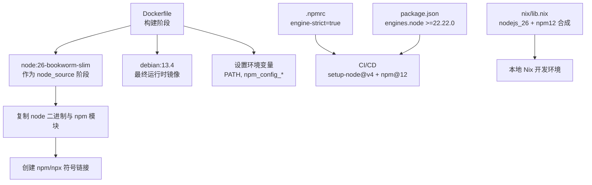
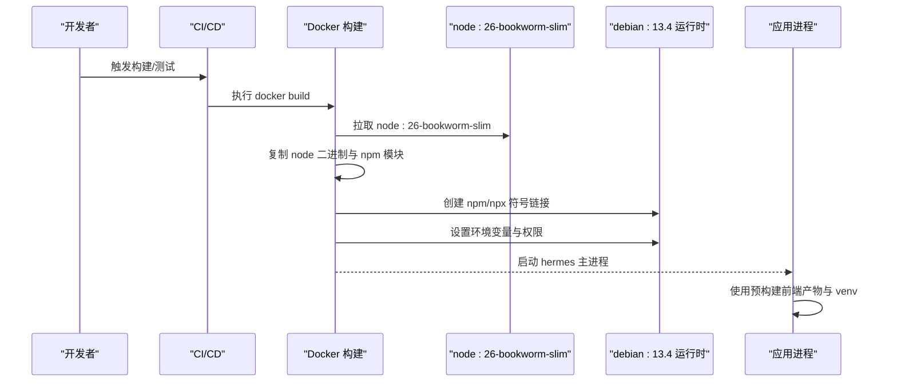
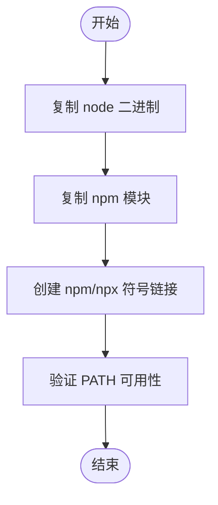
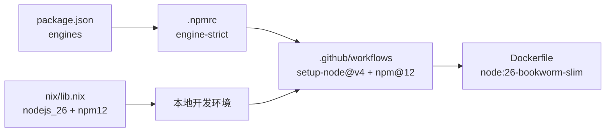
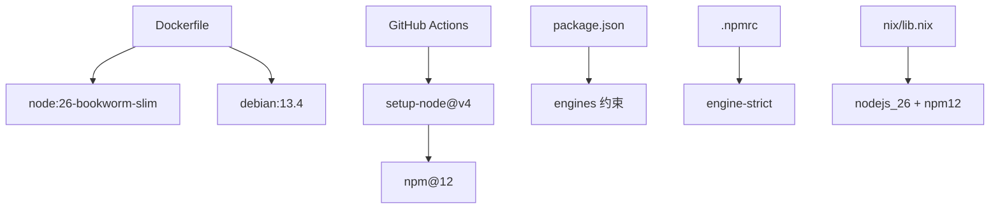

# Node.js 环境配置

<cite>
**本文引用的文件**
- [Dockerfile](file://Dockerfile)
- [package.json](file://package.json)
- [.npmrc](file://.npmrc)
- [js-tests.yml](file://.github/workflows/js-tests.yml)
- [deploy-site.yml](file://.github/workflows/deploy-site.yml)
- [lib.nix](file://nix/lib.nix)
</cite>

## 目录
1. [简介](#简介)
2. [项目结构](#项目结构)
3. [核心组件](#核心组件)
4. [架构总览](#架构总览)
5. [详细组件分析](#详细组件分析)
6. [依赖关系分析](#依赖关系分析)
7. [性能与可维护性](#性能与可维护性)
8. [故障排查指南](#故障排查指南)
9. [结论](#结论)
10. [附录](#附录)

## 简介
本文件聚焦于本项目在容器化构建与运行环境中对 Node.js 工具链的选型、安装与治理策略。重点说明：
- 为什么选择 Node.js 26，而非 Debian trixie 自带的 Node.js 20.x（已到达 EOL）。
- 如何从 node:26-bookworm-slim 基础镜像中复制 Node.js 二进制与 npm，并创建必要的符号链接。
- 为何选用 Bookworm-based slim 镜像（glibc 兼容性）以及多架构支持。
- 环境变量配置与 corepack 禁用的原因。
- 如何确保 Node.js 工具链的一致性与可维护性，包括版本升级策略与依赖管理最佳实践。

## 项目结构
Node.js 相关的环境与约束分布在以下位置：
- 容器构建与运行时：Dockerfile
- 工作区与引擎约束：根 package.json、.npmrc
- CI/CD 中的 Node 与 npm 版本：GitHub Actions 工作流
- Nix 开发环境与包组合成：nix/lib.nix

**图示来源**
- [Dockerfile:44-51](file://Dockerfile#L44-L51)
- [Dockerfile:154-167](file://Dockerfile#L154-L167)
- [Dockerfile:171-204](file://Dockerfile#L171-L204)
- [package.json:55-58](file://package.json#L55-L58)
- [.npmrc:1-4](file://.npmrc#L1-L4)
- [js-tests.yml:16-23](file://.github/workflows/js-tests.yml#L16-L23)
- [deploy-site.yml:66-74](file://.github/workflows/deploy-site.yml#L66-L74)
- [lib.nix:27-46](file://nix/lib.nix#L27-L46)

**章节来源**
- [Dockerfile:44-51](file://Dockerfile#L44-L51)
- [Dockerfile:154-167](file://Dockerfile#L154-L167)
- [package.json:55-58](file://package.json#L55-L58)
- [.npmrc:1-4](file://.npmrc#L1-L4)
- [js-tests.yml:16-23](file://.github/workflows/js-tests.yml#L16-L23)
- [deploy-site.yml:66-74](file://.github/workflows/deploy-site.yml#L66-L74)
- [lib.nix:27-46](file://nix/lib.nix#L27-L46)

## 核心组件
- 基础镜像与阶段划分：使用独立的 node_source 阶段提供 Node.js 26 与 npm，最终运行时基于 debian:13.4。
- Node.js 与 npm 的安装方式：通过 COPY 从 node:26-bookworm-slim 复制二进制与 npm 模块，并在 PATH 上创建 npm/npx 符号链接。
- 环境变量：设置 npm_config_install_links=false 等，确保 workspace file: 依赖以符号链接形式解析；同时禁用懒加载安装路径以避免写入只读镜像层。
- 版本约束与一致性：通过 engines 字段、.npmrc 的 engine-strict 以及 CI 中的 setup-node 统一 Node 与 npm 版本。
- Nix 开发环境：将 nodejs_26 与 npm12 组合为单一工具链，保证本地开发与 CI/容器的一致性。

**章节来源**
- [Dockerfile:44-51](file://Dockerfile#L44-L51)
- [Dockerfile:154-167](file://Dockerfile#L154-L167)
- [Dockerfile:171-204](file://Dockerfile#L171-L204)
- [package.json:55-58](file://package.json#L55-L58)
- [.npmrc:1-4](file://.npmrc#L1-L4)
- [lib.nix:27-46](file://nix/lib.nix#L27-L46)

## 架构总览
下图展示了从构建到运行的 Node.js 工具链装配流程，以及各阶段之间的依赖关系。

**图示来源**
- [Dockerfile:44-51](file://Dockerfile#L44-L51)
- [Dockerfile:154-167](file://Dockerfile#L154-L167)
- [Dockerfile:269-276](file://Dockerfile#L269-L276)
- [Dockerfile:288-292](file://Dockerfile#L288-L292)
- [Dockerfile:359-380](file://Dockerfile#L359-L380)

## 详细组件分析

### 为什么选择 Node.js 26 而不是 Debian trixie 自带的 Node.js 20.x
- Debian trixie 默认捆绑的 Node.js 20.x 已到达 EOL，无法获得安全更新与长期支持。
- 项目在全局范围内锁定 Node 26 工具链，以保证跨平台、跨环境的一致性。
- 通过独立 node_source 阶段引入受控版本的 Node.js 26，避免依赖发行版提供的过时版本。

**章节来源**
- [Dockerfile:44-51](file://Dockerfile#L44-L51)

### 从 node:26-bookworm-slim 复制 Node.js 与 npm
- 使用多阶段构建，先在 node_source 阶段获取 Node.js 26 与 npm。
- 将 node 二进制与 npm 模块复制到最终镜像，并在 PATH 上创建 npm/npx 符号链接，确保命令可用。
- 该方式避免了在运行时安装 Node.js，提升构建可重复性与稳定性。

**图示来源**
- [Dockerfile:154-167](file://Dockerfile#L154-L167)

**章节来源**
- [Dockerfile:154-167](file://Dockerfile#L154-L167)

### 选择 Bookworm-based slim 镜像的原因（glibc 兼容性与多架构支持）
- 使用 Bookworm-based slim 镜像可使生成的二进制链接到 glibc 2.36，从而在 Debian 13（trixie，glibc 2.41）运行时稳定执行。
- 通过 BuildKit 的 TARGETARCH 自动识别 amd64/arm64，并使用 s6-overlay 的多架构 tarball，实现多架构构建与部署。
- 该策略兼顾了体积优化与系统库兼容性，减少运行时动态库差异带来的问题。

**章节来源**
- [Dockerfile:44-51](file://Dockerfile#L44-L51)
- [Dockerfile:93-135](file://Dockerfile#L93-L135)

### Node.js 与 npm 的安装过程与符号链接
- 安装步骤：
  - 复制 node 二进制到 /usr/local/bin。
  - 复制 npm 模块到 /usr/local/lib/node_modules/npm。
  - 创建 npm/npx 符号链接到 /usr/local/bin，使其可通过 PATH 直接调用。
- 这些步骤确保容器内 Node.js 工具链完整且可被后续脚本与命令直接使用。

**章节来源**
- [Dockerfile:154-167](file://Dockerfile#L154-L167)

### corepack 禁用的原因
- Node.js 上游已从 node:26 中移除 corepack，因此镜像仅包含 npm。
- 项目中没有声明 packageManager 字段，也没有构建步骤调用 yarn 或 pnpm，因此无需启用 corepack。
- 禁用 corepack 可减少不必要的依赖与潜在冲突，保持工具链简洁可控。

**章节来源**
- [Dockerfile:154-167](file://Dockerfile#L154-L167)

### 环境变量配置
- npm_config_install_links=false：强制 npm 将 workspace 的 file: 依赖安装为符号链接，避免隐藏的文件锁不一致导致运行时重新安装失败。
- HERMES_TUI_DIR、HERMES_HOME、HERMES_WRITE_SAFE_ROOT、HERMES_DISABLE_LAZY_INSTALLS、HERMES_LAZY_INSTALL_TARGET：控制前端构建产物路径、数据卷位置、懒加载安装目标与行为，确保只读镜像层不被修改。
- PATH：将 /opt/hermes/bin 置于最前，以便特权降级 shim 优先生效；随后是 venv bin 与用户 local bin。

**章节来源**
- [Dockerfile:171-204](file://Dockerfile#L171-L204)
- [Dockerfile:359-380](file://Dockerfile#L359-L380)
- [Dockerfile:414-420](file://Dockerfile#L414-L420)

### 版本一致性与可维护性
- 工程级约束：
  - package.json 的 engines 字段限定 Node 与 npm 版本范围。
  - .npmrc 启用 engine-strict，确保安装时严格校验引擎版本。
- CI/CD 一致性：
  - GitHub Actions 使用 setup-node@v4 指定 node-version: 26，并通过 npm i -g npm@12 固定 npm 版本。
- Nix 开发环境：
  - nix/lib.nix 将 nodejs_26 与 npm12 组合为单一工具链，保证本地开发与 CI/容器一致。

**图示来源**
- [package.json:55-58](file://package.json#L55-L58)
- [.npmrc:1-4](file://.npmrc#L1-L4)
- [js-tests.yml:16-23](file://.github/workflows/js-tests.yml#L16-L23)
- [deploy-site.yml:66-74](file://.github/workflows/deploy-site.yml#L66-L74)
- [lib.nix:27-46](file://nix/lib.nix#L27-L46)

**章节来源**
- [package.json:55-58](file://package.json#L55-L58)
- [.npmrc:1-4](file://.npmrc#L1-L4)
- [js-tests.yml:16-23](file://.github/workflows/js-tests.yml#L16-L23)
- [deploy-site.yml:66-74](file://.github/workflows/deploy-site.yml#L66-L74)
- [lib.nix:27-46](file://nix/lib.nix#L27-L46)

### 版本升级策略
- 最小改动原则：升级 Node 主版本仅需调整 Dockerfile 中的 node_source 基础镜像 ARG（如 #4977 所述），降低变更风险。
- 锁定与校验：
  - 使用固定镜像摘要（sha256）确保构建可重复。
  - 通过 .npmrc 的 engine-strict 与 CI 的 setup-node 版本约束，防止意外回退或漂移。
- 依赖管理：
  - 使用 npm ci 与 --prefer-offline 加速构建并保证确定性。
  - 对 workspace 的 file: 依赖采用符号链接安装，避免重复拷贝与锁文件不一致。

**章节来源**
- [Dockerfile:44-51](file://Dockerfile#L44-L51)
- [Dockerfile:171-204](file://Dockerfile#L171-L204)
- [.npmrc:1-4](file://.npmrc#L1-L4)

### 依赖管理最佳实践
- 单锁文件与工作区：根 package-lock.json 统一管理所有工作区依赖，减少碎片化与冲突。
- 构建缓存：先复制 manifest 再安装依赖，充分利用 Docker 层缓存；Playwright 浏览器安装重试机制提高鲁棒性。
- 插件侧车依赖：photon sidecar 的依赖预先 baked 进镜像，避免运行时 EROFS 错误。
- Python 与 JS 解耦：Python 依赖通过 uv sync 冻结安装，JS 依赖通过 npm ci 冻结安装，互不干扰。

**章节来源**
- [Dockerfile:171-204](file://Dockerfile#L171-L204)
- [Dockerfile:206-220](file://Dockerfile#L206-L220)
- [Dockerfile:222-267](file://Dockerfile#L222-L267)

## 依赖关系分析
Node.js 工具链在各层之间的依赖如下：
- Dockerfile 依赖 node:26-bookworm-slim 提供 Node 与 npm。
- CI 工作流依赖 setup-node@v4 与 npm@12 保持一致。
- package.json 与 .npmrc 共同约束 Node 与 npm 版本。
- nix/lib.nix 将 nodejs_26 与 npm12 组合为开发工具链。

**图示来源**
- [Dockerfile:44-51](file://Dockerfile#L44-L51)
- [js-tests.yml:16-23](file://.github/workflows/js-tests.yml#L16-L23)
- [deploy-site.yml:66-74](file://.github/workflows/deploy-site.yml#L66-L74)
- [package.json:55-58](file://package.json#L55-L58)
- [.npmrc:1-4](file://.npmrc#L1-L4)
- [lib.nix:27-46](file://nix/lib.nix#L27-L46)

**章节来源**
- [Dockerfile:44-51](file://Dockerfile#L44-L51)
- [js-tests.yml:16-23](file://.github/workflows/js-tests.yml#L16-L23)
- [deploy-site.yml:66-74](file://.github/workflows/deploy-site.yml#L66-L74)
- [package.json:55-58](file://package.json#L55-L58)
- [.npmrc:1-4](file://.npmrc#L1-L4)
- [lib.nix:27-46](file://nix/lib.nix#L27-L46)

## 性能与可维护性
- 构建性能：
  - 分层缓存：先复制 manifest，再安装依赖，减少冷构建时间。
  - Playwright 安装重试与缓存清理，提升网络不稳定时的成功率。
  - 使用 --prefer-offline 与 npm cache clean 平衡速度与确定性。
- 可维护性：
  - 通过固定镜像摘要与 engine-strict，避免“在我机器上能跑”的问题。
  - 多架构支持与 s6-overlay 的健壮性，简化运维与扩展。
  - 将 Node 升级限制为一次 ARG 变更，降低回归风险。

[本节为通用指导，不直接分析具体文件]

## 故障排查指南
- 若出现 npm 版本不匹配：
  - 检查 .npmrc 是否启用 engine-strict，以及 CI 是否安装了 npm@12。
- 若 workspace file: 依赖安装异常：
  - 确认 npm_config_install_links=false 已设置，避免复制导致的锁文件不一致。
- 若运行时懒加载失败：
  - 检查 HERMES_DISABLE_LAZY_INSTALLS 与 HERMES_LAZY_INSTALL_TARGET 是否正确指向可写数据卷。
- 若 Node 命令不可用：
  - 确认 npm/npx 符号链接已创建，PATH 中包含 /usr/local/bin 与 /opt/hermes/bin。

**章节来源**
- [.npmrc:1-4](file://.npmrc#L1-L4)
- [Dockerfile:171-204](file://Dockerfile#L171-L204)
- [Dockerfile:359-380](file://Dockerfile#L359-L380)
- [Dockerfile:414-420](file://Dockerfile#L414-L420)

## 结论
本项目通过多阶段构建与严格的版本约束，确保了 Node.js 26 工具链在容器、CI 与本地开发环境中的一致性。选择 node:26-bookworm-slim 既解决了 Debian trixie 自带 Node 20.x 的 EOL 问题，又通过 glibc 兼容性保障了运行时稳定性。结合 .npmrc、package.json 与 CI 配置，实现了可重复、可维护、可扩展的 Node.js 环境治理。

[本节为总结性内容，不直接分析具体文件]

## 附录
- 关键环境变量清单：
  - npm_config_install_links=false
  - HERMES_TUI_DIR=/opt/hermes/ui-tui
  - HERMES_HOME=/opt/data
  - HERMES_WRITE_SAFE_ROOT=/opt/data
  - HERMES_DISABLE_LAZY_INSTALLS=1
  - HERMES_LAZY_INSTALL_TARGET=/opt/data/lazy-packages
  - PATH="/opt/hermes/bin:/opt/hermes/.venv/bin:/opt/data/.local/bin:${PATH}"

**章节来源**
- [Dockerfile:171-204](file://Dockerfile#L171-L204)
- [Dockerfile:359-380](file://Dockerfile#L359-L380)
- [Dockerfile:414-420](file://Dockerfile#L414-L420)