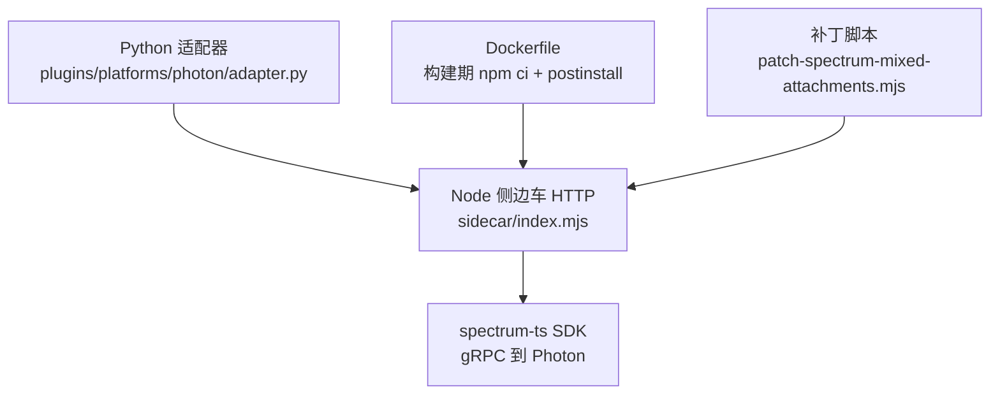
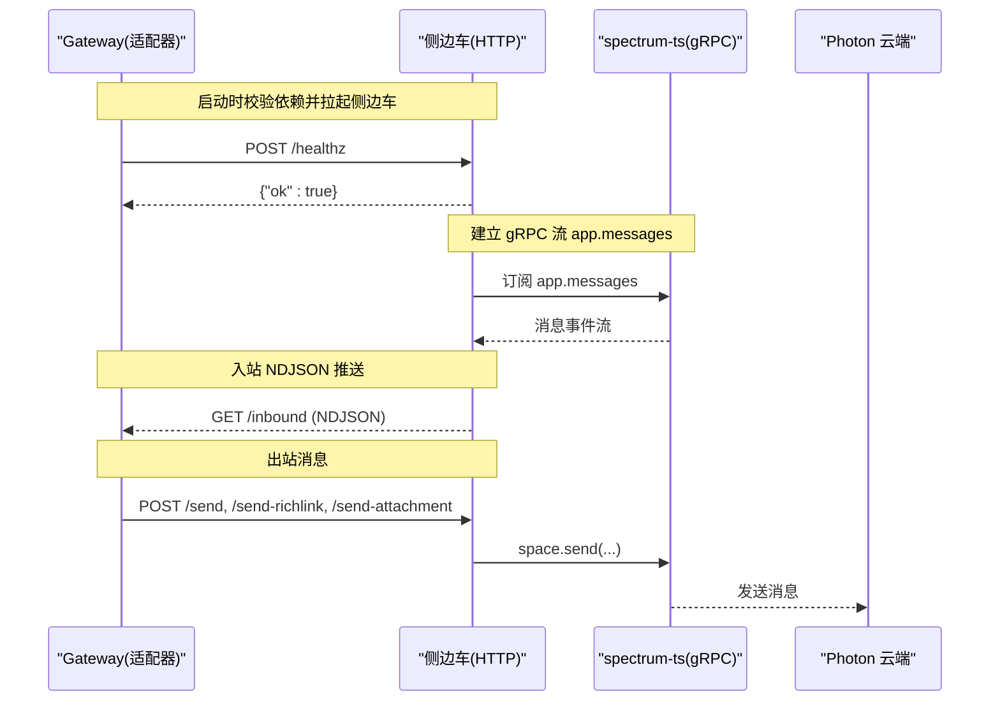
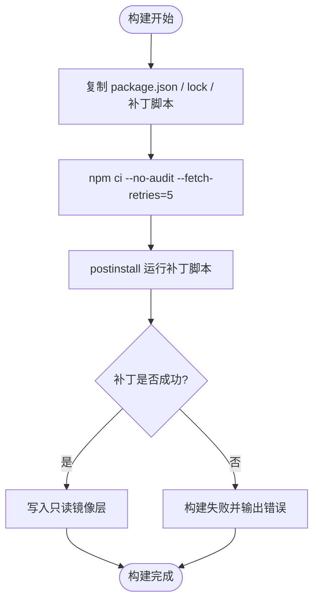
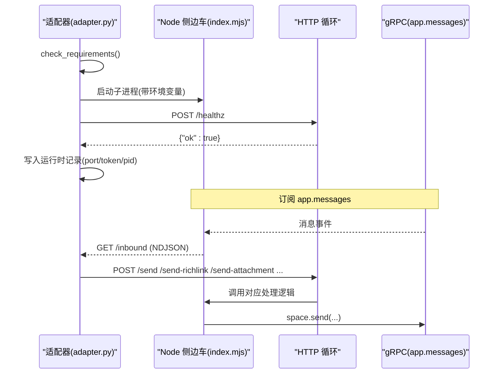
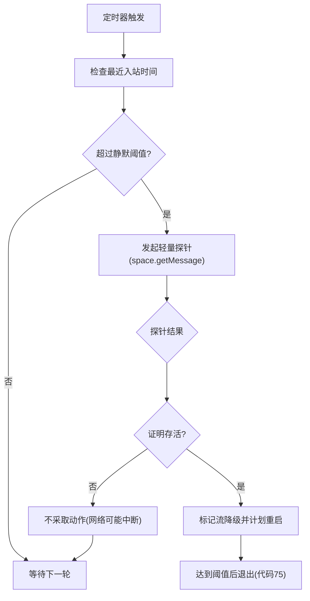
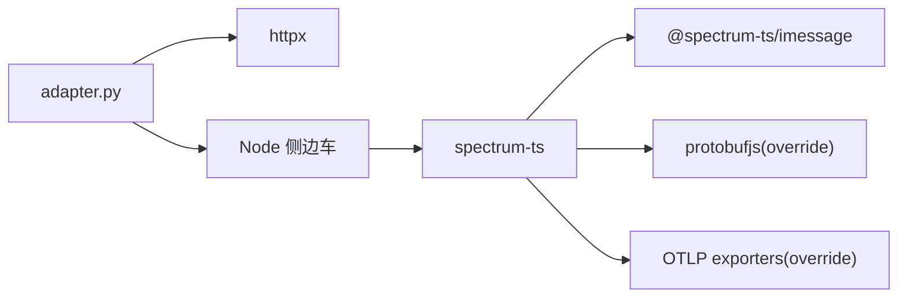

# Photon iMessage 侧边车

<cite>
**本文引用的文件**
- [Dockerfile](file://Dockerfile)
- [plugins/platforms/photon/README.md](file://plugins/platforms/photon/README.md)
- [plugins/platforms/photon/sidecar/package.json](file://plugins/platforms/photon/sidecar/package.json)
- [plugins/platforms/photon/sidecar/index.mjs](file://plugins/platforms/photon/sidecar/index.mjs)
- [plugins/platforms/photon/sidecar/patch-spectrum-mixed-attachments.mjs](file://plugins/platforms/photon/sidecar/patch-spectrum-mixed-attachments.mjs)
- [plugins/platforms/photon/sidecar/stream-staleness.mjs](file://plugins/platforms/photon/sidecar/stream-staleness.mjs)
- [plugins/platforms/photon/sidecar/send-format.mjs](file://plugins/platforms/photon/sidecar/send-format.mjs)
- [plugins/platforms/photon/adapter.py](file://plugins/platforms/photon/adapter.py)
- [plugins/platforms/photon/sidecar_paths.py](file://plugins/platforms/photon/sidecar_paths.py)
</cite>

## 目录
1. [简介](#简介)
2. [项目结构](#项目结构)
3. [核心组件](#核心组件)
4. [架构总览](#架构总览)
5. [详细组件分析](#详细组件分析)
6. [依赖关系分析](#依赖关系分析)
7. [性能与缓存优化](#性能与缓存优化)
8. [故障排除指南](#故障排除指南)
9. [结论](#结论)
10. [附录](#附录)

## 简介
本文件面向 Photon iMessage 插件的 Node.js 侧边车，系统性说明其依赖预烘焙、补丁应用机制、依赖锁定与缓存策略，以及启动流程、与主进程（Python Gateway）通信协议和故障隔离策略。文档同时给出依赖更新与补丁维护的操作指引，帮助在不可变镜像层环境中稳定运行并避免运行时 EROFS 错误。

## 项目结构
Photon iMessage 通道由 Python 适配器与 Node.js 侧边车组成：
- Python 适配器负责生命周期管理、HTTP 调用、消息路由与去重、健康检查与重启策略。
- Node.js 侧边车通过 spectrum-ts SDK 维持与 Photon Spectrum 的 gRPC 长连接，并通过本地 HTTP 暴露控制接口供 Python 侧调用。
- 构建期将 sidecar 的 package.json、package-lock.json 与补丁脚本复制到镜像层，执行 npm ci 安装依赖并运行 postinstall 补丁，确保运行时无需写盘。

**图示来源**
- [Dockerfile:206-220](file://Dockerfile#L206-L220)
- [plugins/platforms/photon/sidecar/index.mjs:1-47](file://plugins/platforms/photon/sidecar/index.mjs#L1-L47)
- [plugins/platforms/photon/sidecar/patch-spectrum-mixed-attachments.mjs:1-17](file://plugins/platforms/photon/sidecar/patch-spectrum-mixed-attachments.mjs#L1-L17)

**章节来源**
- [Dockerfile:206-220](file://Dockerfile#L206-L220)
- [plugins/platforms/photon/README.md:11-43](file://plugins/platforms/photon/README.md#L11-L43)

## 核心组件
- 侧边车入口与 HTTP API：提供 /inbound、/send、/send-richlink、/send-attachment、/typing、/react、/unreact、/send-poll、/send-effect、/healthz、/shutdown 等端点，使用共享令牌认证。
- 补丁脚本：对 @spectrum-ts/imessage 的编译产物进行精确锚点替换，保留混合文本+附件的消息结构。
- 依赖锁定：通过 sidecar/package.json 与 package-lock.json 固定 spectrum-ts 版本，构建期 npm ci 安装，postinstall 自动运行补丁。
- Python 适配器：负责侧边车进程管理、依赖自检与自愈、消息去重、健康探测、超时与重试、独立发送路径（cron/dashboard）。

**章节来源**
- [plugins/platforms/photon/sidecar/index.mjs:17-44](file://plugins/platforms/photon/sidecar/index.mjs#L17-L44)
- [plugins/platforms/photon/sidecar/package.json:1-26](file://plugins/platforms/photon/sidecar/package.json#L1-L26)
- [plugins/platforms/photon/sidecar/patch-spectrum-mixed-attachments.mjs:1-17](file://plugins/platforms/photon/sidecar/patch-spectrum-mixed-attachments.mjs#L1-L17)
- [plugins/platforms/photon/adapter.py:353-455](file://plugins/platforms/photon/adapter.py#L353-L455)

## 架构总览
侧边车作为受管进程运行，Python 适配器通过 loopback HTTP 与其交互；spectrum-ts SDK 通过 gRPC 与 Photon 云端保持长连接。入站消息经 gRPC 流转换为 NDJSON 推送给 Python；出站消息通过 POST 请求发送到侧边车，再由 SDK 转发至 Photon。

**图示来源**
- [plugins/platforms/photon/sidecar/index.mjs:17-44](file://plugins/platforms/photon/sidecar/index.mjs#L17-L44)
- [plugins/platforms/photon/sidecar/index.mjs:644-675](file://plugins/platforms/photon/sidecar/index.mjs#L644-L675)
- [plugins/platforms/photon/adapter.py:693-799](file://plugins/platforms/photon/adapter.py#L693-L799)

## 详细组件分析

### 依赖预烘焙与补丁机制
- 构建期复制 sidecar 清单与补丁脚本，执行 npm ci 安装依赖并触发 postinstall 补丁，确保 node_modules 存在于只读镜像层。
- 补丁脚本以字节级锚点匹配 @spectrum-ts/imessage/dist/*.js 中的两个关键函数，插入“文本优先”的子项，使含文本与附件的混合气泡正确呈现。
- 运行时若检测到未打补丁或补丁失败，会输出明确错误并提示重新安装或升级补丁。

**图示来源**
- [Dockerfile:206-220](file://Dockerfile#L206-L220)
- [plugins/platforms/photon/sidecar/package.json:8-11](file://plugins/platforms/photon/sidecar/package.json#L8-L11)
- [plugins/platforms/photon/sidecar/patch-spectrum-mixed-attachments.mjs:118-163](file://plugins/platforms/photon/sidecar/patch-spectrum-mixed-attachments.mjs#L118-L163)

**章节来源**
- [Dockerfile:206-220](file://Dockerfile#L206-L220)
- [plugins/platforms/photon/sidecar/package.json:1-26](file://plugins/platforms/photon/sidecar/package.json#L1-L26)
- [plugins/platforms/photon/sidecar/patch-spectrum-mixed-attachments.mjs:1-17](file://plugins/platforms/photon/sidecar/patch-spectrum-mixed-attachments.mjs#L1-L17)
- [plugins/platforms/photon/sidecar/patch-spectrum-mixed-attachments.mjs:118-163](file://plugins/platforms/photon/sidecar/patch-spectrum-mixed-attachments.mjs#L118-L163)

### 依赖锁定与缓存优化
- 使用 exact version 锁定 spectrum-ts，避免破坏性升级影响生产环境。
- 通过 package-lock.json 保证可重复安装；构建层仅当清单或补丁变化时失效，提升缓存命中率。
- 运行时禁用懒安装（HERMES_DISABLE_LAZY_INSTALLS），所有依赖必须预烘焙，避免在只读层写盘导致 EROFS。

**章节来源**
- [plugins/platforms/photon/README.md:180-205](file://plugins/platforms/photon/README.md#L180-L205)
- [Dockerfile:206-220](file://Dockerfile#L206-L220)
- [Dockerfile:378-380](file://Dockerfile#L378-L380)

### 侧边车启动流程与通信机制
- 启动前检查 Node、httpx 与依赖是否存在；若可写且 npm 可用，尝试冷安装并运行 postinstall 补丁。
- 启动后通过 /healthz 就绪检查，成功后持久化运行时记录（端口、令牌、PID），供外部进程安全访问。
- 入站：GET /inbound 返回 NDJSON 流，按 messageId 去重后派发 MessageEvent。
- 出站：POST /send、/send-richlink、/send-attachment、/typing、/react、/unreact、/send-poll、/send-effect，统一使用 X-Hermes-Sidecar-Token 鉴权。

**图示来源**
- [plugins/platforms/photon/adapter.py:404-455](file://plugins/platforms/photon/adapter.py#L404-L455)
- [plugins/platforms/photon/adapter.py:121-172](file://plugins/platforms/photon/adapter.py#L121-L172)
- [plugins/platforms/photon/sidecar/index.mjs:17-44](file://plugins/platforms/photon/sidecar/index.mjs#L17-L44)
- [plugins/platforms/photon/sidecar/index.mjs:644-675](file://plugins/platforms/photon/sidecar/index.mjs#L644-L675)

**章节来源**
- [plugins/platforms/photon/adapter.py:404-455](file://plugins/platforms/photon/adapter.py#L404-L455)
- [plugins/platforms/photon/adapter.py:121-172](file://plugins/platforms/photon/adapter.py#L121-L172)
- [plugins/platforms/photon/sidecar/index.mjs:17-44](file://plugins/platforms/photon/sidecar/index.mjs#L17-L44)

### 故障隔离与健康探测
- 侧边车内部维护流健康状态与“僵尸流”检测：当长时间无入站消息时，发起轻量探针验证上游连通性；若判定为半开 gRPC 流，则标记降级并在阈值后退出以便上层重启。
- Python 适配器侧有二次健康探测：周期性探测侧边车 HTTP 响应，连续失败达到阈值后重启侧边车。
- 入站流异常时采用指数退避重连；超大附件或读取失败时回退为元数据提示，避免阻塞主循环。

**图示来源**
- [plugins/platforms/photon/sidecar/index.mjs:677-768](file://plugins/platforms/photon/sidecar/index.mjs#L677-L768)
- [plugins/platforms/photon/sidecar/stream-staleness.mjs:1-200](file://plugins/platforms/photon/sidecar/stream-staleness.mjs#L1-L200)
- [plugins/platforms/photon/adapter.py:741-799](file://plugins/platforms/photon/adapter.py#L741-L799)

**章节来源**
- [plugins/platforms/photon/sidecar/index.mjs:677-768](file://plugins/platforms/photon/sidecar/index.mjs#L677-L768)
- [plugins/platforms/photon/sidecar/stream-staleness.mjs:1-200](file://plugins/platforms/photon/sidecar/stream-staleness.mjs#L1-L200)
- [plugins/platforms/photon/adapter.py:741-799](file://plugins/platforms/photon/adapter.py#L741-L799)

### 补丁维护与升级流程
- 升级 spectrum-ts 时需：
  - 阅读发布说明，确认破坏性变更。
  - 更新 sidecar/package.json 中的 exact pin，并重新生成 package-lock.json。
  - 迁移 sidecar/index.mjs 以适配新类型定义。
  - 重新验证 patch-spectrum-mixed-attachments.mjs 的锚点是否仍匹配新构建产物。
  - 运行测试套件与端到端验证（包括 group rehydration）。

**章节来源**
- [plugins/platforms/photon/README.md:180-205](file://plugins/platforms/photon/README.md#L180-L205)
- [plugins/platforms/photon/sidecar/patch-spectrum-mixed-attachments.mjs:118-163](file://plugins/platforms/photon/sidecar/patch-spectrum-mixed-attachments.mjs#L118-L163)

## 依赖关系分析
- 侧边车依赖 spectrum-ts 及其 iMessage provider；通过 overrides 固定 protobufjs 与 OTLP 相关包版本，确保兼容性与稳定性。
- Python 适配器依赖 httpx 用于 HTTP 调用；Node 二进制通过 PHOTON_NODE_BIN 或 PATH 解析。
- 构建期依赖：npm、node；运行时依赖：已安装的 node_modules（只读镜像层）。

**图示来源**
- [plugins/platforms/photon/sidecar/package.json:15-24](file://plugins/platforms/photon/sidecar/package.json#L15-L24)
- [plugins/platforms/photon/adapter.py:44-56](file://plugins/platforms/photon/adapter.py#L44-L56)

**章节来源**
- [plugins/platforms/photon/sidecar/package.json:15-24](file://plugins/platforms/photon/sidecar/package.json#L15-L24)
- [plugins/platforms/photon/adapter.py:44-56](file://plugins/platforms/photon/adapter.py#L44-L56)

## 性能与缓存优化
- 构建期 npm ci 安装并缓存层，仅在清单或补丁变化时重建，减少冷构建时间。
- 运行时禁用懒安装，避免在只读层写盘；所有依赖预烘焙，提高首次启动速度。
- 入站大附件限制内联大小，超出部分仅传递元数据，防止单条消息膨胀。
- 僵尸流探针与降级重启机制降低长连接挂死风险，提升整体可用性。

**章节来源**
- [Dockerfile:206-220](file://Dockerfile#L206-L220)
- [Dockerfile:378-380](file://Dockerfile#L378-L380)
- [plugins/platforms/photon/sidecar/index.mjs:85-91](file://plugins/platforms/photon/sidecar/index.mjs#L85-L91)
- [plugins/platforms/photon/sidecar/index.mjs:677-768](file://plugins/platforms/photon/sidecar/index.mjs#L677-L768)

## 故障排除指南
- EROFS 错误：确保依赖已在构建期安装（npm ci），运行时不要尝试写 node_modules；检查 HERMES_DISABLE_LAZY_INSTALLS 设置。
- 补丁失败：确认 @spectrum-ts/imessage 的 dist 文件存在且未被修改；若 spectrum-ts 版本升级，需同步更新补丁锚点。
- 依赖缺失：检查 sidecar/node_modules/spectrum-ts 是否存在；若不存在且目录可写，适配器将尝试冷安装；否则需运行 setup 或手动 npm ci。
- 健康检查失败：查看 /healthz 响应；若侧边车进程死亡，适配器会基于运行时记录清理并尝试重启。
- 入站流停滞：观察侧边车日志中 stream interrupted/persistently failing；必要时等待自动重连或触发重启。

**章节来源**
- [Dockerfile:206-220](file://Dockerfile#L206-L220)
- [plugins/platforms/photon/sidecar/patch-spectrum-mixed-attachments.mjs:118-163](file://plugins/platforms/photon/sidecar/patch-spectrum-mixed-attachments.mjs#L118-L163)
- [plugins/platforms/photon/adapter.py:353-455](file://plugins/platforms/photon/adapter.py#L353-L455)
- [plugins/platforms/photon/sidecar/index.mjs:644-675](file://plugins/platforms/photon/sidecar/index.mjs#L644-L675)

## 结论
Photon iMessage 侧边车通过构建期依赖预烘焙与精确补丁，结合严格的依赖锁定与运行时健康探测，实现了在不可变镜像层下的稳定运行与高可用通信。Python 适配器与 Node 侧边车的职责清晰、边界明确，配合完善的故障隔离与自愈机制，有效避免了运行时 EROFS 与僵尸流问题。升级与维护流程严谨，便于长期演进。

## 附录
- 配置与环境变量：参考 README 中的配置表，如 PHOTON_PROJECT_ID、PHOTON_PROJECT_SECRET、PHOTON_SIDECAR_PORT、PHOTON_SIDECAR_AUTOSTART、PHOTON_MARKDOWN、PHOTON_REACTIONS 等。
- 运行时记录：适配器在侧边车就绪后写入 runtime/photon-sidecar.json，供外部进程安全访问。
- 安全：所有侧边车请求需携带 X-Hermes-Sidecar-Token；body 大小限制防御拒绝服务。

**章节来源**
- [plugins/platforms/photon/README.md:110-129](file://plugins/platforms/photon/README.md#L110-L129)
- [plugins/platforms/photon/adapter.py:121-172](file://plugins/platforms/photon/adapter.py#L121-L172)
- [plugins/platforms/photon/sidecar/index.mjs:770-800](file://plugins/platforms/photon/sidecar/index.mjs#L770-L800)