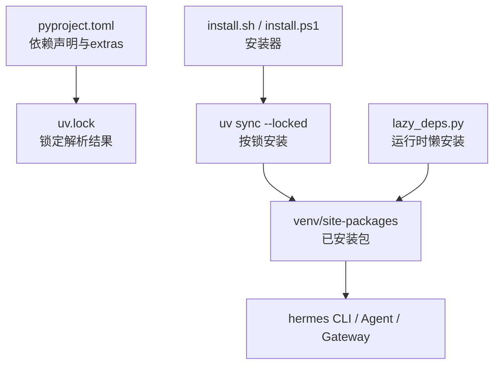
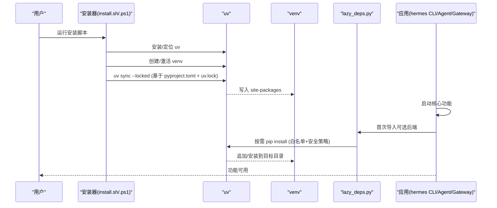
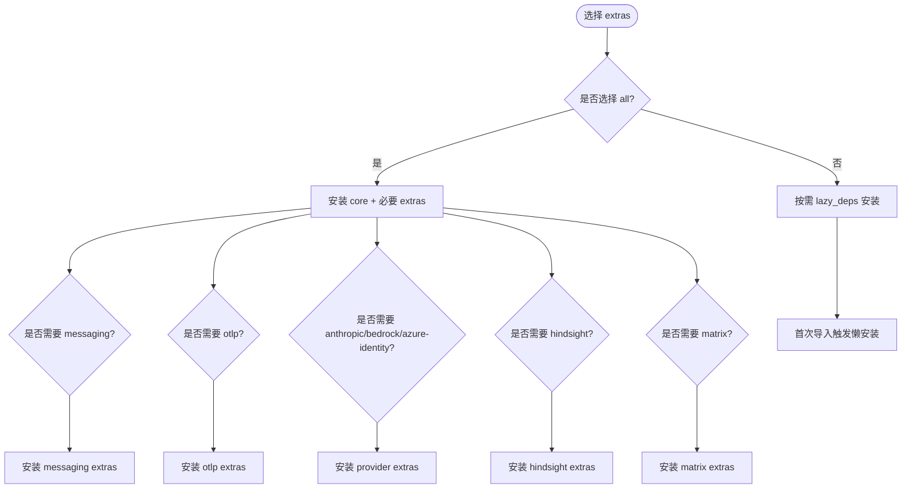
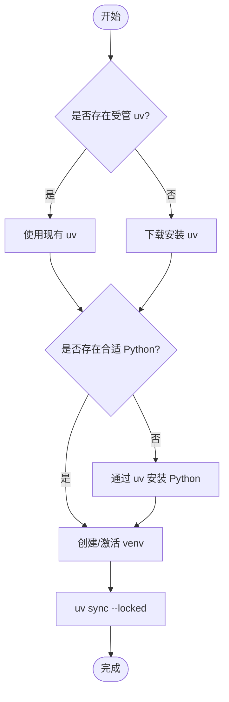
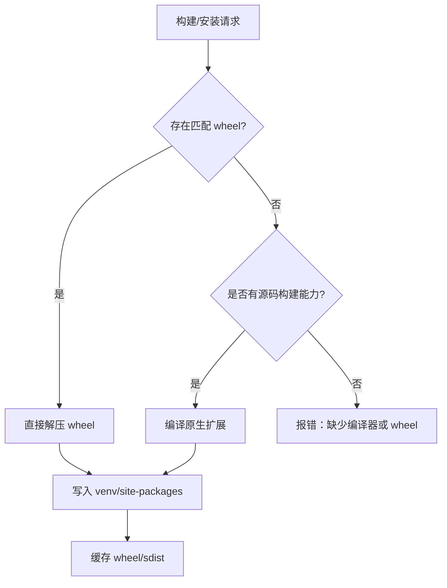
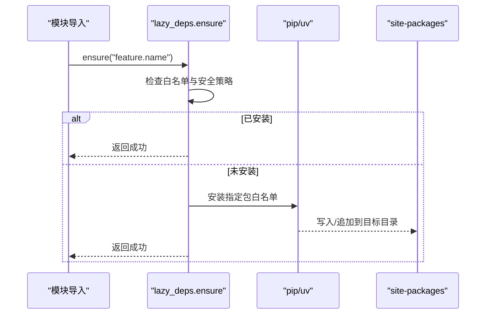
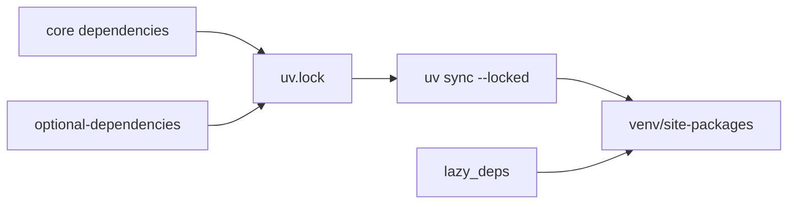

# Python 依赖安装

<cite>
**本文引用的文件**
- [pyproject.toml](file://pyproject.toml)
- [uv.lock](file://uv.lock)
- [install.sh](file://scripts/install.sh)
- [install.ps1](file://scripts/install.ps1)
- [lazy_deps.py](file://tools/lazy_deps.py)
</cite>

## 目录
1. [简介](#简介)
2. [项目结构](#项目结构)
3. [核心组件](#核心组件)
4. [架构总览](#架构总览)
5. [详细组件分析](#详细组件分析)
6. [依赖关系分析](#依赖关系分析)
7. [性能考虑](#性能考虑)
8. [故障排查指南](#故障排查指南)
9. [结论](#结论)
10. [附录](#附录)

## 简介
本文件面向使用 uv 进行 Python 依赖管理的开发者与运维人员，系统说明 hermes-agent 的依赖声明、锁定、预安装机制、原生扩展编译、wheel 缓存优化、层缓存策略，以及可选 extras（all、messaging、otlp、anthropic、bedrock、azure-identity、hindsight、matrix）的选择原因与作用。文档还覆盖 README.md 引用问题、可编辑安装与符号链接创建、权限设置、依赖冲突解决、构建失败排查与性能优化建议。

## 项目结构
- 依赖声明集中在 pyproject.toml：核心依赖精确锁定，可选功能通过 optional-dependencies 拆分；[tool.uv] 提供覆盖与“排除新包”策略。
- 依赖解析结果锁定在 uv.lock：包含所有包的版本、来源、哈希与平台 wheel 列表，确保跨环境一致。
- 安装脚本 scripts/install.sh 与 scripts/install.ps1：负责检测/安装 uv、Python、Node，克隆仓库，创建 venv，执行 uv 同步，并处理平台差异与权限。
- 运行时懒加载 tools/lazy_deps.py：将非必需后端按需安装到当前 venv 或持久化目标目录，避免默认安装膨胀与供应链风险。

**图表来源**
- [pyproject.toml:1-450](file://pyproject.toml#L1-L450)
- [uv.lock:1-200](file://uv.lock#L1-L200)
- [install.sh:549-653](file://scripts/install.sh#L549-L653)
- [install.ps1:689-735](file://scripts/install.ps1#L689-L735)
- [lazy_deps.py:1-66](file://tools/lazy_deps.py#L1-L66)

**章节来源**
- [pyproject.toml:1-450](file://pyproject.toml#L1-L450)
- [uv.lock:1-200](file://uv.lock#L1-L200)
- [install.sh:549-653](file://scripts/install.sh#L549-L653)
- [install.ps1:689-735](file://scripts/install.ps1#L689-L735)
- [lazy_deps.py:1-66](file://tools/lazy_deps.py#L1-L66)

## 核心组件
- 依赖声明与策略
  - 核心依赖采用精确版本锁定，避免上游任意更新引入不可控变更。
  - 可选功能以 extras 形式拆分，减少默认安装体积与攻击面。
  - 通过 [tool.uv] 的 override-dependencies 与 exclude-newer 控制第三方依赖范围与时效。
- 锁定与一致性
  - uv.lock 记录完整解析结果，包括包、版本、来源、哈希与多平台 wheel，保证跨机器一致。
- 安装流程
  - 安装器自动管理 uv、Python、Node，创建 venv，调用 uv sync --locked 按锁安装。
  - Termux 等受限环境回退到 stdlib venv + pip。
- 运行时懒安装
  - 对非必需后端（如 provider.anthropic、provider.bedrock、export.otlp、memory.hindsight 等），首次导入时按需安装，支持安全白名单与持久化目标模式。

**章节来源**
- [pyproject.toml:18-155](file://pyproject.toml#L18-L155)
- [pyproject.toml:157-352](file://pyproject.toml#L157-L352)
- [pyproject.toml:363-372](file://pyproject.toml#L363-L372)
- [uv.lock:1-20](file://uv.lock#L1-L20)
- [lazy_deps.py:1-66](file://tools/lazy_deps.py#L1-L66)
- [lazy_deps.py:97-200](file://tools/lazy_deps.py#L97-L200)

## 架构总览
下图展示从安装到运行时的依赖装配路径：安装器准备环境与工具链，uv 依据 pyproject.toml 与 uv.lock 解析并安装依赖；运行时按需懒安装可选后端；最终由 CLI/Agent/Gateway 消费。

**图表来源**
- [install.sh:549-653](file://scripts/install.sh#L549-L653)
- [install.ps1:689-735](file://scripts/install.ps1#L689-L735)
- [pyproject.toml:1-450](file://pyproject.toml#L1-L450)
- [uv.lock:1-200](file://uv.lock#L1-L200)
- [lazy_deps.py:1-66](file://tools/lazy_deps.py#L1-L66)

## 详细组件分析

### 依赖声明与 extras 选择
- all
  - 仅包含无法被 lazy_deps 替代且每个会话都可能需要的能力（如 CLI、pty、mcp、homeassistant、sms、acp、google、web、youtube）。
  - 设计原则：任何可选后端必须走 lazy_deps，避免上游污染影响全新安装。
- messaging
  - 聚合消息通道相关依赖（telegram、discord、slack、aiohttp、brotlicffi、qrcode 等）。
  - 必要性：仅在启用对应消息平台时才需要，避免默认安装膨胀。
- otlp
  - OpenTelemetry SDK 与 OTLP HTTP 导出器，用于网关健康监控导出。
  - 必要性：仅在启用 OTLP 导出时使用，属于可选观测能力。
- anthropic
  - Anthropic 官方 SDK，当 provider=anthropic（非聚合器）时需要。
  - 必要性：避免非 Anthropic 用户承担无关依赖。
- bedrock
  - AWS Bedrock 客户端，仅在启用 Bedrock 提供商时使用。
- azure-identity
  - Azure Entra ID 认证，仅在 model.auth_mode=entra_id 时使用。
- hindsight
  - 审计/回溯客户端，作为可选记忆/审计能力，默认不安装。
- matrix
  - Matrix 协议客户端（mautrix 等），含加密依赖，平台限制较多，适合懒安装。

**图表来源**
- [pyproject.toml:157-352](file://pyproject.toml#L157-L352)
- [lazy_deps.py:97-200](file://tools/lazy_deps.py#L97-L200)

**章节来源**
- [pyproject.toml:157-352](file://pyproject.toml#L157-L352)
- [lazy_deps.py:97-200](file://tools/lazy_deps.py#L97-L200)

### 依赖预安装机制（安装器）
- 自动安装/定位 uv：优先使用受管 uv 路径，否则下载并安装到 $HERMES_HOME/bin。
- 自动安装/定位 Python：通过 uv python find/install 获取所需版本。
- 创建 venv 并执行 uv sync --locked：严格遵循 uv.lock 解析结果，确保一致性。
- 平台差异：Termux 回退到 stdlib venv + pip；Windows 使用 PowerShell 安装器。

**图表来源**
- [install.sh:549-653](file://scripts/install.sh#L549-L653)
- [install.ps1:689-735](file://scripts/install.ps1#L689-L735)

**章节来源**
- [install.sh:549-653](file://scripts/install.sh#L549-L653)
- [install.ps1:689-735](file://scripts/install.ps1#L689-L735)

### 原生扩展编译与 wheel 缓存优化
- 原生扩展
  - 部分依赖（如 nemo-relay、某些语音/图像库）可能包含原生模块，需匹配平台 wheel。
  - 若缺少对应 wheel，将尝试源码构建（maturin/cython 等），要求本地编译器工具链。
- wheel 缓存
  - uv 会缓存下载的 wheel 与 sdist，重复安装可显著加速。
  - 可通过环境变量或配置调整缓存位置（例如 CI 中挂载共享缓存目录）。
- 层缓存策略（容器/镜像）
  - 将 uv 缓存目录置于独立层，并在依赖稳定时复用该层，减少重建开销。
  - 在 Docker 构建中，先安装依赖再复制代码，利用层缓存提升构建速度。

**图表来源**
- [pyproject.toml:140-155](file://pyproject.toml#L140-L155)
- [uv.lock:70-145](file://uv.lock#L70-L145)

**章节来源**
- [pyproject.toml:140-155](file://pyproject.toml#L140-L155)
- [uv.lock:70-145](file://uv.lock#L70-L145)

### README.md 引用问题
- pyproject.toml 中 readme 字段指向 README.md，打包/发布时需确保该文件存在。
- 若 README 缺失或路径错误，可能导致元数据生成失败或文档站点引用异常。
- 建议在 CI 中校验 README 存在性，或在构建阶段生成占位文件。

**章节来源**
- [pyproject.toml:3-8](file://pyproject.toml#L3-L8)

### 可编辑安装与符号链接创建、权限设置
- 可编辑安装（pip install -e 或 uv pip install -e）会在 site-packages 创建 .egg-link 或等效符号链接，指向源码目录，便于开发调试。
- 符号链接权限
  - Windows 上可能需要管理员权限或开发者模式以创建符号链接。
  - Linux/macOS 通常无需特殊权限，但需确保目标目录可写。
- 安装器中的命令链接
  - 安装器会将 hermes 命令链接到 PATH 下的目录（如 ~/.local/bin 或 /usr/local/bin），需确保该目录可写且对当前用户可见。

**章节来源**
- [install.sh:450-497](file://scripts/install.sh#L450-L497)
- [install.ps1:737-800](file://scripts/install.ps1#L737-L800)

### 运行时懒安装（lazy_deps）
- 安全模型
  - 白名单：仅允许 LAZY_DEPS 中声明的包名与版本范围。
  - 目标隔离：默认安装到当前 venv；在只读镜像中可重定向到持久化目标目录，并追加到 sys.path 末尾，避免覆盖核心模块。
  - 可关闭：通过配置项禁用运行时安装。
- 典型场景
  - 首次导入 provider.anthropic/provider.bedrock/export.otlp/memory.hindsight 等时触发安装。
  - 安装失败时抛出明确错误，提示手动安装或检查网络/镜像。

**图表来源**
- [lazy_deps.py:1-66](file://tools/lazy_deps.py#L1-L66)
- [lazy_deps.py:97-200](file://tools/lazy_deps.py#L97-L200)

**章节来源**
- [lazy_deps.py:1-66](file://tools/lazy_deps.py#L1-L66)
- [lazy_deps.py:97-200](file://tools/lazy_deps.py#L97-L200)

## 依赖关系分析
- 核心依赖精确锁定，降低供应链风险；可选依赖通过 extras 与 lazy_deps 分离。
- uv.lock 提供全量解析结果，确保跨环境一致性。
- 平台标记与条件依赖（如 Windows 专用依赖、Android/Termux 回退）在安装期正确筛选。

**图表来源**
- [pyproject.toml:18-155](file://pyproject.toml#L18-L155)
- [pyproject.toml:157-352](file://pyproject.toml#L157-L352)
- [uv.lock:1-200](file://uv.lock#L1-L200)

**章节来源**
- [pyproject.toml:18-155](file://pyproject.toml#L18-L155)
- [pyproject.toml:157-352](file://pyproject.toml#L157-L352)
- [uv.lock:1-200](file://uv.lock#L1-L200)

## 性能考虑
- 使用 uv 替代 pip：更快的依赖解析与安装，更好的缓存命中。
- 使用 --locked：严格遵循 uv.lock，避免每次解析差异导致的重新安装。
- 缓存目录共享：在 CI/容器中挂载共享缓存目录，减少重复下载与编译。
- 分层构建：先安装依赖再复制代码，最大化利用构建层缓存。
- 精简 extras：默认仅安装必要依赖，其余通过 lazy_deps 按需加载。

## 故障排查指南
- 依赖冲突
  - 现象：uv sync 报解析冲突或版本不兼容。
  - 处理：检查 pyproject.toml 中的 exact pins 与 overrides；必要时调整版本并重新生成 uv.lock。
- 构建失败（原生扩展）
  - 现象：缺少编译器或 wheel 不匹配导致源码构建失败。
  - 处理：安装系统编译器（如 Xcode CLT、build-essential）、确认平台架构与 Python 版本匹配；或使用预编译 wheel。
- 网络/镜像问题
  - 现象：PyPI 访问失败、包被隔离或 quarantined。
  - 处理：检查网络代理与证书；使用内部镜像；参考 lazy_deps 的错误提示手动安装。
- 权限问题
  - 现象：无法写入 venv 或创建符号链接。
  - 处理：确保目标目录可写；Windows 下以管理员运行或启用开发者模式；Linux 下检查用户组与 SELinux/AppArmor。
- 可编辑安装失败
  - 现象：.egg-link 或符号链接创建失败。
  - 处理：检查文件系统权限；在 Windows 上确认符号链接权限；清理残留链接后重试。

**章节来源**
- [pyproject.toml:363-372](file://pyproject.toml#L363-L372)
- [uv.lock:1-200](file://uv.lock#L1-L200)
- [lazy_deps.py:1-66](file://tools/lazy_deps.py#L1-L66)

## 结论
本项目通过 pyproject.toml 精确声明依赖、uv.lock 锁定解析结果、安装器自动化准备环境、lazy_deps 实现运行时按需安装，构建了安全、高效、可扩展的依赖管理体系。合理选择 extras 与启用懒安装，既能控制默认体积，又能保障供应链安全与跨平台兼容性。配合缓存优化与分层构建，可显著提升开发与部署效率。

## 附录
- 常用命令
  - 安装依赖：uv sync --locked
  - 更新锁文件：uv lock
  - 安装 extras：uv sync --extra <name>
  - 可编辑安装：uv pip install -e .
- 环境变量
  - UV_PYTHON_INSTALL_DIR、UV_PYTHON_BIN_DIR：控制 uv 管理的 Python 安装位置（root 安装场景）。
  - HERMES_LAZY_INSTALL_TARGET：将懒安装重定向到持久化目录（只读镜像场景）。
  - HERMES_DISABLE_LAZY_INSTALLS：禁用运行时懒安装（生产镜像默认开启）。