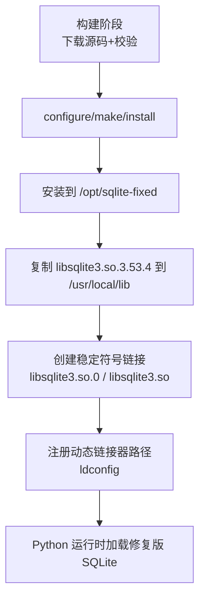
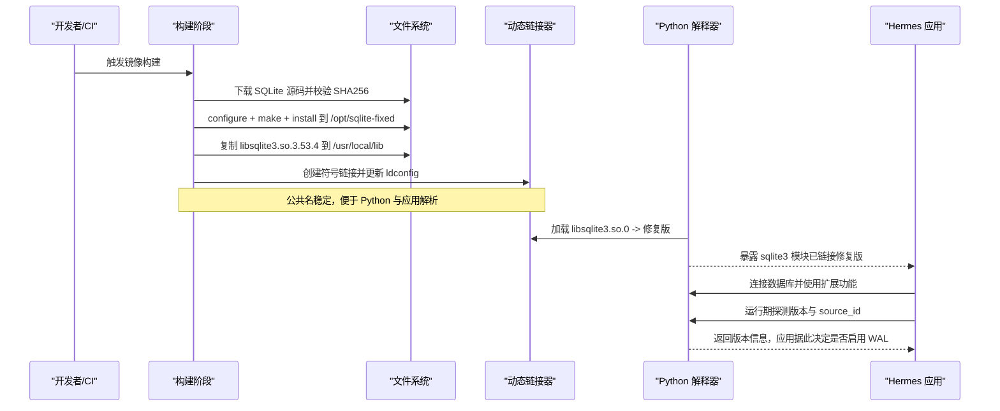
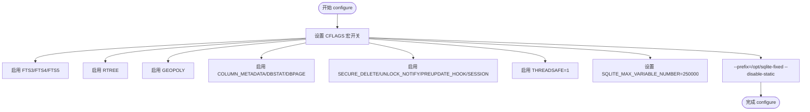
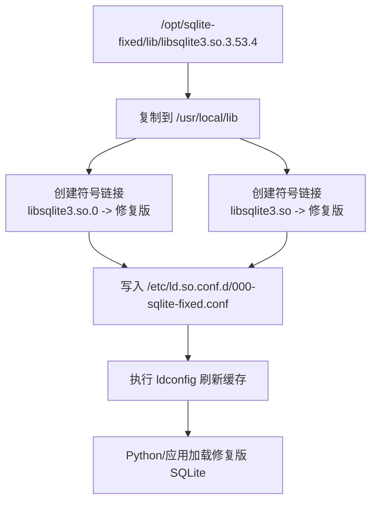
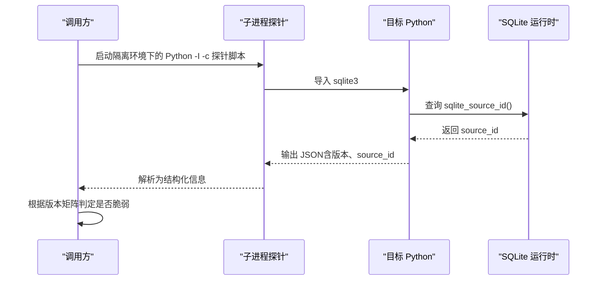
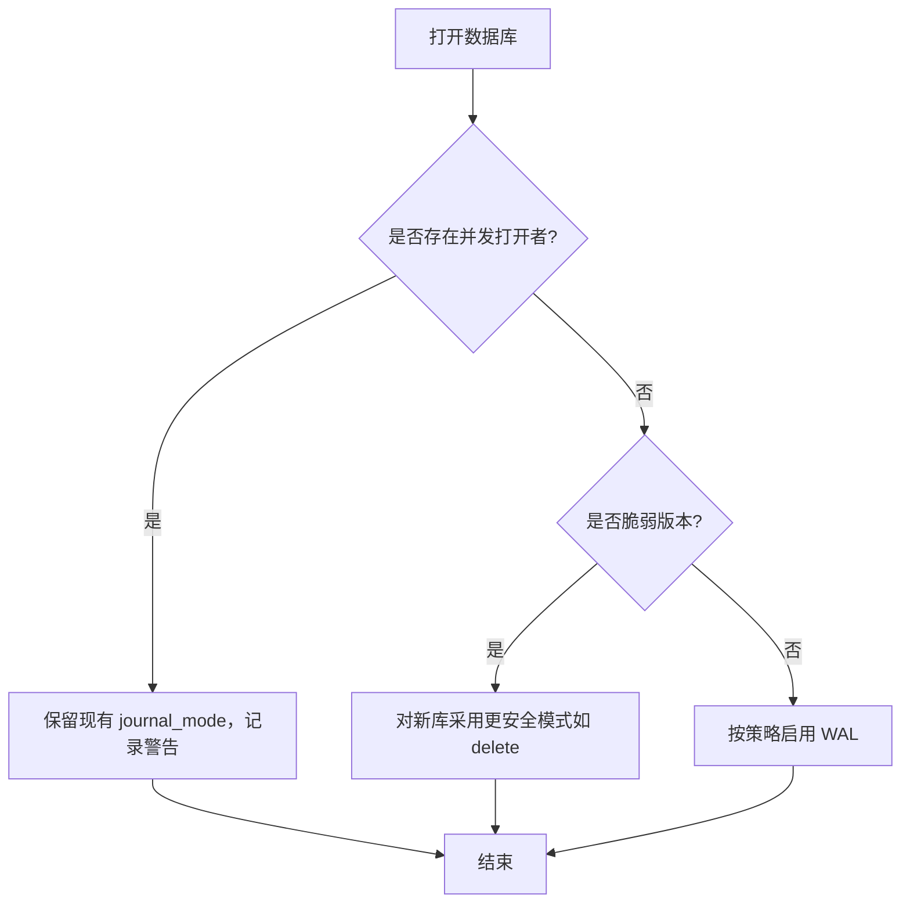
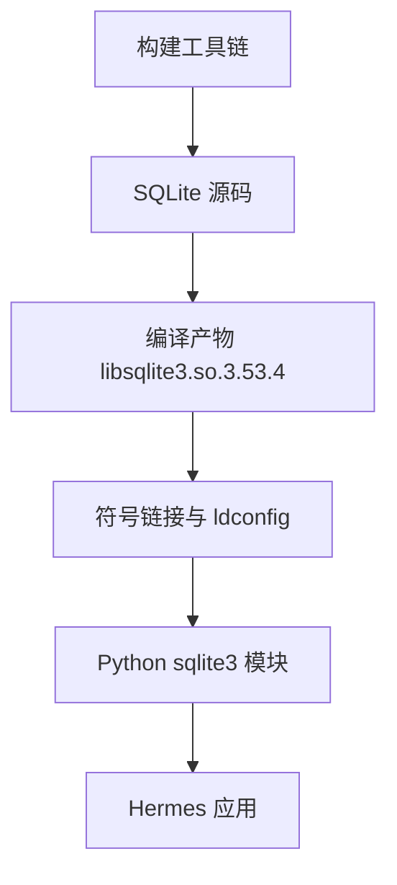

# SQLite 固定版本编译

<cite>
**本文引用的文件**
- [Dockerfile](file://Dockerfile)
- [hermes_cli/sqlite_runtime.py](file://hermes_cli/sqlite_runtime.py)
- [tests/test_sqlite_wal_reset_gate.py](file://tests/test_sqlite_wal_reset_gate.py)
- [native/fts5_cjk/build.sh](file://native/fts5_cjk/build.sh)
</cite>

## 目录
1. [简介](#简介)
2. [项目结构](#项目结构)
3. [核心组件](#核心组件)
4. [架构总览](#架构总览)
5. [详细组件分析](#详细组件分析)
6. [依赖关系分析](#依赖关系分析)
7. [性能考虑](#性能考虑)
8. [故障排除指南](#故障排除指南)
9. [结论](#结论)
10. [附录](#附录)

## 简介
本文件面向需要在 Debian 13（trixie）环境中使用“修复版”SQLite 的运维与开发者，说明为何需要自定义编译 SQLite、如何配置构建参数、如何安装并让系统 Python 与应用通过库链接机制加载到修复后的版本。Debian 13 默认提供 SQLite 3.46.1，该版本存在上游 WAL-reset 损坏缺陷；本项目在容器镜像中通过固定源码版本、校验和验证、启用必要扩展与线程安全选项，构建出稳定的 libsqlite3，并通过符号链接替换系统共享库，确保 Python 与所有应用均能使用修复后的 SQLite。

## 项目结构
围绕 SQLite 固定版本的构建与集成，仓库中与本主题直接相关的部分包括：
- 容器构建阶段：在 Dockerfile 中下载指定版本的 SQLite 源码，执行 configure/make/install，并将产物放入 /opt/sqlite-fixed。
- 运行时链接：将构建出的 libsqlite3.so.3.53.4 复制到 /usr/local/lib，创建稳定公共名符号链接，注册动态链接器路径并刷新缓存。
- 运行期探测：通过独立子进程探针读取 sqlite3.sqlite_version_info 与 source_id，判断是否仍受 WAL-reset 漏洞影响。
- 测试与门控：针对 WAL-reset 漏洞的版本矩阵与并发场景进行严格断言，确保不会错误降级或破坏已有 WAL 数据库。
- 可选扩展：fts5_cjk 构建脚本演示了如何在缺少系统头文件时回退到内嵌头文件，便于本地快速构建 CJK FTS5 扩展。

**图示来源**
- [Dockerfile:1-41](file://Dockerfile#L1-L41)
- [Dockerfile:76-91](file://Dockerfile#L76-L91)

**章节来源**
- [Dockerfile:1-41](file://Dockerfile#L1-L41)
- [Dockerfile:76-91](file://Dockerfile#L76-L91)

## 核心组件
- 固定版本 SQLite 构建与安装：在 Dockerfile 中声明固定源码版本与 SHA256，下载后校验，再执行 configure 并启用所需宏定义，最后 make install。
- 运行时链接替换：将构建产物复制到系统库目录，建立稳定公共名符号链接，写入 ldconfig 配置并刷新，使系统 Python 与应用优先加载修复版。
- 运行期检测：通过 hermes_cli/sqlite_runtime.py 中的探针脚本，隔离环境变量后启动子进程查询 SQLite 版本与 source_id，并基于版本矩阵判断是否仍受 WAL-reset 漏洞影响。
- 测试门控：tests/test_sqlite_wal_reset_gate.py 覆盖版本矩阵、并发打开、模式切换等边界场景，确保在脆弱版本下不启用 WAL 或避免危险降级。
- 可选扩展构建：native/fts5_cjk/build.sh 展示如何在不安装 libsqlite3-dev 的情况下，使用 vendored 头文件构建 fts5_cjk 扩展。

**章节来源**
- [Dockerfile:1-41](file://Dockerfile#L1-L41)
- [Dockerfile:76-91](file://Dockerfile#L76-L91)
- [hermes_cli/sqlite_runtime.py:18-53](file://hermes_cli/sqlite_runtime.py#L18-L53)
- [hermes_cli/sqlite_runtime.py:56-125](file://hermes_cli/sqlite_runtime.py#L56-L125)
- [tests/test_sqlite_wal_reset_gate.py:35-57](file://tests/test_sqlite_wal_reset_gate.py#L35-L57)
- [native/fts5_cjk/build.sh:1-20](file://native/fts5_cjk/build.sh#L1-L20)

## 架构总览
下图展示了从源码下载到运行时加载的完整链路，以及关键的安全与兼容性检查点。

**图示来源**
- [Dockerfile:1-41](file://Dockerfile#L1-L41)
- [Dockerfile:76-91](file://Dockerfile#L76-L91)
- [hermes_cli/sqlite_runtime.py:56-125](file://hermes_cli/sqlite_runtime.py#L56-L125)

## 详细组件分析

### 为什么需要自定义编译 SQLite
- Debian 13 默认提供的 SQLite 3.46.1 包含上游 WAL-reset 损坏缺陷，可能导致 WAL 日志异常重置并引发数据损坏风险。
- 项目通过固定源码版本与校验和，构建不受该缺陷影响的 SQLite 版本，并在运行时通过版本矩阵判定是否仍受影响。
- 若检测到脆弱版本，应用层会采取保守策略（例如对新建数据库采用更安全的日志模式），避免在并发场景下出现危险降级。

**章节来源**
- [Dockerfile:1-4](file://Dockerfile#L1-L4)
- [hermes_cli/sqlite_runtime.py:24-37](file://hermes_cli/sqlite_runtime.py#L24-L37)
- [tests/test_sqlite_wal_reset_gate.py:35-57](file://tests/test_sqlite_wal_reset_gate.py#L35-L57)

### 源码下载与校验和验证
- 构建阶段从官方源或备选源下载指定版本的 SQLite 源码压缩包。
- 使用预定义的 SHA256 值进行完整性校验，防止中间人篡改或网络污染。
- 解压源码后进入源码目录执行后续构建步骤。

**章节来源**
- [Dockerfile:6-21](file://Dockerfile#L6-L21)

### 编译参数配置与扩展启用
- 启用全文搜索与地理空间能力：FTS3/FTS4/FTS5、RTREE、GEOPOLY。
- 启用元数据与调试相关特性：COLUMN_METADATA、DBSTAT_VTAB、DBPAGE_VTAB、UNLOCK_NOTIFY、MATH_FUNCTIONS、PREUPDATE_HOOK、SESSION。
- 安全与稳定性：SECURE_DELETE、THREADSAFE=1。
- 性能与容量：SQLITE_MAX_VARIABLE_NUMBER=250000，提升大语句变量上限。
- 安装前缀与静态库禁用：--prefix=/opt/sqlite-fixed --disable-static，便于集中管理与部署。

**图示来源**
- [Dockerfile:22-41](file://Dockerfile#L22-L41)

**章节来源**
- [Dockerfile:22-41](file://Dockerfile#L22-L41)

### 安装路径配置与库链接机制
- 将构建产物安装到 /opt/sqlite-fixed，随后复制 libsqlite3.so.3.53.4 到 /usr/local/lib。
- 创建稳定公共名符号链接：libsqlite3.so.0 与 libsqlite3.so，指向修复版二进制。
- 将 /usr/local/lib 加入动态链接器搜索路径，并执行 ldconfig 刷新缓存。
- 这样系统 Python 与任何依赖 libsqlite3 的应用都会优先加载修复版库。

**图示来源**
- [Dockerfile:76-91](file://Dockerfile#L76-L91)

**章节来源**
- [Dockerfile:76-91](file://Dockerfile#L76-L91)

### 运行期探测与漏洞判定
- 通过独立子进程执行探针脚本，避免继承的环境变量干扰，获取目标 Python 解释器的 SQLite 版本信息与 source_id。
- 基于版本矩阵判断是否仍受 WAL-reset 漏洞影响，供上层逻辑决定是否启用 WAL 或采取降级策略。

**图示来源**
- [hermes_cli/sqlite_runtime.py:56-125](file://hermes_cli/sqlite_runtime.py#L56-L125)

**章节来源**
- [hermes_cli/sqlite_runtime.py:18-53](file://hermes_cli/sqlite_runtime.py#L18-L53)
- [hermes_cli/sqlite_runtime.py:56-125](file://hermes_cli/sqlite_runtime.py#L56-L125)

### 测试与门控：WAL-reset 防护
- 版本矩阵测试覆盖多个分支版本，确认脆弱区间与修复点。
- 并发打开场景测试确保在存在其他进程持有数据库时，不会尝试危险的 journal_mode 切换。
- 对不可读模式或锁冲突的情况，保持保守策略，避免误判与破坏。

**图示来源**
- [tests/test_sqlite_wal_reset_gate.py:61-105](file://tests/test_sqlite_wal_reset_gate.py#L61-L105)
- [tests/test_sqlite_wal_reset_gate.py:137-205](file://tests/test_sqlite_wal_reset_gate.py#L137-L205)

**章节来源**
- [tests/test_sqlite_wal_reset_gate.py:35-57](file://tests/test_sqlite_wal_reset_gate.py#L35-L57)
- [tests/test_sqlite_wal_reset_gate.py:61-105](file://tests/test_sqlite_wal_reset_gate.py#L61-L105)
- [tests/test_sqlite_wal_reset_gate.py:137-205](file://tests/test_sqlite_wal_reset_gate.py#L137-L205)

### 可选扩展：fts5_cjk 构建
- 当系统未安装 libsqlite3-dev 时，构建脚本自动切换到 vendored 头文件目录，保证编译成功。
- 生成 libfts5_cjk.so 并安装到指定目录，便于后续作为 SQLite 扩展加载。

**章节来源**
- [native/fts5_cjk/build.sh:1-20](file://native/fts5_cjk/build.sh#L1-L20)

## 依赖关系分析
- 构建依赖：build-essential、ca-certificates、curl，用于编译与下载源码。
- 运行时依赖：系统 Python、动态链接器（ldconfig）、必要的系统库（如 glibc）。
- 应用依赖：Python sqlite3 模块、Hermes 应用代码通过运行时探测决定行为。

**图示来源**
- [Dockerfile:8-41](file://Dockerfile#L8-L41)
- [Dockerfile:76-91](file://Dockerfile#L76-L91)

**章节来源**
- [Dockerfile:8-41](file://Dockerfile#L8-L41)
- [Dockerfile:76-91](file://Dockerfile#L76-L91)

## 性能考虑
- 线程安全：启用 THREADSAFE=1，确保多线程环境下 SQLite 的行为符合预期。
- 最大变量数：SQLITE_MAX_VARIABLE_NUMBER=250000，支持复杂 SQL 与大批量参数绑定，减少分片与多次请求开销。
- 扩展能力：FTS5、RTREE、GEOPOLY 等扩展提升检索与空间查询性能。
- 安全删除与解锁通知：SECURE_DELETE、UNLOCK_NOTIFY 有助于在高并发与高安全要求场景下降低争用与提升可靠性。

**章节来源**
- [Dockerfile:22-41](file://Dockerfile#L22-L41)

## 故障排除指南
- 动态链接失败：
  - 检查 /usr/local/lib 下是否存在 libsqlite3.so.0 与 libsqlite3.so 符号链接，且指向修复版二进制。
  - 确认 /etc/ld.so.conf.d/000-sqlite-fixed.conf 已写入 /usr/local/lib，并执行 ldconfig 刷新。
- Python 仍加载旧版：
  - 使用探针脚本或命令行查询 sqlite3.sqlite_version_info 与 sqlite3.sqlite_version，确认加载的是修复版。
  - 若存在多 Python 环境，确保目标解释器使用的动态库路径正确。
- 并发锁冲突导致模式不可读：
  - 在存在独占锁或 NFS 等文件系统限制时，不要强行降级 journal_mode；保持现有模式并记录警告。
- 扩展缺失：
  - 如需 fts5_cjk 扩展，参考构建脚本在无系统头文件时的回退方式，确保扩展库可被 SQLite 加载。

**章节来源**
- [Dockerfile:76-91](file://Dockerfile#L76-L91)
- [hermes_cli/sqlite_runtime.py:56-125](file://hermes_cli/sqlite_runtime.py#L56-L125)
- [tests/test_sqlite_wal_reset_gate.py:207-260](file://tests/test_sqlite_wal_reset_gate.py#L207-L260)
- [native/fts5_cjk/build.sh:1-20](file://native/fts5_cjk/build.sh#L1-L20)

## 结论
通过在容器镜像中固定 SQLite 源码版本并进行完整校验与编译，结合符号链接与动态链接器配置，项目确保了系统 Python 与应用始终加载修复后的 SQLite 库。运行期探测与测试门控进一步降低了在脆弱版本上启用 WAL 的风险，保障数据一致性与安全性。同时，合理的构建参数启用了必要的扩展与性能优化，满足高并发与复杂查询需求。

## 附录
- 构建参数速览：
  - 扩展：FTS3/FTS4/FTS5、RTREE、GEOPOLY
  - 元数据与调试：COLUMN_METADATA、DBSTAT_VTAB、DBPAGE_VTAB、UNLOCK_NOTIFY、MATH_FUNCTIONS、PREUPDATE_HOOK、SESSION
  - 安全与稳定：SECURE_DELETE、THREADSAFE=1
  - 性能：SQLITE_MAX_VARIABLE_NUMBER=250000
  - 安装：--prefix=/opt/sqlite-fixed --disable-static
- 安装与链接要点：
  - 复制 libsqlite3.so.3.53.4 到 /usr/local/lib
  - 创建稳定符号链接 libsqlite3.so.0 与 libsqlite3.so
  - 写入 ldconfig 配置并刷新缓存
- 运行期验证：
  - 使用探针脚本查询版本与 source_id
  - 依据版本矩阵决定是否启用 WAL 或采取降级策略

**章节来源**
- [Dockerfile:22-41](file://Dockerfile#L22-L41)
- [Dockerfile:76-91](file://Dockerfile#L76-L91)
- [hermes_cli/sqlite_runtime.py:56-125](file://hermes_cli/sqlite_runtime.py#L56-L125)