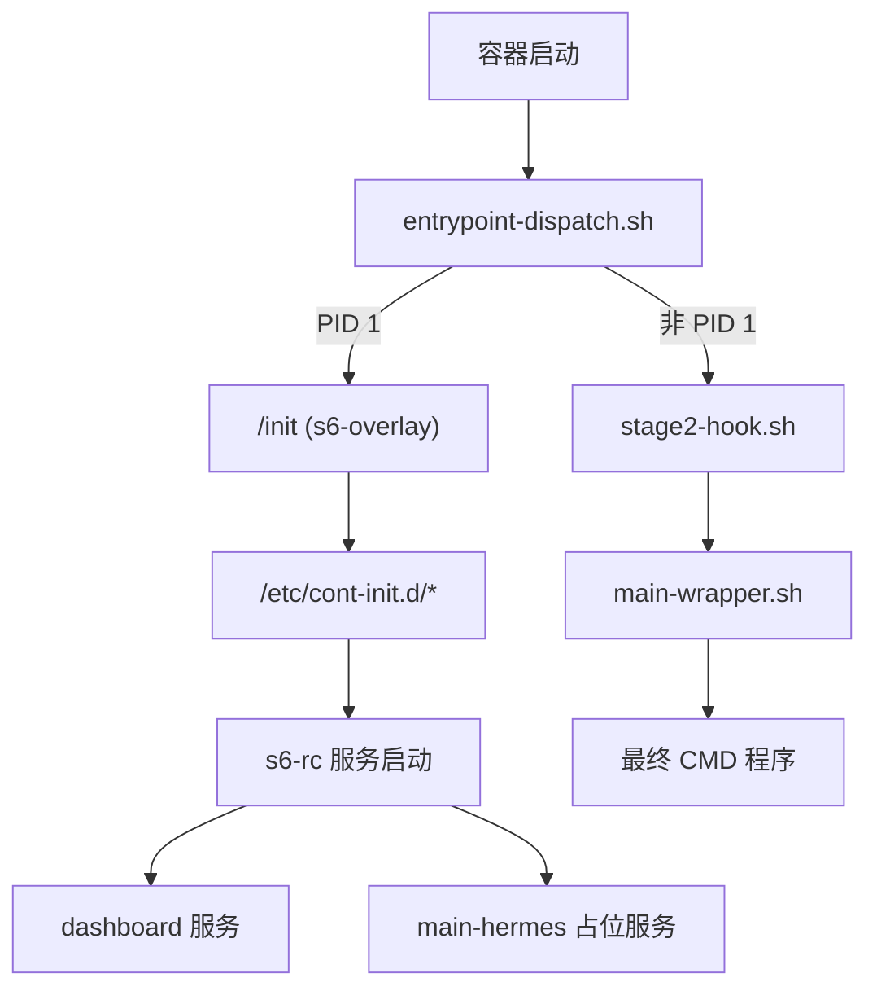
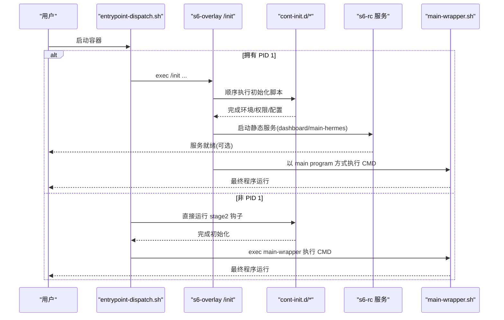
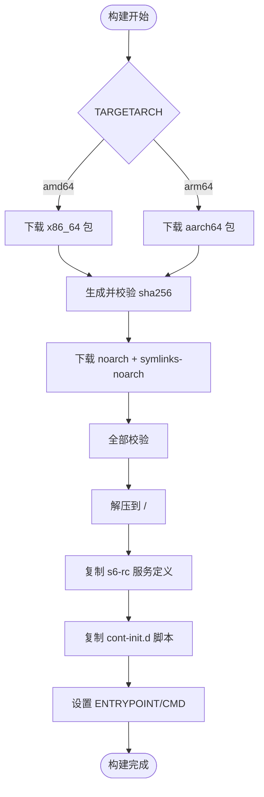
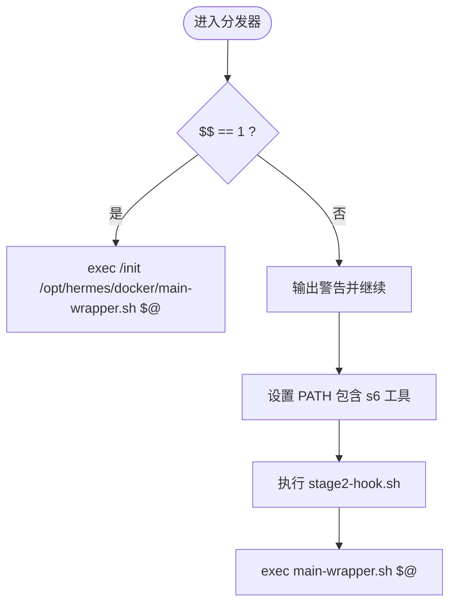
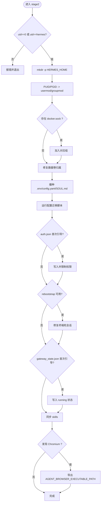
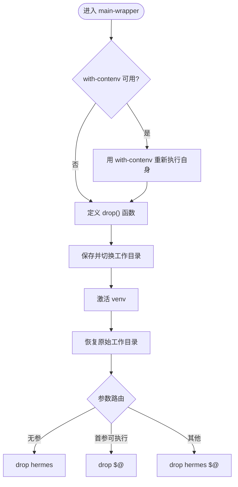
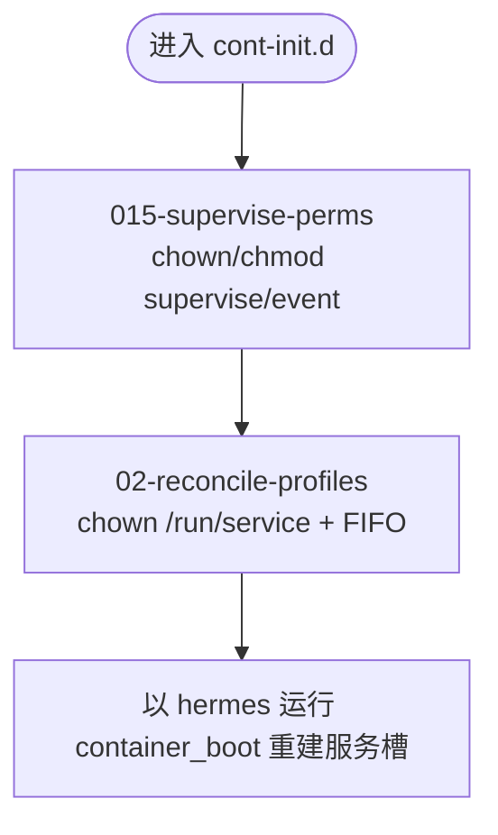
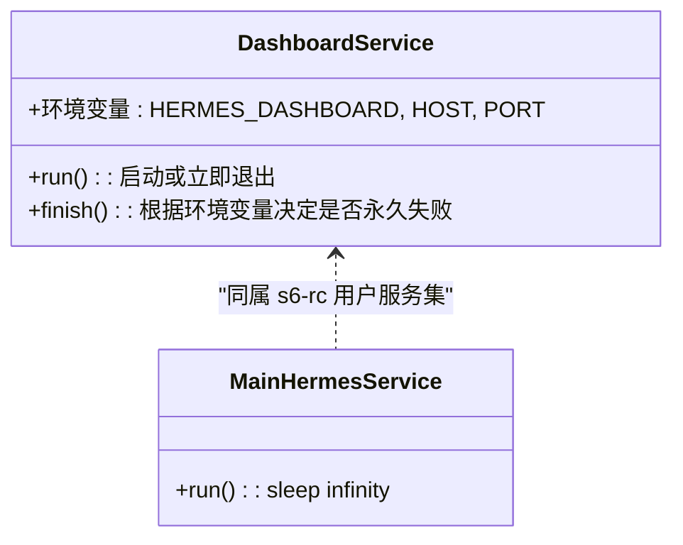
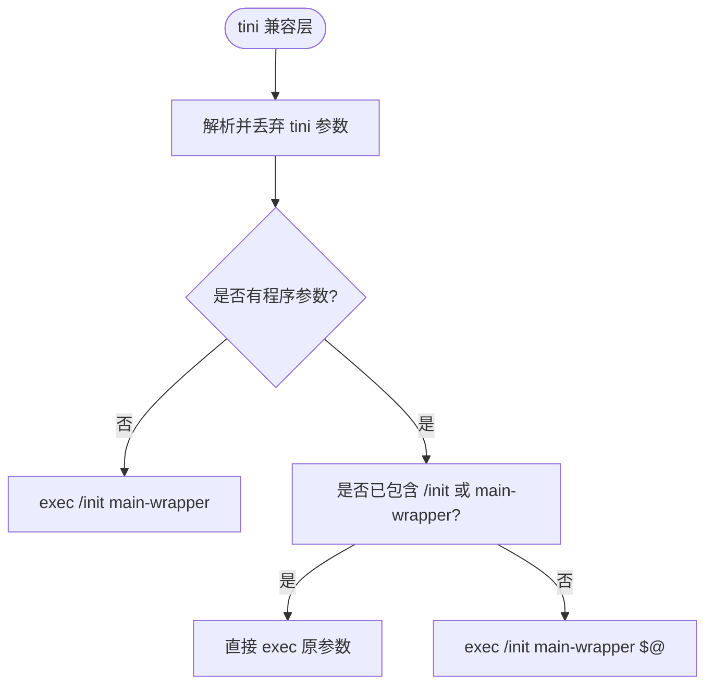
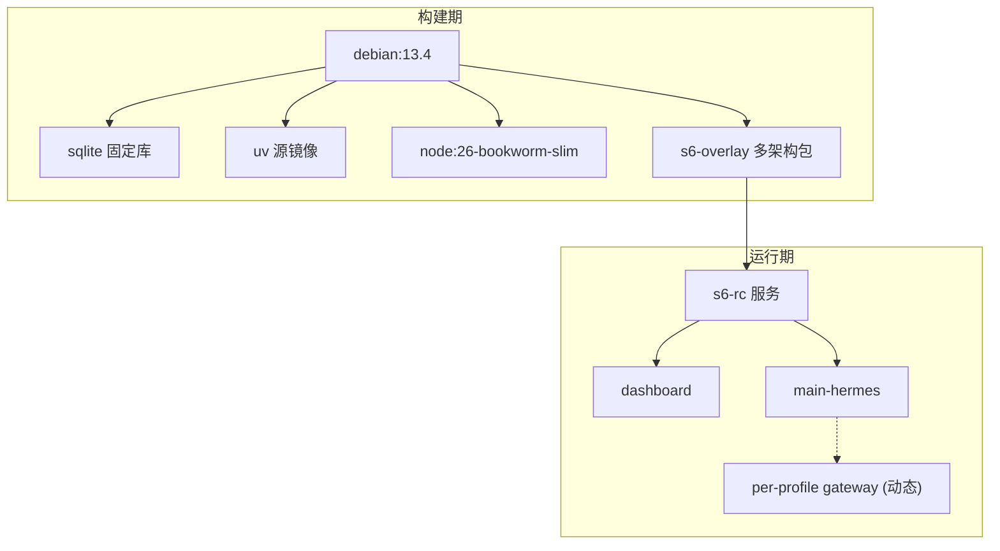

# s6-overlay 服务管理器

<cite>
**本文引用的文件**
- [Dockerfile](file://docker/Dockerfile)
- [entrypoint-dispatch.sh](file://docker/entrypoint-dispatch.sh)
- [stage2-hook.sh](file://docker/stage2-hook.sh)
- [main-wrapper.sh](file://docker/main-wrapper.sh)
- [entrypoint.sh](file://docker/entrypoint.sh)
- [tini-shim.sh](file://docker/tini-shim.sh)
- [015-supervise-perms](file://docker/cont-init.d/015-supervise-perms)
- [02-reconcile-profiles](file://docker/cont-init.d/02-reconcile-profiles)
- [dashboard/run](file://docker/s6-rc.d/dashboard/run)
- [dashboard/finish](file://docker/s6-rc.d/dashboard/finish)
- [main-hermes/run](file://docker/s6-rc.d/main-hermes/run)
</cite>

## 目录
1. [简介](#简介)
2. [项目结构](#项目结构)
3. [核心组件](#核心组件)
4. [架构总览](#架构总览)
5. [详细组件分析](#详细组件分析)
6. [依赖关系分析](#依赖关系分析)
7. [性能考虑](#性能考虑)
8. [故障排查指南](#故障排查指南)
9. [结论](#结论)
10. [附录](#附录)

## 简介
本文件面向使用 s6-overlay 作为容器内 PID 1 的服务管理器的部署与运维人员，系统化说明安装过程、多架构支持、校验和验证、目录结构与服务定义、初始化脚本、生命周期管理与监控配置，并给出调试、日志收集、故障恢复与性能监控的最佳实践。重点覆盖：
- s6-overlay 的安装与校验（含 amd64/arm64）
- entrypoint-dispatch.sh 的分发逻辑
- stage2-hook.sh 的启动准备与权限降级机制
- cont-init.d 初始化流程与 s6-rc 服务定义
- 服务监督、优雅重启、僵尸进程回收等 PID 1 优势

## 项目结构
与 s6-overlay 相关的核心目录与文件：
- docker/Dockerfile：构建镜像、安装 s6-overlay、声明 ENTRYPOINT/CMD、注入服务定义与初始化脚本
- docker/entrypoint-dispatch.sh：入口分发器，决定走 s6-overlay /init 或直连 stage2 + main-wrapper
- docker/stage2-hook.sh：cont-init.d 阶段钩子，负责 UID/GID 重映射、数据卷归属修复、配置种子、技能同步、浏览器二进制发现等
- docker/main-wrapper.sh：包装 CMD 参数路由、环境重水化、权限降级并执行最终程序
- docker/cont-init.d/*：初始化脚本（如 supervise 权限修复、配置文件桥接）
- docker/s6-rc.d/*：静态服务定义（dashboard、main-hermes），以及用户动态注册位点
- docker/tini-shim.sh：兼容旧编排模板对 tini 的调用

图表来源
- [Dockerfile:424-457](file://docker/Dockerfile#L424-L457)
- [entrypoint-dispatch.sh:1-26](file://docker/entrypoint-dispatch.sh#L1-L26)
- [stage2-hook.sh:1-17](file://docker/stage2-hook.sh#L1-L17)
- [main-wrapper.sh:1-19](file://docker/main-wrapper.sh#L1-L19)
- [02-reconcile-profiles:1-16](file://docker/cont-init.d/02-reconcile-profiles#L1-L16)
- [dashboard/run:1-21](file://docker/s6-rc.d/dashboard/run#L1-L21)
- [main-hermes/run:1-28](file://docker/s6-rc.d/main-hermes/run#L1-L28)

章节来源
- [Dockerfile:93-135](file://docker/Dockerfile#L93-L135)
- [Dockerfile:336-357](file://docker/Dockerfile#L336-L357)
- [Dockerfile:424-457](file://docker/Dockerfile#L424-L457)

## 核心组件
- 入口分发器（entrypoint-dispatch.sh）：检测是否拥有 PID 1；若是则交由 s6-overlay 的 /init 接管完整监督树；否则直接运行 stage2 钩子与 main-wrapper，保证前台命令仍可执行。
- 阶段二钩子（stage2-hook.sh）：在监督树启动后、用户服务启动前执行，完成 UID/GID 重映射、数据卷 chown、配置种子、技能同步、浏览器二进制发现、环境变量注入等。
- 主包装器（main-wrapper.sh）：以 with-contenv 重水化环境、解析 CMD 参数（无参默认 hermes、首参为可执行则透传、否则 hermes <args>）、权限降级到 hermes 用户并 exec 最终程序。
- 初始化脚本（cont-init.d）：015-supervise-perms 修复 supervise/event 目录权限；02-reconcile-profiles 重建 per-profile 服务槽并授权 hermes 用户写入。
- 服务定义（s6-rc.d）：dashboard 为可选服务；main-hermes 为占位服务以满足 s6-rc bundle 要求；用户服务通过 /run/service 动态注册。
- tini 兼容层（tini-shim.sh）：剥离 tini 参数，转发至 /init + main-wrapper，避免旧编排模板导致 boot-loop。

章节来源
- [entrypoint-dispatch.sh:1-26](file://docker/entrypoint-dispatch.sh#L1-L26)
- [stage2-hook.sh:1-17](file://docker/stage2-hook.sh#L1-L17)
- [main-wrapper.sh:1-19](file://docker/main-wrapper.sh#L1-L19)
- [015-supervise-perms:1-38](file://docker/cont-init.d/015-supervise-perms#L1-L38)
- [02-reconcile-profiles:1-16](file://docker/cont-init.d/02-reconcile-profiles#L1-L16)
- [dashboard/run:1-21](file://docker/s6-rc.d/dashboard/run#L1-L21)
- [main-hermes/run:1-28](file://docker/s6-rc.d/main-hermes/run#L1-L28)
- [tini-shim.sh:1-35](file://docker/tini-shim.sh#L1-L35)

## 架构总览
s6-overlay 作为 PID 1 的优势：
- 僵尸进程回收：/init 在 SIGCHLD 上非阻塞回收子进程，避免 MCP stdio、git、bun 等子进程堆积。
- 服务监督：dashboard、per-profile gateway 等由 s6-supervise 管理，崩溃自动重启，状态可观测。
- 优雅重启：通过 finish 脚本标记“永久失败”或允许重启，配合 s6-svc 控制。
- 统一入口：ENTRYPOINT 分发器确保在不同运行时（Podman/K8s/Fly Machines）均能正确引导。

图表来源
- [Dockerfile:424-457](file://docker/Dockerfile#L424-L457)
- [entrypoint-dispatch.sh:15-26](file://docker/entrypoint-dispatch.sh#L15-L26)
- [stage2-hook.sh:1-17](file://docker/stage2-hook.sh#L1-L17)
- [main-wrapper.sh:1-19](file://docker/main-wrapper.sh#L1-L19)
- [02-reconcile-profiles:1-16](file://docker/cont-init.d/02-reconcile-profiles#L1-L16)
- [dashboard/run:1-21](file://docker/s6-rc.d/dashboard/run#L1-L21)
- [main-hermes/run:1-28](file://docker/s6-rc.d/main-hermes/run#L1-L28)

## 详细组件分析

### 安装过程与多架构支持
- 多架构下载：根据 TARGETARCH 选择 x86_64 或 aarch64 的 s6-overlay tarball，同时下载 noarch 与 symlinks-noarch 包。
- 校验和验证：在下载完成后生成 sha256 清单并校验，再解压到根文件系统。
- 目录结构：将 s6-rc 服务定义复制到 /etc/s6-overlay/s6-rc.d，初始化脚本复制到 /etc/cont-init.d，并设置可执行权限。
- 入口与命令：ENTRYPOINT 指向分发器，CMD 为空以便用户传入任意命令。

图表来源
- [Dockerfile:93-135](file://docker/Dockerfile#L93-L135)
- [Dockerfile:336-357](file://docker/Dockerfile#L336-L357)
- [Dockerfile:424-457](file://docker/Dockerfile#L424-L457)

章节来源
- [Dockerfile:93-135](file://docker/Dockerfile#L93-L135)
- [Dockerfile:336-357](file://docker/Dockerfile#L336-L357)
- [Dockerfile:424-457](file://docker/Dockerfile#L424-L457)

### 入口分发器（entrypoint-dispatch.sh）
- 当自身为 PID 1 时，exec /init 并将 main-wrapper 作为剩余参数传递，保留完整的 s6 监督树。
- 当平台已提供 PID 1（例如 Fly Machines、docker run --init），跳过 /init，直接运行 stage2 钩子与 main-wrapper，确保前台命令仍可用。
- 在非 PID 1 路径中显式设置 PATH，包含 s6 辅助工具路径，保证后续脚本可用。

图表来源
- [entrypoint-dispatch.sh:15-26](file://docker/entrypoint-dispatch.sh#L15-L26)

章节来源
- [entrypoint-dispatch.sh:1-26](file://docker/entrypoint-dispatch.sh#L1-L26)

### 阶段二钩子（stage2-hook.sh）
职责概览：
- 拒绝不支持的 --user 启动（非 root 且非 hermes UID），给出明确指引。
- 创建并修复 HERMES_HOME 及其关键子目录的归属，避免 rootless Podman 下的权限问题。
- 支持 PUID/PGID 别名进行 UID/GID 重映射，适配 NAS 场景。
- 处理 Docker socket 组权限（DooD），确保 hermes 用户可访问宿主 Docker 守护进程。
- 固定只读安装树 /opt/hermes，将可变状态置于 /opt/data。
- 首次启动时播种 .env、config.yaml、SOUL.md 等配置，并迁移配置 schema。
- 支持 auth.json 的首次引导与重启自修复（rebootstrap）。
- 支持 gateway_state.json 的首启状态引导（running）。
- 同步内置 skills，发现 Chromium 二进制并导出到 s6 container_environment。

图表来源
- [stage2-hook.sh:20-74](file://docker/stage2-hook.sh#L20-L74)
- [stage2-hook.sh:97-116](file://docker/stage2-hook.sh#L97-L116)
- [stage2-hook.sh:118-172](file://docker/stage2-hook.sh#L118-L172)
- [stage2-hook.sh:174-255](file://docker/stage2-hook.sh#L174-L255)
- [stage2-hook.sh:374-396](file://docker/stage2-hook.sh#L374-L396)
- [stage2-hook.sh:418-455](file://docker/stage2-hook.sh#L418-L455)
- [stage2-hook.sh:457-530](file://docker/stage2-hook.sh#L457-L530)
- [stage2-hook.sh:532-541](file://docker/stage2-hook.sh#L532-L541)
- [stage2-hook.sh:543-589](file://docker/stage2-hook.sh#L543-L589)

章节来源
- [stage2-hook.sh:20-74](file://docker/stage2-hook.sh#L20-L74)
- [stage2-hook.sh:97-116](file://docker/stage2-hook.sh#L97-L116)
- [stage2-hook.sh:118-172](file://docker/stage2-hook.sh#L118-L172)
- [stage2-hook.sh:174-255](file://docker/stage2-hook.sh#L174-L255)
- [stage2-hook.sh:374-396](file://docker/stage2-hook.sh#L374-L396)
- [stage2-hook.sh:418-455](file://docker/stage2-hook.sh#L418-L455)
- [stage2-hook.sh:457-530](file://docker/stage2-hook.sh#L457-L530)
- [stage2-hook.sh:532-541](file://docker/stage2-hook.sh#L532-L541)
- [stage2-hook.sh:543-589](file://docker/stage2-hook.sh#L543-L589)

### 主包装器（main-wrapper.sh）
- 环境重水化：若未准备好环境变量，通过 with-contenv 重新执行自身，确保继承 /init 的环境。
- 权限降级：封装 drop() 函数，仅在需要时通过 s6-setuidgid 切换到 hermes 用户。
- 参数路由：无参数执行 hermes；首参为可执行则透传；否则执行 hermes 子命令。
- 工作目录：在进入 venv 激活前保存原始工作目录，并在移交前恢复，保持用户期望的 -w 行为。

图表来源
- [main-wrapper.sh:21-31](file://docker/main-wrapper.sh#L21-L31)
- [main-wrapper.sh:61-92](file://docker/main-wrapper.sh#L61-L92)

章节来源
- [main-wrapper.sh:1-92](file://docker/main-wrapper.sh#L1-L92)

### 初始化脚本（cont-init.d）
- 015-supervise-perms：为所有静态 s6 服务的 supervise/ 与 event/ 目录设置 hermes 可读/可写权限，使 s6-svstat/s6-svc 可由 hermes 用户调用。
- 02-reconcile-profiles：将 /run/service（tmpfs）设为 hermes 可写，授权 svscan 控制 FIFO，然后以 hermes 用户运行 Python 模块重建 per-profile 服务槽。

图表来源
- [015-supervise-perms:39-91](file://docker/cont-init.d/015-supervise-perms#L39-L91)
- [02-reconcile-profiles:25-48](file://docker/cont-init.d/02-reconcile-profiles#L25-L48)

章节来源
- [015-supervise-perms:1-91](file://docker/cont-init.d/015-supervise-perms#L1-L91)
- [02-reconcile-profiles:1-48](file://docker/cont-init.d/02-reconcile-profiles#L1-L48)

### 服务定义（s6-rc.d）
- dashboard：受环境变量 HERMES_DASHBOARD 控制；启用时以 hermes 用户启动 dashboard 服务；禁用时通过 finish 脚本返回 125 表示“永久失败”，s6 不重启，状态显示 down。
- main-hermes：当前为占位服务（sleep infinity），满足 s6-rc bundle 至少一个用户服务的要求，并为未来长期进程托管预留插槽。

图表来源
- [dashboard/run:1-57](file://docker/s6-rc.d/dashboard/run#L1-L57)
- [dashboard/finish:1-30](file://docker/s6-rc.d/dashboard/finish#L1-L30)
- [main-hermes/run:1-28](file://docker/s6-rc.d/main-hermes/run#L1-L28)

章节来源
- [dashboard/run:1-57](file://docker/s6-rc.d/dashboard/run#L1-L57)
- [dashboard/finish:1-30](file://docker/s6-rc.d/dashboard/finish#L1-L30)
- [main-hermes/run:1-28](file://docker/s6-rc.d/main-hermes/run#L1-L28)

### tini 兼容层（tini-shim.sh）
- 剥离 tini 参数（-g、-s、-w、-h、--version、-p/-e 等），避免将 tini 标志传递给 /init。
- 若无程序参数，则 exec /init + main-wrapper；若已包含 /init 或 main-wrapper，则直接转发。
- 解决旧编排模板导致的 boot-loop 与参数错误。

图表来源
- [tini-shim.sh:37-90](file://docker/tini-shim.sh#L37-L90)

章节来源
- [tini-shim.sh:1-90](file://docker/tini-shim.sh#L1-L90)

## 依赖关系分析
- 构建期依赖：Debian trixie、SQLite 固定库、Node 26、uv 源镜像、s6-overlay 版本与校验和。
- 运行期依赖：s6-overlay 提供的 /init、s6-rc、s6-svscan、s6-svstat、s6-svc 等工具；Python venv；Node/npm（前端构建产物）；Playwright Chromium（可选）。
- 服务间依赖：dashboard 独立于 main-hermes；per-profile gateway 通过 /run/service 动态注册，由 02-reconcile-profiles 在启动时重建。

图表来源
- [Dockerfile:52-58](file://docker/Dockerfile#L52-L58)
- [Dockerfile:71-91](file://docker/Dockerfile#L71-L91)
- [Dockerfile:93-135](file://docker/Dockerfile#L93-L135)
- [Dockerfile:149-167](file://docker/Dockerfile#L149-L167)
- [Dockerfile:336-357](file://docker/Dockerfile#L336-L357)

章节来源
- [Dockerfile:52-58](file://docker/Dockerfile#L52-L58)
- [Dockerfile:71-91](file://docker/Dockerfile#L71-L91)
- [Dockerfile:93-135](file://docker/Dockerfile#L93-L135)
- [Dockerfile:149-167](file://docker/Dockerfile#L149-L167)
- [Dockerfile:336-357](file://docker/Dockerfile#L336-L357)

## 性能考虑
- 构建缓存优化：仅拷贝 manifests 先安装依赖，减少冷构建时间；前端与 Python 依赖分层安装。
- 只读安装树：/opt/hermes 不可写，防止运行时懒安装破坏核心 venv；懒安装包定向到 /opt/data/lazy-packages。
- 最小化运行时开销：main-wrapper 仅在必要时通过 with-contenv 重水化；权限降级仅在需要时执行。
- 资源隔离：supervise 目录权限最小化，仅开放必要读写。

[本节为通用指导，不直接分析具体文件]

## 故障排查指南
常见问题与定位要点：
- 使用 --user 启动导致 EACCES：stage2 与 main-wrapper 会拒绝非 hermes 的任意 UID，请改用 HERMES_UID/HERMES_GID 或 PUID/PGID。
- Docker socket 无法访问：确认已挂载宿主 socket，并确保 hermes 用户加入对应组；脚本会在启动时尝试修复。
- 数据卷归属异常：stage2 会针对关键子目录与顶层目录进行 chown；若出现 rootless 失败，会记录警告并继续。
- dashboard 未启动：检查 HERMES_DASHBOARD 环境变量；若未启用，finish 脚本会标记永久失败，s6-svstat 显示 down。
- 旧编排模板 boot-loop：确保不再硬编码 /usr/bin/tini 作为入口；如需兼容，使用镜像自带的 tini-shim。

章节来源
- [stage2-hook.sh:20-74](file://docker/stage2-hook.sh#L20-L74)
- [main-wrapper.sh:33-59](file://docker/main-wrapper.sh#L33-L59)
- [dashboard/finish:1-30](file://docker/s6-rc.d/dashboard/finish#L1-L30)
- [tini-shim.sh:1-35](file://docker/tini-shim.sh#L1-L35)

## 结论
通过将 s6-overlay 作为 PID 1，本项目实现了可靠的僵尸进程回收、服务监督与优雅重启能力。入口分发器保证了在不同运行时的兼容性；阶段二钩子在启动早期完成权限、配置与环境的准备；cont-init.d 与 s6-rc 共同构建了可扩展的服务模型。遵循本文档的安装与排障建议，可在多架构环境中稳定部署并高效运维。

[本节为总结性内容，不直接分析具体文件]

## 附录
- 最佳实践
  - 始终通过环境变量配置 UID/GID（HERMES_UID/HERMES_GID 或 PUID/PGID），避免使用 --user。
  - 将可变状态保存在 /opt/data 卷，代码与依赖保持在只读安装树。
  - 使用 s6-svstat/s6-svc 监控与控制系统服务；通过 finish 脚本表达服务生命周期语义。
  - 利用 stage2 的 auth.json 与 gateway_state.json 引导能力，实现首次启动自动化。
  - 在容器外维护日志与审计信息，结合 s6 事件目录与 hermes 日志目录进行集中采集。

[本节为通用指导，不直接分析具体文件]