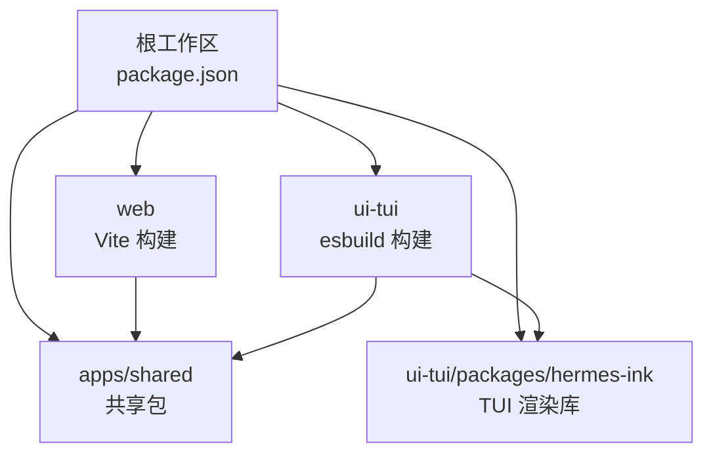
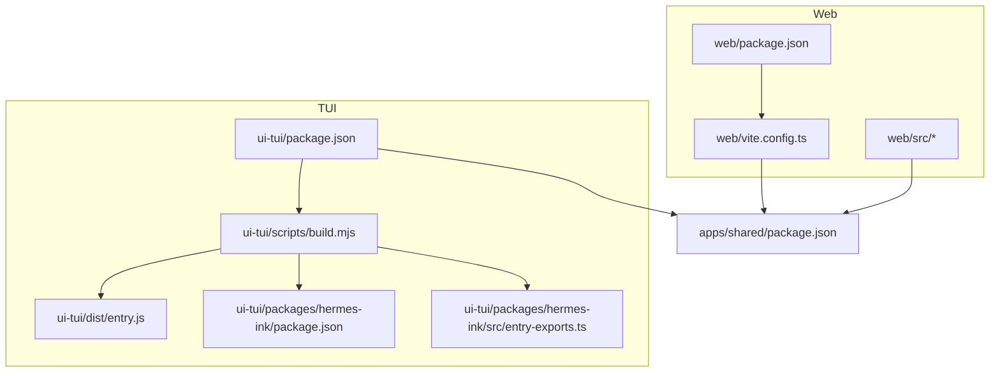
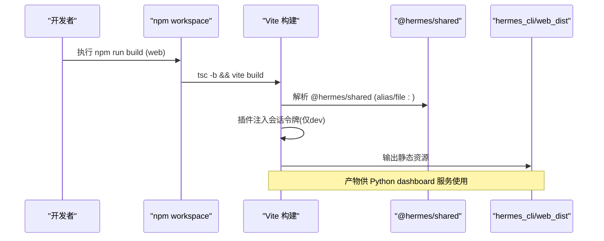
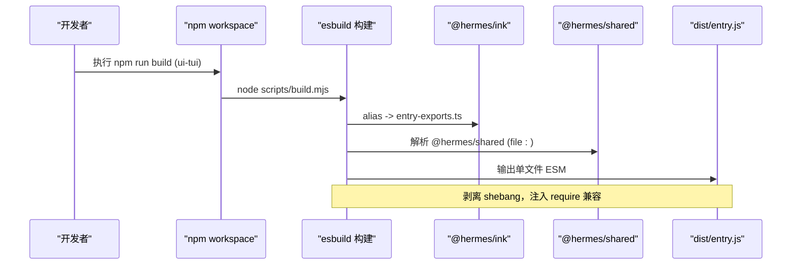
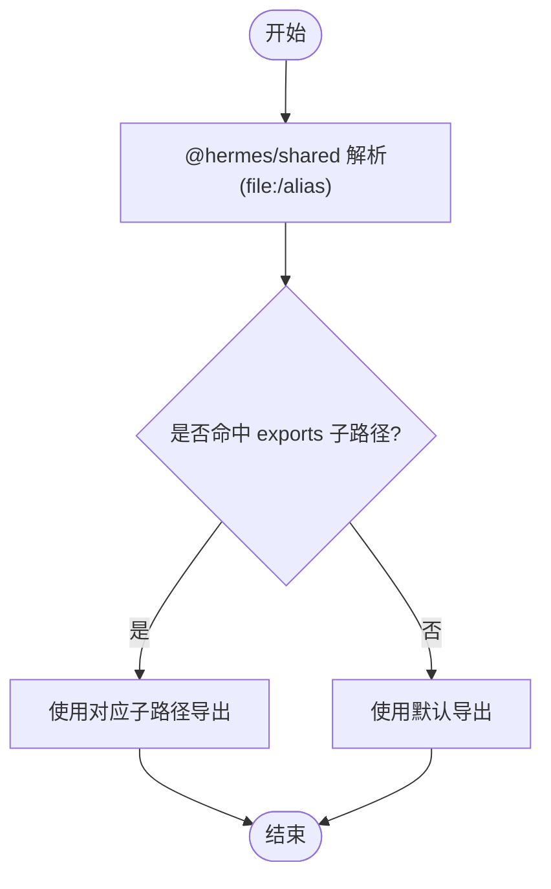
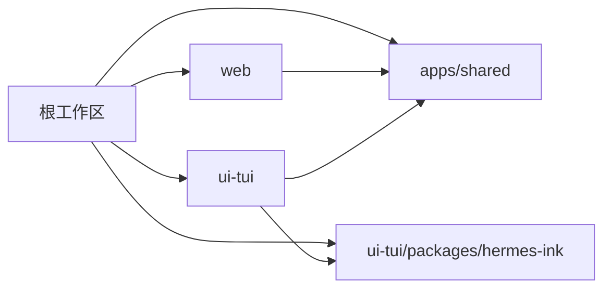

# 前端资源构建

<cite>
**本文引用的文件**
- [package.json](file://package.json)
- [web/package.json](file://web/package.json)
- [web/vite.config.ts](file://web/vite.config.ts)
- [ui-tui/package.json](file://ui-tui/package.json)
- [ui-tui/scripts/build.mjs](file://ui-tui/scripts/build.mjs)
- [ui-tui/packages/hermes-ink/package.json](file://ui-tui/packages/hermes-ink/package.json)
- [ui-tui/packages/hermes-ink/src/entry-exports.ts](file://ui-tui/packages/hermes-ink/src/entry-exports.ts)
- [apps/shared/package.json](file://apps/shared/package.json)
</cite>

## 目录
1. [简介](#简介)
2. [项目结构](#项目结构)
3. [核心组件](#核心组件)
4. [架构总览](#架构总览)
5. [详细组件分析](#详细组件分析)
6. [依赖关系分析](#依赖关系分析)
7. [性能与缓存优化](#性能与缓存优化)
8. [故障排查指南](#故障排查指南)
9. [结论](#结论)
10. [附录](#附录)

## 简介
本文件面向前端资源构建，系统性说明 monorepo 工作空间下 web 与 ui-tui 两个前端项目的构建流程、依赖解析策略、共享包集成方式以及产物使用路径。重点解释：
- 为什么需要单独复制前端源文件以实现独立的层缓存；
- npm 工作空间的 file: 依赖如何被解析与打包；
- hermes-ink 包的引用处理与避免循环异步初始化死锁的策略；
- TUI 预构建产物 dist/entry.js 的生成、运行与后续阶段消费方式；
- 构建性能优化、依赖更新策略与常见问题解决方案。

## 项目结构
仓库根 package.json 通过 workspaces 将多个前端子项目纳入统一依赖管理，包括 apps/*、ui-tui、ui-tui/packages/*、web、tests-js。各子项目各自维护自己的脚本与构建配置：
- web：基于 Vite + React，构建产物输出到 hermes_cli/web_dist，供 Python 侧 dashboard 服务使用。
- ui-tui：基于 esbuild 自研构建脚本，将入口打包为单文件 Node ESM 产物 dist/entry.js，供 CLI 直接执行。
- apps/shared：纯 TypeScript 共享包，通过 exports 暴露类型与模块，供 web 与 ui-tui 引用。
- ui-tui/packages/hermes-ink：TUI 渲染库，提供最小化导出面，避免引入上游 ink 导致启动死锁。

**图表来源**
- [package.json:6-12](file://package.json#L6-L12)

**章节来源**
- [package.json:6-12](file://package.json#L6-L12)

## 核心组件
- 工作空间与脚本编排：根 package.json 定义 workspaces 与常用脚本（install/audit/check），便于统一安装与检查。
- Web 构建：web/package.json 提供 build/dev/lint/test 等脚本；web/vite.config.ts 配置别名、去重、分包、代理与输出目录。
- TUI 构建：ui-tui/package.json 提供 build/build:ink 等脚本；ui-tui/scripts/build.mjs 使用 esbuild 将入口打包为独立可执行 ESM。
- 共享包：apps/shared/package.json 通过 exports 暴露多入口，供 web 与 ui-tui 以 @hermes/shared 引用。
- hermes-ink：ui-tui/packages/hermes-ink/package.json 声明导出与 peerDependencies；src/entry-exports.ts 控制导出面并避免引入 upstream ink-text-input。

**章节来源**
- [package.json:6-12](file://package.json#L6-L12)
- [web/package.json:6-15](file://web/package.json#L6-L15)
- [web/vite.config.ts:60-147](file://web/vite.config.ts#L60-L147)
- [ui-tui/package.json:6-19](file://ui-tui/package.json#L6-L19)
- [ui-tui/scripts/build.mjs:29-66](file://ui-tui/scripts/build.mjs#L29-L66)
- [apps/shared/package.json:6-13](file://apps/shared/package.json#L6-L13)
- [ui-tui/packages/hermes-ink/package.json:16-32](file://ui-tui/packages/hermes-ink/package.json#L16-L32)
- [ui-tui/packages/hermes-ink/src/entry-exports.ts:41-58](file://ui-tui/packages/hermes-ink/src/entry-exports.ts#L41-L58)

## 架构总览
下图展示两个前端项目的构建与运行时依赖关系，以及共享包与 hermes-ink 的集成点。

**图表来源**
- [web/package.json:6-15](file://web/package.json#L6-L15)
- [web/vite.config.ts:60-147](file://web/vite.config.ts#L60-L147)
- [ui-tui/package.json:6-19](file://ui-tui/package.json#L6-L19)
- [ui-tui/scripts/build.mjs:29-66](file://ui-tui/scripts/build.mjs#L29-L66)
- [ui-tui/packages/hermes-ink/package.json:16-32](file://ui-tui/packages/hermes-ink/package.json#L16-L32)
- [ui-tui/packages/hermes-ink/src/entry-exports.ts:41-58](file://ui-tui/packages/hermes-ink/src/entry-exports.ts#L41-L58)
- [apps/shared/package.json:6-13](file://apps/shared/package.json#L6-L13)

## 详细组件分析

### Web 构建流程
- 依赖解析：
  - 通过 workspaces 与 file: 协议解析 @hermes/shared，指向 apps/shared/src。
  - vite.config.ts 中 resolve.alias 将 @hermes/shared 映射到源码路径，确保开发期与构建期一致。
- 构建配置要点：
  - 输出目录：../hermes_cli/web_dist，供 Python 侧 dashboard 服务静态托管。
  - 分包策略：按 react-vendor、xterm、three、plot、motion、ui、vendor 分组，减少首屏体积。
  - 去重策略：dedupe 列表强制共用根 node_modules 中的关键依赖，避免双份实例导致 hooks/context 异常。
  - 开发代理：/api 与 /dashboard-plugins 转发至后端 HERMES_DASHBOARD_URL，并在 dev 模式下注入会话令牌。
- 产物使用：
  - 构建产物由 Python 侧 dashboard 服务在运行时加载，作为前端界面资源。

**图表来源**
- [web/package.json:6-15](file://web/package.json#L6-L15)
- [web/vite.config.ts:6-58](file://web/vite.config.ts#L6-L58)
- [web/vite.config.ts:60-147](file://web/vite.config.ts#L60-L147)

**章节来源**
- [web/package.json:6-15](file://web/package.json#L6-L15)
- [web/vite.config.ts:6-58](file://web/vite.config.ts#L6-L58)
- [web/vite.config.ts:60-147](file://web/vite.config.ts#L60-L147)

### TUI 构建流程与 hermes-ink 集成
- 依赖解析：
  - ui-tui/package.json 通过 file: 依赖 @hermes/ink（本地 packages/hermes-ink）与 @hermes/shared（apps/shared）。
  - overrides 将 ink-text-input 的 ink 替换为本地的 @hermes/ink，避免重复依赖。
- 构建脚本行为：
  - scripts/build.mjs 使用 esbuild 将 src/entry.tsx 打包为 dist/entry.js（Node ESM）。
  - alias 将 @hermes/ink 指向 hermes-ink 的 entry-exports.ts，从而只内联必要导出，避免引入上游 ink 导致的循环异步初始化死锁。
  - 注入 require 兼容头，支持部分第三方依赖在 ESM 中使用 require。
  - 剥离 shebang，因为 Nix 环境会破坏 shebang，且 CLI 总是以 node 方式调用。
- hermes-ink 导出面：
  - entry-exports.ts 显式导出所需 API，明确注释不重新导出 ink-text-input，防止引入第二份 ink 造成启动卡死。
  - 如需文本输入组件，需通过子路径 @hermes/ink/text-input 导入。

**图表来源**
- [ui-tui/package.json:6-19](file://ui-tui/package.json#L6-L19)
- [ui-tui/scripts/build.mjs:29-66](file://ui-tui/scripts/build.mjs#L29-L66)
- [ui-tui/packages/hermes-ink/src/entry-exports.ts:41-58](file://ui-tui/packages/hermes-ink/src/entry-exports.ts#L41-L58)

**章节来源**
- [ui-tui/package.json:6-19](file://ui-tui/package.json#L6-L19)
- [ui-tui/scripts/build.mjs:29-66](file://ui-tui/scripts/build.mjs#L29-L66)
- [ui-tui/packages/hermes-ink/src/entry-exports.ts:41-58](file://ui-tui/packages/hermes-ink/src/entry-exports.ts#L41-L58)

### 共享包集成与 file: 依赖处理
- apps/shared 通过 exports 暴露多个子路径（如 billing、billing-policy、charge-settlement、skin），并提供 types 入口。
- web 与 ui-tui 均通过 file: 协议引用该共享包，保证开发与构建期一致解析到源码。
- 在 web 中，vite.config.ts 使用 resolve.alias 将 @hermes/shared 映射到源码路径，避免构建期二次解析。

**图表来源**
- [apps/shared/package.json:6-13](file://apps/shared/package.json#L6-L13)
- [web/vite.config.ts:60-66](file://web/vite.config.ts#L60-L66)
- [web/package.json:17-18](file://web/package.json#L17-L18)
- [ui-tui/package.json:21-23](file://ui-tui/package.json#L21-L23)

**章节来源**
- [apps/shared/package.json:6-13](file://apps/shared/package.json#L6-L13)
- [web/package.json:17-18](file://web/package.json#L17-L18)
- [web/vite.config.ts:60-66](file://web/vite.config.ts#L60-L66)
- [ui-tui/package.json:21-23](file://ui-tui/package.json#L21-L23)

### 为什么需要单独复制前端源文件以实现独立层缓存
- 目标：使 CI/CD 或容器镜像在不同阶段能够独立缓存前端构建产物，避免无关变更触发全量重建。
- 实践建议：
  - 将 web 与 ui-tui 的源码与依赖安装步骤拆分为独立缓存层，例如分别缓存 node_modules 与构建产物。
  - 对于 web，缓存 hermes_cli/web_dist 下的静态资源；对于 TUI，缓存 ui-tui/dist/entry.js。
  - 通过分层缓存，当仅修改 UI 代码时，无需重新构建 Python 或其他无关层，提升整体构建速度。
- 注意：若共享包 apps/shared 发生变更，应使其成为 web 与 ui-tui 构建层的共同依赖，以便在共享包变化时正确失效缓存。

[本节为通用指导，不直接分析具体文件]

### TUI 预构建包路径配置与运行时加载机制
- 预构建产物位置：ui-tui/dist/entry.js，由 scripts/build.mjs 生成。
- 运行方式：CLI 通常以 node 方式直接执行该文件，因此构建脚本移除了 shebang，避免 Nix patchShebangs 破坏解释器指令。
- 环境变量 HERMES_TUI_DIR：
  - 当前仓库未在该构建链路中发现对 HERMES_TUI_DIR 的直接读取或设置逻辑。
  - 若外部系统需要通过环境变量指定 TUI 预构建包路径，应在 CLI 启动阶段进行解析与覆盖，而不是在构建脚本中硬编码。
- 运行时加载：
  - 由于 esbuild 已将依赖内联为单文件 ESM，运行时无需额外 node_modules。
  - 若未来需要动态加载不同版本的 TUI 包，可在 CLI 层根据环境变量选择 dist 路径并执行。

**章节来源**
- [ui-tui/scripts/build.mjs:56-64](file://ui-tui/scripts/build.mjs#L56-L64)

## 依赖关系分析
- 工作空间依赖：
  - 根 package.json 将 web、ui-tui、apps/shared、ui-tui/packages/* 纳入同一工作空间，确保依赖版本一致与安装效率。
- file: 依赖：
  - web 与 ui-tui 均以 file: 形式引用 @hermes/shared，保证源码级共享与类型同步。
  - ui-tui 通过 file: 引用 @hermes/ink，并通过 overrides 将 ink-text-input 的 ink 替换为本地图实现，避免重复依赖。
- 构建期依赖：
  - web 使用 Vite、React、Tailwind 等工具链；ui-tui 使用 esbuild、tsx、vitest 等。
  - hermes-ink 通过 exports 暴露最小导出面，peerDependencies 声明 ink-text-input 与 react，避免将其内联到主包。

**图表来源**
- [package.json:6-12](file://package.json#L6-L12)
- [web/package.json:17-18](file://web/package.json#L17-L18)
- [ui-tui/package.json:21-23](file://ui-tui/package.json#L21-L23)
- [ui-tui/packages/hermes-ink/package.json:16-32](file://ui-tui/packages/hermes-ink/package.json#L16-L32)

**章节来源**
- [package.json:6-12](file://package.json#L6-L12)
- [web/package.json:17-18](file://web/package.json#L17-L18)
- [ui-tui/package.json:21-23](file://ui-tui/package.json#L21-L23)
- [ui-tui/packages/hermes-ink/package.json:16-32](file://ui-tui/packages/hermes-ink/package.json#L16-L32)

## 性能与缓存优化
- Web 构建优化：
  - 分包策略：按功能域拆分 vendor 包，减少首屏下载体积。
  - 去重策略：dedupe 列表避免重复依赖实例，降低内存占用与潜在运行时错误。
  - 增量构建：tsc -b 与 Vite 结合，利用增量编译与模块热替换提升开发体验。
- TUI 构建优化：
  - 单文件打包：esbuild 将依赖内联，减少运行时加载开销。
  - 跳过上游依赖：通过 alias 与导出面控制，避免引入不必要的上游包，缩短构建时间。
  - 移除 shebang：避免 Nix 环境下的解释器问题，提高跨平台兼容性。
- 共享包优化：
  - 使用 exports 精确暴露子路径，减少不必要导入。
  - 类型与源码同路径，避免构建期二次解析。

[本节为通用指导，不直接分析具体文件]

## 故障排查指南
- Web 构建失败：
  - 检查 HERMES_DASHBOARD_URL 是否正确，确保开发期代理可用。
  - 确认 @hermes/shared 的 alias 与 file: 依赖指向正确路径。
  - 查看分包大小警告，必要时调整 rolldownOptions 分组。
- TUI 构建失败：
  - 确认 @hermes/ink 的 alias 指向 entry-exports.ts，避免引入上游 ink。
  - 检查 esbuild 的 banner 注入是否生效，确保 CommonJS 依赖能正常 require。
  - 若出现启动卡死，检查是否误引入了 ink-text-input 的默认导出。
- 共享包问题：
  - 确认 exports 子路径是否存在，避免导入未暴露的模块。
  - 若类型报错，检查 TypeScript 配置与 tsconfig 路径映射。

**章节来源**
- [web/vite.config.ts:6-58](file://web/vite.config.ts#L6-L58)
- [web/vite.config.ts:60-147](file://web/vite.config.ts#L60-L147)
- [ui-tui/scripts/build.mjs:29-66](file://ui-tui/scripts/build.mjs#L29-L66)
- [ui-tui/packages/hermes-ink/src/entry-exports.ts:41-58](file://ui-tui/packages/hermes-ink/src/entry-exports.ts#L41-L58)
- [apps/shared/package.json:6-13](file://apps/shared/package.json#L6-L13)

## 结论
本仓库通过 npm 工作空间统一管理 web 与 ui-tui 两个前端项目，借助 file: 依赖与构建期别名实现共享包与 hermes-ink 的精准集成。Web 构建产出静态资源供 Python dashboard 使用，TUI 构建产出单文件 ESM 供 CLI 直接执行。通过合理的分包、去重与导出面控制，实现了构建性能与运行稳定性的平衡。建议在 CI/CD 中采用分层缓存策略，进一步提升构建效率。

[本节为总结性内容，不直接分析具体文件]

## 附录
- 常见命令参考：
  - 安装依赖：npm install（根工作区）
  - Web 构建：npm run build --workspace web
  - TUI 构建：npm run build --workspace ui-tui
  - 类型检查：npm run typecheck --workspace web | ui-tui
  - 测试：npm run test --workspace web | ui-tui
- 环境变量：
  - HERMES_DASHBOARD_URL：Web 开发期后端地址，用于代理与令牌注入。
  - HERMES_TUI_DIR：当前构建链路未直接使用，可在 CLI 层按需扩展以指定 TUI 预构建包路径。

[本节为补充信息，不直接分析具体文件]