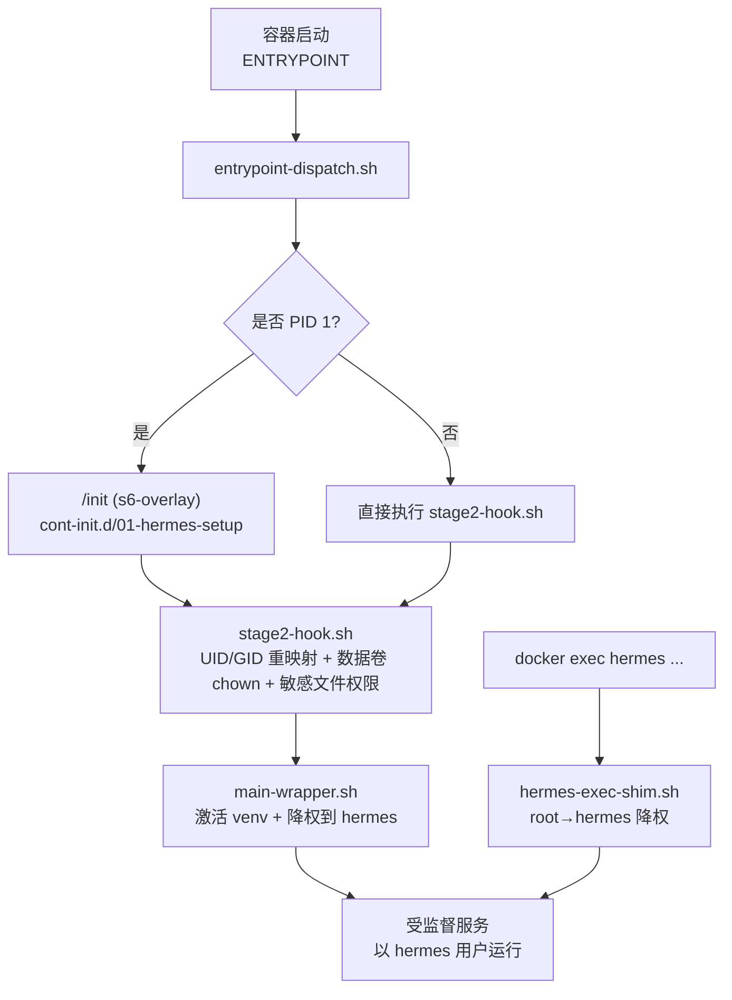
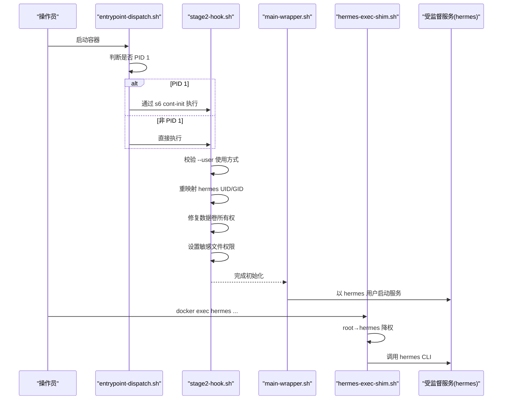
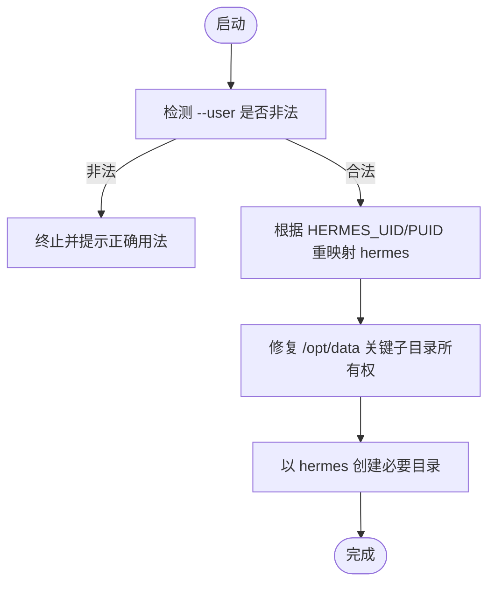
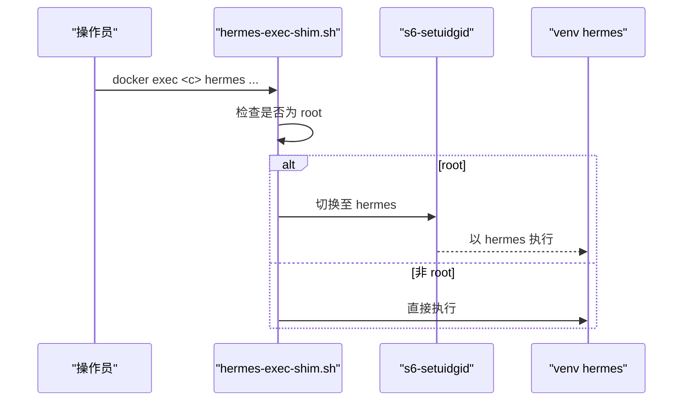
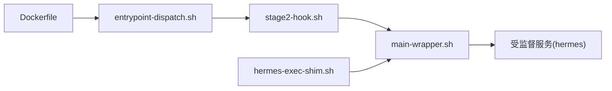

# 安全权限配置

<cite>
**本文引用的文件**
- [Dockerfile](file://Dockerfile)
- [stage2-hook.sh](file://docker/stage2-hook.sh)
- [hermes-exec-shim.sh](file://docker/hermes-exec-shim.sh)
- [main-wrapper.sh](file://docker/main-wrapper.sh)
- [entrypoint-dispatch.sh](file://docker/entrypoint-dispatch.sh)
- [SECURITY.md](file://SECURITY.md)
</cite>

## 目录
1. [简介](#简介)
2. [项目结构](#项目结构)
3. [核心组件](#核心组件)
4. [架构总览](#架构总览)
5. [详细组件分析](#详细组件分析)
6. [依赖关系分析](#依赖关系分析)
7. [性能考虑](#性能考虑)
8. [故障排查指南](#故障排查指南)
9. [结论](#结论)
10. [附录](#附录)

## 简介
本文件聚焦于 Hermes Agent 容器镜像中的“安全权限配置”，围绕非 root 用户 hermes 的创建与运行、UID/GID 动态映射、数据卷所有权同步、代码目录只读保护、特权降级机制、docker exec 命令的权限处理、访问审计与最小权限原则，给出可操作的实践说明。目标是确保 hermes 用户只能读取和执行代码目录，不能写入；同时保证运行时数据（如 /opt/data）在宿主 UID/GID 下可被正确读写，并避免越权写回安装树。

## 项目结构
Hermes 的安全权限由多阶段协作实现：
- 构建期：以 root 身份安装依赖、复制源码并设置不可变权限，创建 hermes 用户。
- 启动期：s6-overlay 初始化后，stage2-hook 完成 UID/GID 重映射、数据卷 chown、敏感文件权限收紧、目录种子化等。
- 运行期：主进程通过 main-wrapper 和 s6-setuidgid 降权到 hermes；docker exec 路径通过 hermes-exec-shim 自动降权；入口调度器 entrypoint-dispatch 适配不同 PID 1 场景。

图示来源
- [entrypoint-dispatch.sh:15-26](file://docker/entrypoint-dispatch.sh#L15-L26)
- [stage2-hook.sh:1-17](file://docker/stage2-hook.sh#L1-L17)
- [main-wrapper.sh:20-31](file://docker/main-wrapper.sh#L20-L31)
- [hermes-exec-shim.sh:1-39](file://docker/hermes-exec-shim.sh#L1-L39)

章节来源
- [Dockerfile:149-170](file://Dockerfile#L149-L170)
- [Dockerfile:278-296](file://Dockerfile#L278-L296)
- [Dockerfile:395-420](file://Dockerfile#L395-L420)
- [entrypoint-dispatch.sh:15-26](file://docker/entrypoint-dispatch.sh#L15-L26)
- [stage2-hook.sh:1-17](file://docker/stage2-hook.sh#L1-L17)
- [main-wrapper.sh:20-31](file://docker/main-wrapper.sh#L20-L31)
- [hermes-exec-shim.sh:1-39](file://docker/hermes-exec-shim.sh#L1-L39)

## 核心组件
- 非 root 用户 hermes：镜像中创建 hermes 用户，默认 UID 10000，家目录为 /opt/data（HERMES_HOME）。
- 代码目录只读：COPY --chmod=a+rX,go-w 将源码与依赖设为“所有人可读+可执行目录遍历，组/其他不可写”，仅 root 可写，防止运行时篡改。
- 动态 UID/GID 映射：通过 HERMES_UID/HERMES_GID（或 PUID/PGID）在启动时 usermod/groupmod 重映射 hermes 用户，并将数据卷目标子树 chown 给 hermes。
- 特权降级：主进程与 docker exec 路径均通过 s6-setuidgid 降权到 hermes，避免 root 持久化写回数据卷。
- 数据卷所有权同步：stage2-hook 对 /opt/data 下的关键子目录与顶层状态文件进行精准 chown，避免误改宿主页签文件。
- 敏感文件权限：.env、config.yaml、auth.json 等严格限制为所有者可读。
- 审计与可观测性：日志、会话、钩子等目录由 hermes 拥有，便于按用户隔离审计；错误输出与诊断信息不泄露密钥。

章节来源
- [Dockerfile:149-170](file://Dockerfile#L149-L170)
- [Dockerfile:278-296](file://Dockerfile#L278-L296)
- [Dockerfile:395-420](file://Dockerfile#L395-L420)
- [stage2-hook.sh:88-116](file://docker/stage2-hook.sh#L88-L116)
- [stage2-hook.sh:174-255](file://docker/stage2-hook.sh#L174-L255)
- [stage2-hook.sh:362-372](file://docker/stage2-hook.sh#L362-L372)
- [stage2-hook.sh:434-444](file://docker/stage2-hook.sh#L434-L444)

## 架构总览
下图展示了从容器启动到业务进程运行的完整权限链路，包括 PID 1 与非 PID 1 两条路径，以及 docker exec 的特权降级。

图示来源
- [entrypoint-dispatch.sh:15-26](file://docker/entrypoint-dispatch.sh#L15-L26)
- [stage2-hook.sh:23-74](file://docker/stage2-hook.sh#L23-L74)
- [stage2-hook.sh:88-116](file://docker/stage2-hook.sh#L88-L116)
- [stage2-hook.sh:174-255](file://docker/stage2-hook.sh#L174-L255)
- [main-wrapper.sh:20-31](file://docker/main-wrapper.sh#L20-L31)
- [hermes-exec-shim.sh:41-87](file://docker/hermes-exec-shim.sh#L41-L87)

## 详细组件分析

### 非 root 用户 hermes 的创建与家目录
- 镜像中以 root 身份创建 hermes 用户，UID 10000，家目录指向 /opt/data（即 HERMES_HOME），作为所有运行时数据的根目录。
- 工作目录与 PATH 配置确保 venv 可被发现，且 /opt/hermes/bin 优先用于特权降级。

章节来源
- [Dockerfile:149-170](file://Dockerfile#L149-L170)
- [Dockerfile:395-420](file://Dockerfile#L395-L420)

### 代码目录只读保护：--chmod=a+rX,go-w 的含义与作用
- a+rX：对所有用户授予读权限，并对目录授予执行（遍历）权限，使 hermes 能读取代码与进入目录。
- go-w：禁止组与其他用户写入，确保 hermes 无法修改安装树（/opt/hermes）。
- 该设置在 COPY 阶段固化，避免后续 chmod -R 遍历开销，同时保持 root 仍可写以便构建期继续操作。

章节来源
- [Dockerfile:278-296](file://Dockerfile#L278-L296)

### 动态用户映射：HERMES_UID/PUID 与数据卷权限同步
- 支持通过 HERMES_UID/HERMES_GID 或 PUID/PGID 指定宿主 UID/GID，并在启动时 usermod/groupmod 重映射 hermes。
- 对 /opt/data 的关键子目录与顶层状态文件进行精准 chown，避免误改宿主页签文件；拒绝通过符号链接路径执行危险操作。
- 若检测到以任意 --user 启动（非 root 且非 hermes），立即报错并提示正确用法，避免破坏 s6 监督树。

图示来源
- [stage2-hook.sh:23-74](file://docker/stage2-hook.sh#L23-L74)
- [stage2-hook.sh:88-116](file://docker/stage2-hook.sh#L88-L116)
- [stage2-hook.sh:174-255](file://docker/stage2-hook.sh#L174-L255)
- [stage2-hook.sh:374-396](file://docker/stage2-hook.sh#L374-L396)

章节来源
- [stage2-hook.sh:23-74](file://docker/stage2-hook.sh#L23-L74)
- [stage2-hook.sh:88-116](file://docker/stage2-hook.sh#L88-L116)
- [stage2-hook.sh:174-255](file://docker/stage2-hook.sh#L174-L255)
- [stage2-hook.sh:374-396](file://docker/stage2-hook.sh#L374-L396)

### 特权降级与 docker exec 权限处理
- 主进程：main-wrapper 在进入 venv 前设置 HOME=/opt/data，并通过 s6-setuidgid 降权到 hermes 再执行 hermes。
- docker exec：hermes-exec-shim 拦截 root 调用的 hermes，强制通过 s6-setuidgid 降权到 hermes 后再 exec 真实二进制；支持通过环境变量退出此行为（仅限诊断）。
- 递归安全：shim 通过绝对路径 exec venv 二进制，避免 PATH 劫持导致的递归。

图示来源
- [hermes-exec-shim.sh:41-87](file://docker/hermes-exec-shim.sh#L41-L87)
- [main-wrapper.sh:20-31](file://docker/main-wrapper.sh#L20-L31)

章节来源
- [hermes-exec-shim.sh:1-39](file://docker/hermes-exec-shim.sh#L1-L39)
- [hermes-exec-shim.sh:41-87](file://docker/hermes-exec-shim.sh#L41-L87)
- [main-wrapper.sh:20-31](file://docker/main-wrapper.sh#L20-L31)

### 文件所有权控制与访问审计
- 数据卷所有权：stage2-hook 对 /opt/data 下的 cron、sessions、logs、hooks、memories、skills、skins、plans、workspace、home、pairing、platforms/pairing、lazy-packages 等子目录进行 chown，确保 hermes 可写。
- 顶层状态文件：auth.json、state.db*、gateway.* 等文件在每次启动时校正所有权，避免 root 写入导致后续读取失败。
- 敏感文件权限：.env 设置为 600，config.yaml 设置为 640，auth.json 首次引导时设置为 600，降低凭据泄露风险。
- 审计建议：将日志与状态目录挂载到独立卷并按 hermes 用户隔离，结合系统审计工具（如 auditd）记录异常写操作。

章节来源
- [stage2-hook.sh:174-255](file://docker/stage2-hook.sh#L174-L255)
- [stage2-hook.sh:331-360](file://docker/stage2-hook.sh#L331-L360)
- [stage2-hook.sh:362-372](file://docker/stage2-hook.sh#L362-L372)
- [stage2-hook.sh:434-444](file://docker/stage2-hook.sh#L434-L444)

### 安全最佳实践与合规要求
- 最小权限原则：
  - 代码目录只读（a+rX,go-w），仅数据目录可写。
  - 运行以 hermes 用户，避免 root 持久化写回。
  - 敏感文件最小权限（.env 600，config.yaml 640）。
- 隔离策略：
  - 推荐在容器或沙箱中运行整个进程树，配合网络出口策略与凭据注入。
  - 不要以任意 --user 启动容器；使用 HERMES_UID/PUID 对齐宿主 UID。
- 合规与审计：
  - 将日志、会话、凭证文件纳入集中审计与备份策略。
  - 对外暴露的网关或 API 必须配置访问白名单与网络边界防护。

章节来源
- [SECURITY.md:58-119](file://SECURITY.md#L58-L119)
- [SECURITY.md:301-324](file://SECURITY.md#L301-L324)

## 依赖关系分析
- Dockerfile 负责构建期权限固化与用户创建，并安装 s6-overlay、Node/Python 工具链。
- entrypoint-dispatch.sh 决定走 s6 监督路径或直接 bootstrap。
- stage2-hook.sh 承担启动期权限治理（UID/GID、chown、敏感文件权限）。
- main-wrapper.sh 负责环境准备与降权到 hermes。
- hermes-exec-shim.sh 保障 docker exec 路径的降权一致性。

图示来源
- [Dockerfile:149-170](file://Dockerfile#L149-L170)
- [Dockerfile:278-296](file://Dockerfile#L278-L296)
- [entrypoint-dispatch.sh:15-26](file://docker/entrypoint-dispatch.sh#L15-L26)
- [stage2-hook.sh:1-17](file://docker/stage2-hook.sh#L1-L17)
- [main-wrapper.sh:20-31](file://docker/main-wrapper.sh#L20-L31)
- [hermes-exec-shim.sh:1-39](file://docker/hermes-exec-shim.sh#L1-L39)

章节来源
- [Dockerfile:149-170](file://Dockerfile#L149-L170)
- [Dockerfile:278-296](file://Dockerfile#L278-L296)
- [entrypoint-dispatch.sh:15-26](file://docker/entrypoint-dispatch.sh#L15-L26)
- [stage2-hook.sh:1-17](file://docker/stage2-hook.sh#L1-L17)
- [main-wrapper.sh:20-31](file://docker/main-wrapper.sh#L20-L31)
- [hermes-exec-shim.sh:1-39](file://docker/hermes-exec-shim.sh#L1-L39)

## 性能考虑
- 构建期使用 --chmod 固化权限，避免运行时大范围 chmod -R 带来的 I/O 与 CPU 开销。
- 数据卷 chown 采用“精准子目录 + 存在性预检”的策略，减少不必要的递归扫描。
- 懒加载包安装重定向到 /opt/data/lazy-packages，避免污染只读 venv，提升可维护性与稳定性。

章节来源
- [Dockerfile:278-296](file://Dockerfile#L278-L296)
- [Dockerfile:378-393](file://Dockerfile#L378-L393)
- [stage2-hook.sh:174-255](file://docker/stage2-hook.sh#L174-L255)

## 故障排查指南
- 现象：容器以 --user $(id -u):$(id -g) 启动后报权限错误或无法启动。
  - 原因：s6-overlay 需要 root 完成初始化，任意 --user 会跳过 bootstrap。
  - 解决：改用 HERMES_UID/HERMES_GID 或 PUID/PGID 对齐宿主 UID。
- 现象：docker exec 写入 .env/auth.json 后网关无法读取。
  - 原因：root 写入导致文件属主为 root，hermes 无读权限。
  - 解决：使用 hermes-exec-shim 自动降权；或显式 -u hermes 执行；必要时重启以触发 chown 修复。
- 现象：启动时报“不支持的 --user”。
  - 原因：检测到非 root 且非 hermes 的 UID。
  - 解决：参考错误提示，使用环境变量重映射 UID/GID。

章节来源
- [stage2-hook.sh:23-74](file://docker/stage2-hook.sh#L23-L74)
- [hermes-exec-shim.sh:1-39](file://docker/hermes-exec-shim.sh#L1-L39)
- [main-wrapper.sh:33-59](file://docker/main-wrapper.sh#L33-L59)

## 结论
通过“构建期只读 + 启动期 UID/GID 重映射 + 运行期降权”的分层设计，Hermes 实现了最小权限与安全边界的平衡：代码目录不可写，数据目录按宿主 UID/GID 正确归属，敏感文件严格受限，docker exec 路径统一降权。配合安全策略文档与审计建议，可在生产环境中稳定运行并满足合规要求。

## 附录
- 环境变量速查
  - HERMES_HOME：运行时数据根目录（默认 /opt/data）。
  - HERMES_UID/HERMES_GID：运行时 hermes 用户的 UID/GID（可选）。
  - PUID/PGID：NAS 常用别名，等价于 HERMES_UID/HERMES_GID。
  - HERMES_DOCKER_EXEC_AS_ROOT：仅在诊断时允许 docker exec 保持 root。
- 关键路径
  - /opt/hermes：只读安装树（源码、依赖、TUI 资源）。
  - /opt/data：可写数据卷（会话、日志、配置、凭据等）。

章节来源
- [Dockerfile:378-393](file://Dockerfile#L378-L393)
- [Dockerfile:395-420](file://Dockerfile#L395-L420)
- [stage2-hook.sh:88-116](file://docker/stage2-hook.sh#L88-L116)
- [hermes-exec-shim.sh:36-39](file://docker/hermes-exec-shim.sh#L36-L39)