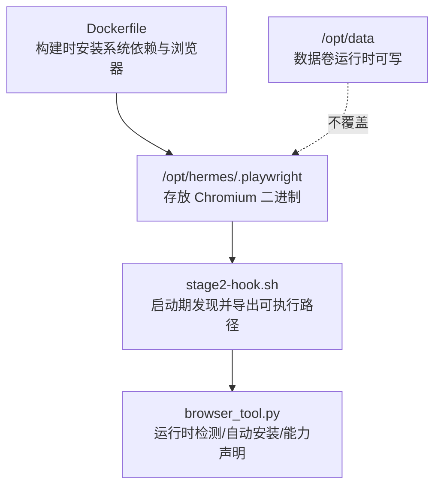
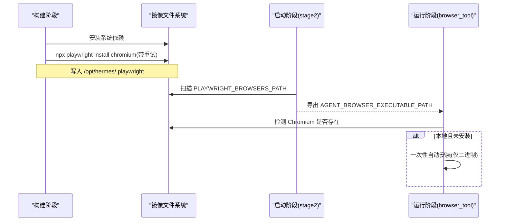
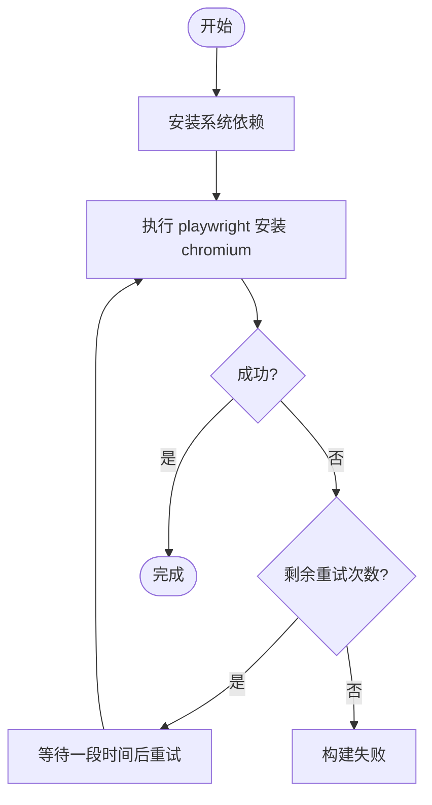
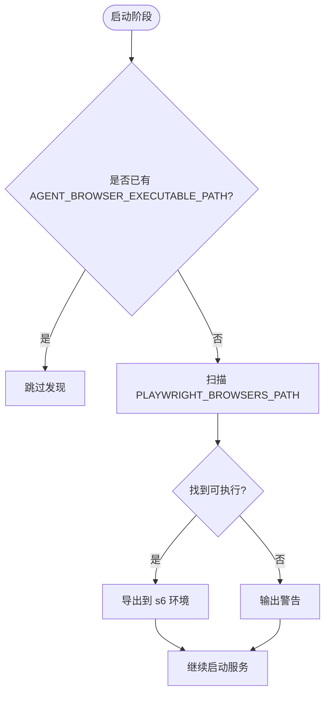
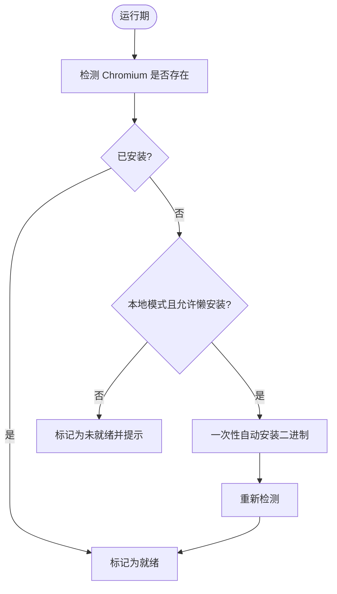

# 浏览器依赖预安装

<cite>
**本文引用的文件**
- [Dockerfile](file://Dockerfile)
- [stage2-hook.sh](file://docker/stage2-hook.sh)
- [browser_tool.py](file://tools/browser_tool.py)
- [test_browser_chromium_check.py](file://tests/tools/test_browser_chromium_check.py)
</cite>

## 目录
1. [简介](#简介)
2. [项目结构](#项目结构)
3. [核心组件](#核心组件)
4. [架构总览](#架构总览)
5. [详细组件分析](#详细组件分析)
6. [依赖关系分析](#依赖关系分析)
7. [性能与空间优化](#性能与空间优化)
8. [故障排查指南](#故障排查指南)
9. [结论](#结论)

## 简介
本文件说明 Hermes 容器镜像中 Playwright 浏览器的预安装策略、重试机制、依赖检查与启动期修复，以及为何将浏览器安装在 /opt/hermes/.playwright 下（避免被 /opt/data 卷覆盖）。文档还包含验证方法、常见失败原因与解决方案、更新策略和性能调优建议。

## 项目结构
围绕浏览器依赖的关键位置：
- 构建阶段：在 Dockerfile 中安装系统依赖并执行 Playwright 浏览器下载，设置环境变量指向非挂载路径。
- 启动阶段：通过 s6-overlay 的 stage2 hook 扫描已安装的 Chromium 二进制，导出给运行时使用。
- 运行阶段：工具层检测 Chromium 是否可用，必要时进行一次性自动安装尝试（本地环境），并在云模式或 Camofox 模式下放宽要求。

图表来源
- [Dockerfile:60-62](file://Dockerfile#L60-L62)
- [Dockerfile:200-204](file://Dockerfile#L200-L204)
- [stage2-hook.sh:543-589](file://docker/stage2-hook.sh#L543-L589)
- [browser_tool.py:4700-4787](file://tools/browser_tool.py#L4700-L4787)

章节来源
- [Dockerfile:60-62](file://Dockerfile#L60-L62)
- [Dockerfile:200-204](file://Dockerfile#L200-L204)
- [stage2-hook.sh:543-589](file://docker/stage2-hook.sh#L543-L589)
- [browser_tool.py:4700-4787](file://tools/browser_tool.py#L4700-L4787)

## 核心组件
- 构建期安装与重试：Dockerfile 在安装系统依赖后，多次重试执行 Playwright 浏览器安装命令，确保网络抖动或 CDN 瞬断不影响镜像构建。
- 环境变量 PLAYWRIGHT_BROWSERS_PATH：将浏览器缓存路径设置为 /opt/hermes/.playwright，该路径位于不可变镜像层，不会被运行时 /opt/data 卷覆盖。
- 启动期发现：stage2-hook.sh 在容器启动时扫描该路径，找到 Chromium 可执行文件并通过 s6 的环境变量注入到后续服务进程。
- 运行期检测与自愈：browser_tool.py 提供 Chromium 存在性检测、搜索根目录解析、一次性自动安装（仅本地环境）等逻辑，避免首次调用长时间挂起。

章节来源
- [Dockerfile:60-62](file://Dockerfile#L60-L62)
- [Dockerfile:200-204](file://Dockerfile#L200-L204)
- [stage2-hook.sh:543-589](file://docker/stage2-hook.sh#L543-L589)
- [browser_tool.py:4700-4787](file://tools/browser_tool.py#L4700-L4787)

## 架构总览
下图展示了从构建到运行的完整流程，包括重试、环境变量传递、启动期发现与运行期检测。

图表来源
- [Dockerfile:60-62](file://Dockerfile#L60-L62)
- [Dockerfile:200-204](file://Dockerfile#L200-L204)
- [stage2-hook.sh:543-589](file://docker/stage2-hook.sh#L543-L589)
- [browser_tool.py:4700-4787](file://tools/browser_tool.py#L4700-L4787)

## 详细组件分析

### 构建期：Playwright 浏览器安装与重试
- 目标：在镜像构建阶段下载 Chromium 并安装其系统依赖，减少运行时首次启动延迟。
- 重试机制：对浏览器安装命令进行最多三次重试，每次失败后等待一段时间再试，最后一次失败则终止构建。
- 系统依赖：通过包管理器安装 ffmpeg、gcc、g++、cmake、python3-dev 等必要库，确保浏览器二进制能正确运行。

图表来源
- [Dockerfile:200-204](file://Dockerfile#L200-L204)

章节来源
- [Dockerfile:200-204](file://Dockerfile#L200-L204)

### 环境变量：PLAYWRIGHT_BROWSERS_PATH 的作用
- 作用：指定 Playwright 浏览器缓存目录。Hermes 将其设置为 /opt/hermes/.playwright，位于镜像只读层。
- 原因：运行时 /opt/data 为可写数据卷，若浏览器安装在其中，会被卷挂载覆盖导致丢失；放在 /opt/hermes/.playwright 可保证跨重启稳定存在。
- 运行时影响：browser_tool.py 会优先使用该路径作为 Chromium 搜索根之一，便于快速定位二进制。

章节来源
- [Dockerfile:60-62](file://Dockerfile#L60-L62)
- [browser_tool.py:4700-4725](file://tools/browser_tool.py#L4700-L4725)

### 启动期：Chromium 二进制发现与导出
- 触发时机：s6-overlay 的 cont-init 钩子在用户服务启动前执行。
- 行为：
  - 若未显式设置 AGENT_BROWSER_EXECUTABLE_PATH，则扫描 PLAYWRIGHT_BROWSERS_PATH 下的可执行文件，匹配常见 Chromium 名称。
  - 找到后将路径写入 s6 的 container_environment，供所有受管服务继承。
  - 若未找到，输出警告提示浏览器工具可能失败。
- 安全考虑：仅按文件名匹配，避免误选共享库等非可执行文件。

图表来源
- [stage2-hook.sh:543-589](file://docker/stage2-hook.sh#L543-L589)

章节来源
- [stage2-hook.sh:543-589](file://docker/stage2-hook.sh#L543-L589)

### 运行期：Chromium 检测与自动安装
- 检测顺序：
  1) 显式环境变量 AGENT_BROWSER_EXECUTABLE_PATH
  2) 系统 PATH 中的 Chrome/Chromium
  3) Playwright 缓存目录（优先 PLAYWRIGHT_BROWSERS_PATH，其次默认缓存路径）
- 自动安装：
  - 仅在本地环境（非 Docker）且允许懒安装时尝试一次性安装二进制（不含系统依赖）。
  - 安装失败会记录日志并返回“未就绪”，避免阻塞后续流程。
- 能力声明：
  - 工具在启动时会检查浏览器需求，若缺失则在本地模式下给出明确提示，避免首次调用长时间挂起。

图表来源
- [browser_tool.py:4700-4787](file://tools/browser_tool.py#L4700-L4787)
- [browser_tool.py:4790-4858](file://tools/browser_tool.py#L4790-L4858)

章节来源
- [browser_tool.py:4700-4787](file://tools/browser_tool.py#L4700-L4787)
- [browser_tool.py:4790-4858](file://tools/browser_tool.py#L4790-L4858)

### 验证浏览器安装成功
- 构建阶段：镜像构建成功后，/opt/hermes/.playwright 应存在对应 Chromium 目录。
- 启动阶段：查看 stage2 日志，确认是否发现并导出了 AGENT_BROWSER_EXECUTABLE_PATH。
- 运行阶段：
  - 在本地模式调用浏览器相关工具，观察是否立即失败并提示需要安装。
  - 在 Docker 模式中，由于镜像已内置浏览器，应直接可用。
  - 可通过测试用例思路验证：设置 PLAYWRIGHT_BROWSERS_PATH 指向一个包含 chromium-* 或 chromium_headless_shell-* 目录的路径，检测函数应返回“已安装”。

章节来源
- [test_browser_chromium_check.py:23-35](file://tests/tools/test_browser_chromium_check.py#L23-L35)
- [test_browser_chromium_check.py:49-55](file://tests/tools/test_browser_chromium_check.py#L49-L55)

## 依赖关系分析
- 构建期依赖：系统库（ffmpeg、gcc、g++、cmake、python3-dev 等）与网络访问（下载 Playwright 二进制）。
- 启动期依赖：s6-overlay 环境、PLAYWRIGHT_BROWSERS_PATH 路径存在性。
- 运行期依赖：agent-browser CLI（本地模式）、PATH 中的浏览器可执行文件或缓存目录中的构建。

图表来源
- [Dockerfile:71-74](file://Dockerfile#L71-L74)
- [Dockerfile:200-204](file://Dockerfile#L200-L204)
- [stage2-hook.sh:543-589](file://docker/stage2-hook.sh#L543-L589)
- [browser_tool.py:4700-4787](file://tools/browser_tool.py#L4700-L4787)

章节来源
- [Dockerfile:71-74](file://Dockerfile#L71-L74)
- [Dockerfile:200-204](file://Dockerfile#L200-L204)
- [stage2-hook.sh:543-589](file://docker/stage2-hook.sh#L543-L589)
- [browser_tool.py:4700-4787](file://tools/browser_tool.py#L4700-L4787)

## 性能与空间优化
- 构建缓存：Dockerfile 先复制 manifest 文件再执行 npm install 与 playwright install，利用层缓存加速重复构建。
- 重试与超时：构建阶段对浏览器安装进行多次重试，降低网络波动影响；运行期自动安装设置超时，避免长时间阻塞。
- 磁盘空间：
  - 浏览器二进制约数百 MB，建议预留足够空间。
  - 清理 npm 缓存以减少镜像体积（构建阶段已执行清理）。
- 性能调优：
  - 在本地开发环境启用懒安装可减少冷启动时间；生产镜像建议预装以避免首次调用延迟。
  - 使用 headless shell 可降低资源占用。

[本节为通用指导，无需特定文件引用]

## 故障排查指南
- 常见问题与原因：
  - 构建阶段失败：网络不稳定或 CDN 不可用。解决：检查网络，重试构建。
  - 启动阶段未找到浏览器：PLAYWRIGHT_BROWSERS_PATH 不存在或权限问题。解决：确认路径存在且可执行位正确。
  - 运行期首次调用挂起：缺少 Chromium 且未启用自动安装。解决：手动安装或启用懒安装。
  - 云模式/Camofox：不需要本地浏览器，但需配置相应后端 URL 与凭据。
- 诊断步骤：
  - 检查镜像层是否包含 /opt/hermes/.playwright。
  - 查看 stage2 日志中是否有“Found agent-browser Chromium binary”或警告。
  - 在本地模式调用浏览器工具，观察是否提示需要安装。
  - 使用测试思路：设置 PLAYWRIGHT_BROWSERS_PATH 并创建 chromium-* 目录，验证检测函数返回“已安装”。

章节来源
- [Dockerfile:200-204](file://Dockerfile#L200-L204)
- [stage2-hook.sh:543-589](file://docker/stage2-hook.sh#L543-L589)
- [browser_tool.py:4700-4787](file://tools/browser_tool.py#L4700-L4787)
- [test_browser_chromium_check.py:23-35](file://tests/tools/test_browser_chromium_check.py#L23-L35)

## 结论
Hermes 通过构建期预安装、环境变量隔离、启动期发现与运行期检测的多层策略，确保浏览器依赖的稳定可用。将浏览器安装在 /opt/hermes/.playwright 避免了数据卷覆盖风险；重试机制提升了构建鲁棒性；运行期检测与自动安装降低了首次使用成本。遵循本文的验证与排障步骤，可有效保障浏览器功能的可靠性与性能。