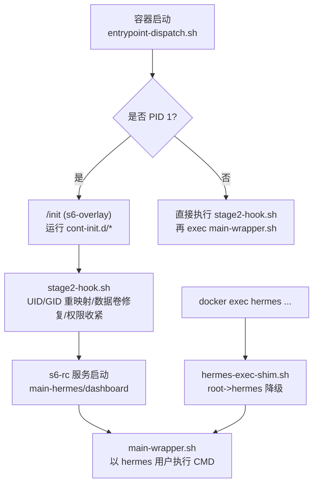
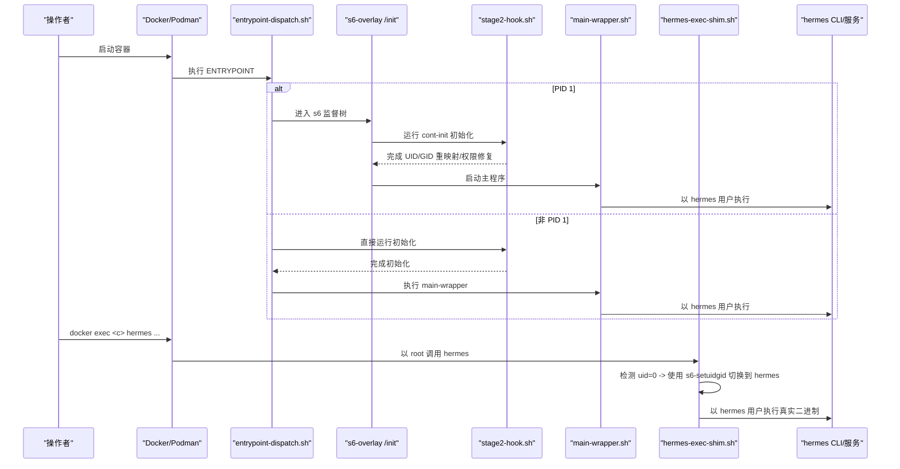
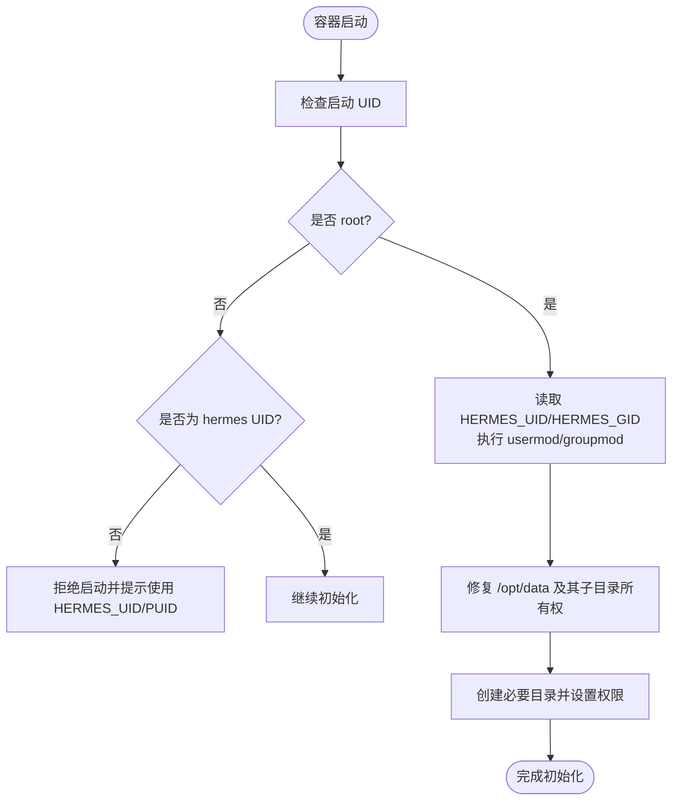
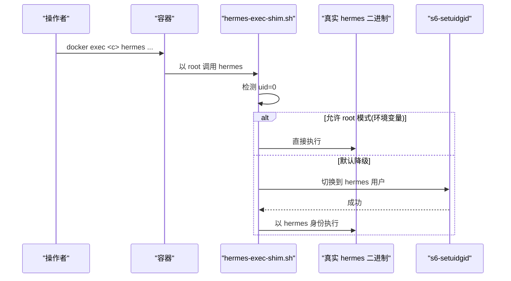
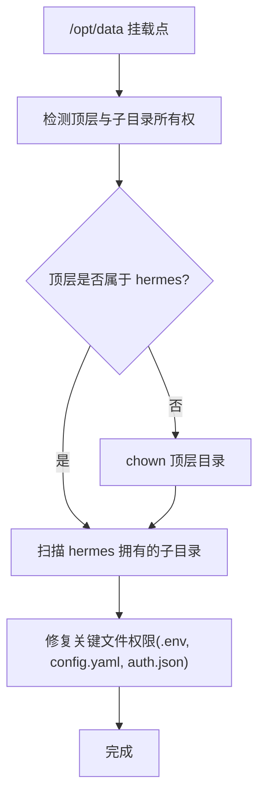
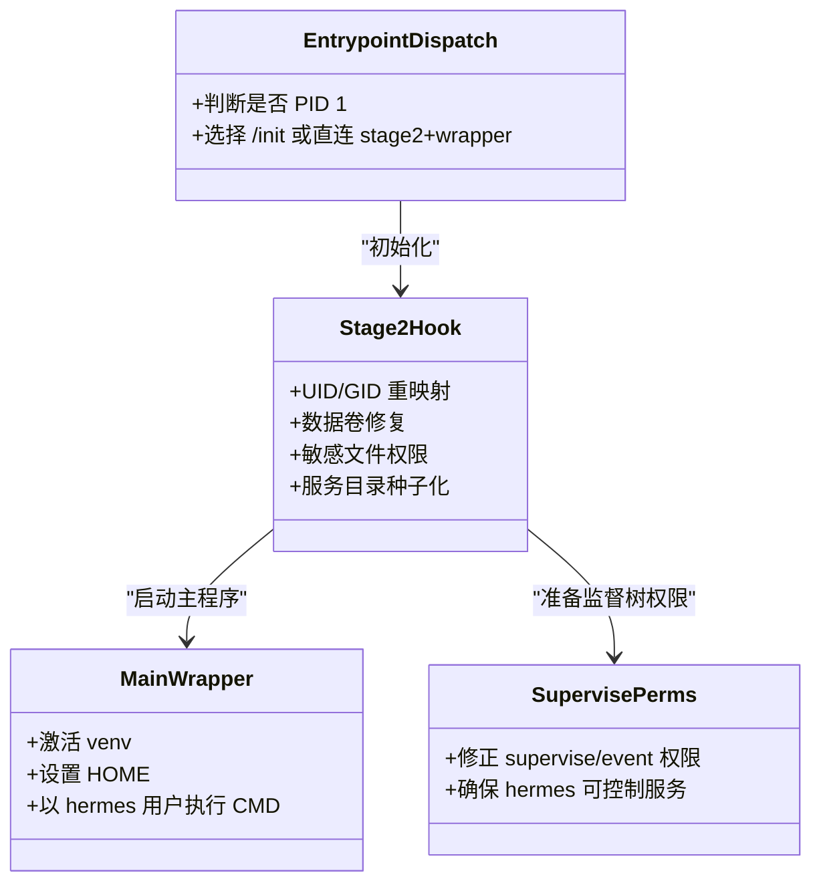
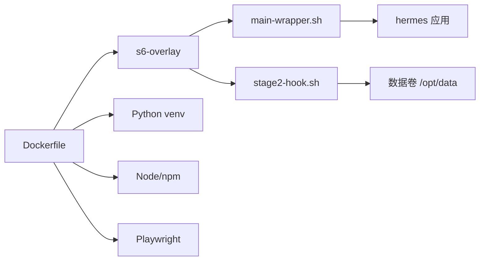

# 安全与权限管理

<cite>
**本文引用的文件**
- [Dockerfile](file://Dockerfile)
- [docker/stage2-hook.sh](file://docker/stage2-hook.sh)
- [docker/main-wrapper.sh](file://docker/main-wrapper.sh)
- [docker/hermes-exec-shim.sh](file://docker/hermes-exec-shim.sh)
- [docker/entrypoint-dispatch.sh](file://docker/entrypoint-dispatch.sh)
- [docker/cont-init.d/015-supervise-perms](file://docker/cont-init.d/015-supervise-perms)
</cite>

## 目录
1. [简介](#简介)
2. [项目结构](#项目结构)
3. [核心组件](#核心组件)
4. [架构总览](#架构总览)
5. [详细组件分析](#详细组件分析)
6. [依赖关系分析](#依赖关系分析)
7. [性能与安全考量](#性能与安全考量)
8. [故障排查指南](#故障排查指南)
9. [结论](#结论)
10. [附录：合规与最佳实践清单](#附录合规与最佳实践清单)

## 简介
本文件面向安全团队与运维工程师，系统性说明 Hermes Agent 容器在用户权限、特权降级、数据卷权限、配置访问控制、命令执行安全以及 s6-overlay 进程隔离方面的设计与实现。重点覆盖 hermes 用户的创建与 UID/GID 映射、hermes-exec-shim.sh 的 root 到非 root 切换机制、s6-overlay 的用户切换与资源边界、以及可操作的排障与合规建议。

## 项目结构
与安全和权限相关的关键路径集中在 docker 目录与镜像构建阶段：
- 镜像构建期：定义 hermes 用户、安装 s6-overlay、设置只读代码层、暴露 /opt/data 数据卷、注入 PATH 与入口脚本。
- 启动期（PID 1）：entrypoint-dispatch.sh 决定走 s6-overlay /init 或直连 stage2 + main-wrapper。
- 初始化阶段（cont-init）：stage2-hook.sh 负责 UID/GID 重映射、数据卷归属修复、敏感文件权限收紧、服务目录种子化等。
- 运行时：main-wrapper.sh 将 CMD 以 hermes 用户执行；hermes-exec-shim.sh 拦截 docker exec 的 root 调用并自动降级。
- 服务监督：015-supervise-perms 确保 s6 监督树对非 root 用户可查询与控制。

图表来源
- [docker/entrypoint-dispatch.sh:1-26](file://docker/entrypoint-dispatch.sh#L1-L26)
- [docker/stage2-hook.sh:1-592](file://docker/stage2-hook.sh#L1-L592)
- [docker/main-wrapper.sh:1-92](file://docker/main-wrapper.sh#L1-L92)
- [docker/hermes-exec-shim.sh:1-88](file://docker/hermes-exec-shim.sh#L1-L88)

章节来源
- [Dockerfile:149-422](file://Dockerfile#L149-L422)
- [docker/entrypoint-dispatch.sh:1-26](file://docker/entrypoint-dispatch.sh#L1-L26)

## 核心组件
- hermes 用户与 UID/GID 映射：镜像内创建 hermes 用户（默认 UID 10000），支持通过 HERMES_UID/HERMES_GID（或 PUID/PGID）在启动时重映射为宿主 UID/GID，避免文件所有权错配。
- 特权降级：所有受管服务与 CLI 均以 hermes 用户运行；docker exec 默认 root 会被 hermes-exec-shim.sh 透明降级。
- 数据卷权限：/opt/data 为持久化数据卷，启动时修复关键子目录与文件的所有权与权限，保证非 root 进程可读可写。
- 配置与密钥保护：.env、config.yaml、auth.json 等敏感文件在首次创建或存在时强制收紧权限，仅 owner 可读。
- s6-overlay 监督与权限：静态服务 supervise 树由 015-supervise-perms 调整为 hermes 可访问，保障 s6-svstat/s6-svc 在非 root 下可用。

章节来源
- [Dockerfile:149-151](file://Dockerfile#L149-L151)
- [docker/stage2-hook.sh:88-116](file://docker/stage2-hook.sh#L88-L116)
- [docker/stage2-hook.sh:174-372](file://docker/stage2-hook.sh#L174-L372)
- [docker/cont-init.d/015-supervise-perms:1-91](file://docker/cont-init.d/015-supervise-perms#L1-L91)

## 架构总览
Hermes 容器采用“最小特权”原则：
- 代码层只读：/opt/hermes 在镜像中为 root 拥有且不可写，防止运行时被篡改。
- 数据层可写：/opt/data 为挂载的数据卷，由 hermes 用户拥有和写入。
- 进程隔离：s6-overlay 作为 PID 1 管理服务生命周期，每个服务以 hermes 用户运行。
- 入口与 shim：entrypoint-dispatch.sh 协调 PID 1 与非 PID 1 两种运行环境；hermes-exec-shim.sh 确保 docker exec 不泄露 root 权限。

图表来源
- [docker/entrypoint-dispatch.sh:1-26](file://docker/entrypoint-dispatch.sh#L1-L26)
- [docker/stage2-hook.sh:1-592](file://docker/stage2-hook.sh#L1-L592)
- [docker/main-wrapper.sh:1-92](file://docker/main-wrapper.sh#L1-L92)
- [docker/hermes-exec-shim.sh:1-88](file://docker/hermes-exec-shim.sh#L1-L88)

## 详细组件分析

### 用户模型与 UID/GID 映射
- 镜像内创建 hermes 用户（默认 UID 10000），工作目录 /opt/data。
- 启动时若检测到 --user 指定了任意非 hermes 的 UID，则拒绝启动并给出指引，推荐使用 HERMES_UID/HERMES_GID（或 PUID/PGID）进行重映射。
- 支持 Docker socket 组权限自动适配（当挂载宿主机 docker.sock 时）。

图表来源
- [docker/stage2-hook.sh:23-74](file://docker/stage2-hook.sh#L23-L74)
- [docker/stage2-hook.sh:88-116](file://docker/stage2-hook.sh#L88-L116)
- [docker/stage2-hook.sh:174-372](file://docker/stage2-hook.sh#L174-L372)

章节来源
- [docker/stage2-hook.sh:23-74](file://docker/stage2-hook.sh#L23-L74)
- [docker/stage2-hook.sh:88-116](file://docker/stage2-hook.sh#L88-L116)
- [docker/stage2-hook.sh:118-172](file://docker/stage2-hook.sh#L118-L172)

### 特权降级：hermes-exec-shim.sh
- 作用：拦截 PATH 上最优先的 hermes 命令，当以 root 调用时，通过 s6-setuidgid 切换到 hermes 用户后再执行真实 venv 中的 hermes 二进制。
- 递归安全：通过绝对路径执行真实二进制，避免再次进入 shim。
- 可选绕过：可通过环境变量显式保持 root（仅限诊断场景）。
- 健壮性：若 s6-setuidgid 缺失则明确失败，避免静默回退到 root。

图表来源
- [docker/hermes-exec-shim.sh:1-88](file://docker/hermes-exec-shim.sh#L1-L88)

章节来源
- [docker/hermes-exec-shim.sh:1-88](file://docker/hermes-exec-shim.sh#L1-L88)

### 数据卷权限管理与配置文件访问控制
- 数据卷：/opt/data 为持久化卷，包含 sessions、logs、cron、skills、workspace、profiles 等。
- 所有权修复：启动时针对顶层目录与特定子目录进行精准 chown，避免误改宿主绑定目录的其他文件。
- 敏感文件：
  - .env：owner-only 读写（600）。
  - config.yaml：至少 hermes 可读（640）。
  - auth.json：首次引导或重启时按策略处理，确保 hermes 可读。
- 安全加固：/opt/hermes 代码层只读，禁止运行时修改，防止恶意替换或污染依赖。

图表来源
- [docker/stage2-hook.sh:174-372](file://docker/stage2-hook.sh#L174-L372)

章节来源
- [docker/stage2-hook.sh:174-372](file://docker/stage2-hook.sh#L174-L372)

### 命令执行安全与 s6-overlay 进程隔离
- 入口分发：entrypoint-dispatch.sh 根据是否 PID 1 选择 s6 监督路径或直接 bootstrap。
- 主包装器：main-wrapper.sh 负责激活 venv、设置 HOME、并以 hermes 用户执行 CMD。
- 监督权限：015-supervise-perms 调整 s6 监督树权限，使 hermes 用户能查询和控制服务（s6-svstat/s6-svc）。
- 资源限制：s6-overlay 提供进程监督与生命周期管理；结合容器平台（如 cgroups）可实现 CPU/内存限制。

图表来源
- [docker/entrypoint-dispatch.sh:1-26](file://docker/entrypoint-dispatch.sh#L1-L26)
- [docker/stage2-hook.sh:1-592](file://docker/stage2-hook.sh#L1-L592)
- [docker/main-wrapper.sh:1-92](file://docker/main-wrapper.sh#L1-L92)
- [docker/cont-init.d/015-supervise-perms:1-91](file://docker/cont-init.d/015-supervise-perms#L1-L91)

章节来源
- [docker/entrypoint-dispatch.sh:1-26](file://docker/entrypoint-dispatch.sh#L1-L26)
- [docker/main-wrapper.sh:1-92](file://docker/main-wrapper.sh#L1-L92)
- [docker/cont-init.d/015-supervise-perms:1-91](file://docker/cont-init.d/015-supervise-perms#L1-L91)

## 依赖关系分析
- 构建期依赖：s6-overlay、Python/Node 工具链、Playwright 浏览器等。
- 运行时依赖：s6-overlay 监督工具（s6-svscan、s6-setuidgid）、/opt/data 数据卷、必要的系统库。
- 权限依赖：hermes 用户需具备对 /opt/data 的读写权限；对 s6 监督树有查询与控制权限；对敏感文件有读取权限。

图表来源
- [Dockerfile:93-135](file://Dockerfile#L93-L135)
- [Dockerfile:222-267](file://Dockerfile#L222-L267)
- [Dockerfile:336-357](file://Dockerfile#L336-L357)

章节来源
- [Dockerfile:93-135](file://Dockerfile#L93-L135)
- [Dockerfile:222-267](file://Dockerfile#L222-L267)
- [Dockerfile:336-357](file://Dockerfile#L336-L357)

## 性能与安全考量
- 只读代码层：减少运行时篡改风险，提升安全性与稳定性。
- 精准权限修复：避免全量 chown，降低大体积数据卷的启动开销。
- 最小特权：默认以 hermes 用户运行，docker exec 自动降级，减少权限扩散面。
- 敏感文件保护：.env、config.yaml、auth.json 严格限制权限，降低密钥泄露风险。
- 监督与隔离：s6-overlay 管理服务生命周期，便于统一监控与恢复；结合平台资源限制实现 CPU/内存隔离。

[本节为通用指导，无需具体文件引用]

## 故障排查指南
- 启动报错：容器以 --user 指定任意 UID 导致无法完成初始化。应改用 HERMES_UID/HERMES_GID 或 PUID/PGID。
- 权限错误：docker exec 写入的文件属主为 root，导致 hermes 进程无法读取。应使用 hermes 用户执行或通过 hermes-exec-shim.sh 自动降级。
- 监督不可控：s6 监督树权限不足导致 s6-svstat/s6-svc 失败。确认 015-supervise-perms 已正确执行。
- 数据卷问题：/opt/data 未正确归属 hermes 或关键文件权限过宽/过严。检查 stage2-hook.sh 的修复逻辑与最终权限。
- Docker socket 访问：挂载宿主机 docker.sock 后仍报权限不足。确认 stage2-hook.sh 已将 hermes 加入对应组。

章节来源
- [docker/stage2-hook.sh:23-74](file://docker/stage2-hook.sh#L23-L74)
- [docker/stage2-hook.sh:174-372](file://docker/stage2-hook.sh#L174-L372)
- [docker/cont-init.d/015-supervise-perms:1-91](file://docker/cont-init.d/015-supervise-perms#L1-L91)
- [docker/hermes-exec-shim.sh:1-88](file://docker/hermes-exec-shim.sh#L1-L88)

## 结论
Hermes Agent 容器通过“只读代码层 + 可写数据卷 + 最小特权用户 + 自动化特权降级 + s6-overlay 监督”的组合，实现了端到端的安全与权限治理。该设计有效避免了 root 权限滥用、密钥泄露、权限错配与服务不可控等问题，并为审计与合规提供了清晰的基线。

[本节为总结，无需具体文件引用]

## 附录：合规与最佳实践清单
- 启动方式
  - 不要使用 --user 指定任意 UID；通过 HERMES_UID/HERMES_GID 或 PUID/PGID 进行重映射。
  - 生产环境默认以 root 启动，由 stage2-hook.sh 完成重映射与权限修复。
- 数据卷
  - 将 /opt/data 作为持久化卷挂载；避免将宿主其他目录直接绑定到 /opt/data 根。
  - 定期校验 /opt/data 下关键目录与文件的归属与权限。
- 敏感配置
  - .env、config.yaml、auth.json 必须仅 owner 可读；避免 umask 过宽。
  - 不在日志或错误输出中泄露密钥片段。
- 命令执行
  - 使用 hermes 用户执行 CLI；如需 root 诊断，显式设置环境变量绕过降级。
  - 避免在容器内授予不必要的系统能力（如 NET_ADMIN、SYS_PTRACE）。
- 监督与隔离
  - 启用 s6-overlay 监督服务；结合平台 cgroups 限制 CPU/内存。
  - 定期检查 s6 监督树权限，确保 hermes 可查询与控制服务。
- 审计与合规
  - 记录容器启动参数、环境变量（脱敏）、数据卷挂载信息。
  - 定期扫描镜像漏洞与依赖更新；保留构建产物与镜像元数据以便溯源。
  - 遵循最小权限原则与职责分离，避免在生产环境使用 root 会话。

[本节为通用指导，无需具体文件引用]