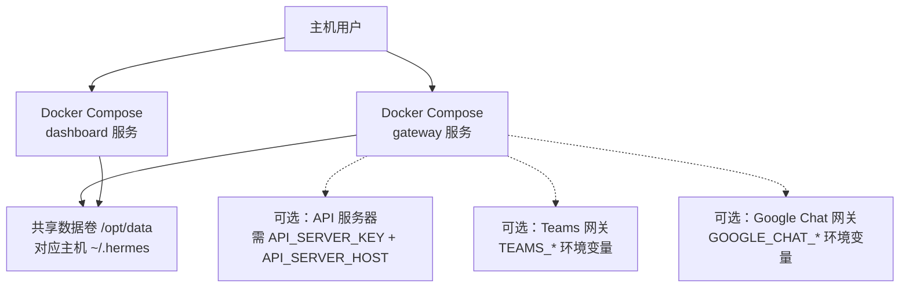
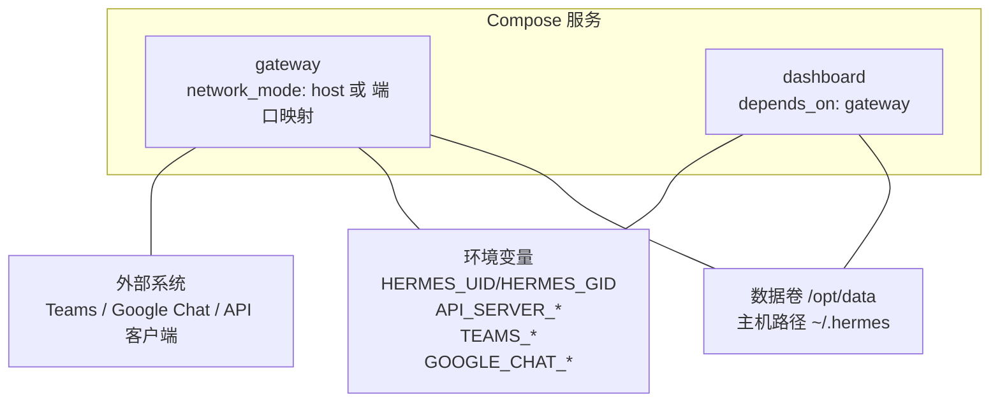
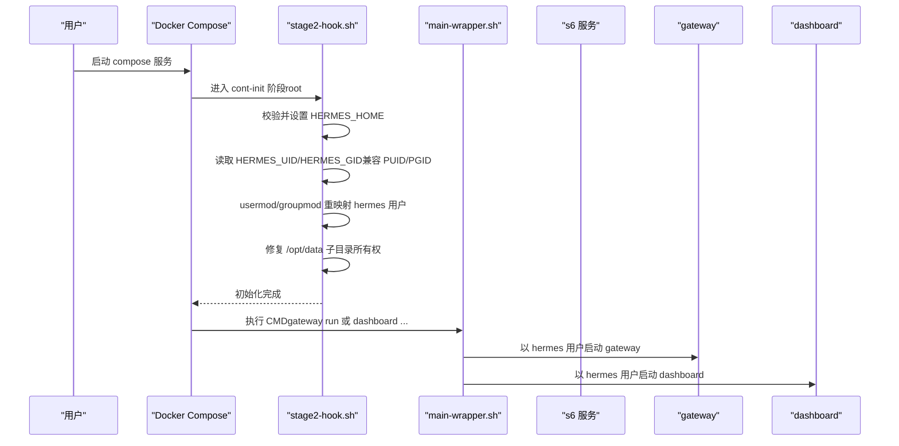
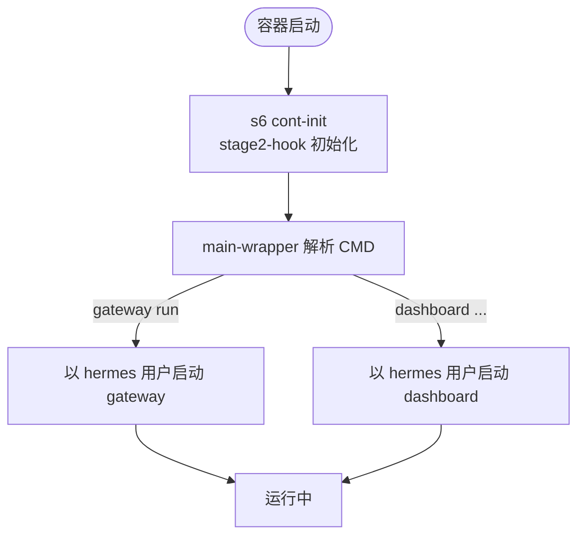
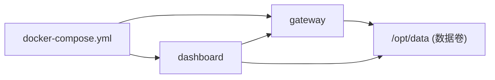

# Docker Compose 配置详解

<cite>
**本文引用的文件**
- [docker-compose.yml](file://docker-compose.yml)
- [docker-compose.windows.yml](file://docker-compose.windows.yml)
- [docker/entrypoint.sh](file://docker/entrypoint.sh)
- [docker/main-wrapper.sh](file://docker/main-wrapper.sh)
- [docker/stage2-hook.sh](file://docker/stage2-hook.sh)
- [docker/s6-rc.d/dashboard/run](file://docker/s6-rc.d/dashboard/run)
- [docker/s6-rc.d/main-hermes/run](file://docker/s6-rc.d/main-hermes/run)
</cite>

## 目录
1. [简介](#简介)
2. [项目结构](#项目结构)
3. [核心组件](#核心组件)
4. [架构总览](#架构总览)
5. [详细组件分析](#详细组件分析)
6. [依赖关系分析](#依赖关系分析)
7. [性能注意事项](#性能注意事项)
8. [故障排除指南](#故障排除指南)
9. [结论](#结论)
10. [附录](#附录)

## 简介
本文件面向使用 Docker Compose 部署 Hermes Agent 的运维与开发者，聚焦 gateway 与 dashboard 两个服务的完整配置说明。内容涵盖服务定义、网络模式、数据卷挂载、环境变量（特别是 HERMES_UID/HERMES_GID 的用户权限映射）、平台差异（Windows 特殊处理）、API 服务器暴露、Teams 与 Google Chat 集成等高级选项，并给出安全注意事项、最佳实践与常见问题排查建议。

## 项目结构
仓库提供两套 Compose 配置：
- docker-compose.yml：适用于 Linux/macOS 或支持 host 网络的容器环境，默认以 host 网络运行 gateway，dashboard 默认绑定 127.0.0.1。
- docker-compose.windows.yml：适配 Windows Docker Desktop，移除 network_mode: host，改用端口映射；路径使用 Windows 风格；dashboard 默认监听 0.0.0.0 并通过端口映射暴露。

**图示来源**
- [docker-compose.yml:30-76](file://docker-compose.yml#L30-L76)
- [docker-compose.windows.yml:13-38](file://docker-compose.windows.yml#L13-L38)

**章节来源**
- [docker-compose.yml:1-77](file://docker-compose.yml#L1-L77)
- [docker-compose.windows.yml:1-39](file://docker-compose.windows.yml#L1-L39)

## 核心组件
- gateway 服务
  - 作用：Hermes 网关进程，承载消息通道、会话管理、工具执行等核心能力。
  - 关键配置：
    - 网络：host（Linux/macOS），Windows 使用端口映射。
    - 数据卷：~/.hermes:/opt/data（Windows 为 ${USERPROFILE}/.hermes）。
    - 环境变量：HERMES_UID/HERMES_GID、可选 API_SERVER_*、TEAMS_*、GOOGLE_CHAT_*。
    - 命令：gateway run。
- dashboard 服务
  - 作用：Web 控制台，用于查看会话、状态、日志等。
  - 关键配置：
    - 依赖：depends_on gateway。
    - 网络：host（Linux/macOS），Windows 通过端口映射暴露。
    - 数据卷：同 gateway。
    - 环境变量：HERMES_UID/HERMES_GID、可选 HERMES_DASHBOARD_HOST/PORT/INSECURE。
    - 命令：dashboard --host ... --no-open（Windows 示例含 --insecure）。

**章节来源**
- [docker-compose.yml:30-76](file://docker-compose.yml#L30-L76)
- [docker-compose.windows.yml:13-38](file://docker-compose.windows.yml#L13-L38)

## 架构总览
下图展示了 Compose 中 gateway 与 dashboard 的关系、数据卷共享以及可选的高级集成点。

**图示来源**
- [docker-compose.yml:30-76](file://docker-compose.yml#L30-L76)
- [docker-compose.windows.yml:13-38](file://docker-compose.windows.yml#L13-L38)

## 详细组件分析

### 启动流程与权限映射（HERMES_UID/HERMES_GID）
容器采用 s6-overlay 作为进程管理器，启动时由 stage2 hook 完成用户映射、数据卷权限修复、配置文件种子化等工作，随后以 hermes 用户运行各服务。

**图示来源**
- [docker/stage2-hook.sh:20-116](file://docker/stage2-hook.sh#L20-L116)
- [docker/main-wrapper.sh:23-31](file://docker/main-wrapper.sh#L23-L31)
- [docker/s6-rc.d/dashboard/run:22-56](file://docker/s6-rc.d/dashboard/run#L22-L56)

要点说明：
- 支持 PUID/PGID 别名，便于 NAS 等平台使用。
- 拒绝以任意非 hermes UID 直接启动（--user），避免破坏 s6 监督树与只读安装树。
- 自动修复 /opt/data 下 hermes 可写目录与关键文件的归属，确保运行时读写一致。
- main-wrapper 在 drop 到 hermes 前设置 HOME=/opt/data，避免库写入 /root。

**章节来源**
- [docker/stage2-hook.sh:20-116](file://docker/stage2-hook.sh#L20-L116)
- [docker/main-wrapper.sh:23-31](file://docker/main-wrapper.sh#L23-L31)
- [docker/entrypoint.sh:1-29](file://docker/entrypoint.sh#L1-L29)

### 数据卷与持久化
- 挂载路径：
  - Linux/macOS：~/.hermes:/opt/data
  - Windows：${USERPROFILE}/.hermes:/opt/data
- 目的：将容器内 /opt/data 与宿主 ~/.hermes 同步，保证会话、配置、日志、技能等持久化。
- 权限策略：
  - 启动时根据 HERMES_UID/HERMES_GID 调整 hermes 用户 ID/GID，并对 /opt/data 下特定子目录与文件进行 chown/chmod，确保 hermes 进程可读可写。
  - 对 .env 等敏感文件强制收紧权限。

**章节来源**
- [docker-compose.yml:36-40](file://docker-compose.yml#L36-L40)
- [docker-compose.windows.yml:17-21](file://docker-compose.windows.yml#L17-L21)
- [docker/stage2-hook.sh:174-372](file://docker/stage2-hook.sh#L174-L372)

### 网络模式与端口暴露
- Linux/macOS：
  - gateway：network_mode: host，直接使用宿主机网络栈。
  - dashboard：默认绑定 127.0.0.1，仅本地访问；如需远程，建议使用 SSH 隧道或反向代理加认证。
- Windows：
  - 不支持 network_mode: host，改为显式端口映射。
  - dashboard 示例中监听 0.0.0.0:9119，并通过 127.0.0.1:9119 映射到宿主机。

注意：
- 若启用 API 服务器（见下文），务必设置 API_SERVER_KEY，并在互联网暴露时使用强认证与最小暴露面。

**章节来源**
- [docker-compose.yml:35-44](file://docker-compose.yml#L35-L44)
- [docker-compose.windows.yml:36-38](file://docker-compose.windows.yml#L36-L38)

### 环境变量与高级选项

- 通用
  - HERMES_UID/HERMES_GID：将容器内 hermes 用户映射到宿主用户，使容器内创建的文件与宿主保持一致的所有权。
  - PUID/PGID：与 HERMES_UID/HERMES_GID 等价，兼容 NAS 生态。
  - HERMES_HOME：默认 /opt/data，可通过环境变量覆盖。
  - HERMES_DASHBOARD_HOST/PORT：控制 dashboard 监听地址与端口。
  - HERMES_DASHBOARD_INSECURE：不再禁用鉴权，仅告警提示。

- API 服务器（OpenAI 兼容接口）
  - 需要同时设置 API_SERVER_HOST 与 API_SERVER_KEY。
  - 仅在明确需求且具备足够安全措施时对外暴露。

- Teams 集成
  - 环境变量：TEAMS_CLIENT_ID、TEAMS_CLIENT_SECRET、TEAMS_TENANT_ID、TEAMS_ALLOWED_USERS、TEAMS_PORT。
  - 需在 Microsoft Bot Framework 注册机器人获取凭据。

- Google Chat 集成
  - 环境变量：GOOGLE_CHAT_PROJECT_ID、GOOGLE_CHAT_SUBSCRIPTION_NAME、GOOGLE_CHAT_SERVICE_ACCOUNT_JSON、GOOGLE_CHAT_ALLOWED_USERS。
  - SA JSON 文件需通过数据卷挂载到容器内，并将 GOOGLE_CHAT_SERVICE_ACCOUNT_JSON 指向该挂载路径。

**章节来源**
- [docker-compose.yml:38-59](file://docker-compose.yml#L38-L59)
- [docker/stage2-hook.sh:97-116](file://docker/stage2-hook.sh#L97-L116)
- [docker/s6-rc.d/dashboard/run:30-56](file://docker/s6-rc.d/dashboard/run#L30-L56)

### 服务生命周期与 s6 监督
- main-hermes 服务：当前为占位服务（sleep infinity），满足 s6 要求，实际 CMD 由 main-wrapper 负责。
- dashboard 服务：受 s6 监督，当未启用时退出并标记为永久失败，状态显示为 down。
- main-wrapper：负责解析 CMD、激活虚拟环境、切换工作目录并以 hermes 用户执行目标命令。

**图示来源**
- [docker/s6-rc.d/main-hermes/run:1-28](file://docker/s6-rc.d/main-hermes/run#L1-L28)
- [docker/s6-rc.d/dashboard/run:1-57](file://docker/s6-rc.d/dashboard/run#L1-L57)
- [docker/main-wrapper.sh:15-92](file://docker/main-wrapper.sh#L15-L92)

**章节来源**
- [docker/s6-rc.d/main-hermes/run:1-28](file://docker/s6-rc.d/main-hermes/run#L1-L28)
- [docker/s6-rc.d/dashboard/run:1-57](file://docker/s6-rc.d/dashboard/run#L1-L57)
- [docker/main-wrapper.sh:15-92](file://docker/main-wrapper.sh#L15-L92)

## 依赖关系分析
- Compose 层
  - dashboard depends_on gateway，确保先启动网关。
  - 两者共享同一数据卷 /opt/data。
- 运行时层
  - stage2-hook 在 root 上下文完成初始化后，main-wrapper 以 hermes 用户启动具体服务。
  - dashboard 通过 s6 监督运行，gateway 通过 CMD 直接运行（Architecture B）。

**图示来源**
- [docker-compose.yml:30-76](file://docker-compose.yml#L30-L76)
- [docker-compose.windows.yml:13-38](file://docker-compose.windows.yml#L13-L38)

**章节来源**
- [docker-compose.yml:30-76](file://docker-compose.yml#L30-L76)
- [docker-compose.windows.yml:13-38](file://docker-compose.windows.yml#L13-L38)

## 性能注意事项
- 优先使用 host 网络（Linux/macOS）以减少网络开销；Windows 下使用端口映射。
- 合理设置 HERMES_UID/HERMES_GID，避免频繁 chown 带来的额外开销。
- 将大体积数据（如 skills、workspace）放在持久卷上，减少重建成本。
- 谨慎开启 API 服务器与外部集成，避免不必要的网络调用影响延迟。

[本节为通用指导，不直接分析具体文件]

## 故障排除指南
- 无法以 --user 指定任意 UID 启动
  - 现象：启动失败或权限错误。
  - 原因：s6-overlay 要求 bootstrap 以 root 运行，任意 --user 会跳过初始化。
  - 解决：使用 HERMES_UID/HERMES_GID（或 PUID/PGID）实现宿主 UID 映射。
  - 参考：[docker/stage2-hook.sh:26-74](file://docker/stage2-hook.sh#L26-L74)、[docker/main-wrapper.sh:33-59](file://docker/main-wrapper.sh#L33-L59)

- 容器内文件与宿主文件权限不一致
  - 现象：宿主无法读写容器生成的文件。
  - 原因：未正确设置 HERMES_UID/HERMES_GID 或数据卷初始归属不正确。
  - 解决：设置正确的 UID/GID，并确保 /opt/data 下的 hermes 子目录被正确 chown。
  - 参考：[docker/stage2-hook.sh:97-116](file://docker/stage2-hook.sh#L97-L116)、[docker/stage2-hook.sh:174-372](file://docker/stage2-hook.sh#L174-L372)

- Dashboard 无法从外部访问
  - 现象：浏览器无法打开 dashboard。
  - 原因：默认绑定 127.0.0.1；或在 Windows 下未做端口映射。
  - 解决：Linux/macOS 使用 SSH 隧道；Windows 使用端口映射；或通过反向代理加认证。
  - 参考：[docker-compose.yml:75-76](file://docker-compose.yml#L75-L76)、[docker-compose.windows.yml:36-38](file://docker-compose.windows.yml#L36-L38)

- API 服务器暴露导致安全风险
  - 现象：未授权访问或密钥泄露。
  - 原因：未设置 API_SERVER_KEY 或在不安全的网络暴露。
  - 解决：必须设置 API_SERVER_KEY，并使用最小暴露面与强认证。
  - 参考：[docker-compose.yml:41-44](file://docker-compose.yml#L41-L44)

- Teams/Google Chat 集成失败
  - 现象：通道无法连接或消息不通。
  - 原因：缺少必要环境变量或 SA JSON 未正确挂载。
  - 解决：按文档配置 TEAMS_* 或 GOOGLE_CHAT_*，并确保 SA JSON 路径指向容器内挂载位置。
  - 参考：[docker-compose.yml:45-59](file://docker-compose.yml#L45-L59)

**章节来源**
- [docker/stage2-hook.sh:26-74](file://docker/stage2-hook.sh#L26-L74)
- [docker/main-wrapper.sh:33-59](file://docker/main-wrapper.sh#L33-L59)
- [docker/stage2-hook.sh:97-116](file://docker/stage2-hook.sh#L97-L116)
- [docker/stage2-hook.sh:174-372](file://docker/stage2-hook.sh#L174-L372)
- [docker-compose.yml:41-59](file://docker-compose.yml#L41-L59)
- [docker-compose.yml:75-76](file://docker-compose.yml#L75-L76)
- [docker-compose.windows.yml:36-38](file://docker-compose.windows.yml#L36-L38)

## 结论
通过合理的 Compose 配置与 s6-overlay 初始化流程，Hermes Agent 可在多平台上稳定运行。重点在于：
- 使用 HERMES_UID/HERMES_GID 实现宿主与容器的权限一致性。
- 根据平台选择合适网络模式与端口暴露策略。
- 谨慎启用 API 服务器与第三方集成，遵循最小权限与安全最佳实践。
- 利用数据卷持久化关键状态，便于升级与迁移。

[本节为总结性内容，不直接分析具体文件]

## 附录

### 常用环境变量速查
- 通用
  - HERMES_UID/HERMES_GID：用户/组映射（推荐）
  - PUID/PGID：NAS 兼容别名
  - HERMES_HOME：数据目录（默认 /opt/data）
  - HERMES_DASHBOARD_HOST/PORT：Dashboard 监听地址与端口
  - HERMES_DASHBOARD_INSECURE：不再禁用鉴权，仅告警
- API 服务器
  - API_SERVER_HOST：监听地址（如 0.0.0.0）
  - API_SERVER_KEY：鉴权密钥（必需）
- Teams
  - TEAMS_CLIENT_ID/SECRET/TENANT_ID/ALLOWED_USERS/PORT
- Google Chat
  - GOOGLE_CHAT_PROJECT_ID/SUBSCRIPTION_NAME/SERVICE_ACCOUNT_JSON/ALLOWED_USERS

**章节来源**
- [docker-compose.yml:38-59](file://docker-compose.yml#L38-L59)
- [docker/stage2-hook.sh:97-116](file://docker/stage2-hook.sh#L97-L116)
- [docker/s6-rc.d/dashboard/run:30-56](file://docker/s6-rc.d/dashboard/run#L30-L56)