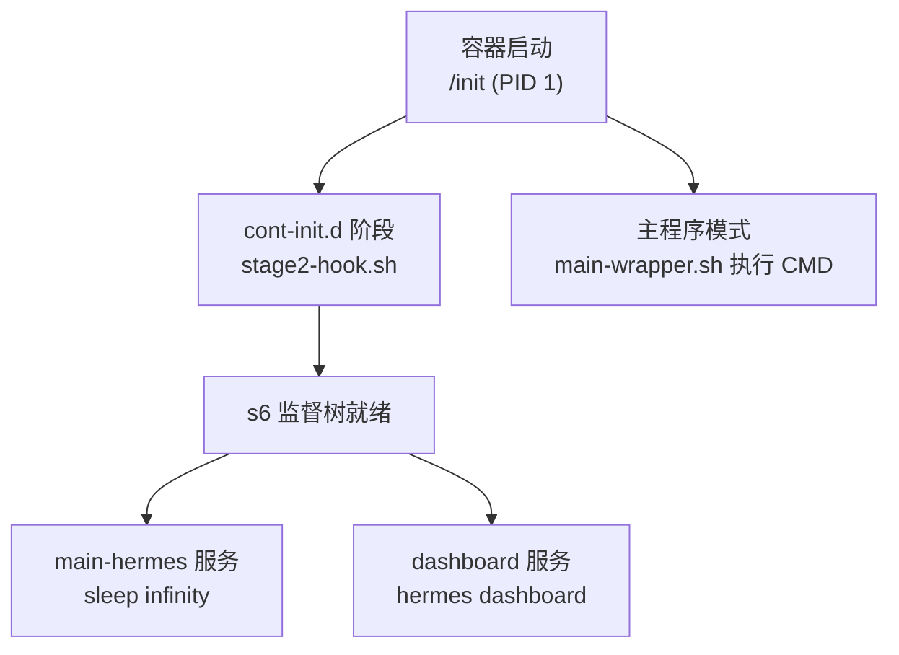
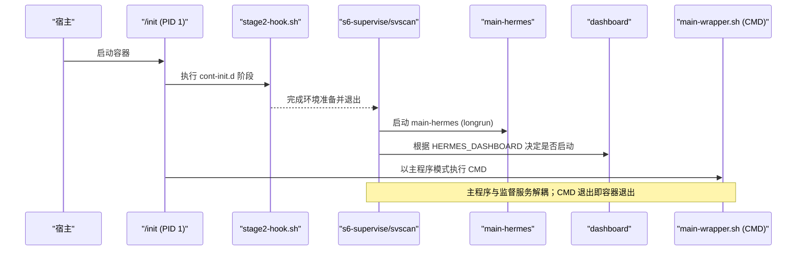
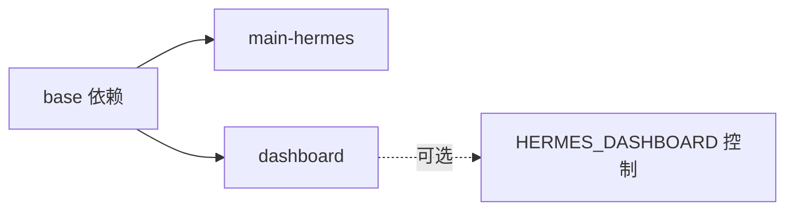

# S6 Overlay 服务管理

<cite>
**本文引用的文件**
- [docker/entrypoint.sh](file://docker/entrypoint.sh)
- [docker/stage2-hook.sh](file://docker/stage2-hook.sh)
- [docker/main-wrapper.sh](file://docker/main-wrapper.sh)
- [docker/s6-rc.d/main-hermes/run](file://docker/s6-rc.d/main-hermes/run)
- [docker/s6-rc.d/main-hermes/type](file://docker/s6-rc.d/main-hermes/type)
- [docker/s6-rc.d/dashboard/run](file://docker/s6-rc.d/dashboard/run)
- [docker/s6-rc.d/dashboard/type](file://docker/s6-rc.d/dashboard/type)
</cite>

## 目录
1. [简介](#简介)
2. [项目结构](#项目结构)
3. [核心组件](#核心组件)
4. [架构总览](#架构总览)
5. [详细组件分析](#详细组件分析)
6. [依赖关系分析](#依赖关系分析)
7. [性能与可观测性](#性能与可观测性)
8. [故障诊断与排错](#故障诊断与排错)
9. [结论](#结论)
10. [附录：运维操作手册](#附录：运维操作手册)

## 简介
本文件面向运维团队，系统性说明基于 s6-overlay 的容器服务管理机制。重点包括：
- s6-overlay 作为 PID 1 的工作方式、监督树构建与服务生命周期管理
- main-hermes 与 dashboard 两个服务的启动顺序、依赖关系与通信边界
- s6-setuidgid 的用户切换机制与最小权限运行
- 通过 s6-svscan/s6-svstat 监控服务状态
- 配置文件位置、日志收集路径与关键指标
- 重启策略、健康检查建议与常见故障排查方法

## 项目结构
s6-overlay 在容器中以 /init 为入口，先执行 cont-init.d 阶段完成环境准备（UID/GID 重映射、数据卷归属修复、配置种子化、技能同步等），再启动用户服务。本项目将“主程序”与“被监督服务”解耦：
- 容器 CMD 由 /init 以“主程序模式”直接执行（保留原始 CLI 行为）
- s6 监督树包含 main-hermes（占位服务）和 dashboard（可选 Web 仪表板）

图示来源
- [docker/entrypoint.sh:1-29](file://docker/entrypoint.sh#L1-L29)
- [docker/stage2-hook.sh:1-592](file://docker/stage2-hook.sh#L1-L592)
- [docker/main-wrapper.sh:1-92](file://docker/main-wrapper.sh#L1-L92)
- [docker/s6-rc.d/main-hermes/run:1-28](file://docker/s6-rc.d/main-hermes/run#L1-L28)
- [docker/s6-rc.d/dashboard/run:1-57](file://docker/s6-rc.d/dashboard/run#L1-L57)

章节来源
- [docker/entrypoint.sh:1-29](file://docker/entrypoint.sh#L1-L29)
- [docker/stage2-hook.sh:1-592](file://docker/stage2-hook.sh#L1-L592)
- [docker/main-wrapper.sh:1-92](file://docker/main-wrapper.sh#L1-L92)

## 核心组件
- s6-overlay 监督器：负责进程监控、自动重启、状态上报
- stage2 初始化钩子：在用户服务启动前完成环境准备
- main-hermes 服务：当前为占位服务，满足 s6-rc 对“user bundle”至少一个服务的要求
- dashboard 服务：可选 Web 仪表板，受环境变量控制启停
- main-wrapper：容器 CMD 包装器，负责参数路由与权限降级

章节来源
- [docker/stage2-hook.sh:1-592](file://docker/stage2-hook.sh#L1-L592)
- [docker/s6-rc.d/main-hermes/run:1-28](file://docker/s6-rc.d/main-hermes/run#L1-L28)
- [docker/s6-rc.d/dashboard/run:1-57](file://docker/s6-rc.d/dashboard/run#L1-L57)
- [docker/main-wrapper.sh:1-92](file://docker/main-wrapper.sh#L1-L92)

## 架构总览
下图展示了从容器启动到服务运行的完整流程，以及 s6 监督树中各组件的关系。

图示来源
- [docker/entrypoint.sh:1-29](file://docker/entrypoint.sh#L1-L29)
- [docker/stage2-hook.sh:1-592](file://docker/stage2-hook.sh#L1-L592)
- [docker/s6-rc.d/main-hermes/type:1-2](file://docker/s6-rc.d/main-hermes/type#L1-L2)
- [docker/s6-rc.d/dashboard/type:1-2](file://docker/s6-rc.d/dashboard/type#L1-L2)
- [docker/main-wrapper.sh:1-92](file://docker/main-wrapper.sh#L1-L92)

## 详细组件分析

### s6-overlay 作为 PID 1 的工作机制
- 入口与兼容层：
  - docker/entrypoint.sh 是兼容 shim，转发到 stage2-hook.sh，避免外部硬编码旧入口导致的行为差异
- 初始化阶段（cont-init.d）：
  - 校验并拒绝非预期的 --user 启动
  - 创建并修复数据卷归属（HERMES_HOME 及其子目录）
  - 支持 PUID/PGID 别名进行 UID/GID 重映射
  - 处理 Docker socket 组权限（DooD 场景）
  - 种子化配置与迁移（config.yaml、.env、SOUL.md 等）
  - 发现 Chromium 二进制并写入 s6 container_environment，供后续服务使用
- 监督树：
  - 启动 user bundle 中的服务（main-hermes、dashboard）
  - 所有服务以 longrun 类型运行，便于 s6 监控与重启

章节来源
- [docker/entrypoint.sh:1-29](file://docker/entrypoint.sh#L1-L29)
- [docker/stage2-hook.sh:1-592](file://docker/stage2-hook.sh#L1-L592)

### main-hermes 服务
- 角色定位：
  - 当前为占位服务（exec sleep infinity），用于满足 s6-rc 对 user bundle 至少一个服务的要求
  - 为未来可能长期运行的 hermes 进程预留槽位
- 类型与生命周期：
  - type=longrun，由 s6 持续监控
- 依赖关系：
  - dependencies.d/base，表示基础依赖已满足

章节来源
- [docker/s6-rc.d/main-hermes/run:1-28](file://docker/s6-rc.d/main-hermes/run#L1-L28)
- [docker/s6-rc.d/main-hermes/type:1-2](file://docker/s6-rc.d/main-hermes/type#L1-L2)

### dashboard 服务
- 启停控制：
  - 通过 HERMES_DASHBOARD 环境变量控制是否启动
  - 未启用时，run 脚本立即退出，finish 脚本返回 125（永久失败标记），s6-svstat 显示 down
- 运行细节：
  - 设置 HOME=/opt/data，激活 venv
  - 监听地址与端口由 HERMES_DASHBOARD_HOST/PORT 控制
  - 安全加固：非回环绑定需要认证提供者（Basic/OAuth），忽略旧的 INSECURE 开关
  - 权限降级：root 下通过 s6-setuidgid 切换到 hermes 用户执行
- 类型与生命周期：
  - type=longrun，受 s6 监控

章节来源
- [docker/s6-rc.d/dashboard/run:1-57](file://docker/s6-rc.d/dashboard/run#L1-L57)
- [docker/s6-rc.d/dashboard/type:1-2](file://docker/s6-rc.d/dashboard/type#L1-L2)

### main-wrapper（容器 CMD 包装器）
- 职责：
  - 保持与 pre-s6 相同的参数路由：无参执行 hermes、首个参数为可执行则直通、否则视为 hermes 子命令透传
  - 在非 PID-1 路径下也直接 exec 该脚本，保证行为一致
- 权限与环境：
  - 通过 s6-setuidgid 切换到 hermes 用户（若已在非 root 则跳过）
  - 拒绝不支持的 --user <uid>:<gid> 启动，给出明确指引
  - 恢复原始工作目录，确保 CLI 行为符合预期

章节来源
- [docker/main-wrapper.sh:1-92](file://docker/main-wrapper.sh#L1-L92)

### s6-setuidgid 用户切换机制
- 作用：
  - 在 service run 脚本或 main-wrapper 中，将进程从 root 切换到 hermes 用户，实现最小权限运行
- 关键点：
  - 仅在 root 下执行切换，非 root 直接继续
  - 配合 stage2 的数据卷归属修复，确保 hermes 用户对必要目录有读写权限

章节来源
- [docker/s6-rc.d/dashboard/run:53-57](file://docker/s6-rc.d/dashboard/run#L53-L57)
- [docker/main-wrapper.sh:20-32](file://docker/main-wrapper.sh#L20-L32)

### s6-svscan 监控服务状态
- 概念：
  - s6-svscan 扫描 /etc/s6-rc.d 下的服务定义，交由 s6-supervise 管理每个服务进程
  - 通过 s6-svstat 可查看服务状态（up/down/permanent failure）
- 在本项目中的应用：
  - main-hermes 始终 up（sleep infinity）
  - dashboard 根据环境变量决定 up 或 permanent failure（exit 0 + finish 125）

章节来源
- [docker/s6-rc.d/dashboard/run:1-20](file://docker/s6-rc.d/dashboard/run#L1-L20)
- [docker/s6-rc.d/main-hermes/run:23-28](file://docker/s6-rc.d/main-hermes/run#L23-L28)

## 依赖关系分析
- 服务间依赖：
  - main-hermes 与 dashboard 均声明 base 依赖，彼此之间无显式依赖
  - 当前 main-hermes 不承载业务逻辑，dashboard 独立运行
- 运行时依赖：
  - dashboard 依赖 Python 环境与 hermes CLI
  - 两者都依赖 stage2 准备的环境变量与数据卷权限

图示来源
- [docker/s6-rc.d/main-hermes/dependencies.d/base](file://docker/s6-rc.d/main-hermes/dependencies.d/base)
- [docker/s6-rc.d/dashboard/dependencies.d/base](file://docker/s6-rc.d/dashboard/dependencies.d/base)
- [docker/s6-rc.d/dashboard/run:9-20](file://docker/s6-rc.d/dashboard/run#L9-L20)

章节来源
- [docker/s6-rc.d/main-hermes/dependencies.d/base](file://docker/s6-rc.d/main-hermes/dependencies.d/base)
- [docker/s6-rc.d/dashboard/dependencies.d/base](file://docker/s6-rc.d/dashboard/dependencies.d/base)
- [docker/s6-rc.d/dashboard/run:9-20](file://docker/s6-rc.d/dashboard/run#L9-L20)

## 性能与可观测性
- 日志收集：
  - s6 默认将服务 stdout/stderr 输出到对应服务的日志目录
  - 项目内将网关日志落盘至 $HERMES_HOME/logs/gateways（由 stage2 确保目录存在与归属正确）
- 关键指标与建议：
  - 服务状态：通过 s6-svstat 查看 up/down/permanent failure
  - 资源占用：关注 hermes dashboard 进程的 CPU/内存
  - 启动耗时：stage2 初始化阶段（UID/GID 重映射、chown、配置迁移）可能影响冷启动时间
- 可观测性集成：
  - 可通过 hermes 内置遥测/导出能力（如 OTLP）采集应用指标（需按产品文档配置）

章节来源
- [docker/stage2-hook.sh:374-396](file://docker/stage2-hook.sh#L374-L396)
- [docker/stage2-hook.sh:298-311](file://docker/stage2-hook.sh#L298-L311)

## 故障诊断与排错
- 常见错误与处理：
  - 使用 --user 指定非 hermes 用户导致启动失败：改用 PUID/PGID 环境变量，让 stage2 进行 UID/GID 重映射
  - dashboard 无法启动：确认 HERMES_DASHBOARD 已启用；非回环绑定需配置 Basic/OAuth 认证
  - 权限问题：检查 $HERMES_HOME 及子目录归属是否为 hermes；必要时重启容器触发 stage2 修复
  - Docker socket 访问失败：确认 stage2 已将 hermes 加入对应组；或在 compose 中添加 group-add
- 诊断步骤：
  - 查看 s6 服务状态：s6-svstat /run/s6/services/*
  - 查看服务日志：s6-log 或挂载的日志目录
  - 验证环境变量：/run/s6/container_environment 中的键值
  - 检查数据卷归属：ls -lR $HERMES_HOME

章节来源
- [docker/stage2-hook.sh:26-74](file://docker/stage2-hook.sh#L26-L74)
- [docker/stage2-hook.sh:118-172](file://docker/stage2-hook.sh#L118-L172)
- [docker/s6-rc.d/dashboard/run:33-51](file://docker/s6-rc.d/dashboard/run#L33-L51)

## 结论
本项目采用 s6-overlay 将“容器主程序”与“被监督服务”解耦，既保留了原有 CLI 行为，又获得了进程级可靠性保障。main-hermes 当前为占位服务，dashboard 提供可选 Web 界面。通过 stage2 初始化钩子，系统在启动前完成权限、配置与环境的健壮准备。运维团队可借助 s6 工具链进行监控、重启与排障，并结合日志与指标实现可观测性闭环。

## 附录：运维操作手册
- 启动与停止
  - 启动 dashboard：设置 HERMES_DASHBOARD=true 后重启容器
  - 停止 dashboard：取消环境变量或移除服务（s6-svc -d dashboard）
- 重启策略
  - longrun 类型服务崩溃会被 s6 自动重启
  - dashboard 未启用时处于 permanent failure，不会反复尝试
- 健康检查
  - 建议使用 HTTP 探针探测 dashboard 的健康端点（需在应用中暴露）
  - 也可通过 s6-svstat 判断服务是否在运行
- 配置与日志
  - 配置文件位于 $HERMES_HOME/config.yaml（首次启动由 stage2 种子化）
  - 日志位于 $HERMES_HOME/logs 及 logs/gateways
- 常用命令
  - 查看服务状态：s6-svstat /run/s6/services/*
  - 查看服务日志：s6-log 或 tail -f $HERMES_HOME/logs/*
  - 重启服务：s6-svc -r dashboard
  - 停止服务：s6-svc -d dashboard
- 环境变量参考
  - HERMES_DASHBOARD：启用 dashboard
  - HERMES_DASHBOARD_HOST/PORT：监听地址与端口
  - HERMES_UID/HERMES_GID 或 PUID/PGID：UID/GID 重映射
  - HERMES_AUTH_JSON_BOOTSTRAP/REBOOTSTRAP：认证引导与重建
  - HERMES_GATEWAY_BOOTSTRAP_STATE：首次启动时网关初始状态

章节来源
- [docker/s6-rc.d/dashboard/run:9-20](file://docker/s6-rc.d/dashboard/run#L9-L20)
- [docker/stage2-hook.sh:418-530](file://docker/stage2-hook.sh#L418-L530)
- [docker/stage2-hook.sh:97-116](file://docker/stage2-hook.sh#L97-L116)