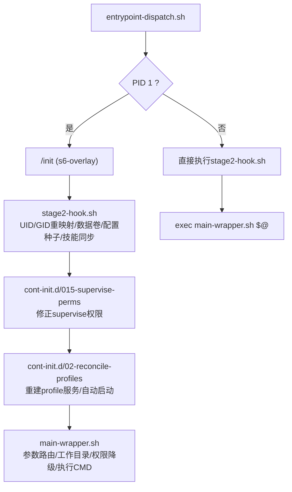
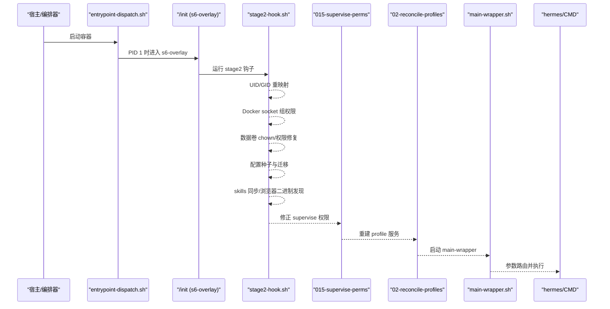
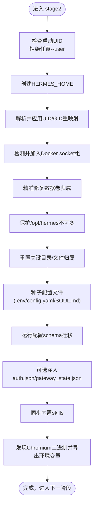
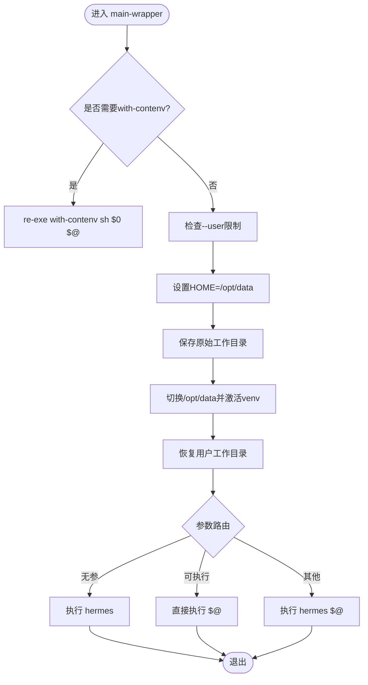
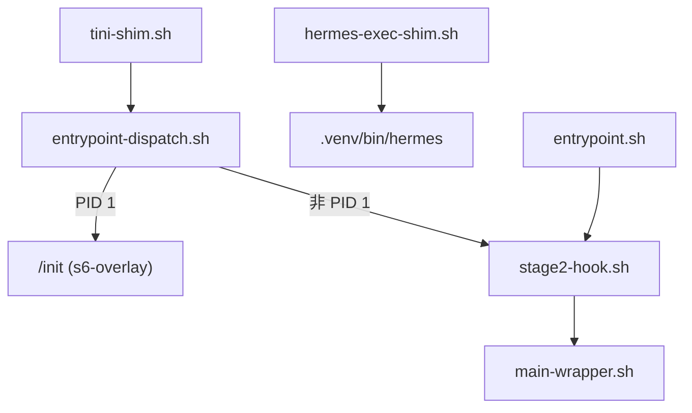
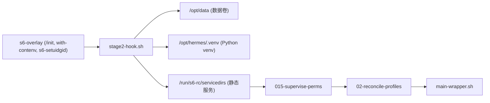

# 容器初始化流程

<cite>
**本文引用的文件**
- [docker/entrypoint-dispatch.sh](file://docker/entrypoint-dispatch.sh)
- [docker/stage2-hook.sh](file://docker/stage2-hook.sh)
- [docker/main-wrapper.sh](file://docker/main-wrapper.sh)
- [docker/cont-init.d/015-supervise-perms](file://docker/cont-init.d/015-supervise-perms)
- [docker/cont-init.d/02-reconcile-profiles](file://docker/cont-init.d/02-reconcile-profiles)
- [docker/tini-shim.sh](file://docker/tini-shim.sh)
- [docker/hermes-exec-shim.sh](file://docker/hermes-exec-shim.sh)
- [docker/entrypoint.sh](file://docker/entrypoint.sh)
</cite>

## 目录
1. [简介](#简介)
2. [项目结构](#项目结构)
3. [核心组件](#核心组件)
4. [架构总览](#架构总览)
5. [详细组件分析](#详细组件分析)
6. [依赖关系分析](#依赖关系分析)
7. [性能考量](#性能考量)
8. [故障排除指南](#故障排除指南)
9. [结论](#结论)
10. [附录](#附录)

## 简介
本文件系统性梳理 Hermes Agent 容器的启动与初始化流程，重点覆盖：
- cont-init.d 中初始化脚本的执行顺序与职责分工（权限设置、数据卷初始化、配置同步）
- stage2-hook.sh 的作用机制（用户组重映射、环境变量处理、运行时环境准备）
- main-wrapper.sh 的包装逻辑（入口点选择、参数传递、错误处理）
- 初始化过程中的安全检查、依赖验证与配置预检
- 初始化失败的处理策略、回滚机制与调试方法
- 完整的初始化流程图与排障指引

## 项目结构
容器通过 s6-overlay 提供进程监督树。入口由 entrypoint-dispatch.sh 统一分发：当作为 PID 1 时进入 /init（s6-overlay），否则直接执行 stage2 引导并调用 main-wrapper 运行 CMD。stage2-hook.sh 在 s6 监督树启动后、用户服务前运行，负责 UID/GID 重映射、数据卷所有权修复、配置种子注入、技能同步等。随后 cont-init.d 中的脚本按字典序依次执行，完成 supervise 权限修正与 profile 服务重建。main-wrapper.sh 作为最终 CMD 包装器，负责参数路由、工作目录恢复、非 root 降级以及命令执行。

图表来源
- [docker/entrypoint-dispatch.sh:1-26](file://docker/entrypoint-dispatch.sh#L1-L26)
- [docker/stage2-hook.sh:1-592](file://docker/stage2-hook.sh#L1-L592)
- [docker/cont-init.d/015-supervise-perms:1-91](file://docker/cont-init.d/015-supervise-perms#L1-L91)
- [docker/cont-init.d/02-reconcile-profiles:1-48](file://docker/cont-init.d/02-reconcile-profiles#L1-L48)
- [docker/main-wrapper.sh:1-92](file://docker/main-wrapper.sh#L1-L92)

章节来源
- [docker/entrypoint-dispatch.sh:1-26](file://docker/entrypoint-dispatch.sh#L1-L26)

## 核心组件
- entrypoint-dispatch.sh：根据是否 PID 1 决定走 s6-overlay 路径或直接 bootstrap；在非 PID 1 场景下输出警告并继续执行。
- stage2-hook.sh：以 root 身份完成关键初始化（UID/GID 重映射、Docker socket 组权限、数据卷 chown、配置文件种子、auth.json/gateway_state.json 注入、skills 同步、Chromium 二进制发现）。
- cont-init.d/015-supervise-perms：为静态 s6 服务的 supervise/event 目录赋予 hermes 用户可访问权限，确保 s6-svstat/s6-svc 可用。
- cont-init.d/02-reconcile-profiles：将持久化 profiles 下的网关服务槽位重建到 tmpfs 的 /run/service，并根据上次状态决定是否自启动。
- main-wrapper.sh：CMD 包装器，支持无参默认 hermes、可执行直通、hermes 子命令透传；负责 HOME 设置、工作目录恢复、权限降级与安全校验。
- tini-shim.sh：兼容旧编排模板中对 tini 的调用，剥离无关参数后转发至 /init + main-wrapper。
- hermes-exec-shim.sh：为 docker exec 路径提供权限降级，避免 root 写入导致文件归属异常。
- entrypoint.sh：遗留 shim，仅转发到 stage2-hook.sh 并提示迁移。

章节来源
- [docker/entrypoint-dispatch.sh:1-26](file://docker/entrypoint-dispatch.sh#L1-L26)
- [docker/stage2-hook.sh:1-592](file://docker/stage2-hook.sh#L1-L592)
- [docker/cont-init.d/015-supervise-perms:1-91](file://docker/cont-init.d/015-supervise-perms#L1-L91)
- [docker/cont-init.d/02-reconcile-profiles:1-48](file://docker/cont-init.d/02-reconcile-profiles#L1-L48)
- [docker/main-wrapper.sh:1-92](file://docker/main-wrapper.sh#L1-L92)
- [docker/tini-shim.sh:1-90](file://docker/tini-shim.sh#L1-L90)
- [docker/hermes-exec-shim.sh:1-88](file://docker/hermes-exec-shim.sh#L1-L88)
- [docker/entrypoint.sh:1-29](file://docker/entrypoint.sh#L1-L29)

## 架构总览
下图展示了从容器启动到主进程执行的完整时序，包括 s6-overlay 监督树、cont-init 阶段、以及 CMD 包装执行。

图表来源
- [docker/entrypoint-dispatch.sh:1-26](file://docker/entrypoint-dispatch.sh#L1-L26)
- [docker/stage2-hook.sh:1-592](file://docker/stage2-hook.sh#L1-L592)
- [docker/cont-init.d/015-supervise-perms:1-91](file://docker/cont-init.d/015-supervise-perms#L1-L91)
- [docker/cont-init.d/02-reconcile-profiles:1-48](file://docker/cont-init.d/02-reconcile-profiles#L1-L48)
- [docker/main-wrapper.sh:1-92](file://docker/main-wrapper.sh#L1-L92)

## 详细组件分析

### stage2-hook.sh：初始化核心
职责概览
- 拒绝不受支持的 --user 启动（非 root 且非 hermes UID），给出明确指导
- 创建 HERMES_HOME 并确保后续 mkdir/chown 成功
- 解析 PUID/PGID 或 HERMES_UID/HERMES_GID，进行 hermes 用户/组重映射
- 为 Docker socket 绑定组权限，解决 dind 场景下 EACCES
- 针对数据卷进行“精准”chown：顶层目录与受管子目录，避免误改宿主机文件
- 保护不可变安装树 /opt/hermes，防止运行时修改破坏 venv
- 重置关键目录/文件归属（profiles、cron、logs/gateways、pairing、根级状态文件）
- 配置权限加固（config.yaml、.env）
- 以 hermes 用户创建必要目录（backups、sessions、logs、hooks、memories、skills、skins、plans、workspace、home、pairing、platforms/pairing、lazy-packages）
- 移除数据卷上的旧 .install_method 标记，避免与宿主安装冲突
- 首次启动种子：.env、config.yaml、SOUL.md
- 运行配置 schema 迁移脚本
- 可选注入 auth.json（首次）与 gateway_state.json（首次，控制自启动）
- 同步内置 skills
- 发现 Chromium 二进制并导出 AGENT_BROWSER_EXECUTABLE_PATH

安全与健壮性
- 对包含符号链接的路径拒绝 chown/seed 操作，避免 TOCTOU/越权
- 使用 validate_uid_gid 严格校验 UID/GID 范围与格式
- 所有 chown/mkdir 均考虑 rootless Podman 失败场景，记录警告并继续
- 敏感文件权限收紧（.env 600，auth.json 600）

图表来源
- [docker/stage2-hook.sh:20-592](file://docker/stage2-hook.sh#L20-L592)

章节来源
- [docker/stage2-hook.sh:20-592](file://docker/stage2-hook.sh#L20-L592)

### cont-init.d 初始化脚本
执行顺序与职责
- 01-hermes-setup（由镜像安装，对应 stage2-hook.sh）：完成上述初始化
- 015-supervise-perms：为静态 s6 服务的 supervise/event 目录赋予 hermes 可访问权限，使 s6-svstat/s6-svc 在 hermes 用户下可用
- 02-reconcile-profiles：将持久化 profiles 的服务槽位重建到 /run/service，并依据上次状态决定是否自启动；同时授予 hermes 对 svscan 控制 FIFO 的写权限

图表来源
- [docker/cont-init.d/015-supervise-perms:1-91](file://docker/cont-init.d/015-supervise-perms#L1-L91)
- [docker/cont-init.d/02-reconcile-profiles:1-48](file://docker/cont-init.d/02-reconcile-profiles#L1-L48)

章节来源
- [docker/cont-init.d/015-supervise-perms:1-91](file://docker/cont-init.d/015-supervise-perms#L1-L91)
- [docker/cont-init.d/02-reconcile-profiles:1-48](file://docker/cont-init.d/02-reconcile-profiles#L1-L48)

### main-wrapper.sh：CMD 包装器
职责概览
- 通过 with-contenv 重新加载容器环境变量（仅在 s6 监督路径下需要）
- 拒绝不受支持的 --user 启动（与 stage2 保持一致的安全策略）
- 设置 HOME=/opt/data，避免 XDG 路径写入 /root
- 保存原始工作目录，切换到 /opt/data 激活 venv，再恢复用户指定工作目录
- 参数路由：
  - 无参数：执行 hermes
  - 第一个参数是可执行文件：直接执行（如 sleep、bash）
  - 其他情况：hermes <args> 透传
- 通过 s6-setuidgid 以 hermes 用户执行目标命令（已为非 root 则跳过）

图表来源
- [docker/main-wrapper.sh:1-92](file://docker/main-wrapper.sh#L1-L92)

章节来源
- [docker/main-wrapper.sh:1-92](file://docker/main-wrapper.sh#L1-L92)

### 入口分发与兼容性
- entrypoint-dispatch.sh：若为 PID 1，则进入 /init（s6-overlay）；否则直接执行 stage2 并 exec main-wrapper，同时输出警告说明监督服务不可用
- tini-shim.sh：兼容旧编排模板中对 tini 的调用，剥离不支持的参数后转发至 /init + main-wrapper
- hermes-exec-shim.sh：为 docker exec 路径提供权限降级，避免 root 写入导致文件归属异常
- entrypoint.sh：遗留 shim，仅转发到 stage2-hook.sh 并提示迁移

图表来源
- [docker/tini-shim.sh:1-90](file://docker/tini-shim.sh#L1-L90)
- [docker/entrypoint-dispatch.sh:1-26](file://docker/entrypoint-dispatch.sh#L1-L26)
- [docker/hermes-exec-shim.sh:1-88](file://docker/hermes-exec-shim.sh#L1-L88)
- [docker/entrypoint.sh:1-29](file://docker/entrypoint.sh#L1-L29)

章节来源
- [docker/tini-shim.sh:1-90](file://docker/tini-shim.sh#L1-L90)
- [docker/entrypoint-dispatch.sh:1-26](file://docker/entrypoint-dispatch.sh#L1-L26)
- [docker/hermes-exec-shim.sh:1-88](file://docker/hermes-exec-shim.sh#L1-L88)
- [docker/entrypoint.sh:1-29](file://docker/entrypoint.sh#L1-L29)

## 依赖关系分析
- s6-overlay：提供 /init、with-contenv、s6-setuidgid、container_environment 等能力
- Python venv：位于 /opt/hermes/.venv，用于运行迁移脚本与 CLI
- 数据卷：/opt/data（默认 HERMES_HOME），存放会话、日志、配置、技能等
- 静态 s6 服务：dashboard、main-hermes 等，其 supervise 目录需 hermes 可读可写
- 动态服务：profile 网关服务槽位在 /run/service（tmpfs），每次重启重建

图表来源
- [docker/stage2-hook.sh:1-592](file://docker/stage2-hook.sh#L1-L592)
- [docker/cont-init.d/015-supervise-perms:1-91](file://docker/cont-init.d/015-supervise-perms#L1-L91)
- [docker/cont-init.d/02-reconcile-profiles:1-48](file://docker/cont-init.d/02-reconcile-profiles#L1-L48)
- [docker/main-wrapper.sh:1-92](file://docker/main-wrapper.sh#L1-L92)

章节来源
- [docker/stage2-hook.sh:1-592](file://docker/stage2-hook.sh#L1-L592)
- [docker/cont-init.d/015-supervise-perms:1-91](file://docker/cont-init.d/015-supervise-perms#L1-L91)
- [docker/cont-init.d/02-reconcile-profiles:1-48](file://docker/cont-init.d/02-reconcile-profiles#L1-L48)
- [docker/main-wrapper.sh:1-92](file://docker/main-wrapper.sh#L1-L92)

## 性能考量
- 数据卷 chown 采用“精准”策略：仅对顶层目录与受管子目录递归 chown，避免全量扫描大目录带来的开销
- 对已有正确归属的目录跳过递归扫描（warm boot 优化）
- 使用绝对路径直接调用 venv python，减少 shell 解释器开销
- 对 container_environment 的环境变量写入仅在必要时进行（如 Chromium 二进制发现）

[本节为通用性能讨论，不直接分析具体文件]

## 故障排除指南
常见错误与处理
- 启动被拒绝（--user 非 hermes）
  - 现象：stage2 或 main-wrapper 报错并退出
  - 原因：使用了不受支持的 --user 方式启动
  - 处理：改用 root 启动并通过 HERMES_UID/HERMES_GID 或 PUID/PGID 指定宿主 UID/GID
  - 参考
    - [docker/stage2-hook.sh:26-74](file://docker/stage2-hook.sh#L26-L74)
    - [docker/main-wrapper.sh:33-59](file://docker/main-wrapper.sh#L33-L59)

- Docker socket 访问失败（dind）
  - 现象：终端后端报 EACCES
  - 原因：socket 所属组不在 hermes 的组列表中
  - 处理：stage2 会自动检测并添加组；若失败会记录警告
  - 参考
    - [docker/stage2-hook.sh:118-172](file://docker/stage2-hook.sh#L118-L172)

- 数据卷权限问题
  - 现象：gateway 启动时报 PermissionError（如 state.db、auth.json）
  - 原因：docker exec 以 root 写入导致文件归属异常
  - 处理：stage2 会在启动时修复关键目录/文件归属；也可手动 chown 或避免 root 写入
  - 参考
    - [docker/stage2-hook.sh:174-360](file://docker/stage2-hook.sh#L174-L360)
    - [docker/hermes-exec-shim.sh:1-88](file://docker/hermes-exec-shim.sh#L1-L88)

- 监督服务不可用（非 PID 1 场景）
  - 现象：entrypoint-dispatch 输出警告，s6 监督服务不可用
  - 原因：平台已提供 PID 1，无法进入 /init
  - 处理：尽量让容器以 PID 1 启动；或在编排层保证 /init 可执行
  - 参考
    - [docker/entrypoint-dispatch.sh:1-26](file://docker/entrypoint-dispatch.sh#L1-L26)

- 遗留 entrypoint 调用
  - 现象：调用 docker/entrypoint.sh 仅执行 stage2 而不运行 CMD
  - 处理：迁移到 image 默认 ENTRYPOINT（entrypoint-dispatch.sh）
  - 参考
    - [docker/entrypoint.sh:1-29](file://docker/entrypoint.sh#L1-L29)

调试建议
- 查看 stage2 输出：关注 UID/GID 重映射、chown、skills 同步、Chromium 二进制发现等步骤的日志
- 检查 supervisord 权限：确认 supervise/event 目录归属 hermes
- 验证环境变量：确认 with-contenv 是否正确加载（main-wrapper 会 re-exe）
- 使用 hermes-exec-shim 的 opt-out 开关（HERMES_DOCKER_EXEC_AS_ROOT=1）进行诊断（谨慎使用）

章节来源
- [docker/stage2-hook.sh:26-74](file://docker/stage2-hook.sh#L26-L74)
- [docker/stage2-hook.sh:118-172](file://docker/stage2-hook.sh#L118-L172)
- [docker/stage2-hook.sh:174-360](file://docker/stage2-hook.sh#L174-L360)
- [docker/main-wrapper.sh:33-59](file://docker/main-wrapper.sh#L33-L59)
- [docker/entrypoint-dispatch.sh:1-26](file://docker/entrypoint-dispatch.sh#L1-L26)
- [docker/hermes-exec-shim.sh:1-88](file://docker/hermes-exec-shim.sh#L1-L88)
- [docker/entrypoint.sh:1-29](file://docker/entrypoint.sh#L1-L29)

## 结论
该容器初始化流程通过 s6-overlay 的监督树与多阶段 cont-init 脚本，实现了安全的权限管理、可靠的数据卷初始化与配置同步。stage2-hook.sh 承担核心初始化任务，确保运行时环境与数据卷一致；cont-init.d 进一步修正监督权限并重建 profile 服务；main-wrapper.sh 提供稳健的 CMD 包装与参数路由。整体设计强调安全性（拒绝不受支持的 --user）、幂等性（多次启动不破坏状态）与可维护性（清晰的职责划分与日志输出）。

[本节为总结，不直接分析具体文件]

## 附录
- 环境变量要点
  - HERMES_HOME：数据卷根目录（默认 /opt/data）
  - HERMES_UID/HERMES_GID 或 PUID/PGID：用户/组重映射
  - AGENT_BROWSER_EXECUTABLE_PATH：Chromium 二进制路径（由 stage2 自动设置）
  - HERMES_AUTH_JSON_BOOTSTRAP/REBOOTSTRAP：首次注入或重启修复认证会话
  - HERMES_GATEWAY_BOOTSTRAP_STATE：首次启动时声明网关初始状态（running 可触发自启动）
  - HERMES_DOCKER_EXEC_AS_ROOT：允许 docker exec 以 root 运行（仅限诊断）

- 关键目录
  - /opt/data：运行时数据（会话、日志、配置、技能等）
  - /opt/hermes：只读安装树（含 venv、工具、技能源码等）
  - /run/s6-rc/servicedirs：静态服务目录（supervise/event）
  - /run/service：动态服务槽位（tmpfs，每次重启重建）

[本节为概念性附录，不直接分析具体文件]