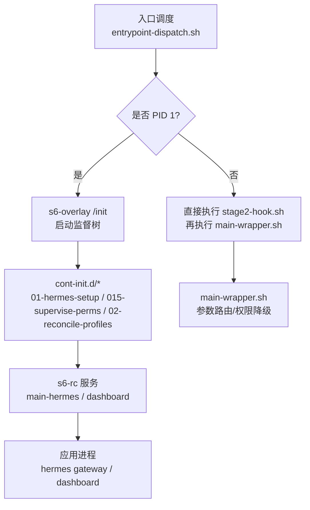
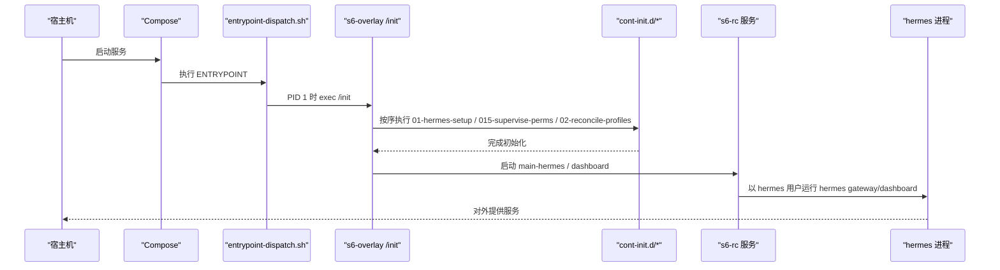
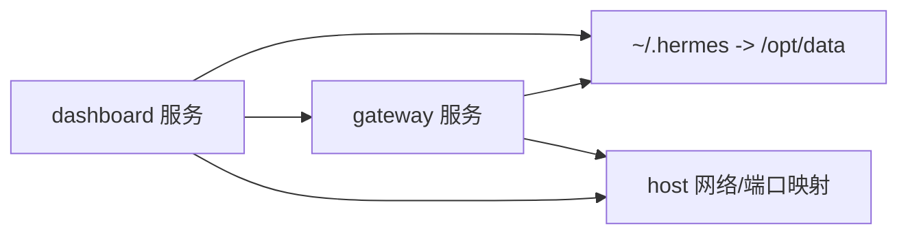
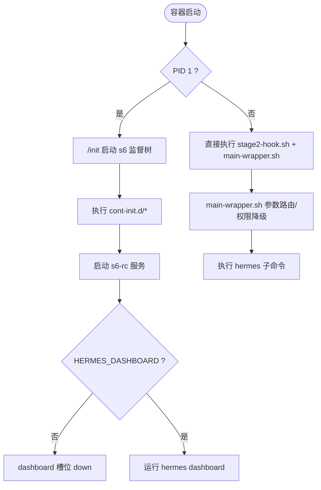
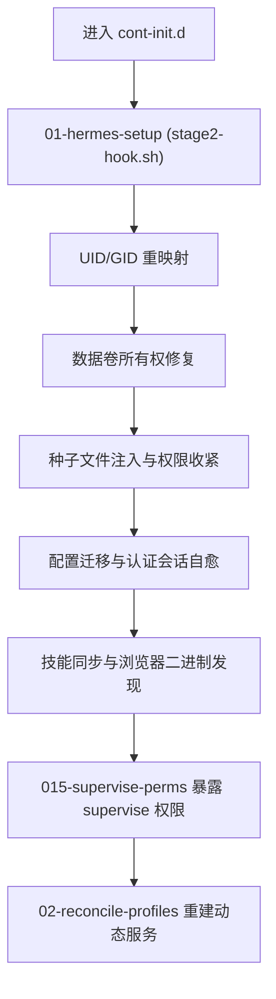
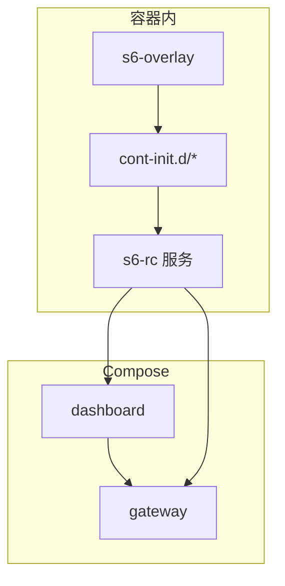

# 容器编排与服务管理

<cite>
**本文引用的文件**
- [docker-compose.yml](file://docker-compose.yml)
- [docker-compose.windows.yml](file://docker-compose.windows.yml)
- [Dockerfile](file://Dockerfile)
- [entrypoint-dispatch.sh](file://docker/entrypoint-dispatch.sh)
- [entrypoint.sh](file://docker/entrypoint.sh)
- [main-wrapper.sh](file://docker/main-wrapper.sh)
- [stage2-hook.sh](file://docker/stage2-hook.sh)
- [s6-rc.d/main-hermes/run](file://docker/s6-rc.d/main-hermes/run)
- [s6-rc.d/dashboard/run](file://docker/s6-rc.d/dashboard/run)
- [cont-init.d/015-supervise-perms](file://docker/cont-init.d/015-supervise-perms)
</cite>

## 目录
1. [简介](#简介)
2. [项目结构](#项目结构)
3. [核心组件](#核心组件)
4. [架构总览](#架构总览)
5. [详细组件分析](#详细组件分析)
6. [依赖关系分析](#依赖关系分析)
7. [性能与可观测性](#性能与可观测性)
8. [故障排查指南](#故障排查指南)
9. [结论](#结论)
10. [附录](#附录)

## 简介
本文件面向运维团队，提供基于 Docker 的容器编排与服务管理的完整方案。重点覆盖：
- docker-compose 服务定义、网络模式、数据卷挂载与环境变量配置
- s6-overlay 服务管理器的工作机制（主进程监督、仪表板服务、网关服务的生命周期）
- 启动顺序、依赖关系与故障恢复
- cont-init.d 初始化脚本的执行流程（权限设置、数据卷初始化、配置同步）
- 监控、日志收集与性能调优建议

## 项目结构
仓库采用“镜像构建 + 运行时编排”的分层设计：
- 镜像构建阶段：安装系统依赖、Python/Node 工具链、s6-overlay、预编译前端与 Python 依赖，并注册 s6 服务与 cont-init 钩子
- 运行阶段：由 entrypoint-dispatch.sh 决定走 s6-overlay PID 1 路径或非 PID 1 回退路径；s6 负责启动用户服务（dashboard、main-hermes），并通过 cont-init.d 完成环境准备



**图表来源**
- [entrypoint-dispatch.sh:1-26](file://docker/entrypoint-dispatch.sh#L1-L26)
- [Dockerfile:336-357](file://Dockerfile#L336-L357)
- [Dockerfile:424-457](file://Dockerfile#L424-L457)

**章节来源**
- [Dockerfile:52-135](file://Dockerfile#L52-L135)
- [Dockerfile:336-457](file://Dockerfile#L336-L457)
- [entrypoint-dispatch.sh:1-26](file://docker/entrypoint-dispatch.sh#L1-L26)

## 核心组件
- 镜像与运行时
  - 固定 SQLite 版本以修复 WAL 重置缺陷
  - 安装 s6-overlay 作为进程监督器，替代 tini
  - 预装 Python/Node 依赖与前端产物，减少冷启动开销
- 入口与包装
  - entrypoint-dispatch.sh：根据是否 PID 1 选择 s6 监督路径或直跑回退路径
  - main-wrapper.sh：参数路由、工作目录恢复、权限降级到 hermes 用户
- 初始化钩子
  - stage2-hook.sh：UID/GID 重映射、数据卷所有权修复、配置种子注入、技能同步、浏览器二进制发现
  - 015-supervise-perms：为静态 s6 服务暴露 supervise/event 目录给非特权 hermes 用户
- 服务定义
  - main-hermes：占位服务，满足 s6-rc 要求
  - dashboard：可选启停的 Web 仪表板，支持认证策略

**章节来源**
- [Dockerfile:1-135](file://Dockerfile#L1-L135)
- [Dockerfile:336-457](file://Dockerfile#L336-L457)
- [main-wrapper.sh:1-92](file://docker/main-wrapper.sh#L1-L92)
- [stage2-hook.sh:1-592](file://docker/stage2-hook.sh#L1-L592)
- [cont-init.d/015-supervise-perms:1-91](file://docker/cont-init.d/015-supervise-perms#L1-L91)
- [s6-rc.d/main-hermes/run:1-28](file://docker/s6-rc.d/main-hermes/run#L1-L28)
- [s6-rc.d/dashboard/run:1-57](file://docker/s6-rc.d/dashboard/run#L1-L57)

## 架构总览
下图展示了从容器启动到服务运行的关键路径，包括 s6-overlay 监督树、初始化脚本与用户服务之间的关系。



**图表来源**
- [entrypoint-dispatch.sh:1-26](file://docker/entrypoint-dispatch.sh#L1-L26)
- [Dockerfile:336-357](file://Dockerfile#L336-L357)
- [s6-rc.d/main-hermes/run:1-28](file://docker/s6-rc.d/main-hermes/run#L1-L28)
- [s6-rc.d/dashboard/run:1-57](file://docker/s6-rc.d/dashboard/run#L1-L57)

## 详细组件分析

### docker-compose 编排配置
- 服务定义
  - gateway：使用 host 网络模式，挂载 ~/.hermes 到 /opt/data，命令为 gateway run
  - dashboard：依赖 gateway，默认绑定 127.0.0.1，可通过 SSH 隧道访问；Windows 版通过端口映射暴露 9119
- 环境变量
  - HERMES_UID/HERMES_GID：用于将容器内 hermes 用户重映射到宿主 UID/GID，保证文件归属一致
  - API_SERVER_*：可选启用 OpenAI 兼容 API 服务器（需鉴权密钥）
  - 各平台网关凭据（Teams、Google Chat 等）按需开启
- 数据卷
  - ~/.hermes:/opt/data：持久化状态、会话、日志、配置等
- 网络
  - Linux：network_mode: host，直接使用宿主机网络栈
  - Windows：移除 host 网络，改用端口映射



**图表来源**
- [docker-compose.yml:29-77](file://docker-compose.yml#L29-L77)
- [docker-compose.windows.yml:12-39](file://docker-compose.windows.yml#L12-L39)

**章节来源**
- [docker-compose.yml:1-77](file://docker-compose.yml#L1-L77)
- [docker-compose.windows.yml:1-39](file://docker-compose.windows.yml#L1-L39)

### s6-overlay 服务管理器与生命周期
- 主进程监督
  - 当容器以 PID 1 启动时，entrypoint-dispatch.sh 会 exec /init，进入 s6-overlay 监督模式
  - s6 先执行 cont-init.d 中的初始化脚本，再启动 s6-rc 声明的用户服务
- 仪表板服务
  - 通过环境变量 HERMES_DASHBOARD 控制启停
  - 非环回地址绑定需要认证提供者（Basic Auth 或 OAuth），不再接受 INSECURE 关闭鉴权
  - 未启用时，run 脚本退出，finish 脚本标记永久失败，s6-svstat 显示 down
- 主服务槽位
  - main-hermes 当前为占位服务，满足 s6-rc 要求；未来可用于长期守护 hermes 进程
- 动态服务
  - 每 profile 的网关服务在运行时注册到 /run/service/，重启后由 02-reconcile-profiles 重建



**图表来源**
- [entrypoint-dispatch.sh:1-26](file://docker/entrypoint-dispatch.sh#L1-L26)
- [s6-rc.d/dashboard/run:1-57](file://docker/s6-rc.d/dashboard/run#L1-L57)
- [s6-rc.d/main-hermes/run:1-28](file://docker/s6-rc.d/main-hermes/run#L1-L28)

**章节来源**
- [entrypoint-dispatch.sh:1-26](file://docker/entrypoint-dispatch.sh#L1-L26)
- [s6-rc.d/dashboard/run:1-57](file://docker/s6-rc.d/dashboard/run#L1-L57)
- [s6-rc.d/main-hermes/run:1-28](file://docker/s6-rc.d/main-hermes/run#L1-L28)

### cont-init.d 初始化脚本执行流程
- 01-hermes-setup（stage2-hook.sh）
  - 校验并拒绝不支持的 --user 启动方式
  - 创建并修复 $HERMES_HOME 及其子目录所有权
  - 重映射 hermes 用户 UID/GID（支持 PUID/PGID 别名）
  - 处理 Docker socket 组权限（DooD 场景）
  - 首次启动时注入 .env、config.yaml、SOUL.md 等种子文件
  - 迁移配置 schema、刷新 auth.json（含终端死会话自愈）
  - 可选自动启动网关（通过 HERMES_GATEWAY_BOOTSTRAP_STATE=running）
  - 同步内置技能、发现 Chromium 二进制并写入 container_environment
- 015-supervise-perms
  - 为静态 s6 服务暴露 supervise/event 目录给 hermes 用户，使 s6-svstat/svc 可用
- 02-reconcile-profiles
  - 容器重启后重建 per-profile 网关服务槽位（来自 profiles 目录）



**图表来源**
- [stage2-hook.sh:26-592](file://docker/stage2-hook.sh#L26-L592)
- [cont-init.d/015-supervise-perms:1-91](file://docker/cont-init.d/015-supervise-perms#L1-L91)

**章节来源**
- [stage2-hook.sh:26-592](file://docker/stage2-hook.sh#L26-L592)
- [cont-init.d/015-supervise-perms:1-91](file://docker/cont-init.d/015-supervise-perms#L1-L91)

### 入口与包装脚本
- entrypoint-dispatch.sh
  - PID 1 路径：exec /init，保留完整 s6 监督树
  - 非 PID 1 路径：直接执行 stage2-hook.sh 与 main-wrapper.sh，跳过 s6 监督
- main-wrapper.sh
  - 参数路由：无参默认执行 hermes；首个参数为可执行则透传；否则作为 hermes 子命令
  - 权限降级：以 root 启动时通过 s6-setuidgid 切换到 hermes 用户
  - 工作目录：在进入 venv 前保存原始工作目录，最终恢复到用户指定的 -w 目录

```mermaid
sequenceDiagram
participant U as "用户"
participant E as "entrypoint-dispatch.sh"
participant M as "main-wrapper.sh"
U->>E : 传入 CMD
E->>E : 判断 PID 1
alt PID 1
E->>/init : exec /init
/init-->>M : 以 main program 运行
else 非 PID 1
E->>M : 直接执行
end
M->>M : 参数路由/权限降级
M-->>U : 执行 hermes 子命令
```

**图表来源**
- [entrypoint-dispatch.sh:1-26](file://docker/entrypoint-dispatch.sh#L1-L26)
- [main-wrapper.sh:1-92](file://docker/main-wrapper.sh#L1-L92)

**章节来源**
- [entrypoint-dispatch.sh:1-26](file://docker/entrypoint-dispatch.sh#L1-L26)
- [main-wrapper.sh:1-92](file://docker/main-wrapper.sh#L1-L92)

## 依赖关系分析
- 服务间依赖
  - dashboard 显式 depends_on gateway，确保后端就绪后再启动仪表板
- 运行时依赖
  - s6-overlay 监督 main-hermes 与 dashboard
  - cont-init.d 顺序执行：01-hermes-setup → 015-supervise-perms → 02-reconcile-profiles
- 外部依赖
  - 可选启用 Teams/Google Chat 等网关凭据
  - 可选启用 OpenAI 兼容 API 服务器（需 API_SERVER_KEY）



**图表来源**
- [docker-compose.yml:29-77](file://docker-compose.yml#L29-L77)
- [Dockerfile:336-357](file://Dockerfile#L336-L357)

**章节来源**
- [docker-compose.yml:29-77](file://docker-compose.yml#L29-L77)
- [Dockerfile:336-357](file://Dockerfile#L336-L357)

## 性能与可观测性
- 性能优化
  - 预编译前端与 Python 依赖，避免运行时 npm install/uv sync
  - 固定 SQLite 版本，避免 WAL 重置导致的损坏风险
  - 禁用 Python 字节码写入，减少磁盘 IO
  - 将 Playwright 浏览器安装到不可变层之外，避免卷覆盖导致丢失
- 可观测性与监控
  - 日志：hermes 进程输出到标准输出/错误，便于容器日志采集
  - 健康检查：可通过 s6-svstat 查询服务状态；dashboard 提供 Web 界面查看
  - 遥测：镜像包含 OTLP extra，可在 Gateway Health Export 启用时导出指标（需外部 Collector）
- 安全加固
  - dashboard 非环回绑定必须配置认证提供者，INSECURE 不再允许关闭鉴权
  - .env 与敏感文件权限收紧至仅所有者可读

[本节为通用指导，不直接分析具体文件]

## 故障排查指南
- 常见启动问题
  - 使用 --user 指定任意 UID/GID：会被 stage2-hook.sh 与 main-wrapper.sh 拒绝，应改为通过 HERMES_UID/HERMES_GID 或 PUID/PGID 重映射
  - dashboard 无法启动：检查 HERMES_DASHBOARD 是否启用；若绑定非环回地址，需配置 Basic Auth 或 OAuth
  - 权限错误：确认 data 卷所有权已修复；必要时清理并重新初始化
- 诊断步骤
  - 查看 s6 服务状态：s6-svstat 列出所有槽位及状态
  - 查看初始化日志：关注 stage2-hook.sh 输出的警告与错误
  - 检查配置文件：config.yaml、.env 权限与内容是否正确
  - 验证浏览器二进制：AGENT_BROWSER_EXECUTABLE_PATH 是否被正确发现
- 恢复策略
  - 删除或重置 gateway_state.json 以改变网关初始状态
  - 使用 HERMES_AUTH_JSON_REBOOTSTRAP 替换终端死会话的认证信息
  - 重新触发 skills_sync 与配置迁移

**章节来源**
- [stage2-hook.sh:26-592](file://docker/stage2-hook.sh#L26-L592)
- [s6-rc.d/dashboard/run:1-57](file://docker/s6-rc.d/dashboard/run#L1-L57)
- [main-wrapper.sh:33-59](file://docker/main-wrapper.sh#L33-L59)

## 结论
本项目通过 s6-overlay 实现了健壮的进程监督与生命周期管理，结合 cont-init.d 初始化脚本完成环境准备与权限治理。docker-compose 提供了跨平台的编排能力，配合数据卷与网络模式适配不同部署环境。运维团队可据此实现高可用的容器化部署，并利用监控与日志体系进行持续观测与排障。

[本节为总结性内容，不直接分析具体文件]

## 附录
- 环境变量参考
  - HERMES_UID/HERMES_GID：容器内 hermes 用户的 UID/GID 重映射
  - HERMES_DASHBOARD：是否启用仪表板
  - HERMES_DASHBOARD_HOST/PORT：仪表板监听地址与端口
  - API_SERVER_HOST/API_SERVER_KEY：OpenAI 兼容 API 服务器开关与鉴权
  - TEAMS_*、GOOGLE_CHAT_*：平台网关凭据
  - HERMES_GATEWAY_BOOTSTRAP_STATE：首次启动时网关初始状态
- 推荐实践
  - 始终通过环境变量而非 --user 控制文件归属
  - 对非环回 dashboard 启用认证
  - 将敏感文件（.env、auth.json）权限收紧
  - 使用 s6-svstat 定期巡检服务状态

[本节为补充说明，不直接分析具体文件]