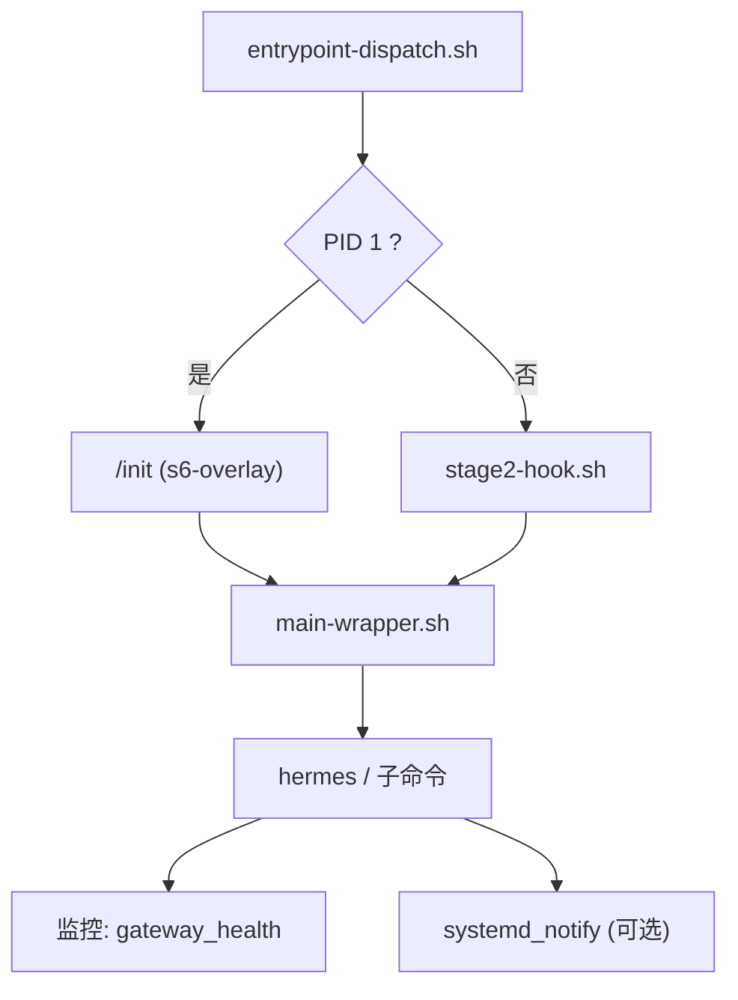
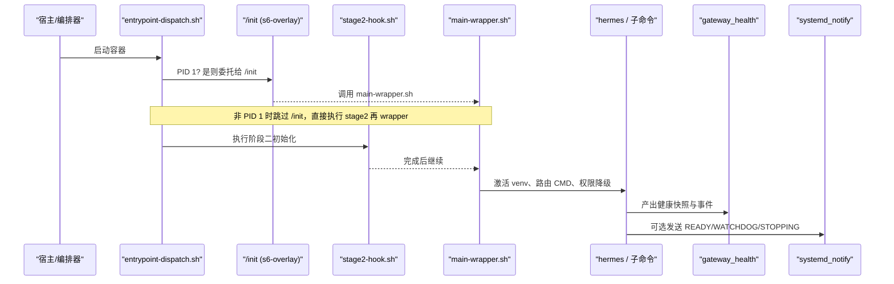
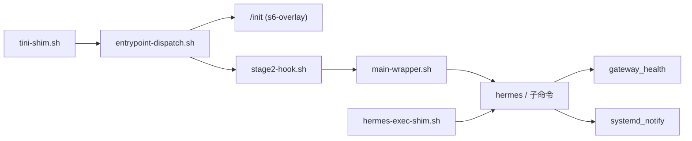

# 服务生命周期管理

<cite>
**本文引用的文件**
- [docker/entrypoint-dispatch.sh](file://docker/entrypoint-dispatch.sh)
- [docker/entrypoint.sh](file://docker/entrypoint.sh)
- [docker/main-wrapper.sh](file://docker/main-wrapper.sh)
- [docker/stage2-hook.sh](file://docker/stage2-hook.sh)
- [docker/hermes-exec-shim.sh](file://docker/hermes-exec-shim.sh)
- [docker/tini-shim.sh](file://docker/tini-shim.sh)
- [hermes_cli/lifecycle.py](file://hermes_cli/lifecycle.py)
- [agent/monitoring/gateway_health.py](file://agent/monitoring/gateway_health.py)
- [gateway/restart.py](file://gateway/restart.py)
- [gateway/systemd_notify.py](file://gateway/systemd_notify.py)
</cite>

## 目录
1. [简介](#简介)
2. [项目结构](#项目结构)
3. [核心组件](#核心组件)
4. [架构总览](#架构总览)
5. [详细组件分析](#详细组件分析)
6. [依赖关系分析](#依赖关系分析)
7. [性能考量](#性能考量)
8. [故障排查指南](#故障排查指南)
9. [结论](#结论)
10. [附录](#附录)

## 简介
本文件聚焦 Hermes Agent 在容器环境中的完整服务生命周期：启动阶段、运行阶段与关闭阶段的处理逻辑。重点说明以下脚本的职责与协作方式：
- entrypoint-dispatch.sh：根据是否拥有 PID 1 决定走 s6-overlay 监督树或直接引导，确保在不同运行时（Docker/Podman、Fly Machines、Nomad/K8s）均能正确启动。
- stage2-hook.sh：在用户服务启动前完成 UID/GID 重映射、数据卷权限修复、配置种子注入、技能同步等初始化工作。
- main-wrapper.sh：包装 CMD，负责环境变量恢复、工作目录设置、虚拟环境激活、命令路由与权限降级。
- hermes-exec-shim.sh：为 docker exec 路径提供权限降级保护，避免 root 写入导致后续进程无法读取。
- tini-shim.sh：兼容旧版入口点，剥离 tini 参数后转发到 /init + main-wrapper.sh。
- 监控与健康检查：基于 agent.monitoring.gateway_health 构建健康快照、状态转换事件；systemd_notify 提供可选的 systemd watchdog 支持；restart 模块定义优雅重启与退出码约定。

## 项目结构
Hermes 的容器化生命周期由一组 shell 脚本与 Python 监控模块共同组成。整体流程如下：
- 容器启动时，entrypoint-dispatch.sh 判断自身是否为 PID 1。若是，则通过 s6-overlay 的 /init 启动监督树并执行 main-wrapper.sh；否则直接执行 stage2-hook.sh 后再执行 main-wrapper.sh。
- stage2-hook.sh 作为 cont-init.d 钩子，以 root 身份完成必要的系统级准备（UID/GID 重映射、数据卷权限、配置种子、技能同步等）。
- main-wrapper.sh 负责将 CMD 路由到 hermes 或任意可执行程序，并在必要时进行权限降级。
- 运行期间，gateway 通过 agent.monitoring.gateway_health 持续产出健康指标与事件；systemd_notify 在 systemd 环境下上报心跳与就绪状态。
- 关闭阶段，gateway 遵循 restart 模块定义的优雅退出与重启约定，必要时借助 s6 或外部 supervisor 完成重启。

图表来源
- [docker/entrypoint-dispatch.sh:1-26](file://docker/entrypoint-dispatch.sh#L1-L26)
- [docker/stage2-hook.sh:1-592](file://docker/stage2-hook.sh#L1-L592)
- [docker/main-wrapper.sh:1-92](file://docker/main-wrapper.sh#L1-L92)
- [agent/monitoring/gateway_health.py:1-470](file://agent/monitoring/gateway_health.py#L1-L470)
- [gateway/systemd_notify.py:1-177](file://gateway/systemd_notify.py#L1-L177)

章节来源
- [docker/entrypoint-dispatch.sh:1-26](file://docker/entrypoint-dispatch.sh#L1-L26)
- [docker/entrypoint.sh:1-29](file://docker/entrypoint.sh#L1-L29)
- [docker/stage2-hook.sh:1-592](file://docker/stage2-hook.sh#L1-L592)
- [docker/main-wrapper.sh:1-92](file://docker/main-wrapper.sh#L1-L92)

## 核心组件
- 入口分发器（entrypoint-dispatch.sh）：检测 PID 1 并选择 s6-overlay 监督路径或直接引导，保证跨运行时兼容性。
- 阶段二钩子（stage2-hook.sh）：以 root 身份完成系统级初始化，包括 UID/GID 重映射、数据卷权限修复、配置种子注入、技能同步、浏览器二进制发现等。
- 主包装器（main-wrapper.sh）：恢复环境变量、激活虚拟环境、设置工作目录、路由 CMD、权限降级。
- 执行代理（hermes-exec-shim.sh）：在 docker exec 路径中自动从 root 降级到 hermes 用户，防止权限错配。
- 兼容性 shim（tini-shim.sh）：剥离 tini 参数，转发到 /init + main-wrapper.sh，避免旧模板导致的启动循环。
- 监控与健康（gateway_health.py）：构建健康快照、分类错误、导出事件；systemd_notify.py：可选地对接 systemd 看门狗。
- 重启策略（restart.py）：定义优雅重启、排水超时、外部监督者检测与退出码约定。

章节来源
- [docker/entrypoint-dispatch.sh:1-26](file://docker/entrypoint-dispatch.sh#L1-L26)
- [docker/stage2-hook.sh:1-592](file://docker/stage2-hook.sh#L1-L592)
- [docker/main-wrapper.sh:1-92](file://docker/main-wrapper.sh#L1-L92)
- [docker/hermes-exec-shim.sh:1-88](file://docker/hermes-exec-shim.sh#L1-L88)
- [docker/tini-shim.sh:1-90](file://docker/tini-shim.sh#L1-L90)
- [agent/monitoring/gateway_health.py:1-470](file://agent/monitoring/gateway_health.py#L1-L470)
- [gateway/systemd_notify.py:1-177](file://gateway/systemd_notify.py#L1-L177)
- [gateway/restart.py:1-121](file://gateway/restart.py#L1-L121)

## 架构总览
下图展示了 Hermes 在容器中的生命周期关键节点与组件交互：

图表来源
- [docker/entrypoint-dispatch.sh:1-26](file://docker/entrypoint-dispatch.sh#L1-L26)
- [docker/stage2-hook.sh:1-592](file://docker/stage2-hook.sh#L1-L592)
- [docker/main-wrapper.sh:1-92](file://docker/main-wrapper.sh#L1-L92)
- [agent/monitoring/gateway_health.py:1-470](file://agent/monitoring/gateway_health.py#L1-L470)
- [gateway/systemd_notify.py:1-177](file://gateway/systemd_notify.py#L1-L177)

## 详细组件分析

### 入口分发机制（entrypoint-dispatch.sh）
- 当脚本以 PID 1 运行时，委托给 s6-overlay 的 /init，保持完整的监督树。
- 当平台已提供 PID 1（如 Fly Machines、docker run --init），则跳过 /init，直接执行 stage2-hook.sh 后再执行 main-wrapper.sh，确保请求的命令仍可运行。
- 在非 PID 1 路径下，显式设置 PATH 以便使用 s6 工具，并输出警告提示监督服务不可用。

章节来源
- [docker/entrypoint-dispatch.sh:1-26](file://docker/entrypoint-dispatch.sh#L1-L26)

### 阶段二初始化（stage2-hook.sh）
- 以 root 身份运行，创建并修复 $HERMES_HOME 及其子目录所有权，确保 hermes 用户可写。
- 支持 PUID/PGID 别名与 HERMES_UID/HERMES_GID，动态修改 hermes 用户 UID/GID。
- 针对 Docker socket 绑定场景，自动将 hermes 加入对应组，避免 EACCES。
- 安全地修复特定目录与顶层状态文件的权限，避免 root 写入导致后续进程无法读取。
- 首次启动时注入 .env、config.yaml、SOUL.md 等种子文件，并对敏感文件收紧权限。
- 执行配置迁移脚本，确保升级后的配置兼容。
- 在 fresh volume 上可按需写入 gateway_state.json 以控制首启行为。
- 同步内置技能，发现 Chromium 二进制并暴露给受监督服务。

章节来源
- [docker/stage2-hook.sh:1-592](file://docker/stage2-hook.sh#L1-L592)

### 主包装器（main-wrapper.sh）
- 通过 with-contenv 恢复环境变量，确保在 s6 监督路径下也能正确获取 HERMES_HOME、PATH 等。
- 拒绝不支持的 --user 启动方式，给出明确指引。
- 设置 HOME 与工作目录，激活虚拟环境，并将 CMD 路由到 hermes 或任意可执行程序。
- 在需要时通过 s6-setuidgid 降级到 hermes 用户，保证文件归属一致。

章节来源
- [docker/main-wrapper.sh:1-92](file://docker/main-wrapper.sh#L1-L92)

### 执行代理（hermes-exec-shim.sh）
- 当以 root 执行 docker exec 时，自动切换到 hermes 用户，避免 root 写入导致权限错配。
- 允许通过环境变量 HERMES_DOCKER_EXEC_AS_ROOT=1 显式保留 root 语义，用于诊断。
- 若缺少 s6-setuidgid，则拒绝静默以 root 运行，强制操作者修正启动方式。

章节来源
- [docker/hermes-exec-shim.sh:1-88](file://docker/hermes-exec-shim.sh#L1-L88)

### 兼容性 shim（tini-shim.sh）
- 剥离 tini 的参数（如 -g、-s、-v、--help 等），避免将参数透传到 /init 导致启动失败。
- 若无程序参数，则默认执行 /init + main-wrapper.sh；若已包含 /init 或 main-wrapper.sh，则避免重复包装。
- 通过测试钩子 HERMES_TINI_SHIM_TARGET 与 HERMES_TINI_SHIM_WRAPPER 便于单元测试记录 argv。

章节来源
- [docker/tini-shim.sh:1-90](file://docker/tini-shim.sh#L1-L90)

### 生命周期事件与插件钩子（hermes_cli/lifecycle.py）
- 提供统一的 hook 调用接口，先通知内置可观测性观察者，再调用插件钩子。
- 会话终结时触发 on_session_finalize，协调核心 Relay 会话的最终化。

章节来源
- [hermes_cli/lifecycle.py:1-64](file://hermes_cli/lifecycle.py#L1-L64)

### 健康检查与监控（agent/monitoring/gateway_health.py）
- 构建 GatewayHealthSnapshot，汇总网关与平台的上/下线、忙碌度、可排水性等指标。
- 对错误进行分类（认证失败、速率限制、超时、网络错误、配置无效、启动失败、平台致命等）。
- 在运行时状态变化时发出生命周期事件与诊断事件，便于上层告警与追踪。
- 提供日志处理器桥接 gateway 相关 warning/error 到统一事件通道。

章节来源
- [agent/monitoring/gateway_health.py:1-470](file://agent/monitoring/gateway_health.py#L1-L470)

### systemd 看门狗（gateway/systemd_notify.py）
- 在 NOTIFY_SOCKET 存在时，非阻塞地发送 READY、WATCHDOG、STOPPING 等消息。
- 提供 SystemdWatchdog 类，周期性探测事件循环进度，超时报 unhealthy 并停止喂狗。
- 启动时上报 READY，停止时上报 STOPPING，帮助编排层感知服务状态。

章节来源
- [gateway/systemd_notify.py:1-177](file://gateway/systemd_notify.py#L1-L177)

### 优雅重启与退出码（gateway/restart.py）
- 定义外部监督者检测、容器重启上下文识别、排水超时与“转轮后等待”超时解析。
- 约定 EX_TEMPFAIL（75）用于请求服务管理器重启，EX_CONFIG（78）表示致命配置错误，s6 finish 会将其转为永久失败以避免无限重启。
- 提供计算 CLI 等待 SIGUSR1 后退出的预算时间，覆盖排水与转轮后等待两阶段。

章节来源
- [gateway/restart.py:1-121](file://gateway/restart.py#L1-L121)

## 依赖关系分析
- entrypoint-dispatch.sh 依赖 s6-overlay 的 /init 与 main-wrapper.sh；在非 PID 1 路径下依赖 stage2-hook.sh。
- stage2-hook.sh 依赖 s6-setuidgid、Python 虚拟环境与脚本（配置迁移、技能同步）、Playwright 安装的 Chromium 二进制。
- main-wrapper.sh 依赖 with-contenv、s6-setuidgid、虚拟环境激活脚本。
- hermes-exec-shim.sh 依赖 s6-setuidgid 与 venv 中的 hermes 二进制。
- gateway_health 依赖 emitter、redaction、gateway.status 等内部模块。
- systemd_notify 依赖操作系统提供的 AF_UNIX 套接字与 NOTIFY_SOCKET 环境变量。

图表来源
- [docker/entrypoint-dispatch.sh:1-26](file://docker/entrypoint-dispatch.sh#L1-L26)
- [docker/stage2-hook.sh:1-592](file://docker/stage2-hook.sh#L1-L592)
- [docker/main-wrapper.sh:1-92](file://docker/main-wrapper.sh#L1-L92)
- [docker/hermes-exec-shim.sh:1-88](file://docker/hermes-exec-shim.sh#L1-L88)
- [docker/tini-shim.sh:1-90](file://docker/tini-shim.sh#L1-L90)
- [agent/monitoring/gateway_health.py:1-470](file://agent/monitoring/gateway_health.py#L1-L470)
- [gateway/systemd_notify.py:1-177](file://gateway/systemd_notify.py#L1-L177)

## 性能考量
- 阶段二初始化尽量幂等且快速，避免对大目录进行全量递归 chown；仅在必要时扫描与修复。
- 监控事件与指标生成应轻量，避免阻塞主事件循环；日志桥接仅处理必要级别与来源。
- systemd 看门狗采用非阻塞发送与合理超时容忍，降低对事件循环的影响。
- 在容器内避免不必要的 fork/exec；hermes-exec-shim.sh 通过绝对路径直调 venv 二进制，减少 PATH 依赖。

## 故障排查指南
- 启动失败（startup_failed）：查看 gateway_health 的分类结果（认证失败、网络错误、配置无效、启动失败等），结合日志定位。
- 权限问题（EACCES）：确认 stage2-hook.sh 是否正确修复了 $HERMES_HOME 及子目录所有权；检查 hermes-exec-shim.sh 是否成功降级到 hermes 用户。
- 平台连接异常：关注 platform.state_change 与 platform.fatal 事件，结合 error_code 与 error_class 定位具体平台问题。
- 看门狗不健康：检查 systemd_notify 的 lag_tolerance 与事件循环是否卡顿；必要时调整 WATCHDOG_USEC 或优化任务调度。
- 优雅重启：确认 exit code 是否符合约定（75 临时失败触发重启，78 致命配置错误停止重启）；在容器中优先使用服务管理器重启而非硬杀。

章节来源
- [agent/monitoring/gateway_health.py:1-470](file://agent/monitoring/gateway_health.py#L1-L470)
- [docker/stage2-hook.sh:1-592](file://docker/stage2-hook.sh#L1-L592)
- [docker/hermes-exec-shim.sh:1-88](file://docker/hermes-exec-shim.sh#L1-L88)
- [gateway/systemd_notify.py:1-177](file://gateway/systemd_notify.py#L1-L177)
- [gateway/restart.py:1-121](file://gateway/restart.py#L1-L121)

## 结论
Hermes Agent 的生命周期管理通过多层次的脚本与监控模块协同实现：
- 入口分发器确保在不同运行时下的稳定启动。
- 阶段二钩子完成系统级初始化与权限修复，保障运行时一致性。
- 主包装器负责环境准备与命令路由，配合执行代理实现安全的权限降级。
- 监控与健康检查提供细粒度的状态可见性与可观测性。
- 优雅重启与 systemd 看门狗提升服务的自愈能力与编排友好性。

## 附录
- 建议在生产环境中启用 systemd_notify 以增强编排层感知。
- 谨慎使用 --user 启动容器，推荐通过 PUID/PGID 或 HERMES_UID/HERMES_GID 进行 UID/GID 重映射。
- 定期审查 stage2-hook.sh 输出的权限修复日志，确保数据卷与配置文件归属正确。
- 利用 gateway_health 的事件与指标建立告警规则，覆盖启动失败、平台致命、看门狗不健康等关键场景。