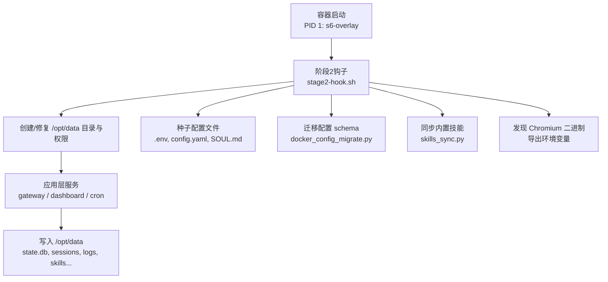
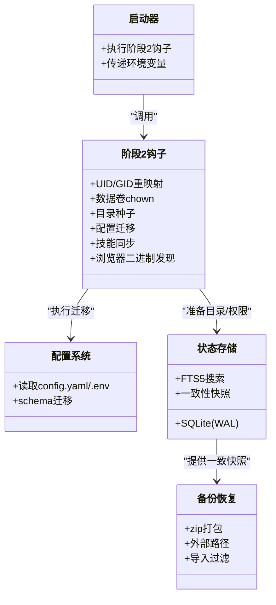
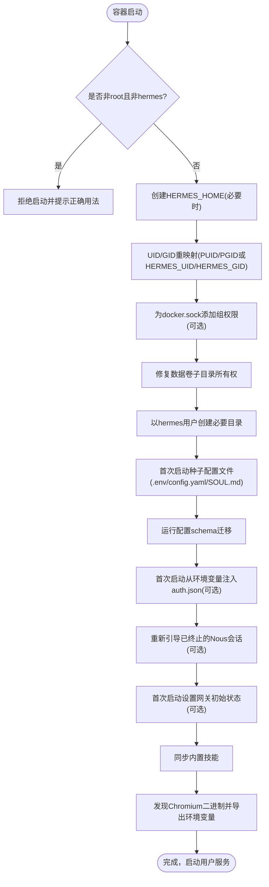
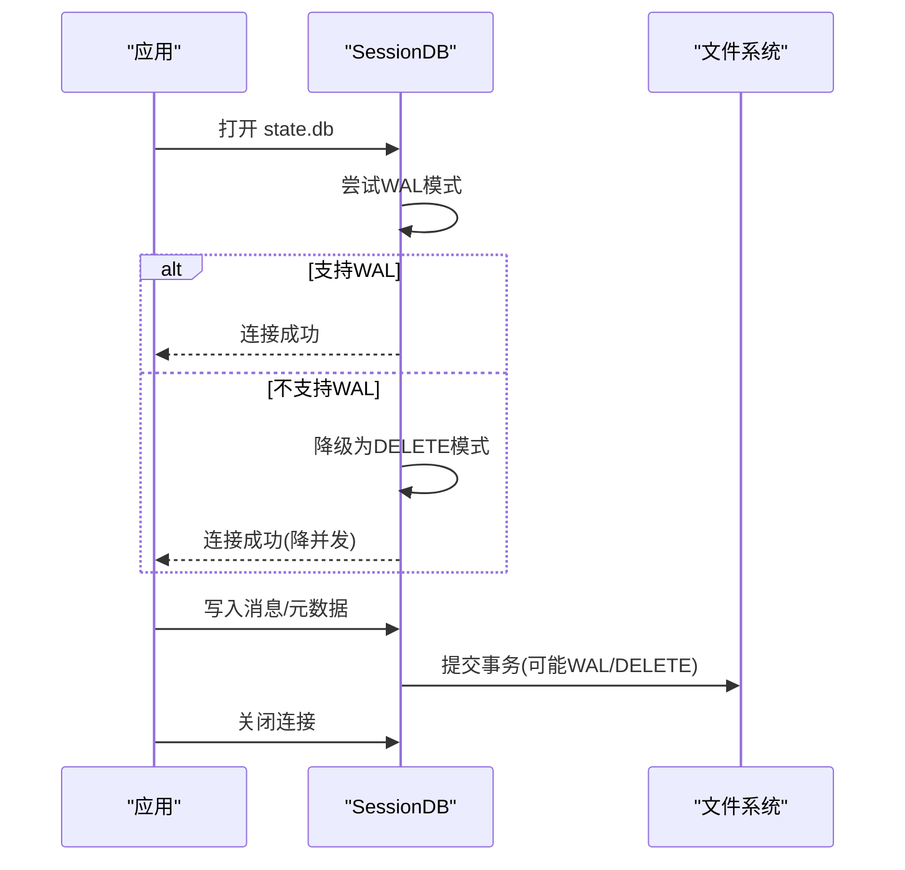
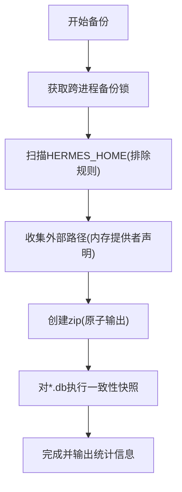
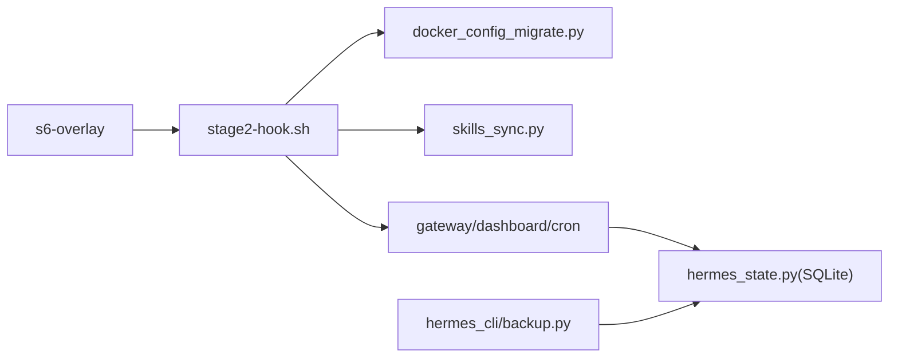

# 数据持久化与存储

<cite>
**本文引用的文件**
- [docker/stage2-hook.sh](file://docker/stage2-hook.sh)
- [docker/entrypoint.sh](file://docker/entrypoint.sh)
- [hermes_constants.py](file://hermes_constants.py)
- [hermes_state.py](file://hermes_state.py)
- [hermes_cli/backup.py](file://hermes_cli/backup.py)
- [scripts/docker_config_migrate.py](file://scripts/docker_config_migrate.py)
</cite>

## 目录
1. [简介](#简介)
2. [项目结构](#项目结构)
3. [核心组件](#核心组件)
4. [架构总览](#架构总览)
5. [详细组件分析](#详细组件分析)
6. [依赖关系分析](#依赖关系分析)
7. [性能考虑](#性能考虑)
8. [故障排查指南](#故障排查指南)
9. [结论](#结论)
10. [附录](#附录)

## 简介
本文件面向运维团队，系统化说明 Hermes Agent 在容器环境下的数据持久化与存储方案。重点覆盖：
- /opt/data（即 HERMES_HOME）数据卷的职责、目录结构与权限模型
- stage2-hook.sh 的数据初始化流程（目录创建、权限修复、配置种子、技能同步等）
- 数据库与状态文件的持久化策略（SQLite WAL、一致性快照、完整性校验）
- 备份与恢复机制（全量备份、外部路径、导入过滤）
- 日志轮转与空间监控建议
- 懒加载包安装位置与安全边界
- 数据完整性检查、存储空间监控与灾备策略

## 项目结构
Hermes 将“不可变安装树”和“可变数据卷”严格分离：
- /opt/hermes：只读安装树（Python 环境、二进制、内置资源），由镜像构建并固定所有权
- /opt/data（默认 HERMES_HOME）：可写数据卷，承载所有运行时状态、配置、会话、日志、缓存、技能、凭据等

图表来源
- [docker/stage2-hook.sh:18-592](file://docker/stage2-hook.sh#L18-L592)
- [scripts/docker_config_migrate.py:57-102](file://scripts/docker_config_migrate.py#L57-L102)

章节来源
- [docker/stage2-hook.sh:18-592](file://docker/stage2-hook.sh#L18-L592)
- [docker/entrypoint.sh:1-29](file://docker/entrypoint.sh#L1-L29)

## 核心组件
- 数据根解析：通过 get_hermes_home() 统一解析 HERMES_HOME，默认 /opt/data；支持 profile 模式与自定义路径
- 启动初始化：stage2-hook.sh 负责 UID/GID 重映射、数据卷 chown、目录种子、配置迁移、技能同步、浏览器二进制发现
- 状态存储：hermes_state.py 使用 SQLite（WAL 模式）、FTS5 全文检索、压缩拆分、并发读写保护
- 备份恢复：hermes_cli/backup.py 提供全量 zip 备份与导入，包含 SQLite 一致快照、外部路径、敏感文件权限修复
- 配置迁移：scripts/docker_config_migrate.py 在启动时安全升级配置 schema，失败自动回滚

章节来源
- [hermes_constants.py:114-199](file://hermes_constants.py#L114-L199)
- [docker/stage2-hook.sh:76-592](file://docker/stage2-hook.sh#L76-L592)
- [hermes_state.py:1-15](file://hermes_state.py#L1-L15)
- [hermes_cli/backup.py:1-140](file://hermes_cli/backup.py#L1-L140)
- [scripts/docker_config_migrate.py:57-102](file://scripts/docker_config_migrate.py#L57-L102)

## 架构总览
Hermes 的持久化架构遵循“只读代码 + 可写数据卷”的原则，确保升级与重建不影响用户数据，同时避免进程污染安装树。

图表来源
- [docker/stage2-hook.sh:76-592](file://docker/stage2-hook.sh#L76-L592)
- [scripts/docker_config_migrate.py:57-102](file://scripts/docker_config_migrate.py#L57-L102)
- [hermes_state.py:1-15](file://hermes_state.py#L1-L15)
- [hermes_cli/backup.py:581-795](file://hermes_cli/backup.py#L581-L795)

## 详细组件分析

### 数据卷 /opt/data 的作用与管理机制
- 角色定位：唯一可写数据根，承载配置、会话、日志、凭据、技能、计划、工作区、配对信息等
- 目录结构（首次启动由 stage2-hook.sh 以 hermes 用户创建）：
  - backups：备份归档
  - cron：定时任务状态
  - sessions：会话历史与消息
  - logs/gateways：网关日志
  - hooks：钩子脚本
  - memories：记忆存储
  - skills：技能与皮肤
  - plans：计划
  - workspace：工作区
  - home：用户主目录
  - pairing / platforms/pairing：平台配对数据
  - lazy-packages：懒加载包安装目标
- 权限模型：
  - 启动时以 root 运行阶段2钩子，随后以 hermes 用户执行服务
  - 对关键目录进行 targeted chown，避免误改宿主绑定挂载的其他文件
  - 对 .env、auth.json 等敏感文件强制 600 权限
  - 拒绝通过符号链接路径执行 chown/chmod，防止 TOCTOU 风险

章节来源
- [docker/stage2-hook.sh:174-396](file://docker/stage2-hook.sh#L174-L396)
- [docker/stage2-hook.sh:418-444](file://docker/stage2-hook.sh#L418-L444)
- [docker/stage2-hook.sh:331-360](file://docker/stage2-hook.sh#L331-L360)

### stage2-hook.sh 的数据初始化流程

图表来源
- [docker/stage2-hook.sh:20-74](file://docker/stage2-hook.sh#L20-L74)
- [docker/stage2-hook.sh:76-116](file://docker/stage2-hook.sh#L76-L116)
- [docker/stage2-hook.sh:118-172](file://docker/stage2-hook.sh#L118-L172)
- [docker/stage2-hook.sh:174-396](file://docker/stage2-hook.sh#L174-L396)
- [docker/stage2-hook.sh:418-592](file://docker/stage2-hook.sh#L418-L592)

章节来源
- [docker/stage2-hook.sh:20-592](file://docker/stage2-hook.sh#L20-L592)

### 数据库与状态持久化（SQLite）
- 默认路径：$HERMES_HOME/state.db（可通过模块常量与运行时解析）
- 模式选择：
  - 优先启用 WAL 模式以提升并发读能力
  - 在 NFS/SMB/FUSE/ZFS 等不支持共享锁或存在 SHM 损坏风险的介质上，自动降级为 DELETE 模式
  - macOS 下强制 synchronous=FULL 并在 checkpoint 时使用 fullfsync 屏障，降低关机/重启期间的损坏概率
- 一致性快照：
  - 备份时使用 sqlite3.backup() 获取一致快照，避免拷贝 live WAL/SHM 导致的不一致
- 完整性检查：
  - 小库：PRAGMA integrity_check
  - 大库：跳过全量扫描，采用头部校验 + 轻量 schema 探测
  - 检测零填充异常签名，辅助诊断

图表来源
- [hermes_state.py:486-538](file://hermes_state.py#L486-L538)
- [hermes_state.py:718-780](file://hermes_state.py#L718-L780)
- [hermes_cli/backup.py:342-374](file://hermes_cli/backup.py#L342-L374)
- [hermes_cli/backup.py:416-553](file://hermes_cli/backup.py#L416-L553)

章节来源
- [hermes_state.py:486-780](file://hermes_state.py#L486-L780)
- [hermes_cli/backup.py:342-553](file://hermes_cli/backup.py#L342-L553)

### 备份与恢复策略
- 备份范围：
  - 整个 $HERMES_HOME（排除代码仓库、缓存、虚拟环境、临时文件等）
  - 外部路径：根据活跃内存提供者声明的路径，将家目录下外部文件纳入备份（_external/ 前缀）
- 一致性保障：
  - SQLite 文件通过 backup() API 生成一致快照
  - 输出原子替换（partial -> final），失败清理
- 导入过滤：
  - 不覆盖 gateway_state.json、进程 PID/Lock、processes.json 等易造成跨主机不一致的文件
  - 恢复后收紧敏感文件权限（.env、auth.json、state.db）
- 容量与性能：
  - 排除 node_modules、.venv、site-packages、各类缓存目录，避免备份膨胀
  - 进度日志与错误汇总便于排障

图表来源
- [hermes_cli/backup.py:150-218](file://hermes_cli/backup.py#L150-L218)
- [hermes_cli/backup.py:221-336](file://hermes_cli/backup.py#L221-L336)
- [hermes_cli/backup.py:581-795](file://hermes_cli/backup.py#L581-L795)

章节来源
- [hermes_cli/backup.py:150-795](file://hermes_cli/backup.py#L150-L795)

### 懒加载包的安装位置与安全边界
- 安装目标：$HERMES_HOME/lazy-packages（由 Dockerfile 设置 HERMES_LAZY_INSTALL_TARGET）
- 安全保证：
  - 追加到 sys.path 末尾，仅允许新增模块，不能覆盖核心模块
  - 安装树位于可写数据卷，不受只读安装树限制
  - 首次使用时由 hermes 用户创建并拥有，避免权限问题
- 生命周期：
  - 随容器重建保留（ABI 戳会在新解释器版本时清理）
  - 与 sealed venv 隔离，确保核心依赖不被破坏

章节来源
- [docker/stage2-hook.sh:257-274](file://docker/stage2-hook.sh#L257-L274)
- [docker/stage2-hook.sh:381-396](file://docker/stage2-hook.sh#L381-L396)

### 技能文件存储结构
- 内置技能同步：启动时调用 tools/skills_sync.py 将镜像内 skills 同步至 $HERMES_HOME/skills
- 可选技能：可通过 HERMES_OPTIONAL_SKILLS 指向外部目录
- 捆绑技能：可通过 HERMES_BUNDLED_SKILLS 指定源码或打包路径
- 缓存与归档：
  - skills/.hub：索引与缓存
  - skills/.archive：可恢复的用户技能归档（备份时保留）

章节来源
- [docker/stage2-hook.sh:532-541](file://docker/stage2-hook.sh#L532-L541)
- [hermes_constants.py:201-244](file://hermes_constants.py#L201-L244)
- [hermes_cli/backup.py:55-75](file://hermes_cli/backup.py#L55-L75)

### 日志文件的轮转配置
- 工作进程日志：按大小轮转（默认 2 MiB），支持备份计数
- 容器启动日志：soft cap 256 KiB，超过则旋转为 .1
- 外部 logrotate：当外部工具移动/删除日志文件时，应用层能识别并重开句柄，避免丢失后续日志
- 注意：日志属于可再生数据，但需结合磁盘监控与告警，避免填满数据卷

章节来源
- [hermes_cli/config_defaults.py:2330-2333](file://hermes_cli/config_defaults.py#L2330-L2333)
- [hermes_cli/container_boot.py:548-575](file://hermes_cli/container_boot.py#L548-L575)
- [hermes_logging.py:429-468](file://hermes_logging.py#L429-L468)

### 配置迁移与种子
- 首次启动：
  - 若不存在 .env/config.yaml/SOUL.md，则从镜像中复制示例文件
  - .env 权限收紧为 600
- 配置 schema 迁移：
  - 启动时运行 docker_config_migrate.py，自动备份原配置，迁移成功后验证版本
  - 失败时自动回滚备份，避免卡住启动
- 认证与会话：
  - 可从环境变量注入 auth.json（首次启动）
  - 支持重新引导已终止的 Nous 会话（比较时间戳，避免回退健康令牌）
- 网关初始状态：
  - 首次启动可设置 gateway_state.json 为 running，使 reconciler 自动拉起网关

章节来源
- [docker/stage2-hook.sh:418-530](file://docker/stage2-hook.sh#L418-L530)
- [scripts/docker_config_migrate.py:57-102](file://scripts/docker_config_migrate.py#L57-L102)

## 依赖关系分析
- 启动链路：s6-overlay → stage2-hook.sh → 配置迁移 → 技能同步 → 用户服务
- 数据访问：应用层通过 hermes_state.py 访问 SQLite，备份模块通过 backup API 获取一致快照
- 路径解析：hermes_constants.py 提供统一的 HERMES_HOME 解析，profile 模式下返回根目录以便管理操作

图表来源
- [docker/stage2-hook.sh:532-541](file://docker/stage2-hook.sh#L532-L541)
- [scripts/docker_config_migrate.py:57-102](file://scripts/docker_config_migrate.py#L57-L102)
- [hermes_state.py:1-15](file://hermes_state.py#L1-L15)
- [hermes_cli/backup.py:581-795](file://hermes_cli/backup.py#L581-L795)

章节来源
- [docker/stage2-hook.sh:532-541](file://docker/stage2-hook.sh#L532-L541)
- [scripts/docker_config_migrate.py:57-102](file://scripts/docker_config_migrate.py#L57-L102)
- [hermes_state.py:1-15](file://hermes_state.py#L1-L15)
- [hermes_cli/backup.py:581-795](file://hermes_cli/backup.py#L581-L795)

## 性能考虑
- 数据库：
  - WAL 模式提升并发读，但在网络/特殊文件系统上自动降级
  - 大库完整性检查采用轻量探测，避免长时间 CPU 占用
  - macOS 强化 fsync 屏障，降低关机/重启损坏风险
- 备份：
  - 排除大量可再生目录与缓存，显著减少 IO 与压缩时间
  - SQLite 一致性快照避免拷贝 live sidecar 文件
- 日志：
  - 按大小轮转，控制单文件大小，便于管理与传输
  - 外部 logrotate 兼容，避免句柄泄漏

[本节为通用指导，无需特定文件引用]

## 故障排查指南
- 启动失败（EACCES）：
  - 确认未使用 --user 指定任意 UID；应通过 PUID/PGID 或 HERMES_UID/HERMES_GID 重映射
  - 检查 /opt/data 及其子目录所有权是否为 hermes
- 数据库不可用：
  - 查看最后初始化错误（NFS/SMB/FUSE/ZFS 可能导致 WAL 协议失败）
  - 检查是否处于测试环境误连生产 state.db（有防护阻断）
- 备份卡住：
  - 检查是否存在其他备份进程持有锁
  - 确认排除规则生效，避免遍历 node_modules/.venv 等大目录
- 导入后网关异常：
  - 确认未覆盖 gateway_state.json、进程 PID/Lock、processes.json
- 权限问题：
  - 检查 .env/auth.json/state.db 权限是否为 600
  - 避免通过符号链接路径修改权限

章节来源
- [docker/stage2-hook.sh:26-74](file://docker/stage2-hook.sh#L26-L74)
- [docker/stage2-hook.sh:174-396](file://docker/stage2-hook.sh#L174-L396)
- [hermes_state.py:520-565](file://hermes_state.py#L520-L565)
- [hermes_cli/backup.py:150-218](file://hermes_cli/backup.py#L150-L218)
- [hermes_cli/backup.py:98-133](file://hermes_cli/backup.py#L98-L133)

## 结论
Hermes 通过严格的“只读安装 + 可写数据卷”设计，配合阶段2初始化、SQLite 一致性快照、完善的备份恢复与配置迁移，提供了健壮的数据持久化与存储方案。运维团队可基于此实现：
- 安全的容器化部署与升级
- 可靠的备份与灾难恢复
- 可观测的日志与空间管理
- 灵活的懒加载扩展与技能生态

[本节为总结性内容，无需特定文件引用]

## 附录
- 环境变量参考：
  - HERMES_HOME：数据根（默认 /opt/data）
  - PUID/PGID 或 HERMES_UID/HERMES_GID：UID/GID 重映射
  - HERMES_AUTH_JSON_BOOTSTRAP：首次启动注入认证
  - HERMES_AUTH_JSON_REBOOTSTRAP：重新引导已终止会话
  - HERMES_GATEWAY_BOOTSTRAP_STATE：首次启动网关初始状态
  - HERMES_SKIP_CONFIG_MIGRATION：跳过配置迁移
  - AGENT_BROWSER_EXECUTABLE_PATH：覆盖浏览器二进制路径
  - PLAYWRIGHT_BROWSERS_PATH：Playwright 浏览器安装路径
- 关键目录清单：
  - backups、cron、sessions、logs/gateways、hooks、memories、skills、skins、plans、workspace、home、pairing、platforms/pairing、lazy-packages

[本节为补充信息，无需特定文件引用]