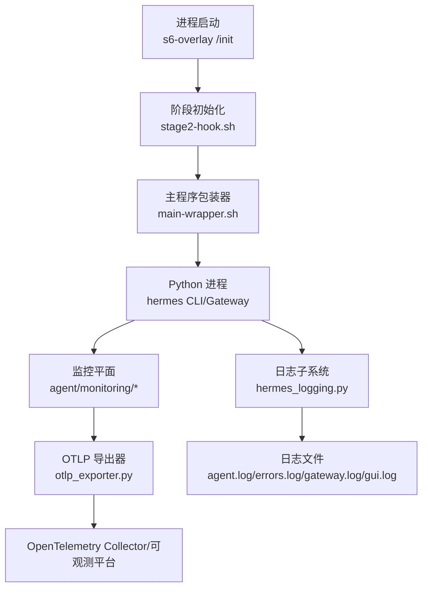
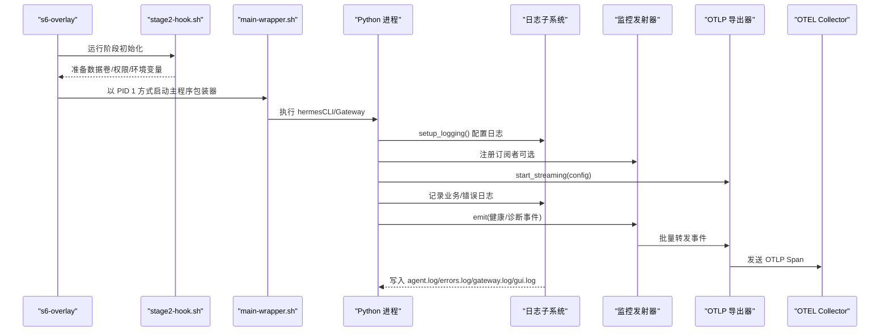
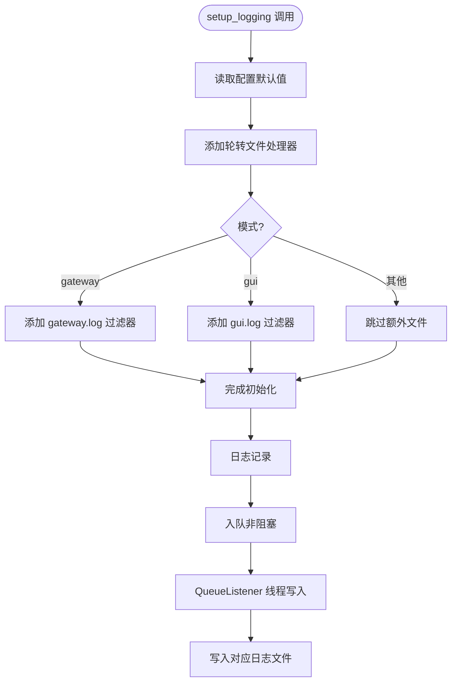
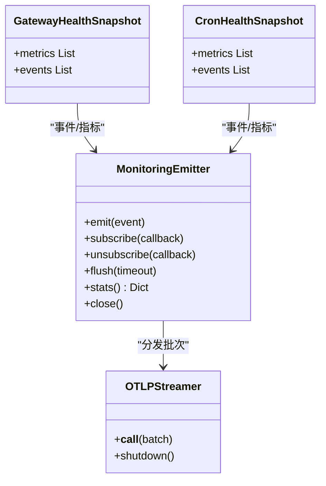
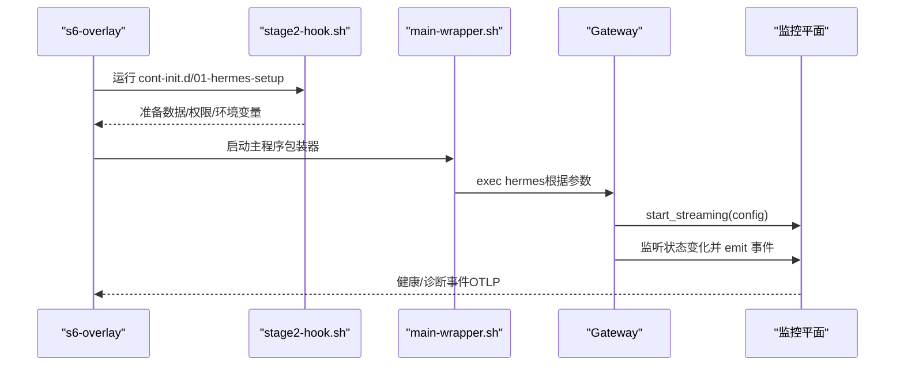
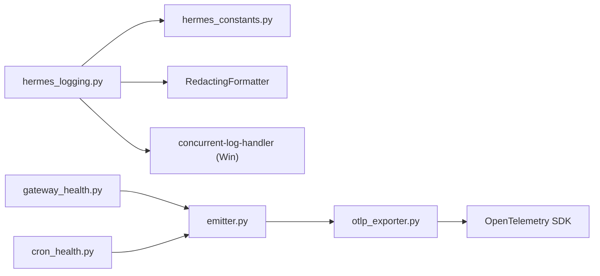

# 监控与日志收集

<cite>
**本文引用的文件**
- [hermes_logging.py](file://hermes_logging.py)
- [agent/monitoring/__init__.py](file://agent/monitoring/__init__.py)
- [agent/monitoring/emitter.py](file://agent/monitoring/emitter.py)
- [agent/monitoring/events.py](file://agent/monitoring/events.py)
- [agent/monitoring/gateway_health.py](file://agent/monitoring/gateway_health.py)
- [agent/monitoring/cron_health.py](file://agent/monitoring/cron_health.py)
- [agent/monitoring/otlp_exporter.py](file://agent/monitoring/otlp_exporter.py)
- [docker/entrypoint.sh](file://docker/entrypoint.sh)
- [docker/main-wrapper.sh](file://docker/main-wrapper.sh)
- [docker/stage2-hook.sh](file://docker/stage2-hook.sh)
- [hermes_constants.py](file://hermes_constants.py)
</cite>

## 目录
1. [简介](#简介)
2. [项目结构](#项目结构)
3. [核心组件](#核心组件)
4. [架构总览](#架构总览)
5. [详细组件分析](#详细组件分析)
6. [依赖关系分析](#依赖关系分析)
7. [性能考量](#性能考量)
8. [故障排查指南](#故障排查指南)
9. [结论](#结论)
10. [附录](#附录)

## 简介
本文件面向运维团队，系统化说明 Hermes Agent 在容器环境中的监控与日志收集方案。内容涵盖：
- 容器内标准输出重定向、错误日志捕获与结构化日志格式
- s6-overlay 服务治理（健康检查、重启策略）与指标采集
- 外部监控系统集成（OTLP）、日志聚合与告警配置建议
- Python 应用日志配置、调试模式与性能分析要点
- 日志轮转、存储空间管理与常见故障诊断方法

## 项目结构
Hermes 的监控与日志由“应用层日志”和“网关监控平面”两部分组成：
- 应用层日志：统一入口 hermes_logging.py，负责多文件输出、轮转、敏感信息脱敏、会话上下文注入、异步队列落盘等。
- 网关监控平面：agent/monitoring/*，提供事件发射器、健康快照、诊断事件、Cron 执行事件以及 OTLP 导出。

图示来源
- [docker/entrypoint.sh:1-29](file://docker/entrypoint.sh#L1-L29)
- [docker/stage2-hook.sh:1-592](file://docker/stage2-hook.sh#L1-L592)
- [docker/main-wrapper.sh:1-92](file://docker/main-wrapper.sh#L1-L92)
- [hermes_logging.py:1-800](file://hermes_logging.py#L1-L800)
- [agent/monitoring/otlp_exporter.py:1-273](file://agent/monitoring/otlp_exporter.py#L1-L273)

章节来源
- [docker/entrypoint.sh:1-29](file://docker/entrypoint.sh#L1-L29)
- [docker/stage2-hook.sh:1-592](file://docker/stage2-hook.sh#L1-L592)
- [docker/main-wrapper.sh:1-92](file://docker/main-wrapper.sh#L1-L92)
- [hermes_logging.py:1-800](file://hermes_logging.py#L1-L800)
- [agent/monitoring/otlp_exporter.py:1-273](file://agent/monitoring/otlp_exporter.py#L1-L273)

## 核心组件
- 日志子系统（hermes_logging.py）
  - 统一入口 setup_logging()，按模式生成 agent.log、errors.log、gateway.log、gui.log
  - 使用 RotatingFileHandler（Windows 下并发安全替换）+ RedactingFormatter 脱敏
  - 会话上下文注入（session_tag），便于跨进程关联同一会话
  - 异步队列 + QueueListener 避免阻塞事件循环或热点路径
  - 支持从配置读取日志级别、文件大小、备份数量
- 监控平面（agent/monitoring/*）
  - emitter：无阻塞事件总线，后台线程批量分发到订阅者（如 OTLP）
  - events：定义 GatewayHealthEvent、GatewayDiagnosticEvent、CronExecutionEvent 等类型化事件
  - gateway_health：构建网关健康快照、分类错误、将日志桥接为诊断事件
  - cron_health：定时任务健康与执行事件投影
  - otlp_exporter：将事件映射为 OTel Span 并发送到配置的 OTLP 端点

章节来源
- [hermes_logging.py:1-800](file://hermes_logging.py#L1-L800)
- [agent/monitoring/__init__.py:1-30](file://agent/monitoring/__init__.py#L1-L30)
- [agent/monitoring/emitter.py:1-212](file://agent/monitoring/emitter.py#L1-L212)
- [agent/monitoring/events.py:1-87](file://agent/monitoring/events.py#L1-L87)
- [agent/monitoring/gateway_health.py:1-470](file://agent/monitoring/gateway_health.py#L1-L470)
- [agent/monitoring/cron_health.py:1-202](file://agent/monitoring/cron_health.py#L1-L202)
- [agent/monitoring/otlp_exporter.py:1-273](file://agent/monitoring/otlp_exporter.py#L1-L273)

## 架构总览
下图展示从容器启动到日志写入与监控导出的完整链路。

图示来源
- [docker/entrypoint.sh:1-29](file://docker/entrypoint.sh#L1-L29)
- [docker/stage2-hook.sh:1-592](file://docker/stage2-hook.sh#L1-L592)
- [docker/main-wrapper.sh:1-92](file://docker/main-wrapper.sh#L1-L92)
- [hermes_logging.py:1-800](file://hermes_logging.py#L1-L800)
- [agent/monitoring/emitter.py:1-212](file://agent/monitoring/emitter.py#L1-L212)
- [agent/monitoring/otlp_exporter.py:1-273](file://agent/monitoring/otlp_exporter.py#L1-L273)

## 详细组件分析

### 日志子系统（hermes_logging.py）
- 多文件输出与组件路由
  - agent.log：全量活动日志（INFO+）
  - errors.log：快速排障（WARNING+）
  - gateway.log：仅 gateway.* 相关组件
  - gui.log：dashboard/TUI-gateway 相关组件
- 轮转与并发安全
  - Windows 使用并发安全的 RotatingFileHandler 替代，避免多进程同时写导致的锁冲突
  - 自定义 _ManagedRotatingFileHandler 处理外部轮转后的句柄失效问题，确保始终写入正确文件
- 异步队列落盘
  - 所有文件 Handler 通过 QueueListener 在独立线程写入，避免阻塞事件循环
  - 提供 flush_log_queue/drain_log_queue 用于测试与硬退出场景
- 会话上下文
  - set_session_context/clear_session_context 注入 session_tag，便于过滤与关联
- 配置与调试
  - 支持从配置读取 level/max_size_mb/backup_count
  - setup_verbose_logging 启用 DEBUG 控制台输出

图示来源
- [hermes_logging.py:259-376](file://hermes_logging.py#L259-L376)
- [hermes_logging.py:415-548](file://hermes_logging.py#L415-L548)
- [hermes_logging.py:575-760](file://hermes_logging.py#L575-L760)

章节来源
- [hermes_logging.py:1-800](file://hermes_logging.py#L1-L800)

### 监控平面（agent/monitoring/*）
- 事件发射器（emitter.py）
  - 无阻塞 emit，内部环形队列，满则丢弃最旧事件
  - 后台线程批量分发至订阅者（如 OTLP），失败隔离
  - 提供 stats/close/flush 等生命周期管理
- 事件模型（events.py）
  - GatewayHealthEvent：网关健康快照与生命周期事件
  - GatewayDiagnosticEvent：网关诊断事件（脱敏后）
  - CronExecutionEvent：定时任务执行事件
- 网关健康（gateway_health.py）
  - 构建健康快照（up/busy/drainable/active_agents 等）
  - 错误分类（auth_failed/rate_limited/timeout/network_error 等）
  - 将 gateway.* 警告/错误桥接为诊断事件
- Cron 健康（cron_health.py）
  - 心跳/最近成功时间、积压次数、运行中任务数
  - 执行事件投影（状态、耗时、投递结果、错误分类）
- OTLP 导出（otlp_exporter.py）
  - 可选依赖，按需安装；从配置读取 endpoint 与 headers_env
  - 将事件映射为 OTel Span，资源属性包含 service.name/service.instance.id
  - 支持事件过滤，避免无关平面被导出

图示来源
- [agent/monitoring/emitter.py:36-165](file://agent/monitoring/emitter.py#L36-L165)
- [agent/monitoring/otlp_exporter.py:184-218](file://agent/monitoring/otlp_exporter.py#L184-L218)
- [agent/monitoring/gateway_health.py:20-31](file://agent/monitoring/gateway_health.py#L20-L31)
- [agent/monitoring/cron_health.py:30-34](file://agent/monitoring/cron_health.py#L30-L34)

章节来源
- [agent/monitoring/emitter.py:1-212](file://agent/monitoring/emitter.py#L1-L212)
- [agent/monitoring/events.py:1-87](file://agent/monitoring/events.py#L1-L87)
- [agent/monitoring/gateway_health.py:1-470](file://agent/monitoring/gateway_health.py#L1-L470)
- [agent/monitoring/cron_health.py:1-202](file://agent/monitoring/cron_health.py#L1-L202)
- [agent/monitoring/otlp_exporter.py:1-273](file://agent/monitoring/otlp_exporter.py#L1-L273)

### 容器与服务治理（s6-overlay）
- 启动流程
  - entrypoint.sh 为兼容 shim，实际入口为 /init（s6-overlay）
  - stage2-hook.sh 负责 UID/GID 重映射、数据卷权限修复、配置种子、技能同步、Chromium 二进制发现等
  - main-wrapper.sh 作为 CMD 包装器，处理参数路由、用户切换、工作目录恢复
- 健康检查与重启策略
  - s6-overlay 管理服务生命周期；gateway_state.json 决定初始状态
  - 可通过 HERMES_GATEWAY_BOOTSTRAP_STATE=running 在首次启动时自动拉起网关
  - 运行时状态变化会触发监控事件（lifecycle/startup_failed/stopped）
- 标准输出与错误输出
  - main-wrapper.sh 继承容器 stdin/stdout/stderr，便于日志采集系统抓取
  - 日志子系统将结构化日志写入文件，同时支持控制台调试输出

图示来源
- [docker/entrypoint.sh:1-29](file://docker/entrypoint.sh#L1-L29)
- [docker/stage2-hook.sh:1-592](file://docker/stage2-hook.sh#L1-L592)
- [docker/main-wrapper.sh:1-92](file://docker/main-wrapper.sh#L1-L92)
- [agent/monitoring/gateway_health.py:310-416](file://agent/monitoring/gateway_health.py#L310-L416)

章节来源
- [docker/entrypoint.sh:1-29](file://docker/entrypoint.sh#L1-L29)
- [docker/stage2-hook.sh:1-592](file://docker/stage2-hook.sh#L1-L592)
- [docker/main-wrapper.sh:1-92](file://docker/main-wrapper.sh#L1-L92)
- [agent/monitoring/gateway_health.py:310-416](file://agent/monitoring/gateway_health.py#L310-L416)

## 依赖关系分析
- 日志子系统依赖
  - 路径解析：hermes_constants.get_hermes_home() 确定日志目录
  - 脱敏：agent.redact.RedactingFormatter
  - 并发：concurrent-log-handler（Windows）或 stdlib RotatingFileHandler
- 监控平面依赖
  - OTLP 导出：opentelemetry-sdk + exporter（可选，按需安装）
  - 配置：monitoring.export.otlp.endpoint 必填；headers_env 从环境变量解析
  - 健康快照：依赖 gateway.status（可用时）进行更精确的 busy/drainable 推导

图示来源
- [hermes_logging.py:64-69](file://hermes_logging.py#L64-L69)
- [hermes_logging.py:72-73](file://hermes_logging.py#L72-L73)
- [agent/monitoring/otlp_exporter.py:37-80](file://agent/monitoring/otlp_exporter.py#L37-L80)
- [agent/monitoring/gateway_health.py:173-190](file://agent/monitoring/gateway_health.py#L173-L190)

章节来源
- [hermes_logging.py:64-69](file://hermes_logging.py#L64-L69)
- [hermes_logging.py:72-73](file://hermes_logging.py#L72-L73)
- [agent/monitoring/otlp_exporter.py:37-80](file://agent/monitoring/otlp_exporter.py#L37-L80)
- [agent/monitoring/gateway_health.py:173-190](file://agent/monitoring/gateway_health.py#L173-L190)

## 性能考量
- 日志写入不阻塞热点路径
  - 所有文件 Handler 经 QueueListener 异步写入，避免事件循环卡顿
  - 提供 drain_log_queue 用于硬退出时的有界等待，防止死锁
- 轮转锁竞争
  - Windows 下使用并发安全的轮转实现，降低多进程竞争导致的超时
  - 自定义处理外部轮转导致的句柄失效，减少静默丢失
- 监控事件批处理
  - 发射器批量分发，降低网络开销
  - 订阅者失败隔离，不影响主流程
- 存储与轮转策略
  - 默认单文件 5MB，保留 3 份；errors.log 更小且更少备份
  - 可根据配置调整 max_size_mb/backup_count，结合外部 logrotate 需谨慎（需配合 _ManagedRotatingFileHandler 的重开逻辑）

[本节为通用指导，无需特定文件引用]

## 故障排查指南
- 无法写入日志或轮转失败
  - 检查权限与磁盘空间；确认日志目录存在且可写
  - Windows 下关注并发锁超时异常；必要时调整轮转策略或外部工具
- 日志未分离到 gateway.log/gui.log
  - 确认 mode 参数设置正确；检查组件前缀过滤器是否匹配
- 监控事件未到达 OTLP
  - 检查 monitoring.export.otlp.enabled 与 endpoint 配置
  - 确认 OTLP SDK 已安装并可导入；查看 headers_env 是否正确解析
- 网关启动失败或频繁重启
  - 查看 startup_failed 事件与 exit_reason 分类；检查 platform 状态变更
  - 确认 s6-overlay 初始状态与 gateway_state.json 一致
- 会话日志无法关联
  - 确保在会话开始时调用 set_session_context，结束时 clear_session_context
  - 使用 session_tag 过滤日志行

章节来源
- [hermes_logging.py:123-139](file://hermes_logging.py#L123-L139)
- [hermes_logging.py:219-252](file://hermes_logging.py#L219-L252)
- [agent/monitoring/otlp_exporter.py:107-115](file://agent/monitoring/otlp_exporter.py#L107-L115)
- [agent/monitoring/gateway_health.py:310-416](file://agent/monitoring/gateway_health.py#L310-L416)

## 结论
Hermes 的监控与日志体系以“应用层日志 + 网关监控平面”双轨设计，兼顾可观测性与稳定性：
- 日志子系统提供多文件、轮转、脱敏、会话关联与异步落盘，适配多进程与容器环境
- 监控平面以无阻塞事件总线为核心，输出健康快照与诊断事件，并通过 OTLP 接入外部可观测栈
- s6-overlay 提供服务治理与生命周期管理，配合状态文件与环境变量实现可控启动与自愈
- 运维团队可基于上述能力构建统一的日志聚合、指标采集与告警规则，保障生产稳定运行

[本节为总结性内容，无需特定文件引用]

## 附录
- 日志文件位置
  - 默认位于 $HERMES_HOME/logs/，具体路径由 get_hermes_home() 解析
- 关键配置项
  - logging.level/logging.max_size_mb/logging.backup_count：控制日志级别与轮转
  - monitoring.export.otlp.enabled 与 endpoint：启用 OTLP 导出
  - monitoring.export.otlp.headers_env：从环境变量注入认证头
- 调试模式
  - 使用 setup_verbose_logging 开启控制台 DEBUG 输出
- 性能分析建议
  - 结合 OTLP 指标（gateway.busy/drainable、platform.up/degraded、cron.scheduler.*) 评估负载与健康
  - 对高频日志模块进行采样或降级，避免影响主流程

[本节为补充信息，无需特定文件引用]