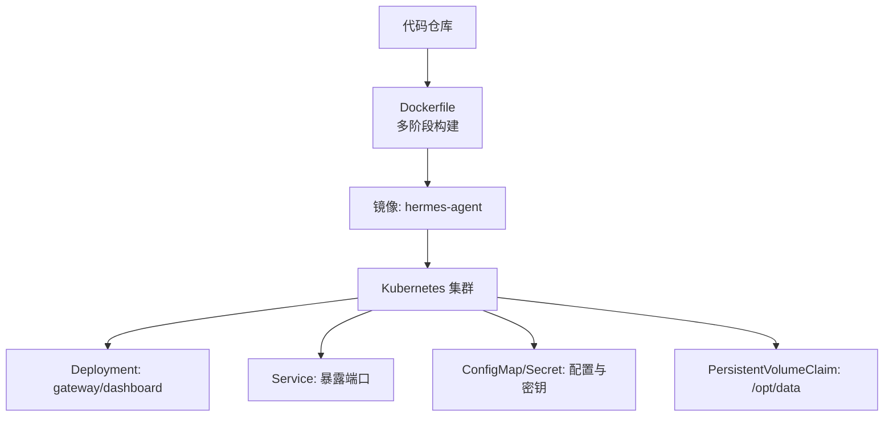
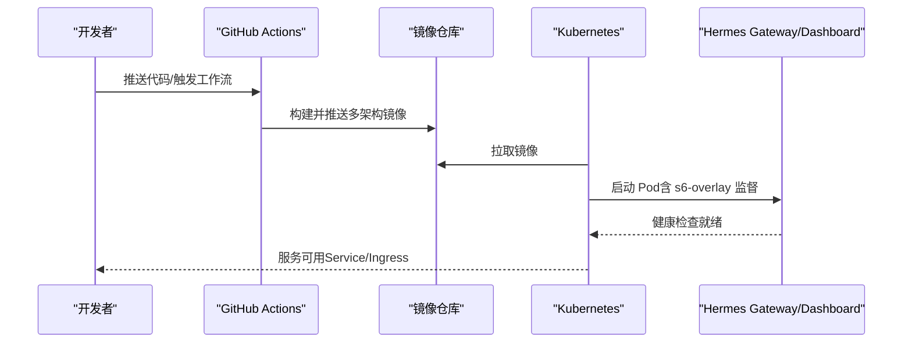
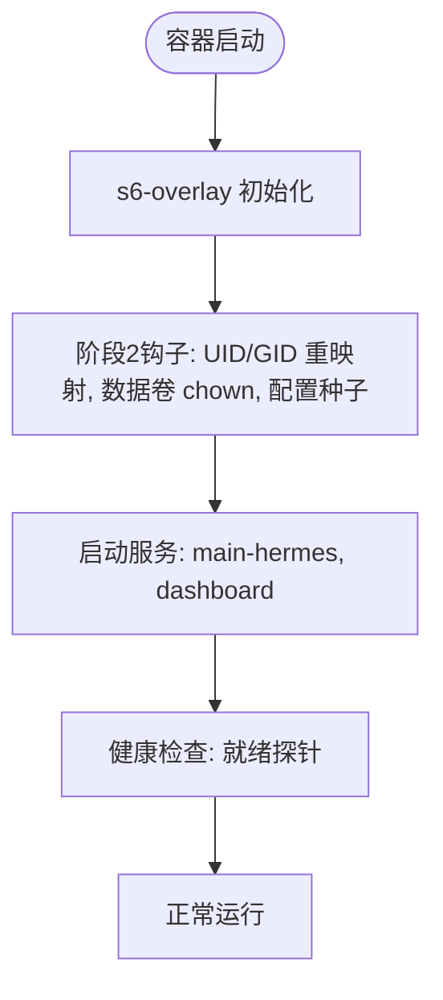
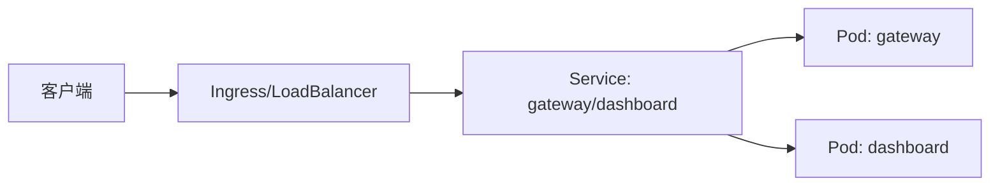
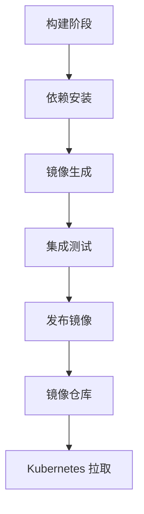

# Kubernetes 编排部署

<cite>
**本文引用的文件**
- [Dockerfile](file://Dockerfile)
- [docker-compose.yml](file://docker-compose.yml)
- [docker-compose.windows.yml](file://docker-compose.windows.yml)
- [.github/workflows/docker.yml](file://.github/workflows/docker.yml)
</cite>

## 目录
1. [简介](#简介)
2. [项目结构](#项目结构)
3. [核心组件](#核心组件)
4. [架构总览](#架构总览)
5. [详细组件分析](#详细组件分析)
6. [依赖关系分析](#依赖关系分析)
7. [性能与可扩展性](#性能与可扩展性)
8. [故障排查指南](#故障排查指南)
9. [结论](#结论)
10. [附录：生产级 K8s 编排模板（Helm/Kustomize）](#附录helmkustomize)

## 简介
本文件面向在 Kubernetes 上编排部署 Hermes Agent 的生产实践，基于仓库中提供的容器镜像构建流程、Compose 示例以及 CI/CD 流水线，给出使用 Helm Charts 或 Kustomize 进行应用编排的完整方案。内容覆盖 Deployment、Service、ConfigMap、Secret、持久化存储、水平扩展、负载均衡策略、健康检查、服务网格集成（Istio/Linkerd）、滚动更新与回滚、蓝绿部署、资源配额、节点亲和性与 Pod 反亲和性等生产级运维最佳实践。

## 项目结构
仓库提供了多阶段 Docker 构建、CI/CD 发布与本地 Compose 运行方式，这些是构建 Kubernetes 编排的基础：
- 容器镜像：通过多阶段构建生成可执行镜像，内置 s6-overlay 进程管理、Python/Node 依赖与前端产物，暴露 /opt/data 数据卷用于持久化。
- 本地编排：提供 docker-compose.yml 与 Windows 专用版本，定义 gateway 与 dashboard 两个服务及环境变量、端口映射与数据卷挂载。
- CI/CD：GitHub Actions 负责多架构镜像构建、测试与发布，并生成多架构清单。

**图示来源**
- [Dockerfile:1-458](file://Dockerfile#L1-L458)
- [docker-compose.yml:1-77](file://docker-compose.yml#L1-L77)
- [docker-compose.windows.yml:1-39](file://docker-compose.windows.yml#L1-L39)
- [.github/workflows/docker.yml:1-290](file://.github/workflows/docker.yml#L1-L290)

**章节来源**
- [Dockerfile:1-458](file://Dockerfile#L1-L458)
- [docker-compose.yml:1-77](file://docker-compose.yml#L1-L77)
- [docker-compose.windows.yml:1-39](file://docker-compose.windows.yml#L1-L39)
- [.github/workflows/docker.yml:1-290](file://.github/workflows/docker.yml#L1-L290)

## 核心组件
- 镜像与运行时
  - 多阶段构建：SQLite 固定版本、Node/Python 工具链、s6-overlay 进程管理、前端产物预构建。
  - 非 root 用户运行：默认 hermes 用户，UID/GID 可通过环境变量重映射；/opt/hermes 只读，/opt/data 为持久化数据卷。
  - 入口点：ENTRYPOINT 指向调度脚本，支持 PID 1 与非 PID 1 两种模式，兼容 s6-overlay 监督树。
- 服务模型
  - gateway：主服务，命令为 gateway run；可选启用 API Server（需鉴权）。
  - dashboard：Web 控制台，默认绑定 127.0.0.1，建议通过反向代理或隧道访问。
- 配置与密钥
  - 环境变量：HERMES_UID/HERMES_GID、API_SERVER_HOST/API_SERVER_KEY、各平台网关凭据等。
  - 数据卷：/opt/data 用于会话、配置、技能同步等持久化。

**章节来源**
- [Dockerfile:54-91](file://Dockerfile#L54-L91)
- [Dockerfile:149-152](file://Dockerfile#L149-L152)
- [Dockerfile:298-313](file://Dockerfile#L298-L313)
- [Dockerfile:359-422](file://Dockerfile#L359-L422)
- [Dockerfile:424-457](file://Dockerfile#L424-L457)
- [docker-compose.yml:29-77](file://docker-compose.yml#L29-L77)
- [docker-compose.windows.yml:12-39](file://docker-compose.windows.yml#L12-L39)

## 架构总览
下图展示从 CI/CD 到 Kubernetes 的端到端流程：构建多架构镜像、推送至镜像仓库，再由 K8s 控制器拉取并调度 Pod，通过 Service 暴露服务，使用 ConfigMap/Secret 注入配置与密钥，并通过 PVC 持久化数据。

**图示来源**
- [.github/workflows/docker.yml:30-134](file://.github/workflows/docker.yml#L30-L134)
- [.github/workflows/docker.yml:139-290](file://.github/workflows/docker.yml#L139-L290)
- [Dockerfile:424-457](file://Dockerfile#L424-L457)

## 详细组件分析

### 容器镜像与进程模型
- 多阶段构建确保最终镜像最小化且可重复：
  - SQLite 固定版本以避免已知漏洞。
  - Node/Python 依赖与前端产物在构建期安装与编译。
  - s6-overlay 作为 PID 1 进程管理器，负责主进程、dashboard 与 per-profile gateway 的生命周期。
- 运行时安全与权限：
  - 非 root 用户 hermes 运行服务；/opt/hermes 只读，/opt/data 持久化。
  - 入口点兼容不同调度器（PID 1 或非 PID 1），保证 s6-overlay 监督树正确建立。

**图示来源**
- [Dockerfile:93-135](file://Dockerfile#L93-L135)
- [Dockerfile:336-357](file://Dockerfile#L336-L357)
- [Dockerfile:424-457](file://Dockerfile#L424-L457)

**章节来源**
- [Dockerfile:1-91](file://Dockerfile#L1-L91)
- [Dockerfile:93-135](file://Dockerfile#L93-L135)
- [Dockerfile:336-357](file://Dockerfile#L336-L357)
- [Dockerfile:424-457](file://Dockerfile#L424-L457)

### 服务与网络
- gateway：
  - 默认不暴露 API Server；如需外网访问，需设置 API_SERVER_HOST 与 API_SERVER_KEY。
  - 支持多平台网关（Teams、Google Chat 等）通过环境变量启用。
- dashboard：
  - 默认绑定 127.0.0.1，建议使用 SSH 隧道或反向代理暴露。
  - Windows 版本通过端口映射暴露 9119。

**图示来源**
- [docker-compose.yml:29-77](file://docker-compose.yml#L29-L77)
- [docker-compose.windows.yml:12-39](file://docker-compose.windows.yml#L12-L39)

**章节来源**
- [docker-compose.yml:29-77](file://docker-compose.yml#L29-L77)
- [docker-compose.windows.yml:12-39](file://docker-compose.windows.yml#L12-L39)

### 配置与密钥管理
- ConfigMap：
  - 将非敏感配置（如网关开关、日志级别、外部服务地址）以键值形式注入环境变量或挂载为文件。
- Secret：
  - 将敏感信息（API 密钥、OAuth 凭据、服务账号 JSON）以 Secret 形式注入，避免明文出现在镜像或配置中。
- 环境变量：
  - HERMES_UID/HERMES_GID：重映射内部用户 ID/GID，便于与宿主机共享数据卷。
  - API_SERVER_HOST/API_SERVER_KEY：启用并保护 API Server。
  - 各平台网关凭据：TEAMS_*、GOOGLE_CHAT_* 等。

**章节来源**
- [docker-compose.yml:38-61](file://docker-compose.yml#L38-L61)
- [docker-compose.windows.yml:19-35](file://docker-compose.windows.yml#L19-L35)

### 持久化存储
- 数据卷：
  - /opt/data 为持久化目录，包含会话、配置、技能同步等数据。
  - 在 K8s 中使用 PersistentVolumeClaim 挂载到 Pod，确保数据跨重启与滚动更新保留。
- 存储类选择：
  - 根据云厂商或集群存储类（StorageClass）选择合适的 PV 类型（如 SSD、NFS、Ceph RBD）。
  - 对高 I/O 场景选择高性能存储类，并对数据库类负载考虑本地 NVMe 或高性能云盘。

**章节来源**
- [Dockerfile:378-422](file://Dockerfile#L378-L422)
- [docker-compose.yml:36-37](file://docker-compose.yml#L36-L37)
- [docker-compose.windows.yml:17-18](file://docker-compose.windows.yml#L17-L18)

### 水平扩展与负载均衡
- 水平扩展：
  - 通过 Deployment replicas 控制 gateway 实例数量；无状态请求可水平扩展。
  - 注意会话状态：若涉及本地会话存储，需结合外部存储或会话粘性。
- 负载均衡策略：
  - Service 使用 ClusterIP + Ingress/LoadBalancer 暴露。
  - 对于需要会话粘性的场景，可使用 SessionAffinity 或基于 Cookie 的路由。

**章节来源**
- [docker-compose.yml:29-77](file://docker-compose.yml#L29-L77)

### 健康检查
- 就绪探针：
  - 针对 gateway 与 dashboard 实现 HTTP/TCP 就绪探针，确保流量仅在服务就绪时进入。
- 存活探针：
  - 定期检测进程是否存活，异常时自动重启。

**章节来源**
- [Dockerfile:424-457](file://Dockerfile#L424-L457)

### 服务网格集成（Istio/Linkerd）
- Istio：
  - 通过 Sidecar 注入实现 mTLS、流量治理、遥测与熔断。
  - 使用 VirtualService 与 DestinationRule 配置路由规则与重试策略。
- Linkerd：
  - 轻量级服务网格，自动注入 Sidecar，提供基础的可观测性与可靠性特性。
- 注意事项：
  - 确保 readiness/liveness 探针与网格探针兼容。
  - 对 gRPC/WebSocket 等协议进行适当配置。

**章节来源**
- [docker-compose.yml:29-77](file://docker-compose.yml#L29-L77)

### 滚动更新与回滚
- 滚动更新：
  - 使用 RollingUpdate 策略，逐步替换旧 Pod，确保零停机。
  - 配置 maxUnavailable 与 maxSurge 控制更新节奏。
- 回滚机制：
  - 通过 kubectl rollout undo 快速回滚到上一版本。
  - 结合镜像标签与 Git SHA 追踪版本。

**章节来源**
- [.github/workflows/docker.yml:174-290](file://.github/workflows/docker.yml#L174-L290)

### 蓝绿部署
- 蓝绿部署：
  - 同时运行两套环境（蓝/绿），通过 Ingress/Service 切换流量。
  - 适用于需要快速切换与回滚的场景。
- 灰度发布：
  - 基于权重或用户分流的灰度发布，逐步放量新版本。

**章节来源**
- [docker-compose.yml:29-77](file://docker-compose.yml#L29-L77)

### 资源配额与限制
- 资源请求与限制：
  - 为 gateway 与 dashboard 设置 requests/limits，确保资源分配与 QoS。
- 命名空间配额：
  - 使用 ResourceQuota 限制命名空间内的 CPU、内存与对象数量。

**章节来源**
- [docker-compose.yml:29-77](file://docker-compose.yml#L29-L77)

### 节点亲和性与 Pod 反亲和性
- 节点亲和性：
  - 通过 nodeSelector 或 affinity 将 Pod 调度到特定节点（如 GPU 节点）。
- Pod 反亲和性：
  - 避免同一副本调度到同一节点，提升可用性。

**章节来源**
- [docker-compose.yml:29-77](file://docker-compose.yml#L29-L77)

## 依赖关系分析
- 构建依赖：
  - SQLite、Node、Python、s6-overlay 等依赖在构建期安装并固化到镜像。
- 运行时依赖：
  - gateway 与 dashboard 依赖 /opt/data 持久化目录与环境变量配置。
- CI/CD 依赖：
  - GitHub Actions 负责多架构构建、测试与发布，生成多架构清单。

**图示来源**
- [.github/workflows/docker.yml:30-134](file://.github/workflows/docker.yml#L30-L134)
- [.github/workflows/docker.yml:139-290](file://.github/workflows/docker.yml#L139-L290)

**章节来源**
- [.github/workflows/docker.yml:30-134](file://.github/workflows/docker.yml#L30-L134)
- [.github/workflows/docker.yml:139-290](file://.github/workflows/docker.yml#L139-L290)

## 性能与可扩展性
- 构建优化：
  - 多阶段构建减少镜像体积，层缓存加速构建。
  - 预构建前端产物与依赖，避免运行时安装。
- 运行时优化：
  - s6-overlay 提供高效进程管理。
  - 非 root 用户运行提升安全性。
- 可扩展性：
  - 水平扩展 gateway 实例，结合外部存储与会话粘性。
  - 使用 Ingress/LoadBalancer 进行流量分发。

**章节来源**
- [Dockerfile:1-91](file://Dockerfile#L1-L91)
- [Dockerfile:93-135](file://Dockerfile#L93-L135)
- [Dockerfile:359-422](file://Dockerfile#L359-L422)

## 故障排查指南
- 常见问题：
  - 权限问题：确保 /opt/data 所有权与权限正确，必要时通过 HERMES_UID/HERMES_GID 重映射。
  - 网络问题：检查 Service 与 Ingress 配置，确保端口映射正确。
  - 健康检查失败：确认就绪探针与存活探针配置合理。
- 日志与监控：
  - 使用 s6-overlay 日志输出，结合 Prometheus/Grafana 进行监控。
  - 通过 kubectl logs 查看 Pod 日志。

**章节来源**
- [docker-compose.yml:29-77](file://docker-compose.yml#L29-L77)
- [Dockerfile:424-457](file://Dockerfile#L424-L457)

## 结论
本方案基于仓库提供的容器镜像、Compose 示例与 CI/CD 流水线，给出了在 Kubernetes 上编排部署 Hermes Agent 的完整实践。通过 Helm Charts 或 Kustomize 进行配置管理，结合持久化存储、水平扩展、健康检查、服务网格集成、滚动更新与回滚、蓝绿部署、资源配额、节点亲和性与 Pod 反亲和性，可实现生产级的高可用与可维护性部署。

## 附录：生产级 K8s 编排模板（Helm/Kustomize）
以下为生产级部署的关键资源定义要点，供参考：
- Deployment：
  - 设置 replicas、strategy（RollingUpdate）、resources（requests/limits）。
  - 配置 liveness/readiness 探针。
  - 使用 nodeSelector/affinity 与 podAntiAffinity。
- Service：
  - 暴露 gateway 与 dashboard 端口，使用 ClusterIP + Ingress/LoadBalancer。
- ConfigMap：
  - 注入非敏感配置（环境变量或文件挂载）。
- Secret：
  - 注入敏感信息（API 密钥、OAuth 凭据）。
- PersistentVolumeClaim：
  - 挂载 /opt/data，选择合适 StorageClass。
- HorizontalPodAutoscaler：
  - 基于 CPU/内存或自定义指标自动扩缩容。
- NetworkPolicy：
  - 限制 Pod 间通信，增强安全性。
- Ingress：
  - 配置域名、TLS 与路由规则。

**章节来源**
- [docker-compose.yml:29-77](file://docker-compose.yml#L29-L77)
- [docker-compose.windows.yml:12-39](file://docker-compose.windows.yml#L12-L39)
- [Dockerfile:378-422](file://Dockerfile#L378-L422)