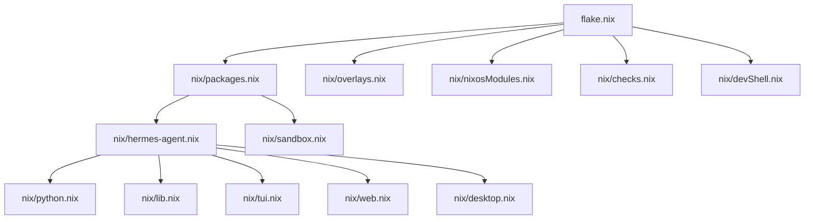
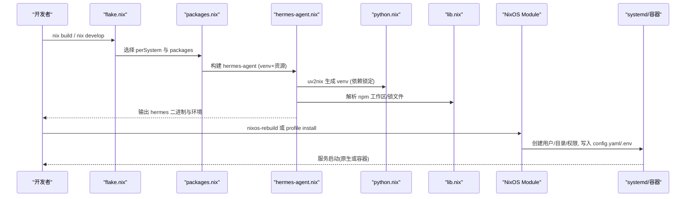
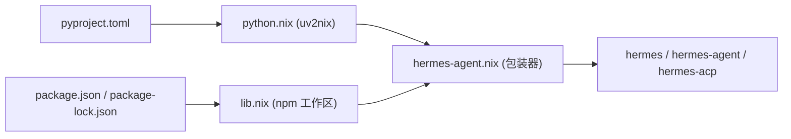

# Nix 包管理部署

<cite>
**本文引用的文件**
- [flake.nix](file://flake.nix)
- [flake.lock](file://flake.lock)
- [nix/packages.nix](file://nix/packages.nix)
- [nix/hermes-agent.nix](file://nix/hermes-agent.nix)
- [nix/python.nix](file://nix/python.nix)
- [nix/lib.nix](file://nix/lib.nix)
- [nix/devShell.nix](file://nix/devShell.nix)
- [nix/overlays.nix](file://nix/overlays.nix)
- [nix/sandbox.nix](file://nix/sandbox.nix)
- [nix/checks.nix](file://nix/checks.nix)
- [nix/nixosModules.nix](file://nix/nixosModules.nix)
- [pyproject.toml](file://pyproject.toml)
</cite>

## 目录
1. [简介](#简介)
2. [项目结构](#项目结构)
3. [核心组件](#核心组件)
4. [架构总览](#架构总览)
5. [详细组件分析](#详细组件分析)
6. [依赖关系分析](#依赖关系分析)
7. [性能与构建优化](#性能与构建优化)
8. [故障排查指南](#故障排查指南)
9. [结论](#结论)
10. [附录：开发与生产部署流程](#附录开发与生产部署流程)

## 简介
本文件面向使用 Nix Flake 进行 Hermes Agent 的构建、分发与部署的团队与个人。内容覆盖 flake.nix/flake.lock 的结构与配置、多平台支持、NixOS 模块（系统服务、容器模式、用户与权限）、开发环境（devShell、IDE 集成）、生产部署（不可变部署与回滚）、二进制缓存与构建优化策略，以及安全加固与性能调优建议。目标是提供一致的开发环境与可重复的生产部署方案。

## 项目结构
Hermes Agent 的 Nix 工程以 flake 为中心，将 Python、Node.js、TUI/Web/Desktop 产物统一纳入可复现构建体系。关键目录与职责：
- 根级 flake.nix：声明输入、目标系统与导入各子模块
- nix/packages.nix：暴露默认包、最小包、桌面/TUI/Web、沙箱等
- nix/hermes-agent.nix：Python venv 包装器、资源链接、运行时环境变量注入
- nix/python.nix：基于 uv2nix 的虚拟环境构建，含可编辑工作区与平台适配
- nix/lib.nix：共享工具（npm workspace、源过滤、锁文件更新脚本）
- nix/devShell.nix：开发 shell，聚合 npm 工作区钩子与测试工具
- nix/overlays.nix：对外暴露 pkgs.hermes-agent 别名
- nix/sandbox.nix：Electron 运行所需库与沙箱入口
- nix/checks.nix：构建期校验（Linux 为主），验证二进制、i18n、MCP、TUI 等
- nix/nixosModules.nix：NixOS 模块，定义服务、容器模式、用户/组、激活脚本等
- pyproject.toml：Python 项目元数据与依赖声明（含可选依赖分组）

图表来源
- [flake.nix:31-47](file://flake.nix#L31-L47)
- [nix/packages.nix:1-76](file://nix/packages.nix#L1-L76)
- [nix/hermes-agent.nix:1-271](file://nix/hermes-agent.nix#L1-L271)
- [nix/python.nix:1-158](file://nix/python.nix#L1-L158)
- [nix/lib.nix:1-352](file://nix/lib.nix#L1-L352)

章节来源
- [flake.nix:1-49](file://flake.nix#L1-L49)
- [nix/packages.nix:1-76](file://nix/packages.nix#L1-L76)

## 核心组件
- 包导出与多架构
  - perSystem 指定 x86_64-linux、aarch64-linux、aarch64-darwin，实现跨平台构建
  - default 包为 full 变体，包含大量可选依赖；minimal 用于精简安装；messaging 预装消息通道依赖
- Python 虚拟环境
  - 通过 uv2nix + pyproject-nix 生成密封 venv，依赖锁定在 uv.lock/pyproject.toml
  - 支持 extraDependencyGroups 与 extraPythonPackages 扩展
- Node.js 与前端产物
  - 统一 Node 版本与 npm 工作区解析，TUI/Web 产物作为资源链接进最终包
- NixOS 模块
  - 原生 systemd 服务与 OCI 容器两种模式
  - 自动生成 config.yaml、.env、权限与目录结构
  - MCP 服务器配置合并、工具链自动供应（容器内）
- 开发环境
  - devShell 聚合 npm 工作区钩子、Playwright、GUI 测试工具
  - 可编辑 Python 工作区，便于本地调试
- 构建期检查
  - 验证二进制、i18n、MCP、TUI、Node 版本、受管模式守卫等

章节来源
- [flake.nix:31-47](file://flake.nix#L31-L47)
- [nix/packages.nix:1-76](file://nix/packages.nix#L1-L76)
- [nix/hermes-agent.nix:1-271](file://nix/hermes-agent.nix#L1-L271)
- [nix/python.nix:1-158](file://nix/python.nix#L1-L158)
- [nix/devShell.nix:1-65](file://nix/devShell.nix#L1-L65)
- [nix/checks.nix:1-583](file://nix/checks.nix#L1-L583)

## 架构总览
下图展示从 flake 到最终可执行与服务的整体构建与部署路径。

图表来源
- [flake.nix:31-47](file://flake.nix#L31-L47)
- [nix/packages.nix:1-76](file://nix/packages.nix#L1-L76)
- [nix/hermes-agent.nix:1-271](file://nix/hermes-agent.nix#L1-L271)
- [nix/python.nix:1-158](file://nix/python.nix#L1-L158)
- [nix/lib.nix:1-352](file://nix/lib.nix#L1-L352)
- [nix/nixosModules.nix:1-800](file://nix/nixosModules.nix#L1-L800)

## 详细组件分析

### flake.nix 与 flake.lock
- flake.nix
  - 声明输入：nixpkgs、flake-parts、pyproject-nix、uv2nix、pyproject-build-systems、npm-lockfile-fix
  - perSystem 指定多架构：x86_64-linux、aarch64-linux、aarch64-darwin
  - imports 引入 packages、overlays、NixOS 模块、checks、devShell
- flake.lock
  - 锁定所有输入的版本与哈希，确保可复现构建
  - 根节点汇总所有输入，供 CI/生产环境严格复用

章节来源
- [flake.nix:1-49](file://flake.nix#L1-L49)
- [flake.lock:1-142](file://flake.lock#L1-L142)

### packages.nix：包导出与变体
- minimal：基础 venv，不含可选依赖
- full：在 minimal 基础上追加大量可选依赖组（如 anthropic、voice、matrix 等）
- messaging：预装消息通道依赖，避免只读 store 下首次运行无法安装
- tui/web/desktop：分别构建 TUI、Web、桌面应用并链接至主包
- update-npm-lockfile：提供一键更新 npm 锁文件的工具

章节来源
- [nix/packages.nix:1-76](file://nix/packages.nix#L1-L76)

### hermes-agent.nix：Python 包装器与资源
- 使用 makeWrapper 生成 hermes、hermes-agent、hermes-acp 三个入口
- 设置运行时 PATH（ripgrep、git、ffmpeg 等）
- 注入环境变量：HERMES_BUNDLED_SKILLS、HERMES_OPTIONAL_SKILLS、HERMES_BUNDLED_PLUGINS、HERMES_BUNDLED_LOCALES、HERMES_OPTIONAL_MCPS、HERMES_WEB_DIST、HERMES_TUI_DIR、HERMES_PYTHON、HERMES_NODE、HERMES_REVISION（仅纯净构建）
- 可选 PYTHONPATH 注入 extraPythonPackages，并在构建时检测与核心 venv 的包冲突
- 通过 symlinkJoin 将 TUI/Web 产物与技能/插件/本地化资源链接进 store，减少体积与重建开销

章节来源
- [nix/hermes-agent.nix:1-271](file://nix/hermes-agent.nix#L1-L271)

### python.nix：uv2nix 虚拟环境
- 基于 uv2nix 加载工作区，生成密封 venv
- 支持 editableVenv 指向真实源码，便于开发调试
- 针对 aarch64-darwin 提供预构建替代（numpy、onnxruntime 等）以避免 wheel 缺失问题
- 对部分遗留 setup.py 包添加 setuptools 构建依赖
- 通过 HERMES_NIX_BUILD 标记限制非密封环境下的构建行为

章节来源
- [nix/python.nix:1-158](file://nix/python.nix#L1-L158)

### lib.nix：共享工具与源过滤
- 统一 Node 版本（nodejs_26 + npm 12）与 node-gyp 补丁
- 基于根 package.json 的 workspaces 字段发现 JS 工作区成员
- pythonSrc 过滤掉 JS/TS/docs/docker/tests/nix 等非 Python 构建相关目录，降低无效重建
- npmDeps/npmWorkspaceFiles 提供最小化的 npm 依赖集
- updateNpmLockfile：清理缓存、重新安装、修复锁文件并验证构建
- mkNpmDevShellHook：一次性为所有工作区包打戳，按需更新 lockfile 与安装依赖

章节来源
- [nix/lib.nix:1-352](file://nix/lib.nix#L1-L352)

### devShell.nix：开发环境
- 提供 hermes CLI、sandbox、uv、cage、ghostty、grim 等开发工具
- 自动收集所有工作区的 packageJsonPath，调用 mkNpmDevShellHook 统一处理
- 设置 HERMES_PYTHON_SRC_ROOT、VIRTUAL_ENV，使 uv run --active 复用 Nix 提供的 Python 环境
- 强制 playwright-test 使用 Nix 提供的二进制，保证测试一致性

章节来源
- [nix/devShell.nix:1-65](file://nix/devShell.nix#L1-L65)

### overlays.nix：对外暴露别名
- 将 inputs.self.packages 的默认包映射为 pkgs.hermes-agent，保证外部 NixOS 配置引用的一致性

章节来源
- [nix/overlays.nix:1-15](file://nix/overlays.nix#L1-L15)

### sandbox.nix：Electron 运行环境
- 提供 Electron 所需的图形/音频/字体等系统库
- 封装 bubblewrap 沙箱入口，设置 CA 证书、动态链接器、Node 目录、LD_LIBRARY_PATH 等

章节来源
- [nix/sandbox.nix:1-125](file://nix/sandbox.nix#L1-L125)

### checks.nix：构建期校验
- 交叉评估与构建：确保多平台均可评估与构建
- 二进制与 CLI：验证 hermes、hermes-agent、hermes-acp 存在且可执行
- i18n/MCP/TUI：验证本地化、MCP 目录、TUI 编译产物与入口变量
- Node 版本：要求 Node >= 26
- 受管模式守卫：禁止在 managed 模式下修改配置
- 额外依赖注入：验证 extraPythonPackages 与 extraDependencyGroups 生效
- 配置合并：7 种场景验证 Nix 与用户配置的深度合并与幂等性

章节来源
- [nix/checks.nix:1-583](file://nix/checks.nix#L1-L583)

### nixosModules.nix：NixOS 模块与服务
- 两种运行模式
  - 原生 systemd 服务：直接运行 hermes gateway
  - OCI 容器模式：以 Ubuntu 为基础镜像，首启自动供应 apt/nodejs/npm/uv/Python venv，持久化 writable layer
- 用户与权限
  - 自动创建 hermes 用户/组，设置 stateDir、workspace 目录权限（setgid + 组写）
  - 可选 addToSystemPackages 将 CLI 加入系统 PATH，并导出 HERMES_HOME 以便交互式会话共享状态
- 配置与密钥
  - settings 深度合并为 config.yaml；environmentFiles 合并为 .env（仅非密钥环境变量由 environment 注入）
  - authFile 仅在首次部署时拷贝，避免覆盖已有认证
  - documents 支持将 SOUL.md、USER.md 等文档安装到工作目录
- MCP 服务器
  - 支持 stdio 与 HTTP/StreamableHTTP 传输，支持 OAuth 鉴权、超时、工具白名单/黑名单、采样参数
- 容器模式细节
  - 容器入口脚本负责创建用户/组、安装 sudo/curl/ca-certificates、NodeSource Node 22、uv、Python 3.12 venv
  - 通过 identity hash 控制容器重建条件（image/volumes/options 变化才重建）
  - hostUsers 可将 ~/.hermes 软链到服务 stateDir，实现主机 CLI 与容器服务共享状态
- 激活脚本
  - 创建目录、设置权限、合并配置、写入 .managed 标记、写入容器模式元数据
  - 根据是否启用容器模式决定是否删除/创建主机用户软链桥

章节来源
- [nix/nixosModules.nix:1-800](file://nix/nixosModules.nix#L1-L800)

## 依赖关系分析
- Python 依赖
  - 核心依赖与可选依赖分组在 pyproject.toml 中声明，通过 uv2nix 生成密封 venv
  - 可选依赖组包括 anthropic、exa、firecrawl、parallel-web、fal、edge-tts、modal、daytona、vercel、hindsight、messaging、cron、slack、matrix、wecom、cli、tts-premium、voice、wake 等
- Node.js 依赖
  - 单一 root package-lock.json，workspaces 统一管理
  - lib.nix 提供 npm 工作区发现与锁文件更新工具
- 系统依赖
  - Linux 图形/音频库（sandbox.nix）
  - Node 26 + npm 12（lib.nix）
  - ripgrep、git、openssh、ffmpeg、tirith（hermes-agent.nix）

图表来源
- [pyproject.toml:1-200](file://pyproject.toml#L1-L200)
- [nix/python.nix:1-158](file://nix/python.nix#L1-L158)
- [nix/lib.nix:1-352](file://nix/lib.nix#L1-L352)
- [nix/hermes-agent.nix:1-271](file://nix/hermes-agent.nix#L1-L271)

章节来源
- [pyproject.toml:1-200](file://pyproject.toml#L1-L200)
- [nix/python.nix:1-158](file://nix/python.nix#L1-L158)
- [nix/lib.nix:1-352](file://nix/lib.nix#L1-L352)
- [nix/hermes-agent.nix:1-271](file://nix/hermes-agent.nix#L1-L271)

## 性能与构建优化
- 源过滤与增量构建
  - pythonSrc 排除 JS/TS/docs/docker/tests/nix 等无关目录，减少 Python venv 重建范围
  - npmDeps 仅包含工作区必要文件，降低 npm 依赖推导成本
- 锁文件与缓存
  - 使用 flake.lock 锁定所有输入；update-npm-lockfile 工具集中更新 npm 锁文件并验证构建
  - 推荐配置 Nix 二进制缓存（见下文“二进制缓存”）以加速 CI 与生产构建
- 多架构与轮子
  - aarch64-darwin 下对部分包采用预构建替代，避免无 wheel 导致的构建失败
- 构建期检查
  - checks.nix 在 Linux 上验证二进制、i18n、MCP、TUI、Node 版本与受管模式守卫，提前发现问题
- 内存与并发
  - 建议在 CI 中合理设置 Nix 并行度与缓存命中率，避免全量构建
  - 对于大型前端构建，可利用 Nix 缓存与分层构建减少重复工作

[本节为通用指导，不直接分析具体文件]

## 故障排查指南
- 常见问题定位
  - 二进制缺失或不可执行：运行 nix build 后检查输出 bin 目录；参考 checks.package-contents
  - i18n 显示原始键：确认 HERMES_BUNDLED_LOCALES 已设置；参考 checks.bundled-locales
  - MCP 目录未识别：确认 optional-mcps 已链接且 HERMES_OPTIONAL_MCPS 正确；参考 checks.bundled-mcps
  - Node 版本过低：检查 wrapper 中的 HERMES_NODE；参考 checks.hermes-node
  - 受管模式阻止修改：确认未在 HERMES_MANAGED=true 环境下执行写操作；参考 checks.managed-guard
  - extraPythonPackages 未生效：检查 wrapper 是否注入 PYTHONPATH；参考 checks.extra-python-packages
  - 配置合并异常：运行 checks.config-roundtrip 验证 Nix 与用户配置合并逻辑
- 容器模式问题
  - 首启工具供应失败：检查容器日志，确认 apt/curl/uv 可用；必要时调整 base image
  - 权限问题：确认 stateDir 与 .hermes 目录权限为 setgid + 组写；检查 tmpfiles 规则
  - 主机 CLI 无法进入容器：确认 addToSystemPackages 或 PATH 中包含 hermes；参考警告信息

章节来源
- [nix/checks.nix:1-583](file://nix/checks.nix#L1-L583)
- [nix/nixosModules.nix:1-800](file://nix/nixosModules.nix#L1-L800)

## 结论
本项目通过 flake 将 Python、Node.js、TUI/Web/Desktop 与 NixOS 模块统一纳入可复现构建与部署体系。借助 uv2nix、npm 工作区与严格的锁文件机制，实现了跨平台、可审计、可回滚的交付能力。NixOS 模块提供了强大的声明式配置、容器模式与自动化激活脚本，满足生产环境的稳定性与安全性需求。配合完善的构建期检查与开发环境工具，团队可获得一致的开发体验与可靠的部署流水线。

[本节为总结性内容，不直接分析具体文件]

## 附录：开发与生产部署流程

### 开发环境设置
- 进入开发 shell
  - 使用 nix develop 获取完整开发环境，自动安装 npm 依赖、设置 Python 工作区与测试工具
- IDE 集成
  - 使用 Nix 提供的 Python 解释器与 Node 版本，确保 lint/test/build 一致
  - 利用 devShell 中的 cage/ghostty/grim 进行 GUI 测试与截图取证
- 快速迭代
  - 使用 uv run --active --no-sync 复用 Nix 提供的 Python 环境，避免创建空 .venv
  - 修改 JS/TS 不会触发 Python venv 重建；修改 Python 不会触发前端重建

章节来源
- [nix/devShell.nix:1-65](file://nix/devShell.nix#L1-L65)
- [nix/lib.nix:102-183](file://nix/lib.nix#L102-L183)

### 生产环境部署（不可变部署与回滚）
- 不可变部署
  - 使用 nixos-rebuild switch 或 nix profile install 安装固定版本的 hermes-agent
  - 配置通过 NixOS 模块声明，config.yaml 与 .env 由激活脚本生成/合并，避免手工修改
- 回滚机制
  - NixOS 切换历史保留旧代次，出现问题可快速回滚到上一代
  - 容器模式下，identity hash 仅当 image/volumes/options 变化时重建容器，环境变量通过 .env 热更新无需重建
- 服务管理
  - 原生模式：systemd 管理服务生命周期与重启策略
  - 容器模式：docker/podman 管理容器生命周期，首启自动供应工具链

章节来源
- [nix/nixosModules.nix:1-800](file://nix/nixosModules.nix#L1-L800)

### 二进制缓存配置（建议）
- 在 CI 与生产机器启用 Nix 二进制缓存（如 cachix），提升构建速度
- 将 flake.lock 提交至仓库，确保缓存命中与可复现性
- 针对不同架构（x86_64-linux、aarch64-linux、aarch64-darwin）分别缓存

[本节为通用指导，不直接分析具体文件]

### 安全加固与性能调优（建议）
- 安全加固
  - 使用最小化包（minimal）或按需启用可选依赖组，减少攻击面
  - 容器模式优先，隔离运行环境；限制容器 capabilities 与网络访问
  - 定期更新 flake.lock 与依赖，关注 CVE 公告
- 性能调优
  - 合理设置 Nix 并行构建与缓存；避免全量构建
  - 使用 checks 提前发现问题，减少线上故障
  - 监控内存使用，结合系统资源限制（cgroup/systemd）保障稳定

[本节为通用指导，不直接分析具体文件]