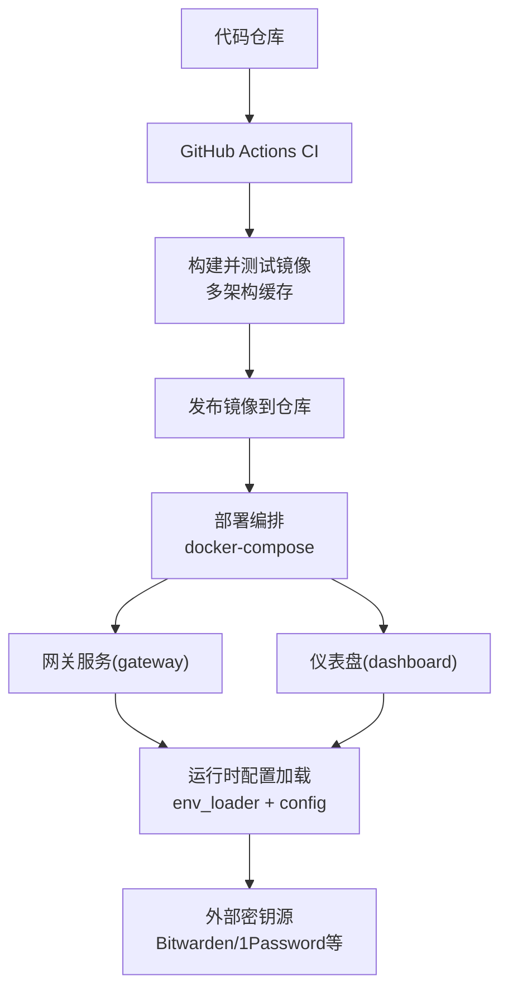
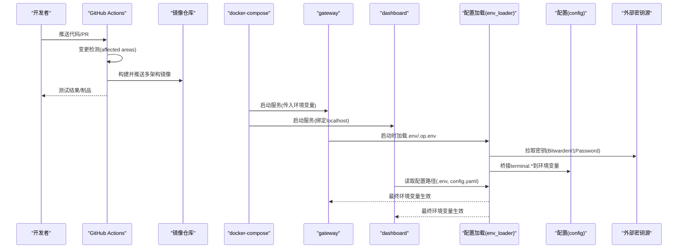
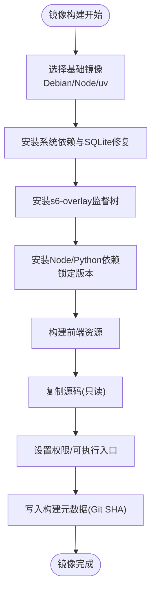
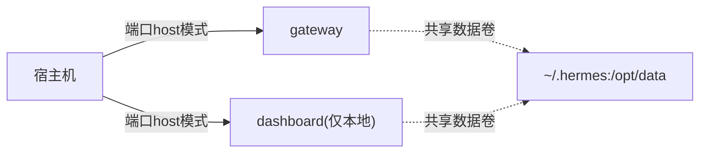
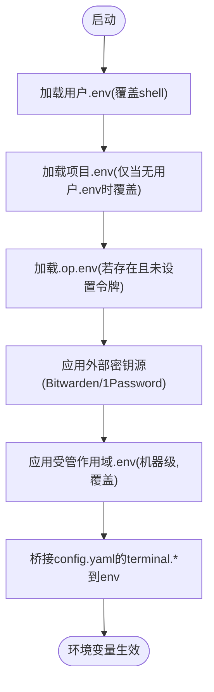
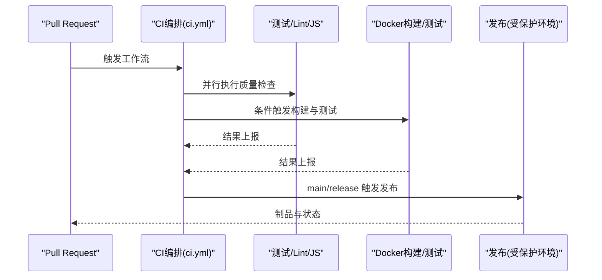
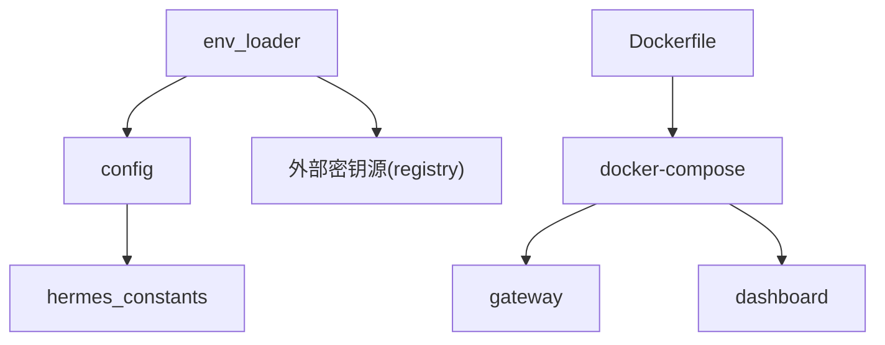

# 多环境部署策略

<cite>
**本文引用的文件**
- [Dockerfile](file://Dockerfile)
- [docker-compose.yml](file://docker-compose.yml)
- [hermes_constants.py](file://hermes_constants.py)
- [hermes_cli/config.py](file://hermes_cli/config.py)
- [hermes_cli/env_loader.py](file://hermes_cli/env_loader.py)
- [.github/workflows/ci.yml](file://.github/workflows/ci.yml)
- [.github/workflows/docker.yml](file://.github/workflows/docker.yml)
</cite>

## 目录
1. [简介](#简介)
2. [项目结构](#项目结构)
3. [核心组件](#核心组件)
4. [架构总览](#架构总览)
5. [详细组件分析](#详细组件分析)
6. [依赖关系分析](#依赖关系分析)
7. [性能考量](#性能考量)
8. [故障排查指南](#故障排查指南)
9. [结论](#结论)
10. [附录](#附录)

## 简介
本文件面向 DevOps 团队，提供 Hermes Agent 的多环境（开发、测试、预生产、生产）部署策略与最佳实践。内容涵盖：
- 差异化配置管理：环境变量、敏感信息、环境特定配置
- 配置模板化、参数注入与动态更新机制
- CI/CD 流水线集成：自动化测试、构建验证、发布管道
- 环境隔离：网络、数据、资源隔离
- 配置校验、健康检查与故障恢复
- 标准化流程与落地建议

## 项目结构
Hermes Agent 的部署以容器为核心，通过 Dockerfile 定义镜像层，docker-compose 编排服务，CLI 与运行时负责配置加载与环境变量解析。CI/CD 使用 GitHub Actions 实现 PR 检测、并行子工作流、多架构镜像构建与合并推送。

图表来源
- [.github/workflows/ci.yml:1-165](file://.github/workflows/ci.yml#L1-L165)
- [.github/workflows/docker.yml:30-134](file://.github/workflows/docker.yml#L30-L134)
- [docker-compose.yml:29-77](file://docker-compose.yml#L29-L77)
- [hermes_cli/env_loader.py:462-529](file://hermes_cli/env_loader.py#L462-L529)
- [hermes_cli/config.py:694-700](file://hermes_cli/config.py#L694-L700)

章节来源
- [.github/workflows/ci.yml:1-165](file://.github/workflows/ci.yml#L1-L165)
- [.github/workflows/docker.yml:30-134](file://.github/workflows/docker.yml#L30-L134)
- [docker-compose.yml:29-77](file://docker-compose.yml#L29-L77)

## 核心组件
- 容器镜像与启动链：Dockerfile 定义基础镜像、依赖安装、s6-overlay 监督树、入口分发器；compose 定义 gateway 与 dashboard 服务及环境变量挂载。
- 配置加载与优先级：env_loader 统一加载 .env/.op.env、外部密钥源、受管作用域 .env，并在最后桥接 terminal.* 配置到环境变量；config 提供路径解析、安装方式检测、安全写回限制。
- 运行期常量与路径：hermes_constants 提供 HERMES_HOME 解析、平台默认路径、Node 工具链自愈等。
- CI/CD：ci.yml 作为编排入口，按变更检测触发子工作流；docker.yml 执行多架构构建、测试、发布与清单合并。

章节来源
- [Dockerfile:52-135](file://Dockerfile#L52-L135)
- [Dockerfile:336-457](file://Dockerfile#L336-L457)
- [docker-compose.yml:29-77](file://docker-compose.yml#L29-L77)
- [hermes_cli/env_loader.py:462-529](file://hermes_cli/env_loader.py#L462-L529)
- [hermes_cli/config.py:410-509](file://hermes_cli/config.py#L410-L509)
- [hermes_constants.py:62-139](file://hermes_constants.py#L62-L139)

## 架构总览
下图展示从代码提交到服务运行的端到端流程，包括配置加载顺序与环境隔离点。

图表来源
- [.github/workflows/ci.yml:39-165](file://.github/workflows/ci.yml#L39-L165)
- [.github/workflows/docker.yml:30-134](file://.github/workflows/docker.yml#L30-L134)
- [docker-compose.yml:29-77](file://docker-compose.yml#L29-L77)
- [hermes_cli/env_loader.py:462-529](file://hermes_cli/env_loader.py#L462-L529)
- [hermes_cli/config.py:694-700](file://hermes_cli/config.py#L694-L700)

## 详细组件分析

### 容器镜像与启动链（Dockerfile）
- 基础环境与依赖：固定 Python/Node 版本，安装系统库，替换 SQLite 共享库修复已知问题，安装 s6-overlay 用于进程监督。
- 构建优化：分层缓存（manifest-only 拷贝）、Playwright 浏览器安装重试、前端独立构建、Python 依赖冻结安装。
- 权限与安全：非 root 用户 hermes，只读代码层，可写数据卷 /opt/data；入口分发器兼容 PID 1 与非 PID 1 场景。
- 元数据：构建时写入 Git SHA，便于运行时识别镜像来源。

图表来源
- [Dockerfile:52-135](file://Dockerfile#L52-L135)
- [Dockerfile:171-276](file://Dockerfile#L171-L276)
- [Dockerfile:278-334](file://Dockerfile#L278-L334)
- [Dockerfile:336-457](file://Dockerfile#L336-L457)

章节来源
- [Dockerfile:52-135](file://Dockerfile#L52-L135)
- [Dockerfile:171-276](file://Dockerfile#L171-L276)
- [Dockerfile:278-334](file://Dockerfile#L278-L334)
- [Dockerfile:336-457](file://Dockerfile#L336-L457)

### 服务编排与网络隔离（docker-compose）
- 服务划分：gateway 与 dashboard 两个服务，均基于同一镜像。
- 网络隔离：dashboard 默认仅监听 127.0.0.1，避免暴露 API Key；如需远程访问应通过 SSH 隧道或反向代理。
- 数据持久化：将 ~/.hermes 映射到容器 /opt/data，保证会话、配置、记忆跨重启保留。
- 环境变量：支持 Teams、Google Chat 等通道开关与凭据注入；API 服务器需显式启用并设置鉴权密钥。

图表来源
- [docker-compose.yml:29-77](file://docker-compose.yml#L29-L77)

章节来源
- [docker-compose.yml:29-77](file://docker-compose.yml#L29-L77)

### 配置加载与优先级（env_loader + config）
- 加载顺序与覆盖：
  - 用户 .env（HERMES_HOME/.env）优先覆盖 shell 导出值
  - 可选项目 .env 作为开发回退
  - .op.env 在 .env 之后加载，用于 1Password 服务账户令牌
  - 外部密钥源（Bitwarden/1Password 等）在 dotenv 之后应用，失败不阻塞启动
  - 受管作用域 .env（机器级）最后以 override=True 应用，覆盖用户与环境变量
  - 最后桥接 config.yaml 的 terminal.* 键到环境变量，确保“文档化配置”为权威来源
- 安全与清洗：
  - 对凭据类环境变量进行 ASCII 清洗，提示非 ASCII 字符来源（PDF/富文本粘贴）
  - 禁止通过 Dashboard 写回危险的环境变量名（如 LD_PRELOAD、PATH、HERMES_HOME 等）
- 路径与安装方式：
  - 安装方式检测（docker/nix/git/unknown），影响更新命令与建议
  - 配置路径：config.yaml 与 .env 位于 HERMES_HOME

图表来源
- [hermes_cli/env_loader.py:462-529](file://hermes_cli/env_loader.py#L462-L529)
- [hermes_cli/env_loader.py:559-588](file://hermes_cli/env_loader.py#L559-L588)
- [hermes_cli/config.py:198-233](file://hermes_cli/config.py#L198-L233)
- [hermes_cli/config.py:694-700](file://hermes_cli/config.py#L694-L700)

章节来源
- [hermes_cli/env_loader.py:462-529](file://hermes_cli/env_loader.py#L462-L529)
- [hermes_cli/env_loader.py:559-588](file://hermes_cli/env_loader.py#L559-L588)
- [hermes_cli/config.py:198-233](file://hermes_cli/config.py#L198-L233)
- [hermes_cli/config.py:694-700](file://hermes_cli/config.py#L694-L700)

### 环境变量与敏感信息管理
- 敏感信息位置：
  - 用户凭据：~/.hermes/.env 或外部密钥源（Bitwarden/1Password）
  - 服务账户令牌：<home>/.op.env（Git 忽略）
  - 机器级受管配置：managed scope 下的 .env（最后覆盖）
- 安全策略：
  - 凭据 ASCII 清洗与警告
  - 写回黑名单保护（防止通过 Dashboard 修改 PATH、编辑器、加载器等）
  - 外部密钥源失败不阻塞启动，但输出诊断与修复建议
- 环境特定配置：
  - 通过 docker-compose 环境变量注入通道凭据（Teams/Google Chat）
  - 通过 config.yaml 的 terminal.* 控制终端后端（local/ssh/docker 等）

章节来源
- [hermes_cli/env_loader.py:298-352](file://hermes_cli/env_loader.py#L298-L352)
- [hermes_cli/env_loader.py:591-687](file://hermes_cli/env_loader.py#L591-L687)
- [hermes_cli/config.py:198-233](file://hermes_cli/config.py#L198-L233)
- [docker-compose.yml:38-61](file://docker-compose.yml#L38-L61)

### 配置模板化与参数注入
- 模板化：
  - 使用环境变量占位符 ${VAR} 在配置中引用（由配置加载器展开）
  - 不同环境通过 compose 或系统服务注入不同的 .env 与 config 片段
- 参数注入：
  - 启动时 env_loader 将 terminal.* 桥接到环境变量，确保 CLI/工具一致行为
  - 外部密钥源注入后再次进行 ASCII 清洗，保证 HTTP 头安全
- 动态更新：
  - 配置缓存基于 mtime/size 失效，编辑后下次加载自动刷新
  - 受管作用域 .env 最后覆盖，适合运维侧集中管控

章节来源
- [hermes_cli/config.py:235-260](file://hermes_cli/config.py#L235-L260)
- [hermes_cli/env_loader.py:532-557](file://hermes_cli/env_loader.py#L532-L557)
- [hermes_cli/env_loader.py:559-588](file://hermes_cli/env_loader.py#L559-L588)

### 动态配置更新机制
- 热重载：
  - 长生命周期进程（gateway）多次调用 load_hermes_dotenv()，通过缓存键（mtime/size）感知文件变化
  - 外部密钥源每进程一次应用，可通过 reset_secret_source_cache() 强制刷新（测试/运维场景）
- 回退与容错：
  - 外部密钥源失败不阻塞启动，输出错误与修复提示
  - 配置文件解析失败会备份损坏文件并降级到默认配置，同时告警

章节来源
- [hermes_cli/env_loader.py:241-253](file://hermes_cli/env_loader.py#L241-L253)
- [hermes_cli/env_loader.py:591-687](file://hermes_cli/env_loader.py#L591-L687)
- [hermes_cli/config.py:45-156](file://hermes_cli/config.py#L45-L156)

### CI/CD 流水线集成
- 编排与检测：
  - ci.yml 作为编排入口，先执行变更检测，再并行触发测试、Lint、JS 检查、安装器测试、文档站点检查、供应链扫描等
  - 所有结果汇总至 all-checks-pass 门控，分支保护只需要求单一检查
- 构建与发布：
  - docker.yml 在多架构上构建镜像，本地运行集成测试，成功后分架构推送 digest，最后合并为多架构清单并打标签
  - 仅在可信分支（main/release）触发发布作业，使用受保护环境隔离凭据
- 质量门禁：
  - 供应链扫描、OSV 扫描、锁文件差异检查、历史合规检查等
  - 实时评论聚合任务，持续更新 PR 评审视图

图表来源
- [.github/workflows/ci.yml:39-165](file://.github/workflows/ci.yml#L39-L165)
- [.github/workflows/ci.yml:242-291](file://.github/workflows/ci.yml#L242-L291)
- [.github/workflows/docker.yml:30-134](file://.github/workflows/docker.yml#L30-L134)
- [.github/workflows/docker.yml:139-290](file://.github/workflows/docker.yml#L139-L290)

章节来源
- [.github/workflows/ci.yml:39-165](file://.github/workflows/ci.yml#L39-L165)
- [.github/workflows/ci.yml:242-291](file://.github/workflows/ci.yml#L242-L291)
- [.github/workflows/docker.yml:30-134](file://.github/workflows/docker.yml#L30-L134)
- [.github/workflows/docker.yml:139-290](file://.github/workflows/docker.yml#L139-L290)

### 环境隔离策略
- 网络隔离：
  - dashboard 仅绑定 localhost，避免暴露含 API Key 的管理面
  - 如需远程访问，使用 SSH 隧道或反向代理增加认证
- 数据隔离：
  - 每个环境独立的 HERMES_HOME（例如 dev/test/prod 不同目录），通过 compose 或系统服务挂载不同卷
  - 受管作用域 .env 提供机器级隔离，覆盖用户与环境变量
- 资源隔离：
  - 容器内非 root 运行，只读代码层，可写数据卷
  - s6-overlay 监督进程，回收僵尸进程，保障稳定性

章节来源
- [docker-compose.yml:63-77](file://docker-compose.yml#L63-L77)
- [hermes_cli/env_loader.py:559-588](file://hermes_cli/env_loader.py#L559-L588)
- [Dockerfile:149-150](file://Dockerfile#L149-L150)
- [Dockerfile:336-357](file://Dockerfile#L336-L357)

### 配置验证、健康检查与故障恢复
- 配置验证：
  - 解析失败时备份损坏配置，降级到默认配置并告警
  - 对 .env 进行编码与空字节清洗，避免运行时崩溃
- 健康检查：
  - 通过 s6-overlay 监督服务，异常退出自动重启
  - 外部密钥源失败输出诊断与修复建议，不影响启动
- 故障恢复：
  - 受管作用域 .env 最后覆盖，便于运维快速回滚
  - 安装方式检测给出推荐更新命令（docker pull 或 hermes update）

章节来源
- [hermes_cli/config.py:45-156](file://hermes_cli/config.py#L45-L156)
- [hermes_cli/env_loader.py:355-459](file://hermes_cli/env_loader.py#L355-L459)
- [hermes_cli/env_loader.py:591-687](file://hermes_cli/env_loader.py#L591-L687)
- [hermes_cli/config.py:543-610](file://hermes_cli/config.py#L543-L610)

## 依赖关系分析
- 组件耦合：
  - env_loader 依赖 config 的路径解析与 raw 配置读取
  - config 依赖 hermes_constants 获取 HERMES_HOME 与平台默认路径
  - Dockerfile 与 compose 共同决定运行环境与启动参数
  - CI/CD 工作流依赖仓库结构与脚本，按变更检测触发子工作流
- 外部依赖：
  - 外部密钥源（Bitwarden/1Password）通过 registry 注册与 apply_all 应用
  - s6-overlay 提供进程监督与初始化钩子

图表来源
- [hermes_cli/env_loader.py:462-529](file://hermes_cli/env_loader.py#L462-L529)
- [hermes_cli/config.py:694-700](file://hermes_cli/config.py#L694-L700)
- [hermes_constants.py:62-139](file://hermes_constants.py#L62-L139)
- [docker-compose.yml:29-77](file://docker-compose.yml#L29-L77)

章节来源
- [hermes_cli/env_loader.py:462-529](file://hermes_cli/env_loader.py#L462-L529)
- [hermes_cli/config.py:694-700](file://hermes_cli/config.py#L694-L700)
- [hermes_constants.py:62-139](file://hermes_constants.py#L62-L139)
- [docker-compose.yml:29-77](file://docker-compose.yml#L29-L77)

## 性能考量
- 构建缓存：manifest-only 拷贝、Python/Node 依赖冻结安装、前端独立构建，显著缩短冷构建时间
- 运行时优化：禁用 Python 输出缓冲、只读代码层减少 I/O、s6-overlay 非阻塞回收僵尸进程
- 配置加载缓存：基于 mtime/size 的配置缓存，避免重复解析与合并
- 外部密钥源：每进程一次应用，避免重复网络请求；失败不阻塞启动

[本节为通用指导，无需具体文件引用]

## 故障排查指南
- 配置解析失败：
  - 查看是否生成 .bak 备份文件，定位 YAML 语法错误
  - 修正后重启服务，配置将重新加载
- 环境变量污染：
  - 检查 .env 是否存在非 ASCII 字符或空字节，env_loader 会自动清洗并告警
  - 确认受管作用域 .env 未意外覆盖关键键
- 外部密钥源失败：
  - 查看 stderr 中的错误与修复提示，检查 Bitwarden/1Password 配置与网络连通性
- 更新命令不正确：
  - 根据安装方式检测返回的建议命令执行（docker pull 或 hermes update）

章节来源
- [hermes_cli/config.py:45-156](file://hermes_cli/config.py#L45-L156)
- [hermes_cli/env_loader.py:298-352](file://hermes_cli/env_loader.py#L298-L352)
- [hermes_cli/env_loader.py:591-687](file://hermes_cli/env_loader.py#L591-L687)
- [hermes_cli/config.py:543-610](file://hermes_cli/config.py#L543-L610)

## 结论
Hermes Agent 提供了完善的容器化部署与配置管理体系：
- 通过 Dockerfile 与 compose 实现环境隔离与可重现构建
- 通过 env_loader 与 config 实现安全的配置加载、敏感信息管理与动态更新
- 通过 CI/CD 实现自动化测试、构建验证与受保护的发布流程
- 通过 s6-overlay 与权限模型保障运行稳定性与安全性

建议 DevOps 团队遵循上述策略，结合企业密钥管理系统与平台编排能力，建立标准化的多环境部署流程。

[本节为总结，无需具体文件引用]

## 附录
- 环境变量参考：
  - HERMES_HOME：配置与数据根目录
  - HERMES_UID/HERMES_GID：容器内用户映射
  - API_SERVER_HOST/API_SERVER_KEY：API 服务器暴露与鉴权
  - TEAMS_*、GOOGLE_CHAT_*：通道凭据
- 配置路径：
  - config.yaml：主配置
  - .env：用户凭据
  - .op.env：1Password 服务账户令牌
  - managed scope .env：机器级覆盖

章节来源
- [docker-compose.yml:38-61](file://docker-compose.yml#L38-L61)
- [hermes_cli/config.py:694-700](file://hermes_cli/config.py#L694-L700)
- [hermes_cli/env_loader.py:494-507](file://hermes_cli/env_loader.py#L494-L507)
- [hermes_cli/env_loader.py:559-588](file://hermes_cli/env_loader.py#L559-L588)