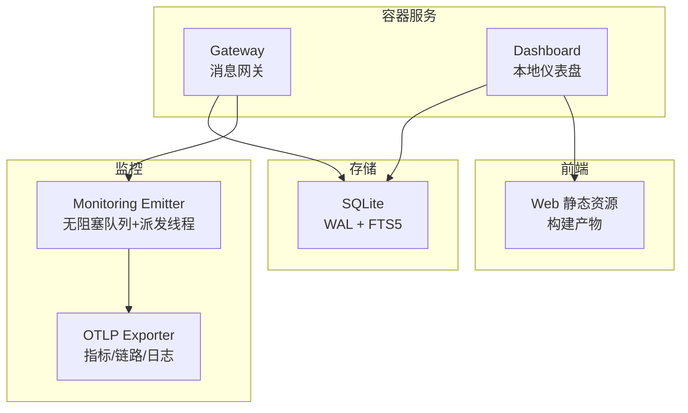
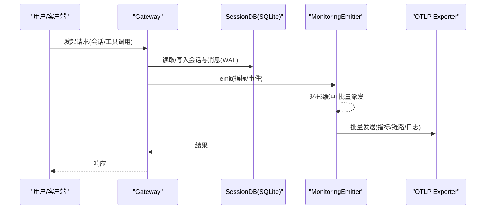
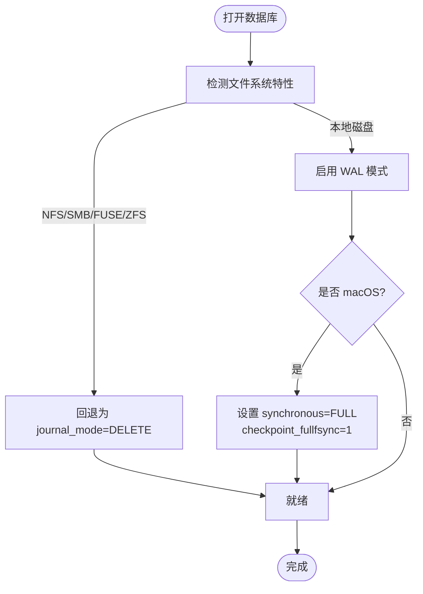
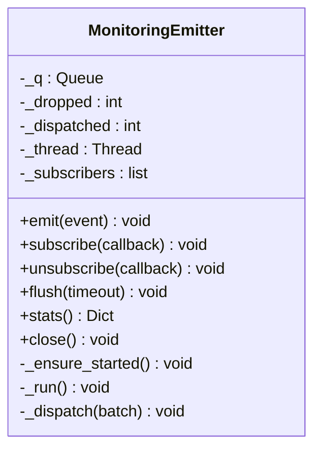
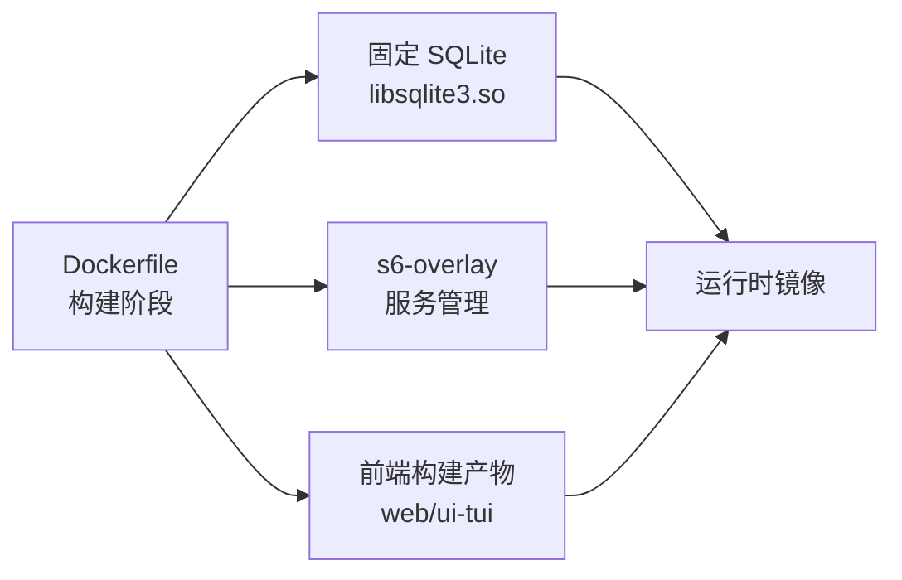
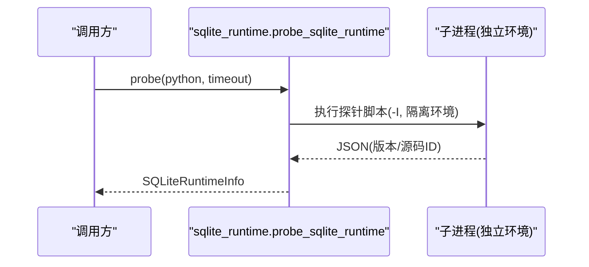
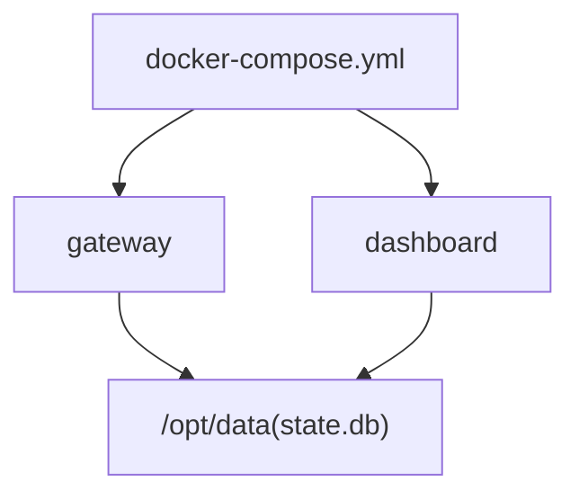

# 性能优化与调优

<cite>
**本文引用的文件**
- [hermes_state.py](file://hermes_state.py)
- [Dockerfile](file://Dockerfile)
- [docker-compose.yml](file://docker-compose.yml)
- [agent/monitoring/emitter.py](file://agent/monitoring/emitter.py)
- [hermes_cli/sqlite_runtime.py](file://hermes_cli/sqlite_runtime.py)
</cite>

## 目录
1. [简介](#简介)
2. [项目结构](#项目结构)
3. [核心组件](#核心组件)
4. [架构总览](#架构总览)
5. [详细组件分析](#详细组件分析)
6. [依赖关系分析](#依赖关系分析)
7. [性能考量](#性能考量)
8. [故障排查指南](#故障排查指南)
9. [结论](#结论)
10. [附录](#附录)

## 简介
本文件面向运维与平台工程团队，聚焦 Hermes Agent 在容器化部署、SQLite 状态存储、Python 运行时、前端静态资源以及监控指标等方面的性能优化与调优实践。文档基于仓库中的实际实现进行提炼，给出可操作的配置建议、关键路径分析与可视化流程，帮助构建稳定、高效、可观测的生产环境。

## 项目结构
Hermes Agent 采用多进程/多服务容器编排：gateway（消息网关）、dashboard（仪表盘）等通过 s6-overlay 管理；状态持久化使用 SQLite（WAL 模式），并内置 FTS5 全文检索；监控数据通过无阻塞发射器汇聚后导出到 OTLP；前端资源在镜像构建阶段预编译并内嵌分发。

图表来源
- [docker-compose.yml:29-77](file://docker-compose.yml#L29-L77)
- [hermes_state.py:1-15](file://hermes_state.py#L1-L15)
- [agent/monitoring/emitter.py:1-20](file://agent/monitoring/emitter.py#L1-L20)
- [Dockerfile:269-276](file://Dockerfile#L269-L276)

章节来源
- [docker-compose.yml:29-77](file://docker-compose.yml#L29-L77)
- [Dockerfile:54-91](file://Dockerfile#L54-L91)
- [hermes_state.py:1-15](file://hermes_state.py#L1-L15)

## 核心组件
- 状态存储（SQLite）：启用 WAL 提升并发读能力，结合 FTS5 加速会话消息检索；提供 WAL 兼容性回退与 macOS 同步策略增强。
- 监控发射器：热路径 emit() 保证微秒级返回，内部环形缓冲+后台派发线程批量投递，失败隔离不阻塞业务。
- 容器与运行环境：固定 SQLite 版本以规避已知漏洞；s6-overlay 管理服务生命周期；前端资源构建产物内嵌。
- CLI/运行时探测：独立探针获取 Python/SQLite 运行时信息，便于安装/更新流程安全决策。

章节来源
- [hermes_state.py:1-15](file://hermes_state.py#L1-L15)
- [hermes_state.py:486-518](file://hermes_state.py#L486-L518)
- [hermes_state.py:718-780](file://hermes_state.py#L718-L780)
- [agent/monitoring/emitter.py:1-20](file://agent/monitoring/emitter.py#L1-L20)
- [Dockerfile:1-41](file://Dockerfile#L1-L41)
- [Dockerfile:269-276](file://Dockerfile#L269-L276)
- [hermes_cli/sqlite_runtime.py:78-125](file://hermes_cli/sqlite_runtime.py#L78-L125)

## 架构总览
下图展示 Gateway 与 Dashboard 对 SQLite 的读写路径，以及监控事件从业务侧到 OTLP 的无阻塞流转。

图表来源
- [hermes_state.py:1-15](file://hermes_state.py#L1-L15)
- [agent/monitoring/emitter.py:52-116](file://agent/monitoring/emitter.py#L52-L116)

## 详细组件分析

### 组件A：SQLite 状态存储与性能调优
- 设计要点
  - 默认 WAL 模式，提升并发读能力，适合多平台 Gateway 场景。
  - 内置 FTS5 全文检索，支持跨会话消息快速搜索。
  - 针对 NFS/SMB/FUSE/ZFS 等网络/特殊文件系统提供 WAL 回退至 DELETE 模式，确保可用性。
  - macOS 上强制 synchronous=FULL 并在 checkpoint 时启用 fullfsync，降低崩溃/断电导致的数据损坏风险。
  - 检测 SQLite 库是否受 WAL-reset 漏洞影响，必要时拒绝启用 WAL。
- 性能与稳定性权衡
  - WAL 在高并发下显著改善读吞吐，但在不可靠存储上可能引发锁协议错误；回退策略保障基本功能可用。
  - macOS 的 FULL fsync 带来轻微写延迟，但换取更强的持久性保障。
- 调优建议
  - 将 state.db 置于本地高性能磁盘（NVMe/SSD），避免网络盘。
  - 合理设置会话压缩与导出上限，避免一次性加载过多消息造成内存峰值。
  - 定期执行 VACUUM/检查点，控制 WAL 体积增长。
  - 在 macOS 生产环境保持 synchronous=FULL 与 checkpoint_fullfsync 开启。

图表来源
- [hermes_state.py:486-518](file://hermes_state.py#L486-L518)
- [hermes_state.py:718-780](file://hermes_state.py#L718-L780)

章节来源
- [hermes_state.py:1-15](file://hermes_state.py#L1-L15)
- [hermes_state.py:486-518](file://hermes_state.py#L486-L518)
- [hermes_state.py:718-780](file://hermes_state.py#L718-L780)

### 组件B：监控指标采集与导出（无阻塞）
- 设计要点
  - emit() 保证微秒级返回，绝不阻塞业务；内部使用有界队列（环形缓冲）与后台派发线程批量投递。
  - 队列满时丢弃最旧事件，保护内存；每个订阅者（如 OTLP exporter）失败隔离，不影响其他订阅者与热路径。
  - 支持 flush/close/stats 等运维接口，便于测试与优雅关闭。
- 性能特征
  - 热路径仅做 put_nowait 与必要的时间戳注入，开销极低。
  - 批量派发减少网络/IO 次数，提高吞吐。
- 调优建议
  - 根据负载调整 _MAX_QUEUE 与 _DRAIN_BATCH，平衡延迟与吞吐。
  - 为 OTLP 目标配置合理的超时与重试策略，避免雪崩。
  - 在高峰期关注 dropped 计数，若持续升高需扩容或降采样。

图表来源
- [agent/monitoring/emitter.py:36-164](file://agent/monitoring/emitter.py#L36-L164)

章节来源
- [agent/monitoring/emitter.py:1-20](file://agent/monitoring/emitter.py#L1-L20)
- [agent/monitoring/emitter.py:52-116](file://agent/monitoring/emitter.py#L52-L116)
- [agent/monitoring/emitter.py:132-164](file://agent/monitoring/emitter.py#L132-L164)

### 组件C：容器化与运行时环境
- 固定 SQLite 版本：构建阶段编译并链接修复版 libsqlite3，规避 WAL-reset 漏洞。
- s6-overlay 服务管理：统一入口 /init，负责初始化脚本、服务注册与优雅关停。
- 前端资源：web/ui-tui 在构建期预编译，运行时直接分发，避免冷启动 npm install 带来的抖动。
- 环境变量与权限：PYTHONUNBUFFERED/PYTHONDONTWRITEBYTECODE 提升日志可见性与减少 I/O；非 root 用户运行，数据卷挂载于 /opt/data。

图表来源
- [Dockerfile:1-41](file://Dockerfile#L1-L41)
- [Dockerfile:54-91](file://Dockerfile#L54-L91)
- [Dockerfile:269-276](file://Dockerfile#L269-L276)
- [Dockerfile:336-357](file://Dockerfile#L336-L357)

章节来源
- [Dockerfile:1-41](file://Dockerfile#L1-L41)
- [Dockerfile:54-91](file://Dockerfile#L54-L91)
- [Dockerfile:269-276](file://Dockerfile#L269-L276)
- [Dockerfile:336-357](file://Dockerfile#L336-L357)

### 组件D：CLI/运行时探测（SQLite 版本与安全）
- 通过子进程隔离探针，获取 Python/SQLite 版本与源码 ID，判断是否受 WAL-reset 漏洞影响。
- 用于安装/更新流程中安全决策，避免在不兼容环境下启用 WAL。

图表来源
- [hermes_cli/sqlite_runtime.py:78-125](file://hermes_cli/sqlite_runtime.py#L78-L125)

章节来源
- [hermes_cli/sqlite_runtime.py:24-37](file://hermes_cli/sqlite_runtime.py#L24-L37)
- [hermes_cli/sqlite_runtime.py:78-125](file://hermes_cli/sqlite_runtime.py#L78-L125)

## 依赖关系分析
- 服务间依赖
  - dashboard 依赖 gateway 先启动（depends_on）。
  - 所有服务共享 /opt/data 数据卷，包含 state.db 与配置。
- 运行时依赖
  - SQLite 由镜像固定版本提供，避免系统库差异。
  - 监控导出依赖 OTLP 相关 extra（otlp），按需启用。

图表来源
- [docker-compose.yml:29-77](file://docker-compose.yml#L29-L77)

章节来源
- [docker-compose.yml:29-77](file://docker-compose.yml#L29-L77)

## 性能考量
- 容器资源限制（CPU/内存/I/O）
  - CPU：为 gateway 与 dashboard 分别设置 requests/limits，避免争用；在高并发消息路由场景适当提高 limits。
  - 内存：根据会话规模与并发连接数估算 RSS；监控 emitter 的 dropped 与 queue 大小作为参考。
  - I/O：state.db 必须位于低延迟本地磁盘；避免网络盘；考虑 SSD/NVMe。
- SQLite 调优
  - 使用 WAL 模式并定期 checkpoint；macOS 保持 synchronous=FULL。
  - 利用 FTS5 索引与查询优化，避免全表扫描；控制单次查询字符上限。
  - 对大会话启用压缩与拆分，限制 resume/export 的消息数量，防止内存尖峰。
- Python 运行时
  - 使用 PYTHONUNBUFFERED 提升日志实时性；禁用 .pyc 减少 I/O。
  - 监控长任务与阻塞调用，尽量异步化；合理使用并发与连接池。
- 前端性能
  - 静态资源在构建期打包并内嵌，避免运行时安装；启用 CDN 缓存与浏览器缓存头。
  - 对大图/媒体资源启用懒加载与压缩格式（WebP/AVIF）。
- 监控与告警
  - 定义 KPI：QPS、P95/P99 延迟、错误率、队列长度、dropped、SQLite 锁冲突、WAL 体积。
  - 阈值建议：dropped>0 持续 5 分钟触发告警；P99>阈值（按业务基线）；SQLite busy/lock 错误突增。
- 负载测试与容量规划
  - 使用压测工具模拟并发会话与消息流，观察各层瓶颈（CPU/内存/磁盘/网络）。
  - 逐步增加负载，记录拐点；依据资源利用率与 SLA 确定扩缩容策略。

[本节为通用指导，无需特定文件引用]

## 故障排查指南
- SQLite 不可用或 WAL 异常
  - 现象：/resume、/history 等命令报“会话数据库不可用”，提示 locking protocol 或 disk i/o error。
  - 处理：确认 state.db 所在文件系统是否支持 WAL；必要时回退为 DELETE 模式；检查磁盘空间与权限。
- 监控数据丢失
  - 现象：指标缺失或延迟高。
  - 处理：检查 emitter 的 dropped 与 queued；增大队列或降低采样；排查 OTLP 目标连通性与限流。
- 容器启动失败或服务未就绪
  - 现象：dashboard 无法访问或 gateway 未启动。
  - 处理：查看 s6-overlay 服务状态；确认 /opt/data 挂载与权限；核对环境变量与依赖服务顺序。

章节来源
- [hermes_state.py:674-694](file://hermes_state.py#L674-L694)
- [hermes_state.py:486-518](file://hermes_state.py#L486-L518)
- [agent/monitoring/emitter.py:152-164](file://agent/monitoring/emitter.py#L152-L164)

## 结论
Hermes Agent 在生产环境中具备完善的性能与可靠性基础：SQLite WAL 与 FTS5 提供高效的状态存储与检索；监控发射器确保指标采集不阻塞业务；容器化方案固定依赖并提供健壮的服务管理。结合合理的资源限制、磁盘选型、监控告警与负载测试，可构建稳定高效的运行体系。

[本节为总结性内容，无需特定文件引用]

## 附录
- 关键配置与环境变量
  - HERMES_HOME：状态与配置根目录（容器内 /opt/data）。
  - PYTHONUNBUFFERED：启用标准输出无缓冲。
  - PLAYWRIGHT_BROWSERS_PATH：浏览器缓存路径，避免覆盖数据卷。
  - API_SERVER_HOST/API_SERVER_KEY：可选暴露 OpenAI 兼容 API 服务（需鉴权）。
- 推荐操作
  - 定期维护：VACUUM、检查点、FTS5 重建（视需求）。
  - 容量规划：依据 QPS、延迟与资源利用率动态扩缩容。
  - 安全加固：最小权限、只读代码层、敏感信息脱敏。

[本节为补充信息，无需特定文件引用]