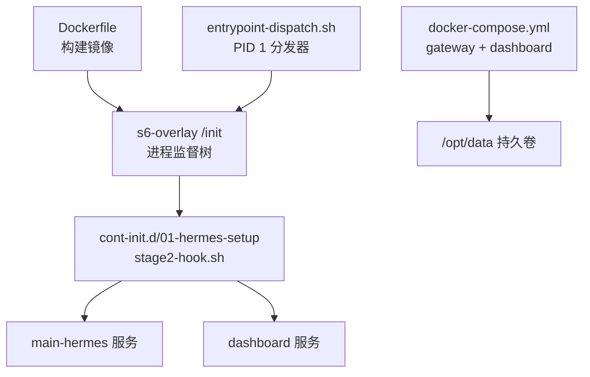
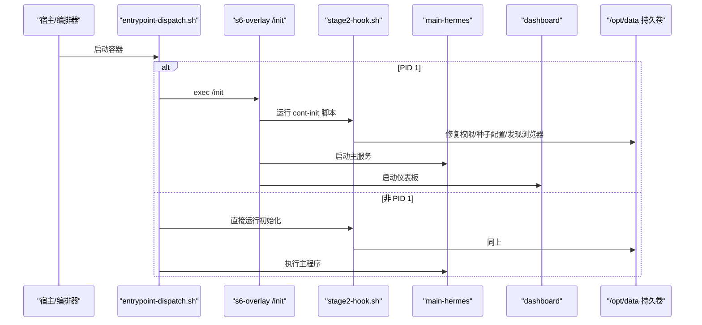
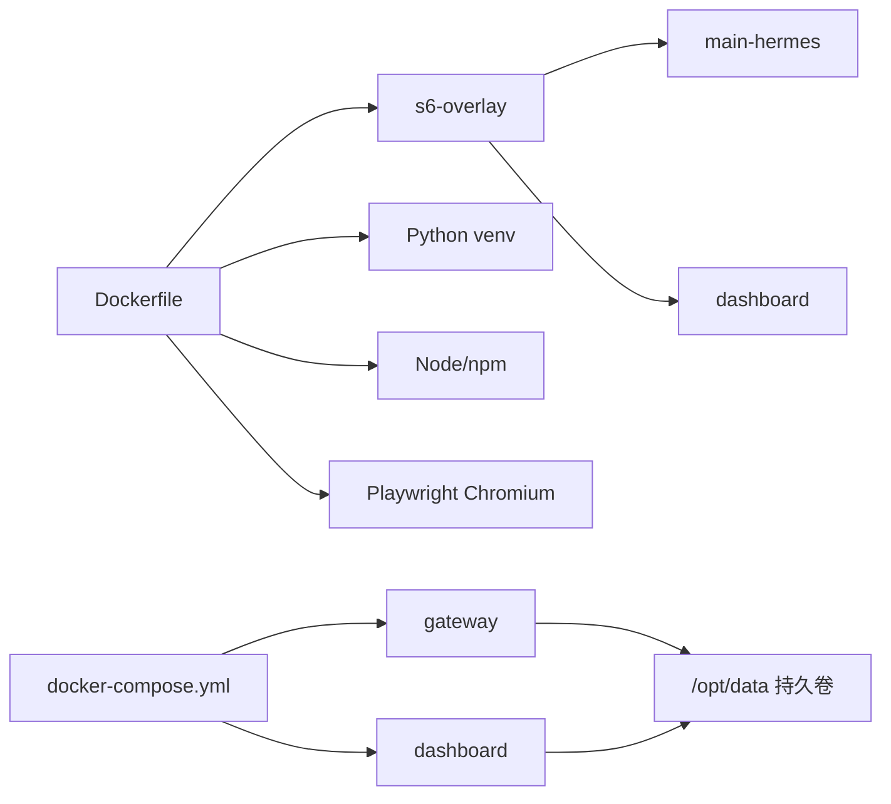

# 部署指南

<cite>
**本文引用的文件**
- [Dockerfile](file://Dockerfile)
- [docker-compose.yml](file://docker-compose.yml)
- [flake.nix](file://flake.nix)
- [cli-config.yaml.example](file://cli-config.yaml.example)
- [entrypoint-dispatch.sh](file://docker/entrypoint-dispatch.sh)
- [stage2-hook.sh](file://docker/stage2-hook.sh)
</cite>

## 目录
1. [简介](#简介)
2. [项目结构](#项目结构)
3. [核心组件](#核心组件)
4. [架构总览](#架构总览)
5. [详细组件分析](#详细组件分析)
6. [依赖关系分析](#依赖关系分析)
7. [性能考虑](#性能考虑)
8. [故障排查指南](#故障排查指南)
9. [结论](#结论)
10. [附录](#附录)

## 简介
本指南面向生产环境，提供 Hermes Agent 的容器化部署、Kubernetes 编排与服务网格集成建议；说明 Nix 包管理与环境一致性保障；覆盖多环境策略、配置与密钥管理、性能调优、资源限制与负载均衡；并给出高可用架构、故障转移与数据备份方案，以及监控、日志聚合与告警集成的实践建议。文档基于仓库中的 Dockerfile、Compose、Nix Flake 与启动脚本等实际实现进行说明。

## 项目结构
Hermes 的生产镜像由 Dockerfile 构建，使用 s6-overlay 作为进程管理器，并通过 entrypoint-dispatch.sh 兼容不同运行时（PID 1 或非 PID 1）。s6-overlay 在启动阶段执行 stage2-hook.sh 完成用户映射、数据卷权限修复、配置种子注入、浏览器二进制发现等初始化工作，随后启动 main-hermes 与 dashboard 服务。docker-compose.yml 提供了本地快速运行的 gateway 与 dashboard 双服务示例。Nix flake.nix 定义了跨平台构建与开发环境。

**图表来源**
- [Dockerfile:93-135](file://Dockerfile#L93-L135)
- [Dockerfile:336-357](file://Dockerfile#L336-L357)
- [Dockerfile:424-457](file://Dockerfile#L424-L457)
- [docker-compose.yml:29-77](file://docker-compose.yml#L29-L77)
- [entrypoint-dispatch.sh:1-26](file://docker/entrypoint-dispatch.sh#L1-L26)
- [stage2-hook.sh:1-17](file://docker/stage2-hook.sh#L1-L17)

**章节来源**
- [Dockerfile:52-91](file://Dockerfile#L52-L91)
- [Dockerfile:93-135](file://Dockerfile#L93-L135)
- [Dockerfile:336-357](file://Dockerfile#L336-L357)
- [Dockerfile:424-457](file://Dockerfile#L424-L457)
- [docker-compose.yml:29-77](file://docker-compose.yml#L29-L77)
- [entrypoint-dispatch.sh:1-26](file://docker/entrypoint-dispatch.sh#L1-L26)
- [stage2-hook.sh:1-17](file://docker/stage2-hook.sh#L1-L17)

## 核心组件
- 容器镜像构建：固定 SQLite 版本以规避 WAL-reset 缺陷；安装系统依赖；引入 s6-overlay 作为 PID 1；预装 Node/npm、Python uv 及前端产物；将 Python 依赖与前端构建分层缓存；设置只读代码层与可写数据卷 /opt/data。
- 启动流程：entrypoint-dispatch.sh 判断是否 PID 1，若是则 exec /init 进入 s6-overlay 监督树；否则直接运行 stage2-hook.sh 与 main-wrapper.sh 以支持非 PID 1 运行时。
- 初始化钩子：stage2-hook.sh 负责 UID/GID 重映射、数据卷权限修复、配置文件种子注入、auth.json 引导、浏览器二进制发现、skills 同步等。
- 服务定义：s6-overlay 静态服务 main-hermes 与 dashboard，按依赖顺序启动。
- Compose 编排：gateway 与 dashboard 两个服务，默认绑定 localhost 暴露 dashboard，gateway API 需显式开启并鉴权。

**章节来源**
- [Dockerfile:52-91](file://Dockerfile#L52-L91)
- [Dockerfile:93-135](file://Dockerfile#L93-L135)
- [Dockerfile:171-267](file://Dockerfile#L171-L267)
- [Dockerfile:269-286](file://Dockerfile#L269-L286)
- [Dockerfile:336-357](file://Dockerfile#L336-L357)
- [Dockerfile:424-457](file://Dockerfile#L424-L457)
- [docker-compose.yml:29-77](file://docker-compose.yml#L29-L77)
- [entrypoint-dispatch.sh:1-26](file://docker/entrypoint-dispatch.sh#L1-L26)
- [stage2-hook.sh:1-17](file://docker/stage2-hook.sh#L1-L17)

## 架构总览
下图展示了从容器入口到服务启动的关键路径，以及与数据卷和外部平台的交互点。

**图表来源**
- [entrypoint-dispatch.sh:1-26](file://docker/entrypoint-dispatch.sh#L1-L26)
- [Dockerfile:424-457](file://Dockerfile#L424-L457)
- [stage2-hook.sh:1-17](file://docker/stage2-hook.sh#L1-L17)

## 详细组件分析

### 容器化部署（Docker）
- 基础镜像与依赖：Debian trixie + 固定 SQLite 共享库；Node 26 与 npm；Python uv；系统工具链；s6-overlay 监督器。
- 分层缓存：先复制 manifest 再安装依赖，减少冷构建时间；前端构建独立缓存；源码最后拷贝。
- 安全与只读：/opt/hermes 为 root 拥有且只读；运行时状态位于 /opt/data；禁用 .pyc 与懒加载；可选 lazy-packages 指向数据卷。
- 环境变量：HERMES_HOME=/opt/data；HERMES_TUI_DIR；HERMES_WRITE_SAFE_ROOT；HERMES_DISABLE_LAZY_INSTALLS；PATH 包含 venv bin 与 shim。
- 入口与命令：ENTRYPOINT 为 entrypoint-dispatch.sh；CMD 为空，允许用户传入 hermes 子命令或任意命令。

**章节来源**
- [Dockerfile:52-91](file://Dockerfile#L52-L91)
- [Dockerfile:93-135](file://Dockerfile#L93-L135)
- [Dockerfile:171-267](file://Dockerfile#L171-L267)
- [Dockerfile:269-286](file://Dockerfile#L269-L286)
- [Dockerfile:336-357](file://Dockerfile#L336-L357)
- [Dockerfile:359-422](file://Dockerfile#L359-L422)
- [Dockerfile:424-457](file://Dockerfile#L424-L457)

### Kubernetes 编排与服务网格集成
- Pod 设计：单容器镜像，挂载 /opt/data 持久卷；通过 ConfigMap/Secret 注入配置与密钥；使用 liveness/readiness 探针检查网关健康端点（如 Gateway Health Export）。
- 资源限制：在 Deployment 中设置 requests/limits CPU 与内存；根据模型与并发调整；结合压缩与上下文裁剪降低请求体积。
- 服务暴露：Service 暴露端口；Ingress 或 Service Mesh（Istio/Linkerd）处理 TLS、限流、重试与熔断；对 dashboard 仅暴露内网或加认证。
- 滚动更新：使用 RollingUpdate 策略；确保 /opt/data 持久化；利用 readiness 探针避免流量进入未就绪实例。
- 多副本与水平扩展：gateway 无状态部分可水平扩展；会话状态与数据库落盘于持久卷；注意连接池与锁竞争。

[本节为通用编排建议，不直接引用具体文件]

### Nix 包管理与环境一致性
- Flake 输入：nixpkgs、flake-parts、pyproject-nix、uv2nix、build-system-pkgs、npm-lockfile-fix 等，统一开发与构建环境。
- 输出与导入：systems 指定 x86_64-linux、aarch64-linux、aarch64-darwin；导入 packages.nix、overlays.nix、nixosModules.nix、checks.nix、devShell.nix。
- 优势：跨平台一致的环境；可复现的构建；与 Python/Node 生态集成良好。

**章节来源**
- [flake.nix:1-49](file://flake.nix#L1-L49)

### 多环境部署策略与配置管理
- 环境区分：通过环境变量与 ConfigMap/Secret 区分 dev/staging/prod；使用 docker-compose 变量与 K8s 配置中心。
- 配置优先级：.env 中的密钥优先于配置文件；config.yaml 用于功能开关与行为配置；CLI 示例提供完整选项参考。
- 密钥管理：使用 Secret 管理 API Key、OAuth 凭据；避免明文写入镜像；通过 stage2-hook 首次引导 auth.json（可选）。
- 配置迁移：stage2-hook 在首次启动时执行配置 schema 迁移，保证升级兼容性。

**章节来源**
- [cli-config.yaml.example:1-20](file://cli-config.yaml.example#L1-L20)
- [stage2-hook.sh:418-455](file://docker/stage2-hook.sh#L418-L455)

### 密钥管理与安全最佳实践
- 最小权限：容器以非 root 用户运行；/opt/hermes 只读；敏感文件权限收紧（如 .env 600）。
- 网络暴露：dashboard 默认绑定 127.0.0.1；gateway API 需显式启用并设置 API_SERVER_KEY。
- 错误信息脱敏：终端工具输出与异常中包含敏感信息会被脱敏，避免泄露。

**章节来源**
- [docker-compose.yml:13-27](file://docker-compose.yml#L13-L27)
- [docker-compose.yml:41-61](file://docker-compose.yml#L41-L61)
- [stage2-hook.sh:434-444](file://docker/stage2-hook.sh#L434-L444)

### 性能调优与资源限制
- 上下文压缩：启用自动压缩以减少长对话的 token 消耗；可调阈值、保留最近消息数、空闲压缩等。
- 数据库模式：SQLite journal_mode 支持 wal/delete；在不支持 WAL 的文件系统上切换为 delete。
- 超时与重试：为不同 provider 配置请求超时与陈旧检测；避免慢调用阻塞。
- 资源配额：为容器设置 CPU/内存请求与限制；合理分配磁盘空间；控制并发会话数。

**章节来源**
- [cli-config.yaml.example:407-557](file://cli-config.yaml.example#L407-L557)
- [cli-config.yaml.example:8-20](file://cli-config.yaml.example#L8-L20)
- [cli-config.yaml.example:126-158](file://cli-config.yaml.example#L126-L158)

### 负载均衡与高可用
- 网关无状态扩展：gateway 可水平扩展；会话与状态落盘；通过 Ingress/Service Mesh 做负载均衡。
- 健康检查：使用 Gateway Health Export 作为 readiness/liveness 探针；失败时自动剔除实例。
- 故障转移：多副本下任一实例失败不影响整体；配合持久卷恢复状态。
- 数据备份：定期备份 /opt/data 下的数据库与配置；使用快照或对象存储归档。

[本节为通用高可用建议，不直接引用具体文件]

### 监控、日志与告警
- 指标导出：Gateway Health Export 暴露健康指标；OTLP exporter 可用于遥测采集。
- 日志聚合：容器标准输出由编排器收集；建议集中到 ELK/Loki；避免敏感信息泄露。
- 告警规则：基于健康探针失败率、错误率、延迟分位、资源使用率设置告警；结合 Service Mesh 指标。

[本节为通用监控建议，不直接引用具体文件]

## 依赖关系分析
- 构建期依赖：SQLite 固定版本、Node/npm、Python uv、s6-overlay、系统工具链。
- 运行期依赖：Python venv、前端静态资源、Playwright Chromium、可选后端 SDK（baked-in 或 lazy-install）。
- 服务依赖：main-hermes 与 dashboard 由 s6-overlay 管理；dashboard 依赖 gateway 健康。

**图表来源**
- [Dockerfile:93-135](file://Dockerfile#L93-L135)
- [Dockerfile:171-267](file://Dockerfile#L171-L267)
- [Dockerfile:269-286](file://Dockerfile#L269-L286)
- [docker-compose.yml:29-77](file://docker-compose.yml#L29-L77)

**章节来源**
- [Dockerfile:93-135](file://Dockerfile#L93-L135)
- [Dockerfile:171-267](file://Dockerfile#L171-L267)
- [docker-compose.yml:29-77](file://docker-compose.yml#L29-L77)

## 性能考虑
- 上下文压缩：启用自动压缩，调整阈值与保留策略，减少长对话成本。
- 数据库模式：根据文件系统特性选择 WAL 或 DELETE；必要时调整 WAL 大小限制。
- 超时与重试：为不同 provider 设置合适的请求超时与陈旧检测，避免慢调用影响吞吐。
- 资源限制：合理设置 CPU/内存请求与限制；控制并发会话数；避免资源争用。
- 前端构建缓存：利用分层缓存加速构建；减少冷构建时间。

**章节来源**
- [cli-config.yaml.example:407-557](file://cli-config.yaml.example#L407-L557)
- [cli-config.yaml.example:8-20](file://cli-config.yaml.example#L8-L20)
- [cli-config.yaml.example:126-158](file://cli-config.yaml.example#L126-L158)

## 故障排查指南
- 启动失败：检查 entrypoint-dispatch.sh 是否为 PID 1；若非 PID 1，确认 fallback 路径正确；查看 s6-overlay 日志。
- 权限问题：stage2-hook.sh 会修复 /opt/data 权限；若仍失败，检查 HERMES_UID/HERMES_GID 与宿主机映射。
- 浏览器不可用：确认 Playwright Chromium 已安装并被 stage2-hook.sh 发现；必要时手动设置 AGENT_BROWSER_EXECUTABLE_PATH。
- 配置迁移失败：查看 stage2-hook.sh 中配置迁移步骤的输出；必要时跳过迁移后手动处理。
- 密钥泄露：检查终端工具输出与异常是否被脱敏；确保 .env 权限为 600。

**章节来源**
- [entrypoint-dispatch.sh:1-26](file://docker/entrypoint-dispatch.sh#L1-L26)
- [stage2-hook.sh:23-74](file://docker/stage2-hook.sh#L23-L74)
- [stage2-hook.sh:174-255](file://docker/stage2-hook.sh#L174-L255)
- [stage2-hook.sh:543-589](file://docker/stage2-hook.sh#L543-L589)
- [stage2-hook.sh:418-455](file://docker/stage2-hook.sh#L418-L455)

## 结论
Hermes Agent 的生产部署以 Docker 镜像为核心，结合 s6-overlay 实现健壮的服务监督与初始化流程；通过 docker-compose 快速验证，Kubernetes 编排实现可扩展与高可用；Nix Flake 保障环境与构建一致性。配置与密钥管理遵循最小权限与集中化管理原则；性能调优围绕上下文压缩、数据库模式、超时与资源限制展开。监控、日志与告警应结合健康导出与集中式采集，形成闭环运维体系。

## 附录
- 快速启动：使用 docker-compose 启动 gateway 与 dashboard；通过 SSH 隧道访问 dashboard。
- 生产建议：使用 ConfigMap/Secret 管理配置与密钥；设置健康探针与滚动更新；定期备份 /opt/data。
- 参考配置：cli-config.yaml.example 提供完整配置项说明；按需启用压缩、数据库模式、超时与并发限制。

**章节来源**
- [docker-compose.yml:29-77](file://docker-compose.yml#L29-L77)
- [cli-config.yaml.example:1-20](file://cli-config.yaml.example#L1-L20)