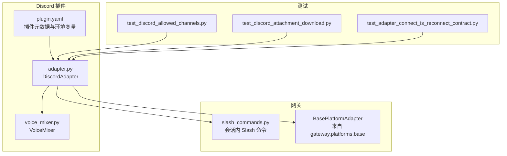
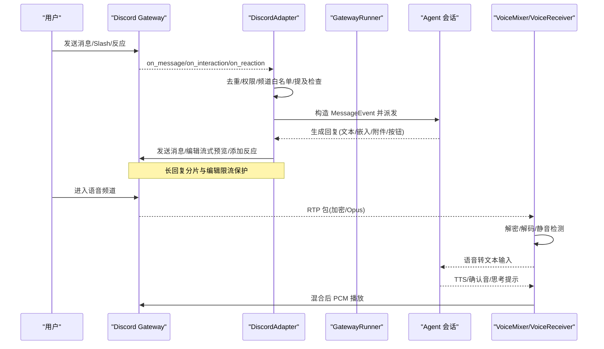
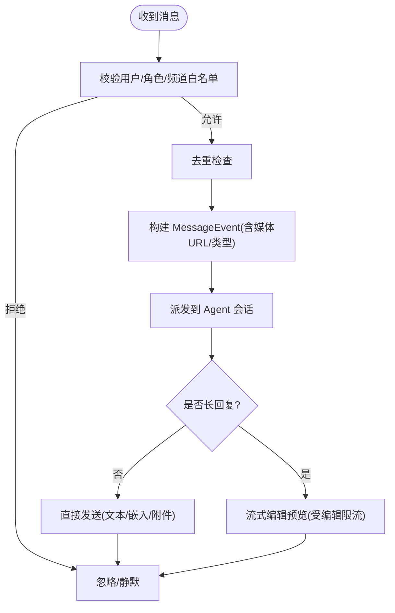
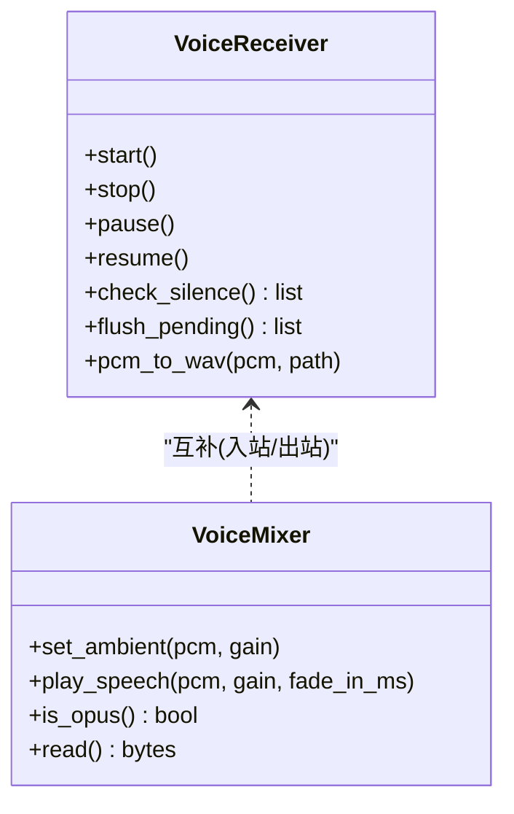
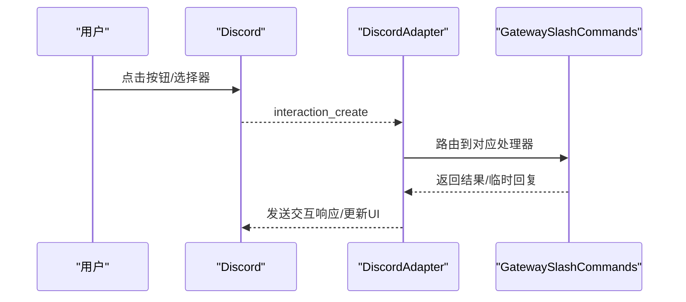
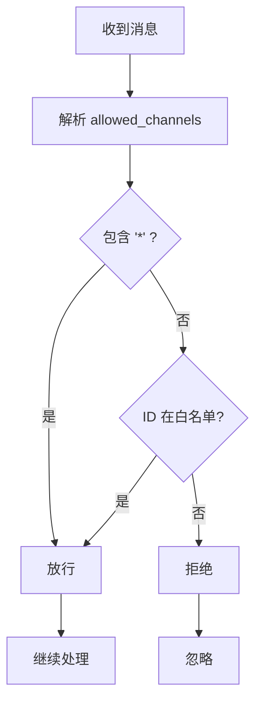
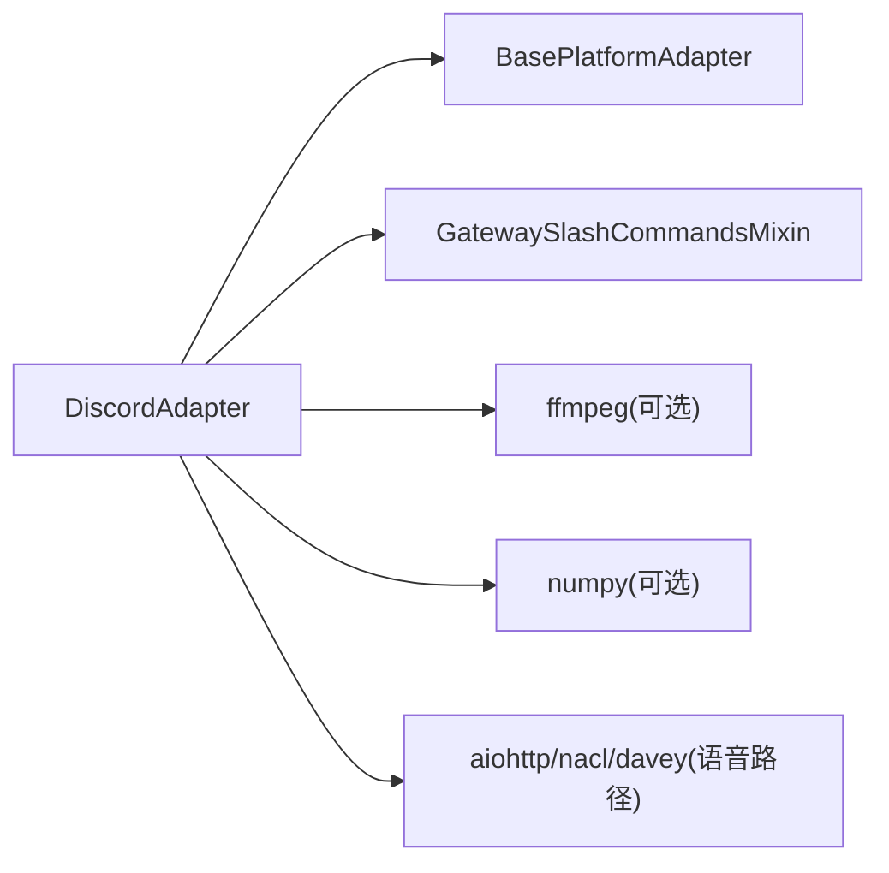

# Discord 平台集成

<cite>
**本文引用的文件**
- [adapter.py](file://plugins/platforms/discord/adapter.py)
- [plugin.yaml](file://plugins/platforms/discord/plugin.yaml)
- [voice_mixer.py](file://plugins/platforms/discord/voice_mixer.py)
- [slash_commands.py](file://gateway/slash_commands.py)
- [test_discord_allowed_channels.py](file://tests/gateway/test_discord_allowed_channels.py)
- [test_discord_attachment_download.py](file://tests/gateway/test_discord_attachment_download.py)
- [test_adapter_connect_is_reconnect_contract.py](file://tests/gateway/test_adapter_connect_is_reconnect_contract.py)
</cite>

## 目录
1. [简介](#简介)
2. [项目结构](#项目结构)
3. [核心组件](#核心组件)
4. [架构总览](#架构总览)
5. [详细组件分析](#详细组件分析)
6. [依赖关系分析](#依赖关系分析)
7. [性能与容量规划](#性能与容量规划)
8. [故障诊断指南](#故障诊断指南)
9. [结论](#结论)
10. [附录：配置与安全清单](#附录配置与安全清单)

## 简介
本文件面向在 Discord 平台上集成 Hermes Agent 的开发者与运维人员，系统性说明从应用创建、Bot 令牌获取、服务器邀请与权限配置，到消息收发、线程、嵌入、附件、反应、Slash 命令、交互组件、Webhook、语音模式、速率限制、连接池与重连机制、OAuth2 流程与安全性、性能优化与故障诊断等全链路实践。文档基于仓库中 Discord 平台适配器与网关 Slash 命令实现进行技术级解读，并提供可操作的流程图与时序图帮助快速上手与排障。

## 项目结构
Discord 集成以插件形式提供，核心位于 plugins/platforms/discord 目录；网关侧通过 slash_commands.py 暴露会话内 Slash 命令能力；测试覆盖通道白名单、附件下载路径与适配器重连契约等关键行为。

图表来源
- [adapter.py:987-1128](file://plugins/platforms/discord/adapter.py#L987-L1128)
- [voice_mixer.py:156-200](file://plugins/platforms/discord/voice_mixer.py#L156-L200)
- [slash_commands.py:101-118](file://gateway/slash_commands.py#L101-L118)
- [plugin.yaml:1-35](file://plugins/platforms/discord/plugin.yaml#L1-L35)

章节来源
- [adapter.py:987-1128](file://plugins/platforms/discord/adapter.py#L987-L1128)
- [plugin.yaml:1-35](file://plugins/platforms/discord/plugin.yaml#L1-L35)
- [slash_commands.py:101-118](file://gateway/slash_commands.py#L101-L118)

## 核心组件
- DiscordAdapter：Discord 平台适配器的核心类，封装 Bot 生命周期、消息处理、线程、嵌入、附件、反应、Slash 命令、语音接收与混音、WebSocket 健康探测、去重与恢复存储等。
- VoiceReceiver：语音频道入站音频捕获、解密、解码、静音检测与片段输出。
- VoiceMixer：出站 PCM 混音器，支持环境底噪循环与语音“避让”（ducking），保证 TTS、确认音与思考提示平滑共存。
- 会话内 Slash 命令：GatewaySlashCommandsMixin 提供的 /reset、/status、/context、/kanban 等命令，跨平台复用，Discord 场景下由适配器事件路由触发。

章节来源
- [adapter.py:987-1128](file://plugins/platforms/discord/adapter.py#L987-L1128)
- [voice_mixer.py:156-200](file://plugins/platforms/discord/voice_mixer.py#L156-L200)
- [slash_commands.py:101-118](file://gateway/slash_commands.py#L101-L118)

## 架构总览
下图展示从用户消息到 Agent 响应的主要调用链，包括消息去重、线程参与、附件缓存、Slash 命令与语音混合。

图表来源
- [adapter.py:987-1128](file://plugins/platforms/discord/adapter.py#L987-L1128)
- [voice_mixer.py:156-200](file://plugins/platforms/discord/voice_mixer.py#L156-L200)
- [slash_commands.py:101-118](file://gateway/slash_commands.py#L101-L118)

## 详细组件分析

### DiscordAdapter：消息、线程、嵌入、附件与反应
- 消息与线程
  - 维护 ThreadParticipationTracker，自动识别历史线程参与，避免重复 @mention。
  - 支持 reply_to_mode 控制首次或全部分片附带引用。
- 嵌入与 Markdown
  - 对工具预览链接做安全转义与包裹，避免被误解析为 URL 预览。
- 附件处理
  - 优先使用 attachment.read() 走认证会话下载，失败时回退到 SSRF 守卫的 URL 下载路径。
  - 图片/音频/文档三类缓存统一入口，保障 CDN 鉴权与 DNS 异常下的稳定性。
- 反应系统
  - 通过 discord.ui 与 Reaction 事件完成反馈收集与状态更新。
- 速率限制与分片
  - 内置消息长度上限与分片策略，配合编辑限流保护，避免频繁 edit 触发 Discord 限流。
- WebSocket 健康探测
  - 周期性采样 WebSocket ready/open/ACK 与心跳延迟，连续不健康则触发可重试致命错误，交由 GatewayRunner 重建适配器。

图表来源
- [adapter.py:987-1128](file://plugins/platforms/discord/adapter.py#L987-L1128)
- [test_discord_attachment_download.py:176-198](file://tests/gateway/test_discord_attachment_download.py#L176-L198)

章节来源
- [adapter.py:987-1128](file://plugins/platforms/discord/adapter.py#L987-L1128)
- [test_discord_attachment_download.py:176-198](file://tests/gateway/test_discord_attachment_download.py#L176-L198)

### 语音模块：接收、解码与混音
- VoiceReceiver
  - 监听语音 WebSocket 的 SPEAKING 事件，建立 SSRC -> user_id 映射。
  - 解析 RTP 头、剥离填充、NaCl 传输层解密、DAVE 端到端解密、Opus 解码为 PCM。
  - 按静音阈值与最小语音时长切分片段，输出给 STT。
- VoiceMixer
  - 作为 discord.AudioSource，持续产出混合后的 PCM 帧。
  - 支持环境底噪循环与语音“避让”，确保 TTS、确认音与思考提示无缝叠加。
  - 线程安全：discord.py 音频发送线程读取 read()，异步事件线程添加/移除子源。

图表来源
- [adapter.py:525-908](file://plugins/platforms/discord/adapter.py#L525-L908)
- [voice_mixer.py:156-200](file://plugins/platforms/discord/voice_mixer.py#L156-L200)

章节来源
- [adapter.py:525-908](file://plugins/platforms/discord/adapter.py#L525-L908)
- [voice_mixer.py:156-200](file://plugins/platforms/discord/voice_mixer.py#L156-L200)

### Slash 命令与交互组件
- 会话内 Slash 命令
  - GatewaySlashCommandsMixin 提供 /reset、/status、/context、/kanban 等命令，跨平台复用。
  - Discord 场景下由适配器事件路由触发，结合 typed_command_prefix 能力兼容不同平台前缀。
- 交互组件
  - 通过 discord.ui.View/Button 实现执行审批、Slash 确认、更新提示、澄清选择等交互。
  - 超时控制：默认 300 秒，范围钳制在 30~900 秒，匹配 Discord 交互令牌有效期。

图表来源
- [slash_commands.py:101-118](file://gateway/slash_commands.py#L101-L118)
- [adapter.py:938-984](file://plugins/platforms/discord/adapter.py#L938-L984)

章节来源
- [slash_commands.py:101-118](file://gateway/slash_commands.py#L101-L118)
- [adapter.py:938-984](file://plugins/platforms/discord/adapter.py#L938-L984)

### 权限、白名单与通配符
- 环境变量与配置
  - DISCORD_ALLOWED_USERS、DISCORD_ALLOWED_ROLES、DISCORD_ALLOWED_CHANNELS、DISCORD_IGNORED_CHANNELS、DISCORD_FREE_RESPONSE_CHANNELS 等用于细粒度访问控制。
- 通配符支持
  - 当列表包含 "*" 时，表示允许/忽略/自由响应所有频道，避免字面量 "*" 导致逻辑失效。

图表来源
- [test_discord_allowed_channels.py:16-39](file://tests/gateway/test_discord_allowed_channels.py#L16-L39)

章节来源
- [test_discord_allowed_channels.py:16-39](file://tests/gateway/test_discord_allowed_channels.py#L16-L39)

## 依赖关系分析
- 外部库
  - discord.py：消息收发、交互、语音、嵌入、UI 组件。
  - ffmpeg：PCM 转 WAV（STT 输入）。
  - numpy：语音混音向量运算（可选 voice extra）。
- 内部依赖
  - BasePlatformAdapter：统一平台抽象与媒体缓存工具。
  - GatewaySlashCommandsMixin：会话内命令复用。
  - 工具集：URL 安全校验、原子写入、懒加载依赖等。

图表来源
- [adapter.py:143-168](file://plugins/platforms/discord/adapter.py#L143-L168)
- [voice_mixer.py:51-72](file://plugins/platforms/discord/voice_mixer.py#L51-L72)

章节来源
- [adapter.py:143-168](file://plugins/platforms/discord/adapter.py#L143-L168)
- [voice_mixer.py:51-72](file://plugins/platforms/discord/voice_mixer.py#L51-L72)

## 性能与容量规划
- 消息与编辑限流
  - 长回复采用分片与流式编辑，注意 Discord 编辑频率限制，避免频繁 edit 造成节流。
- 附件下载
  - 优先使用 attachment.read() 走认证会话，减少 CDN 鉴权失败与 DNS 异常影响；回退路径启用 SSRF 守卫。
- 语音处理
  - 每 SSRC 独立 Opus 解码器，静音阈值与最小语音时长过滤噪声；混音器单例常驻，避免 stop-and-swap 切换开销。
- WebSocket 健康探测
  - 定期采样心跳延迟与连接状态，连续不健康触发可重试致命错误，交由网关重连。
- 资源与依赖
  - 懒加载 discord.py 与可选依赖，降低启动成本；ffmpeg/numpy 按需引入。

章节来源
- [adapter.py:171-205](file://plugins/platforms/discord/adapter.py#L171-L205)
- [adapter.py:525-908](file://plugins/platforms/discord/adapter.py#L525-L908)
- [voice_mixer.py:156-200](file://plugins/platforms/discord/voice_mixer.py#L156-L200)

## 故障诊断指南
- 适配器重连契约
  - 所有平台适配器的 connect() 必须接受 is_reconnect 关键字参数，否则网关重连时会抛出 TypeError 并静默断开。
- 附件下载失败
  - 若 att.read() 失败，会回退到 URL 下载；需检查 SSRF 守卫与 CDN 鉴权；日志关注 403/重定向过多等错误。
- 频道白名单误判
  - 确认 allowed_channels/ignored_channels/free_response_channels 是否正确包含 "*" 通配符。
- 语音无声音/无法识别
  - 检查 NaCl/DAVE 解密、RTP 填充剥离、Opus 解码器状态与静音阈值；查看 SSRC->user_id 映射是否建立。
- WebSocket 断连
  - 观察健康探测指标；若连续不健康，确认网络/代理/证书问题，必要时重启网关以重建适配器。

章节来源
- [test_adapter_connect_is_reconnect_contract.py:1-145](file://tests/gateway/test_adapter_connect_is_reconnect_contract.py#L1-L145)
- [test_discord_attachment_download.py:176-198](file://tests/gateway/test_discord_attachment_download.py#L176-L198)
- [test_discord_allowed_channels.py:16-39](file://tests/gateway/test_discord_allowed_channels.py#L16-L39)

## 结论
Hermes Agent 的 Discord 集成以 DiscordAdapter 为核心，覆盖消息、线程、嵌入、附件、反应、Slash 命令、交互组件与语音模式的全栈能力，并通过健康探测、去重、恢复存储与严格的速率/SSRF 防护保障稳定性与安全性。配合网关 Slash 命令与测试用例，可在生产环境中获得高可用、易排障的 Discord 机器人体验。

## 附录：配置与安全清单
- 必需环境变量
  - DISCORD_BOT_TOKEN：Bot 令牌（密码型）。
- 可选环境变量
  - DISCORD_ALLOWED_USERS、DISCORD_ALLOW_ALL_USERS、DISCORD_HOME_CHANNEL、DISCORD_HOME_CHANNEL_NAME 等。
- 安全建议
  - 默认禁止 @everyone 与角色 ping，仅允许用户与回复提及；可通过环境变量精细调整。
  - 附件下载一律经过 SSRF 守卫；图片重定向最多 10 次，超过即拒绝。
  - 交互按钮视图超时默认 300 秒，范围钳制在 30~900 秒，防止过期或过长。
- OAuth2 与权限范围
  - 在 Discord 开发者控制台创建应用并启用 Bot；根据需求勾选 intents（如消息、反应、语音等）；将 Bot 邀请至服务器并授予必要权限。
- 性能调优
  - 合理设置文本批处理延迟与分片间隔；语音静音阈值与最小语音时长按场景微调；混音器增益与避让时间平衡听感与清晰度。

章节来源
- [plugin.yaml:1-35](file://plugins/platforms/discord/plugin.yaml#L1-L35)
- [adapter.py:476-508](file://plugins/platforms/discord/adapter.py#L476-L508)
- [adapter.py:171-205](file://plugins/platforms/discord/adapter.py#L171-L205)
- [adapter.py:938-984](file://plugins/platforms/discord/adapter.py#L938-L984)