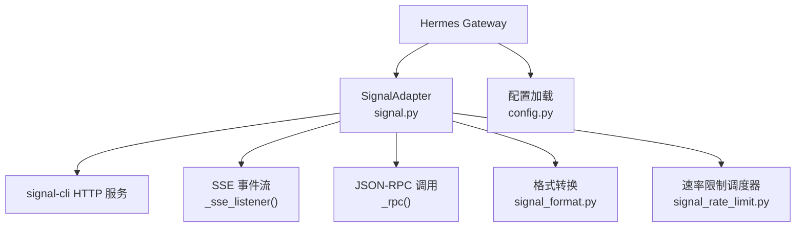
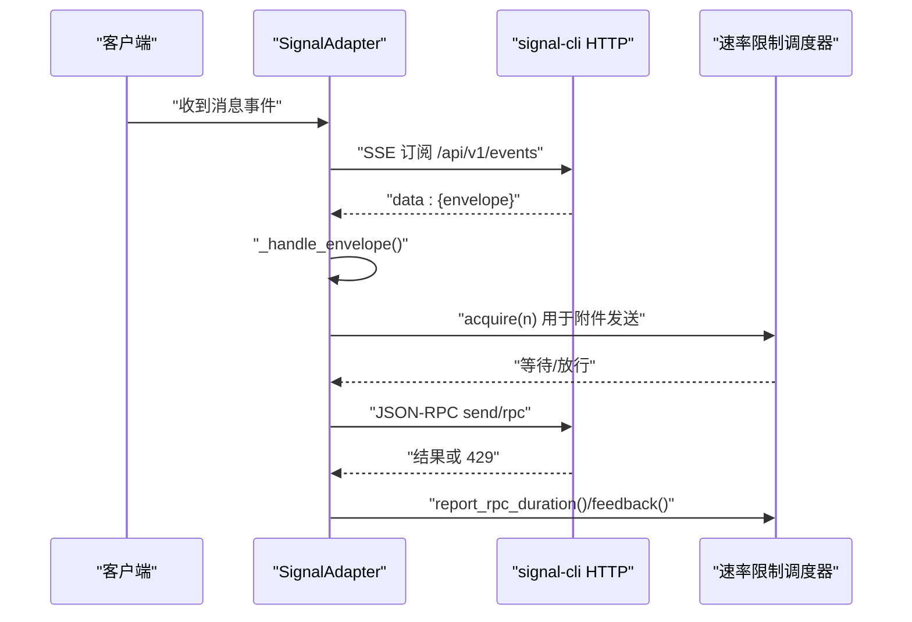
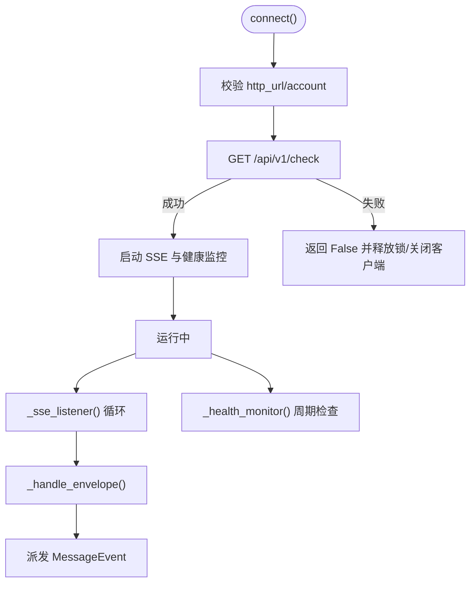
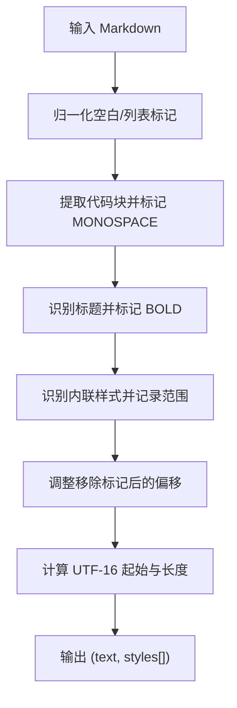
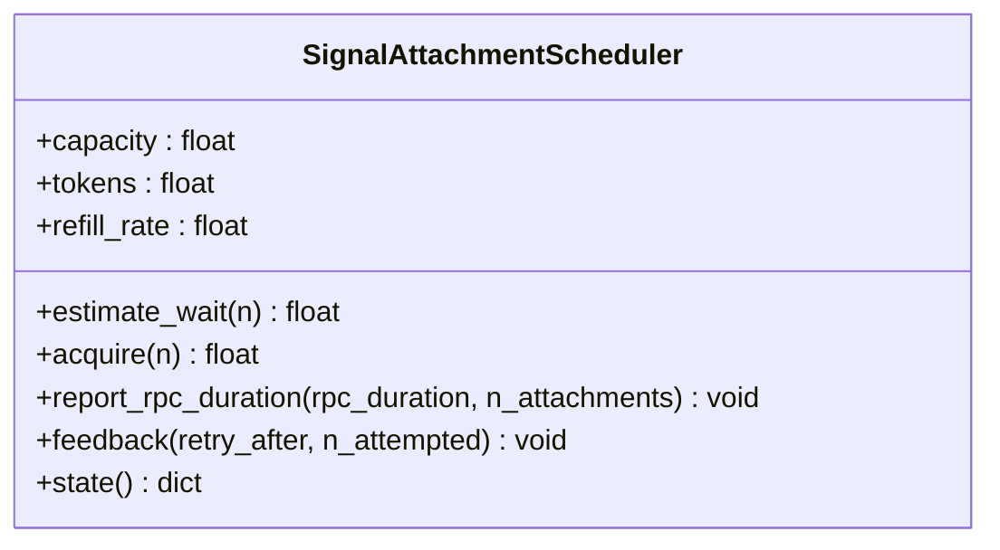
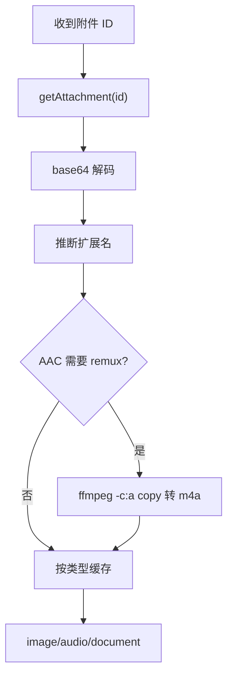
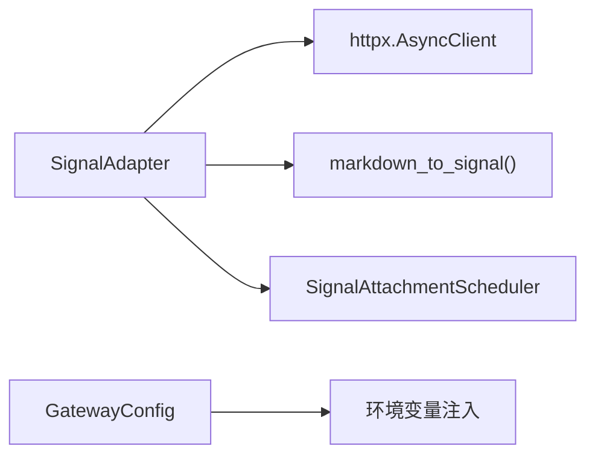

# Signal 平台集成

<cite>
**本文引用的文件**
- [gateway/platforms/signal.py](file://gateway/platforms/signal.py)
- [gateway/platforms/signal_format.py](file://gateway/platforms/signal_format.py)
- [gateway/platforms/signal_rate_limit.py](file://gateway/platforms/signal_rate_limit.py)
- [website/docs/user-guide/messaging/signal.md](file://website/docs/user-guide/messaging/signal.md)
- [gateway/config.py](file://gateway/config.py)
- [tests/gateway/test_signal.py](file://tests/gateway/test_signal.py)
</cite>

## 目录
1. [简介](#简介)
2. [项目结构](#项目结构)
3. [核心组件](#核心组件)
4. [架构总览](#架构总览)
5. [详细组件分析](#详细组件分析)
6. [依赖关系分析](#依赖关系分析)
7. [性能与速率限制](#性能与速率限制)
8. [安全与端到端加密](#安全与端到端加密)
9. [配置与部署指南](#配置与部署指南)
10. [故障排除](#故障排除)
11. [结论](#结论)

## 简介
本文件面向需要在 Hermes Agent 中集成 Signal 的工程师与运维人员，覆盖以下主题：
- 通过 signal-cli HTTP 模式接入 Signal（账户注册、设备配对）
- 消息收发、媒体处理、群组聊天与联系人管理
- 消息格式转换（Markdown → Signal 原生样式）
- 速率限制机制与连接管理策略
- 安全考虑与端到端加密特性
- 完整配置示例、部署步骤与网络/防火墙建议
- 故障排除与性能优化建议

Signal 是默认端到端加密的主流即时通讯平台，Hermes 通过 signal-cli 的 HTTP 模式进行通信，使用 SSE 接收消息、JSON-RPC 发送消息。

## 项目结构
与 Signal 集成相关的核心代码位于 gateway/platforms 下，包含适配器、格式转换与速率限制模块；用户指南在 website/docs/user-guide/messaging/signal.md；环境变量加载在 gateway/config.py。

图表来源
- [gateway/platforms/signal.py:347-520](file://gateway/platforms/signal.py#L347-L520)
- [gateway/platforms/signal_format.py:12-141](file://gateway/platforms/signal_format.py#L12-L141)
- [gateway/platforms/signal_rate_limit.py:170-367](file://gateway/platforms/signal_rate_limit.py#L170-L367)
- [gateway/config.py:2008-2024](file://gateway/config.py#L2008-L2024)

章节来源
- [gateway/platforms/signal.py:1-120](file://gateway/platforms/signal.py#L1-L120)
- [gateway/platforms/signal_format.py:1-141](file://gateway/platforms/signal_format.py#L1-L141)
- [gateway/platforms/signal_rate_limit.py:1-164](file://gateway/platforms/signal_rate_limit.py#L1-L164)
- [gateway/config.py:2008-2024](file://gateway/config.py#L2008-L2024)
- [website/docs/user-guide/messaging/signal.md:1-120](file://website/docs/user-guide/messaging/signal.md#L1-L120)

## 核心组件
- SignalAdapter：实现与 signal-cli 的连接、SSE 监听、消息处理、附件下载、JSON-RPC 调用、健康检查与重连。
- signal_format：将 Markdown 转换为 Signal 原生样式（bodyRanges），支持粗体、斜体、删除线、等宽、标题等。
- signal_rate_limit：进程级令牌桶调度器，模拟并适配 Signal 服务器附件上传速率限制，提供 acquire/report/feedback 接口。
- 配置加载：从环境变量注入 Signal 平台配置（URL、账号、白名单、Home Channel 等）。

章节来源
- [gateway/platforms/signal.py:253-342](file://gateway/platforms/signal.py#L253-L342)
- [gateway/platforms/signal_format.py:12-141](file://gateway/platforms/signal_format.py#L12-L141)
- [gateway/platforms/signal_rate_limit.py:170-367](file://gateway/platforms/signal_rate_limit.py#L170-L367)
- [gateway/config.py:2008-2024](file://gateway/config.py#L2008-L2024)

## 架构总览
Hermes 通过 SignalAdapter 与外部 signal-cli 守护进程交互：
- 入站：SSE 流持续接收事件，解析信封后构建 MessageEvent 并交由网关处理。
- 出站：通过 JSON-RPC 调用 signal-cli 发送文本、媒体、反应等。
- 健康监控：定期检测 SSE 活动与 daemon 可达性，必要时强制重连。
- 速率限制：对附件上传进行令牌桶控制，避免触发服务端 429。

图表来源
- [gateway/platforms/signal.py:426-520](file://gateway/platforms/signal.py#L426-L520)
- [gateway/platforms/signal.py:929-1000](file://gateway/platforms/signal.py#L929-L1000)
- [gateway/platforms/signal_rate_limit.py:228-328](file://gateway/platforms/signal_rate_limit.py#L228-L328)

## 详细组件分析

### SignalAdapter 类
职责：
- 初始化配置（HTTP URL、账号、群组/DM 白名单、是否忽略故事、是否需要 @提及）
- 生命周期管理（connect/disconnect）
- SSE 监听与事件处理（_sse_listener/_handle_envelope）
- 健康监控（_health_monitor/_force_reconnect）
- 附件获取与缓存（_fetch_attachment）
- JSON-RPC 封装（_rpc）
- 联系人识别与回复上下文（quote/reply-to）

关键流程：
- connect：创建 httpx 客户端，执行健康检查，启动 SSE 与健康监控任务。
- _sse_listener：建立 SSE 长连接，按行解析 data: 事件，反序列化为 JSON 并分发。
- _handle_envelope：过滤自身消息、故事、群组白名单、@提及；提取文本、引用、附件；构造 MessageEvent。
- _rpc：统一 JSON-RPC 调用，支持 rate limit 异常捕获与可选抛出。

图表来源
- [gateway/platforms/signal.py:347-420](file://gateway/platforms/signal.py#L347-L420)
- [gateway/platforms/signal.py:426-520](file://gateway/platforms/signal.py#L426-L520)
- [gateway/platforms/signal.py:536-770](file://gateway/platforms/signal.py#L536-L770)

章节来源
- [gateway/platforms/signal.py:253-420](file://gateway/platforms/signal.py#L253-L420)
- [gateway/platforms/signal.py:426-770](file://gateway/platforms/signal.py#L426-L770)
- [gateway/platforms/signal.py:883-1000](file://gateway/platforms/signal.py#L883-L1000)

### 消息格式转换（Markdown → Signal 原生样式）
- 将 Markdown 文本转换为纯文本 + bodyRanges（UTF-16 偏移），支持粗体、斜体、删除线、等宽、标题等。
- 列表标记规范化为 Unicode bullet，保留代码块内容不变。
- 输出供 signal-cli 以 native formatting 渲染，避免显示原始 markdown 字符。

图表来源
- [gateway/platforms/signal_format.py:12-141](file://gateway/platforms/signal_format.py#L12-L141)

章节来源
- [gateway/platforms/signal_format.py:1-141](file://gateway/platforms/signal_format.py#L1-L141)

### 速率限制与连接管理
- 令牌桶模型：容量=50（匹配服务端），默认每 4 秒补充一个 token。
- acquire(n)：阻塞直到可用，期间释放锁允许并发交错。
- report_rpc_duration(n_attachments)：RPC 完成后扣减 token，并在上传期间不信用 refill，避免漂移导致 429。
- feedback(retry_after, n_attempted)：根据服务端 hint 校准 refill_rate。
- 连接管理：SSE 指数退避重连（2s→60s），健康监控 30s 周期检查，超过 120s 无活动则探测并可能强制重连。

图表来源
- [gateway/platforms/signal_rate_limit.py:170-367](file://gateway/platforms/signal_rate_limit.py#L170-L367)

章节来源
- [gateway/platforms/signal_rate_limit.py:1-164](file://gateway/platforms/signal_rate_limit.py#L1-L164)
- [gateway/platforms/signal_rate_limit.py:170-367](file://gateway/platforms/signal_rate_limit.py#L170-L367)

### 媒体文件处理
- 入站附件：通过 getAttachment 获取 base64 数据，自动推断扩展名；Android 语音笔记（ADTS AAC）可无损 remux 到 .m4a；按类型缓存为图片/音频/文档。
- 出站媒体：通过工具链发送图片、语音、视频、文档；信号协议层不区分语音与文件附件，统一走附件 API。
- 大小限制：单附件最大 100 MB。

图表来源
- [gateway/platforms/signal.py:883-923](file://gateway/platforms/signal.py#L883-L923)
- [website/docs/user-guide/messaging/signal.md:148-172](file://website/docs/user-guide/messaging/signal.md#L148-L172)

章节来源
- [gateway/platforms/signal.py:85-137](file://gateway/platforms/signal.py#L85-L137)
- [gateway/platforms/signal.py:883-923](file://gateway/platforms/signal.py#L883-L923)
- [website/docs/user-guide/messaging/signal.md:148-172](file://website/docs/user-guide/messaging/signal.md#L148-L172)

### 群组聊天与联系人管理
- 群组访问控制：通过 SIGNAL_GROUP_ALLOWED_USERS 设置允许的 group_id 或 * 全部允许；未设置时默认忽略所有群组消息。
- DM 访问控制：SIGNAL_ALLOWED_USERS 指定允许的用户；未设置时使用 DM 配对流程或拒绝未知用户。
- 联系人识别：listContacts 获取号码与服务 ID 映射，优先使用稳定标识（ACI/PNI UUID）作为收件人。

章节来源
- [gateway/platforms/signal.py:270-289](file://gateway/platforms/signal.py#L270-L289)
- [gateway/platforms/signal.py:594-610](file://gateway/platforms/signal.py#L594-L610)
- [gateway/platforms/signal.py:828-877](file://gateway/platforms/signal.py#L828-L877)
- [website/docs/user-guide/messaging/signal.md:124-143](file://website/docs/user-guide/messaging/signal.md#L124-L143)

### 消息队列与处理
- 入队：SSE 事件到达后，适配器解析并构建 MessageEvent，交由网关的消息处理管线。
- 出队：网关处理后通过 SignalAdapter._rpc 调用发送响应，支持文本、媒体、反应等。
- 回环防护：维护已发送消息时间戳缓存，过滤 echo-back（Note to Self 与 linked-device 同步场景）。

章节来源
- [gateway/platforms/signal.py:536-770](file://gateway/platforms/signal.py#L536-L770)
- [gateway/platforms/signal.py:815-827](file://gateway/platforms/signal.py#L815-L827)

## 依赖关系分析
- SignalAdapter 依赖 httpx 进行 HTTP/SSE 通信。
- 格式转换依赖正则表达式与 UTF-16 长度计算。
- 速率限制依赖 asyncio.Lock 保证并发安全，并使用 agent.retry_utils 解析 retry-after。
- 配置加载从环境变量注入平台配置，支持 Home Channel。

图表来源
- [gateway/platforms/signal.py:347-365](file://gateway/platforms/signal.py#L347-L365)
- [gateway/platforms/signal_format.py:12-141](file://gateway/platforms/signal_format.py#L12-L141)
- [gateway/platforms/signal_rate_limit.py:24-26](file://gateway/platforms/signal_rate_limit.py#L24-L26)
- [gateway/config.py:2008-2024](file://gateway/config.py#L2008-L2024)

章节来源
- [gateway/platforms/signal.py:347-365](file://gateway/platforms/signal.py#L347-L365)
- [gateway/platforms/signal_format.py:12-141](file://gateway/platforms/signal_format.py#L12-L141)
- [gateway/platforms/signal_rate_limit.py:24-26](file://gateway/platforms/signal_rate_limit.py#L24-L26)
- [gateway/config.py:2008-2024](file://gateway/config.py#L2008-L2024)

## 性能与速率限制
- 附件上传速率限制：令牌桶容量 50，默认每 4 秒补充 1 token；当服务端返回 429 时，根据 retry_after 校准 refill_rate。
- 批量发送：单次最多 32 个附件；大附件批次需延长超时（5s/附件，最低 60s）。
- SSE 重连：指数退避（2s→60s），抖动 20% 防止惊群。
- 健康监控：30s 周期检查，120s 无活动触发探测与可能的强制重连。
- 内存与缓存：最近发送时间戳与消息时间戳采用有序字典 LRU 淘汰，避免无限增长。

章节来源
- [gateway/platforms/signal_rate_limit.py:33-38](file://gateway/platforms/signal_rate_limit.py#L33-L38)
- [gateway/platforms/signal_rate_limit.py:152-164](file://gateway/platforms/signal_rate_limit.py#L152-L164)
- [gateway/platforms/signal_rate_limit.py:228-328](file://gateway/platforms/signal_rate_limit.py#L228-L328)
- [gateway/platforms/signal.py:66-73](file://gateway/platforms/signal.py#L66-L73)
- [gateway/platforms/signal.py:313-337](file://gateway/platforms/signal.py#L313-L337)

## 安全与端到端加密
- Signal 默认端到端加密，保护消息内容传输安全。
- 日志脱敏：电话号码在日志中自动脱敏（如 +155****4567）。
- 访问控制：必须配置 SIGNAL_ALLOWED_USERS 或使用 DM 配对；群组默认禁用，除非显式允许。
- 会话数据保护：signal-cli 会话数据包含账户凭据，应像密码一样保护。

章节来源
- [website/docs/user-guide/messaging/signal.md:235-246](file://website/docs/user-guide/messaging/signal.md#L235-L246)
- [website/docs/user-guide/messaging/signal.md:194-199](file://website/docs/user-guide/messaging/signal.md#L194-L199)

## 配置与部署指南

### 前置条件
- 安装 signal-cli（Java 17+ 运行时）
- 准备一个已安装 Signal 的手机号（用于链接为副设备）

章节来源
- [website/docs/user-guide/messaging/signal.md:19-41](file://website/docs/user-guide/messaging/signal.md#L19-L41)

### 步骤 1：链接 Signal 账户
- 生成链接 URI（显示二维码或链接）
- 在手机 Signal 中“设置 → 已链接设备”添加新设备并扫描

章节来源
- [website/docs/user-guide/messaging/signal.md:45-58](file://website/docs/user-guide/messaging/signal.md#L45-L58)

### 步骤 2：启动 signal-cli 守护进程
- 命令示例：signal-cli --account +E164_NUMBER daemon --http 127.0.0.1:8080
- 验证：curl http://127.0.0.1:8080/api/v1/check

章节来源
- [website/docs/user-guide/messaging/signal.md:61-77](file://website/docs/user-guide/messaging/signal.md#L61-L77)

### 步骤 3：配置 Hermes
- 交互式：hermes gateway setup 选择 Signal，填写 URL、账号、白名单等
- 手动：在 ~/.hermes/.env 设置环境变量

必需变量：
- SIGNAL_HTTP_URL
- SIGNAL_ACCOUNT

推荐安全变量：
- SIGNAL_ALLOWED_USERS（逗号分隔的 E.164 号码或 UUID）

可选变量：
- SIGNAL_GROUP_ALLOWED_USERS（启用群组，留空禁用，* 表示全部）
- SIGNAL_HOME_CHANNEL（cron 任务默认投递目标）

章节来源
- [website/docs/user-guide/messaging/signal.md:81-120](file://website/docs/user-guide/messaging/signal.md#L81-L120)
- [gateway/config.py:2008-2024](file://gateway/config.py#L2008-L2024)

### 网络与防火墙
- 确保 Hermes 所在主机能访问 signal-cli HTTP 端口（默认 8080）
- 若跨主机部署，需在防火墙开放对应端口并限制来源 IP
- 建议使用本地回环地址（127.0.0.1）以减少暴露面

章节来源
- [gateway/platforms/signal.py:347-365](file://gateway/platforms/signal.py#L347-L365)
- [website/docs/user-guide/messaging/signal.md:61-77](file://website/docs/user-guide/messaging/signal.md#L61-L77)

## 故障排除
常见问题与解决方案：
- “无法连接 signal-cli”：确认守护进程已启动且端口可达
- “未收到消息”：检查 SIGNAL_ALLOWED_USERS 是否包含发送者号码（E.164 格式）
- “signal-cli 未找到”：安装并确保 PATH 正确，或使用 Docker
- “连接频繁断开”：查看 signal-cli 日志，确认 Java 版本满足要求
- “群组消息被忽略”：配置 SIGNAL_GROUP_ALLOWED_USERS 或设为 *
- “机器人无人响应”：配置 SIGNAL_ALLOWED_USERS、使用 DM 配对或放宽策略

章节来源
- [website/docs/user-guide/messaging/signal.md:221-232](file://website/docs/user-guide/messaging/signal.md#L221-L232)

## 结论
Hermes 通过 SignalAdapter 与 signal-cli HTTP 模式深度集成，提供高可靠的消息收发、媒体处理、群组支持与访问控制。借助 SSE 流与 JSON-RPC 通信，结合健康监控与速率限制调度器，可在保持 Signal 端到端加密特性的同时，实现安全、稳定的自动化消息处理。建议在生产环境严格配置访问控制、保护会话数据，并根据负载调优速率限制与健康检查参数。