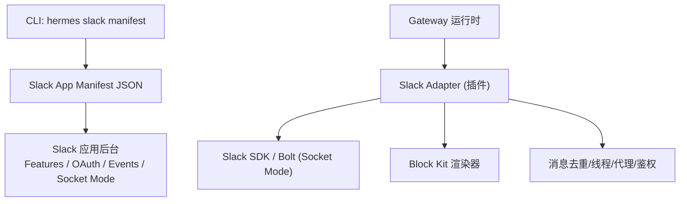
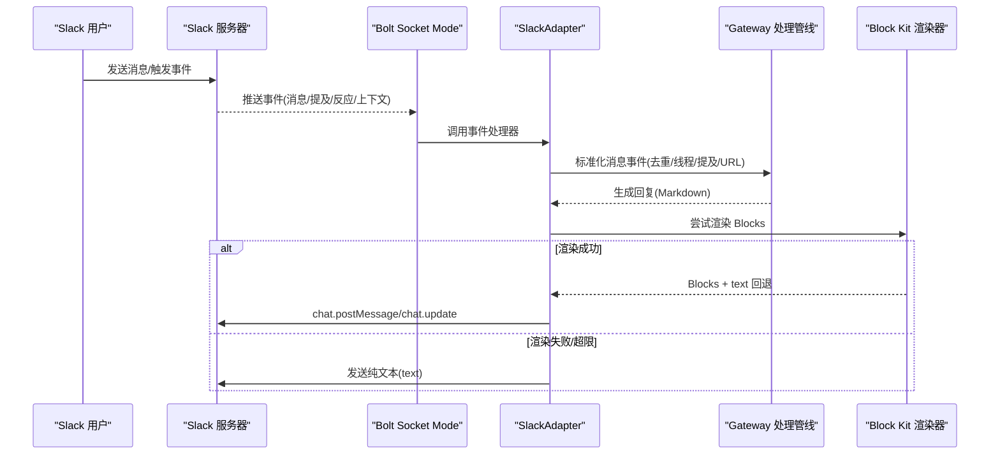
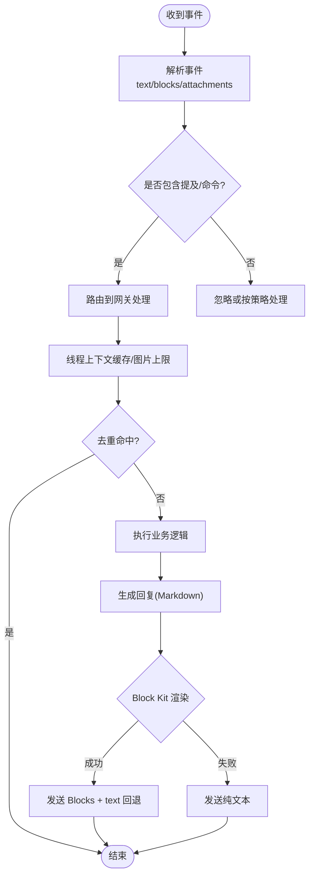
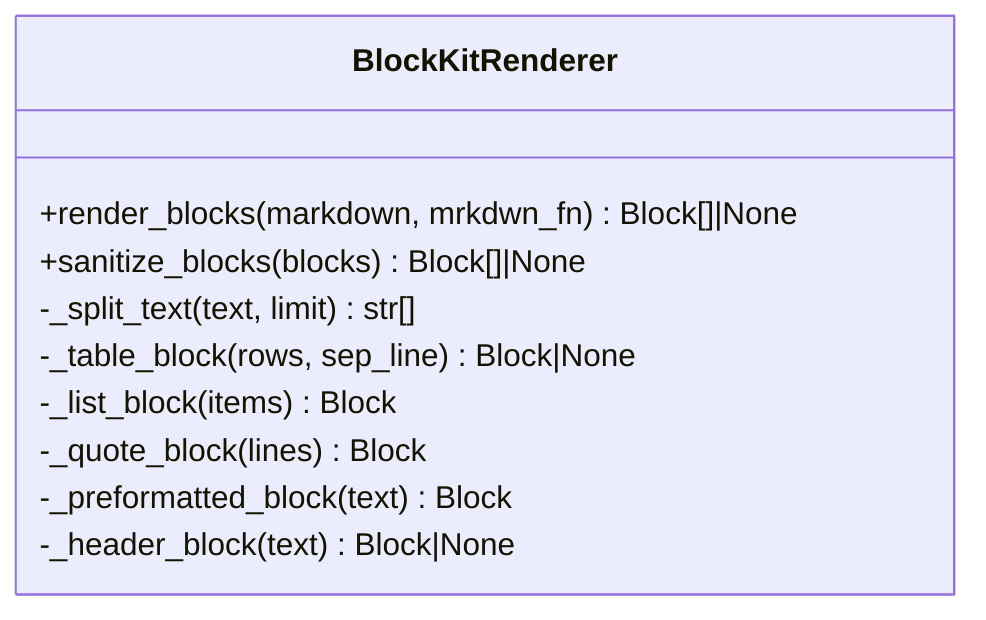
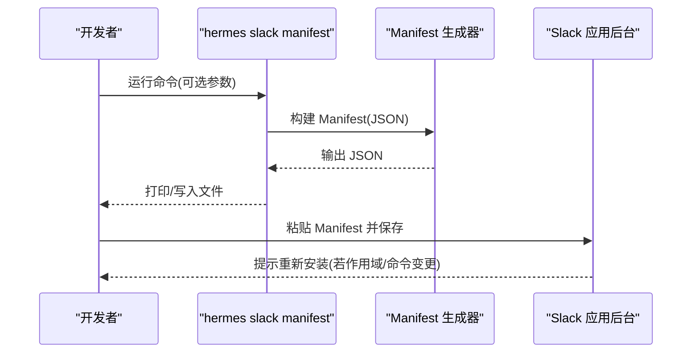
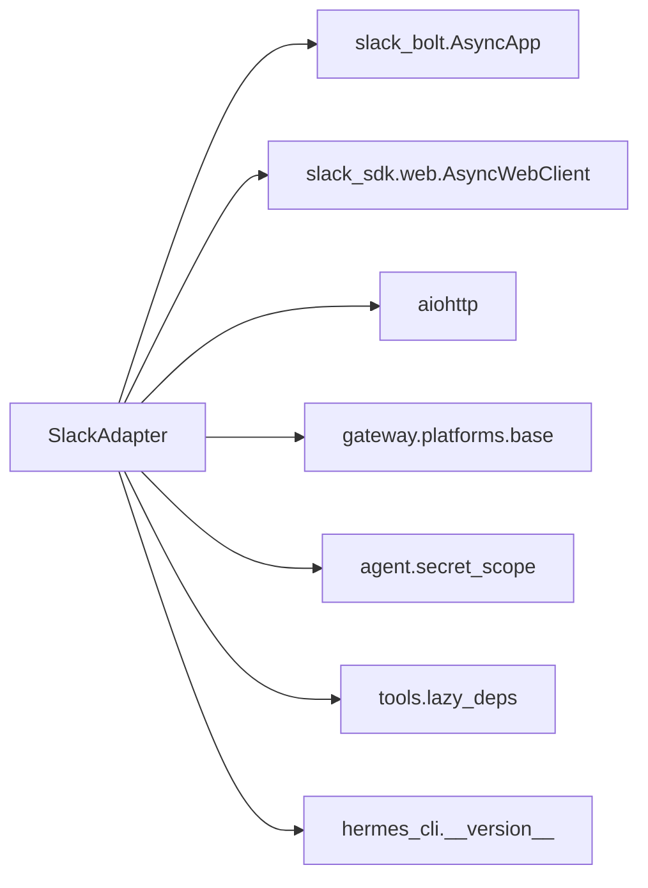

# Slack 平台集成

<cite>
**本文引用的文件**
- [adapter.py](file://plugins/platforms/slack/adapter.py)
- [block_kit.py](file://plugins/platforms/slack/block_kit.py)
- [__init__.py](file://plugins/platforms/slack/__init__.py)
- [slack_cli.py](file://hermes_cli/slack_cli.py)
- [subcommands/slack.py](file://hermes_cli/subcommands/slack.py)
- [config.py](file://gateway/config.py)
- [config_defaults.py](file://hermes_cli/config_defaults.py)
- [test_slack.py](file://tests/gateway/test_slack.py)
</cite>

## 目录
1. [简介](#简介)
2. [项目结构](#项目结构)
3. [核心组件](#核心组件)
4. [架构总览](#架构总览)
5. [详细组件分析](#详细组件分析)
6. [依赖关系分析](#依赖关系分析)
7. [性能与限制](#性能与限制)
8. [故障排除指南](#故障排除指南)
9. [结论](#结论)
10. [附录：配置与部署清单](#附录配置与部署清单)

## 简介
本文件面向在 Slack 平台上集成 Hermes Agent 的开发者与运维人员，系统说明如何创建并配置 Slack App、设置 OAuth 权限范围与事件订阅、启用 Socket Mode、处理消息与线程、使用 Block Kit UI（消息卡片、交互式组件）、以及工作流与自动化对接。文档同时覆盖频道管理、用户组、角色权限、速率限制、批量操作、错误处理、Webhook/事件处理、实时通信、性能调优与故障排除等主题，并提供可操作的配置与部署步骤。

## 项目结构
Slack 集成由“插件适配器 + CLI 工具 + 配置中心”三部分构成：
- 插件适配器：实现 Slack 消息收发、事件处理、Block Kit 渲染、线程与去重、代理与鉴权等。
- CLI 工具：生成 Slack App Manifest（包含斜杠命令、OAuth 作用域、事件订阅、Socket Mode 等）。
- 配置中心：提供环境变量、默认值、平台开关与行为控制。

图表来源
- [slack_cli.py:30-163](file://hermes_cli/slack_cli.py#L30-L163)
- [adapter.py:1-66](file://plugins/platforms/slack/adapter.py#L1-L66)
- [block_kit.py:1-27](file://plugins/platforms/slack/block_kit.py#L1-L27)

章节来源
- [slack_cli.py:1-163](file://hermes_cli/slack_cli.py#L1-L163)
- [adapter.py:1-120](file://plugins/platforms/slack/adapter.py#L1-L120)
- [block_kit.py:1-42](file://plugins/platforms/slack/block_kit.py#L1-L42)

## 核心组件
- Slack 适配器（Adapter）：基于 slack-bolt 异步应用与 Socket Mode，负责接收消息、发送响应、处理斜杠命令、线程上下文、文件/媒体、提及检测、Block Kit 文本提取与 URL 发现、代理与鉴权、错误限长读取、去重窗口等。
- Block Kit 渲染器：将 Agent 的 Markdown 转换为 Slack Block Kit blocks，支持标题、分隔线、代码块、引用、列表、表格（原生 table 或等宽回退），并对 Slack 硬限制进行安全裁剪。
- CLI Manifest 生成：自动生成完整的 Slack App Manifest（含斜杠命令、OAuth 作用域、事件订阅、Socket Mode、Assistant/Agent 视图），支持写入文件或仅输出斜杠命令片段。
- 配置与环境变量：定义平台开关、令牌、允许用户、回复模式、打字指示器等；提供默认值与校验提示。

章节来源
- [adapter.py:1-120](file://plugins/platforms/slack/adapter.py#L1-L120)
- [block_kit.py:1-42](file://plugins/platforms/slack/block_kit.py#L1-L42)
- [slack_cli.py:30-163](file://hermes_cli/slack_cli.py#L30-L163)
- [config.py:580-779](file://gateway/config.py#L580-L779)
- [config_defaults.py:4031-4058](file://hermes_cli/config_defaults.py#L4031-L4058)

## 架构总览
Slack 集成通过 Socket Mode 建立 WebSocket 连接，避免公网 Webhook 暴露；事件经 Bolt 路由到适配器，再进入 Gateway 的消息处理管线。Block Kit 渲染器作为可选增强路径，失败时自动降级为纯文本。

图表来源
- [adapter.py:1-66](file://plugins/platforms/slack/adapter.py#L1-L66)
- [block_kit.py:368-535](file://plugins/platforms/slack/block_kit.py#L368-L535)

## 详细组件分析

### Slack 适配器（Adapter）
- 职责
  - 使用 slack-bolt 异步应用与 Socket Mode 接收消息与事件。
  - 解析 Slack 消息体，包括富文本 rich_text、附件 attachments、Block Kit blocks、提及、链接、文件类型映射等。
  - 线程上下文缓存与冷启动图片下载上限控制。
  - 消息去重（Socket Mode 重投递窗口可配置）。
  - 代理与无代理主机白名单、SSRF 防护、User-Agent 标记。
  - 错误响应体长度限制读取，避免大错误体阻塞。
  - 忽略频道（ignored_channels）出站抑制。
- 关键流程
  - 依赖懒加载：首次使用时按需安装 slack-bolt/slack-sdk。
  - 提及检测：合并顶层 text 与 Block Kit 中的用户提及，忽略引用内容中的提及。
  - 文本提取：从 rich_text、attachments、blocks 中抽取可读文本，保留引用与列表格式。
  - URL 发现：遍历 blocks 收集 url/image_url/external_url 等字段。
  - 音频容器映射：根据 MIME 选择正确扩展名以适配 STT 后端。
  - 去重 TTL：Socket Mode 重投递场景下扩大去重窗口，防止重复回复。
  - 任务取消：Socket Mode 后台任务在关闭时带超时取消，避免卡死。

图表来源
- [adapter.py:254-380](file://plugins/platforms/slack/adapter.py#L254-L380)
- [adapter.py:399-533](file://plugins/platforms/slack/adapter.py#L399-L533)
- [adapter.py:624-663](file://plugins/platforms/slack/adapter.py#L624-L663)
- [adapter.py:748-770](file://plugins/platforms/slack/adapter.py#L748-L770)
- [adapter.py:684-718](file://plugins/platforms/slack/adapter.py#L684-L718)

章节来源
- [adapter.py:1-120](file://plugins/platforms/slack/adapter.py#L1-L120)
- [adapter.py:254-380](file://plugins/platforms/slack/adapter.py#L254-L380)
- [adapter.py:399-533](file://plugins/platforms/slack/adapter.py#L399-L533)
- [adapter.py:624-663](file://plugins/platforms/slack/adapter.py#L624-L663)
- [adapter.py:684-718](file://plugins/platforms/slack/adapter.py#L684-L718)
- [adapter.py:748-770](file://plugins/platforms/slack/adapter.py#L748-L770)

### Block Kit 渲染器
- 能力
  - 将 Markdown 段落、代码块、引用、列表、表格转换为 Slack Block Kit blocks。
  - 表格优先使用原生 table block，超过限制则回退为等宽文本。
  - 严格遵循 Slack 硬限制：最大 50 个 blocks、section 文本 3000 字符、header 150 字符、table 行列与字符数限制。
  - 对空元素、零长度文本进行清理，避免 invalid_blocks。
  - 提供 sanitize_blocks 作为最终边界保护，确保发送前 payload 合法。
- 设计约束
  - 永远不抛出异常，渲染失败时返回 None，调用方降级为纯文本。
  - 每个 blocks 必须搭配 text 回退，保证通知与旧客户端可用。

图表来源
- [block_kit.py:368-535](file://plugins/platforms/slack/block_kit.py#L368-L535)
- [block_kit.py:591-689](file://plugins/platforms/slack/block_kit.py#L591-L689)

章节来源
- [block_kit.py:1-42](file://plugins/platforms/slack/block_kit.py#L1-L42)
- [block_kit.py:368-535](file://plugins/platforms/slack/block_kit.py#L368-L535)
- [block_kit.py:591-689](file://plugins/platforms/slack/block_kit.py#L591-L689)

### CLI 与 Manifest 生成
- 功能
  - 生成完整 Slack App Manifest，包含：
    - 斜杠命令（来自 Gateway 命令注册表）
    - OAuth 作用域（bot 级别）
    - 事件订阅（app_mention、message.*、reaction_* 等）
    - Socket Mode 启用
    - Assistant/Agent 视图切换
  - 支持写入文件或仅输出斜杠命令片段，便于合并到现有 Manifest。
- 交互体验
  - assistant_view：传统助手对话体验
  - agent_view：现代 Agent 消息体验（需额外事件）
  - none：禁用 AI 助手特性，DM 内直接斜杠命令

图表来源
- [slack_cli.py:30-163](file://hermes_cli/slack_cli.py#L30-L163)
- [slack_cli.py:166-283](file://hermes_cli/slack_cli.py#L166-L283)
- [subcommands/slack.py:12-94](file://hermes_cli/subcommands/slack.py#L12-L94)

章节来源
- [slack_cli.py:30-163](file://hermes_cli/slack_cli.py#L30-L163)
- [slack_cli.py:166-283](file://hermes_cli/slack_cli.py#L166-L283)
- [subcommands/slack.py:12-94](file://hermes_cli/subcommands/slack.py#L12-L94)

### 配置与环境变量
- 平台令牌与作用域
  - SLACK_BOT_TOKEN：Bot Token（xoxb-...），用于聊天与读取权限。
  - SLACK_APP_TOKEN：App-Level Token（xapp-...），用于 Socket Mode。
  - SLACK_ALLOWED_USERS：允许使用的成员 ID 列表。
- 平台行为
  - reply_to_mode：回复线程模式（off/first/all）。
  - typing_indicator：是否显示“正在输入…”状态。
  - gateway_restart_notification：是否发送重启通知。
  - extra：平台特定扩展配置（如 ignored_channels）。
- 默认值与提示
  - 提供描述、提示文案、帮助链接，便于 setup 向导引导。

章节来源
- [config.py:580-779](file://gateway/config.py#L580-L779)
- [config_defaults.py:4031-4058](file://hermes_cli/config_defaults.py#L4031-L4058)

## 依赖关系分析
- 外部依赖
  - slack-bolt（AsyncApp、Socket Mode Handler）
  - slack-sdk（AsyncWebClient）
  - aiohttp（HTTP 客户端）
- 内部依赖
  - gateway.platforms.base（基础适配器接口、消息类型、发送结果、代理与 SSFR 防护）
  - agent.secret_scope（未授权密钥错误处理）
  - tools.lazy_deps（依赖懒加载）
  - hermes_cli（版本信息、命令注册表）

图表来源
- [adapter.py:1-66](file://plugins/platforms/slack/adapter.py#L1-L66)
- [adapter.py:286-323](file://plugins/platforms/slack/adapter.py#L286-L323)

章节来源
- [adapter.py:1-66](file://plugins/platforms/slack/adapter.py#L1-L66)
- [adapter.py:286-323](file://plugins/platforms/slack/adapter.py#L286-L323)

## 性能与限制
- Slack 平台限制
  - 消息最多 50 个 blocks；section 文本 3000 字符；header 150 字符。
  - 原生 table block 限制：行≤100、列≤20、单元格总字符≤10000。
  - 超出限制时自动回退为等宽文本或纯文本，确保消息不丢失。
- 速率与去重
  - Socket Mode 重投递窗口可通过环境变量调整（默认 1 小时），避免重复回复。
  - 建议对高频通道开启去重与节流策略。
- 代理与网络
  - 支持 HTTP/HTTPS 代理，NO_PROXY 白名单包含 slack.com、files.slack.com、wss-primary.slack.com。
  - 对错误响应体进行长度限制读取，避免大错误体阻塞。
- 资源与关闭
  - Socket Mode 后台任务在关闭时带超时取消，避免进程挂起。
- 最佳实践
  - 优先使用 Block Kit 结构化消息，但始终附带 text 回退。
  - 对长回复分块发送或使用编辑更新，减少频繁 API 调用。
  - 合理设置 allowed users 与 ignored channels，降低无效请求。

章节来源
- [block_kit.py:34-42](file://plugins/platforms/slack/block_kit.py#L34-L42)
- [block_kit.py:591-689](file://plugins/platforms/slack/block_kit.py#L591-L689)
- [adapter.py:720-745](file://plugins/platforms/slack/adapter.py#L720-L745)
- [adapter.py:748-770](file://plugins/platforms/slack/adapter.py#L748-L770)
- [adapter.py:82-108](file://plugins/platforms/slack/adapter.py#L82-L108)
- [adapter.py:684-718](file://plugins/platforms/slack/adapter.py#L684-L718)

## 故障排除指南
- 常见问题
  - 无法连接 Socket Mode：检查 SLACK_APP_TOKEN 与 Socket Mode 是否启用。
  - 消息被忽略：确认未在 ignored_channels 中；检查是否要求 @mention。
  - 重复回复：增大去重 TTL 或检查 Socket Mode 重投递情况。
  - 渲染失败：Block Kit 渲染失败会降级为纯文本；检查是否超过限制。
  - 代理问题：确认代理协议为 http/https，且 NO_PROXY 未排除 Slack 域名。
- 调试建议
  - 查看日志中的 “[Slack]” 前缀信息。
  - 使用 hermes slack manifest 验证 Manifest 配置。
  - 在测试环境中 mock Slack 依赖，快速验证适配器行为。

章节来源
- [test_slack.py:61-100](file://tests/gateway/test_slack.py#L61-L100)
- [adapter.py:720-745](file://plugins/platforms/slack/adapter.py#L720-L745)
- [adapter.py:748-770](file://plugins/platforms/slack/adapter.py#L748-L770)
- [block_kit.py:591-689](file://plugins/platforms/slack/block_kit.py#L591-L689)

## 结论
Hermes 的 Slack 集成通过 Socket Mode 与 Bolt 提供了稳定、可扩展的消息通道，Block Kit 渲染器增强了富文本与结构化展示能力，CLI 简化了应用配置与部署。结合合理的权限、事件订阅与性能调优，可在企业级 Slack 环境中可靠地运行智能助手与工作流自动化。

## 附录：配置与部署清单
- 前置条件
  - 已创建 Slack App，启用 Socket Mode，获取 Bot Token 与 App-Level Token。
  - 配置 OAuth 作用域与事件订阅（见下文）。
- 环境变量
  - SLACK_BOT_TOKEN：Bot Token（xoxb-...）
  - SLACK_APP_TOKEN：App-Level Token（xapp-...）
  - SLACK_ALLOWED_USERS：允许的用户 ID（逗号分隔）
  - SLACK_DEDUP_TTL_SECONDS：可选，调整 Socket Mode 重投递去重窗口
- Manifest 生成
  - 运行 hermes slack manifest，选择 assistant/agent/none 视图。
  - 将输出粘贴至 Slack 应用后台 Features → App Manifest → Edit。
  - 保存后按提示重新安装应用（若作用域/命令变更）。
- 事件订阅
  - app_mention、message.im、message.channels、message.groups、message.mpim
  - reaction_added、reaction_removed
  - 如需 Agent 视图：app_context_changed、app_home_opened
  - 如需 Assistant 视图：assistant_thread_context_changed、assistant_thread_started
- 权限范围（示例）
  - app_mentions:read、channels:history、channels:read、chat:write、commands
  - files:read、files:write、groups:history、groups:read
  - im:history、im:read、im:write、mpim:history、mpim:read
  - reactions:read、users:read、assistant:write（视视图而定）
- 高级配置
  - reply_to_mode：off/first/all
  - typing_indicator：true/false
  - gateway_restart_notification：true/false
  - extra.ignored_channels：忽略的频道列表
- 部署步骤
  - 设置环境变量，启动 Gateway。
  - 验证 Socket Mode 连接与事件接收。
  - 发送测试消息，确认 Block Kit 渲染与线程行为。
  - 监控日志与指标，调整去重窗口与代理设置。

章节来源
- [slack_cli.py:30-163](file://hermes_cli/slack_cli.py#L30-L163)
- [config_defaults.py:4031-4058](file://hermes_cli/config_defaults.py#L4031-L4058)
- [config.py:580-779](file://gateway/config.py#L580-L779)
- [adapter.py:748-770](file://plugins/platforms/slack/adapter.py#L748-L770)