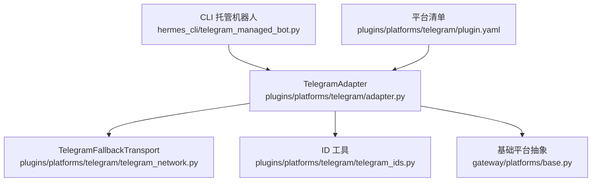
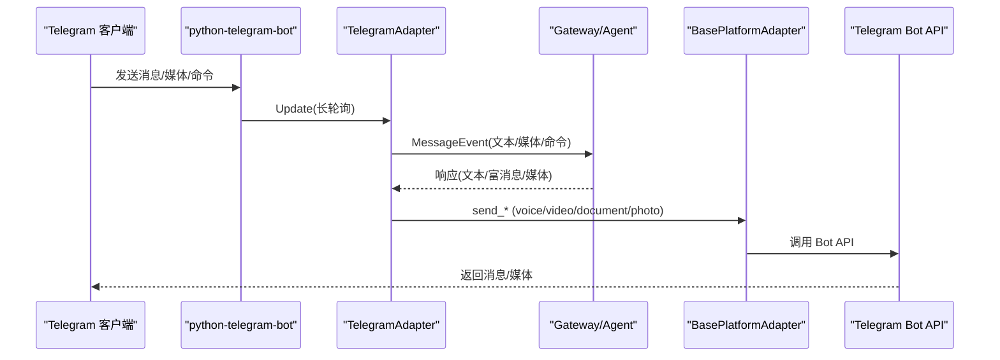
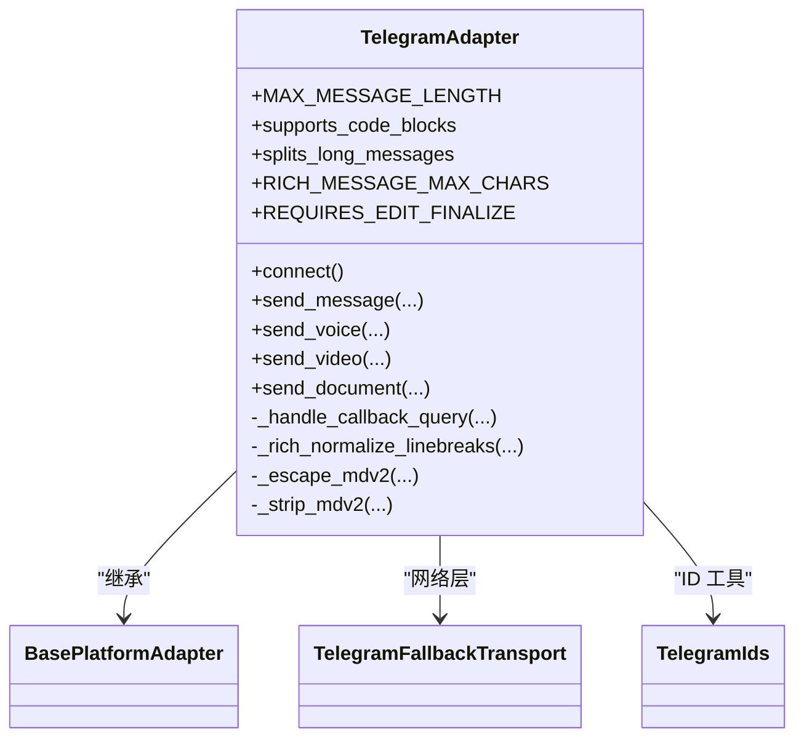
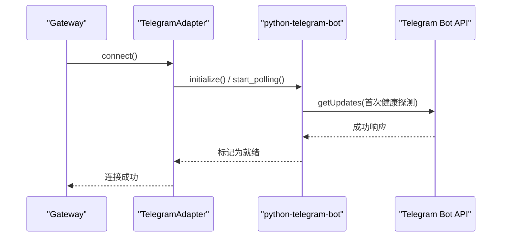
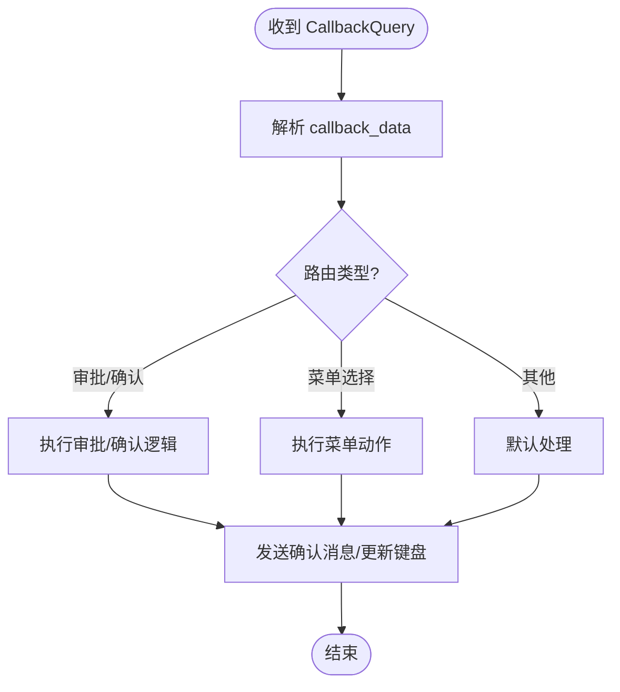
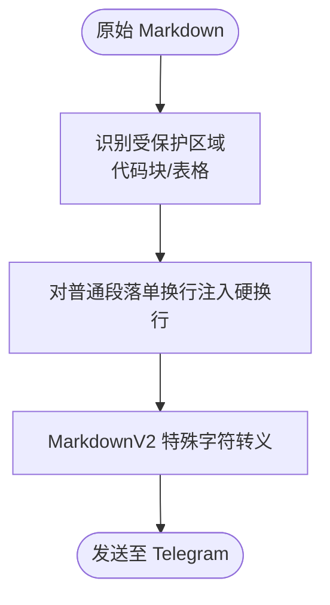
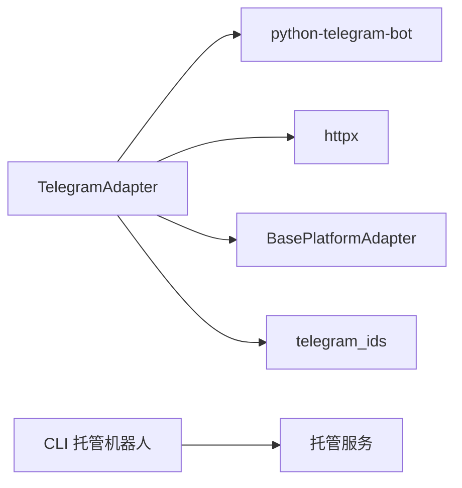

# Telegram 平台集成

<cite>
**本文引用的文件**
- [plugins/platforms/telegram/adapter.py](file://plugins/platforms/telegram/adapter.py)
- [plugins/platforms/telegram/plugin.yaml](file://plugins/platforms/telegram/plugin.yaml)
- [hermes_cli/telegram_managed_bot.py](file://hermes_cli/telegram_managed_bot.py)
- [plugins/platforms/telegram/telegram_network.py](file://plugins/platforms/telegram/telegram_network.py)
- [plugins/platforms/telegram/telegram_ids.py](file://plugins/platforms/telegram/telegram_ids.py)
- [gateway/platforms/base.py](file://gateway/platforms/base.py)
- [tests/gateway/test_telegram_connect.py](file://tests/gateway/test_telegram_connect.py)
- [tests/gateway/test_telegram_audio_vs_voice.py](file://tests/gateway/test_telegram_audio_vs_voice.py)
</cite>

## 目录
1. [简介](#简介)
2. [项目结构](#项目结构)
3. [核心组件](#核心组件)
4. [架构总览](#架构总览)
5. [详细组件分析](#详细组件分析)
6. [依赖关系分析](#依赖关系分析)
7. [性能与可靠性](#性能与可靠性)
8. [配置与部署指南](#配置与部署指南)
9. [消息格式与媒体处理](#消息格式与媒体处理)
10. [权限、命令与交互](#权限、命令与交互)
11. [故障排除指南](#故障排除指南)
12. [结论](#结论)

## 简介
本文件面向在 Hermes Agent 中集成 Telegram Bot 的开发者与运维人员，系统说明如何完成机器人创建、令牌配置、长轮询模式接入、Webhook 模式（通过 Gateway）以及 Telegram 特有能力的适配：内联键盘、回调按钮、文件上传、语音/视频等媒体处理。文档还覆盖群组/私聊/频道消息路由、用户权限管理、命令系统、Markdown 支持、表情符号处理、错误恢复机制，并提供环境变量与安全配置建议及性能优化要点。

## 项目结构
Telegram 集成以插件形式提供，核心由以下模块组成：
- 适配器：实现 Telegram 收发消息、媒体处理、命令与回调、长轮询生命周期管理
- 网络层：提供域名保持的失败转移传输，增强不可达环境下的连通性
- ID 工具：规范化 chat_id（数字或 @username），避免类型转换异常
- CLI 托管机器人：通过托管机器人流程自动创建并获取令牌
- 平台清单：声明所需环境变量与可选能力
- 基础平台抽象：统一的消息事件、发送接口与媒体路由

**图表来源**
- [plugins/platforms/telegram/adapter.py:633-800](file://plugins/platforms/telegram/adapter.py#L633-L800)
- [plugins/platforms/telegram/telegram_network.py:52-157](file://plugins/platforms/telegram/telegram_network.py#L52-L157)
- [plugins/platforms/telegram/telegram_ids.py:23-52](file://plugins/platforms/telegram/telegram_ids.py#L23-L52)
- [hermes_cli/telegram_managed_bot.py:166-359](file://hermes_cli/telegram_managed_bot.py#L166-L359)
- [plugins/platforms/telegram/plugin.yaml:1-36](file://plugins/platforms/telegram/plugin.yaml#L1-L36)
- [gateway/platforms/base.py:4173-4363](file://gateway/platforms/base.py#L4173-L4363)

**章节来源**
- [plugins/platforms/telegram/adapter.py:633-800](file://plugins/platforms/telegram/adapter.py#L633-L800)
- [plugins/platforms/telegram/telegram_network.py:52-157](file://plugins/platforms/telegram/telegram_network.py#L52-L157)
- [plugins/platforms/telegram/telegram_ids.py:23-52](file://plugins/platforms/telegram/telegram_ids.py#L23-L52)
- [hermes_cli/telegram_managed_bot.py:166-359](file://hermes_cli/telegram_managed_bot.py#L166-L359)
- [plugins/platforms/telegram/plugin.yaml:1-36](file://plugins/platforms/telegram/plugin.yaml#L1-L36)
- [gateway/platforms/base.py:4173-4363](file://gateway/platforms/base.py#L4173-L4363)

## 核心组件
- TelegramAdapter：基于 python-telegram-bot 的长轮询适配器，负责连接、消息收发、媒体处理、命令与回调、流式编辑、批处理聚合、超时与重连保护等
- TelegramFallbackTransport：httpx 传输层封装，当主域名不可达时按已知 IP 重试并保持 TLS/SNI
- telegram_ids：chat_id 规范化与用户名识别，避免 int() 转换崩溃
- CLI 托管机器人：通过托管服务创建子机器人并轮询获取令牌
- 平台清单：声明 TELEGRAM_BOT_TOKEN 等必需/可选环境变量
- 基础平台抽象：统一的 send_voice/send_video/send_document 等发送接口与媒体路由

**章节来源**
- [plugins/platforms/telegram/adapter.py:633-800](file://plugins/platforms/telegram/adapter.py#L633-L800)
- [plugins/platforms/telegram/telegram_network.py:52-157](file://plugins/platforms/telegram/telegram_network.py#L52-L157)
- [plugins/platforms/telegram/telegram_ids.py:23-52](file://plugins/platforms/telegram/telegram_ids.py#L23-L52)
- [hermes_cli/telegram_managed_bot.py:166-359](file://hermes_cli/telegram_managed_bot.py#L166-L359)
- [plugins/platforms/telegram/plugin.yaml:1-36](file://plugins/platforms/telegram/plugin.yaml#L1-L36)
- [gateway/platforms/base.py:4173-4363](file://gateway/platforms/base.py#L4173-L4363)

## 架构总览
下图展示从 Telegram 到 Hermes Agent 的核心数据流：客户端消息经适配器进入网关，媒体与文本分别走不同路径；回复通过基础平台抽象统一发送，必要时使用富消息或分块策略。

**图表来源**
- [plugins/platforms/telegram/adapter.py:633-800](file://plugins/platforms/telegram/adapter.py#L633-L800)
- [gateway/platforms/base.py:4173-4363](file://gateway/platforms/base.py#L4173-L4363)

## 详细组件分析

### TelegramAdapter 类图

**图表来源**
- [plugins/platforms/telegram/adapter.py:633-800](file://plugins/platforms/telegram/adapter.py#L633-L800)
- [plugins/platforms/telegram/telegram_network.py:52-157](file://plugins/platforms/telegram/telegram_network.py#L52-L157)
- [plugins/platforms/telegram/telegram_ids.py:23-52](file://plugins/platforms/telegram/telegram_ids.py#L23-L52)

**章节来源**
- [plugins/platforms/telegram/adapter.py:633-800](file://plugins/platforms/telegram/adapter.py#L633-L800)

### 长轮询启动与健康检查时序

**图表来源**
- [plugins/platforms/telegram/adapter.py:575-626](file://plugins/platforms/telegram/adapter.py#L575-L626)

**章节来源**
- [plugins/platforms/telegram/adapter.py:575-626](file://plugins/platforms/telegram/adapter.py#L575-L626)

### 回调按钮处理流程

**图表来源**
- [plugins/platforms/telegram/adapter.py:3909-4040](file://plugins/platforms/telegram/adapter.py#L3909-L4040)
- [plugins/platforms/telegram/adapter.py:5499-5960](file://plugins/platforms/telegram/adapter.py#L5499-L5960)

**章节来源**
- [plugins/platforms/telegram/adapter.py:3909-4040](file://plugins/platforms/telegram/adapter.py#L3909-L4040)
- [plugins/platforms/telegram/adapter.py:5499-5960](file://plugins/platforms/telegram/adapter.py#L5499-L5960)

### 富消息换行与 MarkdownV2 转义流程

**图表来源**
- [plugins/platforms/telegram/adapter.py:461-572](file://plugins/platforms/telegram/adapter.py#L461-L572)

**章节来源**
- [plugins/platforms/telegram/adapter.py:461-572](file://plugins/platforms/telegram/adapter.py#L461-L572)

## 依赖关系分析
- TelegramAdapter 依赖 python-telegram-bot 进行长轮询与消息处理
- 网络层使用 httpx 并通过 TelegramFallbackTransport 实现域名保持的 IP 回退
- ID 工具确保 chat_id 兼容数字与 @username
- 基础平台抽象提供跨平台的发送接口与媒体路由
- CLI 托管机器人通过外部服务协助创建机器人并轮询令牌

**图表来源**
- [plugins/platforms/telegram/adapter.py:237-275](file://plugins/platforms/telegram/adapter.py#L237-L275)
- [plugins/platforms/telegram/telegram_network.py:52-157](file://plugins/platforms/telegram/telegram_network.py#L52-L157)
- [plugins/platforms/telegram/telegram_ids.py:23-52](file://plugins/platforms/telegram/telegram_ids.py#L23-L52)
- [gateway/platforms/base.py:4173-4363](file://gateway/platforms/base.py#L4173-L4363)
- [hermes_cli/telegram_managed_bot.py:166-359](file://hermes_cli/telegram_managed_bot.py#L166-L359)

**章节来源**
- [plugins/platforms/telegram/adapter.py:237-275](file://plugins/platforms/telegram/adapter.py#L237-L275)
- [plugins/platforms/telegram/telegram_network.py:52-157](file://plugins/platforms/telegram/telegram_network.py#L52-L157)
- [plugins/platforms/telegram/telegram_ids.py:23-52](file://plugins/platforms/telegram/telegram_ids.py#L23-L52)
- [gateway/platforms/base.py:4173-4363](file://gateway/platforms/base.py#L4173-L4363)
- [hermes_cli/telegram_managed_bot.py:166-359](file://hermes_cli/telegram_managed_bot.py#L166-L359)

## 性能与可靠性
- 文本批处理与快速路径：短消息更快到达，减少首 token 延迟
- 媒体分组与批量聚合：避免重复中断与频繁编辑
- 严格超时与守护：针对 updater.stop/start/drain 等关键步骤设置上限，防止死锁
- 心跳与卡住检测：对长轮询任务设置“卡住”超时，强制恢复
- 连接池限制：限制每个传输的连接数，避免文件描述符耗尽
- 粘性 IP 与回退：主域名不可达时切换到已知 IP，并在失败后重置粘性

**章节来源**
- [plugins/platforms/telegram/adapter.py:675-785](file://plugins/platforms/telegram/adapter.py#L675-L785)
- [plugins/platforms/telegram/adapter.py:575-626](file://plugins/platforms/telegram/adapter.py#L575-L626)
- [plugins/platforms/telegram/telegram_network.py:61-78](file://plugins/platforms/telegram/telegram_network.py#L61-L78)
- [plugins/platforms/telegram/telegram_network.py:105-157](file://plugins/platforms/telegram/telegram_network.py#L105-L157)

## 配置与部署指南
- 必需环境变量
  - TELEGRAM_BOT_TOKEN：来自 @BotFather 的机器人令牌
- 可选环境变量
  - TELEGRAM_ALLOWED_USERS：允许的用户 ID 列表（逗号分隔）
  - TELEGRAM_ALLOW_ALL_USERS：开发模式允许所有用户
  - TELEGRAM_HOME_CHANNEL / TELEGRAM_HOME_CHANNEL_NAME：通知/定时任务的目标频道
- 托管机器人创建
  - 使用 CLI 托管机器人流程生成配对信息，扫码或通过链接在 Telegram 中创建子机器人，轮询获取令牌
- 安全建议
  - 将令牌作为密码型环境变量管理，避免明文写入配置文件
  - 使用最小权限原则，仅开放必要的用户白名单
  - 在网络受限环境中启用回退传输，提高可用性

**章节来源**
- [plugins/platforms/telegram/plugin.yaml:13-36](file://plugins/platforms/telegram/plugin.yaml#L13-L36)
- [hermes_cli/telegram_managed_bot.py:166-359](file://hermes_cli/telegram_managed_bot.py#L166-L359)

## 消息格式与媒体处理
- 文本格式
  - 支持 MarkdownV2，自动转义特殊字符；富消息路径对段落换行做硬换行注入，保留代码块与表格完整性
- 媒体类型
  - 语音消息（voice）：走 STT 转录管线
  - 音频附件（audio）：不触发 STT，转为文件路径上下文提示
  - 视频/文档/图片：通过基础平台抽象统一发送，按扩展名路由
- 长度限制与分块
  - 最大消息长度与富消息字符上限；超长内容分块发送
- 表情符号
  - 遵循 Telegram 客户端渲染规则，富消息与 MarkdownV2 路径下保持一致显示

**章节来源**
- [plugins/platforms/telegram/adapter.py:461-572](file://plugins/platforms/telegram/adapter.py#L461-L572)
- [gateway/platforms/base.py:4173-4363](file://gateway/platforms/base.py#L4173-L4363)
- [tests/gateway/test_telegram_audio_vs_voice.py:1-128](file://tests/gateway/test_telegram_audio_vs_voice.py#L1-L128)

## 权限、命令与交互
- 用户权限
  - 可通过环境变量控制允许用户列表或允许全部用户（开发模式）
- 命令系统
  - 注册命令处理器，支持群组/私聊/频道的命令分发
- 内联键盘与回调
  - 构建 InlineKeyboardMarkup 与回调数据，处理审批、菜单选择等交互
- 会话与主题
  - 支持论坛主题（thread_id）与群组话题

**章节来源**
- [plugins/platforms/telegram/adapter.py:3909-4040](file://plugins/platforms/telegram/adapter.py#L3909-L4040)
- [plugins/platforms/telegram/adapter.py:5499-5960](file://plugins/platforms/telegram/adapter.py#L5499-L5960)
- [plugins/platforms/telegram/plugin.yaml:13-36](file://plugins/platforms/telegram/plugin.yaml#L13-L36)

## 故障排除指南
- 连接失败或缺少依赖
  - 若未安装 python-telegram-bot 或未配置令牌，connect() 会设置非可重试致命错误，避免后台无限重试
- 网络不可达
  - 启用 TelegramFallbackTransport，自动发现可用 IP 并切换；必要时配置代理
- 长轮询卡住
  - 心跳与卡住检测会在长时间无进展时强制恢复；检查 updater.stop/start/drain 超时是否生效
- 媒体发送超时
  - 视频等媒体发送有更长读取超时；如持续失败，检查网络与代理设置
- 常见问题
  - chat_id 类型错误：使用 normalize_telegram_chat_id 避免 int() 转换崩溃
  - 音频附件误入 STT：确保区分 voice 与 audio，参考测试用例行为

**章节来源**
- [tests/gateway/test_telegram_connect.py:1-57](file://tests/gateway/test_telegram_connect.py#L1-L57)
- [plugins/platforms/telegram/telegram_network.py:231-285](file://plugins/platforms/telegram/telegram_network.py#L231-L285)
- [plugins/platforms/telegram/telegram_ids.py:23-52](file://plugins/platforms/telegram/telegram_ids.py#L23-L52)
- [tests/gateway/test_telegram_audio_vs_voice.py:1-128](file://tests/gateway/test_telegram_audio_vs_voice.py#L1-L128)

## 结论
Hermes Agent 的 Telegram 集成通过适配器、网络回退、ID 工具与基础平台抽象形成稳定可靠的端到端链路。借助长轮询、富消息、内联键盘与媒体处理能力，可在私聊、群组与频道场景下提供一致体验。配合环境变量与托管机器人流程，可实现安全、易用的部署与运维。建议在受限网络环境中启用回退传输，并根据业务需求调整批处理与超时参数以获得最佳性能与稳定性。