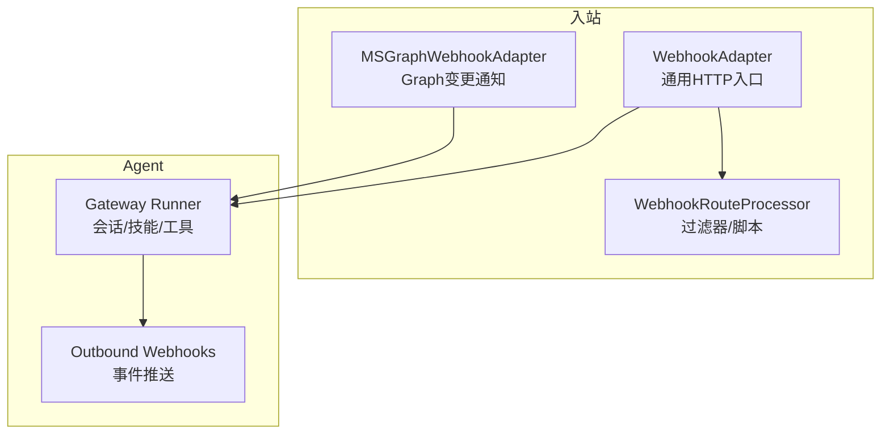
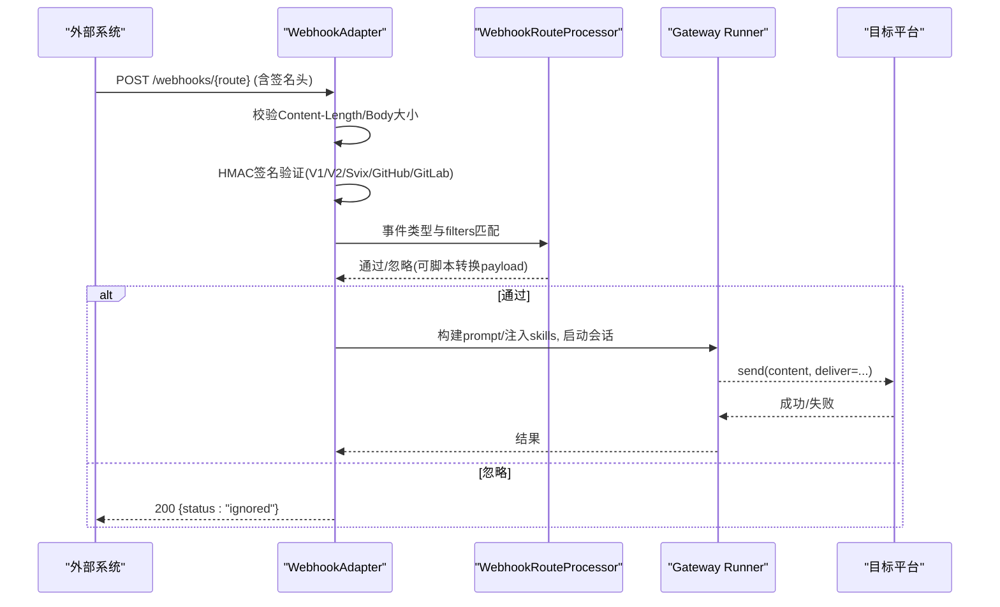
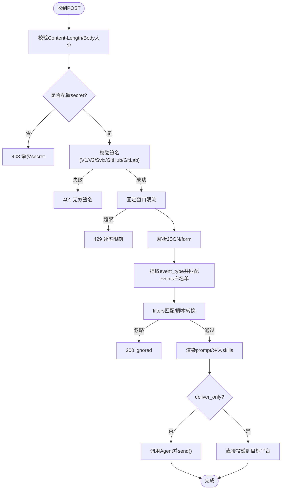
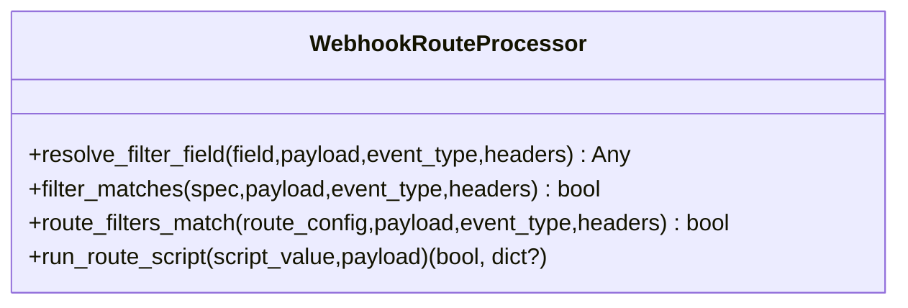
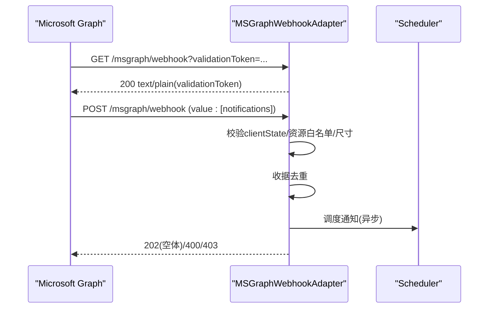
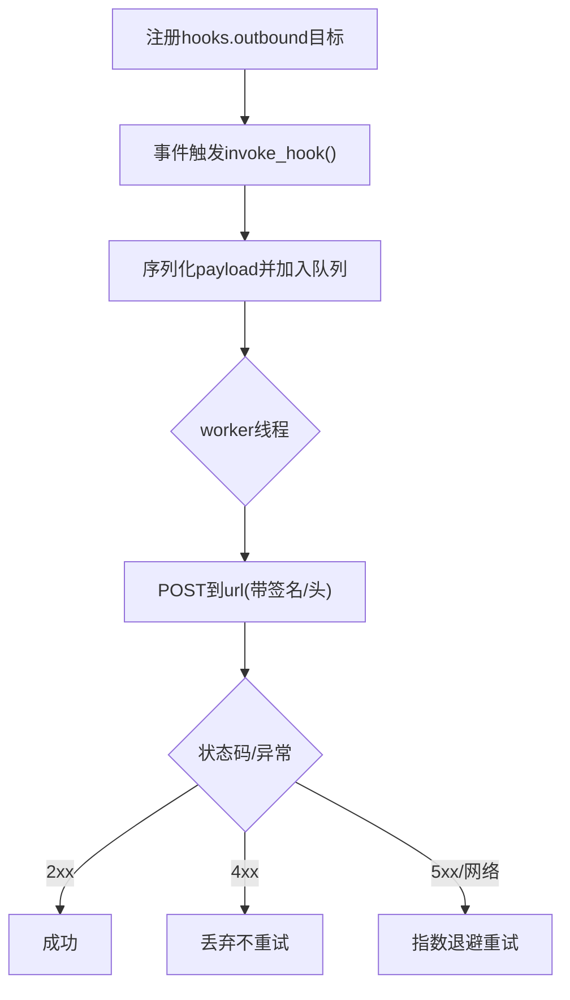
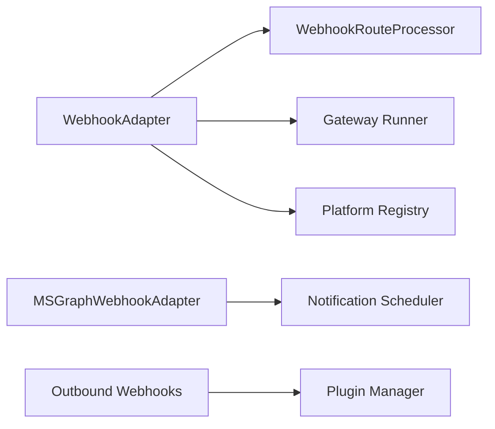

# Webhook 通用集成

<cite>
**本文引用的文件**
- [gateway/platforms/webhook.py](file://gateway/platforms/webhook.py)
- [gateway/platforms/webhook_filters.py](file://gateway/platforms/webhook_filters.py)
- [gateway/platforms/msgraph_webhook.py](file://gateway/platforms/msgraph_webhook.py)
- [agent/outbound_webhooks.py](file://agent/outbound_webhooks.py)
- [tests/gateway/test_webhook_adapter.py](file://tests/gateway/test_webhook_adapter.py)
- [tests/gateway/test_msgraph_webhook.py](file://tests/gateway/test_msgraph_webhook.py)
</cite>

## 目录
1. [简介](#简介)
2. [项目结构](#项目结构)
3. [核心组件](#核心组件)
4. [架构总览](#架构总览)
5. [详细组件分析](#详细组件分析)
6. [依赖关系分析](#依赖关系分析)
7. [性能与容量规划](#性能与容量规划)
8. [故障排查指南](#故障排查指南)
9. [结论](#结论)
10. [附录：配置与自定义过滤器开发](#附录：配置与自定义过滤器开发)

## 简介
本文件面向“通过 HTTP Webhook 接收外部系统消息”的通用集成场景，覆盖请求格式验证、签名验证、错误处理、消息过滤（基于内容、来源、属性）、特殊场景（Microsoft Graph Webhook）订阅管理、变更通知与批量处理，以及安全性（HTTPS、令牌/密钥、访问控制）。同时提供监控日志、错误追踪与性能优化建议，并给出完整配置示例与自定义过滤器开发指南。

## 项目结构
Webhook 相关能力由以下模块组成：
- 通用入站 Webhook 平台适配器：监听 HTTP 端口，校验签名、限流、去重、事件过滤、模板渲染、跨平台投递。
- 路由级过滤器与脚本转换：声明式过滤（字段存在性、包含、正则、文件匹配、逻辑组合）与可执行脚本转换。
- Microsoft Graph Webhook 适配器：专用端点，支持订阅验证握手、资源白名单、clientState 校验、批量通知去重与调度。
- 出站 Webhook：将 Agent 生命周期事件推送到外部 HTTP 端点，带 HMAC 签名与重试策略。

图表来源
- [gateway/platforms/webhook.py:177-344](file://gateway/platforms/webhook.py#L177-L344)
- [gateway/platforms/webhook_filters.py:94-303](file://gateway/platforms/webhook_filters.py#L94-L303)
- [gateway/platforms/msgraph_webhook.py:52-185](file://gateway/platforms/msgraph_webhook.py#L52-L185)
- [agent/outbound_webhooks.py:156-207](file://agent/outbound_webhooks.py#L156-L207)

章节来源
- [gateway/platforms/webhook.py:1-344](file://gateway/platforms/webhook.py#L1-L344)
- [gateway/platforms/webhook_filters.py:1-303](file://gateway/platforms/webhook_filters.py#L1-L303)
- [gateway/platforms/msgraph_webhook.py:1-185](file://gateway/platforms/msgraph_webhook.py#L1-L185)
- [agent/outbound_webhooks.py:1-207](file://agent/outbound_webhooks.py#L1-L207)

## 核心组件
- 通用 Webhook 适配器：提供 /health、/webhooks/{route_name}、/p/{profile}/webhooks/{route_name} 路由；支持 HMAC V1/V2、Svix、GitHub/GitLab 等签名；固定窗口限流；按 delivery_id 去重；body 大小限制；动态订阅热加载；多 profile 复用；静默响应抑制；跨平台投递。
- 过滤器处理器：支持 field.exists/missing/equals/not_equals/contains/in/in_file/regex，以及 all/any/not 组合；可选脚本转换（超时保护、输出脱敏）。
- Microsoft Graph Webhook 适配器：GET 验证握手、POST 批量通知；clientState 校验；资源白名单；源 IP CIDR 白名单；收据去重；健康检查统计。
- 出站 Webhook：注册 hooks.outbound 目标，HMAC-SHA256 签名，队列+单线程 worker 投递，有限重试，禁止 3xx 重定向。

章节来源
- [gateway/platforms/webhook.py:177-800](file://gateway/platforms/webhook.py#L177-L800)
- [gateway/platforms/webhook_filters.py:94-303](file://gateway/platforms/webhook_filters.py#L94-L303)
- [gateway/platforms/msgraph_webhook.py:52-454](file://gateway/platforms/msgraph_webhook.py#L52-L454)
- [agent/outbound_webhooks.py:112-207](file://agent/outbound_webhooks.py#L112-L207)

## 架构总览
下图展示一次典型的外部事件进入、过滤、触发 Agent 并回投到目标平台的流程。

图表来源
- [gateway/platforms/webhook.py:584-800](file://gateway/platforms/webhook.py#L584-L800)
- [gateway/platforms/webhook_filters.py:141-226](file://gateway/platforms/webhook_filters.py#L141-L226)

章节来源
- [gateway/platforms/webhook.py:584-800](file://gateway/platforms/webhook.py#L584-L800)
- [gateway/platforms/webhook_filters.py:141-226](file://gateway/platforms/webhook_filters.py#L141-L226)

## 详细组件分析

### 通用 Webhook 适配器（inbound）
- 安全与鉴权
  - 强制每路由 secret（或全局），INSECURE_NO_AUTH 仅允许本地回环绑定，防止公网暴露。
  - 支持多种签名：X-Hub-Signature-256（GitHub）、X-Gitlab-Token（GitLab）、X-Webhook-Signature（V1）、X-Webhook-Signature-V2（绑定时间戳防重放）、Svix v1。
  - 非 ASCII 输入在比较时采用字节级常量时间比较，避免异常泄露信息。
- 请求与负载
  - 先校验 Content-Length，再读取 body，双重上限保护。
  - JSON 解析失败回退为 form-encoded。
- 事件与过滤
  - 从常见头部或 payload 提取 event_type，支持 events 白名单。
  - 使用 WebhookRouteProcessor 进行 filters 匹配与可选脚本转换。
- 幂等与限流
  - 固定窗口限流（默认每分钟 N 次）。
  - 基于 delivery_id 的去重缓存（TTL 默认 1 小时），定期清理。
- 多 Profile 与动态订阅
  - /p/{profile}/webhooks/{route} 多 profile 复用，需开启 multiplex_profiles。
  - 动态订阅文件 webhook_subscriptions.json 热加载，静态路由优先。
- 响应与投递
  - 支持 deliver_only 直发模式（跳过 Agent，零 LLM 成本）。
  - 支持内置与插件平台投递（telegram、discord、slack、github_comment 等）。
  - 静默响应抑制：当 Agent 返回“无话可说”标记时不投递。

图表来源
- [gateway/platforms/webhook.py:584-800](file://gateway/platforms/webhook.py#L584-L800)
- [gateway/platforms/webhook_filters.py:141-226](file://gateway/platforms/webhook_filters.py#L141-L226)

章节来源
- [gateway/platforms/webhook.py:177-800](file://gateway/platforms/webhook.py#L177-L800)
- [tests/gateway/test_webhook_adapter.py:1-200](file://tests/gateway/test_webhook_adapter.py#L1-L200)

### 路由级过滤器与脚本转换
- 字段解析：支持 payload.event.headers 上下文，点号路径访问字典/列表索引。
- 操作符：exists/missing/equals/not_equals/contains/in/in_file/regex。
- 组合：all/any/not。
- 脚本：支持 bash/python，限定在 ~/.hermes/scripts 下，超时保护，输出脱敏，支持 [SILENT] 或 __hermes_ignore__ 忽略事件。

图表来源
- [gateway/platforms/webhook_filters.py:94-303](file://gateway/platforms/webhook_filters.py#L94-L303)

章节来源
- [gateway/platforms/webhook_filters.py:94-303](file://gateway/platforms/webhook_filters.py#L94-L303)

### Microsoft Graph Webhook 适配器
- 端点：/msgraph/webhook（GET 验证握手、POST 变更通知），/health 健康检查。
- 安全：
  - 必须配置 client_state，用于校验通知中的 clientState（常量时间比较）。
  - 可选 allowed_source_cidrs 限制来源 IP 段；公网绑定且未配置时会拒绝启动。
  - 支持 accepted_resources 前缀匹配过滤资源。
- 批量与去重：
  - 支持 value 数组批量通知；按 id 或哈希生成 receipt_key 去重。
  - 接受或重复计数通过 /health 暴露。
- 事件构造：将通知渲染为 MessageEvent 并调度处理（异步任务）。

图表来源
- [gateway/platforms/msgraph_webhook.py:153-185](file://gateway/platforms/msgraph_webhook.py#L153-L185)
- [gateway/platforms/msgraph_webhook.py:219-314](file://gateway/platforms/msgraph_webhook.py#L219-L314)
- [gateway/platforms/msgraph_webhook.py:385-454](file://gateway/platforms/msgraph_webhook.py#L385-L454)

章节来源
- [gateway/platforms/msgraph_webhook.py:52-454](file://gateway/platforms/msgraph_webhook.py#L52-L454)
- [tests/gateway/test_msgraph_webhook.py:1-200](file://tests/gateway/test_msgraph_webhook.py#L1-L200)

### 出站 Webhook（outbound）
- 配置：hooks.outbound 列表，每项包含 url、events、可选 secret_env/secret、matcher、timeout。
- 投递：队列+单线程 worker，最多两次重试，禁止 3xx 重定向，4xx 不重试。
- 签名：可选 HMAC-SHA256，头 X-Hermes-Signature-256。
- 安全：HERMES_SAFE_MODE 跳过注册；http:// 会告警建议使用 https。

图表来源
- [agent/outbound_webhooks.py:156-207](file://agent/outbound_webhooks.py#L156-L207)
- [agent/outbound_webhooks.py:380-570](file://agent/outbound_webhooks.py#L380-L570)

章节来源
- [agent/outbound_webhooks.py:112-570](file://agent/outbound_webhooks.py#L112-L570)

## 依赖关系分析
- WebhookAdapter 依赖：
  - aiohttp（HTTP 服务器与路由）
  - WebhookRouteProcessor（过滤器/脚本）
  - Gateway Runner（跨平台投递）
  - 插件平台注册表（动态发现 deliver 目标）
- MSGraphWebhookAdapter 依赖：
  - aiohttp
  - ipaddress（CIDR 解析）
  - 通知调度器（回调或异步任务）
- Outbound Webhooks 依赖：
  - urllib（HTTP 客户端）
  - 插件管理器（注册钩子）

图表来源
- [gateway/platforms/webhook.py:56-66](file://gateway/platforms/webhook.py#L56-L66)
- [gateway/platforms/msgraph_webhook.py:22-29](file://gateway/platforms/msgraph_webhook.py#L22-L29)
- [agent/outbound_webhooks.py:182-207](file://agent/outbound_webhooks.py#L182-L207)

章节来源
- [gateway/platforms/webhook.py:56-66](file://gateway/platforms/webhook.py#L56-L66)
- [gateway/platforms/msgraph_webhook.py:22-29](file://gateway/platforms/msgraph_webhook.py#L22-L29)
- [agent/outbound_webhooks.py:182-207](file://agent/outbound_webhooks.py#L182-L207)

## 性能与容量规划
- 请求侧
  - 启用 client_max_size 限制 body 大小，防御超大负载。
  - 固定窗口限流（默认每分钟 N 次），可按路由调整。
  - 去重缓存 TTL 默认 1 小时，定期清理，避免内存增长。
- 处理侧
  - 脚本执行在独立线程中运行，避免阻塞事件循环；设置超时保护。
  - 静默响应抑制减少不必要的投递开销。
- 存储与清理
  - delivery_info 与 seen_deliveries 均按 TTL 清理，保持有界。
- 监控
  - /health 暴露平台状态与计数器（Graph 适配器）。
  - 关键路径日志：签名失败、限流、脚本超时、投递失败等。

[本节为通用指导，无需特定文件引用]

## 故障排查指南
- 401 无效签名
  - 确认发送方使用的签名算法与头名匹配（GitHub/GitLab/V1/V2/Svix）。
  - 核对 secret 与时间戳（V2）是否正确。
  - 参考测试用例对非 ASCII 输入的健壮性。
- 403 缺少 secret 或 INSECURE_NO_AUTH 误用
  - 确保每个路由配置了 secret；若使用 INSECURE_NO_AUTH，仅允许本地回环绑定。
- 413 负载过大
  - 检查 Content-Length 与实际 body；必要时增大 max_body_bytes。
- 429 速率限制
  - 提高 rate_limit 或拆分路由；观察日志定位热点路由。
- 400 解析失败
  - 确认 JSON 格式；或回退到 form-encoded。
- Graph 通知被拒
  - 检查 clientState、accepted_resources、allowed_source_cidrs。
  - 查看 /health 的 accepted/duplicates 计数。
- 出站投递失败
  - 关注 3xx 重定向会被拒绝；4xx 不重试；5xx 会重试。
  - 确认 URL 为 https 且可达；检查签名与超时。

章节来源
- [tests/gateway/test_webhook_adapter.py:130-200](file://tests/gateway/test_webhook_adapter.py#L130-L200)
- [gateway/platforms/msgraph_webhook.py:219-314](file://gateway/platforms/msgraph_webhook.py#L219-L314)
- [agent/outbound_webhooks.py:520-570](file://agent/outbound_webhooks.py#L520-L570)

## 结论
本机制提供了通用的 Webhook 接入能力，涵盖多协议签名、严格的安全校验、灵活的路由级过滤与脚本转换、幂等与限流保障，以及针对 Microsoft Graph 的专用适配。配合出站 Webhook，可实现端到端的内外事件闭环。生产部署建议始终启用 HTTPS、最小权限的访问控制、合理的限流与去重策略，并通过健康检查与日志进行持续观测。

[本节为总结，无需特定文件引用]

## 附录：配置与自定义过滤器开发

### 通用 Webhook 路由配置要点
- 必填项
  - secret：每条路由或全局配置；测试可用 INSECURE_NO_AUTH（仅限本地回环）。
  - prompt：模板字符串，支持点号变量解析。
  - deliver：目标平台名称（如 telegram、discord、slack、github_comment 等）。
- 可选项
  - events：事件类型白名单。
  - skills：自动注入的技能命令。
  - deliver_only：跳过 Agent，直接将 body 作为消息投递。
  - filters：声明式过滤（field/exists/missing/equals/contains/in/in_file/regex/all/any/not）。
  - script：外部脚本路径（位于 ~/.hermes/scripts），用于转换或增强 payload。
  - profile：绑定到指定 profile（需开启 multiplex_profiles）。
  - rate_limit、max_body_bytes、script_timeout_seconds：性能与安全参数。

章节来源
- [gateway/platforms/webhook.py:1-31](file://gateway/platforms/webhook.py#L1-L31)
- [gateway/platforms/webhook.py:186-243](file://gateway/platforms/webhook.py#L186-L243)
- [gateway/platforms/webhook.py:584-800](file://gateway/platforms/webhook.py#L584-L800)

### Microsoft Graph Webhook 配置要点
- 必填项
  - client_state：用于校验通知中的 clientState。
- 推荐项
  - allowed_source_cidrs：限制来源 IP 段（公网绑定时必须配置）。
  - accepted_resources：资源白名单（支持前缀匹配）。
  - webhook_path、health_path：自定义路径。
  - max_body_bytes：限制通知体大小。
  - prompt：自定义通知渲染模板。

章节来源
- [gateway/platforms/msgraph_webhook.py:55-87](file://gateway/platforms/msgraph_webhook.py#L55-L87)
- [gateway/platforms/msgraph_webhook.py:148-185](file://gateway/platforms/msgraph_webhook.py#L148-L185)
- [gateway/platforms/msgraph_webhook.py:336-418](file://gateway/platforms/msgraph_webhook.py#L336-L418)

### 自定义过滤器开发指南
- 使用 filters 列表或对象，结合 field 表达式与操作符实现条件过滤。
- 常用组合：
  - all：全部条件满足。
  - any：任一条件满足。
  - not：取反。
- 字段解析：
  - 支持 payload、event、headers 上下文，点号访问嵌套结构与列表索引。
- 文件匹配：
  - in_file 支持 JSON 或逐行文本，便于维护白名单/黑名单。
- 脚本扩展：
  - 在 ~/.hermes/scripts 下编写脚本，输入为 JSON payload，输出为 JSON 对象或 [SILENT]。
  - 超时保护与输出脱敏已内置。

章节来源
- [gateway/platforms/webhook_filters.py:104-226](file://gateway/platforms/webhook_filters.py#L104-L226)
- [gateway/platforms/webhook_filters.py:228-303](file://gateway/platforms/webhook_filters.py#L228-L303)

### 出站 Webhook 配置要点
- hooks.outbound 列表项：
  - url：目标地址（建议使用 https）。
  - events：事件名列表（如 on_session_end、pre_tool_call 等）。
  - secret_env 或 secret：用于计算 HMAC-SHA256。
  - matcher：仅对 pre_tool_call/post_tool_call 生效的工具名匹配。
  - timeout：单次尝试超时秒数（1-60）。
- 行为：
  - 队列+单线程 worker 投递，最多两次重试，禁止 3xx 重定向。
  - 4xx 视为目标错误，不重试；5xx/网络错误会重试。

章节来源
- [agent/outbound_webhooks.py:32-65](file://agent/outbound_webhooks.py#L32-L65)
- [agent/outbound_webhooks.py:250-355](file://agent/outbound_webhooks.py#L250-L355)
- [agent/outbound_webhooks.py:520-570](file://agent/outbound_webhooks.py#L520-L570)