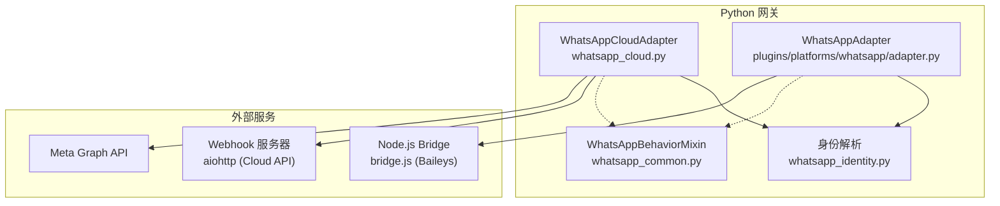
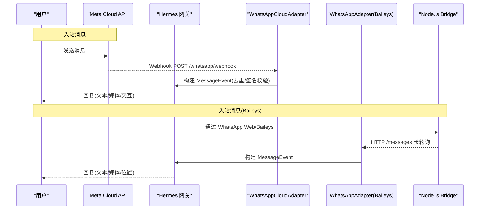
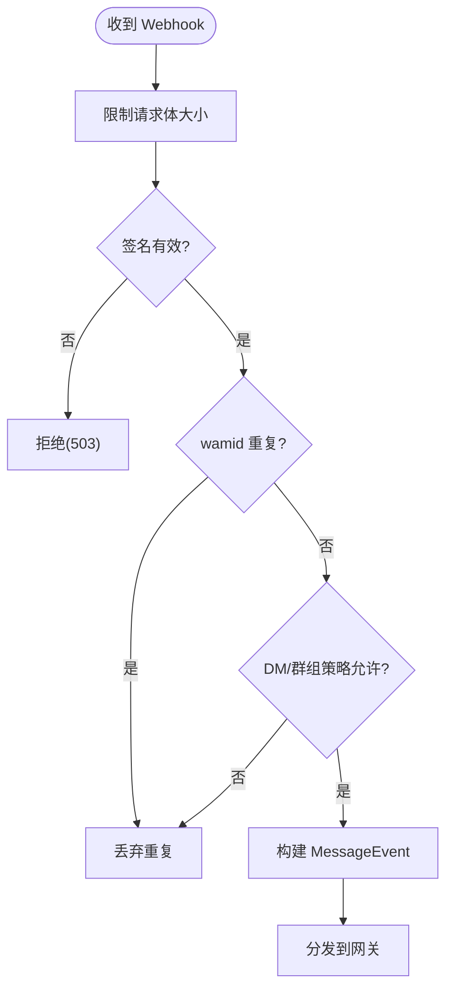
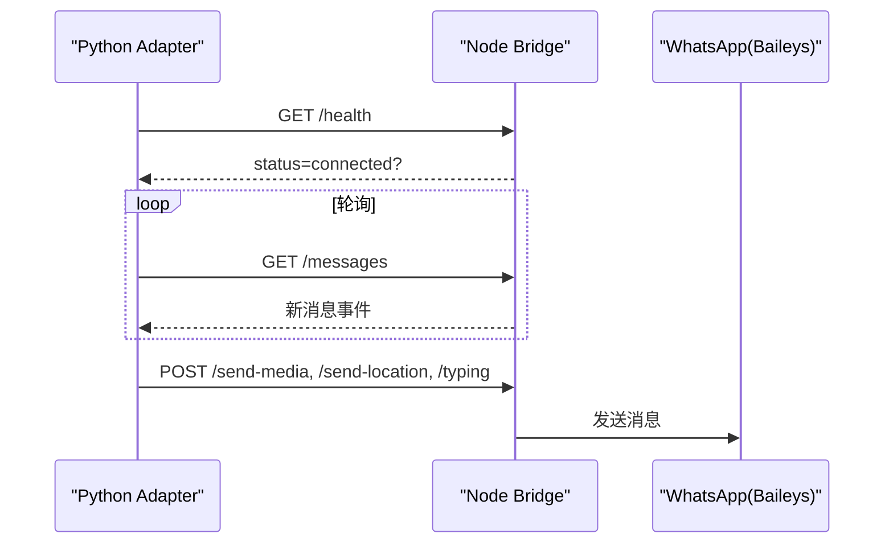
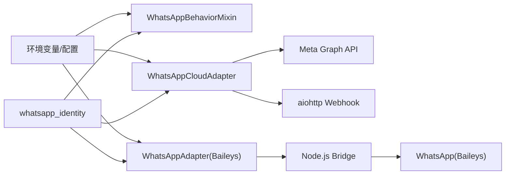

# WhatsApp 平台集成

<cite>
**本文引用的文件**
- [whatsapp_cloud.py](file://gateway/platforms/whatsapp_cloud.py)
- [whatsapp_common.py](file://gateway/platforms/whatsapp_common.py)
- [whatsapp_identity.py](file://gateway/whatsapp_identity.py)
- [setup_whatsapp_cloud.py](file://hermes_cli/setup_whatsapp_cloud.py)
- [adapter.py](file://plugins/platforms/whatsapp/adapter.py)
- [bridge.js](file://scripts/whatsapp-bridge/bridge.js)
- [bridge_helpers.js](file://scripts/whatsapp-bridge/bridge_helpers.js)
</cite>

## 目录
1. [简介](#简介)
2. [项目结构](#项目结构)
3. [核心组件](#核心组件)
4. [架构总览](#架构总览)
5. [详细组件分析](#详细组件分析)
6. [依赖关系分析](#依赖关系分析)
7. [性能与可靠性](#性能与可靠性)
8. [故障排查指南](#故障排查指南)
9. [合规与隐私](#合规与隐私)
10. [结论](#结论)

## 简介
本文件面向在 Hermes Agent 中集成 WhatsApp Business API（Meta Cloud API）与第三方客户端（如基于 Baileys 的 WhatsApp Bridge）的工程实践。文档覆盖：
- Meta 开发者账户设置、业务账号配置与电话号码验证
- 消息类型支持：文本、媒体、位置、联系人、模板消息
- 对话管理、消息状态跟踪、已读回执与用户身份识别
- WhatsApp Cloud API 与第三方客户端（Baileys/BlueBubbles 等）集成差异
- Webhook 设置、消息路由、错误处理与重试
- 合规性要求、隐私保护与性能优化建议

## 项目结构
Hermes 对 WhatsApp 的支持由“行为层 + 传输适配层”组成：
- 行为层：WhatsAppBehaviorMixin，提供 DM/群组策略、@提及检测、Markdown→WhatsApp 格式转换、消息分片等通用逻辑
- 传输适配层：
  - WhatsApp Cloud API 适配器：通过 Graph API 发送消息，内置 aiohttp Webhook 接收 Meta 回调
  - WhatsApp 个人号桥接适配器：启动 Node.js 进程（bridge.js），通过 HTTP 与 Python 网关通信
- 身份解析：whatsapp_identity，统一 JID/LID 归一化与别名展开，确保授权与会话键一致

图表来源
- [whatsapp_cloud.py:203-495](file://gateway/platforms/whatsapp_cloud.py#L203-L495)
- [adapter.py:381-800](file://plugins/platforms/whatsapp/adapter.py#L381-L800)
- [whatsapp_common.py:64-126](file://gateway/platforms/whatsapp_common.py#L64-L126)
- [whatsapp_identity.py:48-207](file://gateway/whatsapp_identity.py#L48-L207)

章节来源
- [whatsapp_cloud.py:1-120](file://gateway/platforms/whatsapp_cloud.py#L1-L120)
- [whatsapp_common.py:1-30](file://gateway/platforms/whatsapp_common.py#L1-L30)
- [adapter.py:1-16](file://plugins/platforms/whatsapp/adapter.py#L1-L16)

## 核心组件
- WhatsAppCloudAdapter：实现 Cloud API 出站（Graph API）与入站（Webhook），包含签名校验、wamid 去重、typing/read 指示器、交互式消息（按钮/列表）、媒体上传与下载、24 小时会话窗口与模板回退等
- WhatsAppBehaviorMixin：跨适配器的共享行为（DM/群组策略、@提及、Markdown 转换、分片、前缀）
- WhatsAppAdapter（Baileys 桥）：启动并管理 Node.js bridge 进程，轮询消息、发送文本/媒体/位置、编辑消息、打字指示器等
- whatsapp_identity：JID/LID 归一化与别名展开，保证授权与会话一致性
- setup_whatsapp_cloud：交互式向导，引导完成 Meta 应用、Token、App Secret、Verify Token、收件人白名单等配置

章节来源
- [whatsapp_cloud.py:203-495](file://gateway/platforms/whatsapp_cloud.py#L203-L495)
- [whatsapp_common.py:64-126](file://gateway/platforms/whatsapp_common.py#L64-L126)
- [adapter.py:381-800](file://plugins/platforms/whatsapp/adapter.py#L381-L800)
- [whatsapp_identity.py:48-207](file://gateway/whatsapp_identity.py#L48-L207)
- [setup_whatsapp_cloud.py:232-542](file://hermes_cli/setup_whatsapp_cloud.py#L232-L542)

## 架构总览
下图展示 Cloud API 与 Baileys 桥两种路径的消息流：

图表来源
- [whatsapp_cloud.py:435-495](file://gateway/platforms/whatsapp_cloud.py#L435-L495)
- [bridge.js:1-200](file://scripts/whatsapp-bridge/bridge.js#L1-L200)
- [adapter.py:509-800](file://plugins/platforms/whatsapp/adapter.py#L509-L800)

## 详细组件分析

### WhatsApp Cloud API 适配器
- 连接与生命周期
  - connect() 检查依赖（aiohttp/httpx）、创建 httpx 客户端、启动 aiohttp Webhook 服务（健康检查、verify token、webhook 处理）
  - disconnect() 清理 runner 与 http 客户端
- 出站消息
  - send() 调用 Graph API 发送文本，支持引用上下文、自动分片、记录 rich_sent_store 以支持“引用原文”
  - send_typing() 同时标记已读与显示“正在输入”，使用最近 inbound wamid
- 入站消息
  - Webhook 处理：限制请求体大小、X-Hub-Signature-256 HMAC 校验、wamid 去重缓存、按策略放行（DM/群组/@提及）
- 交互消息
  - 按钮/列表：send_clarify 等，内部通过 _post_interactive 封装
- 媒体
  - 定义各类型大小上限；根据 MIME 推断扩展名；下载/上传流程（Phase 4+）
- 会话窗口与模板
  - Phase 5：24 小时窗口内可发交互消息；超出窗口时走模板消息回退

图表来源
- [whatsapp_cloud.py:153-161](file://gateway/platforms/whatsapp_cloud.py#L153-L161)
- [whatsapp_cloud.py:435-495](file://gateway/platforms/whatsapp_cloud.py#L435-L495)
- [whatsapp_common.py:390-423](file://gateway/platforms/whatsapp_common.py#L390-L423)

章节来源
- [whatsapp_cloud.py:203-800](file://gateway/platforms/whatsapp_cloud.py#L203-L800)

### WhatsApp 行为层（WhatsAppBehaviorMixin）
- 访问控制
  - DM/群组策略：open/allowlist/pairing/disabled
  - @提及检测：显式 mention 与正则模式匹配
  - 广播/频道过滤：status@broadcast、@newsletter 等伪聊天不处理
- 格式化
  - Markdown→WhatsApp 语法转换（粗体、斜体、删除线、代码块保护、链接转换）
  - 去除不可见字符与异常空白，避免渲染异常
- 分片与前缀
  - 计算 outgoing chunk limit，保留前缀空间；Cloud API 无 self-chat 概念，默认无前缀

章节来源
- [whatsapp_common.py:64-126](file://gateway/platforms/whatsapp_common.py#L64-L126)
- [whatsapp_common.py:148-178](file://gateway/platforms/whatsapp_common.py#L148-L178)
- [whatsapp_common.py:390-499](file://gateway/platforms/whatsapp_common.py#L390-L499)

### WhatsApp 身份解析（whatsapp_identity）
- normalize_whatsapp_identifier：剥离 JID/LID/device/+ 前缀，得到稳定数字 ID
- to_whatsapp_jid：将裸手机号转为桥安全的 JID（用于出站）
- expand_whatsapp_aliases/canonical_whatsapp_identifier：读取 lid-mapping-*.json，展开所有等价标识，选择最短稳定形式作为 canonical

章节来源
- [whatsapp_identity.py:48-207](file://gateway/whatsapp_identity.py#L48-L207)

### Baileys 桥（Node.js bridge）
- 角色：独立 Node.js 进程，通过 HTTP 暴露端点供 Python 适配器调用
- 能力：
  - 长轮询获取新消息（/messages）
  - 发送文本、媒体、位置、编辑消息、打字指示器
  - 维护消息存储、版本解析、重连调度、所有者消息门控
- 与 Python 侧协作：
  - adapter.py 负责进程生命周期、依赖安装、健康检查、日志与 PID 管理
  - bridge.js 负责具体 WhatsApp 协议交互

图表来源
- [bridge.js:1-200](file://scripts/whatsapp-bridge/bridge.js#L1-L200)
- [bridge_helpers.js:160-190](file://scripts/whatsapp-bridge/bridge_helpers.js#L160-L190)
- [adapter.py:509-800](file://plugins/platforms/whatsapp/adapter.py#L509-L800)

章节来源
- [bridge.js:1-200](file://scripts/whatsapp-bridge/bridge.js#L1-L200)
- [bridge_helpers.js:1-200](file://scripts/whatsapp-bridge/bridge_helpers.js#L1-L200)
- [adapter.py:381-800](file://plugins/platforms/whatsapp/adapter.py#L381-L800)

### 配置向导（setup_whatsapp_cloud）
- 字段校验：Phone Number ID、Access Token、App Secret、App ID/WABA ID、Verify Token、Allowed Users
- 输出后续步骤：启动 cloudflared 隧道、启动网关、在 Meta 控制台配置 Webhook、添加测试号码、端到端验证 curl 命令

章节来源
- [setup_whatsapp_cloud.py:52-157](file://hermes_cli/setup_whatsapp_cloud.py#L52-L157)
- [setup_whatsapp_cloud.py:232-542](file://hermes_cli/setup_whatsapp_cloud.py#L232-L542)

## 依赖关系分析
- 运行时依赖
  - Cloud API：aiohttp（Webhook 服务）、httpx（Graph API 客户端）
  - Baileys 桥：Node.js/npm，自动安装依赖；可选 ffmpeg（语音转码）
- 配置与环境变量
  - Cloud API：WHATSAPP_CLOUD_PHONE_NUMBER_ID、WHATSAPP_CLOUD_ACCESS_TOKEN、WHATSAPP_CLOUD_APP_SECRET、WHATSAPP_CLOUD_VERIFY_TOKEN、WHATSAPP_CLOUD_WEBHOOK_*、WHATSAPP_CLOUD_API_VERSION
  - 行为策略：WHATSAPP_DM_POLICY、WHATSAPP_GROUP_POLICY、WHATSAPP_ALLOWED_USERS、WHATSAPP_MENTION_PATTERNS、WHATSAPP_FREE_RESPONSE_CHATS
- 身份映射：whatsapp/session/lid-mapping-*.json（Bridge 生成）

图表来源
- [whatsapp_cloud.py:217-247](file://gateway/platforms/whatsapp_cloud.py#L217-L247)
- [whatsapp_common.py:127-178](file://gateway/platforms/whatsapp_common.py#L127-L178)
- [adapter.py:414-458](file://plugins/platforms/whatsapp/adapter.py#L414-L458)
- [whatsapp_identity.py:121-207](file://gateway/whatsapp_identity.py#L121-L207)

章节来源
- [whatsapp_cloud.py:27-40](file://gateway/platforms/whatsapp_cloud.py#L27-L40)
- [adapter.py:358-378](file://plugins/platforms/whatsapp/adapter.py#L358-L378)
- [whatsapp_identity.py:121-207](file://gateway/whatsapp_identity.py#L121-L207)

## 性能与可靠性
- 入站去重：wamid 去重缓存（FIFO 限容），降低重复投递影响
- 请求体限制：Webhook 最大请求体限制，防止大负载攻击
- 出站分片：长消息自动分片，避免单条超限
- 并发与超时：httpx 客户端使用平台级连接限制；发送带超时，避免阻塞
- 健壮性：
  - Cloud API：typing/read 指示器失败静默降级，不影响主路径
  - Baileys 桥：进程守护、健康检查、版本哈希比对、自动重启陈旧进程
- 媒体处理：MIME→扩展名映射修正，ffmpeg 缺失时优雅降级为附件

章节来源
- [whatsapp_cloud.py:99-118](file://gateway/platforms/whatsapp_cloud.py#L99-L118)
- [whatsapp_cloud.py:607-660](file://gateway/platforms/whatsapp_cloud.py#L607-L660)
- [adapter.py:509-800](file://plugins/platforms/whatsapp/adapter.py#L509-L800)

## 故障排查指南
- Webhook 无法验证
  - 确认 WHATSAPP_CLOUD_APP_SECRET 已设置；未设置时入站 POST 将被拒绝（503）
  - 使用 setup 向导生成的 verify token 在 Meta 控制台验证
- 入站被拒绝
  - 检查 DM/群组策略与 allowlist；确认 sender_id 经 identity 模块归一化后在白名单中
- 消息未送达或报错
  - 查看 Graph API 返回的错误码与消息体；Cloud API 会记录结构化错误
- 桥接进程异常
  - 检查 bridge.log；确认 Node.js 可用、npm install 成功、端口未被占用
  - 健康检查 /health 返回 status=connected 再视为就绪
- 媒体问题
  - 确认文件大小不超过类型上限；检查 MIME 与扩展名映射；缺少 ffmpeg 时语音将以附件形式发送

章节来源
- [setup_whatsapp_cloud.py:340-367](file://hermes_cli/setup_whatsapp_cloud.py#L340-L367)
- [whatsapp_cloud.py:557-570](file://gateway/platforms/whatsapp_cloud.py#L557-L570)
- [adapter.py:509-800](file://plugins/platforms/whatsapp/adapter.py#L509-L800)

## 合规与隐私
- 数据最小化：仅缓存必要的 wamid 与最近消息 ID，内存有限制
- 安全校验：Webhook 使用 X-Hub-Signature-256 进行 HMAC 校验，防止伪造
- 访问控制：DM/群组策略与白名单严格管控入站；交互式操作需二次授权
- 隐私脱敏：输出中隐藏敏感信息（令牌、密钥等）；终端工具结果错误脱敏
- 合规提示：遵循 Meta 业务政策与隐私条款；生产环境建议使用系统用户永久令牌与受控网络

章节来源
- [whatsapp_cloud.py:99-118](file://gateway/platforms/whatsapp_cloud.py#L99-L118)
- [whatsapp_cloud.py:484-494](file://gateway/platforms/whatsapp_cloud.py#L484-L494)
- [whatsapp_common.py:254-289](file://gateway/platforms/whatsapp_common.py#L254-L289)

## 结论
Hermes 提供了两套 WhatsApp 集成路径：
- WhatsApp Cloud API：生产级、稳定、官方支持，适合企业场景
- Baileys 桥：适用于个人号或非官方场景，需注意风险与稳定性

两者共享行为层，具备完善的策略控制、格式转换、消息分片与错误处理。通过 setup 向导与身份解析模块，可快速完成配置与权限管理。在生产环境中，建议优先采用 Cloud API，并结合 Webhook 安全校验、访问控制与性能优化措施，确保高可用与合规。