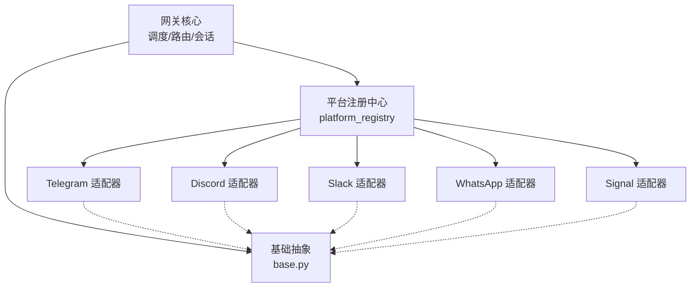
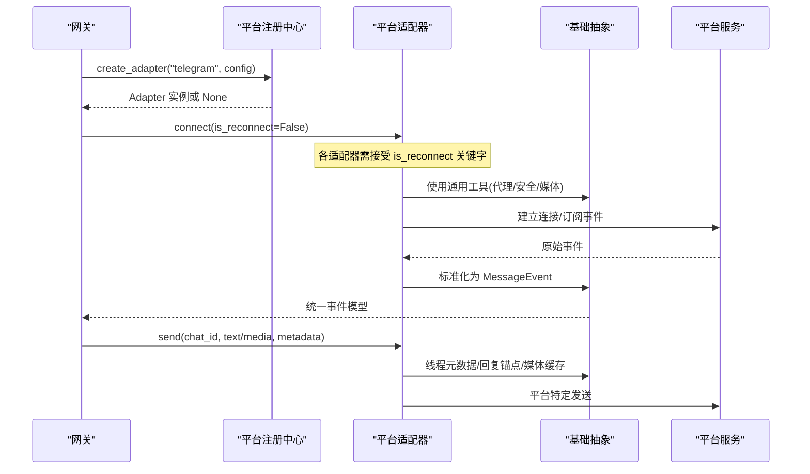
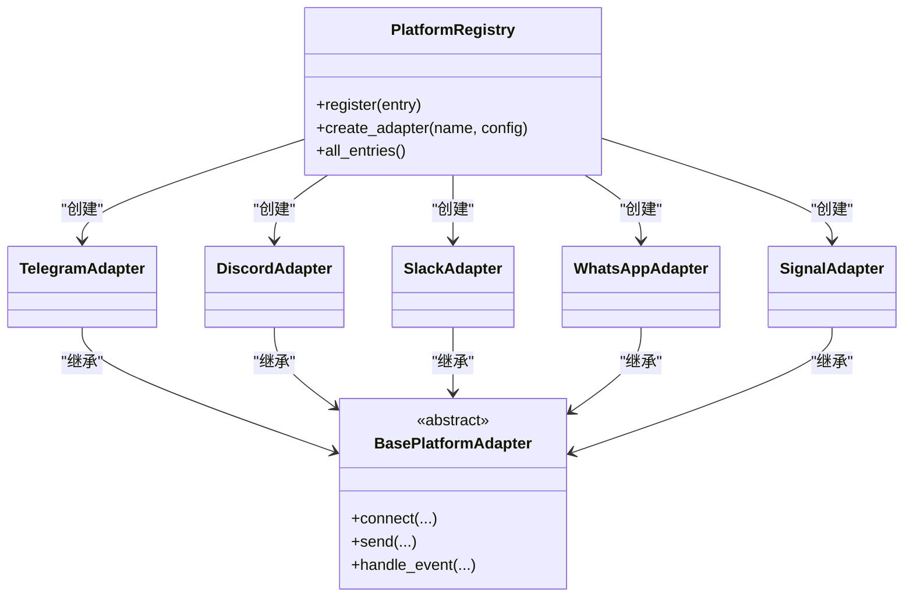

# 多平台消息集成

<cite>
**本文引用的文件**
- [gateway/platforms/base.py](file://gateway/platforms/base.py)
- [gateway/platform_registry.py](file://gateway/platform_registry.py)
- [plugins/platforms/telegram/adapter.py](file://plugins/platforms/telegram/adapter.py)
- [plugins/platforms/discord/adapter.py](file://plugins/platforms/discord/adapter.py)
- [plugins/platforms/slack/adapter.py](file://plugins/platforms/slack/adapter.py)
- [plugins/platforms/whatsapp/adapter.py](file://plugins/platforms/whatsapp/adapter.py)
- [gateway/platforms/signal.py](file://gateway/platforms/signal.py)
- [tests/gateway/test_adapter_connect_is_reconnect_contract.py](file://tests/gateway/test_adapter_connect_is_reconnect_contract.py)
</cite>

## 目录
1. [简介](#简介)
2. [项目结构](#项目结构)
3. [核心组件](#核心组件)
4. [架构总览](#架构总览)
5. [详细组件分析](#详细组件分析)
6. [依赖关系分析](#依赖关系分析)
7. [性能与可靠性](#性能与可靠性)
8. [故障排除指南](#故障排除指南)
9. [结论](#结论)
10. [附录：配置与部署要点](#附录配置与部署要点)

## 简介
本文件面向 Hermes Agent 的多平台消息集成功能，系统性说明如何以适配器模式统一接入 Telegram、Discord、Slack、WhatsApp、Signal、微信等消息平台。文档覆盖统一消息处理架构、跨平台消息格式转换、会话与线程管理、权限控制、消息投递机制、错误处理与重试策略，并提供各平台的配置与部署要点及最佳实践。

## 项目结构
Hermes 将“平台适配层”与“网关核心”解耦：
- 平台适配器：每个平台一个适配器模块，实现统一的连接、收发消息、媒体处理、线程与会话语义。
- 基础抽象：提供 BasePlatformAdapter、事件模型、发送结果、媒体缓存、代理与安全工具等通用能力。
- 注册中心：集中发现、校验、创建适配器实例，支持插件化扩展与延迟加载。
- 测试契约：通过静态 AST 检查确保所有适配器 connect() 签名兼容重连参数，避免静默断连。

图表来源
- [gateway/platform_registry.py:183-382](file://gateway/platform_registry.py#L183-L382)
- [gateway/platforms/base.py:1-120](file://gateway/platforms/base.py#L1-L120)

章节来源
- [gateway/platform_registry.py:1-182](file://gateway/platform_registry.py#L1-L182)
- [gateway/platforms/base.py:1-120](file://gateway/platforms/base.py#L1-L120)

## 核心组件
- 平台注册中心（PlatformRegistry）
  - 负责平台条目注册、依赖探测、配置校验、工厂创建适配器实例。
  - 支持延迟加载，避免启动时引入重型 SDK。
  - 提供 create_adapter(name, config) 统一入口。
- 基础抽象（BasePlatformAdapter）
  - 定义统一的事件模型、消息类型、发送结果、媒体缓存、代理与安全工具。
  - 提供线程元数据构建、回复锚点选择、TTS 输出路径生成、入站媒体大小限制等通用逻辑。
- 平台适配器
  - 各平台具体实现，遵循统一接口，屏蔽平台差异。
  - 典型职责：连接管理、事件解析、消息发送、媒体处理、线程/话题路由、权限与速率限制。

章节来源
- [gateway/platform_registry.py:183-382](file://gateway/platform_registry.py#L183-L382)
- [gateway/platforms/base.py:1-120](file://gateway/platforms/base.py#L1-L120)

## 架构总览
下图展示从网关到平台适配器的调用链与数据流，包括重连契约、事件标准化、发送与媒体处理。

图表来源
- [gateway/platform_registry.py:299-377](file://gateway/platform_registry.py#L299-L377)
- [gateway/platforms/base.py:78-150](file://gateway/platforms/base.py#L78-L150)
- [tests/gateway/test_adapter_connect_is_reconnect_contract.py:114-145](file://tests/gateway/test_adapter_connect_is_reconnect_contract.py#L114-L145)

## 详细组件分析

### 统一适配器基座与通用能力
- 事件与发送模型
  - 统一事件对象、消息类型、发送结果，屏蔽平台差异。
- 线程与回复
  - 根据平台特性构建 thread_id、reply_to_message_id、dm topic 回退等元数据，保证正确路由与上下文。
- 媒体与 TTS
  - 统一入站媒体大小限制、本地缓存、音频格式判定；自动 TTS 输出路径按平台要求生成（如 Ogg/Opus）。
- 代理与安全
  - 统一代理解析（含 macOS 系统代理）、SOCKS/HTTP 适配、NO_PROXY 匹配、SSRF 重定向防护。

章节来源
- [gateway/platforms/base.py:78-200](file://gateway/platforms/base.py#L78-L200)
- [gateway/platforms/base.py:707-800](file://gateway/platforms/base.py#L707-L800)
- [gateway/platforms/base.py:417-517](file://gateway/platforms/base.py#L417-L517)

### Telegram 适配器
- 特点
  - 基于 python-telegram-bot，支持私聊主题、群组话题、命令与媒体。
  - 严格长度限制（UTF-16 单元计数），避免截断导致显示异常。
  - 初始化超时保护与死锁诊断，防止事件循环阻塞导致挂起。
- 关键流程
  - 连接与重连：遵循 is_reconnect 契约，保障网关重连路径稳定。
  - 发送：依据平台规则选择音频发送或文档发送，维护线程与回复锚点。
  - 安全：日志脱敏、URL 安全校验。

章节来源
- [plugins/platforms/telegram/adapter.py:1-200](file://plugins/platforms/telegram/adapter.py#L1-L200)
- [gateway/platforms/base.py:202-253](file://gateway/platforms/base.py#L202-L253)
- [tests/gateway/test_adapter_connect_is_reconnect_contract.py:114-145](file://tests/gateway/test_adapter_connect_is_reconnect_contract.py#L114-L145)

### Discord 适配器
- 特点
  - 基于 discord.py，支持服务器与私聊、线程与频道、命令同步。
  - 图片下载带重定向守卫，防止 SSRF；命令同步有数量上限保护。
- 关键流程
  - 连接：异步客户端初始化，处理重连与状态恢复。
  - 发送：Markdown 链接转义、线程根消息特殊处理、非对话消息标记以避免历史分区。
  - 媒体：图像/音频/视频缓存与尺寸限制。

章节来源
- [plugins/platforms/discord/adapter.py:1-200](file://plugins/platforms/discord/adapter.py#L1-L200)
- [gateway/platforms/base.py:707-800](file://gateway/platforms/base.py#L707-L800)

### Slack 适配器
- 特点
  - 基于 slack-bolt Socket Mode，支持通道与私聊、斜杠命令、线程。
  - 表格渲染对齐、提及处理、错误体限制读取，提升可读性与稳定性。
- 关键流程
  - 连接：Socket Mode 长连接，工作区范围隔离（scope_id）持久化。
  - 发送：Block Kit 渲染、线程根图片限数、文本注入扩展名支持。
  - 安全：代理与 NO_PROXY、SSRF 重定向防护。

章节来源
- [plugins/platforms/slack/adapter.py:1-200](file://plugins/platforms/slack/adapter.py#L1-L200)
- [gateway/platforms/base.py:417-517](file://gateway/platforms/base.py#L417-L517)

### WhatsApp 适配器
- 特点
  - 支持多种后端（Business API、web 自动化、Baileys），通过桥接模式统一。
  - 进程管理健壮：端口占用检测、残留桥接进程清理、PID 身份校验。
- 关键流程
  - 连接：Node.js 子进程桥接，生命周期管理与重启策略。
  - 发送：所有者回复前缀、媒体与文本混合发送。
  - 安全：凭据作用域读取，避免多 Profile 下泄露。

章节来源
- [plugins/platforms/whatsapp/adapter.py:1-200](file://plugins/platforms/whatsapp/adapter.py#L1-L200)

### Signal 适配器
- 特点
  - 通过 signal-cli HTTP 模式通信，SSE 接收消息，JSON-RPC 发送。
  - 附件大小限制、消息长度限制、打字指示与健康检查。
  - AAC→M4A 无损封装，提高 STT 兼容性；速率限制与重试策略。
- 关键流程
  - 连接：SSE 流式接收，健康检查与过期阈值。
  - 发送：媒体类型推断、容器嗅探、限速调度器。
  - 安全：电话号码脱敏、URL 安全。

章节来源
- [gateway/platforms/signal.py:1-200](file://gateway/platforms/signal.py#L1-L200)

### 微信（Weixin）集成说明
- 当前仓库中未发现微信（Weixin）的适配器实现。若需接入，可参考现有平台适配器结构与 base 抽象，新增适配器并注册至平台注册中心。
- 建议步骤
  - 在 plugins/platforms/weixin 下实现 adapter.py，继承 BasePlatformAdapter。
  - 实现 connect/send/receive 等核心方法，复用 base 中的媒体、代理、安全工具。
  - 通过 platform_registry.register(...) 注册新平台。
  - 补充配置校验、环境变量、安装提示与独立发送函数（如需 cron 投递）。

[本节为概念性说明，不直接分析具体文件]

## 依赖关系分析
- 平台注册中心与各适配器之间松耦合：适配器仅依赖基础抽象与平台 SDK。
- 基础抽象被所有适配器复用，降低重复实现与不一致风险。
- 测试契约约束 connect() 签名，确保网关重连路径稳定。

图表来源
- [gateway/platform_registry.py:183-382](file://gateway/platform_registry.py#L183-L382)
- [gateway/platforms/base.py:1-120](file://gateway/platforms/base.py#L1-L120)

章节来源
- [gateway/platform_registry.py:183-382](file://gateway/platform_registry.py#L183-L382)
- [gateway/platforms/base.py:1-120](file://gateway/platforms/base.py#L1-L120)

## 性能与可靠性
- 入站媒体大小限制
  - 默认 128 MiB，可通过配置调整，防止恶意大文件导致 OOM。
- 代理与网络
  - 统一代理解析（含 macOS 系统代理）、SOCKS/HTTP 适配、NO_PROXY 匹配，提升跨环境连通性。
- 速率限制与重试
  - 平台特定速率限制（如 Signal），结合指数退避与最大尝试次数，避免雪崩。
- 超时与死锁防护
  - Telegram 初始化超时与事件循环阻塞诊断，避免长时间挂起。
- 资源清理
  - WhatsApp 桥接进程清理、Discord 命令同步上限保护，减少资源泄漏与失败面。

章节来源
- [gateway/platforms/base.py:707-800](file://gateway/platforms/base.py#L707-L800)
- [gateway/platforms/base.py:417-517](file://gateway/platforms/base.py#L417-L517)
- [gateway/platforms/signal.py:1-200](file://gateway/platforms/signal.py#L1-L200)
- [plugins/platforms/telegram/adapter.py:1-200](file://plugins/platforms/telegram/adapter.py#L1-L200)
- [plugins/platforms/whatsapp/adapter.py:1-200](file://plugins/platforms/whatsapp/adapter.py#L1-L200)

## 故障排除指南
- 重连失败或静默断连
  - 现象：平台首次重连后不再收发消息。
  - 原因：适配器 connect() 未接受 is_reconnect 关键字。
  - 解决：确保 connect(*, is_reconnect: bool = False) 签名符合契约。
  - 参考：测试用例强制校验该契约。
- 媒体过大导致内存飙升
  - 现象：Gateway 进程 OOM。
  - 原因：入站媒体无限制。
  - 解决：调整 gateway.max_inbound_media_bytes，或使用默认限制。
- 代理配置无效
  - 现象：无法访问平台 API。
  - 原因：未正确设置代理或 NO_PROXY 匹配不当。
  - 解决：使用 resolve_proxy_url 与 should_bypass_proxy 逻辑，检查环境变量与目标主机。
- Telegram 初始化卡住
  - 现象：长时间停留在“attempt 1/8”。
  - 原因：事件循环被同步调用阻塞。
  - 解决：查看诊断堆栈，定位阻塞点；必要时调整超时与清理逻辑。
- WhatsApp 桥接进程残留
  - 现象：端口占用或旧进程干扰。
  - 原因：上次运行未正常退出。
  - 解决：清理残留桥接进程，确认 PID 身份后再信号终止。

章节来源
- [tests/gateway/test_adapter_connect_is_reconnect_contract.py:114-145](file://tests/gateway/test_adapter_connect_is_reconnect_contract.py#L114-L145)
- [gateway/platforms/base.py:707-800](file://gateway/platforms/base.py#L707-L800)
- [gateway/platforms/base.py:417-517](file://gateway/platforms/base.py#L417-L517)
- [plugins/platforms/telegram/adapter.py:1-200](file://plugins/platforms/telegram/adapter.py#L1-L200)
- [plugins/platforms/whatsapp/adapter.py:1-200](file://plugins/platforms/whatsapp/adapter.py#L1-L200)

## 结论
Hermes 通过统一的基础抽象与平台注册中心，实现了跨消息平台的解耦与可扩展集成。各平台适配器聚焦平台差异，复用通用能力，确保一致性、稳定性与可维护性。配合严格的测试契约与完善的性能、安全与故障处理机制，为多平台消息集成提供了坚实基础。

## 附录：配置与部署要点
- 通用配置
  - 入站媒体大小限制：gateway.max_inbound_media_bytes（默认 128 MiB）。
  - 代理与环境变量：HTTPS_PROXY/HTTP_PROXY/ALL_PROXY 与 NO_PROXY，支持 macOS 系统代理自动检测。
- Telegram
  - 使用 python-telegram-bot，注意 UTF-16 长度限制与主题/话题路由。
  - 关注初始化超时与事件循环阻塞诊断。
- Discord
  - 注意命令同步上限（100）与图片重定向安全。
- Slack
  - 使用 Socket Mode，注意工作区 scope_id 与 Block Kit 渲染。
- WhatsApp
  - 选择合适的后端（Business API 或 web 自动化），管理 Node.js 桥接进程生命周期。
- Signal
  - 需要 signal-cli HTTP 模式，注意附件大小与消息长度限制，启用速率限制与重试。
- 微信（Weixin）
  - 当前未实现，可按现有模式新增适配器并注册。

[本节为概念性说明，不直接分析具体文件]