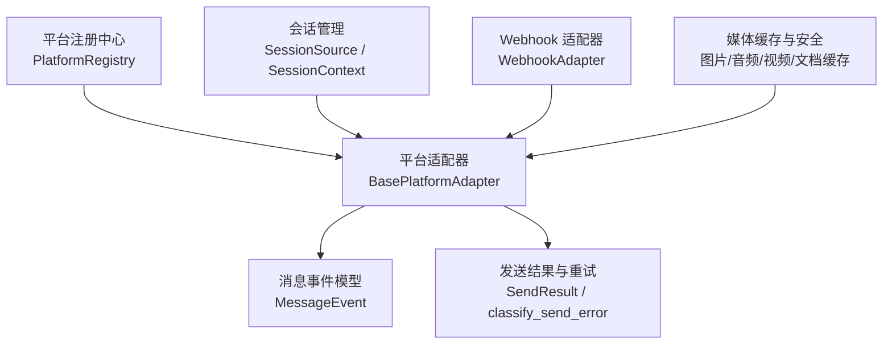
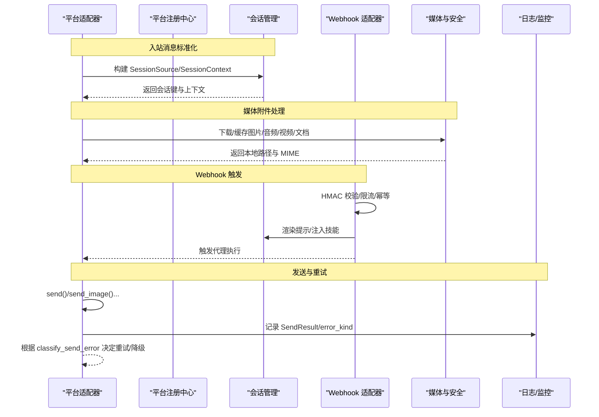
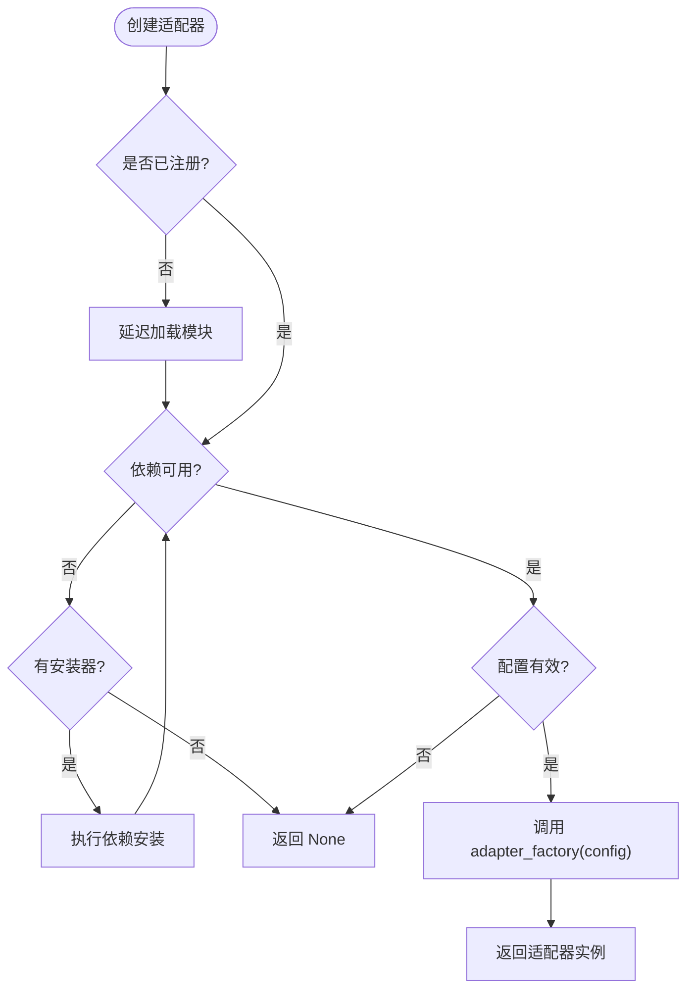
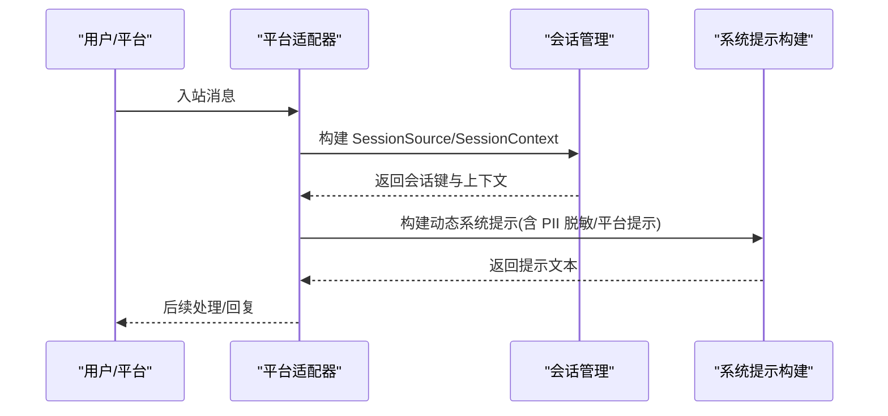
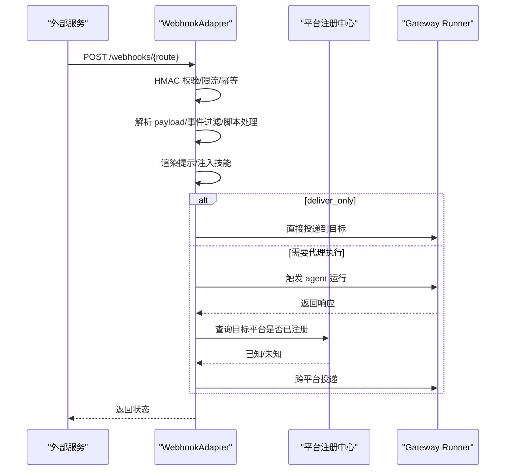
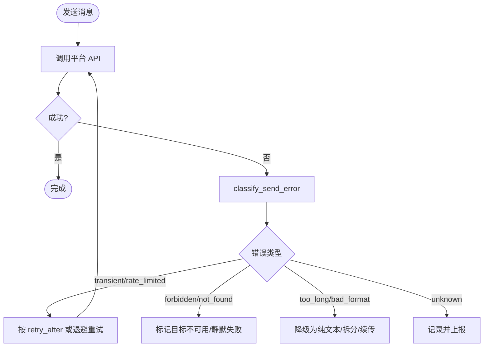
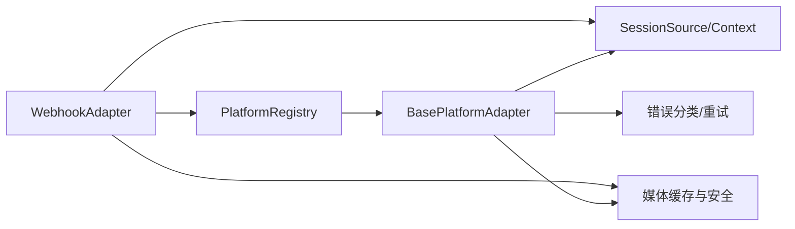

# 平台架构设计

<cite>
**本文引用的文件**
- [gateway/platforms/base.py](file://gateway/platforms/base.py)
- [gateway/platform_registry.py](file://gateway/platform_registry.py)
- [gateway/session.py](file://gateway/session.py)
- [gateway/platforms/webhook.py](file://gateway/platforms/webhook.py)
- [plugins/platforms/ADDING_A_PLATFORM.md](file://plugins/platforms/ADDING_A_PLATFORM.md)
</cite>

## 目录
1. [简介](#简介)
2. [项目结构](#项目结构)
3. [核心组件](#核心组件)
4. [架构总览](#架构总览)
5. [详细组件分析](#详细组件分析)
6. [依赖关系分析](#依赖关系分析)
7. [性能考量](#性能考量)
8. [故障排查指南](#故障排查指南)
9. [结论](#结论)
10. [附录：扩展新平台的开发指南](#附录扩展新平台的开发指南)

## 简介
本文件面向 Hermes Agent 的多平台消息集成架构，系统性阐述统一的消息处理设计、适配器模式实现、平台抽象基类、消息格式转换机制与会话管理框架；并覆盖平台注册机制、消息路由策略、错误处理与重试逻辑、权限控制与安全机制。文档同时提供架构图与数据流图，帮助读者快速理解各组件交互关系，并给出扩展新平台的实践指南。

## 项目结构
Hermes 的网关层通过“平台适配器”将不同消息平台（如 Telegram、Discord、WhatsApp、Slack、Webhook 等）接入统一的会话与消息处理管线。关键目录与职责如下：
- gateway/platforms/base.py：定义平台适配器的抽象基类、通用消息事件模型、媒体缓存与大小限制、发送结果分类与重试等基础设施。
- gateway/platform_registry.py：平台适配器注册中心，支持插件化自注册、延迟加载、依赖检查与配置校验。
- gateway/session.py：会话上下文与会话源建模，负责动态系统提示注入、PII 脱敏、跨平台身份标识与路由键生成。
- gateway/platforms/webhook.py：通用 Webhook 适配器，接收外部服务回调，进行签名校验、限流、去重、模板渲染与跨平台投递。
- plugins/platforms/ADDING_A_PLATFORM.md：新增平台适配器的完整清单与最佳实践。

图表来源
- [gateway/platforms/base.py:2044-2257](file://gateway/platforms/base.py#L2044-L2257)
- [gateway/platform_registry.py:38-181](file://gateway/platform_registry.py#L38-L181)
- [gateway/session.py:148-346](file://gateway/session.py#L148-L346)
- [gateway/platforms/webhook.py:177-402](file://gateway/platforms/webhook.py#L177-L402)

章节来源
- [gateway/platforms/base.py:2044-2257](file://gateway/platforms/base.py#L2044-L2257)
- [gateway/platform_registry.py:38-181](file://gateway/platform_registry.py#L38-L181)
- [gateway/session.py:148-346](file://gateway/session.py#L148-L346)
- [gateway/platforms/webhook.py:177-402](file://gateway/platforms/webhook.py#L177-L402)

## 核心组件
- 平台抽象基类 BasePlatformAdapter：统一消息收发、类型判断、媒体缓存、回复锚点、线程元数据、TTS 流式输出等能力。
- 平台注册中心 PlatformRegistry：集中管理平台适配器条目（名称、标签、工厂函数、依赖检查、配置校验、连接状态、环境变量、YAML→环境桥接、独立发送器钩子等），支持延迟加载与插件覆盖。
- 会话管理 SessionSource/SessionContext：描述消息来源、会话键、多用户会话、平台能力、家庭频道、PII 脱敏、动态系统提示注入等。
- Webhook 适配器：HTTP 端点、HMAC 签名校验、速率限制、幂等去重、模板渲染、技能注入、跨平台投递。

章节来源
- [gateway/platforms/base.py:2044-2257](file://gateway/platforms/base.py#L2044-L2257)
- [gateway/platform_registry.py:38-181](file://gateway/platform_registry.py#L38-L181)
- [gateway/session.py:148-346](file://gateway/session.py#L148-L346)
- [gateway/platforms/webhook.py:177-402](file://gateway/platforms/webhook.py#L177-L402)

## 架构总览
下图展示从平台入站到消息处理与回发的整体流程，包括适配器、注册中心、会话上下文、Webhook 与媒体安全等关键节点。

图表来源
- [gateway/platforms/base.py:2044-2257](file://gateway/platforms/base.py#L2044-L2257)
- [gateway/platform_registry.py:299-377](file://gateway/platform_registry.py#L299-L377)
- [gateway/session.py:479-745](file://gateway/session.py#L479-L745)
- [gateway/platforms/webhook.py:584-800](file://gateway/platforms/webhook.py#L584-L800)

## 详细组件分析

### 平台抽象基类与消息事件模型
- 消息事件 MessageEvent：统一表示文本、位置、图片、视频、音频、语音、文档、贴纸、命令等入站消息，携带作者信息、原始平台数据、媒体列表、回复上下文、自动技能、频道提示、通道上下文、内部标志、元数据与时间戳。
- 发送结果 SendResult：封装成功/失败、消息 ID、错误详情、可重试标记、服务器建议重试间隔、分片续传消息 ID、错误分类 error_kind。
- 错误分类 classify_send_error：将异常或错误文本映射为平台无关的错误类别（too_long、bad_format、forbidden、not_found、rate_limited、transient、unknown），便于上层统一决策。
- 媒体缓存与大小限制：图片/音频/视频/文档统一落盘到受控目录，带内容长度上限与 SSRF 防护，避免 OOM 与恶意链接。
- 线程与回复锚点：针对不同平台（Telegram DM Topic、Slack workspace scope、Feishu thread）智能选择 reply_to_message_id 与 thread metadata。

```mermaid
classDiagram
class MessageEvent {
+string text
+MessageType message_type
+string user_id
+string user_name
+SessionSource source
+Any raw_message
+string message_id
+int platform_update_id
+list media_urls
+list media_types
+string reply_to_message_id
+string reply_to_text
+string reply_to_author_id
+string reply_to_author_name
+bool reply_to_is_own_message
+dict prompt_response
+string auto_skill
+string channel_prompt
+string channel_context
+bool internal
+dict metadata
+datetime timestamp
+is_command() bool
+get_command() string
+get_command_args() string
}
class SendResult {
+bool success
+string message_id
+string error
+Any raw_response
+bool retryable
+float retry_after
+tuple continuation_message_ids
+string error_kind
}
class BasePlatformAdapter {
+connect() bool
+disconnect() void
+send(chat_id, content, ...) SendResult
+send_typing(chat_id) void
+send_image(...) SendResult
+get_chat_info(chat_id) dict
}
BasePlatformAdapter --> MessageEvent : "消费"
BasePlatformAdapter --> SendResult : "产出"
```

图表来源
- [gateway/platforms/base.py:2044-2257](file://gateway/platforms/base.py#L2044-L2257)

章节来源
- [gateway/platforms/base.py:2044-2257](file://gateway/platforms/base.py#L2044-L2257)

### 平台注册机制与延迟加载
- PlatformEntry：描述平台名称、标签、工厂函数、依赖检查、配置校验、连接状态、环境变量、安装提示、YAML→环境桥接、cron 投递、独立发送器钩子、显示 emoji、平台提示、隐私标记等。
- PlatformRegistry：维护已注册条目与延迟加载器，首次使用时才导入重型 SDK；创建适配器时依次执行依赖检查、可选依赖安装、配置校验与工厂实例化；支持插件覆盖内置平台。

图表来源
- [gateway/platform_registry.py:299-377](file://gateway/platform_registry.py#L299-L377)
- [gateway/platform_registry.py:38-181](file://gateway/platform_registry.py#L38-L181)

章节来源
- [gateway/platform_registry.py:38-181](file://gateway/platform_registry.py#L38-L181)
- [gateway/platform_registry.py:299-377](file://gateway/platform_registry.py#L299-L377)

### 会话管理与消息生命周期
- SessionSource：描述消息来源（平台、聊天 ID/名称/类型、用户 ID/名称、线程、主题、替代 ID、作用域、父聊天、触发消息、授权角色、多路复用 profile、Discord 自动线程元数据、上游中继可信信号）。
- SessionContext：包含来源、已连接平台、家庭频道、共享多用户会话标记、会话键/ID、创建/更新时间。
- 动态系统提示注入：根据来源平台、工具可用性、多用户会话、平台特性（如 Slack/Discord/Bubble/Yuanbao）注入行为提示；对部分平台启用 PII 脱敏（哈希用户/聊天 ID）。
- 会话键安全：拒绝路径穿越字符，防止 session_key 被用于文件系统逃逸。

图表来源
- [gateway/session.py:148-346](file://gateway/session.py#L148-L346)
- [gateway/session.py:479-745](file://gateway/session.py#L479-L745)

章节来源
- [gateway/session.py:148-346](file://gateway/session.py#L148-L346)
- [gateway/session.py:479-745](file://gateway/session.py#L479-L745)

### Webhook 适配器与消息路由策略
- 路由与鉴权：每个路由需配置 secret（HMAC 校验），支持 V2 签名（绑定时间戳防重放）；支持事件类型过滤、脚本预处理、deliver_only 直通投递。
- 速率限制与幂等：固定窗口限流；基于 delivery_id 的去重缓存（TTL），避免重复触发。
- 多 Profile 多路复用：支持 /p/<profile>/webhooks/<route> 前缀，按 profile 隔离配置与凭据。
- 跨平台投递：支持内置目标与插件注册平台；未知目标降级为日志。

图表来源
- [gateway/platforms/webhook.py:584-800](file://gateway/platforms/webhook.py#L584-L800)
- [gateway/platforms/webhook.py:177-402](file://gateway/platforms/webhook.py#L177-L402)
- [gateway/platform_registry.py:299-377](file://gateway/platform_registry.py#L299-L377)

章节来源
- [gateway/platforms/webhook.py:177-402](file://gateway/platforms/webhook.py#L177-L402)
- [gateway/platforms/webhook.py:584-800](file://gateway/platforms/webhook.py#L584-L800)

### 错误处理与重试逻辑
- 发送错误分类：classify_send_error 将异常/错误文本归类为 too_long、bad_format、forbidden、not_found、rate_limited、transient、unknown。
- 聊天级 not_found 判定：is_chat_level_not_found 区分整聊天不可用与子聊天/消息不可用，影响死目标标记。
- 重试策略：SendResult.retryable 与 retry_after 指示是否重试及等待时长；base 层在必要时自动重试。
- Webhook 侧：HMAC 校验失败返回 401；限流返回 429；过大负载返回 413；未找到路由返回 404。

图表来源
- [gateway/platforms/base.py:2259-2394](file://gateway/platforms/base.py#L2259-L2394)
- [gateway/platforms/webhook.py:626-733](file://gateway/platforms/webhook.py#L626-L733)

章节来源
- [gateway/platforms/base.py:2259-2394](file://gateway/platforms/base.py#L2259-L2394)
- [gateway/platforms/webhook.py:626-733](file://gateway/platforms/webhook.py#L626-L733)

### 权限控制与安全机制
- 入站媒体安全：统一入口校验 Content-Length 与流式读取总量，超过阈值拒绝；SSRF 防护拦截内网/私有地址与危险重定向。
- 出站媒体安全：validate_media_delivery_path 严格校验文件路径，支持严格模式（仅允许 Hermes 缓存目录、操作者白名单或近期生成的文件），阻止敏感系统路径与凭证目录。
- Webhook 安全：强制 HMAC 校验（V2 支持时间戳绑定），禁止非回环主机使用 INSECURE_NO_AUTH；body size 限制；事件类型与脚本过滤。
- 会话与提示安全：session_key 防路径穿越；系统提示中不可信字段转义与截断；PII 脱敏（哈希用户/聊天 ID）降低泄露风险。

章节来源
- [gateway/platforms/base.py:722-810](file://gateway/platforms/base.py#L722-L810)
- [gateway/platforms/base.py:1463-1542](file://gateway/platforms/base.py#L1463-L1542)
- [gateway/platforms/webhook.py:248-344](file://gateway/platforms/webhook.py#L248-L344)
- [gateway/platforms/webhook.py:626-733](file://gateway/platforms/webhook.py#L626-L733)
- [gateway/session.py:100-146](file://gateway/session.py#L100-L146)
- [gateway/session.py:479-745](file://gateway/session.py#L479-L745)

## 依赖关系分析
- 平台适配器依赖注册中心进行发现与实例化；适配器消费会话上下文以构建系统提示与路由；Webhook 适配器作为通用入站通道，可触发代理执行或直接投递。
- 媒体缓存与安全模块被所有适配器共用，确保一致的安全与资源管控。
- 错误分类与重试逻辑由 base 层统一提供，减少各平台差异带来的维护成本。

图表来源
- [gateway/platform_registry.py:299-377](file://gateway/platform_registry.py#L299-L377)
- [gateway/platforms/base.py:2044-2257](file://gateway/platforms/base.py#L2044-L2257)
- [gateway/session.py:148-346](file://gateway/session.py#L148-L346)
- [gateway/platforms/webhook.py:177-402](file://gateway/platforms/webhook.py#L177-L402)

章节来源
- [gateway/platform_registry.py:299-377](file://gateway/platform_registry.py#L299-L377)
- [gateway/platforms/base.py:2044-2257](file://gateway/platforms/base.py#L2044-L2257)
- [gateway/session.py:148-346](file://gateway/session.py#L148-L346)
- [gateway/platforms/webhook.py:177-402](file://gateway/platforms/webhook.py#L177-L402)

## 性能考量
- 延迟加载：平台模块仅在首次使用时导入，避免启动开销。
- 媒体缓存：统一落盘与清理，限制内存占用，避免 OOM。
- 速率限制与幂等：Webhook 侧固定窗口限流与 delivery_id 去重，降低重复处理成本。
- 错误分类与重试：集中化错误分类，减少重复判断逻辑；合理退避避免雪崩。

[本节为通用指导，不直接分析具体文件]

## 故障排查指南
- Webhook 无法接收：检查端口绑定、HMAC 密钥、事件类型过滤、脚本超时、最大 body 限制。
- 发送失败：查看 SendResult.error_kind，定位 too_long、bad_format、forbidden、not_found、rate_limited、transient；根据分类采取降级、重试或标记目标不可用。
- 媒体上传失败：确认文件大小未超限、URL 安全（SSRF）、文件格式识别正确、缓存目录权限。
- 会话异常：检查 session_key 是否包含非法字符、PII 脱敏是否生效、动态系统提示是否过长导致缓存失效。

章节来源
- [gateway/platforms/webhook.py:248-344](file://gateway/platforms/webhook.py#L248-L344)
- [gateway/platforms/base.py:2259-2394](file://gateway/platforms/base.py#L2259-L2394)
- [gateway/platforms/base.py:722-810](file://gateway/platforms/base.py#L722-L810)
- [gateway/session.py:100-146](file://gateway/session.py#L100-L146)

## 结论
Hermes 的多平台消息集成通过统一的适配器抽象、注册中心与会话管理，实现了高内聚、低耦合的平台接入方案。错误分类与重试、媒体安全与 PII 脱敏、Webhook 的鉴权与限流共同保障了系统的稳定性与安全性。遵循本文档的架构与规范，可高效扩展新的消息平台并保持与现有生态的一致体验。

[本节为总结性内容，不直接分析具体文件]

## 附录：扩展新平台的开发指南
- 推荐采用插件方式：在 ~/.hermes/plugins/ 或 plugins/platforms/ 下创建 plugin.yaml 与 adapter.py，继承 BasePlatformAdapter，并通过 ctx.register_platform() 注册。
- 关键钩子：
  - env_enablement_fn：从环境变量预填充 PlatformConfig.extra。
  - apply_yaml_config_fn：将 config.yaml 键转换为环境变量或 extra。
  - cron_deliver_env_var：声明 cron 投递的目标环境变量。
  - standalone_sender_fn：进程外发送能力，供 cron 单独进程使用。
- 内置集成要点（核心贡献者）：
  - 新增 Platform 枚举值与环境变量加载。
  - 在 _create_adapter 中添加工厂分支。
  - 更新授权映射、会话源、系统提示提示、工具集、cron 投递、发送消息工具、通道目录、状态显示、设置向导、红字脱敏、文档与测试。
- 参考示例：IRC、Teams、Google Chat 等插件实现。

章节来源
- [plugins/platforms/ADDING_A_PLATFORM.md:1-405](file://plugins/platforms/ADDING_A_PLATFORM.md#L1-L405)