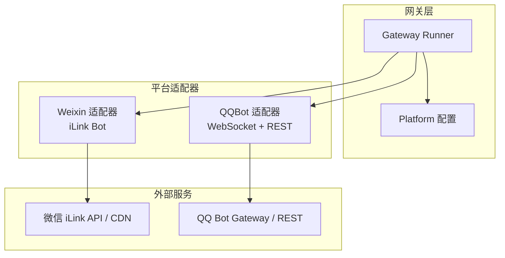
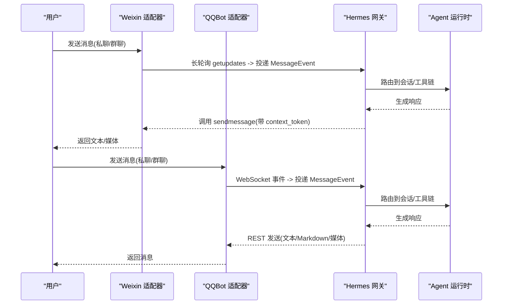
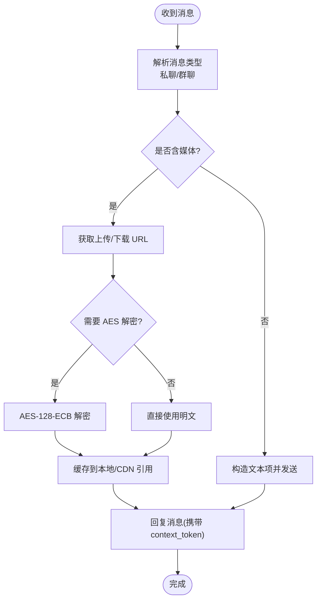
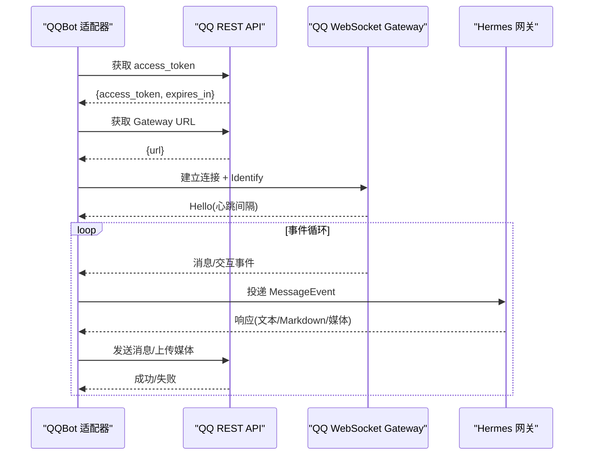
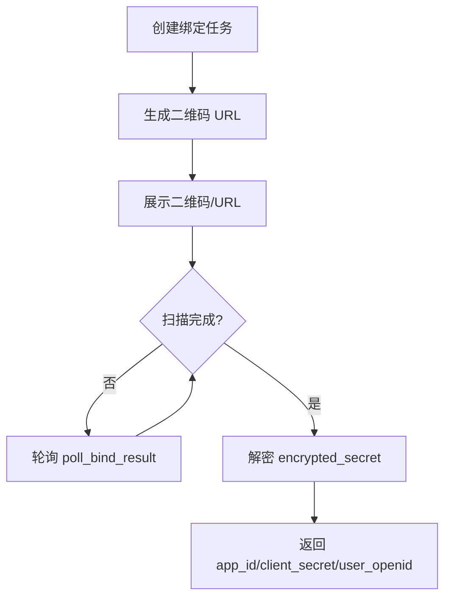
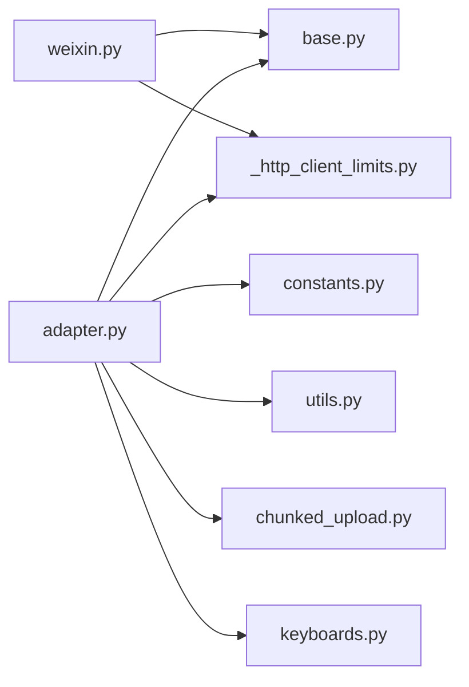

# 微信/QQ 平台集成

<cite>
**本文引用的文件**
- [weixin.py](file://gateway/platforms/weixin.py)
- [adapter.py](file://gateway/platforms/qqbot/adapter.py)
- [constants.py](file://gateway/platforms/qqbot/constants.py)
- [onboard.py](file://gateway/platforms/qqbot/onboard.py)
- [__init__.py](file://gateway/platforms/qqbot/__init__.py)
- [_http_client_limits.py](file://gateway/platforms/_http_client_limits.py)
- [base.py](file://gateway/platforms/base.py)
- [config.py](file://gateway/config.py)
- [test_adapter_connect_is_reconnect_contract.py](file://tests/gateway/test_adapter_connect_is_reconnect_contract.py)
</cite>

## 目录
1. [简介](#简介)
2. [项目结构](#项目结构)
3. [核心组件](#核心组件)
4. [架构总览](#架构总览)
5. [详细组件分析](#详细组件分析)
6. [依赖关系分析](#依赖关系分析)
7. [性能与稳定性](#性能与稳定性)
8. [故障排查指南](#故障排查指南)
9. [结论](#结论)
10. [附录：配置与部署要点](#附录配置与部署要点)

## 简介
本集成文档面向在中国本土消息平台（微信公众号/企业微信、QQ 机器人）进行集成的开发者，聚焦以下目标：
- 说明如何通过 Hermes Agent 的网关平台适配器接入微信 iLink Bot API 与 QQ Bot v2 官方接口。
- 给出账号申请、API 密钥配置、消息推送设置的关键步骤与注意事项。
- 解释中文消息处理特点（Unicode、表情符号、富文本/Markdown 适配）。
- 覆盖群聊管理、用户认证、菜单系统（以 QQ 内联键盘为例）、以及支付集成的扩展思路。
- 说明微信平台审核机制与合规要求，以及 QQ 开放平台的 API 限制与错误码处理。
- 提供服务器配置、域名绑定与安全证书设置的实践建议。
- 汇总常见问题与性能优化技巧。

## 项目结构
本项目在 gateway/platforms 下按“平台”组织适配器代码：
- weixin.py：实现微信 iLink Bot 长轮询拉取、消息发送、媒体上传下载、上下文 token 持久化等。
- qqbot/*：实现 QQ Bot v2 的 WebSocket 网关连接、REST 调用、分片上传、内联键盘交互、扫码注册流程等。
- base.py：定义平台适配器基类与通用消息类型、发送结果、SSRF 防护等。
- config.py：平台配置模型，用于声明各平台开关与额外参数。
- _http_client_limits.py：统一 HTTP 客户端连接池与超时限制，提升稳定性。

图表来源
- [weixin.py:1-120](file://gateway/platforms/weixin.py#L1-L120)
- [adapter.py:180-370](file://gateway/platforms/qqbot/adapter.py#L180-L370)
- [constants.py:17-49](file://gateway/platforms/qqbot/constants.py#L17-L49)

章节来源
- [weixin.py:1-120](file://gateway/platforms/weixin.py#L1-L120)
- [adapter.py:180-370](file://gateway/platforms/qqbot/adapter.py#L180-L370)
- [constants.py:17-49](file://gateway/platforms/qqbot/constants.py#L17-L49)

## 核心组件
- 微信 iLink 适配器（Weixin）
  - 通过 getupdates 长轮询获取消息；每次回复需携带最新 context_token。
  - 媒体走 AES-128-ECB 加密的 CDN 协议，支持图片/视频/文件/语音。
  - 提供 QR 登录辅助与账户凭证持久化。
- QQ Bot 适配器（QQBot）
  - 使用 WebSocket Gateway 接收事件，REST API 发送消息与上传媒体。
  - 支持 Markdown 消息、内联键盘交互、分块上传、STT（语音转文字）优先级策略。
  - 完善的断线重连、心跳保活、限流退避与快速断开检测。

章节来源
- [weixin.py:1-120](file://gateway/platforms/weixin.py#L1-L120)
- [adapter.py:180-370](file://gateway/platforms/qqbot/adapter.py#L180-L370)

## 架构总览
微信与 QQ 的消息流分别由各自适配器驱动，统一接入网关后进入业务处理链路。

图表来源
- [weixin.py:447-502](file://gateway/platforms/weixin.py#L447-L502)
- [adapter.py:309-370](file://gateway/platforms/qqbot/adapter.py#L309-L370)

## 详细组件分析

### 微信 iLink 适配器（Weixin）
- 关键能力
  - 长轮询拉取：getupdates 配合 sync_buf，超时保护避免阻塞。
  - 消息发送：sendmessage 必须附带 context_token 保持会话上下文。
  - 媒体处理：AES-128-ECB 加解密、CDN 上传/下载、白名单校验防 SSRF。
  - 会话与上下文：context_token 磁盘缓存，按账户+对端键值存储。
  - 输入状态：typing_ticket 短效票据，控制“正在输入”提示。
- 中文与富文本
  - 输出行宽自动换行，便于微信客户端复制与显示。
  - Markdown 代码块与表格保留，空白行规范化，避免渲染异常。
- 安全与稳定
  - 仅允许微信 CDN 域名访问，防止 SSRF。
  - 针对 iLink 频率限制与过期会话的错误码做退避与重试。

图表来源
- [weixin.py:447-502](file://gateway/platforms/weixin.py#L447-L502)
- [weixin.py:549-683](file://gateway/platforms/weixin.py#L549-L683)
- [weixin.py:697-764](file://gateway/platforms/weixin.py#L697-L764)

章节来源
- [weixin.py:1-120](file://gateway/platforms/weixin.py#L1-L120)
- [weixin.py:447-502](file://gateway/platforms/weixin.py#L447-L502)
- [weixin.py:549-683](file://gateway/platforms/weixin.py#L549-L683)
- [weixin.py:697-764](file://gateway/platforms/weixin.py#L697-L764)

### QQ Bot 适配器（QQBot）
- 关键能力
  - 认证与会话：通过 REST 获取 access_token，再请求 WebSocket Gateway URL，建立 WS 连接。
  - 事件监听：读取事件、心跳保活、识别/恢复（Identify/Resume）。
  - 消息发送：支持文本、Markdown、媒体（图片/视频/语音/文件），分块上传。
  - 内联键盘：审批请求、更新提示等交互事件回调。
  - 容错与重连：快速断开检测、限流退避、致命错误停止重连。
- 中文与富文本
  - 开启 markdown_support 后可使用 QQ Markdown 消息类型。
  - 文本长度限制与去重窗口，避免重复与超限。
- 安全与稳定
  - 严格的重试与退避策略，WS 关闭码分类处理。
  - 通过 httpx/aiohttp 统一客户端限制，降低 CLOSE_WAIT 风险。

图表来源
- [adapter.py:309-370](file://gateway/platforms/qqbot/adapter.py#L309-L370)
- [adapter.py:424-479](file://gateway/platforms/qqbot/adapter.py#L424-L479)
- [adapter.py:516-715](file://gateway/platforms/qqbot/adapter.py#L516-L715)

章节来源
- [adapter.py:180-370](file://gateway/platforms/qqbot/adapter.py#L180-L370)
- [adapter.py:424-479](file://gateway/platforms/qqbot/adapter.py#L424-L479)
- [adapter.py:516-715](file://gateway/platforms/qqbot/adapter.py#L516-L715)

### QQ 扫码注册流程（Onboard）
- 流程概述
  - 创建绑定任务，生成二维码 URL。
  - 终端打印二维码或提示打开链接。
  - 轮询绑定结果，成功后本地解密得到 client_secret。
  - 返回 app_id、client_secret、user_openid 供网关配置。

图表来源
- [onboard.py:84-147](file://gateway/platforms/qqbot/onboard.py#L84-L147)
- [onboard.py:156-221](file://gateway/platforms/qqbot/onboard.py#L156-L221)

章节来源
- [onboard.py:84-147](file://gateway/platforms/qqbot/onboard.py#L84-L147)
- [onboard.py:156-221](file://gateway/platforms/qqbot/onboard.py#L156-L221)

## 依赖关系分析
- 微信适配器依赖
  - aiohttp：HTTP 客户端，用于 iLink API 与 CDN 通信。
  - cryptography：AES-128-ECB 加解密。
  - certifi：CA 证书包，解决部分系统 CA 不可信问题。
- QQ 适配器依赖
  - aiohttp：WebSocket 客户端。
  - httpx：REST 客户端，用于 Token/Gateway 与媒体上传。
  - 常量与工具：constants.py、utils.py、chunked_upload.py、keyboards.py。
- 公共依赖
  - base.py：平台适配器基类、消息类型、SSRF 防护。
  - _http_client_limits.py：统一连接池与超时限制。
  - config.py：平台配置模型。

图表来源
- [weixin.py:1-120](file://gateway/platforms/weixin.py#L1-L120)
- [adapter.py:180-370](file://gateway/platforms/qqbot/adapter.py#L180-L370)
- [constants.py:17-49](file://gateway/platforms/qqbot/constants.py#L17-L49)

章节来源
- [weixin.py:1-120](file://gateway/platforms/weixin.py#L1-L120)
- [adapter.py:180-370](file://gateway/platforms/qqbot/adapter.py#L180-L370)
- [constants.py:17-49](file://gateway/platforms/qqbot/constants.py#L17-L49)

## 性能与稳定性
- 连接与超时
  - 微信：tight keepalive 减少 CLOSE_WAIT；长轮询超时保护。
  - QQ：心跳间隔基于 Hello 动态调整；连接超时与重试退避。
- 限流与退避
  - 微信：iLink 频率限制与过期会话错误码处理。
  - QQ：4008 限流等待 60s；快速断开阈值与次数上限。
- 媒体传输
  - 微信：AES-128-ECB 加密，CDN 白名单校验。
  - QQ：分块上传，每日限额与大文件限制。
- 并发与资源
  - 统一 httpx/aiohttp 限制，避免连接泄漏。
  - 上下文 token 与 typing ticket 缓存，减少重复请求。

[本节为通用指导，不直接分析具体文件]

## 故障排查指南
- 微信侧
  - 无法拉取消息：检查 getupdates 超时与 sync_buf；确认网络可达与证书可用。
  - 媒体下载失败：核对 CDN 域名是否在白名单；检查 AES key 格式。
  - 会话过期：errcode=-14 时清理并重连；确保 context_token 正确回传。
- QQ 侧
  - 频繁断开：关注快速断开计数与致命错误码（如 4914/4915）；检查权限与 AppID/Secret。
  - Token 无效：4004 时清空缓存并刷新；确认网络与代理设置。
  - 限流：4008 等待 60s 后重试；必要时降低消息频率。
- 通用
  - 适配器 connect 契约：所有平台适配器的 connect() 必须接受 is_reconnect 关键字参数，否则重连会失败。
  - 日志与状态：查看网关运行状态与平台状态，定位断点。

章节来源
- [weixin.py:118-127](file://gateway/platforms/weixin.py#L118-L127)
- [adapter.py:516-715](file://gateway/platforms/qqbot/adapter.py#L516-L715)
- [test_adapter_connect_is_reconnect_contract.py:1-145](file://tests/gateway/test_adapter_connect_is_reconnect_contract.py#L1-L145)

## 结论
- 微信与 QQ 的集成通过平台适配器解耦，统一接入网关后获得一致的消息处理能力。
- 微信侧重 iLink 长轮询与媒体加密传输，QQ 侧重 WebSocket 事件与 REST 发送。
- 中文消息与富文本在不同平台有差异化适配策略，需结合平台限制进行裁剪。
- 稳定性方面，双方均实现了完善的超时、限流、重连与错误码处理。
- 建议在部署时关注证书、代理、域名白名单与配额限制，保障生产环境稳定运行。

[本节为总结性内容，不直接分析具体文件]

## 附录：配置与部署要点
- 账号与密钥
  - 微信：通过 iLink Bot API 获取 token；保存账户凭证与 context_token。
  - QQ：通过扫码注册流程获取 app_id 与 client_secret；配置 dm_policy/group_policy 控制访问策略。
- 服务器与网络
  - 证书：微信侧建议使用 certifi CA 包；QQ 侧注意代理环境变量（WSS_PROXY/HTTPS_PROXY）。
  - 域名：微信 CDN 白名单；QQ 门户可配置 QQ_PORTAL_HOST 用于企业代理或测试环境。
- 消息与富文本
  - 微信：文本行宽自动换行；代码块与表格保留；媒体走加密 CDN。
  - QQ：启用 markdown_support 使用 Markdown；注意消息长度限制与去重窗口。
- 群聊与认证
  - 微信：根据 room_id/chat_room_id/from_user_id 判断群聊/私聊。
  - QQ：dm_policy/group_policy 支持 open/allowlist/disabled/pairing；支持 allow_from/group_allow_from 白名单。
- 菜单与交互
  - QQ：内联键盘支持审批请求与更新提示；事件回调可对接工具链。
- 支付集成
  - 当前仓库未内置微信支付/QQ 支付 SDK；可通过工具链或外部服务桥接，遵循平台合规与风控要求。
- 部署清单
  - 安装依赖：aiohttp、httpx、cryptography、certifi（可选）。
  - 配置平台：在 config.yaml 中启用平台并填写 extra 参数。
  - 启动网关：观察连接状态与日志，确认重连与心跳正常。

章节来源
- [config.py:1-200](file://gateway/config.py#L1-L200)
- [constants.py:17-49](file://gateway/platforms/qqbot/constants.py#L17-L49)
- [adapter.py:226-247](file://gateway/platforms/qqbot/adapter.py#L226-L247)
- [weixin.py:254-346](file://gateway/platforms/weixin.py#L254-L346)