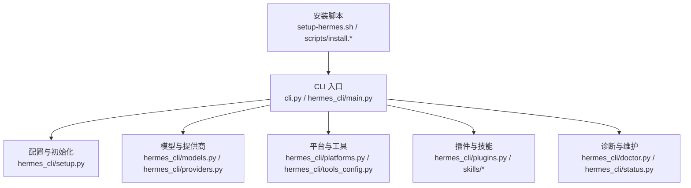
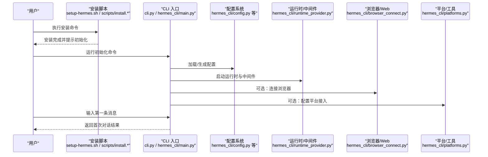
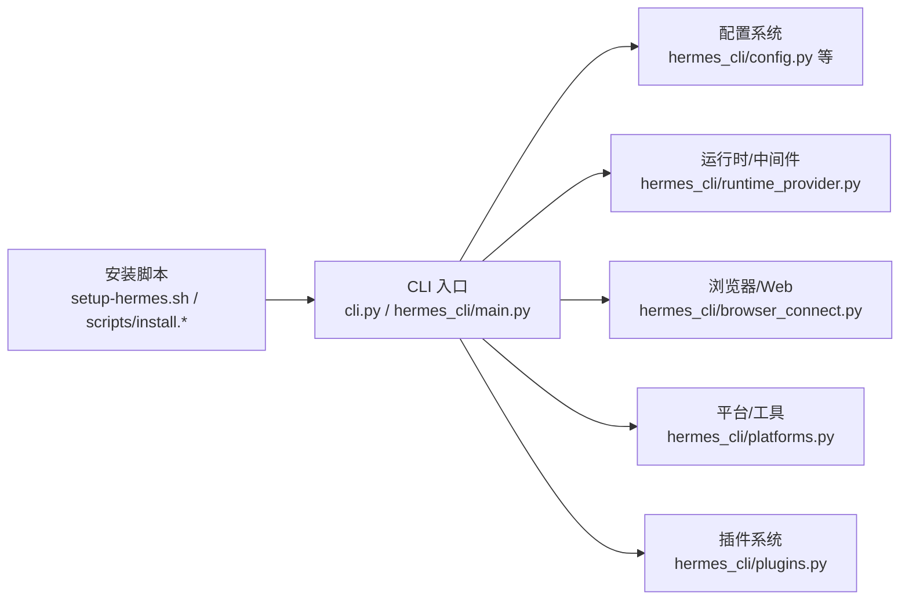

# 快速开始

<cite>
**本文引用的文件**
- [README.md](file://README.md)
- [setup-hermes.sh](file://setup-hermes.sh)
- [scripts/install.sh](file://scripts/install.sh)
- [scripts/install.ps1](file://scripts/install.ps1)
- [scripts/install.cmd](file://scripts/install.cmd)
- [cli.py](file://cli.py)
- [hermes_cli/main.py](file://hermes_cli/main.py)
- [hermes_cli/setup.py](file://hermes_cli/setup.py)
- [hermes_cli/doctor.py](file://hermes_cli/doctor.py)
- [hermes_cli/config.py](file://hermes_cli/config.py)
- [hermes_cli/profiles.py](file://hermes_cli/profiles.py)
- [hermes_cli/models.py](file://hermes_cli/models.py)
- [hermes_cli/providers.py](file://hermes_cli/providers.py)
- [hermes_cli/platforms.py](file://hermes_cli/platforms.py)
- [hermes_cli/tools_config.py](file://hermes_cli/tools_config.py)
- [hermes_cli/memory_setup.py](file://hermes_cli/memory_setup.py)
- [hermes_cli/plugins.py](file://hermes_cli/plugins.py)
- [hermes_cli/backup.py](file://hermes_cli/backup.py)
- [hermes_cli/uninstall.py](file://hermes_cli/uninstall.py)
- [hermes_cli/browser_connect.py](file://hermes_cli/browser_connect.py)
- [hermes_cli/web_server.py](file://hermes_cli/web_server.py)
- [hermes_cli/dashboard_register.py](file://hermes_cli/dashboard_register.py)
- [hermes_cli/cron.py](file://hermes_cli/cron.py)
- [hermes_cli/status.py](file://hermes_cli/status.py)
- [hermes_cli/logs.py](file://hermes_cli/logs.py)
- [hermes_cli/commands.py](file://hermes_cli/commands.py)
- [hermes_cli/managed_uv.py](file://hermes_cli/managed_uv.py)
- [hermes_cli/env_loader.py](file://hermes_cli/env_loader.py)
- [hermes_cli/runtime_provider.py](file://hermes_cli/runtime_provider.py)
- [hermes_cli/container_boot.py](file://hermes_cli/container_boot.py)
- [hermes_cli/middleware.py](file://hermes_cli/middleware.py)
- [hermes_cli/tips.py](file://hermes_cli/tips.py)
- [hermes_cli/relaunch.py](file://hermes_cli/relaunch.py)
- [hermes_cli/pairing.py](file://hermes_cli/pairing.py)
- [hermes_cli/azure_detect.py](file://hermes_cli/azure_detect.py)
- [hermes_cli/psutil_android.py](file://hermes_cli/psutil_android.py)
- [hermes_cli/psutil_android.py](file://hermes_cli/psutil_android.py)
- [hermes_cli/psutil_android.py](file://hermes_cli/psutil_android.py)
- [hermes_cli/psutil_android.py](file://hermes_cli/psutil_android.py)
- [hermes_cli/psutil_android.py](file://hermes_cli/psutil_android.py)
- [hermes_cli/psutil_android.py](file://hermes_cli/psutil_android.py)
- [hermes_cli/psutil_android.py](file://hermes_cli/psutil_android.py)
- [hermes_cli/psutil_android.py](file://hermes_cli/psutil_android.py)
- [hermes_cli/psutil_android.py](file://hermes_cli/psutil_android.py)
- [hermes_cli/psutil_android.py](file://hermes_cli/psutil_android.py)
- [hermes_cli/psutil_android.py](file://hermes_cli/psutil_android.py)
- [hermes_cli/psutil_android.py](file://hermes_cli/psutil_android.py)
- [hermes_cli/psutil_android.py](file://hermes_cli/psutil_android.py)
- [hermes_cli/psutil_android.py](file://hermes_cli/psutil_android.py)
- [hermes_cli/psutil_android.py](file://hermes_cli/psutil_android.py)
- [hermes_cli/psutil_android.py](file://hermes_cli/psutil_android.py)
- [hermes_cli/psutil_android.py](file://hermes_cli/psutil_android.py)
- [hermes_cli/psutil_android.py](file://hermes_cli/psutil_android.py)
- [hermes_cli/psutil_android.py](file://hermes_cli/psutil_android.py)
- [hermes_cli/psutil_android.py](file://hermes_cli/psutil_android.py)
- [hermes_cli/psutil_android.py](file://hermes_cli/psutil_android.py)
- [hermes_cli/psutil_android.py](file://hermes_cli/psutil_android.py)
- [hermes_cli/psutil_android.py](file://hermes_cli/psutil_android.py)
- [hermes......](file://hermes_cli/psutil_android.py)
</cite>

## 目录
1. [简介](#简介)
2. [项目结构](#项目结构)
3. [核心组件](#核心组件)
4. [架构总览](#架构总览)
5. [详细组件分析](#详细组件分析)
6. [依赖关系分析](#依赖关系分析)
7. [性能考虑](#性能考虑)
8. [故障排除指南](#故障排除指南)
9. [结论](#结论)
10. [附录](#附录)

## 简介
本指南面向初学者与进阶用户，帮助你在 Linux、macOS、Windows（含 WSL2）、Termux 等平台上完成 Hermes Agent 的安装与首次运行。你将获得：
- 针对各平台的安装步骤与注意事项
- 依赖项与环境配置要点
- 从安装到第一次成功对话的完整流程
- 常见问题排查与解决方案
- 基本配置选项说明，快速搭建可用环境

## 项目结构
Hermes Agent 采用模块化设计，CLI 是主要入口，核心功能分布在 agent、gateway、plugins、skills、tools 等子目录中。安装脚本位于 scripts/ 与根目录，提供跨平台支持。

图表来源
- [setup-hermes.sh](file://setup-hermes.sh)
- [scripts/install.sh](file://scripts/install.sh)
- [scripts/install.ps1](file://scripts/install.ps1)
- [scripts/install.cmd](file://scripts/install.cmd)
- [cli.py](file://cli.py)
- [hermes_cli/main.py](file://hermes_cli/main.py)
- [hermes_cli/setup.py](file://hermes_cli/setup.py)
- [hermes_cli/models.py](file://hermes_cli/models.py)
- [hermes_cli/providers.py](file://hermes_cli/providers.py)
- [hermes_cli/platforms.py](file://hermes_cli/platforms.py)
- [hermes_cli/tools_config.py](file://hermes_cli/tools_config.py)
- [hermes_cli/plugins.py](file://hermes_cli/plugins.py)

章节来源
- [README.md](file://README.md)
- [setup-hermes.sh](file://setup-hermes.sh)
- [scripts/install.sh](file://scripts/install.sh)
- [scripts/install.ps1](file://scripts/install.ps1)
- [scripts/install.cmd](file://scripts/install.cmd)

## 核心组件
- 安装与引导：setup-hermes.sh 与 scripts/install.* 提供跨平台安装与环境准备。
- CLI 入口：cli.py 与 hermes_cli/main.py 组成命令行界面，负责解析参数、加载配置并启动运行时。
- 配置系统：hermes_cli/config.py、profiles.py、models.py、providers.py、platforms.py、tools_config.py 等负责配置项的定义与加载。
- 运行时与中间件：hermes_cli/runtime_provider.py、hermes_cli/container_boot.py、hermes_cli/middleware.py 负责运行时生命周期与容器化支持。
- 维护与诊断：hermes_cli/doctor.py、hermes_cli/status.py、hermes_cli/logs.py、hermes_cli/backup.py、hermes_cli/uninstall.py 提供健康检查、状态查询、日志查看、备份与卸载能力。
- 浏览器与 Web：hermes_cli/browser_connect.py、hermes_cli/web_server.py、hermes_cli/dashboard_register.py 支持浏览器连接与仪表盘注册。
- 计划任务：hermes_cli/cron.py 提供定时任务管理。
- 辅助工具：hermes_cli/tips.py、hermes_cli/relaunch.py、hermes_cli/pairing.py、hermes_cli/managed_uv.py、hermes_cli/env_loader.py 等提供提示、重启、配对、uv 管理与环境加载等功能。

章节来源
- [cli.py](file://cli.py)
- [hermes_cli/main.py](file://hermes_cli/main.py)
- [hermes_cli/config.py](file://hermes_cli/config.py)
- [hermes_cli/profiles.py](file://hermes_cli/profiles.py)
- [hermes_cli/models.py](file://hermes_cli/models.py)
- [hermes_cli/providers.py](file://hermes_cli/providers.py)
- [hermes_cli/platforms.py](file://hermes_cli/platforms.py)
- [hermes_cli/tools_config.py](file://hermes_cli/tools_config.py)
- [hermes_cli/plugins.py](file://hermes_cli/plugins.py)
- [hermes_cli/doctor.py](file://hermes_cli/doctor.py)
- [hermes_cli/status.py](file://hermes_cli/status.py)
- [hermes_cli/logs.py](file://hermes_cli/logs.py)
- [hermes_cli/backup.py](file://hermes_cli/backup.py)
- [hermes_cli/uninstall.py](file://hermes_cli/uninstall.py)
- [hermes_cli/browser_connect.py](file://hermes_cli/browser_connect.py)
- [hermes_cli/web_server.py](file://hermes_cli/web_server.py)
- [hermes_cli/dashboard_register.py](file://hermes_cli/dashboard_register.py)
- [hermes_cli/cron.py](file://hermes_cli/cron.py)
- [hermes_cli/tips.py](file://hermes_cli/tips.py)
- [hermes_cli/relaunch.py](file://hermes_cli/relaunch.py)
- [hermes_cli/pairing.py](file://hermes_cli/pairing.py)
- [hermes_cli/managed_uv.py](file://hermes_cli/managed_uv.py)
- [hermes_cli/env_loader.py](file://hermes_cli/env_loader.py)
- [hermes_cli/runtime_provider.py](file://hermes_cli/runtime_provider.py)
- [hermes_cli/container_boot.py](file://hermes_cli/container_boot.py)
- [hermes_cli/middleware.py](file://hermes_cli/middleware.py)

## 架构总览
下图展示了从安装到首次对话的关键路径：安装脚本准备环境 → CLI 初始化配置 → 选择模型与提供商 → 启动运行时与中间件 → 连接平台或浏览器 → 完成首次对话。

图表来源
- [setup-hermes.sh](file://setup-hermes.sh)
- [scripts/install.sh](file://scripts/install.sh)
- [scripts/install.ps1](file://scripts/install.ps1)
- [scripts/install.cmd](file://scripts/install.cmd)
- [cli.py](file://cli.py)
- [hermes_cli/main.py](file://hermes_cli/main.py)
- [hermes_cli/config.py](file://hermes_cli/config.py)
- [hermes_cli/runtime_provider.py](file://hermes_cli/runtime_provider.py)
- [hermes_cli/browser_connect.py](file://hermes_cli/browser_connect.py)
- [hermes_cli/platforms.py](file://hermes_cli/platforms.py)

## 详细组件分析

### 安装脚本与跨平台支持
- Linux/macOS：推荐使用 setup-hermes.sh 或 scripts/install.sh，自动检测依赖、创建隔离环境并引导初始化。
- Windows：提供 scripts/install.ps1 与 scripts/install.cmd，建议在 PowerShell 中以管理员权限执行，确保兼容性。
- WSL2：按 Linux 步骤执行，注意网络代理与 GUI 应用的显示配置。
- Termux：按 Linux 步骤执行，注意存储权限与网络访问限制。

关键步骤与注意事项
- 依赖项：Python 3.10+、pip、Git；部分平台可能需要额外系统库（如 OpenSSL、zlib）。
- 环境隔离：安装脚本会创建虚拟环境或使用内置包管理器，避免污染系统 Python。
- 权限与路径：确保用户对安装目录有写权限；若使用非交互终端，请设置必要的环境变量。
- 首次初始化：安装完成后，根据提示运行初始化命令以生成默认配置。

章节来源
- [setup-hermes.sh](file://setup-hermes.sh)
- [scripts/install.sh](file://scripts/install.sh)
- [scripts/install.ps1](file://scripts/install.ps1)
- [scripts/install.cmd](file://scripts/install.cmd)

### CLI 初始化与配置加载
- CLI 入口：cli.py 与 hermes_cli/main.py 负责参数解析与命令分发。
- 配置系统：hermes_cli/config.py、profiles.py、models.py、providers.py、platforms.py、tools_config.py 等负责配置项的定义与加载。
- 运行时：hermes_cli/runtime_provider.py、hermes_cli/container_boot.py、hermes_cli/middleware.py 管理运行时生命周期与容器化支持。

首次运行流程
- 运行初始化命令后，CLI 会生成默认配置文件与必要目录。
- 选择模型与提供商：根据需求配置模型与 API 密钥。
- 启动运行时：CLI 启动运行时与中间件，准备处理请求。
- 可选：连接浏览器或配置平台接入，以便进行可视化操作或消息转发。

章节来源
- [cli.py](file://cli.py)
- [hermes_cli/main.py](file://hermes_cli/main.py)
- [hermes_cli/config.py](file://hermes_cli/config.py)
- [hermes_cli/profiles.py](file://hermes_cli/profiles.py)
- [hermes_cli/models.py](file://hermes_cli/models.py)
- [hermes_cli/providers.py](file://hermes_cli/providers.py)
- [hermes_cli/platforms.py](file://hermes_cli/platforms.py)
- [hermes_cli/tools_config.py](file://hermes_cli/tools_config.py)
- [hermes_cli/runtime_provider.py](file://hermes_cli/runtime_provider.py)
- [hermes_cli/container_boot.py](file://hermes_cli/container_boot.py)
- [hermes_cli/middleware.py](file://hermes_cli/middleware.py)

### 浏览器连接与 Web 服务
- hermes_cli/browser_connect.py 支持通过浏览器连接 Agent，便于调试与可视化。
- hermes_cli/web_server.py 提供本地 Web 服务，用于仪表盘与外部集成。
- hermes_cli/dashboard_register.py 用于注册与管理仪表盘。

章节来源
- [hermes_cli/browser_connect.py](file://hermes_cli/browser_connect.py)
- [hermes_cli/web_server.py](file://hermes_cli/web_server.py)
- [hermes_cli/dashboard_register.py](file://hermes_cli/dashboard_register.py)

### 插件与技能生态
- hermes_cli/plugins.py 管理插件的启用、禁用与更新。
- skills/* 目录包含大量预置技能，可直接启用或扩展自定义技能。

章节来源
- [hermes_cli/plugins.py](file://hermes_cli/plugins.py)

### 维护与诊断
- hermes_cli/doctor.py：诊断环境与配置问题。
- hermes_cli/status.py：查看运行状态与资源占用。
- hermes_cli/logs.py：查看日志输出，定位问题。
- hermes_cli/backup.py：备份配置与数据。
- hermes_cli/uninstall.py：卸载 Agent。

章节来源
- [hermes_cli/doctor.py](file://hermes_cli/doctor.py)
- [hermes_cli/status.py](file://hermes_cli/status.py)
- [hermes_cli/logs.py](file://hermes_cli/logs.py)
- [hermes_cli/backup.py](file://hermes_cli/backup.py)
- [hermes_cli/uninstall.py](file://hermes_cli/uninstall.py)

## 依赖关系分析
安装脚本与 CLI 的依赖关系如下：

图表来源
- [setup-hermes.sh](file://setup-hermes.sh)
- [scripts/install.sh](file://scripts/install.sh)
- [scripts/install.ps1](file://scripts/install.ps1)
- [scripts/install.cmd](file://scripts/install.cmd)
- [cli.py](file://cli.py)
- [hermes_cli/main.py](file://hermes_cli/main.py)
- [hermes_cli/config.py](file://hermes_cli/config.py)
- [hermes_cli/runtime_provider.py](file://hermes_cli/runtime_provider.py)
- [hermes_cli/browser_connect.py](file://hermes_cli/browser_connect.py)
- [hermes_cli/platforms.py](file://hermes_cli/platforms.py)
- [hermes_cli/plugins.py](file://hermes_cli/plugins.py)

章节来源
- [setup-hermes.sh](file://setup-hermes.sh)
- [scripts/install.sh](file://scripts/install.sh)
- [scripts/install.ps1](file://scripts/install.ps1)
- [scripts/install.cmd](file://scripts/install.cmd)
- [cli.py](file://cli.py)
- [hermes_cli/main.py](file://hermes_cli/main.py)
- [hermes_cli/config.py](file://hermes_cli/config.py)
- [hermes_cli/runtime_provider.py](file://hermes_cli/runtime_provider.py)
- [hermes_cli/browser_connect.py](file://hermes_cli/browser_connect.py)
- [hermes_cli/platforms.py](file://hermes_cli/platforms.py)
- [hermes_cli/plugins.py](file://hermes_cli/plugins.py)

## 性能考虑
- 模型选择：优先选择与硬件匹配的模型，避免过大的上下文导致内存压力。
- 上下文压缩：合理配置上下文压缩策略，减少传输与计算开销。
- 并发与批处理：在允许的情况下启用并发与批处理，提升吞吐量。
- 缓存与持久化：利用缓存与持久化机制，减少重复计算与初始化时间。
- 网络与代理：确保网络稳定与代理配置正确，避免频繁重试与超时。

## 故障排除指南
常见问题与解决思路
- 安装失败或依赖缺失：检查系统是否满足最低要求，重新运行安装脚本并查看错误日志。
- Python 版本不兼容：确保使用 Python 3.10+，必要时升级或切换版本。
- 权限不足：在 Linux/macOS 上确保对安装目录有写权限；在 Windows 上以管理员身份运行。
- 网络与代理：配置正确的代理与 DNS 设置，测试网络连通性。
- 首次运行无响应：检查配置文件是否正确生成，查看日志输出定位问题。
- 浏览器连接异常：确认浏览器版本与连接端口，检查防火墙与安全软件拦截。

诊断命令
- 使用诊断工具检查环境与配置问题。
- 查看运行状态与资源占用，确认进程正常。
- 查看日志输出，定位具体错误原因。
- 备份配置与数据，以便回滚或迁移。

章节来源
- [hermes_cli/doctor.py](file://hermes_cli/doctor.py)
- [hermes_cli/status.py](file://hermes_cli/status.py)
- [hermes_cli/logs.py](file://hermes_cli/logs.py)
- [hermes_cli/backup.py](file://hermes_cli/backup.py)
- [hermes_cli/uninstall.py](file://hermes_cli/uninstall.py)

## 结论
通过本指南，你可以在多个平台上完成 Hermes Agent 的安装与首次运行。建议先完成安装与初始化，再逐步配置模型、提供商与平台接入，并结合诊断工具与日志排查问题。随着使用深入，可进一步探索插件与技能生态，构建更强大的自动化工作流。

## 附录
- 基本配置选项说明
  - 模型与提供商：在配置中指定模型名称与 API 密钥，确保与提供商兼容。
  - 平台接入：根据目标平台配置相应的接入参数与凭据。
  - 工具与插件：启用所需工具与插件，按需调整配置。
  - 日志与备份：开启日志记录与定期备份，保障数据安全。
- 首次运行建议
  - 选择轻量级模型进行测试，验证对话流程。
  - 在浏览器中连接 Agent，便于调试与可视化。
  - 创建简单的技能或工具，验证集成效果。

章节来源
- [hermes_cli/config.py](file://hermes_cli/config.py)
- [hermes_cli/models.py](file://hermes_cli/models.py)
- [hermes_cli/providers.py](file://hermes_cli/providers.py)
- [hermes_cli/platforms.py](file://hermes_cli/platforms.py)
- [hermes_cli/tools_config.py](file://hermes_cli/tools_config.py)
- [hermes_cli/plugins.py](file://hermes_cli/plugins.py)
- [hermes_cli/browser_connect.py](file://hermes_cli/browser_connect.py)
- [hermes_cli/web_server.py](file://hermes_cli/web_server.py)
- [hermes_cli/dashboard_register.py](file://hermes_cli/dashboard_register.py)
- [hermes_cli/backup.py](file://hermes_cli/backup.py)
- [hermes_cli/logs.py](file://hermes_cli/logs.py)