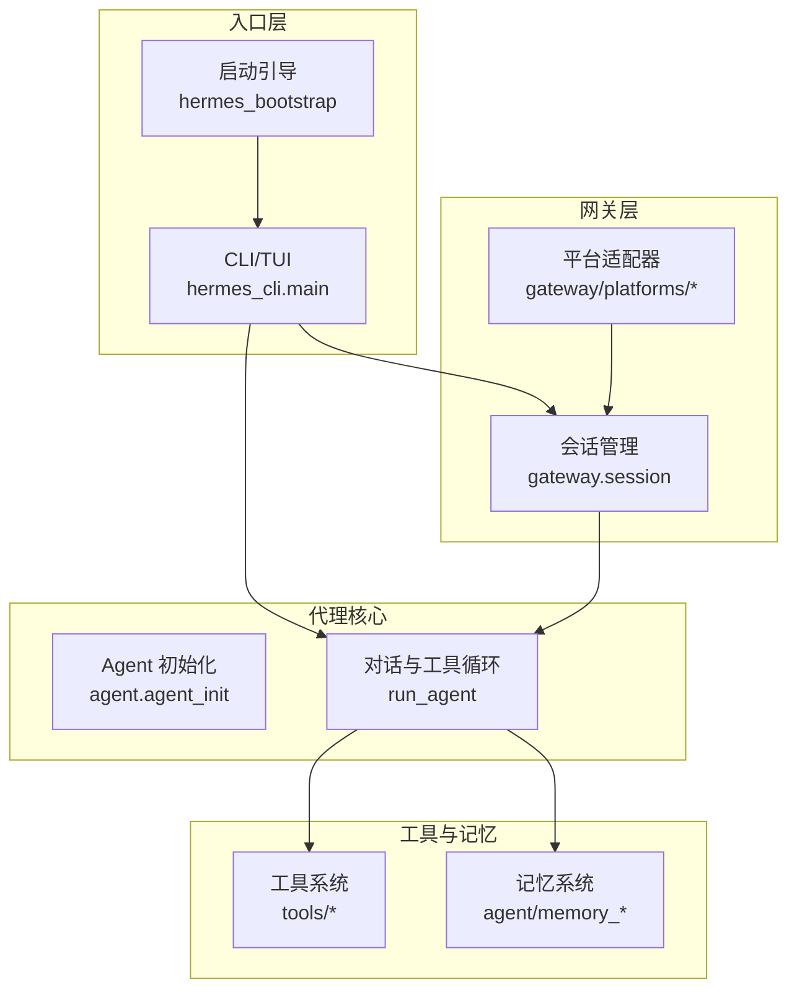
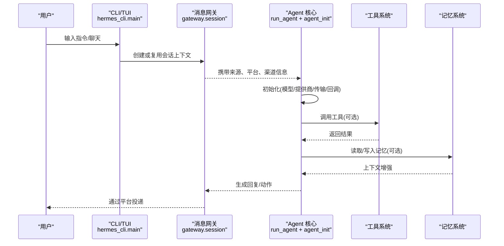
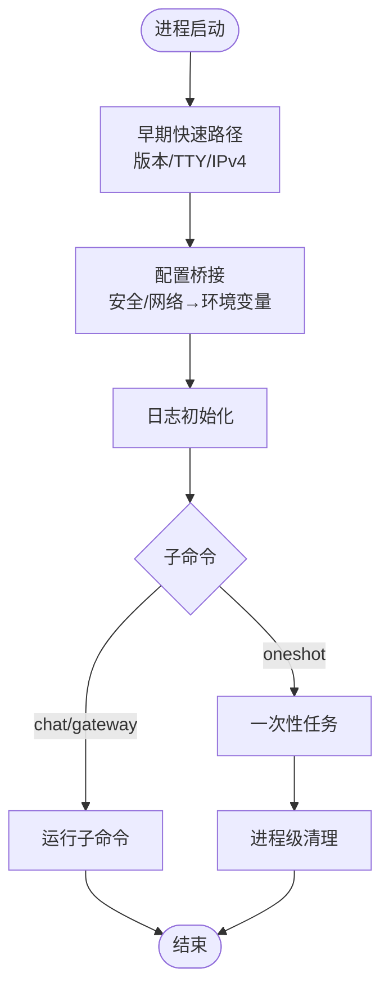
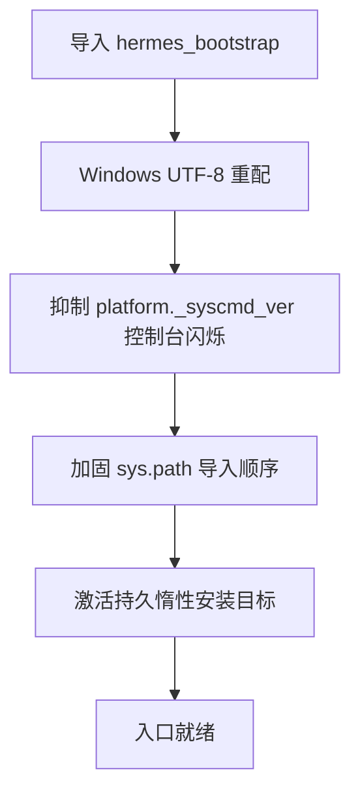
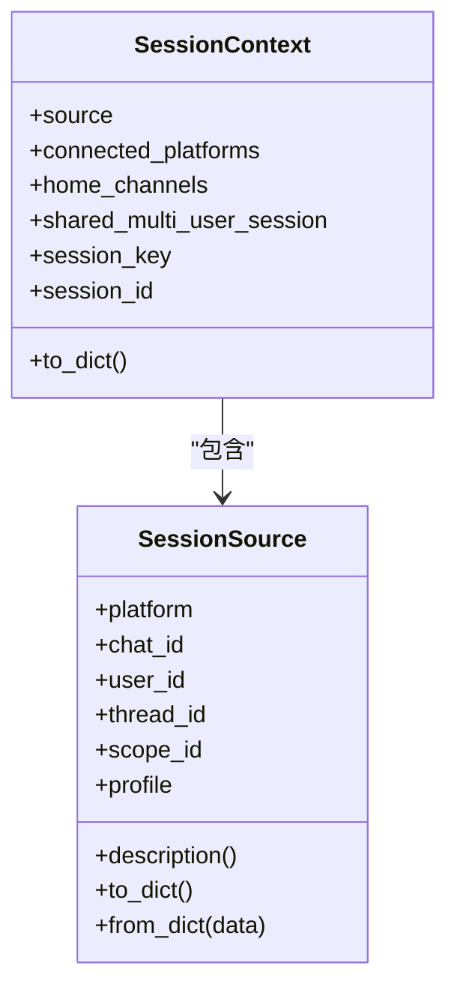
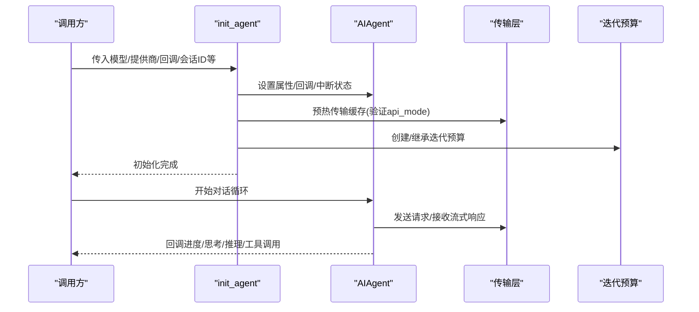
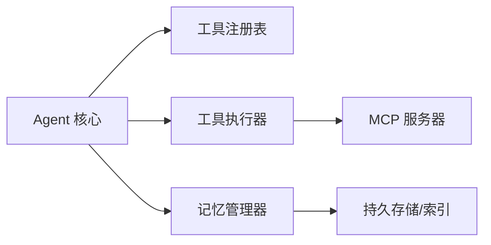
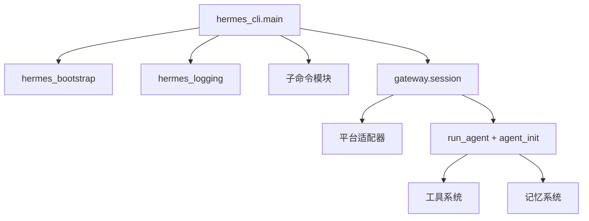

# 技术架构概览

<cite>
**本文引用的文件**
- [README.md](file://README.md)
- [cli.py](file://cli.py)
- [hermes_bootstrap.py](file://hermes_bootstrap.py)
- [run_agent.py](file://run_agent.py)
- [agent/agent_init.py](file://agent/agent_init.py)
- [gateway/session.py](file://gateway/session.py)
- [hermes_cli/main.py](file://hermes_cli/main.py)
</cite>

## 目录
1. [简介](#简介)
2. [项目结构](#项目结构)
3. [核心组件](#核心组件)
4. [架构总览](#架构总览)
5. [详细组件分析](#详细组件分析)
6. [依赖关系分析](#依赖关系分析)
7. [性能考量](#性能考量)
8. [故障排查指南](#故障排查指南)
9. [结论](#结论)
10. [附录](#附录)

## 简介
本概览面向 Hermes Agent 的技术架构，聚焦于 CLI 接口、Agent 核心、消息网关、工具系统、记忆系统等关键模块的职责与交互。文档解释模块化设计原则、异步与事件驱动模式、插件化扩展机制，并给出架构图与数据流图，帮助开发者快速理解整体结构与关键技术选型（Python、FastAPI、异步编程）。

## 项目结构
Hermes Agent 采用“入口层—网关层—代理核心—工具与记忆—平台适配”的分层组织：
- 入口层：CLI/TUI 与命令行主程序，负责用户交互、配置加载、启动流程。
- 网关层：消息网关，统一接入多平台（Telegram/Discord/Slack/WhatsApp/Signal 等），管理会话上下文、路由与投递。
- 代理核心：AIAgent 及其初始化、对话循环、工具调用、上下文压缩、轨迹保存、重试与预算控制。
- 工具与记忆：工具注册与执行、MCP 集成、技能系统、记忆管理与持久化。
- 平台适配：各平台的适配器与协议封装，屏蔽差异，向上提供统一接口。

**图表来源**
- [hermes_cli/main.py:1-120](file://hermes_cli/main.py#L1-L120)
- [hermes_bootstrap.py:1-120](file://hermes_bootstrap.py#L1-L120)
- [gateway/session.py:1-120](file://gateway/session.py#L1-L120)
- [agent/agent_init.py:1-120](file://agent/agent_init.py#L1-L120)
- [run_agent.py:1-120](file://run_agent.py#L1-L120)

**章节来源**
- [README.md:19-31](file://README.md#L19-L31)
- [hermes_cli/main.py:1-120](file://hermes_cli/main.py#L1-L120)
- [hermes_bootstrap.py:1-120](file://hermes_bootstrap.py#L1-L120)
- [gateway/session.py:1-120](file://gateway/session.py#L1-L120)
- [agent/agent_init.py:1-120](file://agent/agent_init.py#L1-L120)
- [run_agent.py:1-120](file://run_agent.py#L1-L120)

## 核心组件
- CLI 接口：提供交互式终端、命令解析、配置与环境加载、TUI 启动与恢复。
- 消息网关：维护会话上下文、来源标识、动态注入系统提示、跨平台消息路由与投递。
- Agent 核心：对话循环、工具调用、上下文压缩、轨迹记录、重试与预算控制、回调事件分发。
- 工具系统：工具注册、执行、安全护栏、结果分类、并行批处理、MCP 集成。
- 记忆系统：会话级与跨会话记忆、用户画像、技能自学习与沉淀。

**章节来源**
- [cli.py:1-120](file://cli.py#L1-L120)
- [gateway/session.py:148-346](file://gateway/session.py#L148-L346)
- [run_agent.py:412-597](file://run_agent.py#L412-L597)
- [agent/agent_init.py:459-800](file://agent/agent_init.py#L459-L800)

## 架构总览
下图展示从 CLI 到网关再到 Agent 的端到端请求流，以及工具与记忆的参与点。

**图表来源**
- [hermes_cli/main.py:437-486](file://hermes_cli/main.py#L437-L486)
- [gateway/session.py:148-346](file://gateway/session.py#L148-L346)
- [agent/agent_init.py:459-800](file://agent/agent_init.py#L459-L800)
- [run_agent.py:412-597](file://run_agent.py#L412-L597)

## 详细组件分析

### CLI 接口（hermes_cli.main）
- 职责：命令解析、子命令装配、环境加载、日志初始化、TUI/CLI 选择、一次性任务执行与清理。
- 关键点：
  - 早期快速路径：在导入重型依赖前完成版本检查、TTY 判断、鼠标残留抑制、IPv4 偏好设置。
  - 配置文件桥接：将 config.yaml 中的安全与网络选项提前映射为环境变量，确保后续模块正确行为。
  - 生命周期：一次性任务完成后进行进程级资源清理并硬退出，避免解释器终结期的原生崩溃。

**图表来源**
- [hermes_cli/main.py:76-120](file://hermes_cli/main.py#L76-L120)
- [hermes_cli/main.py:695-773](file://hermes_cli/main.py#L695-L773)
- [hermes_cli/main.py:176-222](file://hermes_cli/main.py#L176-L222)

**章节来源**
- [hermes_cli/main.py:1-120](file://hermes_cli/main.py#L1-L120)
- [hermes_cli/main.py:695-773](file://hermes_cli/main.py#L695-L773)
- [hermes_cli/main.py:176-222](file://hermes_cli/main.py#L176-L222)

### 启动引导（hermes_bootstrap）
- 职责：Windows UTF-8 标准化、子进程编码、平台版本查询静默化、可移植导入路径加固、惰性安装目标激活。
- 关键点：
  - 在入口模块最顶部导入，确保所有后续 I/O 与子进程使用 UTF-8。
  - 防止当前目录包遮蔽 Hermes 模块，保证稳定导入顺序。
  - 在不可变镜像中激活持久惰性安装目录，使上次安装的包可被导入。

**图表来源**
- [hermes_bootstrap.py:1-120](file://hermes_bootstrap.py#L1-L120)
- [hermes_bootstrap.py:168-240](file://hermes_bootstrap.py#L168-L240)

**章节来源**
- [hermes_bootstrap.py:1-120](file://hermes_bootstrap.py#L1-L120)
- [hermes_bootstrap.py:168-240](file://hermes_bootstrap.py#L168-L240)

### 消息网关会话（gateway/session）
- 职责：会话来源描述、会话上下文构建、PII 脱敏、平台能力注入、动态系统提示段生成。
- 关键点：
  - SessionSource/SessionContext 承载来源、渠道、线程、范围隔离与多用户会话标记。
  - build_session_context_prompt 根据平台与工具可用性注入行为提示，避免承诺未实现的能力。
  - 对敏感 ID 进行哈希脱敏，同时保留路由所需原始值。

**图表来源**
- [gateway/session.py:148-346](file://gateway/session.py#L148-L346)

**章节来源**
- [gateway/session.py:148-346](file://gateway/session.py#L148-L346)

### Agent 核心（run_agent + agent_init）
- 职责：AIAgent 初始化、传输选择、提供商自动识别、回调绑定、上下文引擎过渡、会话数据库懒创建、迭代预算与中断控制。
- 关键点：
  - init_agent 集中处理参数、api_mode 推断、凭证池校验、传输预热、OpenRouter 元数据预取。
  - run_agent 暴露 AIAgent 类，封装对话循环、工具调用、轨迹保存、错误分类与恢复。
  - 支持多种 API 模式（chat_completions/codex_responses/anthropic_messages/bedrock_converse），按 provider/base_url 自动选择。

**图表来源**
- [agent/agent_init.py:459-800](file://agent/agent_init.py#L459-L800)
- [run_agent.py:412-597](file://run_agent.py#L412-L597)

**章节来源**
- [agent/agent_init.py:459-800](file://agent/agent_init.py#L459-L800)
- [run_agent.py:412-597](file://run_agent.py#L412-L597)

### 工具系统与记忆系统（概念性）
- 工具系统：注册表驱动、安全护栏、结果分类、并行批处理、MCP 集成、终端/浏览器/代码执行等工具集。
- 记忆系统：会话内上下文压缩、跨会话检索、用户画像、技能自学习、FTS5 搜索与 LLM 摘要。

[此图为概念性示意，不直接映射具体源码文件]

## 依赖关系分析
- CLI 依赖 hermes_bootstrap 进行启动期环境修复；依赖 hermes_logging 进行日志初始化；依赖各子命令模块进行功能分发。
- 网关依赖 gateway.session 进行会话上下文与动态提示构建；依赖平台适配器进行消息收发。
- Agent 依赖 agent_init 进行初始化与传输选择；依赖工具系统与记忆系统进行能力扩展。
- 各模块通过回调与事件解耦，降低耦合度，提升可测试性与可替换性。

**图表来源**
- [hermes_cli/main.py:437-486](file://hermes_cli/main.py#L437-L486)
- [gateway/session.py:148-346](file://gateway/session.py#L148-L346)
- [agent/agent_init.py:459-800](file://agent/agent_init.py#L459-L800)
- [run_agent.py:412-597](file://run_agent.py#L412-L597)

**章节来源**
- [hermes_cli/main.py:437-486](file://hermes_cli/main.py#L437-L486)
- [gateway/session.py:148-346](file://gateway/session.py#L148-L346)
- [agent/agent_init.py:459-800](file://agent/agent_init.py#L459-L800)
- [run_agent.py:412-597](file://run_agent.py#L412-L597)

## 性能考量
- 启动优化：CLI 早期快速路径减少重型依赖导入；版本检查与 TTY 判断前置；IPv4 偏好尽早应用。
- 传输预热：init_agent 预热传输缓存，避免首次请求时导入/连接开销。
- 元数据预取：OpenRouter 模型元数据后台预取，避免首响阻塞。
- 会话上下文：动态提示按需注入，避免每轮变更导致缓存失效；PII 脱敏减少不必要的数据体积。
- 工具执行：并行批处理与超时控制，减少长尾延迟；大输出落盘避免内存膨胀。
- 记忆压缩：上下文压缩与 FTS5 搜索平衡召回与成本。

[本节为通用性能建议，不直接分析具体文件]

## 故障排查指南
- Windows 编码问题：确认 hermes_bootstrap 已导入且生效；检查 PYTHONUTF8/PYTHONIOENCODING；必要时手动 reconfigure stdio。
- 平台适配器断连：确保 connect() 接受 is_reconnect 关键字；网关重连逻辑会转发该参数。
- 工具泄露密钥：终端工具错误输出需经 redact 处理，避免明文密钥进入日志或轨迹。
- 会话 DB 创建失败：run_agent 会在失败后重试；检查 SQLite 锁与权限。
- 配置未生效：确认 CLI 早期桥接已将 config.yaml 选项映射为环境变量；检查 managed scope 覆盖。

**章节来源**
- [hermes_bootstrap.py:1-120](file://hermes_bootstrap.py#L1-L120)
- [tests/gateway/test_adapter_connect_is_reconnect_contract.py:1-145](file://tests/gateway/test_adapter_connect_is_reconnect_contract.py#L1-L145)
- [tests/tools/test_terminal_error_redaction.py:1-42](file://tests/tools/test_terminal_error_redaction.py#L1-L42)
- [run_agent.py:598-671](file://run_agent.py#L598-L671)
- [hermes_cli/main.py:695-773](file://hermes_cli/main.py#L695-L773)

## 结论
Hermes Agent 采用清晰的模块化分层与事件驱动的异步架构，CLI 作为统一入口，网关负责多平台会话与路由，Agent 核心专注对话与工具编排，工具与记忆系统提供可扩展能力。通过启动引导、传输预热、元数据预取与上下文压缩等手段保障性能；通过回调与插件机制保持高内聚低耦合。Python 与 FastAPI（网关侧）的选择契合异步 IO 与生态丰富性，便于快速集成与扩展。

[本节为总结性内容，不直接分析具体文件]

## 附录
- 技术选型说明：
  - Python：生态完善、异步 IO 成熟、工具链丰富，适合 AI Agent 与多平台集成。
  - FastAPI：异步 Web 框架，易于构建高性能网关与 REST/WS 接口。
  - 异步编程模式：基于 asyncio 的事件循环，支撑高并发消息处理与流式响应。
  - 插件化：平台适配器、工具、记忆、技能均通过注册表与回调扩展，便于社区贡献与第三方集成。

[本节为概念性说明，不直接分析具体文件]