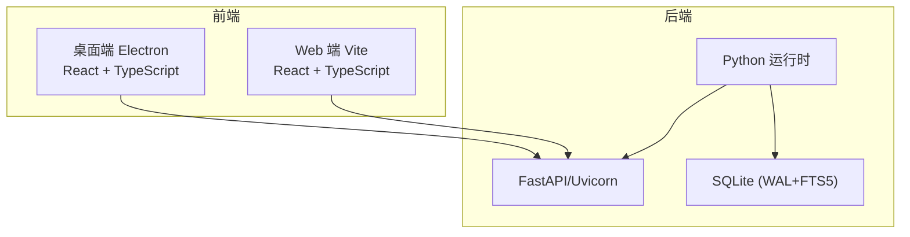
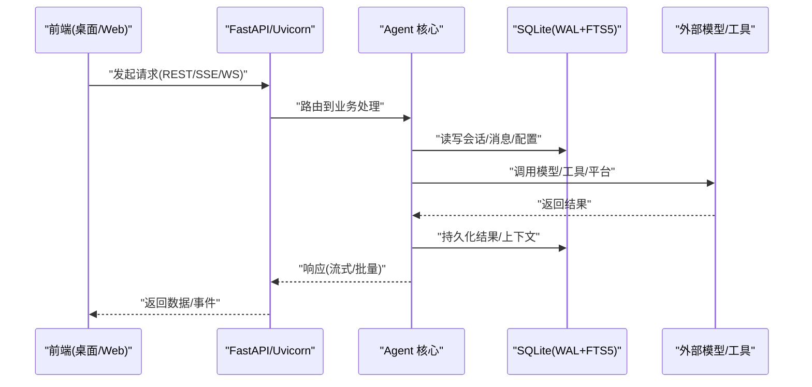
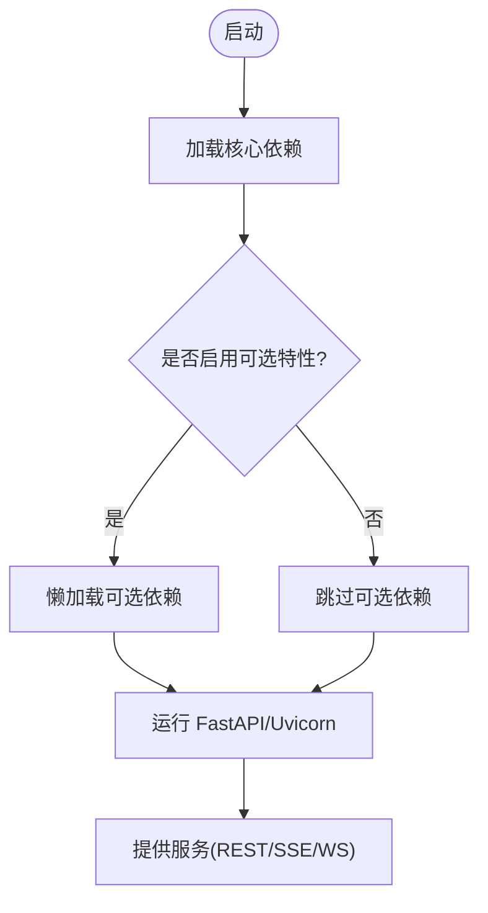
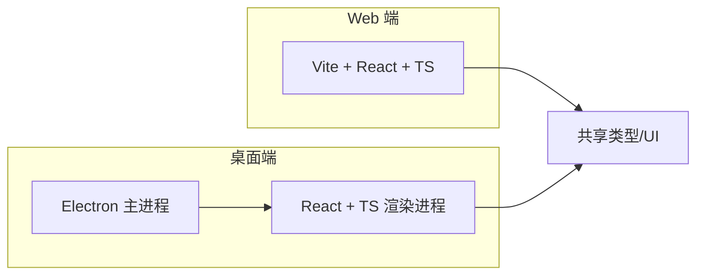
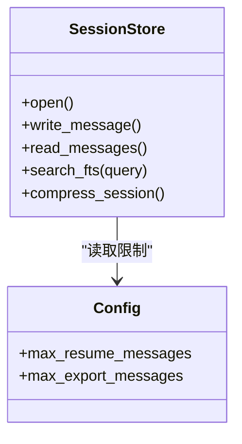
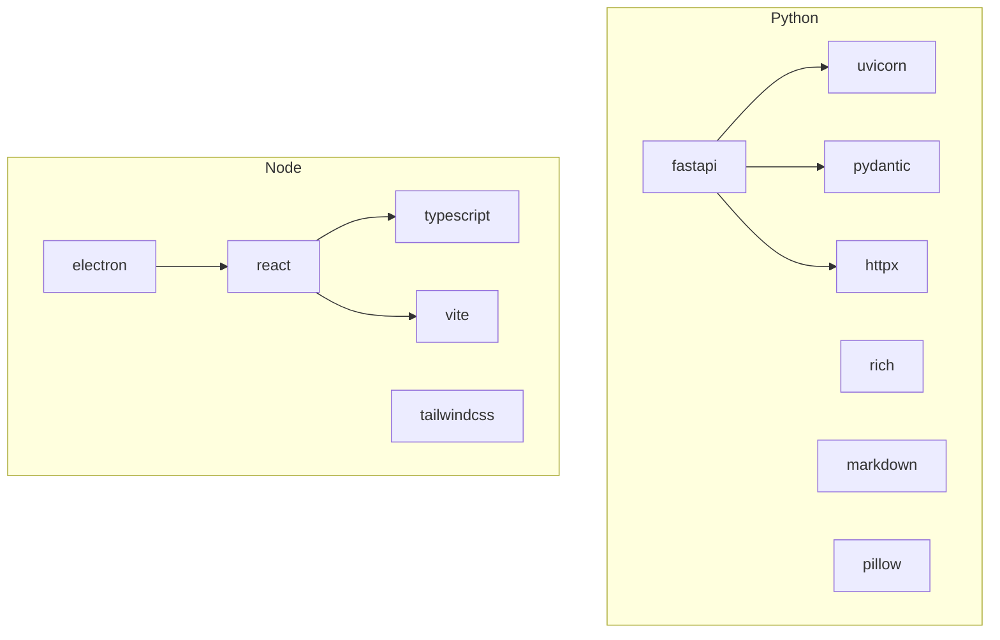

# 技术栈选型

<cite>
**本文引用的文件**
- [pyproject.toml](file://pyproject.toml)
- [package.json](file://package.json)
- [apps/desktop/package.json](file://apps/desktop/package.json)
- [web/package.json](file://web/package.json)
- [hermes_state.py](file://hermes_state.py)
- [README.md](file://README.md)
</cite>

## 目录
1. [简介](#简介)
2. [项目结构](#项目结构)
3. [核心组件](#核心组件)
4. [架构总览](#架构总览)
5. [详细组件分析](#详细组件分析)
6. [依赖关系分析](#依赖关系分析)
7. [性能考量](#性能考量)
8. [故障排查指南](#故障排查指南)
9. [结论](#结论)
10. [附录：迁移与对比建议](#附录：迁移与对比建议)

## 简介
本文件系统性梳理 Hermes Agent 的技术栈选型，重点解释后端语言与框架（Python、FastAPI）、前端技术栈（React、TypeScript）、数据库（SQLite）以及消息队列/缓存等关键决策的权衡。文档面向不同背景的读者，既提供高层概览，也给出代码级依据与可视化图示，帮助理解“为什么这样选”和“如何演进”。

## 项目结构
Hermes Agent 采用多语言、多工作区的工程组织方式：
- 后端以 Python 为主，使用 FastAPI + Uvicorn 提供 Web API 与网关能力；通过可选依赖按需加载各模型/工具/平台适配器。
- 前端包含桌面端（Electron + React + TypeScript）与 Web 端（Vite + React + TypeScript），共享部分 UI 与类型定义。
- 状态与会话持久化基于 SQLite，并启用 WAL 模式与 FTS5 全文检索，满足高并发读取与跨会话搜索需求。
- 构建与依赖管理：Python 侧使用 uv/pip 与 pyproject.toml 精确锁定版本；Node 侧使用 npm workspaces 统一管理多个子应用。

**图表来源**
- [pyproject.toml:105-111](file://pyproject.toml#L105-L111)
- [hermes_state.py:1-15](file://hermes_state.py#L1-L15)
- [apps/desktop/package.json:66-136](file://apps/desktop/package.json#L66-L136)
- [web/package.json:17-41](file://web/package.json#L17-L41)

**章节来源**
- [pyproject.toml:1-155](file://pyproject.toml#L1-L155)
- [package.json:1-70](file://package.json#L1-L70)
- [apps/desktop/package.json:1-276](file://apps/desktop/package.json#L1-L276)
- [web/package.json:1-55](file://web/package.json#L1-L55)
- [hermes_state.py:1-15](file://hermes_state.py#L1-L15)

## 核心组件
- 后端语言与框架：Python + FastAPI + Uvicorn，强调异步 I/O、高性能 ASGI 服务、自动 API 文档生成与可插拔生态。
- 前端技术栈：React + TypeScript + Vite/Electron，强调类型安全、开发体验、跨平台桌面与 Web 统一体验。
- 数据层：SQLite（WAL 模式 + FTS5），满足单机/轻量部署、强一致性与快速全文检索。
- 扩展与集成：通过可选依赖与插件机制，按场景懒加载第三方 SDK（如消息平台、TTS、图像生成等）。

**章节来源**
- [pyproject.toml:105-111](file://pyproject.toml#L105-L111)
- [pyproject.toml:157-352](file://pyproject.toml#L157-L352)
- [apps/desktop/package.json:66-136](file://apps/desktop/package.json#L66-L136)
- [web/package.json:17-41](file://web/package.json#L17-L41)
- [hermes_state.py:1-15](file://hermes_state.py#L1-L15)

## 架构总览
下图展示 Hermes Agent 的核心分层与交互：前端（桌面/Web）通过 HTTP/WS 调用后端 FastAPI 服务；后端在会话循环中调度工具与外部模型；状态与历史落盘至 SQLite；可选的消息平台通过适配器接入。

**图表来源**
- [pyproject.toml:105-111](file://pyproject.toml#L105-L111)
- [hermes_state.py:1-15](file://hermes_state.py#L1-L15)

## 详细组件分析

### 后端语言与框架：Python + FastAPI
- 选择 Python 的原因
  - 生态系统成熟：AI/ML 领域库丰富，便于集成多种模型与工具。
  - 异步支持：配合 asyncio 与 ASGI（Uvicorn）实现高吞吐 I/O 与流式响应。
  - 可维护性：类型提示、包管理与测试生态完善，利于大型项目长期演进。
- 选择 FastAPI 的原因
  - 高性能 ASGI 服务器（Uvicorn）原生支持，适合高并发与流式传输。
  - 自动生成 OpenAPI 文档，降低前后端联调成本。
  - 声明式路由与中间件体系，易于扩展认证、限流、审计等横切关注点。
- 依赖治理策略
  - 核心依赖精确锁定，减少供应链风险；非核心功能通过可选依赖懒加载，缩小默认安装面。

**图表来源**
- [pyproject.toml:157-352](file://pyproject.toml#L157-L352)
- [pyproject.toml:105-111](file://pyproject.toml#L105-L111)

**章节来源**
- [pyproject.toml:105-111](file://pyproject.toml#L105-L111)
- [pyproject.toml:157-352](file://pyproject.toml#L157-L352)

### 前端技术栈：React + TypeScript
- 选择 React 的原因
  - 组件化与生态成熟，便于构建复杂交互界面（聊天、终端、可视化等）。
  - 与 Vite 结合提供极快的开发与热更新体验。
- 选择 TypeScript 的原因
  - 静态类型提升代码质量与可维护性，降低重构成本。
  - 更好的 IDE 支持与类型推断，提升团队协作效率。
- 桌面端（Electron）与 Web 端统一
  - 通过 npm workspaces 共享类型与 UI 组件，保持行为一致。
  - 桌面端借助 Electron 提供本地系统集成能力（文件系统、进程、原生模块）。

**图表来源**
- [package.json:6-12](file://package.json#L6-L12)
- [apps/desktop/package.json:66-136](file://apps/desktop/package.json#L66-L136)
- [web/package.json:17-41](file://web/package.json#L17-L41)

**章节来源**
- [package.json:1-70](file://package.json#L1-L70)
- [apps/desktop/package.json:1-276](file://apps/desktop/package.json#L1-L276)
- [web/package.json:1-55](file://web/package.json#L1-L55)

### 数据库选型：SQLite（WAL + FTS5）
- 选择 SQLite 的原因
  - 零配置、单文件存储，适合单机/轻量部署与容器化环境。
  - WAL 模式支持多读一写，满足网关多平台并发读取场景。
  - FTS5 提供高效全文检索，支撑跨会话消息搜索与摘要召回。
- 设计要点
  - 会话拆分与压缩：通过父会话链管理长对话，避免单次查询过大。
  - 安全限制：对恢复/导出消息数量设置上限，防止内存压力。
  - 兼容性：在不同平台与 Python 版本下保持稳定行为。

**图表来源**
- [hermes_state.py:1-15](file://hermes_state.py#L1-L15)
- [hermes_state.py:114-125](file://hermes_state.py#L114-L125)

**章节来源**
- [hermes_state.py:1-15](file://hermes_state.py#L1-L15)
- [hermes_state.py:114-125](file://hermes_state.py#L114-L125)

### 消息队列与缓存系统
- 消息队列
  - 当前仓库未引入独立消息队列组件；跨平台消息通过 Gateway 与平台适配器直接对接（如 Telegram、Discord、Slack 等），由可选依赖懒加载。
  - 若未来需要解耦与削峰填谷，可考虑引入 Redis Streams、RabbitMQ 或 Kafka，但需评估运维复杂度与收益。
- 缓存系统
  - 当前未见显式缓存层；可通过内存缓存（如 LRU dict）或 Redis 对热点数据（模型元信息、工具定义、用户配置）进行加速。
  - 若引入缓存，需关注一致性、失效策略与分布式键空间隔离。

[本节为概念性说明，不直接分析具体文件]

## 依赖关系分析
- Python 依赖
  - 核心依赖：FastAPI、Uvicorn、Pydantic、HTTPX、Rich、Tenacity、Jinja2、Markdown、Pillow 等。
  - 可选依赖：按功能域划分（messaging、voice、vision、cloud providers 等），通过 extras 与懒加载控制安装面。
- Node 依赖
  - 桌面端：React、Electron、Vite、xterm、Tailwind 等。
  - Web 端：React、Vite、xterm、Tailwind 等。
  - 通过 workspaces 统一管理脚本与依赖。

**图表来源**
- [pyproject.toml:19-155](file://pyproject.toml#L19-L155)
- [apps/desktop/package.json:66-136](file://apps/desktop/package.json#L66-L136)
- [web/package.json:17-41](file://web/package.json#L17-L41)

**章节来源**
- [pyproject.toml:19-155](file://pyproject.toml#L19-L155)
- [apps/desktop/package.json:66-136](file://apps/desktop/package.json#L66-L136)
- [web/package.json:17-41](file://web/package.json#L17-L41)

## 性能考量
- 后端
  - 使用 ASGI 服务器（Uvicorn）与 FastAPI 获得高并发与低延迟。
  - 通过可选依赖懒加载减少冷启动时间与内存占用。
  - 流式响应（SSE/WS）提升用户体验，尤其适用于大模型输出与工具执行进度。
- 前端
  - Vite 提供快速 HMR 与生产优化打包。
  - React 组件化与虚拟列表（如 @tanstack/react-virtual）提升大数据量渲染性能。
  - Electron 主/渲染进程分离，避免阻塞 UI。
- 数据层
  - SQLite WAL 模式提升并发读取性能。
  - FTS5 索引加速全文检索，避免全表扫描。
  - 会话压缩与拆分控制单次查询规模，降低内存与 IO 压力。

[本节为通用性能讨论，不直接分析具体文件]

## 故障排查指南
- 依赖问题
  - 确保使用正确的 Python 版本范围（>=3.11,<3.14），避免上游二进制轮次不兼容。
  - 检查可选依赖是否正确安装（如 messaging、voice、vision 等），必要时使用 extras 安装。
- 前端构建
  - 确认 Node 版本与 npm 版本符合约束，避免构建失败。
  - 清理 node_modules 后重新安装，排除缓存导致的异常。
- 数据库
  - 若出现锁竞争或写入瓶颈，检查 SQLite 配置（WAL 模式、同步策略）。
  - 监控会话大小与消息数量，必要时调整压缩阈值与导出限制。

**章节来源**
- [pyproject.toml:8-15](file://pyproject.toml#L8-L15)
- [pyproject.toml:157-352](file://pyproject.toml#L157-L352)
- [package.json:55-58](file://package.json#L55-L58)
- [hermes_state.py:114-125](file://hermes_state.py#L114-L125)

## 结论
Hermes Agent 的技术选型围绕“高性能、可扩展、易维护”展开：
- 后端以 Python + FastAPI 为核心，兼顾 AI 生态与异步 I/O 能力，并通过可选依赖实现灵活扩展。
- 前端采用 React + TypeScript，统一桌面与 Web 体验，借助 Vite 与 Electron 提升开发与交付效率。
- 数据层选用 SQLite（WAL + FTS5），在轻量部署与强大检索之间取得平衡。
- 整体架构清晰、依赖治理严谨，有利于长期演进与团队协同。

[本节为总结性内容，不直接分析具体文件]

## 附录：迁移与对比建议
- 从 JSONL 到 SQLite
  - 优势：结构化存储、事务一致性、全文检索、并发读取。
  - 迁移步骤：导出旧格式 → 转换脚本 → 导入新 schema → 验证数据完整性。
- 引入消息队列
  - 适用场景：高吞吐消息、任务编排、解耦服务。
  - 候选方案：Redis Streams（轻量）、RabbitMQ（可靠）、Kafka（海量日志/事件）。
- 引入缓存层
  - 适用场景：热点数据（模型元信息、工具定义、用户配置）。
  - 候选方案：内存 LRU、Redis（分布式）、Memcached（简单 KV）。
- 前端迁移
  - 从 JS 到 TS：逐步引入类型定义，优先覆盖核心模块。
  - 从 Create React App 到 Vite：提升构建速度与开发体验。

[本节为概念性建议，不直接分析具体文件]