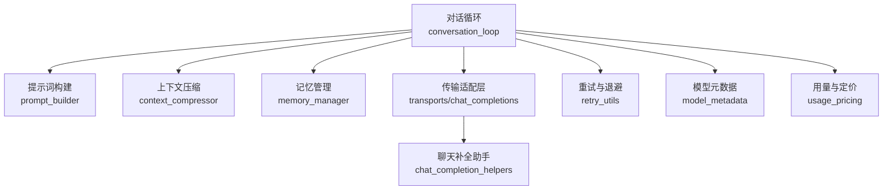
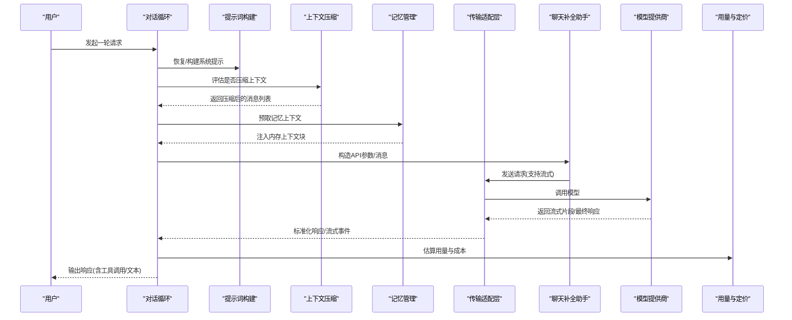
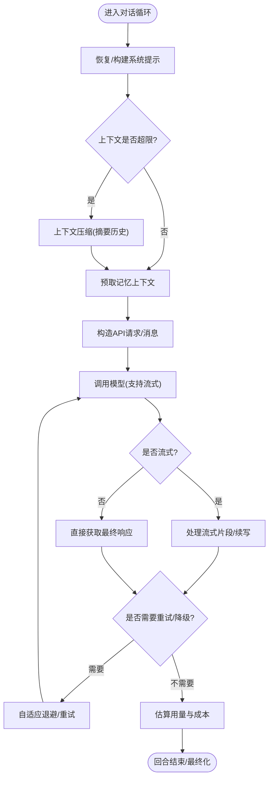
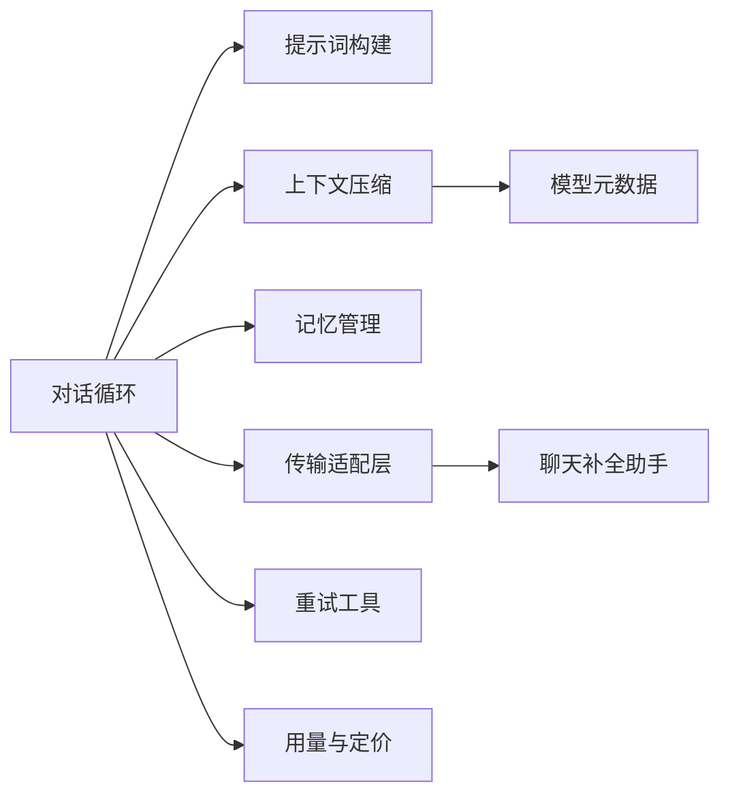

# AI 响应生成流程

<cite>
**本文引用的文件**
- [conversation_loop.py](file://agent/conversation_loop.py)
- [prompt_builder.py](file://agent/prompt_builder.py)
- [context_compressor.py](file://agent/context_compressor.py)
- [memory_manager.py](file://agent/memory_manager.py)
- [chat_completion_helpers.py](file://agent/chat_completion_helpers.py)
- [transports/chat_completions.py](file://agent/transports/chat_completions.py)
- [retry_utils.py](file://agent/retry_utils.py)
- [model_metadata.py](file://agent/model_metadata.py)
- [turn_context.py](file://agent/turn_context.py)
- [usage_pricing.py](file://agent/usage_pricing.py)
</cite>

## 目录
1. [简介](#简介)
2. [项目结构](#项目结构)
3. [核心组件](#核心组件)
4. [架构总览](#架构总览)
5. [详细组件分析](#详细组件分析)
6. [依赖关系分析](#依赖关系分析)
7. [性能考量](#性能考量)
8. [故障排查指南](#故障排查指南)
9. [结论](#结论)
10. [附录](#附录)

## 简介
本技术文档聚焦 Hermes Agent 的 AI 响应生成流程，围绕模型调用、提示词构建、响应解析与标准化、流式输出、超时控制、错误恢复、上下文压缩、记忆集成与工具调用协调等关键主题展开。文档提供时序图与状态转换图，说明模型选择策略、负载均衡与成本优化方案，并给出可定位到具体代码路径的配置与实现要点，帮助读者从高层到代码级全面理解该流程。

## 项目结构
Hermes Agent 将“对话回合”作为基本执行单元：一次用户输入进入 conversation loop，依次完成系统提示组装、上下文压缩、模型调用（支持多提供商）、工具调度、结果回写与后处理。关键模块职责如下：
- 对话循环：编排一轮请求的全生命周期（重试、降级、压缩、最终化）
- 提示词构建：拼装系统提示、平台提示、技能索引、安全扫描与注入规则
- 上下文压缩：在长会话中自动摘要历史，保护头尾，维持角色交替与可重放性
- 记忆管理：预取与同步持久记忆，注入内存上下文，屏蔽内部标记
- 传输适配层：统一不同 LLM 提供商的 chat/completions 接口与流式协议
- 元数据与定价：估算 token 用量、识别上下文长度限制、成本统计

**图示来源**
- [conversation_loop.py:1-120](file://agent/conversation_loop.py#L1-L120)
- [prompt_builder.py:1-120](file://agent/prompt_builder.py#L1-L120)
- [context_compressor.py:1-120](file://agent/context_compressor.py#L1-L120)
- [memory_manager.py:1-120](file://agent/memory_manager.py#L1-L120)
- [transports/chat_completions.py](file://agent/transports/chat_completions.py)
- [chat_completion_helpers.py](file://agent/chat_completion_helpers.py)
- [retry_utils.py](file://agent/retry_utils.py)
- [model_metadata.py](file://agent/model_metadata.py)
- [usage_pricing.py](file://agent/usage_pricing.py)

**章节来源**
- [conversation_loop.py:1-120](file://agent/conversation_loop.py#L1-L120)
- [prompt_builder.py:1-120](file://agent/prompt_builder.py#L1-L120)
- [context_compressor.py:1-120](file://agent/context_compressor.py#L1-L120)
- [memory_manager.py:1-120](file://agent/memory_manager.py#L1-L120)

## 核心组件
- 对话循环：负责一轮请求的完整编排，包括系统提示恢复/重建、上下文压缩决策、模型调用、工具调用、重试与降级、最终化与计费统计。
- 提示词构建：按平台、技能、安全扫描、并行工具调用指导等维度拼装系统提示，确保跨模型一致性与可缓存前缀。
- 上下文压缩：对长会话进行滚动或批量压缩，保留受保护的头尾，生成“仅参考”的历史摘要，避免指令漂移与重复工作。
- 记忆管理：预取与同步持久记忆，注入内存上下文块，屏蔽内部标记，保证流式可见内容安全。
- 传输适配层：统一不同提供商的 API 形态（如 Responses/Chat Completions），封装流式事件、超时、重试与错误分类。
- 元数据与定价：估算 token 用量、识别上下文长度限制、计算成本，辅助模型选择与节流策略。

**章节来源**
- [conversation_loop.py:1-120](file://agent/conversation_loop.py#L1-L120)
- [prompt_builder.py:1-120](file://agent/prompt_builder.py#L1-L120)
- [context_compressor.py:1-120](file://agent/context_compressor.py#L1-L120)
- [memory_manager.py:1-120](file://agent/memory_manager.py#L1-L120)
- [transports/chat_completions.py](file://agent/transports/chat_completions.py)
- [chat_completion_helpers.py](file://agent/chat_completion_helpers.py)
- [model_metadata.py](file://agent/model_metadata.py)
- [usage_pricing.py](file://agent/usage_pricing.py)

## 架构总览
下图展示一轮请求从进入对话循环到返回响应的端到端流程，涵盖提示词构建、上下文压缩、记忆注入、模型调用、工具调用、流式输出与最终化。

**图示来源**
- [conversation_loop.py:1-120](file://agent/conversation_loop.py#L1-L120)
- [prompt_builder.py:1-120](file://agent/prompt_builder.py#L1-L120)
- [context_compressor.py:1-120](file://agent/context_compressor.py#L1-L120)
- [memory_manager.py:1-120](file://agent/memory_manager.py#L1-L120)
- [transports/chat_completions.py](file://agent/transports/chat_completions.py)
- [chat_completion_helpers.py](file://agent/chat_completion_helpers.py)
- [usage_pricing.py](file://agent/usage_pricing.py)

## 详细组件分析

### 对话循环：模型调用、重试、压缩与最终化
- 系统提示恢复/重建：优先从会话存储恢复稳定前缀，若运行时环境变化则重建并持久化，确保跨轮次缓存命中。
- 上下文压缩：当消息长度接近阈值时，使用辅助模型对中间历史进行摘要，保留头尾与最近工具交互，插入“仅参考”的摘要块，避免指令漂移。
- 模型调用与流式处理：通过传输适配层统一调用，支持流式增量输出；遇到中断或截断时追加续写提示，保持连续性。
- 重试与降级：基于错误分类器区分本地错误与网络/配额错误，采用自适应退避与上限控制；对特定提供商的错误（如凭证过期、配额耗尽）给出明确指引。
- 最终化与计费：回合结束后汇总用量与成本，写入会话状态，触发记忆同步与后续钩子。

**图示来源**
- [conversation_loop.py:1-120](file://agent/conversation_loop.py#L1-L120)
- [context_compressor.py:1-120](file://agent/context_compressor.py#L1-L120)
- [retry_utils.py](file://agent/retry_utils.py)
- [model_metadata.py](file://agent/model_metadata.py)
- [usage_pricing.py](file://agent/usage_pricing.py)

**章节来源**
- [conversation_loop.py:1-120](file://agent/conversation_loop.py#L1-L120)
- [context_compressor.py:1-120](file://agent/context_compressor.py#L1-L120)
- [retry_utils.py](file://agent/retry_utils.py)
- [model_metadata.py](file://agent/model_metadata.py)
- [usage_pricing.py](file://agent/usage_pricing.py)

### 提示词构建：身份、平台、技能与安全注入
- 身份与平台提示：根据运行平台（CLI、桌面、WhatsApp、Telegram、Discord、Slack、Signal、Email、Cron）注入格式与附件能力提示。
- 技能索引与安全扫描：扫描 AGENTS.md、HERMES.md 等上下文文件，阻止潜在提示注入与 promptware，剥离 YAML frontmatter。
- 并行工具调用指导：鼓励独立读取/搜索/命令批量化，减少往返次数与上下文重发成本。
- 模型家族特化指导：针对 OpenAI/Gemini 等模型注入执行纪律、验证步骤与缺失上下文处理建议。
- 计算机使用指导：后台驱动桌面操作的安全与升级路径，强调背景优先、可验证与最小前台干预。

**章节来源**
- [prompt_builder.py:1-120](file://agent/prompt_builder.py#L1-L120)
- [prompt_builder.py:120-220](file://agent/prompt_builder.py#L120-L220)
- [prompt_builder.py:300-400](file://agent/prompt_builder.py#L300-L400)
- [prompt_builder.py:400-500](file://agent/prompt_builder.py#L400-L500)
- [prompt_builder.py:490-650](file://agent/prompt_builder.py#L490-L650)

### 上下文压缩：历史摘要、角色交替与可重放性
- 摘要模板与边界：为摘要添加明确的“仅参考”前缀与结束标记，防止模型将其误认为新任务。
- 受保护区域：保留头部与尾部消息，维护 user/assistant 交替，避免模板校验失败导致请求被拒。
- 工具输出剪枝：在摘要前对旧工具输出进行裁剪，降低提示大小与成本。
- 技能丢失防护：检测即将丢失的技能指令，注入“已修剪”标记，提醒重新加载。
- 失败降级：当摘要失败时，使用确定性降级策略保留关键锚点，避免会话卡死。

**章节来源**
- [context_compressor.py:1-120](file://agent/context_compressor.py#L1-L120)
- [context_compressor.py:100-180](file://agent/context_compressor.py#L100-L180)
- [context_compressor.py:230-280](file://agent/context_compressor.py#L230-L280)
- [context_compressor.py:480-540](file://agent/context_compressor.py#L480-L540)
- [context_compressor.py:760-780](file://agent/context_compressor.py#L760-L780)

### 记忆管理：预取、同步与流式清洗
- 提供者注册与工具注入：仅允许一个外部提供者，规范化工具 schema，避免名称冲突与无效 schema 污染请求。
- 预取与同步：预取阶段并行拉取记忆上下文，超时跳过；回合结束后异步同步，不阻塞主流程。
- 流式清洗：对包含 `<memory-context>` 标签的流式内容进行状态机清洗，避免内部标记泄露到 UI。
- 上下文块包装：将记忆上下文包裹为带系统注记的块，指示其为权威参考而非新输入。

**章节来源**
- [memory_manager.py:1-120](file://agent/memory_manager.py#L1-L120)
- [memory_manager.py:110-160](file://agent/memory_manager.py#L110-L160)
- [memory_manager.py:170-210](file://agent/memory_manager.py#L170-L210)
- [memory_manager.py:340-365](file://agent/memory_manager.py#L340-L365)
- [memory_manager.py:520-600](file://agent/memory_manager.py#L520-L600)
- [memory_manager.py:630-700](file://agent/memory_manager.py#L630-L700)

### 传输适配层与响应标准化
- 统一接口：将不同提供商的 Responses/Chat Completions 抽象为统一的调用与流式事件模型。
- 消息转换：在离开进程前剥离不受支持的键，避免严格网关拒绝。
- 流式处理：增量拼接片段，处理中断续写，确保可见内容与可重放内容分离。
- 错误分类：识别认证、配额、速率限制与本地处理错误，决定重试或降级策略。

**章节来源**
- [transports/chat_completions.py](file://agent/transports/chat_completions.py)
- [chat_completion_helpers.py](file://agent/chat_completion_helpers.py)
- [conversation_loop.py:150-200](file://agent/conversation_loop.py#L150-L200)

### 模型选择策略、负载均衡与成本优化
- 模型选择：依据提供商、base_url、模型名与平台提示选择合适路由；对特定提供商（如 Nous）进行凭证刷新与授权检查。
- 负载均衡：通过重试与退避缓解瞬时过载；对慢速或不可用提供商进行快速失败与切换。
- 成本优化：
  - 并行工具调用：减少往返与上下文重发成本。
  - 上下文压缩：摘要历史，降低每轮提示大小。
  - 用量估算与定价：实时估算 token 用量与成本，辅助节流与预算控制。

**章节来源**
- [conversation_loop.py:430-510](file://agent/conversation_loop.py#L430-L510)
- [prompt_builder.py:360-400](file://agent/prompt_builder.py#L360-L400)
- [context_compressor.py:410-445](file://agent/context_compressor.py#L410-L445)
- [usage_pricing.py](file://agent/usage_pricing.py)
- [model_metadata.py](file://agent/model_metadata.py)

## 依赖关系分析
- 对话循环依赖提示词构建、上下文压缩、记忆管理与传输适配层，形成强内聚的回合编排。
- 传输适配层依赖聊天补全助手进行消息转换与流式处理，向上暴露统一接口。
- 上下文压缩依赖模型元数据进行上下文长度估计与阈值判断，依赖重试工具进行稳健调用。
- 记忆管理依赖工具注册表与线程池进行异步预取与同步，确保不阻塞主流程。

**图示来源**
- [conversation_loop.py:1-120](file://agent/conversation_loop.py#L1-L120)
- [prompt_builder.py:1-120](file://agent/prompt_builder.py#L1-L120)
- [context_compressor.py:1-120](file://agent/context_compressor.py#L1-L120)
- [memory_manager.py:1-120](file://agent/memory_manager.py#L1-L120)
- [transports/chat_completions.py](file://agent/transports/chat_completions.py)
- [chat_completion_helpers.py](file://agent/chat_completion_helpers.py)
- [retry_utils.py](file://agent/retry_utils.py)
- [model_metadata.py](file://agent/model_metadata.py)
- [usage_pricing.py](file://agent/usage_pricing.py)

**章节来源**
- [conversation_loop.py:1-120](file://agent/conversation_loop.py#L1-L120)
- [transports/chat_completions.py](file://agent/transports/chat_completions.py)
- [chat_completion_helpers.py](file://agent/chat_completion_helpers.py)
- [context_compressor.py:1-120](file://agent/context_compressor.py#L1-L120)
- [memory_manager.py:1-120](file://agent/memory_manager.py#L1-L120)

## 性能考量
- 并行工具调用：鼓励独立读取/搜索/命令批量化，减少往返与上下文重发成本。
- 上下文压缩：对长会话进行滚动摘要，保护头尾与最近工具交互，降低提示大小。
- 流式输出：增量推送片段，提升首字延迟与用户体验。
- 重试与退避：自适应退避与上限控制，避免雪崩与资源耗尽。
- 用量与定价：实时估算 token 用量与成本，辅助节流与预算控制。

[本节为通用性能讨论，不直接分析具体文件]

## 故障排查指南
- 认证与配额错误：识别提供商返回的 401/402/403 或配额耗尽标记，给出充值或切换提供商指引。
- 上下文长度限制：检测 provider 错误中的上下文长度信息，调整压缩阈值或提示大小。
- 流式中断与截断：追加续写提示，保持回答连续性；记录中断原因以便复盘。
- 记忆提供者超时：外部提供者预取超时时跳过，避免阻塞主流程；记录警告日志。
- 工具输出过大：提示模型拆分大内容，避免流式超时；必要时启用工具输出剪枝。

**章节来源**
- [conversation_loop.py:290-350](file://agent/conversation_loop.py#L290-L350)
- [context_compressor.py:70-95](file://agent/context_compressor.py#L70-L95)
- [memory_manager.py:560-600](file://agent/memory_manager.py#L560-L600)
- [retry_utils.py](file://agent/retry_utils.py)
- [model_metadata.py](file://agent/model_metadata.py)

## 结论
Hermes Agent 的 AI 响应生成流程以对话循环为核心，整合提示词构建、上下文压缩、记忆注入、传输适配与重试机制，形成高可用、可扩展且成本优化的响应管线。通过并行工具调用、流式输出与智能压缩，系统在长会话与多提供商环境下保持稳定与高效。配置与实现细节均可在对应文件中定位，便于进一步定制与排障。

[本节为总结性内容，不直接分析具体文件]

## 附录
- 配置参数示例与路径：
  - 系统提示与平台提示：见 [prompt_builder.py](file://agent/prompt_builder.py)
  - 上下文压缩阈值与摘要比例：见 [context_compressor.py](file://agent/context_compressor.py)
  - 记忆提供者超时与线程池：见 [memory_manager.py](file://agent/memory_manager.py)
  - 重试退避与上限：见 [retry_utils.py](file://agent/retry_utils.py)
  - 模型元数据与上下文长度：见 [model_metadata.py](file://agent/model_metadata.py)
  - 用量与定价估算：见 [usage_pricing.py](file://agent/usage_pricing.py)

[本节为补充信息，不直接分析具体文件]