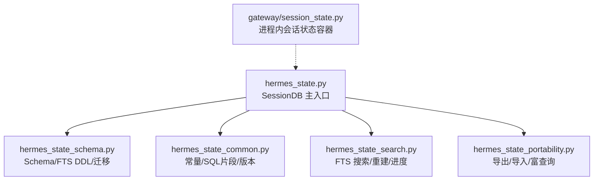
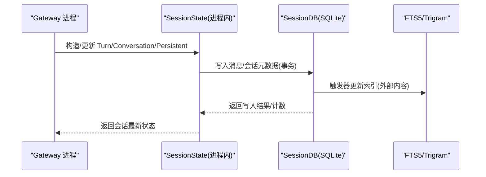
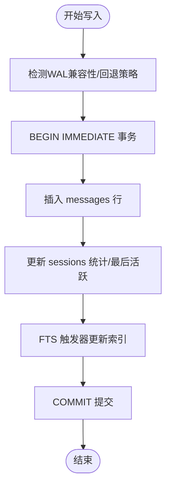
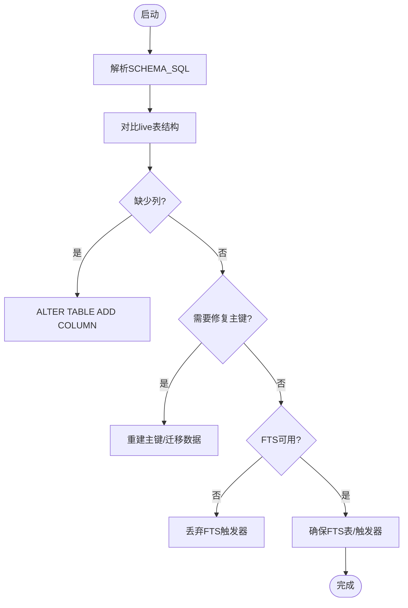
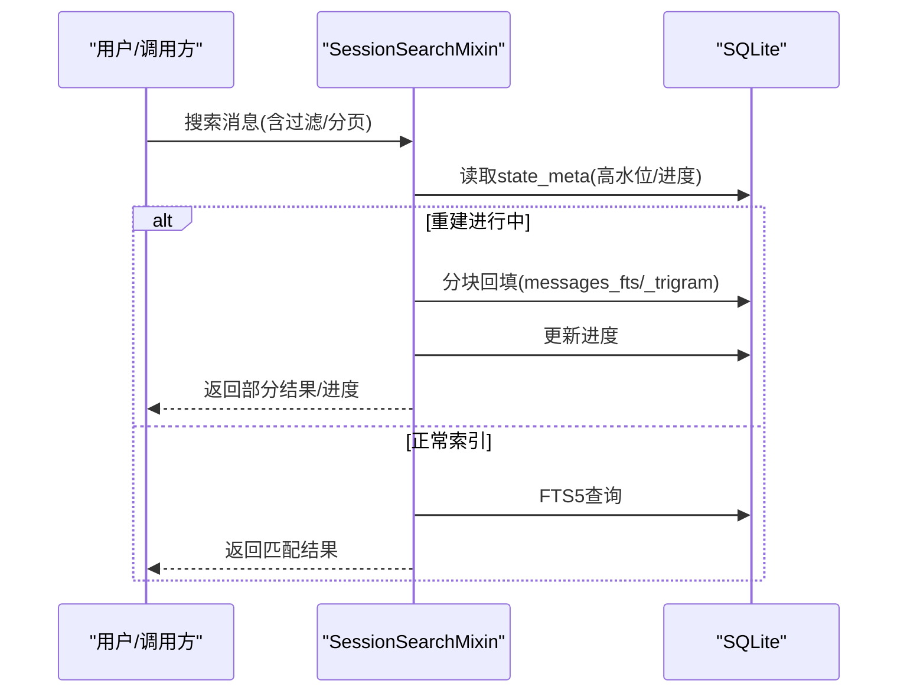
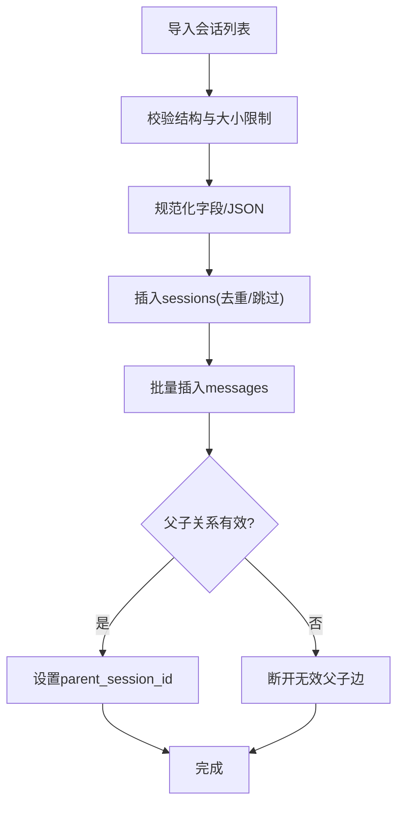
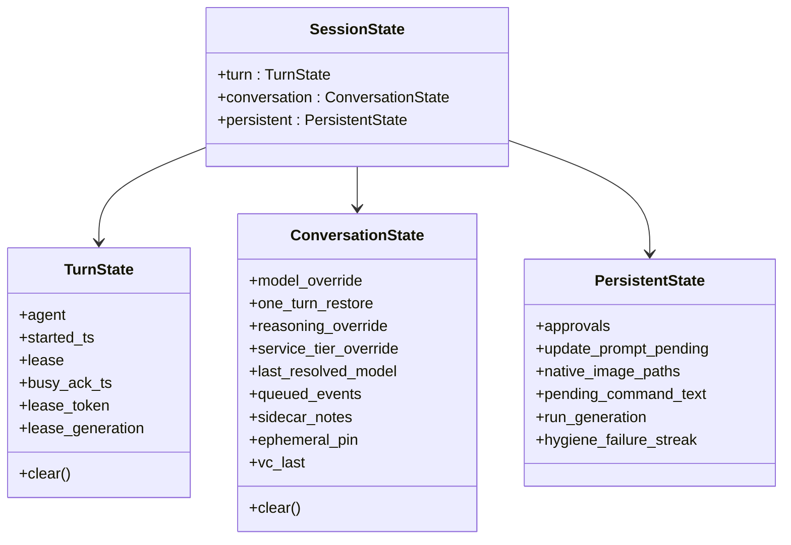
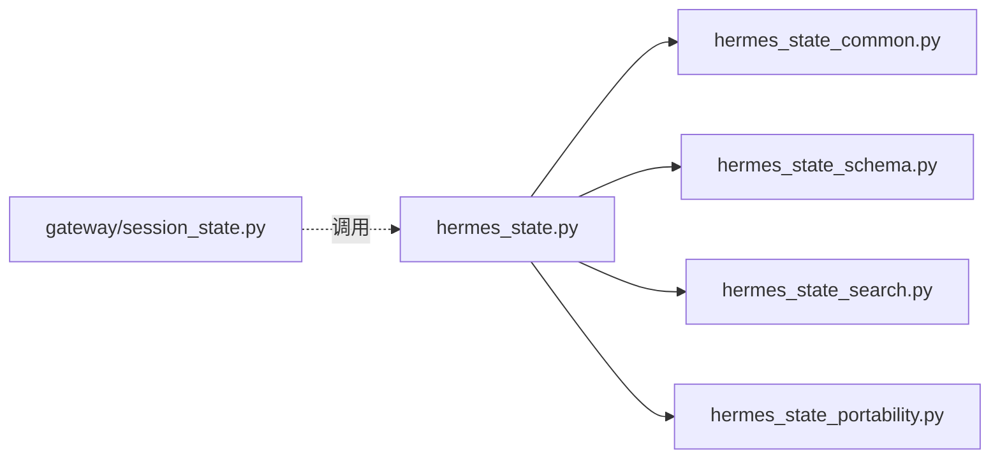
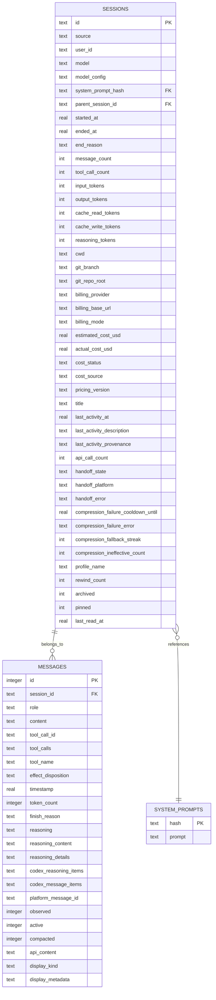
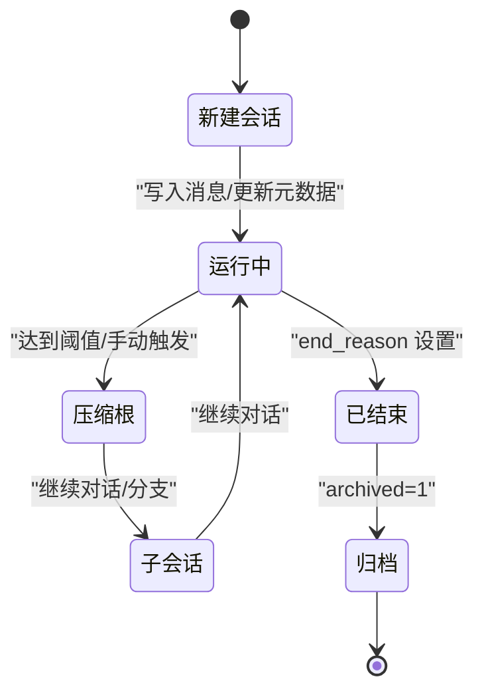

# 会话状态管理

<cite>
**本文引用的文件**
- [hermes_state.py](file://hermes_state.py)
- [hermes_state_schema.py](file://hermes_state_schema.py)
- [hermes_state_common.py](file://hermes_state_common.py)
- [hermes_state_portability.py](file://hermes_state_portability.py)
- [hermes_state_search.py](file://hermes_state_search.py)
- [gateway/session_state.py](file://gateway/session_state.py)
</cite>

## 目录
1. [简介](#简介)
2. [项目结构](#项目结构)
3. [核心组件](#核心组件)
4. [架构总览](#架构总览)
5. [详细组件分析](#详细组件分析)
6. [依赖关系分析](#依赖关系分析)
7. [性能考虑](#性能考虑)
8. [故障排除指南](#故障排除指南)
9. [结论](#结论)
10. [附录](#附录)

## 简介
本技术文档聚焦 Hermes Agent 的“会话状态管理”，围绕以下目标展开：
- 会话生命周期与状态持久化（SQLite + FTS5）
- 上下文维护、压缩与拆分（父/子会话链）
- 并发访问控制、事务管理与数据一致性
- 版本兼容与模式迁移（列对齐、FTS 布局升级）
- 会话恢复、断点续传与状态同步
- 状态压缩、备份恢复与性能优化策略
- 状态调试工具与故障排除

Hermes 使用 SQLite 作为会话状态的持久化存储，采用 WAL 模式提升并发读能力；通过 FTS5 提供全文检索；通过“压缩根—子会话”链实现长对话的分段与归档；通过声明式 schema 与增量列对齐保证跨版本兼容。

## 项目结构
与会话状态管理直接相关的代码集中在 hermes_state 系列模块与 gateway 的会话状态容器：
- hermes_state.py：主入口，封装 SessionDB，负责连接、WAL、事务、消息写入、会话元数据、压缩链、恢复保护等
- hermes_state_schema.py：Schema 创建、列对齐、FTS 触发器与索引重建
- hermes_state_common.py：共享常量、SQL片段、schema_version、FTS 布局版本、预览与列表 SQL
- hermes_state_portability.py：导出/导入、富查询、工作区聚合、cron 运行记录
- hermes_state_search.py：FTS5/CJK/trigram 搜索、增量合并、后台重建进度与收尾
- gateway/session_state.py：Gateway 进程内每会话运行时状态（Turn/Conversation/Persistent），与持久层解耦

**图表来源**
- [hermes_state.py:1-120](file://hermes_state.py#L1-L120)
- [hermes_state_schema.py:1-120](file://hermes_state_schema.py#L1-L120)
- [hermes_state_common.py:167-185](file://hermes_state_common.py#L167-L185)
- [hermes_state_search.py:1-120](file://hermes_state_search.py#L1-L120)
- [hermes_state_portability.py:1-60](file://hermes_state_portability.py#L1-L60)
- [gateway/session_state.py:1-40](file://gateway/session_state.py#L1-L40)

**章节来源**
- [hermes_state.py:1-120](file://hermes_state.py#L1-L120)
- [hermes_state_schema.py:1-120](file://hermes_state_schema.py#L1-L120)
- [hermes_state_common.py:167-185](file://hermes_state_common.py#L167-L185)
- [hermes_state_search.py:1-120](file://hermes_state_search.py#L1-L120)
- [hermes_state_portability.py:1-60](file://hermes_state_portability.py#L1-L60)
- [gateway/session_state.py:1-40](file://gateway/session_state.py#L1-L40)

## 核心组件
- 会话数据库 SessionDB（hermes_state.py）
  - 连接与 WAL 配置、平台兼容性回退（NFS/ZFS/WSL1）
  - 写锁与事务边界（BEGIN IMMEDIATE）、读路径隔离
  - 消息追加、批量写入、转储限制（resume/export 安全上限）
  - 压缩根/子会话链、委托子代理级联删除
  - 系统提示去重与哈希表、代理活动心跳与最后活跃时间
- Schema 与迁移（hermes_state_schema.py）
  - 声明式 SCHEMA_SQL 为唯一真相源
  - 启动时自动 ADD COLUMN 对齐缺失列
  - FTS 触发器窄化（AFTER UPDATE OF）、重建与降级
  - 历史主键修复（gateway_routing、session_model_usage）
- 搜索与 FTS（hermes_state_search.py）
  - 外部内容 FTS5（v23）与 trigram 索引
  - 增量合并、分块回填、高水位标记、收尾清理
  - CJK 索引重建与陈旧标记处理
- 可移植性（hermes_state_portability.py）
  - 导出单个/全部会话、按 lineage 拼接
  - 导入校验、大小限制、父子关系修复、循环检测
  - 富查询（preview、last_active）
- Gateway 进程内会话状态（gateway/session_state.py）
  - TurnState / ConversationState / PersistentState 三域分层
  - 旧字典视图适配，避免破坏测试与遗留调用

**章节来源**
- [hermes_state.py:1-120](file://hermes_state.py#L1-L120)
- [hermes_state_schema.py:619-700](file://hermes_state_schema.py#L619-L700)
- [hermes_state_search.py:69-160](file://hermes_state_search.py#L69-L160)
- [hermes_state_portability.py:266-304](file://hermes_state_portability.py#L266-L304)
- [gateway/session_state.py:51-179](file://gateway/session_state.py#L51-L179)

## 架构总览
下图展示从请求到持久化的关键路径：Gateway 进程内会话状态驱动业务逻辑，最终通过 SessionDB 将消息与元数据落盘，并更新 FTS 索引。

**图表来源**
- [gateway/session_state.py:172-179](file://gateway/session_state.py#L172-L179)
- [hermes_state.py:1-120](file://hermes_state.py#L1-L120)
- [hermes_state_schema.py:415-462](file://hermes_state_schema.py#L415-L462)
- [hermes_state_common.py:479-534](file://hermes_state_common.py#L479-L534)

## 详细组件分析

### 会话数据库 SessionDB（持久化、事务、并发）
- WAL 与兼容性
  - 优先启用 WAL；在 NFS/SMB/FUSE/ZFS 或存在 WAL-reset 漏洞时回退到 DELETE 模式，确保可用性
  - macOS 强制 synchronous=FULL 与 checkpoint_fullfsync，降低关机/重启时的 btree/WAL 损坏风险
- 并发与事务
  - 写路径使用锁与 BEGIN IMMEDIATE 事务，保证原子性与可见性
  - 读路径使用只读上下文，避免阻塞写者
- 恢复保护
  - resume/export 有最大消息数限制，防止超大会话导致内存压力
- 压缩链与级联删除
  - 支持 parent_session_id 链；委托子代理通过 _delegate_from 标记进行级联删除
- 系统提示与哈希
  - system_prompts 表集中存储，sessions.system_prompt_hash 外键引用，减少重复

**图表来源**
- [hermes_state.py:486-565](file://hermes_state.py#L486-L565)
- [hermes_state_schema.py:415-462](file://hermes_state_schema.py#L415-L462)
- [hermes_state_common.py:197-373](file://hermes_state_common.py#L197-L373)

**章节来源**
- [hermes_state.py:486-565](file://hermes_state.py#L486-L565)
- [hermes_state.py:285-329](file://hermes_state.py#L285-L329)
- [hermes_state_schema.py:619-700](file://hermes_state_schema.py#L619-L700)

### Schema 与迁移（列对齐、FTS 布局升级）
- 声明式 schema
  - SCHEMA_SQL 是权威定义；启动时解析并对比 live 表结构，自动 ADD COLUMN
- FTS 迁移
  - v23 外部内容布局替代 v22 内联布局；必要时 demote 旧 vtable 并重建
  - 触发器窄化为 AFTER UPDATE OF，避免无关列变更触发昂贵更新
  - 支持分块回填与高水位标记，崩溃后可恢复
- 历史问题修复
  - gateway_routing 主键重建（scope, session_key）
  - session_model_usage 主键加入 task 维度

**图表来源**
- [hermes_state_schema.py:382-425](file://hermes_state_schema.py#L382-L425)
- [hermes_state_schema.py:426-618](file://hermes_state_schema.py#L426-L618)
- [hermes_state_schema.py:619-700](file://hermes_state_schema.py#L619-L700)

**章节来源**
- [hermes_state_schema.py:382-425](file://hermes_state_schema.py#L382-L425)
- [hermes_state_schema.py:426-618](file://hermes_state_schema.py#L426-L618)
- [hermes_state_schema.py:619-700](file://hermes_state_schema.py#L619-L700)

### 搜索与 FTS（全文检索、CJK、trigram）
- 外部内容 FTS5
  - messages_fts 与 messages_fts_trigram 基于 messages 表，role='tool' 的行被排除出 trigram 索引以降低开销
- 增量合并与重建
  - fts_rebuild_high_water/progress 标记分块回填；完成后执行边界扫描与清理
  - CJK 索引独立重建流程，支持陈旧标记重置与重建
- 查询保护
  - 用户输入长度限制，避免恶意大查询

**图表来源**
- [hermes_state_search.py:69-160](file://hermes_state_search.py#L69-L160)
- [hermes_state_search.py:264-330](file://hermes_state_search.py#L264-L330)
- [hermes_state_search.py:332-420](file://hermes_state_search.py#L332-L420)
- [hermes_state_common.py:415-534](file://hermes_state_common.py#L415-L534)

**章节来源**
- [hermes_state_search.py:69-160](file://hermes_state_search.py#L69-L160)
- [hermes_state_search.py:264-330](file://hermes_state_search.py#L264-L330)
- [hermes_state_search.py:332-420](file://hermes_state_search.py#L332-L420)
- [hermes_state_common.py:415-534](file://hermes_state_common.py#L415-L534)

### 可移植性（导出/导入、富查询）
- 导出
  - export_session/export_all/export_session_lineage：单会话、全量、按压缩链拼接
- 导入
  - import_sessions：严格校验类型/大小/JSON 合法性；跳过重复 id；父子关系修复与环检测；重置活动字段避免假活跃
- 富查询
  - list_sessions_rich/get_session_rich_row：包含 preview、last_active 等增强字段

**图表来源**
- [hermes_state_portability.py:266-304](file://hermes_state_portability.py#L266-L304)
- [hermes_state_portability.py:376-715](file://hermes_state_portability.py#L376-L715)

**章节来源**
- [hermes_state_portability.py:266-304](file://hermes_state_portability.py#L266-L304)
- [hermes_state_portability.py:376-715](file://hermes_state_portability.py#L376-L715)

### Gateway 进程内会话状态（Turn/Conversation/Persistent）
- 分层设计
  - TurnState：单次运行 turn 的生命周期（agent、lease、busy_ack）
  - ConversationState：会话边界内的覆盖配置（模型/推理/服务等级/队列/侧车笔记/语音上下文）
  - PersistentState：跨边界持久化（审批、待处理命令文本、图像附件、run_generation、卫生压缩失败次数）
- 旧接口兼容
  - 通过 MutableMapping 视图暴露旧 dict 属性，便于测试与遗留代码平滑过渡

**图表来源**
- [gateway/session_state.py:51-179](file://gateway/session_state.py#L51-L179)

**章节来源**
- [gateway/session_state.py:51-179](file://gateway/session_state.py#L51-L179)

## 依赖关系分析
- 模块耦合
  - hermes_state.py 依赖 hermes_state_common（常量/SQL片段）、hermes_state_schema（DDL/迁移）、hermes_state_search（搜索/重建）、hermes_state_portability（导出/导入）
  - gateway/session_state.py 与持久层解耦，仅通过 SessionDB 读写
- 外部依赖
  - SQLite（WAL/FTS5）、psutil（进程存活探测）、平台特性（macOS fsync）
- 潜在循环与规避
  - 通过 mixin 与常量分离避免 hermes_state 与其子模块相互导入

**图表来源**
- [hermes_state.py:17-79](file://hermes_state.py#L17-L79)
- [gateway/session_state.py:1-40](file://gateway/session_state.py#L1-L40)

**章节来源**
- [hermes_state.py:17-79](file://hermes_state.py#L17-L79)
- [gateway/session_state.py:1-40](file://gateway/session_state.py#L1-L40)

## 性能考虑
- 存储与索引
  - WAL 模式提升并发读；在不可靠文件系统上回退到 DELETE 模式保障可用性
  - FTS5 外部内容布局 + trigram 索引，role='tool' 行排除以减小索引体积
  - 延迟索引创建（DEFERRED_INDEX_SQL）避免 legacy DB 初始化失败
- 写入与合并
  - 批量写入消息，减少事务开销
  - FTS 增量合并与分块回填，避免长时间持有写锁
- 平台优化
  - macOS 强制 FULL fsync 与 checkpoint_fullfsync，降低关机/重启损坏风险
- 资源保护
  - resume/export 最大消息数限制，防止内存溢出
  - 导入大小限制与逐条校验，避免异常输入拖垮系统

[本节为通用指导，不直接分析具体文件]

## 故障排除指南
- 会话数据库不可用
  - 现象：/resume 等命令报“会话数据库不可用”
  - 原因：WAL 协议错误（NFS/SMB/FUSE/ZFS）、WAL-reset 漏洞、权限不足
  - 处理：检查文件系统兼容性；必要时切换到非网络路径；查看最近一次初始化错误信息
- FTS 索引不一致
  - 现象：搜索结果为空或不完整
  - 原因：重建中断、CJK 索引陈旧、触发器未生效
  - 处理：运行 optimize-storage；检查 fts_rebuild_* 与 cjk 重建进度；必要时重建索引
- 导入失败或数据不一致
  - 现象：导入报错、父子关系断裂
  - 原因：JSON 非法、超大小限制、父会话不存在、环检测失败
  - 处理：根据错误定位字段；修正数据后重试；确认父子关系无环
- 压缩/卫生失败
  - 现象：压缩反复失败或冷却期过长
  - 原因：超时、资源紧张、连续失败累积
  - 处理：观察 PersistentState.hygiene_failure_streak；调整资源或等待冷却

**章节来源**
- [hermes_state.py:674-695](file://hermes_state.py#L674-L695)
- [hermes_state_search.py:625-733](file://hermes_state_search.py#L625-L733)
- [hermes_state_portability.py:376-715](file://hermes_state_portability.py#L376-L715)
- [gateway/session_state.py:131-179](file://gateway/session_state.py#L131-L179)

## 结论
Hermes 的会话状态管理以 SQLite 为核心，结合 WAL、FTS5、声明式 schema 与分块重建机制，实现了高可用、可扩展且可维护的会话持久化方案。通过三层进程内状态（Turn/Conversation/Persistent）与持久层的清晰解耦，既保证了运行时效率，又确保了数据的长期一致性与可移植性。配合恢复保护、压缩链、导入导出与平台特定优化，系统在复杂环境下仍能提供稳定的会话体验。

[本节为总结，不直接分析具体文件]

## 附录

### 数据模型图（会话与消息）

**图表来源**
- [hermes_state_common.py:197-373](file://hermes_state_common.py#L197-L373)

### 状态转换图（会话生命周期）

**图表来源**
- [hermes_state_common.py:83-114](file://hermes_state_common.py#L83-L114)
- [hermes_state_common.py:197-373](file://hermes_state_common.py#L197-L373)