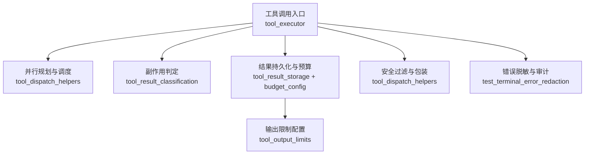
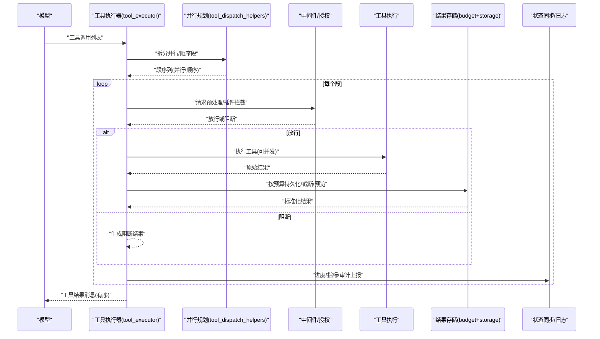
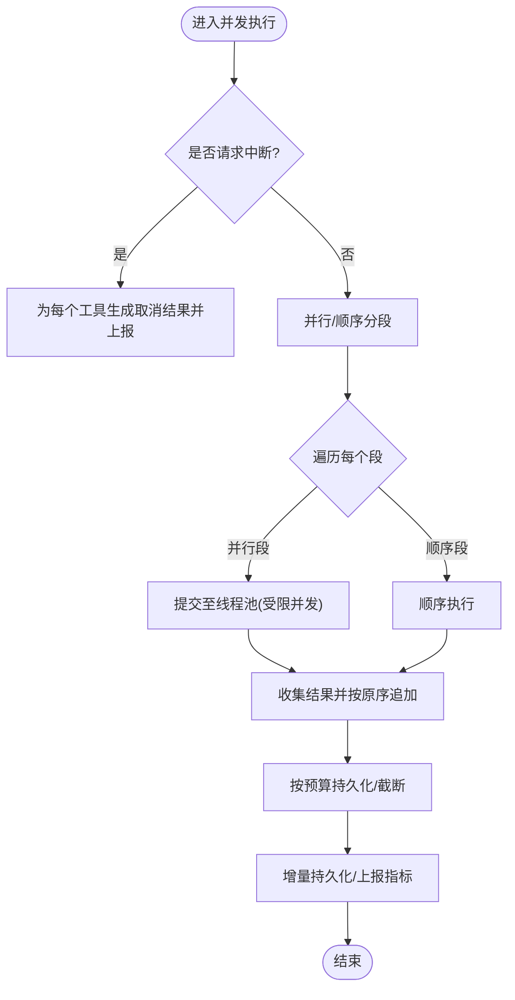
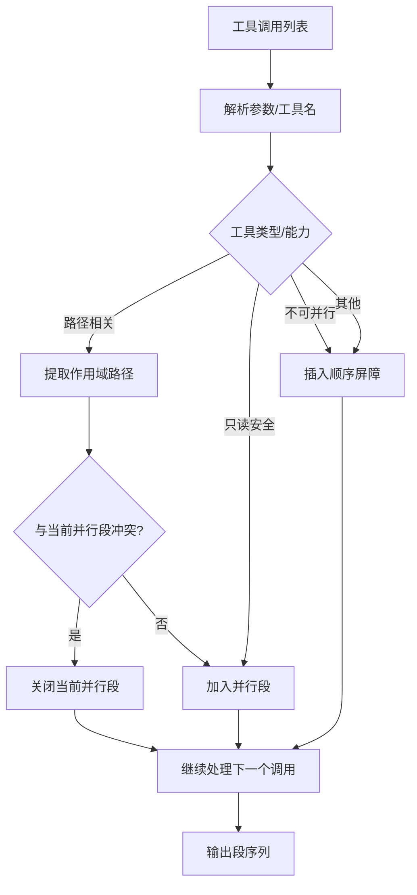
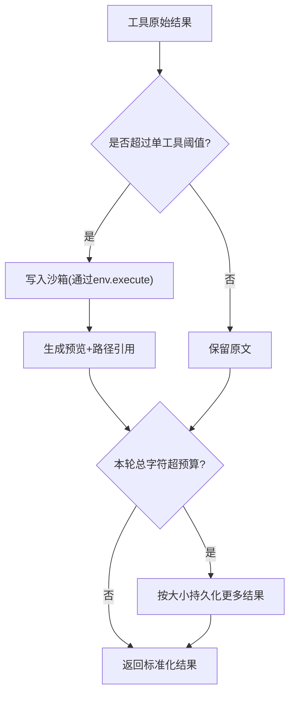
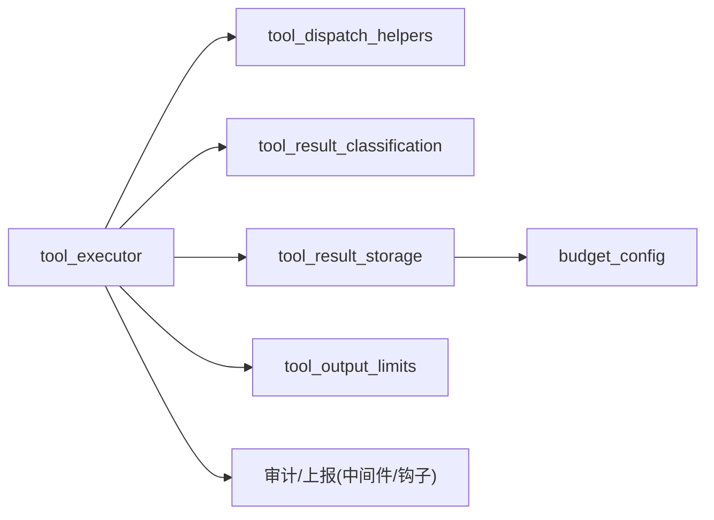

# 工具执行结果处理

<cite>
**本文引用的文件**
- [agent/tool_executor.py](file://agent/tool_executor.py)
- [agent/tool_dispatch_helpers.py](file://agent/tool_dispatch_helpers.py)
- [agent/tool_result_classification.py](file://agent/tool_result_classification.py)
- [tools/tool_result_storage.py](file://tools/tool_result_storage.py)
- [tools/budget_config.py](file://tools/budget_config.py)
- [tools/tool_output_limits.py](file://tools/tool_output_limits.py)
- [tests/tools/test_terminal_error_redaction.py](file://tests/tools/test_terminal_error_redaction.py)
</cite>

## 目录
1. [简介](#简介)
2. [项目结构](#项目结构)
3. [核心组件](#核心组件)
4. [架构总览](#架构总览)
5. [详细组件分析](#详细组件分析)
6. [依赖关系分析](#依赖关系分析)
7. [性能考量](#性能考量)
8. [故障排查指南](#故障排查指南)
9. [结论](#结论)
10. [附录：自定义工具开发指南与最佳实践](#附录自定义工具开发指南与最佳实践)

## 简介
本技术文档聚焦 Hermes Agent 的“工具执行结果处理”能力，覆盖从工具调用、并发调度、结果收集到状态同步的全链路流程；深入说明执行环境隔离、权限控制、资源管理；解释异步/并发执行、结果缓存策略；详述结果分类、格式化与安全过滤；提供数据流图与错误处理流程图；并给出监控、日志与性能分析要点，以及自定义工具开发与最佳实践。

## 项目结构
围绕工具执行结果处理的关键代码分布在以下模块：
- 执行编排与并发控制：agent/tool_executor.py
- 并行安全判定与多模态封装：agent/tool_dispatch_helpers.py
- 副作用判定与文件变更确认：agent/tool_result_classification.py
- 结果持久化与预算控制：tools/tool_result_storage.py、tools/budget_config.py
- 输出截断阈值配置：tools/tool_output_limits.py
- 终端错误脱敏验证（测试）：tests/tools/test_terminal_error_redaction.py

**图示来源**
- [agent/tool_executor.py:758-800](file://agent/tool_executor.py#L758-L800)
- [agent/tool_dispatch_helpers.py:116-234](file://agent/tool_dispatch_helpers.py#L116-L234)
- [agent/tool_result_classification.py:22-40](file://agent/tool_result_classification.py#L22-L40)
- [tools/tool_result_storage.py:144-255](file://tools/tool_result_storage.py#L144-L255)
- [tools/budget_config.py:22-57](file://tools/budget_config.py#L22-L57)
- [tools/tool_output_limits.py:59-111](file://tools/tool_output_limits.py#L59-L111)
- [tests/tools/test_terminal_error_redaction.py:47-154](file://tests/tools/test_terminal_error_redaction.py#L47-L154)

**章节来源**
- [agent/tool_executor.py:758-800](file://agent/tool_executor.py#L758-L800)
- [agent/tool_dispatch_helpers.py:116-234](file://agent/tool_dispatch_helpers.py#L116-L234)
- [agent/tool_result_classification.py:22-40](file://agent/tool_result_classification.py#L22-L40)
- [tools/tool_result_storage.py:144-255](file://tools/tool_result_storage.py#L144-L255)
- [tools/budget_config.py:22-57](file://tools/budget_config.py#L22-L57)
- [tools/tool_output_limits.py:59-111](file://tools/tool_output_limits.py#L59-L111)
- [tests/tools/test_terminal_error_redaction.py:47-154](file://tests/tools/test_terminal_error_redaction.py#L47-L154)

## 核心组件
- 工具执行器（tool_executor.py）
  - 负责串行/并发工具调用、中断处理、进度持久化、后置钩子上报、授权门控与批处理超时控制。
- 并行规划器（tool_dispatch_helpers.py）
  - 将一批工具调用拆分为“可并行段”和“必须顺序段”，基于路径冲突、工具类型与MCP能力进行安全判定。
- 副作用判定（tool_result_classification.py）
  - 识别无副作用工具与文件写入类工具，辅助后续状态同步与回滚策略。
- 结果存储与预算（tool_result_storage.py + budget_config.py）
  - 三层防护：单工具输出上限、按结果落盘、整轮聚合预算；支持预览与引用读取。
- 输出限制（tool_output_limits.py）
  - 集中配置终端/文件读写的最大字节、行数与行长度，避免上下文溢出。
- 安全过滤与包装（tool_dispatch_helpers.py）
  - 对来自外部的高风险工具结果进行不可信数据包装与注入扫描，降低间接提示注入风险。

**章节来源**
- [agent/tool_executor.py:758-800](file://agent/tool_executor.py#L758-L800)
- [agent/tool_dispatch_helpers.py:116-234](file://agent/tool_dispatch_helpers.py#L116-L234)
- [agent/tool_result_classification.py:22-40](file://agent/tool_result_classification.py#L22-L40)
- [tools/tool_result_storage.py:144-255](file://tools/tool_result_storage.py#L144-L255)
- [tools/budget_config.py:22-57](file://tools/budget_config.py#L22-L57)
- [tools/tool_output_limits.py:59-111](file://tools/tool_output_limits.py#L59-L111)
- [agent/tool_dispatch_helpers.py:533-706](file://agent/tool_dispatch_helpers.py#L533-L706)

## 架构总览
下图展示一次工具批处理的端到端数据流：从模型返回的工具调用列表，经并行规划、中间件与授权门控、实际执行、结果分类与持久化、最终汇总与状态同步。

**图示来源**
- [agent/tool_executor.py:758-800](file://agent/tool_executor.py#L758-L800)
- [agent/tool_dispatch_helpers.py:116-234](file://agent/tool_dispatch_helpers.py#L116-L234)
- [tools/tool_result_storage.py:144-255](file://tools/tool_result_storage.py#L144-L255)
- [tools/budget_config.py:22-57](file://tools/budget_config.py#L22-L57)

## 详细组件分析

### 工具执行器：并发调度与状态同步
- 并发执行
  - 使用线程池执行工具调用，默认最大工作线程数受配置与图像生成并发限制约束。
  - 通过“开始顺序门控”保证有先后依赖的调用仍保持顺序，同时允许无冲突的调用并行推进。
- 中断与取消
  - 支持用户中断，快速跳过剩余工具调用并生成取消结果。
- 进度与持久化
  - 在工具执行前后记录进度，必要时立即刷新会话数据库，确保破坏性但合法的调用也能保留转录。
- 授权门控
  - 序列化审批提示，避免并发审批交错；排除人类等待时间对批处理截止时间的干扰。
- 后置钩子
  - 统一上报工具调用指标（耗时、状态、错误类型等），便于监控与审计。

**图示来源**
- [agent/tool_executor.py:758-800](file://agent/tool_executor.py#L758-L800)
- [agent/tool_executor.py:236-247](file://agent/tool_executor.py#L236-L247)
- [agent/tool_executor.py:391-468](file://agent/tool_executor.py#L391-L468)

**章节来源**
- [agent/tool_executor.py:758-800](file://agent/tool_executor.py#L758-L800)
- [agent/tool_executor.py:236-247](file://agent/tool_executor.py#L236-L247)
- [agent/tool_executor.py:391-468](file://agent/tool_executor.py#L391-L468)

### 并行规划：安全与性能平衡
- 规则引擎
  - 将工具调用划分为“并行段”和“顺序段”，严格保持模型原始顺序。
  - 路径相关工具（read_file/search_files/write_file/patch）通过路径重叠检测避免写写/读写冲突。
  - 明确标记“绝不可并行”的工具（如交互型 clarify）。
  - 对只读且无共享可变状态的工具直接并行。
  - MCP 工具若声明支持并发则纳入并行集合。
- 路径解析
  - 规范化路径（含符号链接、大小写敏感平台），提取 patch 头中的目标文件作为作用域。

**图示来源**
- [agent/tool_dispatch_helpers.py:116-234](file://agent/tool_dispatch_helpers.py#L116-L234)
- [agent/tool_dispatch_helpers.py:250-346](file://agent/tool_dispatch_helpers.py#L250-L346)

**章节来源**
- [agent/tool_dispatch_helpers.py:116-234](file://agent/tool_dispatch_helpers.py#L116-L234)
- [agent/tool_dispatch_helpers.py:250-346](file://agent/tool_dispatch_helpers.py#L250-L346)

### 结果分类与副作用判定
- 无副作用工具集合
  - 如 read_file、search_files、web_extract 等，其中断/悬挂执行可安全丢弃。
- 文件写入工具
  - write_file、patch 的结果可被解析以确认写入是否真正落地，用于后续一致性校验。

**章节来源**
- [agent/tool_result_classification.py:22-40](file://agent/tool_result_classification.py#L22-L40)

### 结果持久化与预算控制
- 三层防护
  1) 单工具输出上限：由工具注册表/配置决定，超过阈值即落盘。
  2) 按结果持久化：将大结果写入沙箱临时目录，上下文内仅保留预览与路径引用。
  3) 整轮聚合预算：一轮所有工具结果总字符数超过阈值时，优先持久化最大的未持久化结果。
- 预算配置
  - 根据模型上下文窗口动态缩放预算，防止小模型被单个大结果撑爆上下文。
  - 支持 per-tool 覆盖与固定上限（如 read_file 设为无穷大以避免循环）。
- 预览与读取
  - 生成按行截断的预览；模型可通过 read_file 工具按偏移量读取完整内容。

**图示来源**
- [tools/tool_result_storage.py:144-255](file://tools/tool_result_storage.py#L144-L255)
- [tools/budget_config.py:22-57](file://tools/budget_config.py#L22-L57)

**章节来源**
- [tools/tool_result_storage.py:144-255](file://tools/tool_result_storage.py#L144-L255)
- [tools/budget_config.py:22-57](file://tools/budget_config.py#L22-L57)

### 输出限制与格式化
- 集中式输出限制
  - 统一配置 max_bytes、max_lines、max_line_length，避免硬编码导致的维护成本。
  - 读取失败或配置异常时回退到内置默认值，保证工具可用性。
- 格式化与包装
  - 高风险工具（web_extract/web_search/browser_*/mcp_*）的输出会被包裹为“不可信数据块”，并注入安全提示，降低间接提示注入风险。
  - 文本部分会被转义/中和，防止攻击者伪造边界标签。

**章节来源**
- [tools/tool_output_limits.py:59-111](file://tools/tool_output_limits.py#L59-L111)
- [agent/tool_dispatch_helpers.py:533-706](file://agent/tool_dispatch_helpers.py#L533-L706)

### 错误处理与安全过滤
- 错误脱敏
  - 终端工具的错误信息中可能包含密钥等敏感片段，系统会在错误/回溯中自动脱敏，避免泄露。
  - 支持命令感知的脱敏策略，并在成功输出时可按配置选择是否脱敏。
- 审计与上报
  - 工具执行完成后统一上报指标（耗时、状态、错误类型、中间件追踪等），便于问题定位。

**章节来源**
- [tests/tools/test_terminal_error_redaction.py:47-154](file://tests/tools/test_terminal_error_redaction.py#L47-L154)
- [agent/tool_executor.py:259-330](file://agent/tool_executor.py#L259-L330)

## 依赖关系分析

**图示来源**
- [agent/tool_executor.py:758-800](file://agent/tool_executor.py#L758-L800)
- [agent/tool_dispatch_helpers.py:116-234](file://agent/tool_dispatch_helpers.py#L116-L234)
- [agent/tool_result_classification.py:22-40](file://agent/tool_result_classification.py#L22-L40)
- [tools/tool_result_storage.py:144-255](file://tools/tool_result_storage.py#L144-L255)
- [tools/budget_config.py:22-57](file://tools/budget_config.py#L22-L57)
- [tools/tool_output_limits.py:59-111](file://tools/tool_output_limits.py#L59-L111)

**章节来源**
- [agent/tool_executor.py:758-800](file://agent/tool_executor.py#L758-L800)
- [agent/tool_dispatch_helpers.py:116-234](file://agent/tool_dispatch_helpers.py#L116-L234)
- [agent/tool_result_classification.py:22-40](file://agent/tool_result_classification.py#L22-L40)
- [tools/tool_result_storage.py:144-255](file://tools/tool_result_storage.py#L144-L255)
- [tools/budget_config.py:22-57](file://tools/budget_config.py#L22-L57)
- [tools/tool_output_limits.py:59-111](file://tools/tool_output_limits.py#L59-L111)

## 性能考量
- 并发度控制
  - 全局最大工作线程数与图像生成专用并发上限相结合，避免后端突发导致限流。
- 超时与门控
  - 并发工具调用具备统一超时；授权门控具备锁超时，避免死锁或饥饿。
- 预算与截断
  - 按模型上下文窗口动态缩放预算，减少不必要的大结果入窗；对超大结果优先落盘，降低内存与传输压力。
- I/O 优化
  - 大结果通过 stdin 管道写入沙箱，规避命令行参数长度限制；配置缓存避免重复读取配置文件。

[本节为通用指导，不直接分析具体文件]

## 故障排查指南
- 常见问题定位
  - 工具结果过大导致上下文溢出：检查预算配置与单工具阈值，确认是否已触发持久化与预览。
  - 并发导致状态不一致：查看并行规划是否因路径冲突降级为顺序；确认是否存在写写/读写冲突。
  - 审批/授权阻塞：关注授权门控锁超时与人类等待排除逻辑，避免批处理长时间挂起。
  - 错误信息泄露：确认终端工具错误脱敏是否生效，检查命令感知脱敏策略。
- 建议步骤
  - 启用更详细的日志与指标上报，核对工具调用耗时、状态码与错误类型。
  - 调整 tool_output_limits 与 budget_config 的阈值，观察效果。
  - 对高风险工具结果开启不可信数据包装，降低注入风险。

**章节来源**
- [tools/tool_result_storage.py:144-255](file://tools/tool_result_storage.py#L144-L255)
- [tools/budget_config.py:22-57](file://tools/budget_config.py#L22-L57)
- [tools/tool_output_limits.py:59-111](file://tools/tool_output_limits.py#L59-L111)
- [tests/tools/test_terminal_error_redaction.py:47-154](file://tests/tools/test_terminal_error_redaction.py#L47-L154)
- [agent/tool_executor.py:391-468](file://agent/tool_executor.py#L391-L468)

## 结论
Hermes Agent 的工具执行结果处理体系通过“并行规划—中间件/授权—执行—结果分类—持久化/预算—安全过滤—状态同步”的分层设计，在保证安全性的前提下最大化并发效率；通过预算与输出限制避免上下文溢出；通过错误脱敏与审计提升可观测性与安全性。该体系具备良好的可扩展性，便于新增工具与策略接入。

[本节为总结性内容，不直接分析具体文件]

## 附录：自定义工具开发指南与最佳实践
- 工具定义与注册
  - 在工具注册表中声明工具名称、参数 schema 与最大结果大小阈值；如需禁用持久化，可将阈值设为无穷大（谨慎使用）。
- 结果格式
  - 尽量返回结构化 JSON 字符串，便于上层解析与副作用确认；对于超大输出，主动截断并返回摘要。
- 并发安全
  - 若工具涉及文件系统或共享状态，请明确作用域路径；避免与写操作冲突。
  - 若工具为交互式或需用户输入，请勿声明为可并行。
- 安全与合规
  - 对来自外部的数据，不要将其视为可信指令；遵循不可信数据包装约定。
  - 避免在错误信息中暴露敏感字段；如需调试，请在服务端侧脱敏后再返回。
- 性能与资源
  - 合理设置超时与重试策略；避免长耗时阻塞批处理。
  - 利用预算与持久化机制，避免单次结果占用过多上下文。
- 监控与可观测性
  - 配合中间件/钩子上报指标（耗时、状态、错误类型、中间件追踪），便于问题定位与性能分析。

[本节为通用指导，不直接分析具体文件]