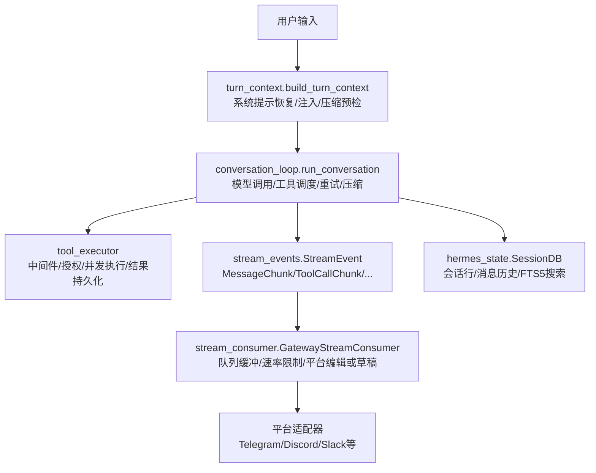
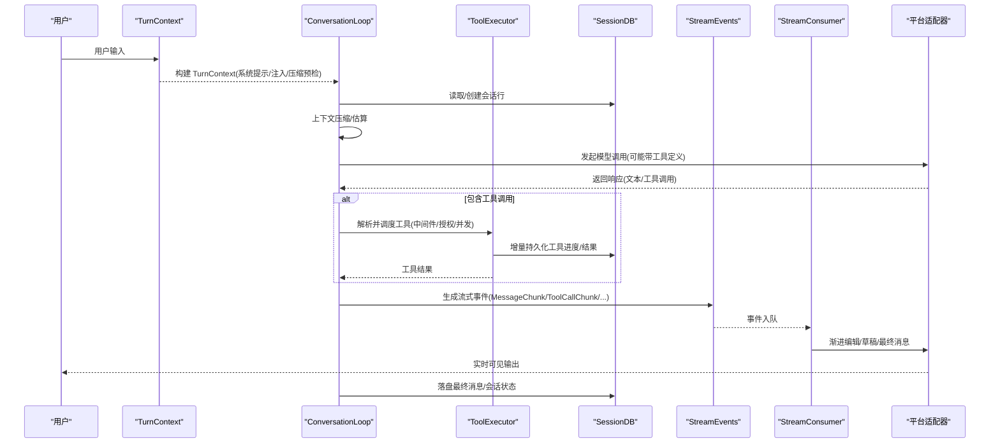
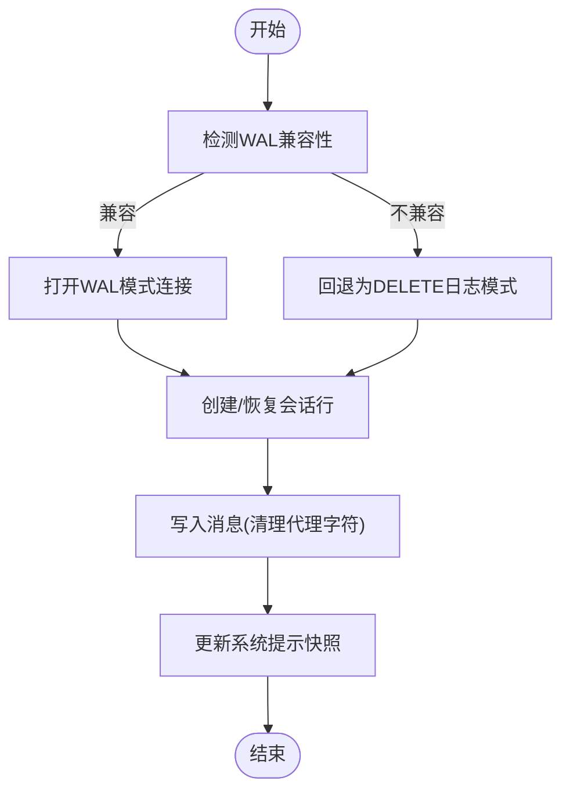
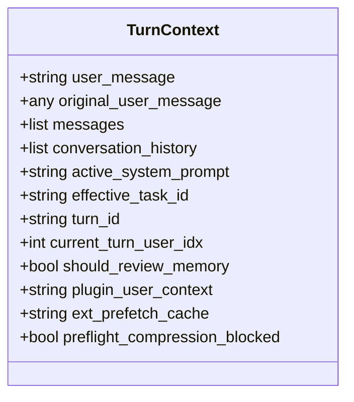
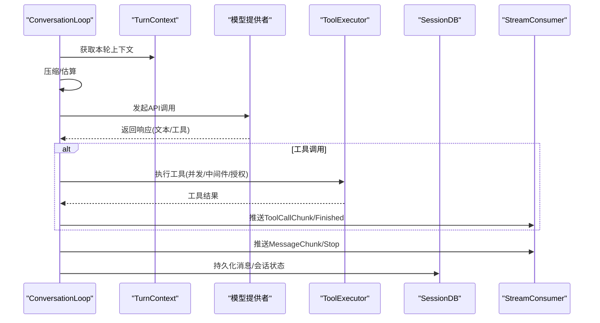
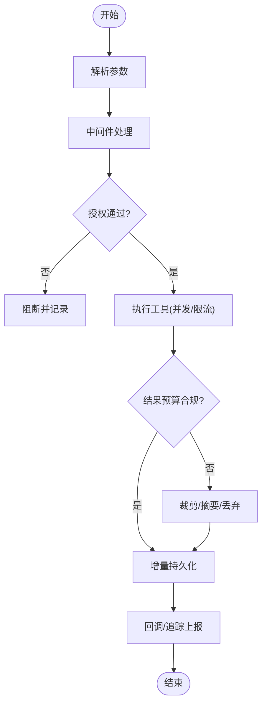
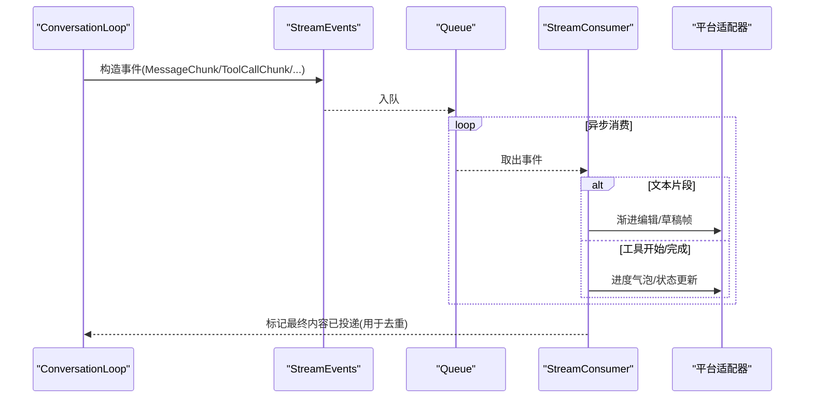
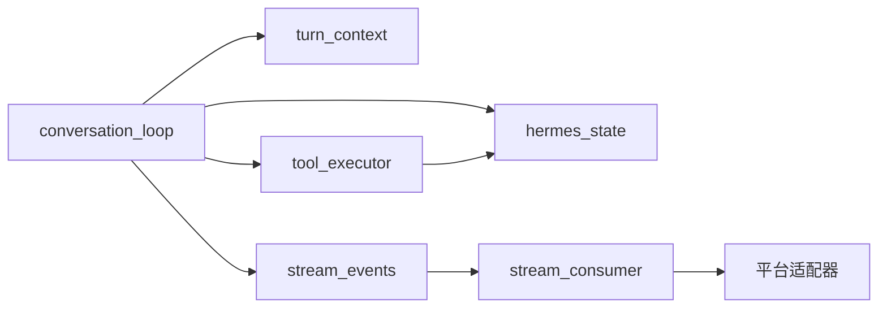

# 数据流设计

<cite>
**本文引用的文件**
- [hermes_state.py](file://hermes_state.py)
- [conversation_loop.py](file://agent/conversation_loop.py)
- [turn_context.py](file://agent/turn_context.py)
- [tool_executor.py](file://agent/tool_executor.py)
- [stream_events.py](file://gateway/stream_events.py)
- [stream_consumer.py](file://gateway/stream_consumer.py)
</cite>

## 目录
1. [简介](#简介)
2. [项目结构](#项目结构)
3. [核心组件](#核心组件)
4. [架构总览](#架构总览)
5. [详细组件分析](#详细组件分析)
6. [依赖关系分析](#依赖关系分析)
7. [性能考虑](#性能考虑)
8. [故障排查指南](#故障排查指南)
9. [结论](#结论)
10. [附录](#附录)

## 简介
本文件面向 Hermes Agent 的数据流设计，系统性说明从用户输入到最终输出的完整数据处理生命周期。重点覆盖：
- 会话状态管理与上下文传递
- 工具调用与结果处理
- 异步数据流、事件总线与消息队列
- 序列化格式、传输协议与缓存策略
- 一致性保证、错误恢复与性能优化
- 关键场景的时序图与流程图

## 项目结构
围绕数据流的关键模块分布如下：
- 会话持久化与检索：hermes_state.py（SQLite + FTS5）
- 单轮对话编排：agent/conversation_loop.py（主循环、压缩、重试、后处理）
- 每轮上下文构建：agent/turn_context.py（系统提示恢复、api_content 注入、压缩决策）
- 工具执行与并发调度：agent/tool_executor.py（中间件、授权门控、预算控制、结果持久化）
- 流式事件契约：gateway/stream_events.py（结构化事件类型定义）
- 流式消费与平台投递：gateway/stream_consumer.py（同步回调→异步任务→平台编辑/草稿）

图表来源
- [turn_context.py:343-800](file://agent/turn_context.py#L343-L800)
- [conversation_loop.py:1-800](file://agent/conversation_loop.py#L1-L800)
- [tool_executor.py:1-800](file://agent/tool_executor.py#L1-L800)
- [stream_events.py:1-172](file://gateway/stream_events.py#L1-L172)
- [stream_consumer.py:1-800](file://gateway/stream_consumer.py#L1-L800)
- [hermes_state.py:1-800](file://hermes_state.py#L1-L800)

章节来源
- [turn_context.py:343-800](file://agent/turn_context.py#L343-L800)
- [conversation_loop.py:1-800](file://agent/conversation_loop.py#L1-L800)
- [tool_executor.py:1-800](file://agent/tool_executor.py#L1-L800)
- [stream_events.py:1-172](file://gateway/stream_events.py#L1-L172)
- [stream_consumer.py:1-800](file://gateway/stream_consumer.py#L1-L800)
- [hermes_state.py:1-800](file://hermes_state.py#L1-L800)

## 核心组件
- 会话存储 hermes_state.SessionDB
  - 使用 SQLite WAL 模式，支持多读一写；提供 FTS5 全文检索；维护会话元数据、消息历史、模型配置；按父会话链进行压缩拆分。
  - 提供安全恢复与导出上限、WAL 兼容性回退、macOS 同步策略、生产环境数据库保护等机制。
- 轮次上下文 agent/turn_context.TurnContext
  - 封装每轮前置准备：系统提示恢复/重建、用户消息清洗与 api_content 注入、外部记忆预取、压缩预检、MCP 刷新、会话行创建时机等。
- 对话主循环 agent/conversation_loop.run_conversation
  - 驱动一次用户轮次：上下文压缩、模型调用、工具分发、重试与降级、后处理钩子、背景记忆/技能审查提示。
- 工具执行 agent/tool_executor
  - 顺序/并发工具执行；请求/执行中间件；授权门控（人类审批隔离）；结果预算控制；增量持久化；终止/取消信号处理。
- 流式事件 gateway/stream_events.StreamEvent
  - 纯数据类事件：MessageChunk/MessageStop/Commentary/ToolCallChunk/ToolCallFinished/LongToolHint/GatewayNotice；仅描述“发生了什么”，不绑定平台渲染。
- 流式消费 gateway/stream_consumer.GatewayStreamConsumer
  - 将同步回调转为异步任务；队列缓冲、速率限制、渐进编辑或原生草稿；过滤思考标签；处理溢出/重投/去重；记录已投递内容以抑制重复发送。

章节来源
- [hermes_state.py:1-800](file://hermes_state.py#L1-L800)
- [turn_context.py:343-800](file://agent/turn_context.py#L343-L800)
- [conversation_loop.py:1-800](file://agent/conversation_loop.py#L1-L800)
- [tool_executor.py:1-800](file://agent/tool_executor.py#L1-L800)
- [stream_events.py:1-172](file://gateway/stream_events.py#L1-L172)
- [stream_consumer.py:1-800](file://gateway/stream_consumer.py#L1-L800)

## 架构总览
Hermes 的数据流由“编排层—执行层—持久层—展示层”构成：
- 编排层：turn_context 构建每轮上下文；conversation_loop 组织压缩、模型调用、工具调度与后处理。
- 执行层：tool_executor 负责工具中间件、授权、并发与结果预算；hermes_state 提供会话与消息持久化。
- 展示层：stream_events 定义事件契约；stream_consumer 将事件转换为平台可消费的流式更新。

图表来源
- [turn_context.py:343-800](file://agent/turn_context.py#L343-L800)
- [conversation_loop.py:1-800](file://agent/conversation_loop.py#L1-L800)
- [tool_executor.py:1-800](file://agent/tool_executor.py#L1-L800)
- [stream_events.py:1-172](file://gateway/stream_events.py#L1-L172)
- [stream_consumer.py:1-800](file://gateway/stream_consumer.py#L1-L800)
- [hermes_state.py:1-800](file://hermes_state.py#L1-L800)

## 详细组件分析

### 会话状态管理（hermes_state）
- 设计要点
  - WAL 模式提升并发读能力，配合 macOS 同步策略确保崩溃恢复。
  - FTS5 虚拟表实现跨会话消息全文检索。
  - 通过 parent_session_id 链支持压缩后的会话拆分与归档。
  - 提供测试隔离保护，防止在 pytest 环境下误写生产数据库。
  - 对 NFS/SMB/FUSE/ZFS 等文件系统提供 WAL 兼容回退。
- 关键流程
  - 会话行创建与系统提示快照写入，保障前缀缓存命中。
  - 消息写入时清理代理字符，避免 SQLite 编码异常。
  - 导出/恢复的消息条数上限，防止内存爆炸。
- 一致性与恢复
  - 压缩锁持有者进程存活检测，避免死锁。
  - 失败路径记录最后初始化错误，便于 /resume 等命令给出明确原因。

图表来源
- [hermes_state.py:486-800](file://hermes_state.py#L486-L800)
- [hermes_state.py:1-200](file://hermes_state.py#L1-L200)

章节来源
- [hermes_state.py:1-800](file://hermes_state.py#L1-L800)

### 轮次上下文构建（turn_context）
- 职责
  - 系统提示恢复/重建，保证前缀缓存稳定。
  - 用户消息清洗与 api_content 注入（外部记忆/插件上下文）。
  - 压缩预检与空闲压缩触发，减少首调成本。
  - 会话行创建时机精确控制，避免 NULL 系统提示导致缓存失效。
- 关键数据结构
  - TurnContext 携带本轮所需的全部上下文值，解耦主循环。
- 重要不变量
  - api_content 与 wire 字节一致，确保 provider 前缀缓存命中。
  - 压缩后重新锚定当前用户消息索引，避免注入错位。

图表来源
- [turn_context.py:314-341](file://agent/turn_context.py#L314-L341)

章节来源
- [turn_context.py:343-800](file://agent/turn_context.py#L343-L800)

### 对话主循环（conversation_loop）
- 职责
  - 驱动一轮对话：上下文压缩、模型调用、工具调度、重试与降级、后处理钩子。
  - 处理中断、截断、参考转交、计费/配额提示、Ollama 上下文不足等边界情况。
- 数据流
  - 从 TurnContext 获取 messages/system_prompt，必要时进行压缩。
  - 调用模型后，若含工具调用则交由 tool_executor 执行。
  - 将流式片段与工具事件转化为 StreamEvent，交给 stream_consumer。
  - 最终落盘消息与状态。

图表来源
- [conversation_loop.py:1-800](file://agent/conversation_loop.py#L1-L800)
- [tool_executor.py:1-800](file://agent/tool_executor.py#L1-L800)
- [stream_consumer.py:1-800](file://gateway/stream_consumer.py#L1-L800)
- [hermes_state.py:1-800](file://hermes_state.py#L1-L800)

章节来源
- [conversation_loop.py:1-800](file://agent/conversation_loop.py#L1-L800)

### 工具执行与结果处理（tool_executor）
- 职责
  - 顺序/并发工具执行；请求/执行中间件；授权门控（人类审批隔离）。
  - 结果预算控制（按上下文窗口缩放），增量持久化，终止/取消信号处理。
- 关键机制
  - _run_agent_tool_execution_middleware：统一入口，确保只执行一次，记录中间件轨迹。
  - _ConcurrentToolAuthorizationGate：序列化审批，排除人类等待时间对批超时影响。
  - _flush_session_db_after_tool_progress：工具副作用可能导致进程重启，需及时落盘。
- 数据流
  - 解析参数→中间件→授权→执行→结果→预算检查→持久化→回调通知。

图表来源
- [tool_executor.py:482-663](file://agent/tool_executor.py#L482-L663)
- [tool_executor.py:391-468](file://agent/tool_executor.py#L391-L468)
- [tool_executor.py:178-207](file://agent/tool_executor.py#L178-L207)

章节来源
- [tool_executor.py:1-800](file://agent/tool_executor.py#L1-L800)

### 流式事件与消费（stream_events + stream_consumer）
- 事件契约（stream_events）
  - MessageChunk/MessageStop/Commentary：助手文本流与分段。
  - ToolCallChunk/ToolCallFinished：工具调用生命周期。
  - LongToolHint/GatewayNotice：平台控制与提示。
- 消费者（stream_consumer）
  - 线程安全 on_delta：接收同步回调，入队至 asyncio 任务。
  - 自适应编辑/草稿：根据平台能力选择 native draft 或 edit。
  - 去重与防洪水：记录已投递文本，限制编辑频率，失败降级。
  - 思考块过滤：屏蔽 <think>/<reasoning> 等标签，保持用户可见内容干净。
  - 多消息溢出处理：超长回复拆分为多条，最终合并或替换。

图表来源
- [stream_events.py:41-172](file://gateway/stream_events.py#L41-L172)
- [stream_consumer.py:156-800](file://gateway/stream_consumer.py#L156-L800)

章节来源
- [stream_events.py:1-172](file://gateway/stream_events.py#L1-L172)
- [stream_consumer.py:1-800](file://gateway/stream_consumer.py#L1-L800)

## 依赖关系分析
- 低耦合高内聚
  - stream_events 仅定义数据类，无 I/O；stream_consumer 专注投递；conversation_loop 专注编排；tool_executor 专注执行；hermes_state 专注持久化。
- 直接依赖
  - conversation_loop → turn_context、tool_executor、hermes_state、stream_events。
  - tool_executor → hermes_state（增量持久化）、中间件/授权子系统。
  - stream_consumer → platform adapters（edit/send_draft）。
- 潜在循环风险
  - 通过延迟导入与函数引用（如 _ra()）避免模块加载期循环。

图表来源
- [conversation_loop.py:1-800](file://agent/conversation_loop.py#L1-L800)
- [turn_context.py:343-800](file://agent/turn_context.py#L343-L800)
- [tool_executor.py:1-800](file://agent/tool_executor.py#L1-L800)
- [stream_events.py:1-172](file://gateway/stream_events.py#L1-L172)
- [stream_consumer.py:1-800](file://gateway/stream_consumer.py#L1-L800)
- [hermes_state.py:1-800](file://hermes_state.py#L1-L800)

章节来源
- [conversation_loop.py:1-800](file://agent/conversation_loop.py#L1-L800)
- [tool_executor.py:1-800](file://agent/tool_executor.py#L1-L800)
- [stream_consumer.py:1-800](file://gateway/stream_consumer.py#L1-L800)

## 性能考虑
- 压缩与缓存
  - 预检压缩与空闲压缩降低首调成本；系统提示快照与前缀缓存提高命中率。
- 并发与限流
  - 工具并发执行受最大工作线程与图像生成并行度限制；流式消费具备自适应编辑间隔与防洪水策略。
- 持久化优化
  - WAL 模式提升并发读；增量持久化减少大事务；macOS 同步策略保障崩溃恢复。
- 网络与平台
  - 原生草稿优先，失败回退编辑；按平台长度限制拆分；去重避免重复发送。

[本节为通用指导，无需特定文件来源]

## 故障排查指南
- 会话数据库不可用
  - 现象：/resume、/history 等命令报错。
  - 排查：查看最后初始化错误；检查文件系统是否支持 WAL（NFS/SMB/FUSE/ZFS）；确认 SQLite 版本是否受 WAL-reset 漏洞影响。
- 流式输出卡顿或丢失
  - 现象：平台消息长时间不更新或最终未显示。
  - 排查：检查 stream_consumer 的编辑频率与失败计数；确认平台适配器是否支持草稿；核对已投递文本去重逻辑。
- 工具执行被阻断或超时
  - 现象：工具调用被拦截或长时间无结果。
  - 排查：查看中间件/授权门控日志；确认人类审批是否卡住；检查批超时与授权锁超时设置。
- 上下文过大导致失败
  - 现象：模型返回上下文超限或空响应。
  - 排查：启用/调整压缩阈值；检查空闲压缩是否触发；确认系统提示与前缀缓存是否稳定。

章节来源
- [hermes_state.py:520-695](file://hermes_state.py#L520-L695)
- [stream_consumer.py:156-800](file://gateway/stream_consumer.py#L156-L800)
- [tool_executor.py:391-468](file://agent/tool_executor.py#L391-L468)
- [conversation_loop.py:1-800](file://agent/conversation_loop.py#L1-L800)

## 结论
Hermes Agent 的数据流以“编排—执行—持久—展示”分层清晰解耦，通过结构化事件契约与异步消费机制实现高效、可扩展的流式输出。会话状态管理提供强一致性与恢复能力，工具执行层兼顾安全与性能，整体设计在保证用户体验的同时，为多平台适配与大规模部署奠定基础。

[本节为总结性内容，无需特定文件来源]

## 附录
- 术语
  - 前缀缓存：基于系统提示与历史消息的稳定前缀，提升模型缓存命中。
  - 增量持久化：在工具执行过程中逐步落盘，提高容错性。
  - 原生草稿：平台支持的动画预览消息，最终替换为真实消息。
- 最佳实践
  - 合理设置压缩阈值与空闲压缩间隔，平衡首调延迟与上下文大小。
  - 谨慎配置工具并发与超时，避免资源争用与饥饿。
  - 利用流式去重与防洪水机制，确保平台体验稳定。

[本节为补充信息，无需特定文件来源]