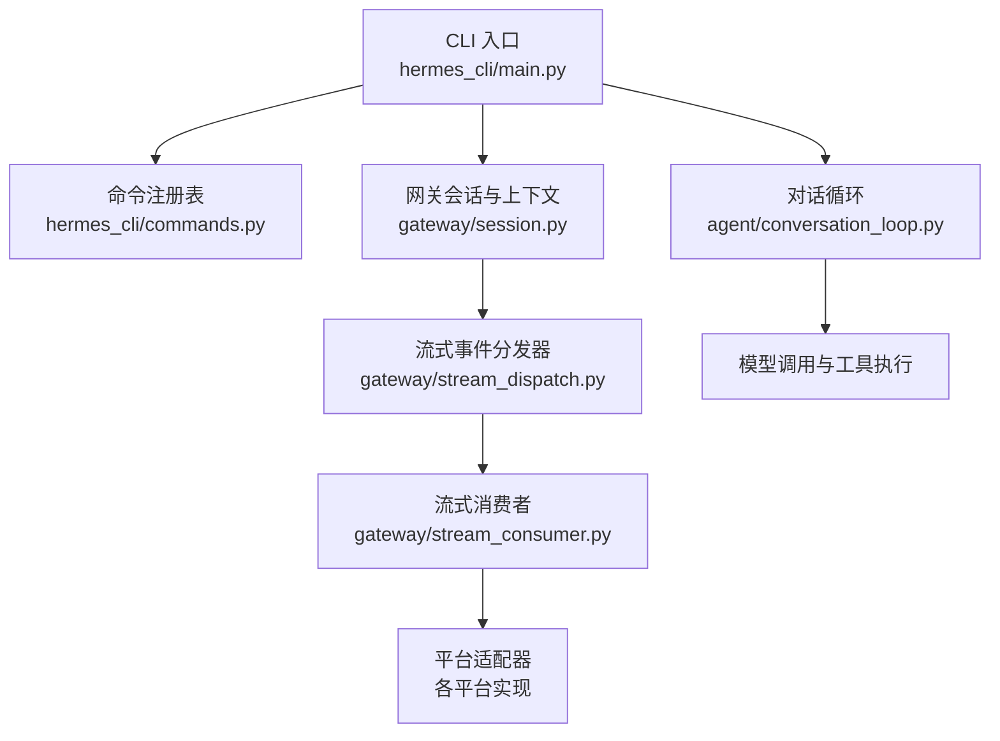
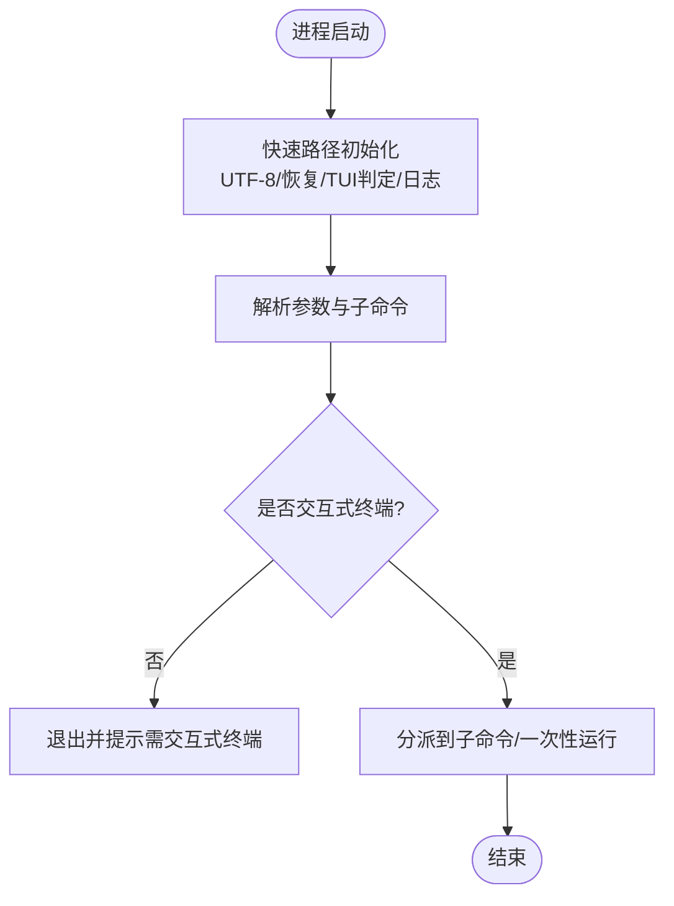
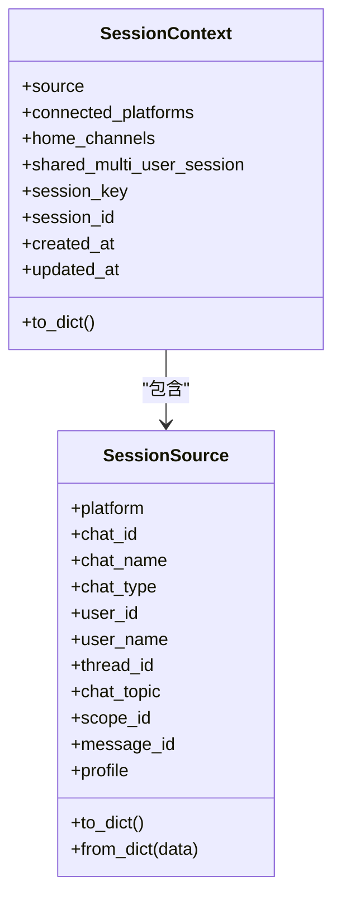
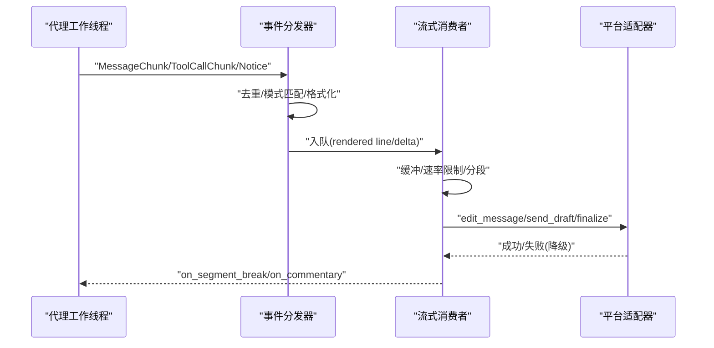
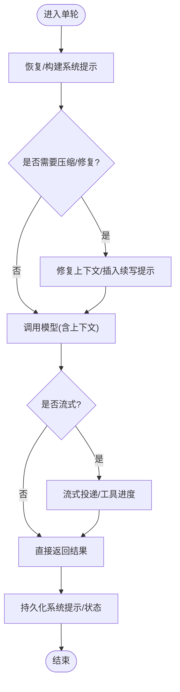
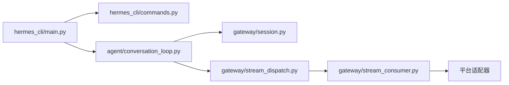

# 用户输入处理流程

<cite>
**本文引用的文件**
- [hermes_cli/main.py](file://hermes_cli/main.py)
- [gateway/session.py](file://gateway/session.py)
- [gateway/stream_dispatch.py](file://gateway/stream_dispatch.py)
- [gateway/stream_consumer.py](file://gateway/stream_consumer.py)
- [agent/conversation_loop.py](file://agent/conversation_loop.py)
- [hermes_cli/commands.py](file://hermes_cli/commands.py)
</cite>

## 目录
1. [简介](#简介)
2. [项目结构](#项目结构)
3. [核心组件](#核心组件)
4. [架构总览](#架构总览)
5. [详细组件分析](#详细组件分析)
6. [依赖关系分析](#依赖关系分析)
7. [性能考虑](#性能考虑)
8. [故障排查指南](#故障排查指南)
9. [结论](#结论)
10. [附录](#附录)

## 简介
本技术文档聚焦 Hermes Agent 的“用户输入处理流程”，从 CLI/Web/消息平台等统一入口开始，贯穿网关接收、会话上下文构建、异步流式响应与错误重试机制，最终到达 AI 模型调用与结果回传。文档提供数据流图与时序图，解释输入验证、格式转换、会话状态初始化、缓存策略、内存管理与跨平台统一处理架构。

## 项目结构
围绕用户输入处理的代码主要分布在以下模块：
- CLI 入口与命令注册：负责解析命令行参数、选择交互模式（CLI/TUI）、加载配置与环境变量，并分发到具体子命令或一次性运行路径。
- 网关会话与上下文：维护会话来源、会话键安全校验、动态系统提示注入、多平台能力感知与 PII 脱敏。
- 流式事件分发与消费：将代理侧同步回调桥接到异步平台投递，支持渐进编辑、原生草稿流、工具进度渲染与去重。
- 对话循环：驱动单轮用户请求进入代理执行，包含压缩、重试、上下文恢复、系统提示缓存与持久化。
- 命令注册表：集中定义斜杠命令及其在忙碌时的行为策略，供 CLI 与网关复用。



**图表来源**
- [hermes_cli/main.py:46-100](file://hermes_cli/main.py#L46-L100)
- [hermes_cli/commands.py:102-200](file://hermes_cli/commands.py#L102-L200)
- [gateway/session.py:148-346](file://gateway/session.py#L148-L346)
- [gateway/stream_dispatch.py:40-133](file://gateway/stream_dispatch.py#L40-L133)
- [gateway/stream_consumer.py:156-323](file://gateway/stream_consumer.py#L156-L323)
- [agent/conversation_loop.py:1-100](file://agent/conversation_loop.py#L1-L100)

**章节来源**
- [hermes_cli/main.py:46-100](file://hermes_cli/main.py#L46-L100)
- [hermes_cli/commands.py:102-200](file://hermes_cli/commands.py#L102-L200)
- [gateway/session.py:148-346](file://gateway/session.py#L148-L346)
- [gateway/stream_dispatch.py:40-133](file://gateway/stream_dispatch.py#L40-L133)
- [gateway/stream_consumer.py:156-323](file://gateway/stream_consumer.py#L156-L323)
- [agent/conversation_loop.py:1-100](file://agent/conversation_loop.py#L1-L100)

## 核心组件
- CLI 入口与启动快速路径：负责 UTF-8 设置、早期恢复、TUI/CLI 模式判定、IPv4 偏好、日志初始化与 profile 覆盖。
- 会话上下文与动态系统提示：根据来源平台、聊天类型、线程信息、可用工具集构建上下文提示，支持 PII 脱敏与平台特性注入。
- 流式事件分发器：将结构化事件（消息片段、工具调用、长任务提示、通知）路由到适配器的渲染钩子与投递队列。
- 流式消费者：线程安全的增量文本缓冲、速率限制、渐进编辑/原生草稿投递、分段边界与最终交付一致性保障。
- 对话循环：单轮处理主流程，包含上下文压缩、重试退避、系统提示缓存恢复与持久化、中断与纠正处理。

**章节来源**
- [hermes_cli/main.py:46-100](file://hermes_cli/main.py#L46-L100)
- [gateway/session.py:479-746](file://gateway/session.py#L479-L746)
- [gateway/stream_dispatch.py:40-133](file://gateway/stream_dispatch.py#L40-L133)
- [gateway/stream_consumer.py:156-323](file://gateway/stream_consumer.py#L156-L323)
- [agent/conversation_loop.py:548-684](file://agent/conversation_loop.py#L548-L684)

## 架构总览
下图展示从用户输入到 AI 响应的端到端链路，涵盖 CLI/Web/消息平台的统一入口、网关会话上下文、流式事件分发与消费、以及对话循环中的关键处理点。

```mermaid
sequenceDiagram
participant U as "用户"
participant CLI as "CLI 入口<br/>main.py"
participant GW as "网关会话<br/>session.py"
participant DISP as "事件分发器<br/>stream_dispatch.py"
participant CONS as "流式消费者<br/>stream_consumer.py"
participant LOOP as "对话循环<br/>conversation_loop.py"
participant ADP as "平台适配器"
participant LLM as "AI 模型"
U->>CLI : "输入(命令行/Web/消息)"
CLI->>GW : "构建会话上下文/来源"
GW-->>CLI : "上下文与路由信息"
CLI->>LOOP : "进入单轮对话处理"
LOOP->>DISP : "订阅结构化流事件"
LOOP->>LLM : "发起模型调用(含上下文)"
LLM-->>LOOP : "流式输出/工具调用"
LOOP->>DISP : "MessageChunk/ToolCallChunk/Notice"
DISP->>CONS : "render/format 后入队"
CONS->>ADP : "渐进编辑/草稿/最终发送"
ADP-->>U : "实时可见回复"
LOOP-->>CLI : "完成/错误/重试"
```

**图表来源**
- [hermes_cli/main.py:46-100](file://hermes_cli/main.py#L46-L100)
- [gateway/session.py:148-346](file://gateway/session.py#L148-L346)
- [gateway/stream_dispatch.py:40-133](file://gateway/stream_dispatch.py#L40-L133)
- [gateway/stream_consumer.py:156-323](file://gateway/stream_consumer.py#L156-L323)
- [agent/conversation_loop.py:1-100](file://agent/conversation_loop.py#L1-L100)

## 详细组件分析

### CLI 入口与命令分发
- 启动快速路径：确保 UTF-8 stdio、早期恢复、TUI/CLI 模式判定、IPv4 偏好、日志初始化与 profile 覆盖，避免导入链路上的崩溃。
- 命令注册表：集中管理斜杠命令、别名、类别、忙碌策略与执行器键，供 CLI 与网关复用，保证一致的用户体验。
- 输入验证与格式转换：通过 argparse 与子命令解析器对参数进行校验；对 TTY 环境进行保护，防止非交互式管道误用交互式命令。



**图表来源**
- [hermes_cli/main.py:46-100](file://hermes_cli/main.py#L46-L100)
- [hermes_cli/commands.py:102-200](file://hermes_cli/commands.py#L102-L200)

**章节来源**
- [hermes_cli/main.py:46-100](file://hermes_cli/main.py#L46-L100)
- [hermes_cli/commands.py:102-200](file://hermes_cli/commands.py#L102-L200)

### 网关会话与上下文构建
- 会话来源描述：记录平台、聊天 ID/名称/类型、用户 ID/名称、线程、主题、作用域、消息触发 ID、角色授权、资料名等，用于路由与系统提示注入。
- 会话键安全校验：拒绝路径穿越与非法前缀，避免 session_key 被用作文件系统路径时产生安全风险。
- 动态系统提示：根据来源平台、连接平台、家庭频道、共享多用户会话等生成上下文段落；对 Discord/Slack/MATRIX/YUANBAO 等平台注入特定行为说明；支持 PII 脱敏与不可信元数据格式化。



**图表来源**
- [gateway/session.py:148-346](file://gateway/session.py#L148-L346)

**章节来源**
- [gateway/session.py:148-346](file://gateway/session.py#L148-L346)
- [gateway/session.py:479-746](file://gateway/session.py#L479-L746)

### 流式事件分发与消费
- 事件分发器：将 MessageChunk/ToolCallChunk/LongToolHint/GatewayNotice 等事件路由到适配器的渲染钩子；工具进度按模式（all/new/verbose/off）去重与限流；异常不会破坏代理工作线程。
- 流式消费者：线程安全 on_delta 回调，使用 queue.Queue 将增量文本转入 asyncio 任务；支持渐进编辑与原生草稿流；维护分段边界、最终交付一致性、防洪水控制与失败降级；过滤思考标签以避免向用户暴露推理过程。



**图表来源**
- [gateway/stream_dispatch.py:40-133](file://gateway/stream_dispatch.py#L40-L133)
- [gateway/stream_consumer.py:156-323](file://gateway/stream_consumer.py#L156-L323)
- [gateway/stream_consumer.py:590-800](file://gateway/stream_consumer.py#L590-L800)

**章节来源**
- [gateway/stream_dispatch.py:40-133](file://gateway/stream_dispatch.py#L40-L133)
- [gateway/stream_consumer.py:156-323](file://gateway/stream_consumer.py#L156-L323)
- [gateway/stream_consumer.py:590-800](file://gateway/stream_consumer.py#L590-L800)

### 对话循环与单轮处理
- 系统提示缓存与恢复：优先从会话数据库读取已缓存的系统提示，若运行时身份变化则重建并持久化；避免每次转场都重新构建导致缓存失效。
- 上下文压缩与重试：检测压缩导致的参考传递、截断与输出长度限制，插入续写提示；结合自适应退避与过载重试策略。
- 中断与纠正：当用户修正或中断时，追加可重放的安全检查点，保持角色交替有效，避免将内部推理块写入可重放内容。



**图表来源**
- [agent/conversation_loop.py:548-684](file://agent/conversation_loop.py#L548-L684)
- [agent/conversation_loop.py:195-274](file://agent/conversation_loop.py#L195-L274)

**章节来源**
- [agent/conversation_loop.py:548-684](file://agent/conversation_loop.py#L548-L684)
- [agent/conversation_loop.py:195-274](file://agent/conversation_loop.py#L195-L274)

## 依赖关系分析
- CLI 入口依赖命令注册表与子命令解析器，决定交互模式与执行路径。
- 网关会话模块为对话循环提供上下文与动态系统提示，影响模型调用的输入形状。
- 流式事件分发器与消费者解耦代理工作线程与平台投递，降低耦合度并提升可测试性。
- 对话循环依赖重试、压缩、提示缓存与工具执行，形成完整的单轮处理闭环。



**图表来源**
- [hermes_cli/main.py:46-100](file://hermes_cli/main.py#L46-L100)
- [hermes_cli/commands.py:102-200](file://hermes_cli/commands.py#L102-L200)
- [agent/conversation_loop.py:1-100](file://agent/conversation_loop.py#L1-L100)
- [gateway/session.py:148-346](file://gateway/session.py#L148-L346)
- [gateway/stream_dispatch.py:40-133](file://gateway/stream_dispatch.py#L40-L133)
- [gateway/stream_consumer.py:156-323](file://gateway/stream_consumer.py#L156-L323)

**章节来源**
- [hermes_cli/main.py:46-100](file://hermes_cli/main.py#L46-L100)
- [hermes_cli/commands.py:102-200](file://hermes_cli/commands.py#L102-L200)
- [agent/conversation_loop.py:1-100](file://agent/conversation_loop.py#L1-L100)
- [gateway/session.py:148-346](file://gateway/session.py#L148-L346)
- [gateway/stream_dispatch.py:40-133](file://gateway/stream_dispatch.py#L40-L133)
- [gateway/stream_consumer.py:156-323](file://gateway/stream_consumer.py#L156-L323)

## 性能考虑
- 启动快速路径：减少不必要的导入与配置解析，提前应用 IPv4 偏好与日志设置，缩短冷启动时间。
- 系统提示缓存：通过会话数据库持久化系统提示，避免每轮重建，提高提示缓存命中率。
- 流式消费优化：渐进编辑与原生草稿流减少频繁全量更新；去重与速率限制降低平台压力；失败降级保障稳定性。
- 上下文压缩：在 token 接近限制时压缩历史，插入续写提示，避免重复与超限。
- 内存管理：流式消费者维护分段与账本，避免大对象常驻；清理中间态与废弃消息 ID，防止内存泄漏。

[本节为通用指导，不直接分析具体文件]

## 故障排查指南
- 流式投递失败：检查分发器与消费者的异常捕获与降级逻辑；确认平台适配器是否支持草稿/编辑；关注洪水控制与退避策略。
- 系统提示缓存失效：查看会话数据库读写日志；确认运行时身份（模型/提供商/平台/工作目录）是否变化导致重建。
- 上下文压缩问题：观察压缩后的参考传递与续写提示；确认是否出现仅引用无动作的无效转场。
- 输入验证错误：确认 TTY 检测与参数解析；对非交互式环境给出明确错误提示。
- 重试与超时：检查自适应退背与过载重试上限；区分本地处理错误与 API 网络错误，避免无效重试。

**章节来源**
- [gateway/stream_dispatch.py:88-133](file://gateway/stream_dispatch.py#L88-L133)
- [gateway/stream_consumer.py:156-323](file://gateway/stream_consumer.py#L156-L323)
- [agent/conversation_loop.py:548-684](file://agent/conversation_loop.py#L548-L684)
- [hermes_cli/main.py:488-503](file://hermes_cli/main.py#L488-L503)

## 结论
Hermes Agent 的用户输入处理流程通过 CLI 入口、网关会话上下文、流式事件分发与消费、以及对话循环的协同，实现了跨平台统一、高可靠与高性能的端到端链路。其设计强调：
- 输入验证与安全：会话键与元数据的严格校验，PII 脱敏与不可信文本净化。
- 异步与流式：线程安全回调、渐进编辑与原生草稿流，提升用户体验与平台兼容性。
- 缓存与压缩：系统提示缓存与上下文压缩，降低延迟与成本。
- 错误与重试：分类错误、自适应退避与降级策略，增强鲁棒性。

[本节为总结性内容，不直接分析具体文件]

## 附录
- 术语说明：
  - 会话键：用于路由与标识会话的逻辑键，需避免路径穿越。
  - 系统提示：注入给模型的上下文段落，包含平台、频道、工具能力等信息。
  - 流式消费：将模型输出的增量文本逐步投递到平台，支持编辑与草稿。
  - 上下文压缩：在 token 接近限制时压缩历史，保留关键信息与续写提示。

[本节为概念性说明，不直接分析具体文件]