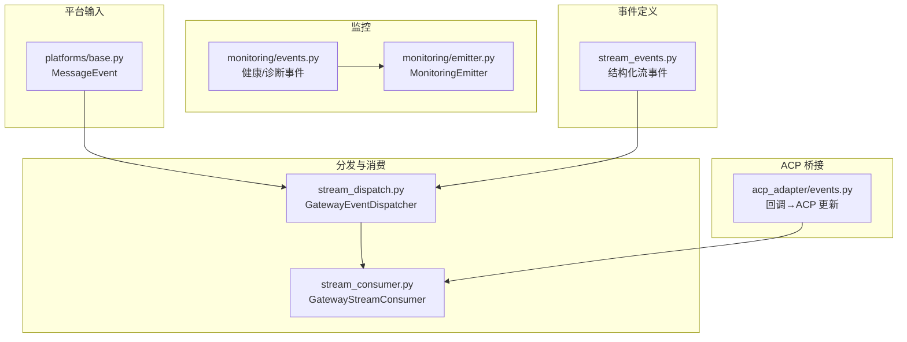
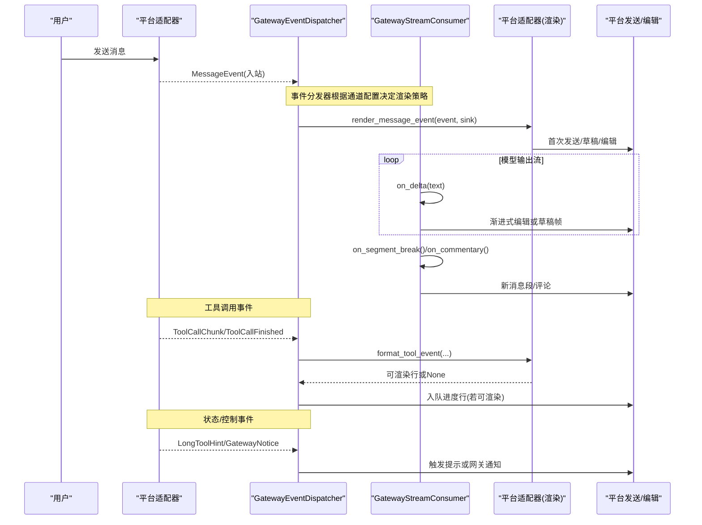
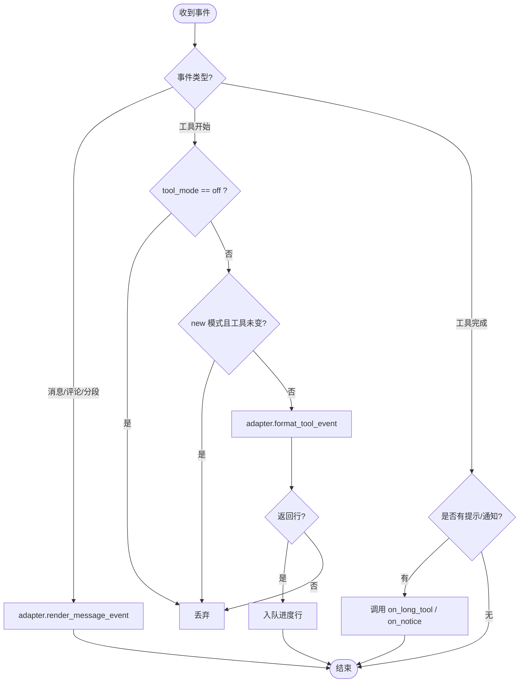
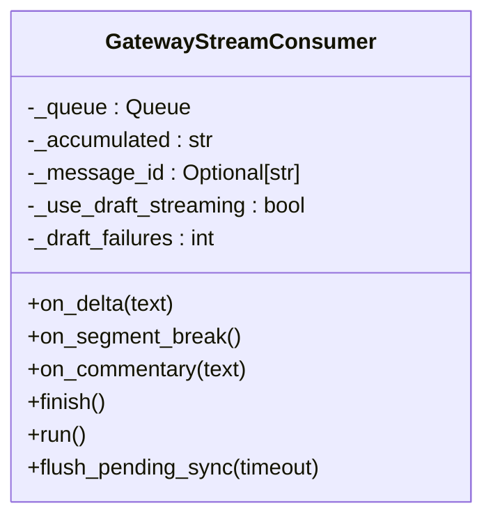
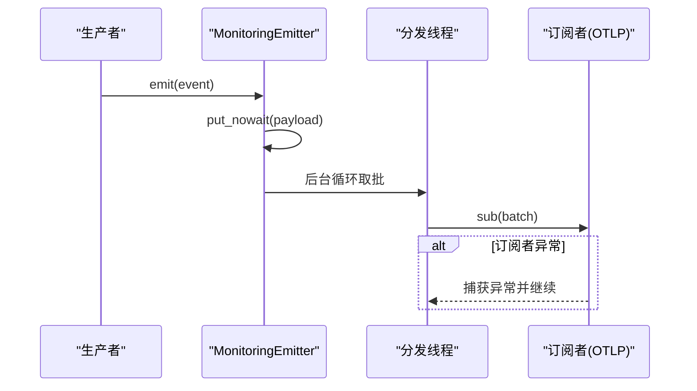
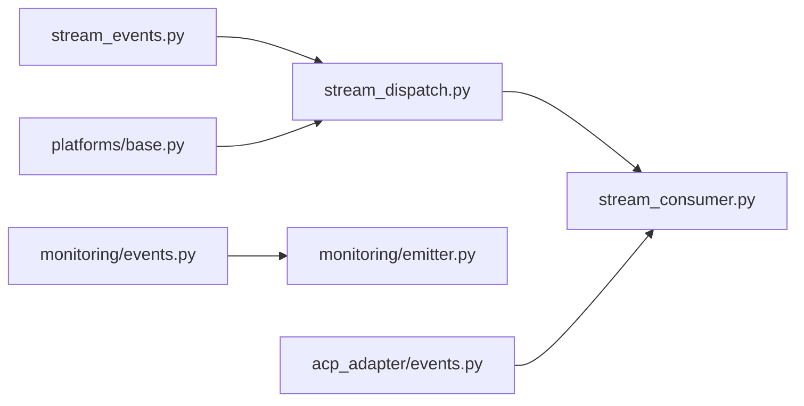

# 事件驱动模式

<cite>
**本文引用的文件**
- [gateway/stream_events.py](file://gateway/stream_events.py)
- [gateway/stream_dispatch.py](file://gateway/stream_dispatch.py)
- [gateway/stream_consumer.py](file://gateway/stream_consumer.py)
- [agent/monitoring/events.py](file://agent/monitoring/events.py)
- [agent/monitoring/emitter.py](file://agent/monitoring/emitter.py)
- [acp_adapter/events.py](file://acp_adapter/events.py)
- [gateway/platforms/base.py](file://gateway/platforms/base.py)
</cite>

## 目录
1. [简介](#简介)
2. [项目结构](#项目结构)
3. [核心组件](#核心组件)
4. [架构总览](#架构总览)
5. [详细组件分析](#详细组件分析)
6. [依赖关系分析](#依赖关系分析)
7. [性能考量](#性能考量)
8. [故障排查指南](#故障排查指南)
9. [结论](#结论)
10. [附录](#附录)

## 简介
本文件系统性阐述 Hermes Agent 的事件驱动模式：从“事件定义—发布—分发—消费”的完整链路，到异步处理、并发控制与错误隔离策略。重点覆盖三类事件：用户输入事件、工具执行事件、状态变更事件；并解释该模式如何提升系统响应性与可扩展性。

## 项目结构
Hermes 的事件体系围绕“结构化事件 + 适配器渲染 + 流式消费者”的分层设计展开：
- 事件定义：在 gateway/stream_events.py 中定义面向网关的流式事件类型（消息片段、工具调用、提示等）。
- 事件分发：gateway/stream_dispatch.py 中的 GatewayEventDispatcher 将事件路由到平台适配器的渲染钩子，并写入进度队列。
- 流式消费：gateway/stream_consumer.py 的 GatewayStreamConsumer 负责将文本增量以编辑或草稿形式投递到目标平台。
- 监控事件：agent/monitoring/events.py 定义健康与诊断事件，agent/monitoring/emitter.py 提供无阻塞的发射器与后台分发线程。
- ACP 桥接：acp_adapter/events.py 将 AIAgent 回调转换为 ACP 会话更新，跨线程安全地发送到编辑器。
- 平台输入：gateway/platforms/base.py 中的 MessageEvent 统一了各平台入站消息的结构化表示。



**图示来源**
- [gateway/stream_events.py:1-172](file://gateway/stream_events.py#L1-L172)
- [gateway/stream_dispatch.py:1-133](file://gateway/stream_dispatch.py#L1-L133)
- [gateway/stream_consumer.py:156-800](file://gateway/stream_consumer.py#L156-L800)
- [agent/monitoring/events.py:1-87](file://agent/monitoring/events.py#L1-L87)
- [agent/monitoring/emitter.py:1-212](file://agent/monitoring/emitter.py#L1-L212)
- [acp_adapter/events.py:1-280](file://acp_adapter/events.py#L1-L280)
- [gateway/platforms/base.py:2060-2259](file://gateway/platforms/base.py#L2060-L2259)

**章节来源**
- [gateway/stream_events.py:1-172](file://gateway/stream_events.py#L1-L172)
- [gateway/stream_dispatch.py:1-133](file://gateway/stream_dispatch.py#L1-L133)
- [gateway/stream_consumer.py:156-800](file://gateway/stream_consumer.py#L156-L800)
- [agent/monitoring/events.py:1-87](file://agent/monitoring/events.py#L1-L87)
- [agent/monitoring/emitter.py:1-212](file://agent/monitoring/emitter.py#L1-L212)
- [acp_adapter/events.py:1-280](file://acp_adapter/events.py#L1-L280)
- [gateway/platforms/base.py:2060-2259](file://gateway/platforms/base.py#L2060-L2259)

## 核心组件
- 结构化流事件（gateway/stream_events.py）：定义消息片段、消息结束、评论、工具开始/完成、长任务提示、网关通知等不可变数据类，作为 agent→gateway 的交付契约。
- 事件分发器（gateway/stream_dispatch.py）：根据通道配置（工具进度模式、预览长度）将事件路由到适配器的 render/format 钩子，必要时丢弃无法渲染的事件。
- 流消费者（gateway/stream_consumer.py）：线程安全的 on_delta/on_segment_break/on_commentary/finish，内部使用 queue.Queue 将同步回调转为异步任务，按速率限制与平台能力进行渐进式编辑或草稿流式推送。
- 监控发射器（agent/monitoring/emitter.py）：进程级单例，emit() 永不阻塞、永不抛异常；后台线程批量分发给订阅者（如 OTLP 导出器），支持 subscribe/unsubscribe。
- ACP 桥接（acp_adapter/events.py）：为 AIAgent 的 tool_progress/thinking/step/message 回调创建工厂函数，通过 safe_schedule_threadsafe 将更新发送到主事件循环。
- 平台输入事件（gateway/platforms/base.py）：MessageEvent 统一入站消息结构，包含文本、作者、源、媒体、回复上下文、命令解析等。

**章节来源**
- [gateway/stream_events.py:41-159](file://gateway/stream_events.py#L41-L159)
- [gateway/stream_dispatch.py:40-133](file://gateway/stream_dispatch.py#L40-L133)
- [gateway/stream_consumer.py:156-800](file://gateway/stream_consumer.py#L156-L800)
- [agent/monitoring/emitter.py:36-212](file://agent/monitoring/emitter.py#L36-L212)
- [acp_adapter/events.py:114-280](file://acp_adapter/events.py#L114-L280)
- [gateway/platforms/base.py:2060-2259](file://gateway/platforms/base.py#L2060-L2259)

## 架构总览
下图展示事件从产生到消费的端到端流程，涵盖用户输入、工具执行与状态变更三类事件。



**图示来源**
- [gateway/stream_dispatch.py:88-133](file://gateway/stream_dispatch.py#L88-L133)
- [gateway/stream_consumer.py:590-800](file://gateway/stream_consumer.py#L590-L800)
- [gateway/platforms/base.py:2060-2259](file://gateway/platforms/base.py#L2060-L2259)

## 详细组件分析

### 事件定义与类型（gateway/stream_events.py）
- 消息事件：MessageChunk（增量）、MessageStop（段落结束）、Commentary（完整中间消息）。
- 工具事件：ToolCallChunk（开始/进行中）、ToolCallFinished（完成，含时长与成功标志）。
- 控制事件：LongToolHint（长任务提示）、GatewayNotice（重启/在线/长运行等）。
- StreamEvent 联合类型确保 exhaustive match 时类型检查可见。

这些事件是纯数据类，无行为与平台知识，便于跨线程/异步边界传递。

**章节来源**
- [gateway/stream_events.py:41-159](file://gateway/stream_events.py#L41-L159)

### 事件分发器（gateway/stream_dispatch.py）
- 职责：接收 StreamEvent，依据通道配置（tool_mode、preview_max_len）决定是否渲染与去重（new 模式下仅当工具变化才上报）。
- 渲染钩子：render_message_event 用于消息/评论/分段；format_tool_event 用于工具进度行。
- 错误隔离：dispatch 包裹 try/except，确保呈现层异常不会破坏代理工作线程。
- 扩展点：on_long_tool、on_notice 回调让网关拥有“是否在此处展示”的最终决策权。



**图示来源**
- [gateway/stream_dispatch.py:88-133](file://gateway/stream_dispatch.py#L88-L133)

**章节来源**
- [gateway/stream_dispatch.py:40-133](file://gateway/stream_dispatch.py#L40-L133)

### 流式消费者（gateway/stream_consumer.py）
- 线程安全入口：on_delta(text)、on_segment_break()、on_commentary(text)、finish() 均通过 queue.Queue 投递给异步 run() 任务。
- 缓冲与限流：按 edit_interval 与 buffer_threshold 控制编辑频率，避免平台 flood control。
- 传输选择：支持 draft（原生草稿流式）、edit（渐进式编辑）与自动回退；对不支持的平台降级。
- 分段与最终化：on_segment_break 重置段状态；finish 后记录已送达内容，避免重复发送。
- 思考块过滤：内置状态机屏蔽 <think>...</think> 等推理标签，保证用户不看到原始推理过程。
- 溢出与恢复：处理超长消息拆分、Telegram overflow 部分送达后的尾部补发。



**图示来源**
- [gateway/stream_consumer.py:156-800](file://gateway/stream_consumer.py#L156-L800)

**章节来源**
- [gateway/stream_consumer.py:156-800](file://gateway/stream_consumer.py#L156-L800)

### 监控事件与发射器（agent/monitoring/events.py, agent/monitoring/emitter.py）
- 事件类型：GatewayHealthEvent（健康快照/生命周期）、GatewayDiagnosticEvent（诊断告警）、CronExecutionEvent（定时任务执行投影）。
- 发射器特性：
  - emit() 微秒级返回，绝不阻塞网络/磁盘，绝不抛异常。
  - 环形队列（最大容量）满时丢弃最旧事件，保证内存上限。
  - 后台线程批量分发至订阅者（OTLP 导出器等），单个订阅者失败不影响其他订阅者。
  - subscribe/unsubscribe 动态启用/禁用采集平面。



**图示来源**
- [agent/monitoring/events.py:19-80](file://agent/monitoring/events.py#L19-L80)
- [agent/monitoring/emitter.py:36-212](file://agent/monitoring/emitter.py#L36-L212)

**章节来源**
- [agent/monitoring/events.py:1-87](file://agent/monitoring/events.py#L1-L87)
- [agent/monitoring/emitter.py:1-212](file://agent/monitoring/emitter.py#L1-L212)

### ACP 桥接（acp_adapter/events.py）
- 回调工厂：make_tool_progress_cb、make_thinking_cb、make_step_cb、make_message_cb 分别对应 AIAgent 的 tool_progress/thinking/step/message 回调。
- 跨线程安全：使用 safe_schedule_threadsafe 将 session_update 调度到主事件循环，避免从工作线程直接访问 asyncio。
- 工具映射：维护 per-tool 的 FIFO 队列与元数据，确保并行同名工具调用正确匹配 start/complete。
- 计划面板：todo 工具结果可转换为 ACP PlanUpdate，供 Zed 等客户端渲染任务面板。

```mermaid
sequenceDiagram
participant Agent as "AIAgent(工作线程)"
participant Bridge as "ACP 桥接"
participant Loop as "主事件循环"
participant Client as "ACP 客户端"
Agent->>Bridge : tool_progress("tool.started", name, args)
Bridge->>Loop : safe_schedule_threadsafe(session_update(...))
Loop->>Client : session_update(tool_start)
Agent->>Bridge : step(prev_tools)
Bridge->>Loop : safe_schedule_threadsafe(session_update(tool_complete))
Loop->>Client : session_update(tool_complete)
```

**图示来源**
- [acp_adapter/events.py:114-280](file://acp_adapter/events.py#L114-L280)

**章节来源**
- [acp_adapter/events.py:1-280](file://acp_adapter/events.py#L1-L280)

### 平台输入事件（gateway/platforms/base.py）
- MessageEvent 统一入站消息结构，包括文本、作者、源、媒体、回复上下文、命令解析、渠道上下文、内部标记、元数据、时间戳等。
- 命令识别：is_command/get_command/get_command_args 提供标准化命令提取。
- 特殊改写：coerce_plaintext_gateway_command 将特定 DM 短语改写为斜杠命令，避免进入 LLM/tool 路径导致自重启风险。

**章节来源**
- [gateway/platforms/base.py:2060-2259](file://gateway/platforms/base.py#L2060-L2259)

## 依赖关系分析
- stream_events.py 被 stream_dispatch.py 引用，定义事件类型。
- stream_dispatch.py 依赖 platform 适配器的 render/format 钩子，并将工具进度行入队到 sink。
- stream_consumer.py 独立于分发器，但通常由网关在构建会话时注入 adapter/chat_id/config/metadata。
- monitoring/events.py 与 emitter.py 解耦：事件只定义数据结构，emitter 负责收集与分发。
- acp_adapter/events.py 依赖 agent.async_utils.safe_schedule_threadsafe 与 acp.schema 类型。
- platforms/base.py 提供 MessageEvent，被网关平台侧消费并转化为后续事件流。



**图示来源**
- [gateway/stream_events.py:1-172](file://gateway/stream_events.py#L1-L172)
- [gateway/stream_dispatch.py:1-133](file://gateway/stream_dispatch.py#L1-L133)
- [gateway/stream_consumer.py:156-800](file://gateway/stream_consumer.py#L156-L800)
- [agent/monitoring/events.py:1-87](file://agent/monitoring/events.py#L1-L87)
- [agent/monitoring/emitter.py:1-212](file://agent/monitoring/emitter.py#L1-L212)
- [acp_adapter/events.py:1-280](file://acp_adapter/events.py#L1-L280)
- [gateway/platforms/base.py:2060-2259](file://gateway/platforms/base.py#L2060-L2259)

**章节来源**
- [gateway/stream_events.py:1-172](file://gateway/stream_events.py#L1-L172)
- [gateway/stream_dispatch.py:1-133](file://gateway/stream_dispatch.py#L1-L133)
- [gateway/stream_consumer.py:156-800](file://gateway/stream_consumer.py#L156-L800)
- [agent/monitoring/events.py:1-87](file://agent/monitoring/events.py#L1-L87)
- [agent/monitoring/emitter.py:1-212](file://agent/monitoring/emitter.py#L1-L212)
- [acp_adapter/events.py:1-280](file://acp_adapter/events.py#L1-L280)
- [gateway/platforms/base.py:2060-2259](file://gateway/platforms/base.py#L2060-L2259)

## 性能考量
- 低延迟发布：MonitoringEmitter.emit() 使用非阻塞 put_nowait，队列满时丢弃最旧事件，保证热路径微秒级返回。
- 批量分发：后台线程以固定批次大小消费队列，减少 I/O 次数。
- 自适应编辑间隔：GatewayStreamConsumer 根据平台反馈调整 edit_interval，避免 flood control。
- 去重与节流：stream_dispatch 在 new 模式下仅当工具变化才上报，减少冗余进度气泡。
- 传输回退：当草稿流式失败时自动回退到编辑模式，保障可用性。

[本节为通用指导，无需具体文件引用]

## 故障排查指南
- 呈现层异常隔离：GatewayEventDispatcher.dispatch 捕获所有异常并记录日志，确保代理工作线程不受影响。
- 监控失败不阻塞：MonitoringEmitter 的 emit 与 _dispatch 均捕获异常，单个订阅者失败不影响其他订阅者与热路径。
- 流式消费者健壮性：
  - flush_pending_sync 提供屏障，确保阻塞交互提示前已送达前置内容。
  - 思考块过滤防止用户看到原始推理标签。
  - 溢出与部分送达场景下，消费者会记录并补发缺失尾部。
- 平台连接重试：平台适配器的 connect 需接受 is_reconnect 关键字参数，网关重连时会转发该参数；测试用例强制校验签名一致性。

**章节来源**
- [gateway/stream_dispatch.py:88-94](file://gateway/stream_dispatch.py#L88-L94)
- [agent/monitoring/emitter.py:53-77](file://agent/monitoring/emitter.py#L53-L77)
- [gateway/stream_consumer.py:502-524](file://gateway/stream_consumer.py#L502-L524)
- [tests/gateway/test_adapter_connect_is_reconnect_contract.py:1-145](file://tests/gateway/test_adapter_connect_is_reconnect_contract.py#L1-L145)

## 结论
Hermes 的事件驱动模式通过“结构化事件 + 适配器渲染 + 流式消费”的分层设计，实现了高内聚、低耦合与强扩展性：
- 响应性：流式消费者实时编辑/草稿推送，用户即时感知进展。
- 可扩展性：新增平台只需实现 render/format 钩子；新增事件类型只需扩展 StreamEvent 联合类型。
- 可靠性：多层错误隔离（分发器、发射器、消费者）与回退机制，确保核心路径稳定。
- 可观测性：监控事件与发射器提供无侵入的健康与诊断能力。

[本节为总结，无需具体文件引用]

## 附录
- 事件类型速查：
  - 用户输入事件：MessageEvent（gateway/platforms/base.py）
  - 工具执行事件：ToolCallChunk、ToolCallFinished（gateway/stream_events.py）
  - 状态变更事件：MessageStop、Commentary、LongToolHint、GatewayNotice（gateway/stream_events.py）
- 关键 API 路径参考：
  - 事件定义：[gateway/stream_events.py:41-159](file://gateway/stream_events.py#L41-L159)
  - 事件分发：[gateway/stream_dispatch.py:88-133](file://gateway/stream_dispatch.py#L88-L133)
  - 流式消费：[gateway/stream_consumer.py:590-800](file://gateway/stream_consumer.py#L590-L800)
  - 监控发射：[agent/monitoring/emitter.py:53-116](file://agent/monitoring/emitter.py#L53-L116)
  - ACP 桥接：[acp_adapter/events.py:114-280](file://acp_adapter/events.py#L114-L280)
  - 平台输入：[gateway/platforms/base.py:2060-2259](file://gateway/platforms/base.py#L2060-L2259)

[本节为索引，无需具体文件引用]