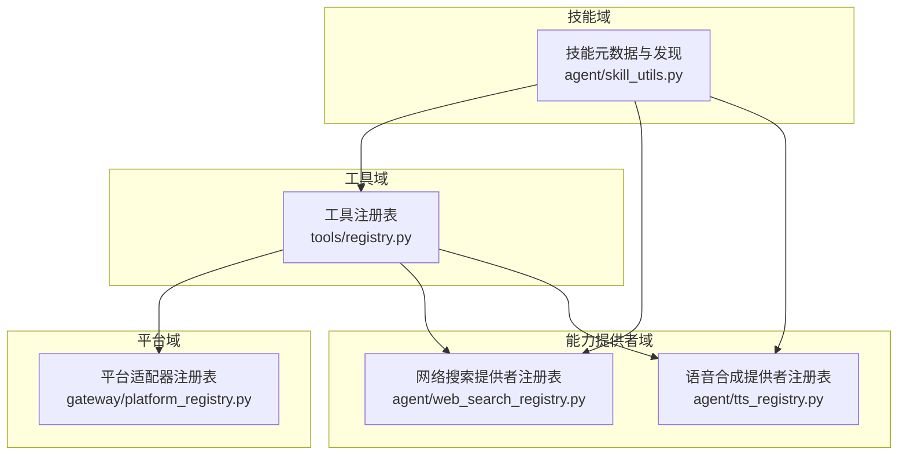
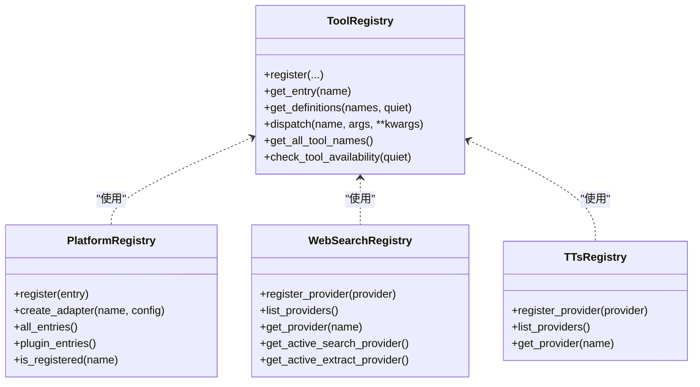
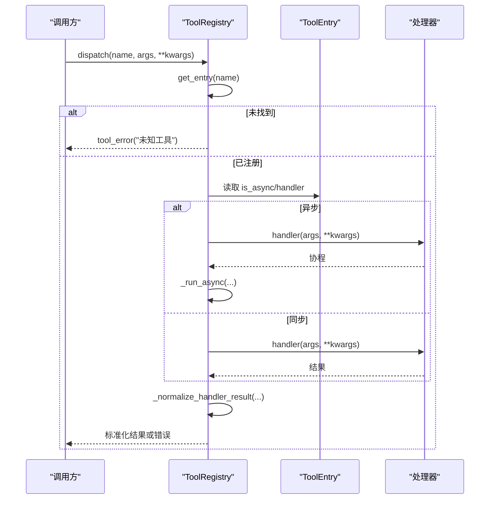
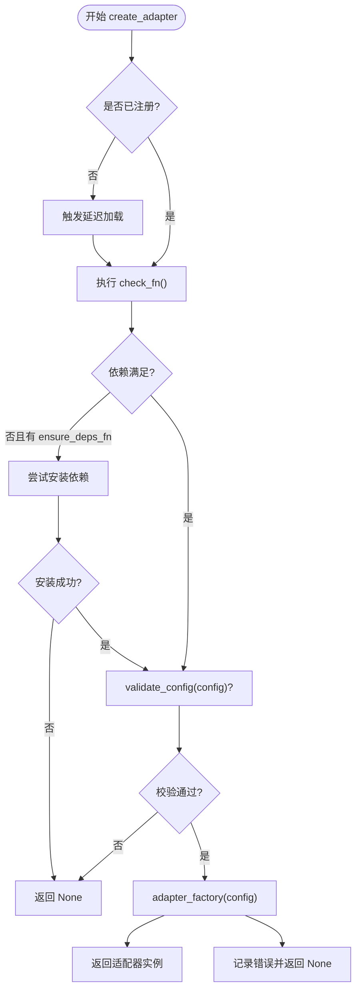
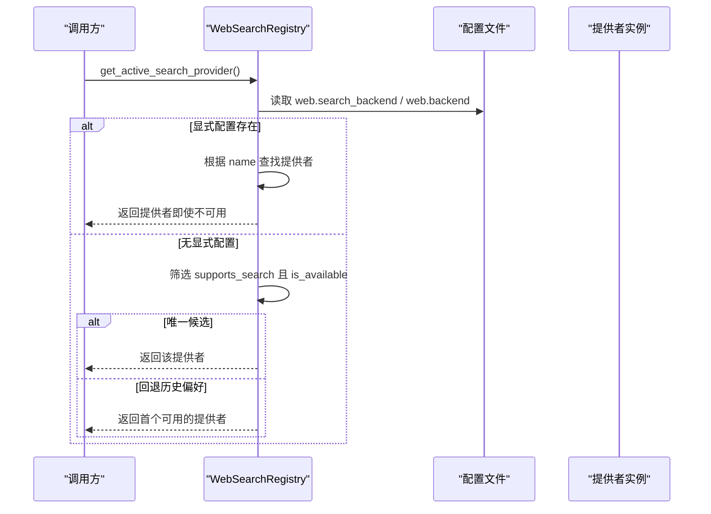
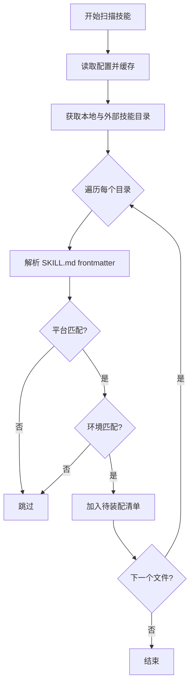
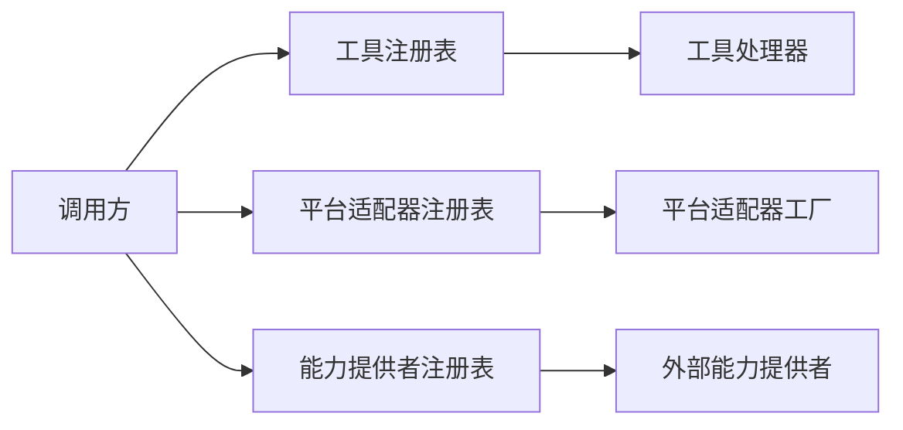

# 工厂模式

<cite>
**本文引用的文件**
- [工具注册表](file://tools/registry.py)
- [平台适配器注册表](file://gateway/platform_registry.py)
- [网络搜索提供者注册表](file://agent/web_search_registry.py)
- [语音合成提供者注册表](file://agent/tts_registry.py)
- [技能元数据与发现工具](file://agent/skill_utils.py)
</cite>

## 目录
1. [简介](#简介)
2. [项目结构](#项目结构)
3. [核心组件](#核心组件)
4. [架构总览](#架构总览)
5. [详细组件分析](#详细组件分析)
6. [依赖关系分析](#依赖关系分析)
7. [性能考量](#性能考量)
8. [故障排查指南](#故障排查指南)
9. [结论](#结论)
10. [附录](#附录)

## 简介
本文件系统性梳理 Hermes Agent 中“工厂模式”的实现与应用，聚焦于如何通过统一的注册与创建机制，动态构建和管理工具、技能、插件模块、平台适配器以及各类外部能力提供者（如网络搜索、语音合成等）。文档涵盖：
- 工厂接口与具体工厂实现
- 对象创建策略（含配置解析、依赖检查、参数校验）
- 缓存机制（TTL、懒加载、快照隔离）
- 错误处理与可观测性
- 通过代码级图示展示调用链与数据流
- 工厂模式对系统灵活性与可维护性的提升

## 项目结构
Hermes Agent 的工厂模式以“注册表 + 工厂方法”为核心组织方式。不同领域各自维护一个注册表，负责：
- 接收插件或内置能力的自我注册
- 提供按名称查找与实例化对象的工厂方法
- 在创建前执行依赖探测、配置校验与可用性判断
- 提供查询、列表、别名、快照等辅助能力

**图表来源**
- [工具注册表:1-160](file://tools/registry.py#L1-L160)
- [平台适配器注册表:1-100](file://gateway/platform_registry.py#L1-L100)
- [网络搜索提供者注册表:1-100](file://agent/web_search_registry.py#L1-L100)
- [语音合成提供者注册表:1-135](file://agent/tts_registry.py#L1-L135)
- [技能元数据与发现工具:1-120](file://agent/skill_utils.py#L1-L120)

**章节来源**
- [工具注册表:1-160](file://tools/registry.py#L1-L160)
- [平台适配器注册表:1-100](file://gateway/platform_registry.py#L1-L100)
- [网络搜索提供者注册表:1-100](file://agent/web_search_registry.py#L1-L100)
- [语音合成提供者注册表:1-135](file://agent/tts_registry.py#L1-L135)
- [技能元数据与发现工具:1-120](file://agent/skill_utils.py#L1-L120)

## 核心组件
- 工具注册表（ToolRegistry）
  - 职责：集中管理所有工具的元数据、处理器、可用性与分发；支持动态注册、别名、快照、TTL 缓存、结果归一化与错误边界。
- 平台适配器注册表（PlatformRegistry）
  - 职责：统一注册平台适配器及其工厂、依赖探测、配置校验、延迟加载与实例化；支持插件覆盖内置。
- 能力提供者注册表（WebSearch/TTS 等）
  - 职责：注册外部能力提供者，按配置与可用性选择活跃提供者，提供 list/get/active 等工厂式访问。
- 技能元数据与发现（skill_utils）
  - 职责：扫描与解析技能元数据、平台与环境匹配、外部目录与禁用策略，为上层工厂提供“待装配”的技能清单。

**章节来源**
- [工具注册表:201-436](file://tools/registry.py#L201-L436)
- [平台适配器注册表:183-382](file://gateway/platform_registry.py#L183-L382)
- [网络搜索提供者注册表:44-305](file://agent/web_search_registry.py#L44-L305)
- [语音合成提供者注册表:40-135](file://agent/tts_registry.py#L40-L135)
- [技能元数据与发现工具:151-800](file://agent/skill_utils.py#L151-L800)

## 架构总览
下图展示了 Hermes Agent 中“工厂模式”的整体协作关系：各注册表作为“抽象工厂”，对外暴露统一的创建与查询接口；调用方（工具调度、网关、CLI、技能编排）仅依赖接口，不关心具体实现类如何被构造。

**图表来源**
- [工具注册表:414-955](file://tools/registry.py#L414-L955)
- [平台适配器注册表:183-382](file://gateway/platform_registry.py#L183-L382)
- [网络搜索提供者注册表:44-305](file://agent/web_search_registry.py#L44-L305)
- [语音合成提供者注册表:40-135](file://agent/tts_registry.py#L40-L135)

## 详细组件分析

### 工具注册表（ToolRegistry）——工具工厂
- 工厂接口与策略
  - register：声明工具名、工具集、Schema、处理器、可用性探针、环境变量、异步标记、描述、表情、最大结果大小、动态 Schema 覆盖等。
  - get_entry/get_definitions/dispatch：按名称获取条目、生成 OpenAI 风格的工具定义、分发执行并归一化结果。
- 依赖解析与可用性
  - check_fn 缓存：TTL 约 30 秒，失败宽限窗口内保留上次成功值，避免瞬时抖动导致工具不可用。
  - 多进程/多 Profile 隔离：基于 Hermes Home 覆盖键进行缓存作用域控制。
- 缓存机制
  - 发现缓存：基于文件 mtime+size 的工具发现缓存，减少重复 AST 扫描。
  - 快照隔离：内部 RLock + 世代计数，保证并发安全与外部可缓存。
- 错误处理
  - 异常捕获与错误体截断，统一返回 JSON 错误格式，避免上下文污染。

**图表来源**
- [工具注册表:801-834](file://tools/registry.py#L801-L834)
- [工具注册表:717-764](file://tools/registry.py#L717-L764)
- [工具注册表:974-1002](file://tools/registry.py#L974-L1002)

**章节来源**
- [工具注册表:201-436](file://tools/registry.py#L201-L436)
- [工具注册表:414-955](file://tools/registry.py#L414-L955)
- [工具注册表:958-1002](file://tools/registry.py#L958-L1002)

### 平台适配器注册表（PlatformRegistry）——平台工厂
- 工厂接口与策略
  - PlatformEntry：封装平台标识、标签、工厂函数、依赖探测、配置校验、安装提示、连接状态、环境变量、YAML→环境桥接、独立发送器等。
  - create_adapter：按名称创建适配器实例，包含依赖探测、按需安装、配置校验、工厂调用与异常记录。
- 延迟加载
  - register_deferred/_resolve/_resolve_all：仅在首次使用时导入重型平台模块，降低启动开销。
- 插件覆盖与优先级
  - 插件可覆盖内置平台；同一名称最后写入者胜出。
- 错误处理
  - 依赖探测失败时给出安装提示；配置校验失败直接返回 None；工厂异常记录日志并返回 None。

**图表来源**
- [平台适配器注册表:299-377](file://gateway/platform_registry.py#L299-L377)
- [平台适配器注册表:208-250](file://gateway/platform_registry.py#L208-L250)

**章节来源**
- [平台适配器注册表:38-181](file://gateway/platform_registry.py#L38-L181)
- [平台适配器注册表:183-382](file://gateway/platform_registry.py#L183-L382)

### 能力提供者注册表（WebSearch/TTS）——外部能力工厂
- 网络搜索提供者注册表
  - 注册与查询：register_provider/list_providers/get_provider。
  - 活跃选择策略：优先显式配置，其次唯一可用提供者，再回退到历史偏好顺序；支持 search/extract 能力过滤。
  - 配置读取：从配置文件中读取 web.search_backend / web.extract_backend / web.backend。
  - 健壮性：is_available 异常保护，避免错误提供者阻断选择流程。
- 语音合成提供者注册表
  - 注册与查询：register_provider/list_providers/get_provider。
  - 内置优先：内置名称集合受保护，插件同名注册将被拒绝并告警。
  - 名称规范化：大小写与空白容忍，与工具侧保持一致。

**图表来源**
- [网络搜索提供者注册表:98-219](file://agent/web_search_registry.py#L98-L219)
- [网络搜索提供者注册表:281-298](file://agent/web_search_registry.py#L281-L298)

**章节来源**
- [网络搜索提供者注册表:44-305](file://agent/web_search_registry.py#L44-L305)
- [语音合成提供者注册表:40-135](file://agent/tts_registry.py#L40-L135)

### 技能工厂（Skill 发现与装配）
- 角色定位
  - 不直接创建运行时对象，而是提供“待装配”的技能清单与条件判定（平台、环境、禁用、外部目录），供上层工厂（工具、技能编排）消费。
- 关键能力
  - 解析 SKILL.md frontmatter，提取平台与环境要求。
  - 识别 org 镜像与外部技能目录，支持安全边界与权限控制。
  - 缓存配置读取与外部目录解析，降低冷启动成本。

**图表来源**
- [技能元数据与发现工具:174-220](file://agent/skill_utils.py#L174-L220)
- [技能元数据与发现工具:226-387](file://agent/skill_utils.py#L226-L387)
- [技能元数据与发现工具:499-590](file://agent/skill_utils.py#L499-L590)

**章节来源**
- [技能元数据与发现工具:151-800](file://agent/skill_utils.py#L151-L800)

## 依赖关系分析
- 松耦合
  - 调用方仅依赖注册表接口，不感知具体实现类；新增工具/平台/提供者只需自我注册。
- 高内聚
  - 每个注册表专注自身领域，职责清晰；跨域交互通过明确接口完成。
- 循环依赖规避
  - 工具注册表避免在模块导入时引入重依赖；通过延迟导入与缓存降低耦合。
- 插件扩展点
  - 平台与能力提供者均支持插件注册，允许运行时扩展与覆盖。

**图表来源**
- [工具注册表:414-955](file://tools/registry.py#L414-L955)
- [平台适配器注册表:183-382](file://gateway/platform_registry.py#L183-L382)
- [网络搜索提供者注册表:44-305](file://agent/web_search_registry.py#L44-L305)
- [语音合成提供者注册表:40-135](file://agent/tts_registry.py#L40-L135)

**章节来源**
- [工具注册表:414-955](file://tools/registry.py#L414-L955)
- [平台适配器注册表:183-382](file://gateway/platform_registry.py#L183-L382)
- [网络搜索提供者注册表:44-305](file://agent/web_search_registry.py#L44-L305)
- [语音合成提供者注册表:40-135](file://agent/tts_registry.py#L40-L135)

## 性能考量
- 延迟加载
  - 平台适配器模块在首次使用时才导入，显著缩短 CLI 启动时间。
- TTL 与失败宽限
  - 工具可用性检查采用 30 秒 TTL 与最近成功宽限，避免瞬时抖动导致工具不可用。
- 发现缓存
  - 工具发现基于文件 mtime+size 的缓存，减少重复 AST 扫描。
- 快照与并发
  - 工具注册表使用 RLock 与世代计数，确保并发安全与外部可缓存。
- 配置缓存
  - 技能相关配置读取与外部目录解析采用进程内缓存，降低冷启动成本。

[本节为通用性能讨论，无需特定文件引用]

## 故障排查指南
- 工具不可用
  - 检查 check_fn 是否抛出异常或被缓存为 False；必要时调用失效接口刷新缓存。
  - 查看工具定义生成路径，确认动态 Schema 覆盖是否引发异常。
- 平台适配器创建失败
  - 检查依赖探测是否失败；若有 ensure_deps_fn，确认安装逻辑是否成功。
  - 检查 validate_config 是否返回 False；查看日志中的安装提示。
- 能力提供者未生效
  - 检查配置键是否正确；确认提供者是否注册且 is_available 返回 True。
  - 对于 TTS，确认未与内置名称冲突。
- 错误信息脱敏
  - 工具执行异常会被统一格式化与脱敏，避免敏感信息泄露。

**章节来源**
- [工具注册表:312-387](file://tools/registry.py#L312-L387)
- [平台适配器注册表:315-377](file://gateway/platform_registry.py#L315-L377)
- [网络搜索提供者注册表:173-219](file://agent/web_search_registry.py#L173-L219)
- [语音合成提供者注册表:81-109](file://agent/tts_registry.py#L81-L109)
- [工具注册表:974-1002](file://tools/registry.py#L974-L1002)

## 结论
Hermes Agent 通过“注册表 + 工厂方法”的模式，将工具、平台适配器、外部能力提供者与技能的创建与装配过程解耦，实现了：
- 高可扩展性：新增组件仅需自我注册，无需修改调用方。
- 高可维护性：创建策略集中在注册表中，便于统一管理与演进。
- 高可靠性：依赖探测、配置校验、错误边界与缓存机制保障稳定运行。
- 高性能：延迟加载、TTL 缓存、发现缓存与快照隔离优化启动与运行时性能。

[本节为总结性内容，无需特定文件引用]

## 附录
- 最佳实践
  - 为新工具/平台/提供者编写清晰的注册入口与可用性探针。
  - 使用动态 Schema 覆盖表达运行时依赖的配置变化。
  - 谨慎设计 check_fn，避免昂贵或易抖动的探测逻辑。
  - 利用延迟加载减少启动开销。
- 参考路径
  - 工具注册表：[工具注册表](file://tools/registry.py)
  - 平台适配器注册表：[平台适配器注册表](file://gateway/platform_registry.py)
  - 网络搜索提供者注册表：[网络搜索提供者注册表](file://agent/web_search_registry.py)
  - 语音合成提供者注册表：[语音合成提供者注册表](file://agent/tts_registry.py)
  - 技能元数据与发现工具：[技能元数据与发现工具](file://agent/skill_utils.py)

[本节为补充说明，无需特定文件引用]