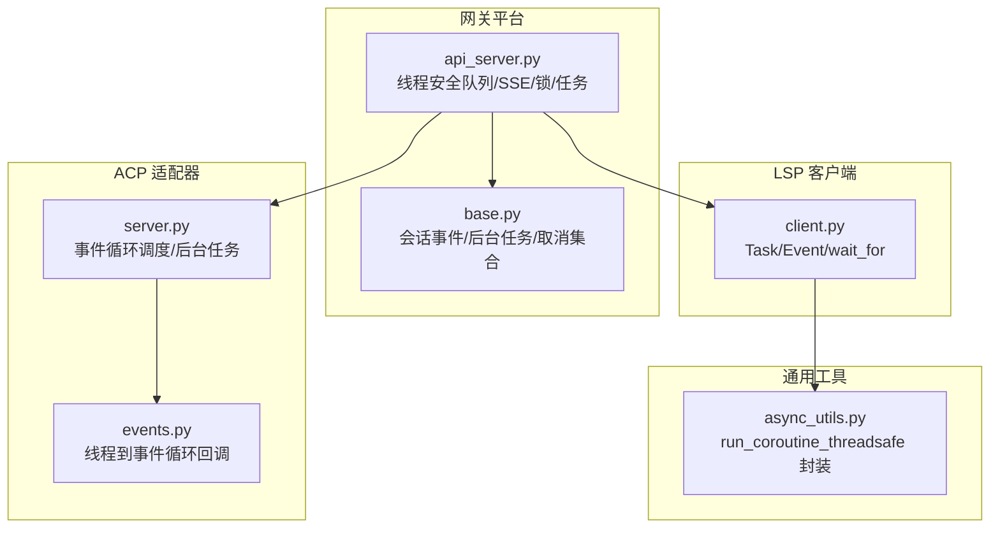
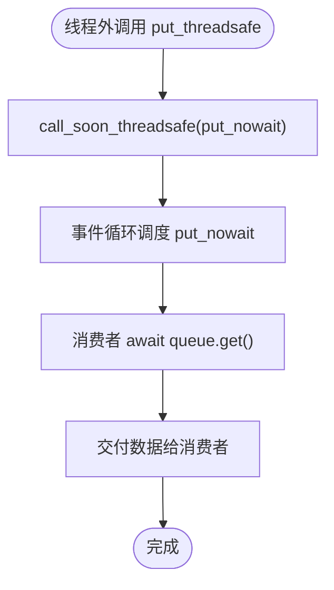
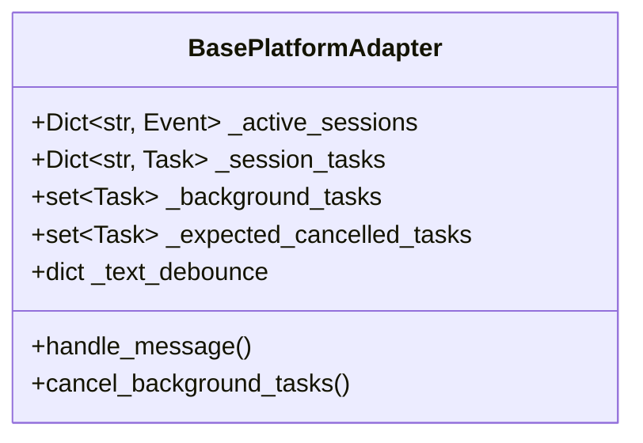
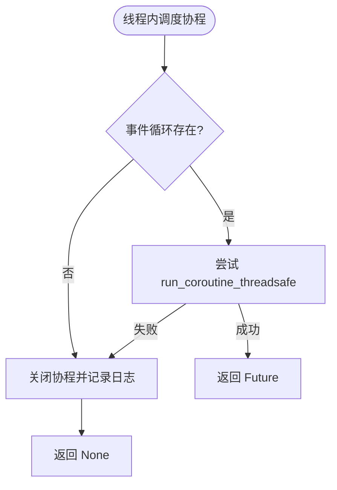
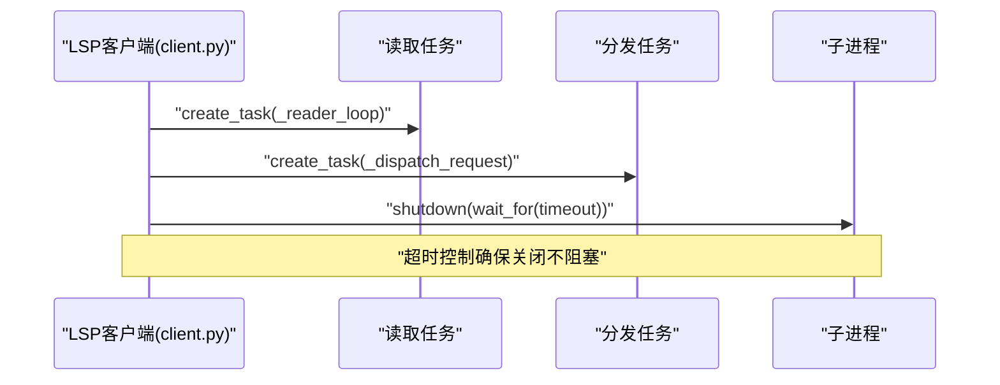
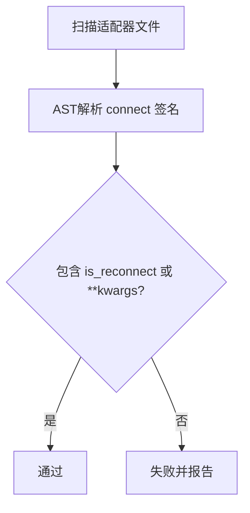
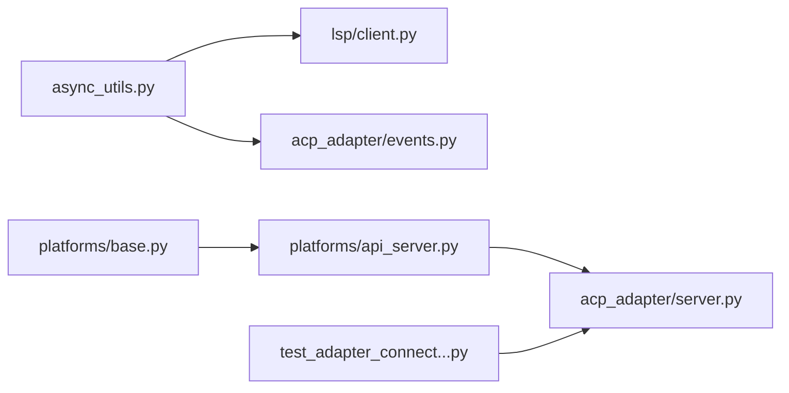

# 异步并发模式

<cite>
**本文引用的文件**
- [agent/async_utils.py](file://agent/async_utils.py)
- [gateway/platforms/api_server.py](file://gateway/platforms/api_server.py)
- [gateway/platforms/base.py](file://gateway/platforms/base.py)
- [acp_adapter/server.py](file://acp_adapter/server.py)
- [acp_adapter/events.py](file://acp_adapter/events.py)
- [agent/lsp/client.py](file://agent/lsp/client.py)
- [tests/gateway/test_adapter_connect_is_reconnect_contract.py](file://tests/gateway/test_adapter_connect_is_reconnect_contract.py)
</cite>

## 目录
1. [简介](#简介)
2. [项目结构](#项目结构)
3. [核心组件](#核心组件)
4. [架构总览](#架构总览)
5. [详细组件分析](#详细组件分析)
6. [依赖关系分析](#依赖关系分析)
7. [性能考量](#性能考量)
8. [故障排查指南](#故障排查指南)
9. [结论](#结论)
10. [附录：示例与最佳实践](#附录示例与最佳实践)

## 简介
本章节面向 Hermes Agent 的异步并发模式，系统性地说明代码库如何使用 asyncio、协程管理、任务调度、异步 I/O、并发工具执行、资源竞争处理、超时控制与异常处理等关键能力。文档通过架构图、时序图与流程图，结合具体源码位置，帮助读者理解异步并发如何提升吞吐量和响应性能，并给出可操作的实现建议与排障要点。

## 项目结构
Hermes Agent 的异步并发能力分布在多个子系统：
- 事件循环与线程桥接：在 agent/async_utils.py 中提供线程到事件循环的安全调度封装，避免关闭竞态导致的协程泄漏。
- 网关平台层：gateway/platforms/api_server.py 实现了线程安全队列、SSE 流式写入、批量锁与任务跟踪；base.py 维护会话级事件、后台任务集合、取消预期集合等并发原语。
- ACP 适配器：acp_adapter/server.py 和 events.py 使用事件循环调度、后台任务创建、线程间回调等手段进行异步更新。
- LSP 客户端：agent/lsp/client.py 大量使用 asyncio.Task、Event、wait_for 实现请求/推送双通道与超时控制。
- 测试契约：tests/gateway/test_adapter_connect_is_reconnect_contract.py 以静态 AST 校验所有平台适配器的 connect() 签名必须接受 is_reconnect 关键字，保障重连路径的异步调用一致性。



**图示来源**
- [gateway/platforms/api_server.py:160-185](file://gateway/platforms/api_server.py#L160-L185)
- [gateway/platforms/base.py:2800-2832](file://gateway/platforms/base.py#L2800-L2832)
- [acp_adapter/server.py:967-970](file://acp_adapter/server.py#L967-L970)
- [acp_adapter/events.py:90-117](file://acp_adapter/events.py#L90-L117)
- [agent/lsp/client.py:332-363](file://agent/lsp/client.py#L332-L363)
- [agent/async_utils.py:34-68](file://agent/async_utils.py#L34-L68)

**章节来源**
- [gateway/platforms/api_server.py:160-185](file://gateway/platforms/api_server.py#L160-L185)
- [gateway/platforms/base.py:2800-2832](file://gateway/platforms/base.py#L2800-L2832)
- [acp_adapter/server.py:967-970](file://acp_adapter/server.py#L967-L970)
- [acp_adapter/events.py:90-117](file://acp_adapter/events.py#L90-L117)
- [agent/lsp/client.py:332-363](file://agent/lsp/client.py#L332-L363)
- [agent/async_utils.py:34-68](file://agent/async_utils.py#L34-L68)

## 核心组件
- 线程安全异步队列（ThreadSafeAsyncQueue）：在非事件循环线程向 asyncio.Queue 投递数据，使用 call_soon_threadsafe 唤醒消费者，避免轮询开销与尾延迟。
- 会话级并发原语：使用 asyncio.Event、asyncio.Lock、asyncio.Task 管理会话生命周期、消息去抖、后台任务清理与取消传播。
- 事件循环调度与后台任务：通过 loop.call_soon 与 asyncio.create_task 将耗时或阻塞操作从主流程解耦，保证响应及时。
- 线程到事件循环桥接：封装 run_coroutine_threadsafe，捕获关闭竞态并安全关闭未等待的协程，防止协程泄漏与警告噪声。
- LSP 异步通信：基于 Task/Event/wait_for 的请求-推送模型，支持超时、重试与优雅关闭。

**章节来源**
- [gateway/platforms/api_server.py:160-185](file://gateway/platforms/api_server.py#L160-L185)
- [gateway/platforms/base.py:2800-2832](file://gateway/platforms/base.py#L2800-L2832)
- [acp_adapter/server.py:967-970](file://acp_adapter/server.py#L967-L970)
- [agent/async_utils.py:34-68](file://agent/async_utils.py#L34-L68)
- [agent/lsp/client.py:332-363](file://agent/lsp/client.py#L332-L363)

## 架构总览
下图展示 SSE 流式响应的异步并发链路：HTTP 请求进入 api_server，工作线程运行对话逻辑并通过线程安全队列投递增量；事件循环侧消费队列并以 SSE 帧写出；同时使用锁与任务映射管理并发与清理。

```mermaid
sequenceDiagram
participant Client as "客户端"
participant HTTP as "API服务器(api_server)"
participant Worker as "工作线程(对话执行)"
participant Queue as "线程安全队列"
participant Loop as "事件循环(SSE写入)"
participant DB as "会话数据库(可选)"
Client->>HTTP : "发起请求"
HTTP->>Worker : "调度对话执行(run_in_executor)"
Worker-->>Queue : "put_threadsafe(增量数据)"
Loop->>Queue : "await get()/wait_for(get(), timeout)"
Queue-->>Loop : "返回增量"
Loop->>Client : "发送SSE帧"
HTTP->>DB : "加锁写会话状态(async with lock)"
Note over HTTP,Loop : "任务映射与后台任务集合用于清理与取消"
```

**图示来源**
- [gateway/platforms/api_server.py:160-185](file://gateway/platforms/api_server.py#L160-L185)
- [gateway/platforms/api_server.py:2229-2230](file://gateway/platforms/api_server.py#L2229-L2230)
- [gateway/platforms/base.py:2800-2832](file://gateway/platforms/base.py#L2800-L2832)

## 详细组件分析

### 线程安全异步队列（ThreadSafeAsyncQueue）
- 设计目标：允许非事件循环线程安全地向 asyncio.Queue 投递数据，避免 poll + executor 带来的高开销与尾延迟。
- 关键机制：
  - put_threadsafe：使用 call_soon_threadsafe 将 put_nowait 调度到事件循环，立即唤醒 await queue.get() 的消费者。
  - _loop_ref：构造时记录当前运行事件循环，确保跨线程调用正确路由。
- 适用场景：SSE 流式增量、长连接推送、跨进程/线程的数据汇聚。



**图示来源**
- [gateway/platforms/api_server.py:160-185](file://gateway/platforms/api_server.py#L160-L185)

**章节来源**
- [gateway/platforms/api_server.py:160-185](file://gateway/platforms/api_server.py#L160-L185)

### 会话级并发原语与后台任务管理
- 会话事件与任务映射：
  - _active_sessions：Dict[str, asyncio.Event] 表示每个会话的活跃状态。
  - _session_tasks：Dict[str, asyncio.Task] 跟踪会话相关任务以便取消与清理。
  - _background_tasks：set[asyncio.Task] 收集后台任务，便于统一取消。
  - _expected_cancelled_tasks：set[asyncio.Task] 记录预期被取消的任务，避免“异常未被检索”噪音。
- 文本去抖与忙状态：_text_debounce 与 _busy_text_mode 控制消息处理的节流策略，减少频繁输出对下游的影响。
- 用途：会话隔离、任务生命周期管理、优雅关闭、取消传播。



**图示来源**
- [gateway/platforms/base.py:2800-2832](file://gateway/platforms/base.py#L2800-L2832)

**章节来源**
- [gateway/platforms/base.py:2800-2832](file://gateway/platforms/base.py#L2800-L2832)

### 事件循环调度与后台任务（ACP 适配器）
- 使用 loop.call_soon 与 asyncio.create_task 将状态更新、命令可用性通知等异步任务从主流程解耦，避免阻塞事件循环。
- 典型用法：
  - 在 session 更新后，安排 _send_usage_update 作为后台任务。
  - 注册每会话 MCP 服务器时，使用 asyncio.to_thread 执行可能阻塞的注册逻辑。
- 优势：保持响应性，降低尾部延迟，提高吞吐量。

```mermaid
sequenceDiagram
participant Server as "ACP服务器(server.py)"
participant Loop as "事件循环"
participant Task as "后台任务"
Server->>Loop : "call_soon(create_task(...))"
Loop-->>Task : "调度后台任务"
Task-->>Server : "完成后回调/更新状态"
```

**图示来源**
- [acp_adapter/server.py:967-970](file://acp_adapter/server.py#L967-L970)
- [acp_adapter/server.py:1045](file://acp_adapter/server.py#L1045)

**章节来源**
- [acp_adapter/server.py:967-970](file://acp_adapter/server.py#L967-L970)
- [acp_adapter/server.py:1045](file://acp_adapter/server.py#L1045)

### 线程到事件循环桥接（safe_schedule_threadsafe）
- 问题背景：从工作线程通过 run_coroutine_threadsafe 调度协程时，若事件循环已关闭，会抛出异常且协程对象未被 await，导致 RuntimeWarning 与内存泄漏。
- 解决方案：
  - safe_schedule_threadsafe：捕获异常并 close 协程，返回 None 让调用方分支处理。
  - consume_detached_task_result：附加 done callback 读取 task.exception()，抑制“异常未被检索”的日志噪音。
- 适用场景：线程间回调、关闭竞态保护、后台任务清理。



**图示来源**
- [agent/async_utils.py:34-68](file://agent/async_utils.py#L34-L68)
- [agent/async_utils.py:71-85](file://agent/async_utils.py#L71-L85)

**章节来源**
- [agent/async_utils.py:34-68](file://agent/async_utils.py#L34-L68)
- [agent/async_utils.py:71-85](file://agent/async_utils.py#L71-L85)

### LSP 客户端的异步通信与超时控制
- 使用 asyncio.Task 管理 stderr 读取、消息读取与请求分发。
- 使用 asyncio.Event 实现 push/pull 协调，配合 wait_for 设置超时，避免无限等待。
- 优雅关闭：shutdown 阶段使用 wait_for(proc.wait(), timeout=...) 限制等待时间，确保快速退出。



**图示来源**
- [agent/lsp/client.py:332-363](file://agent/lsp/client.py#L332-L363)
- [agent/lsp/client.py:425-465](file://agent/lsp/client.py#L425-L465)
- [agent/lsp/client.py:497-539](file://agent/lsp/client.py#L497-L539)

**章节来源**
- [agent/lsp/client.py:332-363](file://agent/lsp/client.py#L332-L363)
- [agent/lsp/client.py:425-465](file://agent/lsp/client.py#L425-L465)
- [agent/lsp/client.py:497-539](file://agent/lsp/client.py#L497-L539)

### 平台适配器重连契约（is_reconnect 关键字）
- 目的：确保所有平台适配器的 connect() 方法接受 is_reconnect 关键字参数，使网关重连观察器能在每次重试时传递该标志，避免静默断开。
- 验证方式：通过 AST 静态解析所有 adapter.py 文件，检查 async def connect 是否包含 is_reconnect 关键字或 **kwargs 吸收。
- 影响：违反契约会导致首次重连即崩溃，平台通道长时间不可用。



**图示来源**
- [tests/gateway/test_adapter_connect_is_reconnect_contract.py:61-103](file://tests/gateway/test_adapter_connect_is_reconnect_contract.py#L61-L103)
- [tests/gateway/test_adapter_connect_is_reconnect_contract.py:114-145](file://tests/gateway/test_adapter_connect_is_reconnect_contract.py#L114-L145)

**章节来源**
- [tests/gateway/test_adapter_connect_is_reconnect_contract.py:61-103](file://tests/gateway/test_adapter_connect_is_reconnect_contract.py#L61-L103)
- [tests/gateway/test_adapter_connect_is_reconnect_contract.py:114-145](file://tests/gateway/test_adapter_connect_is_reconnect_contract.py#L114-L145)

## 依赖关系分析
- 低耦合高内聚：各模块通过明确接口协作，如 ThreadSafeAsyncQueue 仅暴露 put_threadsafe/get；BasePlatformAdapter 通过事件与任务集合管理并发。
- 直接依赖：
  - api_server 依赖 base 的会话管理与任务集合。
  - acp_adapter/server 依赖事件循环调度与后台任务。
  - LSP client 依赖 asyncio 原语与子进程管理。
  - async_utils 为通用工具，被多处引用。
- 间接依赖：测试契约保障适配器层的异步调用一致性，避免运行时错误。



**图示来源**
- [agent/async_utils.py:34-68](file://agent/async_utils.py#L34-L68)
- [gateway/platforms/base.py:2800-2832](file://gateway/platforms/base.py#L2800-L2832)
- [gateway/platforms/api_server.py:160-185](file://gateway/platforms/api_server.py#L160-L185)
- [acp_adapter/server.py:967-970](file://acp_adapter/server.py#L967-L970)
- [tests/gateway/test_adapter_connect_is_reconnect_contract.py:114-145](file://tests/gateway/test_adapter_connect_is_reconnect_contract.py#L114-L145)

**章节来源**
- [agent/async_utils.py:34-68](file://agent/async_utils.py#L34-L68)
- [gateway/platforms/base.py:2800-2832](file://gateway/platforms/base.py#L2800-L2832)
- [gateway/platforms/api_server.py:160-185](file://gateway/platforms/api_server.py#L160-L185)
- [acp_adapter/server.py:967-970](file://acp_adapter/server.py#L967-L970)
- [tests/gateway/test_adapter_connect_is_reconnect_contract.py:114-145](file://tests/gateway/test_adapter_connect_is_reconnect_contract.py#L114-L145)

## 性能考量
- 使用线程安全队列替代轮询：避免每 0.5 秒的线程池往返与尾延迟，显著降低 SSE 流式输出的延迟。
- 后台任务解耦：将耗时操作（如 MCP 服务器注册、状态更新）放入后台任务，避免阻塞事件循环。
- 超时控制：在 LSP 关闭与请求分发中使用 wait_for 限制等待时间，防止卡死。
- 资源竞争控制：使用 asyncio.Lock 对共享资源（如会话数据库写入、批量处理）进行串行化，避免竞态条件。
- 任务清理：通过 _background_tasks 与 _expected_cancelled_tasks 统一管理取消与异常，减少资源泄漏与日志噪音。

[本节为通用指导，无需特定文件来源]

## 故障排查指南
- 协程泄漏与警告：
  - 现象：出现“coroutine '<name>' was never awaited”警告。
  - 排查：检查是否通过 safe_schedule_threadsafe 调度，或在 finally 中关闭未等待的协程。
  - 参考：[agent/async_utils.py:34-68](file://agent/async_utils.py#L34-L68)
- 事件循环关闭竞态：
  - 现象：run_coroutine_threadsafe 抛出异常，任务未正常结束。
  - 排查：确认事件循环生命周期，使用 consume_detached_task_result 抑制噪音。
  - 参考：[agent/async_utils.py:71-85](file://agent/async_utils.py#L71-L85)
- 平台适配器重连失败：
  - 现象：重连时 TypeError，is_reconnect 参数不被接受。
  - 排查：运行静态契约测试，确保 connect() 签名包含 is_reconnect。
  - 参考：[tests/gateway/test_adapter_connect_is_reconnect_contract.py:114-145](file://tests/gateway/test_adapter_connect_is_reconnect_contract.py#L114-L145)
- SSE 流式延迟高：
  - 现象：增量数据到达慢，尾延迟明显。
  - 排查：确认使用 ThreadSafeAsyncQueue.put_threadsafe，而非轮询 queue.get。
  - 参考：[gateway/platforms/api_server.py:160-185](file://gateway/platforms/api_server.py#L160-L185)

**章节来源**
- [agent/async_utils.py:34-68](file://agent/async_utils.py#L34-L68)
- [agent/async_utils.py:71-85](file://agent/async_utils.py#L71-L85)
- [tests/gateway/test_adapter_connect_is_reconnect_contract.py:114-145](file://tests/gateway/test_adapter_connect_is_reconnect_contract.py#L114-L145)
- [gateway/platforms/api_server.py:160-185](file://gateway/platforms/api_server.py#L160-L185)

## 结论
Hermes Agent 通过线程安全队列、会话级并发原语、事件循环调度与超时控制等机制，构建了高效、健壮的异步并发体系。这些设计有效提升了系统的吞吐量与响应性能，同时通过严格的契约测试与工具封装，降低了并发编程的复杂度与风险。建议在新增功能时遵循现有模式，优先使用 asyncio 原语与后台任务解耦，确保资源竞争可控、异常处理完善。

[本节为总结，无需特定文件来源]

## 附录：示例与最佳实践
- 异步上下文管理：
  - 使用 async with aiohttp.ClientSession 管理网络会话，确保连接释放。
  - 使用 async with asyncio.Lock 保护共享资源，避免竞态。
  - 参考：[gateway/platforms/base.py:497-498](file://gateway/platforms/base.py#L497-L498)、[gateway/platforms/base.py:891-898](file://gateway/platforms/base.py#L891-L898)
- 任务队列与信号量控制：
  - 使用 asyncio.Queue 作为任务队列，配合 put_threadsafe 实现线程安全入队。
  - 使用 asyncio.Semaphore 限制并发度，避免资源过载。
  - 参考：[gateway/platforms/api_server.py:160-185](file://gateway/platforms/api_server.py#L160-L185)、[agent/auxiliary_client.py:7739](file://agent/auxiliary_client.py#L7739)
- 超时控制与异常处理：
  - 使用 asyncio.wait_for 设置超时，避免无限等待。
  - 在 finally 块中清理资源，确保优雅关闭。
  - 参考：[agent/lsp/client.py:425-465](file://agent/lsp/client.py#L425-L465)、[agent/lsp/client.py:497-539](file://agent/lsp/client.py#L497-L539)
- 后台任务与取消传播：
  - 使用 asyncio.create_task 启动后台任务，并在会话结束时统一取消。
  - 使用 _expected_cancelled_tasks 抑制取消异常的日志噪音。
  - 参考：[gateway/platforms/base.py:2800-2832](file://gateway/platforms/base.py#L2800-L2832)、[acp_adapter/server.py:967-970](file://acp_adapter/server.py#L967-L970)

**章节来源**
- [gateway/platforms/base.py:497-498](file://gateway/platforms/base.py#L497-L498)
- [gateway/platforms/base.py:891-898](file://gateway/platforms/base.py#L891-L898)
- [gateway/platforms/api_server.py:160-185](file://gateway/platforms/api_server.py#L160-L185)
- [agent/auxiliary_client.py:7739](file://agent/auxiliary_client.py#L7739)
- [agent/lsp/client.py:425-465](file://agent/lsp/client.py#L425-L465)
- [agent/lsp/client.py:497-539](file://agent/lsp/client.py#L497-L539)
- [gateway/platforms/base.py:2800-2832](file://gateway/platforms/base.py#L2800-L2832)
- [acp_adapter/server.py:967-970](file://acp_adapter/server.py#L967-L970)