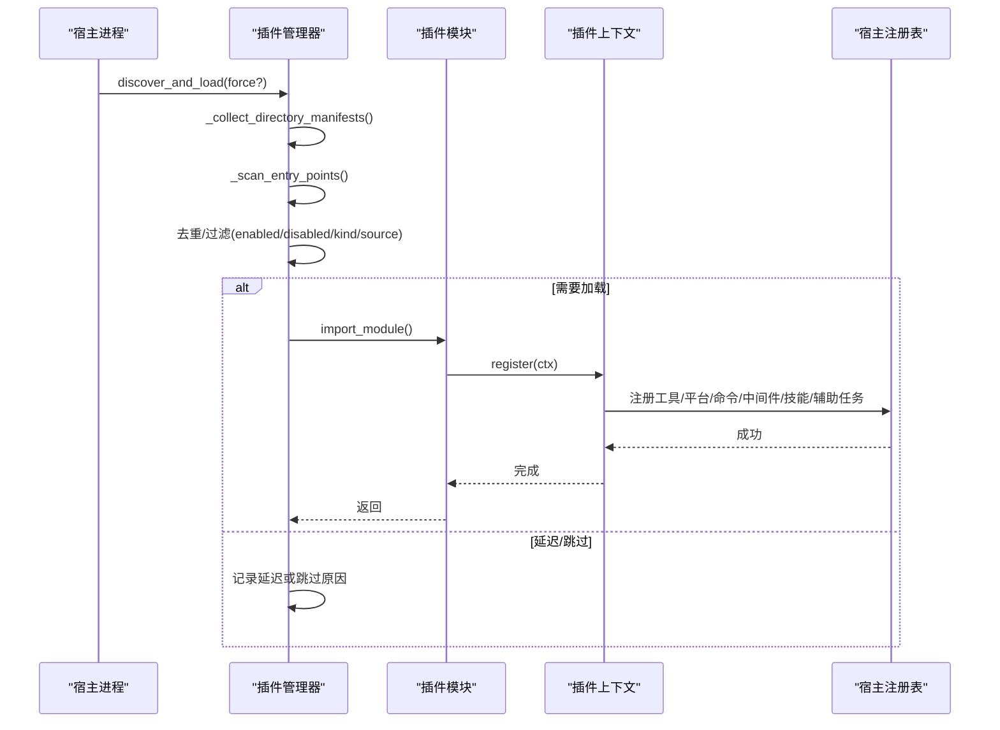
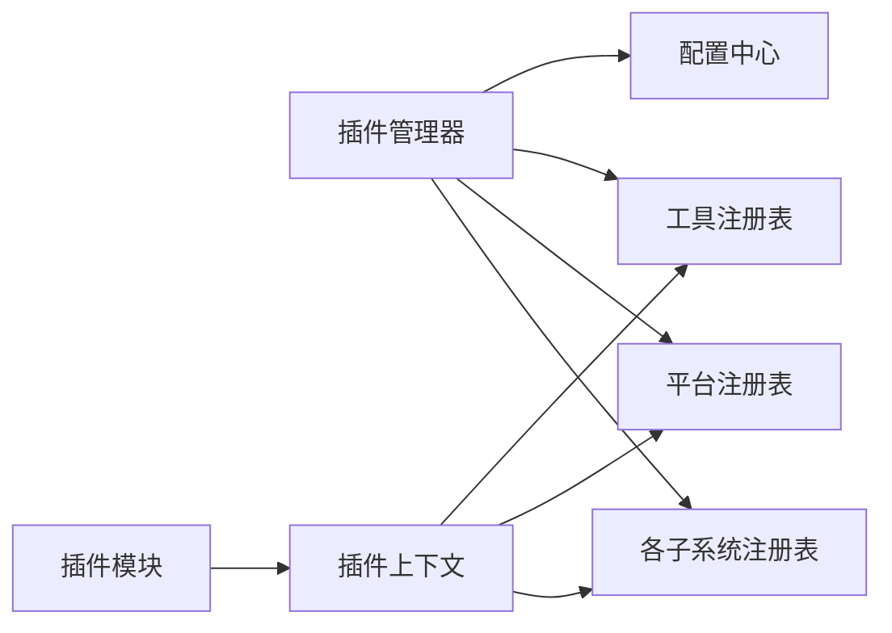
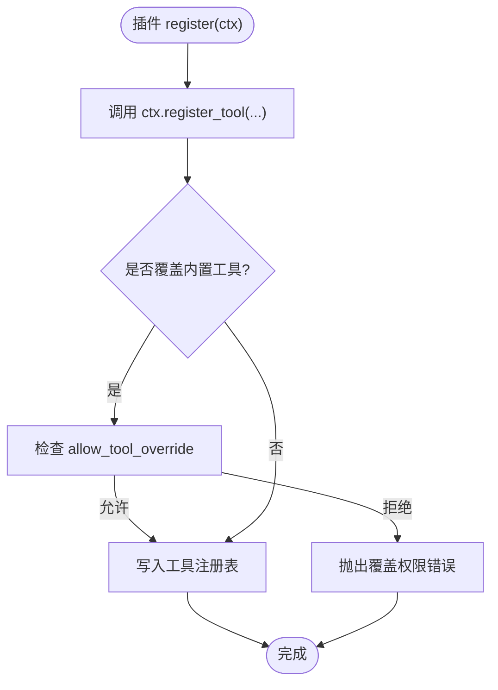

# 插件扩展模式

<cite>
**本文引用的文件**
- [hermes_cli/plugins.py](file://hermes_cli/plugins.py)
- [plugins/plugin_utils.py](file://plugins/plugin_utils.py)
- [tests/gateway/test_adapter_connect_is_reconnect_contract.py](file://tests/gateway/test_adapter_connect_is_reconnect_contract.py)
</cite>

## 目录
1. [简介](#简介)
2. [项目结构](#项目结构)
3. [核心组件](#核心组件)
4. [架构总览](#架构总览)
5. [详细组件分析](#详细组件分析)
6. [依赖关系分析](#依赖关系分析)
7. [性能考量](#性能考量)
8. [故障排查指南](#故障排查指南)
9. [结论](#结论)
10. [附录](#附录)

## 简介
本文件系统性阐述 Hermes Agent 的插件扩展模式，覆盖插件接口定义、发现与加载机制、生命周期钩子、配置管理、权限控制、版本兼容性处理，以及插件与核心系统的交互方式。文档同时提供开发指引与示例路径，帮助第三方开发者快速实现插件并融入生态。

## 项目结构
Hermes 的插件系统由 CLI 侧的统一管理器驱动，扫描多个来源（内置、用户、项目、入口点），解析清单并加载模块，暴露注册能力给插件在运行时扩展工具、平台适配器、中间件、命令等。

```mermaid
graph TB
A["CLI 启动"] --> B["插件管理器<br/>discover_and_load()"]
B --> C["收集清单<br/>_collect_directory_manifests()"]
C --> D["入口点清单<br/>_scan_entry_points()"]
B --> E["去重与策略<br/>enabled/disabled/kind/source"]
E --> F{"类型判断"}
F --> |backend(内置)| G["_load_plugin() 自动加载"]
F --> |platform(内置)| H["_register_deferred_platform() 延迟加载"]
F --> |exclusive/model-provider| I["交由类别/提供者子系统处理"]
F --> |standalone/用户/入口点| J{"是否启用?"}
J --> |是| K["_load_plugin()"]
J --> |否| L["记录为未启用"]
```

图表来源
- [hermes_cli/plugins.py:1341-1487](file://hermes_cli/plugins.py#L1341-L1487)
- [hermes_cli/plugins.py:1496-1545](file://hermes_cli/plugins.py#L1496-L1545)

章节来源
- [hermes_cli/plugins.py:1-32](file://hermes_cli/plugins.py#L1-L32)
- [hermes_cli/plugins.py:1341-1487](file://hermes_cli/plugins.py#L1341-L1487)
- [hermes_cli/plugins.py:1496-1545](file://hermes_cli/plugins.py#L1496-L1545)

## 核心组件
- 插件清单与运行态
  - PluginManifest：描述插件元数据（名称、版本、来源、种类、键、可移植性等）。
  - LoadedPlugin：记录已加载插件的运行态（模块句柄、已注册项、错误信息、是否延迟等）。
- 插件上下文
  - PluginContext：注入到每个插件的 register(ctx) 中，提供工具、平台、命令、中间件、辅助任务、技能等注册能力，以及受控访问宿主 LLM、子代理生命周期等。
- 插件管理器
  - PluginManager：统一发现、加载、调度；维护钩子、中间件、工具名、平台名、命令、技能、辅助任务等全局注册表。

章节来源
- [hermes_cli/plugins.py:307-362](file://hermes_cli/plugins.py#L307-L362)
- [hermes_cli/plugins.py:368-1303](file://hermes_cli/plugins.py#L368-L1303)
- [hermes_cli/plugins.py:1309-1336](file://hermes_cli/plugins.py#L1309-L1336)

## 架构总览
插件系统采用“清单驱动 + 集中式管理器”的架构。管理器按优先级扫描多来源，解析清单后根据插件种类和来源决定加载策略（立即加载、延迟加载、跳过交由其他子系统）。插件通过 PluginContext 向宿主注册扩展点，宿主负责校验、登记与调用。



图表来源
- [hermes_cli/plugins.py:1341-1487](file://hermes_cli/plugins.py#L1341-L1487)
- [hermes_cli/plugins.py:368-1303](file://hermes_cli/plugins.py#L368-L1303)

## 详细组件分析

### 插件清单与加载策略
- 清单字段
  - name/version/description/author/requires_env/provides_tools/provides_hooks/source/path/kind/key/portable/skill_namespace。
- 加载策略
  - 内置 backend：自动加载。
  - 内置 platform：延迟加载（首次使用时导入重型 SDK）。
  - exclusive/model-provider：交由类别/提供者子系统处理。
  - standalone/用户/入口点：需显式启用（plugins.enabled）才加载。
- 冲突与优先级
  - 以 key 或 name 去重，后者优先覆盖前者；disabled 始终优先于 enabled。

章节来源
- [hermes_cli/plugins.py:307-343](file://hermes_cli/plugins.py#L307-L343)
- [hermes_cli/plugins.py:1391-1487](file://hermes_cli/plugins.py#L1391-L1487)

### 插件上下文与扩展点
- 工具注册
  - ctx.register_tool(...)：支持覆盖内置工具的白名单控制（allow_tool_override）。
- 平台适配器注册
  - ctx.register_platform(...)：注册网关平台适配器工厂、依赖检查函数、配置校验、环境变量提示等。
- 命令注册
  - ctx.register_cli_command(...)：注册 CLI 子命令。
  - ctx.register_command(...)：注册会话内斜杠命令。
- 中间件与钩子
  - ctx.register_middleware(kind, callback)：行为改写中间件。
  - ctx.register_hook(hook_name, callback)：生命周期钩子回调。
- 其他扩展
  - 上下文引擎、图像/视频生成、TTS/STT、Web 搜索/提取、浏览器后端、密钥源、Slack Action Handler、辅助任务、技能等。

章节来源
- [hermes_cli/plugins.py:439-1303](file://hermes_cli/plugins.py#L439-L1303)

### 生命周期钩子
- 预/后置工具调用、终端输出转换、工具结果转换、LLM 输出/请求前后、验证前、API 请求前后、会话开始/结束/最终化/重置、技能生命周期、子代理启停、网关前置分发、审批前后、看板任务状态变更等。
- 未知钩子名会告警但保留，保证向前兼容。

章节来源
- [hermes_cli/plugins.py:136-219](file://hermes_cli/plugins.py#L136-L219)
- [hermes_cli/plugins.py:1214-1229](file://hermes_cli/plugins.py#L1214-L1229)

### 配置管理与权限控制
- 启用/禁用列表
  - plugins.enabled：白名单（默认空表示无插件启用）。
  - plugins.disabled：黑名单（始终优先）。
- 条目级权限
  - plugins.entries.<plugin_id>.allow_tool_override：允许覆盖内置工具。
  - 插件对宿主 LLM 的访问受 entries.<plugin_id>.llm.* 配置门控。
- 安全默认
  - 无法读取配置时，覆盖能力默认关闭（fail-closed）。

章节来源
- [hermes_cli/plugins.py:231-274](file://hermes_cli/plugins.py#L231-L274)
- [hermes_cli/plugins.py:498-520](file://hermes_cli/plugins.py#L498-L520)

### 版本与兼容性
- 清单中的 version 字段用于标识插件版本。
- 钩子集合 VALID_HOOKS 作为契约；新增钩子保持向后兼容（未知钩子仅告警）。
- 平台适配器连接契约：connect() 必须接受 is_reconnect 关键字参数，测试通过 AST 静态检查所有平台适配器。

章节来源
- [hermes_cli/plugins.py:136-219](file://hermes_cli/plugins.py#L136-L219)
- [tests/gateway/test_adapter_connect_is_reconnect_contract.py:1-145](file://tests/gateway/test_adapter_connect_is_reconnect_contract.py#L1-L145)

### 并发与资源管理
- 提供线程安全的懒加载单例工具，避免多线程下重复初始化导致的资源泄漏。
  - lazy_singleton：零参工厂装饰器。
  - SingletonSlot：带参数的懒槽位。

章节来源
- [plugins/plugin_utils.py:1-136](file://plugins/plugin_utils.py#L1-L136)

## 依赖关系分析
- 插件管理器依赖
  - 配置读取（enabled/disabled/entries）、日志、工具注册表、平台注册表、各子系统注册表（TTS/STT/Web/Browser/Image/Video/Secrets 等）。
- 插件模块依赖
  - 通过 PluginContext 间接依赖宿主能力，不直接耦合内部实现。
- 外部约束
  - 平台适配器 connect() 签名契约由测试保障。



图表来源
- [hermes_cli/plugins.py:1309-1336](file://hermes_cli/plugins.py#L1309-L1336)
- [hermes_cli/plugins.py:368-1303](file://hermes_cli/plugins.py#L368-L1303)

章节来源
- [hermes_cli/plugins.py:1309-1336](file://hermes_cli/plugins.py#L1309-L1336)
- [hermes_cli/plugins.py:368-1303](file://hermes_cli/plugins.py#L368-L1303)

## 性能考量
- 延迟加载平台适配器：避免启动时导入重型 SDK，减少冷启动时间。
- 懒加载单例：避免重复创建昂贵对象，降低内存与连接开销。
- 只读清单扫描：在不加载模块的情况下进行探测（如 MCP 可用性），缩短启动路径。

章节来源
- [hermes_cli/plugins.py:1453-1466](file://hermes_cli/plugins.py#L1453-L1466)
- [plugins/plugin_utils.py:43-81](file://plugins/plugin_utils.py#L43-L81)
- [plugins/plugin_utils.py:84-136](file://plugins/plugin_utils.py#L84-L136)

## 故障排查指南
- 插件未生效
  - 检查是否在 plugins.enabled 中启用，或被 plugins.disabled 禁用。
  - 查看插件错误信息（LoadedPlugin.error）与日志。
- 工具覆盖失败
  - 确认 allow_tool_override 已开启；非内置插件默认不允许覆盖。
- 平台适配器连接异常
  - 确保 connect() 接受 is_reconnect 关键字参数；否则网关重连时会抛出签名错误。
- 钩子未触发
  - 核对钩子名是否在 VALID_HOOKS 中；未知钩子仅告警不会报错。

章节来源
- [hermes_cli/plugins.py:1391-1487](file://hermes_cli/plugins.py#L1391-L1487)
- [hermes_cli/plugins.py:498-520](file://hermes_cli/plugins.py#L498-L520)
- [tests/gateway/test_adapter_connect_is_reconnect_contract.py:1-145](file://tests/gateway/test_adapter_connect_is_reconnect_contract.py#L1-L145)
- [hermes_cli/plugins.py:1214-1229](file://hermes_cli/plugins.py#L1214-L1229)

## 结论
Hermes 的插件系统通过统一的清单与管理器，实现了可扩展、可配置、可治理的扩展机制。它既保证了核心稳定性（严格契约、权限门控、延迟加载），又提供了丰富的扩展点（工具、平台、命令、中间件、钩子、技能、辅助任务等），便于构建多样化的生态。

## 附录

### 插件开发流程（步骤与参考路径）
- 准备清单与入口
  - 在插件目录放置 plugin.yaml 与 __init__.py，并在 __init__.py 中实现 register(ctx)。
  - 参考路径：[hermes_cli/plugins.py:1-32](file://hermes_cli/plugins.py#L1-L32)
- 注册工具
  - 使用 ctx.register_tool(...) 注册新工具或替换内置工具（需授权）。
  - 参考路径：[hermes_cli/plugins.py:439-495](file://hermes_cli/plugins.py#L439-L495)
- 注册平台适配器
  - 使用 ctx.register_platform(...) 注册网关平台适配器工厂与依赖检查。
  - 参考路径：[hermes_cli/plugins.py:979-1039](file://hermes_cli/plugins.py#L979-L1039)
- 注册命令与中间件
  - 使用 ctx.register_cli_command(...) 与 ctx.register_command(...) 注册命令。
  - 使用 ctx.register_middleware(...) 注册中间件。
  - 参考路径：[hermes_cli/plugins.py:552-629](file://hermes_cli/plugins.py#L552-L629)、[hermes_cli/plugins.py:1233-1250](file://hermes_cli/plugins.py#L1233-L1250)
- 注册钩子
  - 使用 ctx.register_hook(...) 注册生命周期钩子。
  - 参考路径：[hermes_cli/plugins.py:1214-1229](file://hermes_cli/plugins.py#L1214-L1229)
- 事件处理
  - 在钩子回调中实现事件处理逻辑（如 pre_tool_call、post_llm_call 等）。
  - 参考路径：[hermes_cli/plugins.py:136-219](file://hermes_cli/plugins.py#L136-L219)
- 并发与资源
  - 使用 lazy_singleton 或 SingletonSlot 管理共享资源。
  - 参考路径：[plugins/plugin_utils.py:43-136](file://plugins/plugin_utils.py#L43-L136)

### 关键流程图（工具注册）


图表来源
- [hermes_cli/plugins.py:439-495](file://hermes_cli/plugins.py#L439-L495)
- [hermes_cli/plugins.py:498-520](file://hermes_cli/plugins.py#L498-L520)