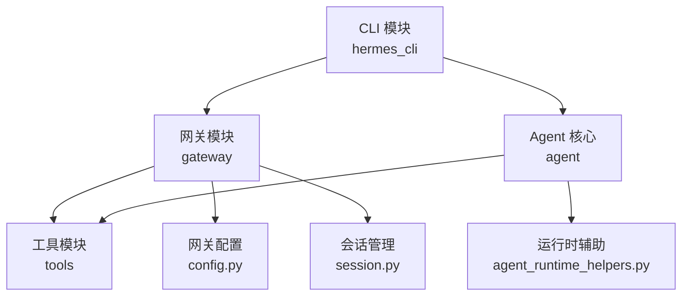
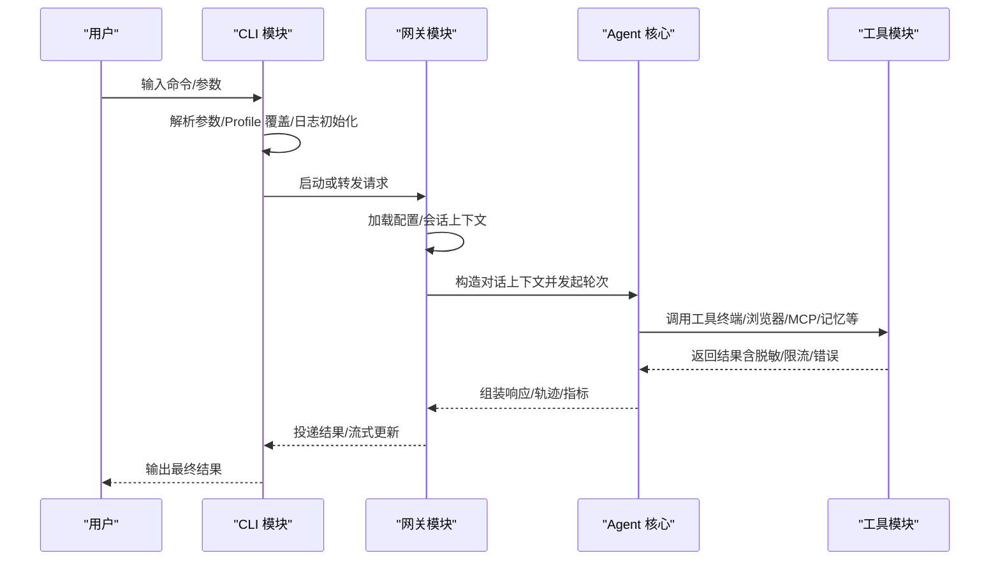
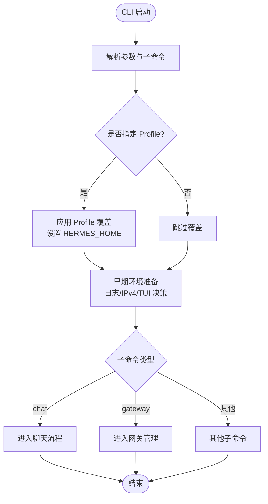
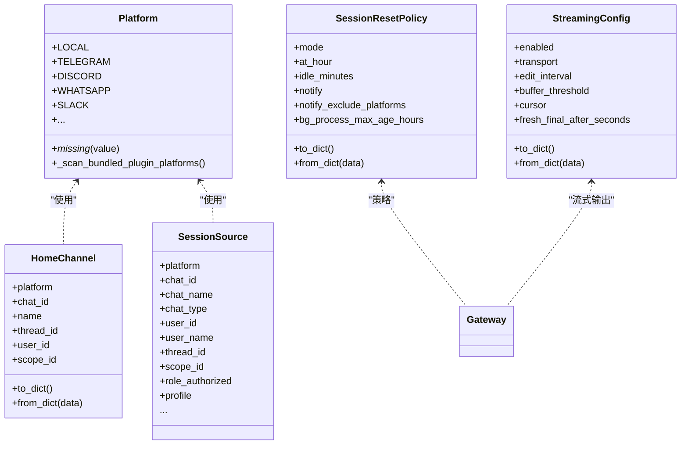
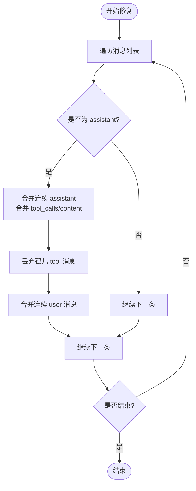
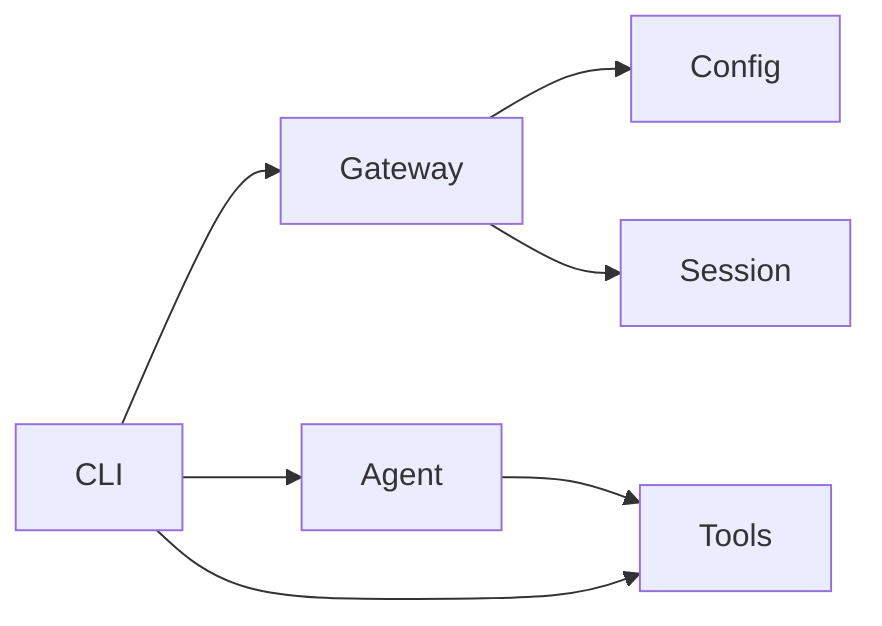

# 模块化架构模式

<cite>
**本文引用的文件**
- [hermes_cli/main.py](file://hermes_cli/main.py)
- [hermes_cli/_parser.py](file://hermes_cli/_parser.py)
- [hermes_cli/subcommands/gateway.py](file://hermes_cli/subcommands/gateway.py)
- [gateway/__init__.py](file://gateway/__init__.py)
- [gateway/config.py](file://gateway/config.py)
- [gateway/session.py](file://gateway/session.py)
- [agent/__init__.py](file://agent/__init__.py)
- [agent/agent_runtime_helpers.py](file://agent/agent_runtime_helpers.py)
- [tools/__init__.py](file://tools/__init__.py)
</cite>

## 目录
1. [简介](#简介)
2. [项目结构](#项目结构)
3. [核心组件](#核心组件)
4. [架构总览](#架构总览)
5. [详细组件分析](#详细组件分析)
6. [依赖关系分析](#依赖关系分析)
7. [性能考量](#性能考量)
8. [故障排查指南](#故障排查指南)
9. [结论](#结论)
10. [附录](#附录)

## 简介
本文件聚焦 Hermes Agent 的模块化架构模式，系统阐述 CLI 模块、Agent 核心模块、网关模块与工具模块的职责划分、接口契约、通信机制、数据传递方式与错误传播策略。通过代码级图示与路径引用，说明如何通过清晰的模块边界、可插拔的适配器与配置驱动设计，提升可维护性、可测试性与可扩展性。

## 项目结构
Hermes Agent 采用“入口-编排-能力”的分层模块化组织：
- CLI 层（hermes_cli）：负责命令行解析、子命令注册、启动引导、参数注入与进程管理。
- 网关层（gateway）：负责多平台消息接入、会话上下文、路由与投递、配置与策略。
- Agent 核心（agent）：负责对话循环、消息修复、轨迹导出、运行时辅助等纯逻辑与状态处理。
- 工具层（tools）：提供终端、浏览器、MCP、记忆等可复用能力，按需懒加载以避免启动开销。

**图表来源**
- [hermes_cli/main.py:439-485](file://hermes_cli/main.py#L439-L485)
- [gateway/__init__.py:12-35](file://gateway/__init__.py#L12-L35)
- [agent/__init__.py:1-9](file://agent/__init__.py#L1-L9)
- [tools/__init__.py:1-26](file://tools/__init__.py#L1-L26)

**章节来源**
- [hermes_cli/main.py:439-485](file://hermes_cli/main.py#L439-L485)
- [gateway/__init__.py:12-35](file://gateway/__init__.py#L12-L35)
- [agent/__init__.py:1-9](file://agent/__init__.py#L1-L9)
- [tools/__init__.py:1-26](file://tools/__init__.py#L1-L26)

## 核心组件
- CLI 模块
  - 职责：统一入口、参数解析、子命令装配、环境准备（日志、IPv4 偏好、TUI/CLI 选择）、一次性任务安全退出。
  - 关键实现：顶层 parser 构建、子命令注册、profile 覆盖、早期恢复与快速版本路径。
- 网关模块
  - 职责：平台适配、会话上下文、投递路由、配置加载与校验、流式输出策略。
  - 关键实现：Platform 枚举、HomeChannel/SessionResetPolicy/StreamingConfig 等数据模型、配置归一化与强制约束。
- Agent 核心
  - 职责：消息序列修复、轨迹格式转换、运行时辅助（重试、缓存、诊断）。
  - 关键实现：repair_message_sequence、convert_to_trajectory_format、note_turn_start/persisted 等。
- 工具模块
  - 职责：终端执行、浏览器控制、MCP 集成、记忆等能力；强调懒加载与最小副作用。
  - 关键实现：包命名空间暴露最小接口，具体工具按需导入。

**章节来源**
- [hermes_cli/main.py:46-102](file://hermes_cli/main.py#L46-L102)
- [hermes_cli/_parser.py:87-504](file://hermes_cli/_parser.py#L87-L504)
- [gateway/config.py:272-418](file://gateway/config.py#L272-L418)
- [gateway/config.py:420-800](file://gateway/config.py#L420-L800)
- [agent/agent_runtime_helpers.py:116-284](file://agent/agent_runtime_helpers.py#L116-L284)
- [agent/agent_runtime_helpers.py:550-767](file://agent/agent_runtime_helpers.py#L550-L767)
- [tools/__init__.py:1-26](file://tools/__init__.py#L1-L26)

## 架构总览
下图展示从 CLI 到网关、再到 Agent 与工具的调用链路与数据流向。CLI 负责解析与调度，网关负责平台接入与会话路由，Agent 负责对话与工具编排，工具提供具体能力。

**图表来源**
- [hermes_cli/main.py:439-485](file://hermes_cli/main.py#L439-L485)
- [gateway/config.py:272-418](file://gateway/config.py#L272-L418)
- [gateway/session.py:148-200](file://gateway/session.py#L148-L200)
- [agent/agent_runtime_helpers.py:116-284](file://agent/agent_runtime_helpers.py#L116-L284)
- [tools/__init__.py:1-26](file://tools/__init__.py#L1-L26)

## 详细组件分析

### CLI 模块：命令解析与启动编排
- 子命令装配：将 chat、gateway、proxy、model、sessions、cron 等子命令注册到主解析器，并通过 set_defaults 绑定处理器，避免在 main 中硬编码逻辑。
- Profile 与环境：在 argparse 之前完成 --profile/-p 的预解析与 HERMES_HOME 设置，确保后续模块按正确 profile 运行。
- 快速路径与健壮性：早期 TUI/CLI 决策、鼠标残留抑制、IPv4 偏好、一次性任务安全退出与资源清理。

**图表来源**
- [hermes_cli/_parser.py:87-504](file://hermes_cli/_parser.py#L87-L504)
- [hermes_cli/main.py:519-693](file://hermes_cli/main.py#L519-L693)
- [hermes_cli/main.py:746-773](file://hermes_cli/main.py#L746-L773)

**章节来源**
- [hermes_cli/_parser.py:87-504](file://hermes_cli/_parser.py#L87-L504)
- [hermes_cli/main.py:519-693](file://hermes_cli/main.py#L519-L693)
- [hermes_cli/main.py:746-773](file://hermes_cli/main.py#L746-L773)

### 网关模块：配置、会话与投递
- 配置管理：Platform 枚举支持内置与插件平台动态成员；HomeChannel、SessionResetPolicy、StreamingConfig 等 dataclass 提供强类型配置与序列化。
- 会话管理：SessionSource 描述消息来源，包含平台、聊天/线程标识、角色授权、作用域隔离等；提供自动续期新鲜度窗口与路径安全校验。
- 投递路由：DeliveryRouter/DeliveryTarget 抽象跨平台投递目标，结合 home channel 与渠道覆盖实现灵活分发。

**图表来源**
- [gateway/config.py:272-418](file://gateway/config.py#L272-L418)
- [gateway/config.py:420-800](file://gateway/config.py#L420-L800)
- [gateway/session.py:148-200](file://gateway/session.py#L148-L200)

**章节来源**
- [gateway/__init__.py:12-35](file://gateway/__init__.py#L12-L35)
- [gateway/config.py:272-418](file://gateway/config.py#L272-L418)
- [gateway/config.py:420-800](file://gateway/config.py#L420-L800)
- [gateway/session.py:148-200](file://gateway/session.py#L148-L200)

### Agent 核心：消息修复与轨迹导出
- 消息修复：repair_message_sequence 保证 provider 期望的消息交替顺序，合并连续 assistant/user，丢弃孤儿 tool 消息，修正重复 tool_call_id。
- 轨迹导出：convert_to_trajectory_format 将内部消息转换为训练/回放友好的轨迹格式，保留推理块与工具调用标记。
- 运行时辅助：note_turn_start/note_turn_persisted 检测并发轮次风险；sanitize_tool_call_arguments 修复损坏的工具调用参数。

**图表来源**
- [agent/agent_runtime_helpers.py:550-767](file://agent/agent_runtime_helpers.py#L550-L767)

**章节来源**
- [agent/agent_runtime_helpers.py:116-284](file://agent/agent_runtime_helpers.py#L116-L284)
- [agent/agent_runtime_helpers.py:550-767](file://agent/agent_runtime_helpers.py#L550-L767)

### 工具模块：懒加载与最小副作用
- 包命名空间仅暴露必要接口，避免导入时触发重型依赖。
- 具体工具（终端、浏览器、MCP、记忆等）由上层按需导入，降低启动成本与耦合。

**章节来源**
- [tools/__init__.py:1-26](file://tools/__init__.py#L1-L26)

## 依赖关系分析
- CLI 对网关与 Agent 的依赖通过子命令与函数指针解耦，避免在入口处直接引入全部子系统。
- 网关对配置与会话模块强内聚，对外暴露统一接口（GatewayConfig、SessionContext、DeliveryRouter）。
- Agent 核心对工具模块弱依赖，通过运行时辅助与工具分发间接调用，保持核心逻辑稳定。
- 工具模块被 CLI/Gateway/Agent 共同复用，但通过懒加载减少冷启动影响。

**图表来源**
- [hermes_cli/main.py:439-485](file://hermes_cli/main.py#L439-L485)
- [gateway/__init__.py:12-35](file://gateway/__init__.py#L12-L35)
- [tools/__init__.py:1-26](file://tools/__init__.py#L1-L26)

**章节来源**
- [hermes_cli/main.py:439-485](file://hermes_cli/main.py#L439-L485)
- [gateway/__init__.py:12-35](file://gateway/__init__.py#L12-L35)
- [tools/__init__.py:1-26](file://tools/__init__.py#L1-L26)

## 性能考量
- 启动优化：CLI 提供超快版本路径、早期 TUI/CLI 决策、单读 config.yaml 缓存、IPv4 偏好早置入，减少无关导入与 I/O。
- 懒加载：工具模块与部分平台 SDK 按需导入，避免全局冷启动开销。
- 流式输出：网关支持 draft/edit 两种传输模式，默认 auto 以平衡体验与兼容性。
- 会话新鲜度：auto_continue_freshness_window 限制自动续期范围，避免僵尸会话占用资源。

[本节为通用指导，不直接分析具体文件]

## 故障排查指南
- 并发轮次风险：使用 note_turn_start/note_turn_persisted 检测同一 session 上的并发 turn，防止持久化交错导致转录损坏。
- 消息序列异常：repair_message_sequence 会合并/丢弃异常消息并记录修复次数，便于定位上游问题。
- 工具调用参数损坏：sanitize_tool_call_arguments 修复无效 JSON 并插入占位结果，同时记录原始片段用于排障。
- 平台适配器重连契约：所有平台 adapter.connect 必须接受 is_reconnect 关键字，否则重连失败会导致通道静默断开。

**章节来源**
- [agent/agent_runtime_helpers.py:447-548](file://agent/agent_runtime_helpers.py#L447-L548)
- [agent/agent_runtime_helpers.py:550-767](file://agent/agent_runtime_helpers.py#L550-L767)
- [tests/gateway/test_adapter_connect_is_reconnect_contract.py:1-145](file://tests/gateway/test_adapter_connect_is_reconnect_contract.py#L1-L145)

## 结论
Hermes Agent 通过清晰的模块边界与接口契约实现了高内聚、低耦合的架构：CLI 专注入口与编排，网关负责平台接入与会话路由，Agent 核心保障对话一致性与可观测性，工具模块提供可插拔能力。配合懒加载、配置驱动与严格的错误传播策略，系统在可维护性、可测试性与可扩展性方面具备良好基础。

[本节为总结，不直接分析具体文件]

## 附录
- 示例路径（用于定位实现细节，非代码内容）
  - CLI 子命令装配：[hermes_cli/_parser.py:87-504](file://hermes_cli/_parser.py#L87-L504)
  - CLI 入口与快速路径：[hermes_cli/main.py:46-102](file://hermes_cli/main.py#L46-L102)
  - 网关配置与数据模型：[gateway/config.py:272-800](file://gateway/config.py#L272-L800)
  - 网关会话上下文：[gateway/session.py:148-200](file://gateway/session.py#L148-L200)
  - Agent 消息修复与轨迹：[agent/agent_runtime_helpers.py:116-284](file://agent/agent_runtime_helpers.py#L116-L284), [agent/agent_runtime_helpers.py:550-767](file://agent/agent_runtime_helpers.py#L550-L767)
  - 工具模块懒加载：[tools/__init__.py:1-26](file://tools/__init__.py#L1-L26)

[本节为参考索引，不直接分析具体文件]