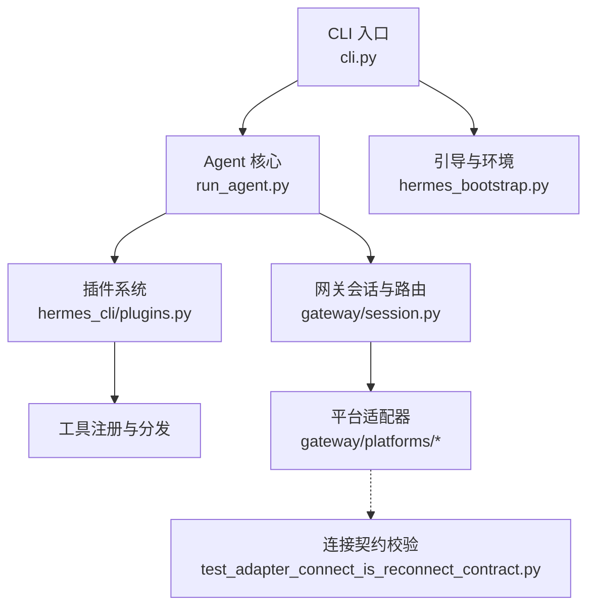
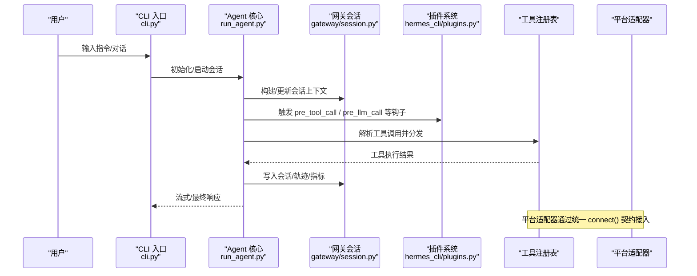
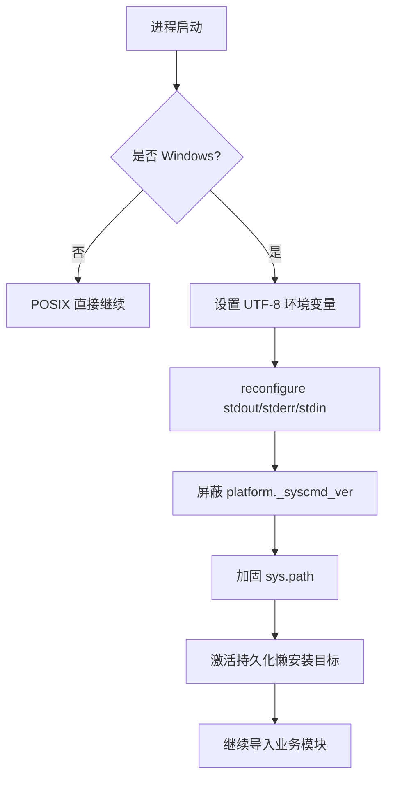
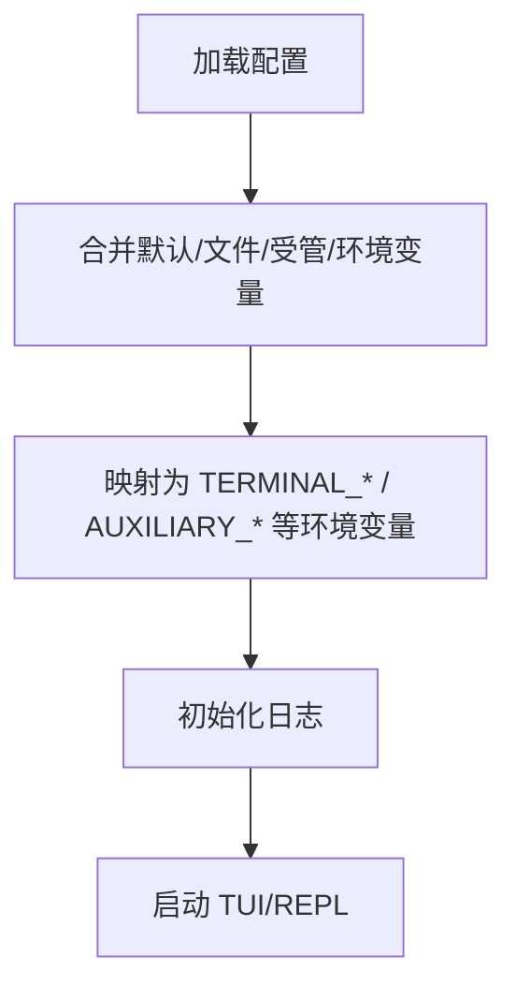
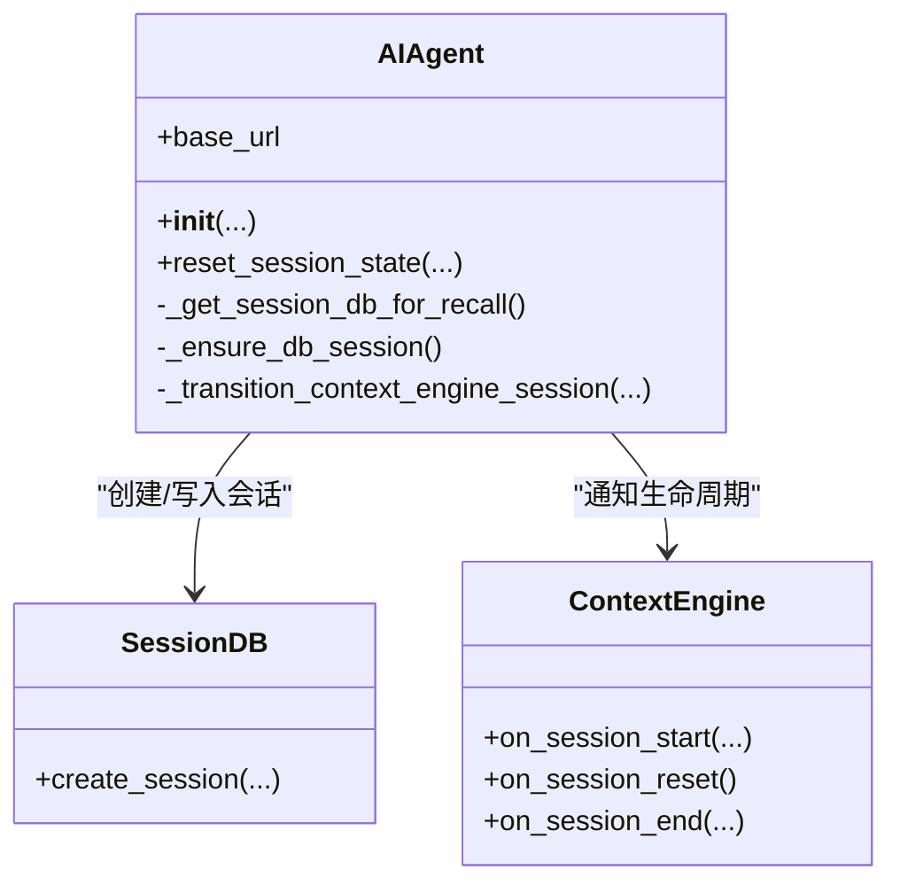
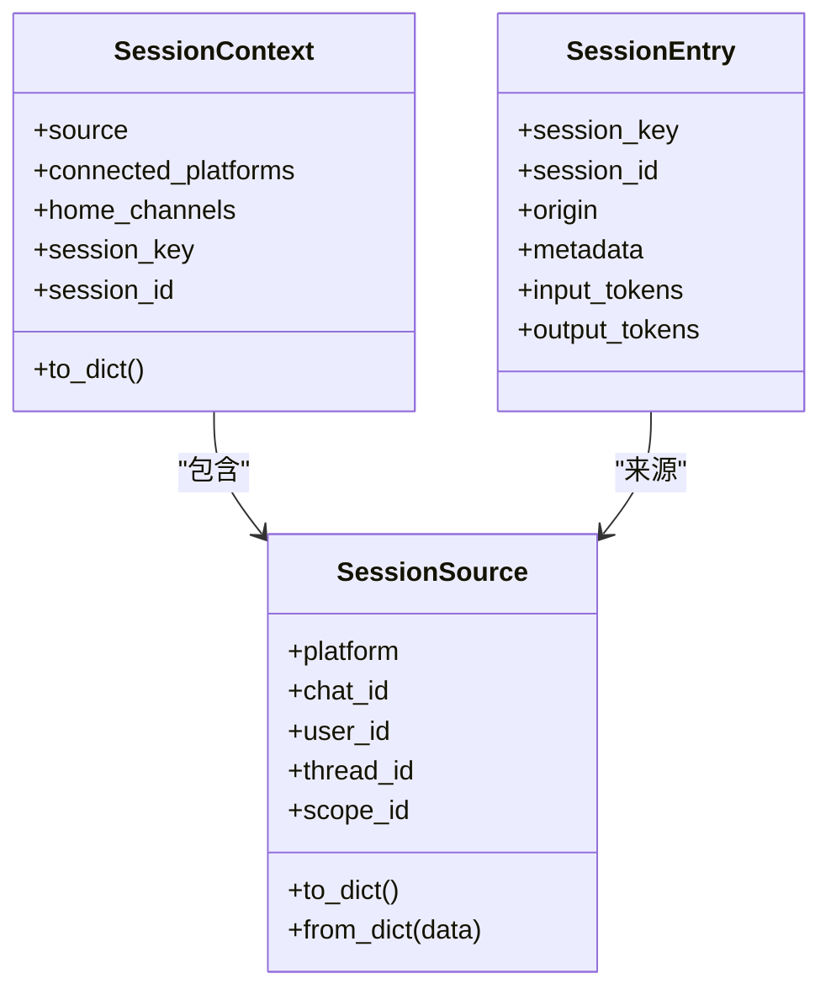
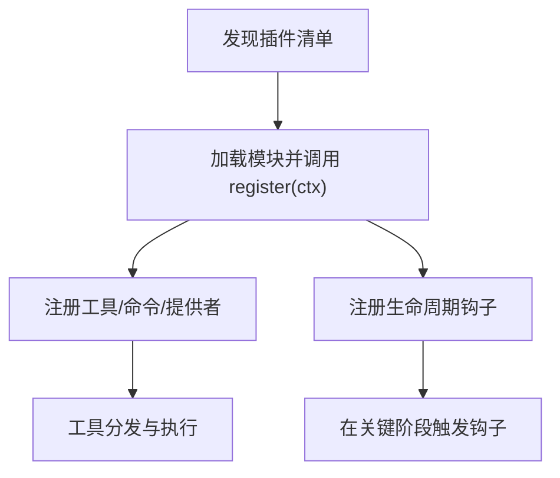
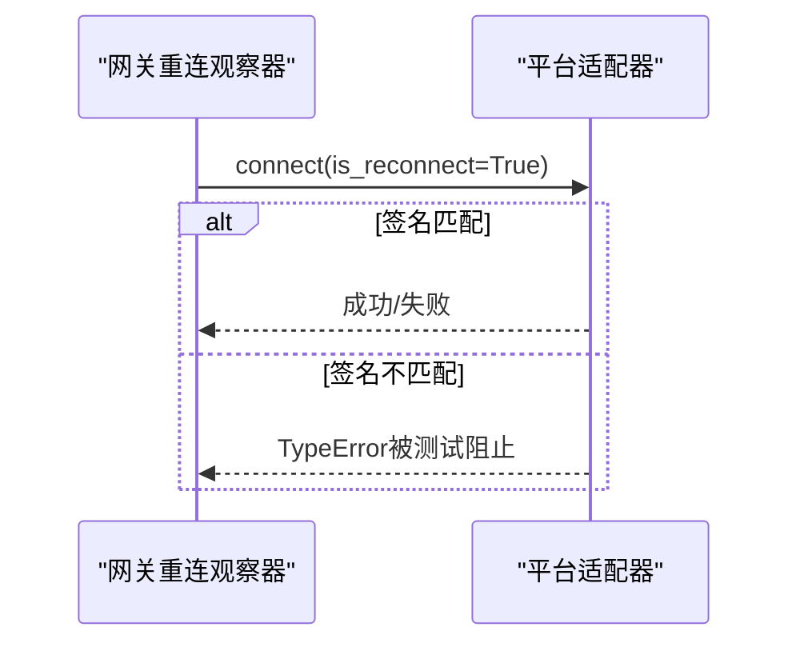
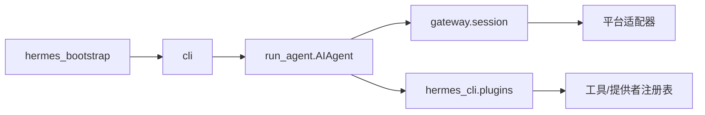

# 系统设计模式

<cite>
**本文引用的文件**
- [hermes_bootstrap.py](file://hermes_bootstrap.py)
- [cli.py](file://cli.py)
- [run_agent.py](file://run_agent.py)
- [gateway/session.py](file://gateway/session.py)
- [hermes_cli/plugins.py](file://hermes_cli/plugins.py)
- [tests/gateway/test_adapter_connect_is_reconnect_contract.py](file://tests/gateway/test_adapter_connect_is_reconnect_contract.py)
</cite>

## 目录
1. [简介](#简介)
2. [项目结构](#项目结构)
3. [核心组件](#核心组件)
4. [架构总览](#架构总览)
5. [详细组件分析](#详细组件分析)
6. [依赖关系分析](#依赖关系分析)
7. [性能考虑](#性能考虑)
8. [故障排查指南](#故障排查指南)
9. [结论](#结论)
10. [附录](#附录)

## 简介
本文件聚焦 Hermes Agent 的系统设计模式，围绕模块化架构、事件驱动、适配器模式、工厂/注册表模式等展开，结合 CLI 接口、Agent 核心、消息网关与工具系统的具体实现进行说明。文档同时覆盖异步处理与并发控制（任务调度、资源管理、错误处理策略），以及插件系统的扩展点、依赖注入机制与配置管理模式，并通过代码级图示帮助开发者理解设计思想与最佳实践。

## 项目结构
Hermes Agent 采用“入口-网关-代理-工具-插件”的分层组织：
- 入口与引导：hermes_bootstrap 负责跨平台启动环境初始化；cli.py 提供交互式 CLI；run_agent.py 承载 Agent 主循环与编排。
- 网关层：gateway/session.py 管理会话上下文、来源路由、动态系统提示注入与持久化元数据。
- 插件体系：hermes_cli/plugins.py 提供插件发现、加载、生命周期钩子、工具/命令/提供者注册能力。
- 测试契约：tests/gateway/test_adapter_connect_is_reconnect_contract.py 以静态 AST 校验所有平台适配器的 connect() 签名一致性，保障适配器模式的稳定契约。

**图表来源**
- [cli.py:15-32](file://cli.py#L15-L32)
- [hermes_bootstrap.py:59-122](file://hermes_bootstrap.py#L59-L122)
- [run_agent.py:412-596](file://run_agent.py#L412-L596)
- [gateway/session.py:148-346](file://gateway/session.py#L148-L346)
- [hermes_cli/plugins.py:136-219](file://hermes_cli/plugins.py#L136-L219)
- [tests/gateway/test_adapter_connect_is_reconnect_contract.py:35-58](file://tests/gateway/test_adapter_connect_is_reconnect_contract.py#L35-L58)

**章节来源**
- [cli.py:15-32](file://cli.py#L15-L32)
- [hermes_bootstrap.py:59-122](file://hermes_bootstrap.py#L59-L122)
- [run_agent.py:412-596](file://run_agent.py#L412-L596)
- [gateway/session.py:148-346](file://gateway/session.py#L148-L346)
- [hermes_cli/plugins.py:136-219](file://hermes_cli/plugins.py#L136-L219)
- [tests/gateway/test_adapter_connect_is_reconnect_contract.py:35-58](file://tests/gateway/test_adapter_connect_is_reconnect_contract.py#L35-L58)

## 核心组件
- 引导与环境初始化：在 Windows 上统一 UTF-8 编码、抑制平台版本查询的副作用、加固导入路径并激活持久化懒安装目标，确保各入口进程一致且健壮。
- CLI 交互层：加载配置、环境变量桥接、日志初始化、TUI 输入与输出格式化，并将终端/浏览器等配置映射到运行期环境变量。
- Agent 核心：AIAgent 作为编排中心，封装会话创建、上下文转换、回调注入、工具调用循环、轨迹保存与失败恢复。
- 网关会话：SessionSource/SessionContext/SessionEntry 描述消息来源、平台能力、会话键与元数据，构建动态系统提示并支持 PII 脱敏。
- 插件系统：PluginManifest/LoadedPlugin/PluginContext 提供插件清单、运行时状态与注册门面，支持工具、CLI 命令、斜杠命令、上下文引擎、图像/视频生成、Web 搜索等提供者注册，以及丰富的生命周期钩子。

**章节来源**
- [hermes_bootstrap.py:59-122](file://hermes_bootstrap.py#L59-L122)
- [cli.py:409-793](file://cli.py#L409-L793)
- [run_agent.py:412-596](file://run_agent.py#L412-L596)
- [gateway/session.py:148-346](file://gateway/session.py#L148-L346)
- [hermes_cli/plugins.py:307-362](file://hermes_cli/plugins.py#L307-L362)
- [hermes_cli/plugins.py:368-800](file://hermes_cli/plugins.py#L368-L800)

## 架构总览
下图展示从用户输入到工具执行与结果回传的端到端流程，体现事件驱动与适配器/注册表模式的应用。

**图表来源**
- [cli.py:409-793](file://cli.py#L409-L793)
- [run_agent.py:412-596](file://run_agent.py#L412-L596)
- [gateway/session.py:479-745](file://gateway/session.py#L479-L745)
- [hermes_cli/plugins.py:136-219](file://hermes_cli/plugins.py#L136-L219)
- [tests/gateway/test_adapter_connect_is_reconnect_contract.py:84-103](file://tests/gateway/test_adapter_connect_is_reconnect_contract.py#L84-L103)

## 详细组件分析

### 引导与环境初始化（hermes_bootstrap）
- 设计要点
  - 幂等性：仅对 Windows 生效，避免重复重配置。
  - 安全与兼容：设置 PYTHONUTF8/PYTHONIOENCODING，reconfigure stdio，屏蔽 platform._syscmd_ver 导致的崩溃与窗口闪烁。
  - 可移植性：加固 sys.path，防止当前目录包遮蔽核心模块；激活持久化懒安装目标以支持不可变镜像。
- 适用模式
  - 工厂/前置装配：在进程入口处完成环境与依赖准备，保证后续模块稳定运行。
  - 防御式编程：捕获异常、降级处理，确保入口不崩溃。

**图表来源**
- [hermes_bootstrap.py:59-122](file://hermes_bootstrap.py#L59-L122)
- [hermes_bootstrap.py:125-165](file://hermes_bootstrap.py#L125-L165)
- [hermes_bootstrap.py:168-226](file://hermes_bootstrap.py#L168-L226)

**章节来源**
- [hermes_bootstrap.py:59-122](file://hermes_bootstrap.py#L59-L122)
- [hermes_bootstrap.py:125-165](file://hermes_bootstrap.py#L125-L165)
- [hermes_bootstrap.py:168-226](file://hermes_bootstrap.py#L168-L226)

### CLI 接口（cli.py）
- 设计要点
  - 配置加载与合并：用户配置、项目配置、受管范围叠加、环境变量桥接。
  - 运行时参数透传：将 terminal/browser/auxiliary/security/sessions 等配置映射为环境变量，供下游工具使用。
  - 日志与 TUI：早期初始化日志，使用 prompt_toolkit 构建交互界面。
- 适用模式
  - 配置工厂：集中组装默认值、文件与环境变量，形成单一可信源。
  - 适配器/桥接：将高层配置项转换为底层工具所需的环境变量。

**图表来源**
- [cli.py:409-793](file://cli.py#L409-L793)

**章节来源**
- [cli.py:409-793](file://cli.py#L409-L793)

### Agent 核心（run_agent.py）
- 设计要点
  - 会话生命周期：创建/重置/转场，通知上下文引擎，记录来源与模型配置。
  - 回调注入：工具进度、思考/推理、流式增量、中间助手消息、状态/通知等。
  - 工具循环与恢复：迭代预算、错误分类、轨迹保存、大输出落盘、临时脚手架标记。
- 适用模式
  - 事件驱动：通过回调与钩子解耦工具执行、LLM 调用与展示。
  - 工厂/委派：将具体 LLM 客户端、工具集、重试策略等委托给子模块。

**图表来源**
- [run_agent.py:412-596](file://run_agent.py#L412-L596)
- [run_agent.py:598-800](file://run_agent.py#L598-L800)

**章节来源**
- [run_agent.py:412-596](file://run_agent.py#L412-L596)
- [run_agent.py:598-800](file://run_agent.py#L598-L800)

### 网关会话与上下文（gateway/session.py）
- 设计要点
  - 来源建模：SessionSource 抽象平台、聊天、线程、角色授权、多租户 scope 等。
  - 上下文构建：SessionContext 聚合可用平台、Home Channel、共享会话标志，并生成动态系统提示。
  - 安全与隐私：PII 脱敏、不可信文本清洗、路径安全校验。
- 适用模式
  - 适配器模式：不同平台的消息来源被统一抽象为 SessionSource。
  - 模板/组合：按平台特性拼接系统提示片段，组合成完整上下文。

**图表来源**
- [gateway/session.py:148-346](file://gateway/session.py#L148-L346)
- [gateway/session.py:479-745](file://gateway/session.py#L479-L745)

**章节来源**
- [gateway/session.py:148-346](file://gateway/session.py#L148-L346)
- [gateway/session.py:479-745](file://gateway/session.py#L479-L745)

### 插件系统与扩展点（hermes_cli/plugins.py）
- 设计要点
  - 多源发现：内置、用户、项目、pip entry_points 四种来源，后者优先覆盖前者。
  - 生命周期钩子：pre/post tool call、pre/post llm call、pre_verify、pre/post api request、session 生命周期、kanban 任务、审批请求等。
  - 注册门面：PluginContext 暴露 register_tool/register_command/register_context_engine/register_*_provider 等方法，统一注册到全局注册表。
  - 信任门控：工具覆盖需显式允许，LLM/子代理生命周期访问受控。
- 适用模式
  - 观察者模式：通过钩子在关键阶段通知插件。
  - 注册表/工厂：工具、命令、提供者通过名称查找与实例化。
  - 依赖注入：向插件提供受限宿主能力（llm、subagent_lifecycle）。

**图表来源**
- [hermes_cli/plugins.py:136-219](file://hermes_cli/plugins.py#L136-L219)
- [hermes_cli/plugins.py:368-800](file://hermes_cli/plugins.py#L368-L800)

**章节来源**
- [hermes_cli/plugins.py:136-219](file://hermes_cli/plugins.py#L136-L219)
- [hermes_cli/plugins.py:368-800](file://hermes_cli/plugins.py#L368-L800)

### 适配器模式与连接契约（平台适配器）
- 设计要点
  - 统一 connect() 契约：所有平台适配器必须接受 is_reconnect 关键字参数，以便网关重连观察器在每次重试时传递该信号。
  - 静态契约校验：通过 AST 扫描所有 adapter.py 或 *_adapter.py，断言 connect() 签名满足要求，避免运行时崩溃导致平台静默断开。
- 适用模式
  - 适配器模式：屏蔽不同平台 SDK 的差异，对外暴露统一连接/重连接口。
  - 契约测试：以测试驱动的方式维护接口稳定性。

**图表来源**
- [tests/gateway/test_adapter_connect_is_reconnect_contract.py:84-103](file://tests/gateway/test_adapter_connect_is_reconnect_contract.py#L84-L103)
- [tests/gateway/test_adapter_connect_is_reconnect_contract.py:109-145](file://tests/gateway/test_adapter_connect_is_reconnect_contract.py#L109-L145)

**章节来源**
- [tests/gateway/test_adapter_connect_is_reconnect_contract.py:35-58](file://tests/gateway/test_adapter_connect_is_reconnect_contract.py#L35-L58)
- [tests/gateway/test_adapter_connect_is_reconnect_contract.py:84-103](file://tests/gateway/test_adapter_connect_is_reconnect_contract.py#L84-L103)
- [tests/gateway/test_adapter_connect_is_reconnect_contract.py:109-145](file://tests/gateway/test_adapter_connect_is_reconnect_contract.py#L109-L145)

## 依赖关系分析
- 低耦合高内聚：CLI 仅负责配置与交互，Agent 核心专注编排，网关负责会话与路由，插件系统提供扩展点，适配器屏蔽平台差异。
- 明确边界：引导模块在进程最前端执行，避免后续模块受环境影响；插件注册表集中管理工具与提供者，避免散点依赖。
- 外部依赖：OpenAI/第三方 SDK 延迟导入以减少冷启动开销；平台 SDK 通过适配器隔离。

**图表来源**
- [hermes_bootstrap.py:59-122](file://hermes_bootstrap.py#L59-L122)
- [cli.py:409-793](file://cli.py#L409-L793)
- [run_agent.py:412-596](file://run_agent.py#L412-L596)
- [gateway/session.py:148-346](file://gateway/session.py#L148-L346)
- [hermes_cli/plugins.py:368-800](file://hermes_cli/plugins.py#L368-L800)

**章节来源**
- [hermes_bootstrap.py:59-122](file://hermes_bootstrap.py#L59-L122)
- [cli.py:409-793](file://cli.py#L409-L793)
- [run_agent.py:412-596](file://run_agent.py#L412-L596)
- [gateway/session.py:148-346](file://gateway/session.py#L148-L346)
- [hermes_cli/plugins.py:368-800](file://hermes_cli/plugins.py#L368-L800)

## 性能考虑
- 延迟导入：OpenAI SDK 等重型依赖按需导入，减少冷启动时间。
- 会话与上下文：上下文压缩与转场仅在必要时触发，避免无谓重建。
- 工具并行与批处理：工具调用可根据路径重叠与破坏性判断进行并行化与批处理，提升吞吐。
- 资源限制：迭代预算、超时、最大工具调用次数等防止无限循环与资源耗尽。
- 日志与追踪：轨迹保存与遥测导出可选开启，生产环境按需启用以避免额外开销。

[本节为通用指导，无需特定文件引用]

## 故障排查指南
- 平台适配器重连失败
  - 现象：某平台消息中断，重启后仍无法恢复。
  - 原因：适配器 connect() 未接受 is_reconnect 关键字，导致重连调用抛出类型错误。
  - 解决：确保 connect(*, is_reconnect: bool = False) 签名符合契约；运行静态契约测试定位问题。
- 工具输出泄露敏感信息
  - 现象：终端工具返回中包含密钥片段。
  - 原因：异常堆栈或输出未脱敏。
  - 解决：使用统一的 redact 工具对输出与错误信息进行脱敏；参考相关测试用例验证。
- 会话上下文不一致
  - 现象：系统提示中显示的平台/用户信息与预期不符。
  - 原因：SessionSource/SessionContext 构建时未正确传入或 PII 脱敏策略误用。
  - 解决：检查会话创建与上下文构建路径，确认平台能力检测与脱敏开关。

**章节来源**
- [tests/gateway/test_adapter_connect_is_reconnect_contract.py:109-145](file://tests/gateway/test_adapter_connect_is_reconnect_contract.py#L109-L145)
- [tests/tools/test_terminal_error_redaction.py:1-154](file://tests/tools/test_terminal_error_redaction.py#L1-L154)
- [gateway/session.py:479-745](file://gateway/session.py#L479-L745)

## 结论
Hermes Agent 通过清晰的模块化分层、事件驱动的钩子系统、稳定的适配器契约与可扩展的插件注册表，实现了高内聚、低耦合、易扩展的架构。引导与环境初始化保障了跨平台一致性；CLI 与 Agent 核心专注于交互与编排；网关会话提供统一的消息来源与上下文；插件系统以钩子和注册表为核心，提供强大的扩展能力。配合严格的契约测试与完善的错误处理策略，系统在可靠性、可维护性与可扩展性方面具备良好基础。

[本节为总结，无需特定文件引用]

## 附录
- 关键模式速查
  - 模块化架构：入口/核心/网关/插件/工具分层清晰，职责单一。
  - 事件驱动：pre/post 钩子在工具调用、LLM 调用、API 请求、会话生命周期等关键点触发。
  - 适配器模式：平台适配器统一 connect() 契约，屏蔽差异。
  - 工厂/注册表：工具、命令、提供者通过名称注册与查找，支持覆盖与权限门控。
  - 依赖注入：插件通过 PluginContext 获取受限宿主能力（LLM、子代理生命周期）。
  - 配置管理：多层配置合并与环境变量桥接，单一可信源。
- 推荐实践
  - 新增平台：实现适配器并遵循 is_reconnect 契约，补充契约测试。
  - 新增工具：通过插件注册表注册，必要时添加 check_fn 与安全门控。
  - 新增钩子：在关键路径插入 pre/post 钩子，保持幂等与异常安全。
  - 配置变更：优先通过配置文件与环境变量桥接，避免硬编码。

[本节为补充说明，无需特定文件引用]