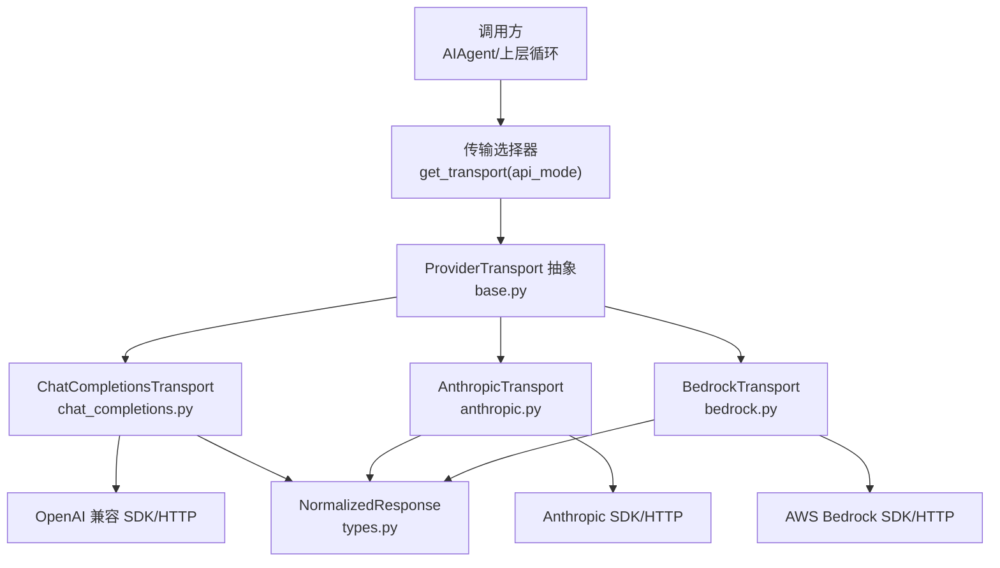
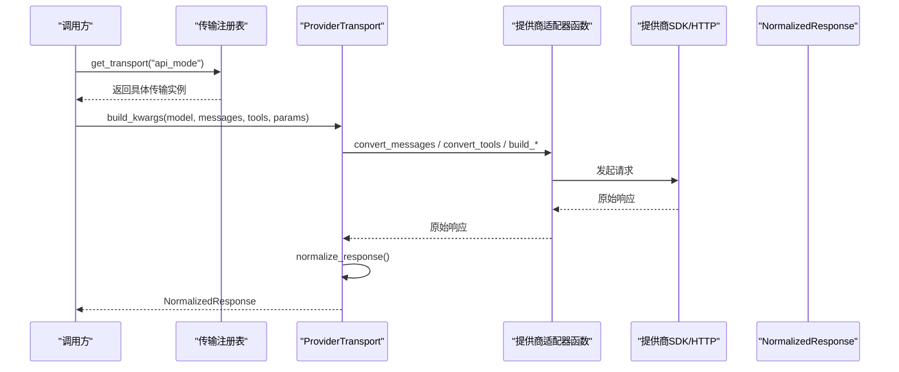
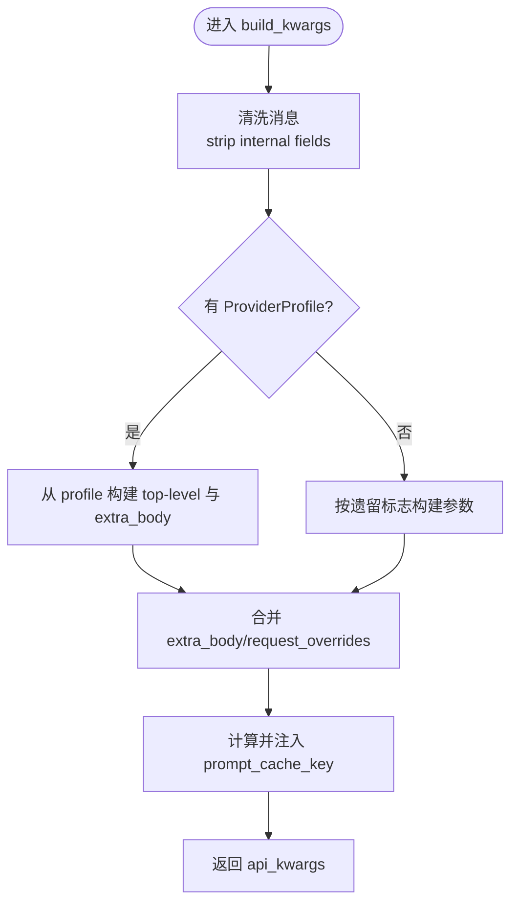
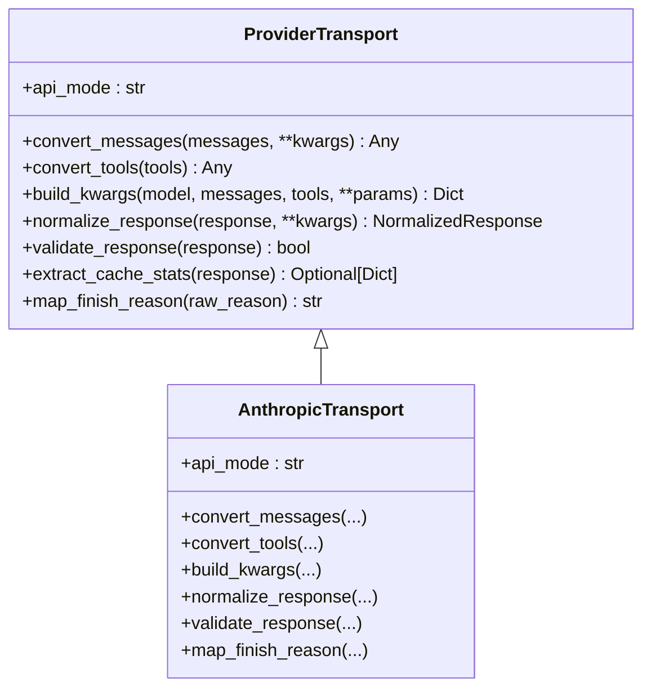
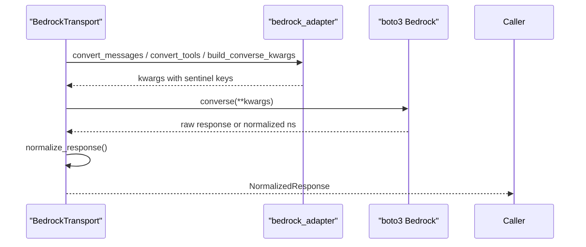
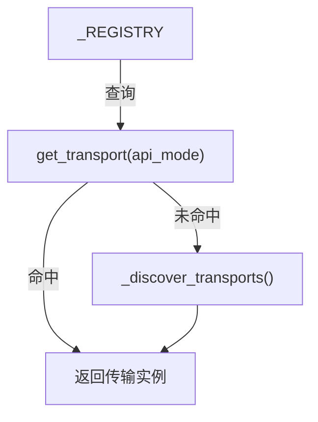
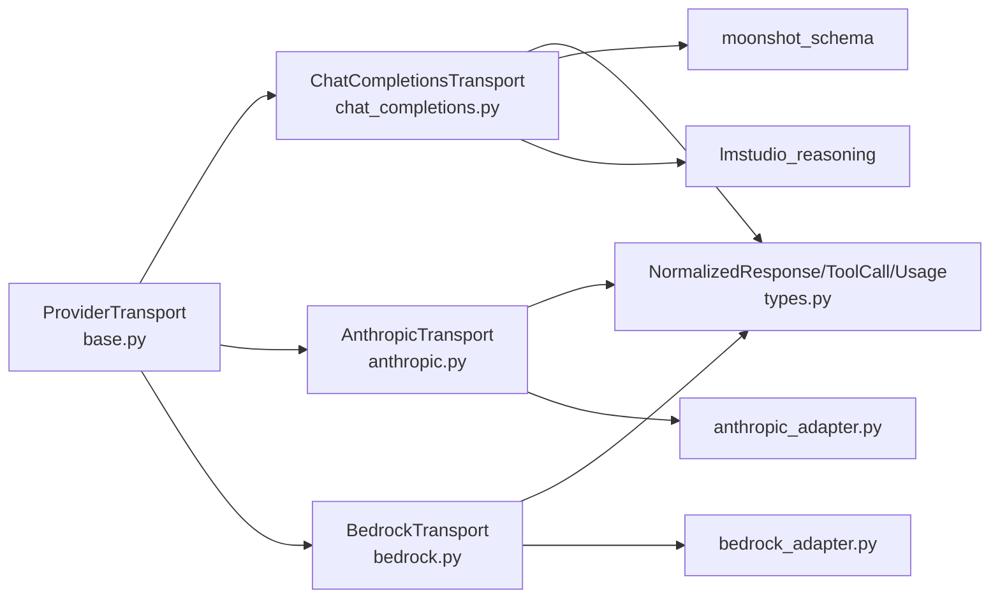

# 适配器模式

<cite>
**本文引用的文件**
- [agent/transports/base.py](file://agent/transports/base.py)
- [agent/transports/types.py](file://agent/transports/types.py)
- [agent/transports/__init__.py](file://agent/transports/__init__.py)
- [agent/transports/chat_completions.py](file://agent/transports/chat_completions.py)
- [agent/transports/anthropic.py](file://agent/transports/anthropic.py)
- [agent/transports/bedrock.py](file://agent/transports/bedrock.py)
- [agent/anthropic_adapter.py](file://agent/anthropic_adapter.py)
- [agent/bedrock_adapter.py](file://agent/bedrock_adapter.py)
</cite>

## 目录
1. [简介](#简介)
2. [项目结构](#项目结构)
3. [核心组件](#核心组件)
4. [架构总览](#架构总览)
5. [详细组件分析](#详细组件分析)
6. [依赖关系分析](#依赖关系分析)
7. [性能考虑](#性能考虑)
8. [故障排查指南](#故障排查指南)
9. [结论](#结论)
10. [附录](#附录)

## 简介
本文件系统性阐述 Hermes Agent 如何通过“适配器模式”统一不同模型提供商（OpenAI、Anthropic、Bedrock 等）的接口，使上层调用方无需关心底层协议差异。文档覆盖：
- 适配器接口定义与职责边界
- 具体适配器实现（Chat Completions、Anthropic Messages、Bedrock Converse）
- 适配器选择机制与注册表
- 生命周期管理、配置处理、错误转换策略
- 方法映射、参数转换、响应归一化
- 多模型支持与未来扩展性

## 项目结构
Hermes 在 agent/transports 下实现了统一的传输层抽象，并通过类型定义和注册表将各提供商适配为同一契约。关键组织方式如下：
- base.py：定义 ProviderTransport 抽象基类，明确每个传输的职责边界
- types.py：定义跨提供商的统一数据结构（NormalizedResponse、ToolCall、Usage）
- __init__.py：提供 get_transport 与自动发现/注册机制
- chat_completions.py：面向 OpenAI 兼容接口的传输（支持大量 OpenAI 兼容提供商）
- anthropic.py：面向 Anthropic Messages API 的传输
- bedrock.py：面向 AWS Bedrock Converse API 的传输

图表来源
- [agent/transports/__init__.py:21-46](file://agent/transports/__init__.py#L21-L46)
- [agent/transports/base.py:16-90](file://agent/transports/base.py#L16-L90)
- [agent/transports/chat_completions.py:207-216](file://agent/transports/chat_completions.py#L207-L216)
- [agent/transports/anthropic.py:13-23](file://agent/transports/anthropic.py#L13-L23)
- [agent/transports/bedrock.py:15-20](file://agent/transports/bedrock.py#L15-L20)
- [agent/transports/types.py:90-109](file://agent/transports/types.py#L90-L109)

章节来源
- [agent/transports/base.py:1-90](file://agent/transports/base.py#L1-L90)
- [agent/transports/types.py:1-175](file://agent/transports/types.py#L1-L175)
- [agent/transports/__init__.py:1-69](file://agent/transports/__init__.py#L1-L69)

## 核心组件
- ProviderTransport（抽象基类）
  - 暴露 api_mode、convert_messages、convert_tools、build_kwargs、normalize_response、validate_response、extract_cache_stats、map_finish_reason 等方法
  - 明确职责边界：负责数据路径转换与归一化；不负责客户端构造、流式、凭据刷新、重试等
- NormalizedResponse、ToolCall、Usage（统一数据类型）
  - 所有提供商响应最终归一化为 NormalizedResponse，工具调用归一化为 ToolCall，用量信息归一化为 Usage
  - provider_data 用于承载协议特定元数据，避免污染共享字段
- 传输注册表与选择器
  - register_transport/get_transport/_discover_transports 提供按 api_mode 动态选择传输实例的能力
  - 各传输模块在导入时自动注册自身，便于渐进迁移与按需加载

章节来源
- [agent/transports/base.py:16-90](file://agent/transports/base.py#L16-L90)
- [agent/transports/types.py:18-175](file://agent/transports/types.py#L18-L175)
- [agent/transports/__init__.py:21-69](file://agent/transports/__init__.py#L21-L69)

## 架构总览
适配器模式在本系统中的体现：
- 抽象层：ProviderTransport 定义统一接口
- 适配层：各传输类实现 ProviderTransport，封装提供商特定的消息/工具格式转换与响应归一化
- 选择层：通过 api_mode 路由到对应传输，屏蔽底层差异
- 数据层：NormalizedResponse 作为统一输出，供上层消费

图表来源
- [agent/transports/__init__.py:21-46](file://agent/transports/__init__.py#L21-L46)
- [agent/transports/chat_completions.py:356-597](file://agent/transports/chat_completions.py#L356-L597)
- [agent/transports/anthropic.py:41-78](file://agent/transports/anthropic.py#L41-L78)
- [agent/transports/bedrock.py:32-65](file://agent/transports/bedrock.py#L32-L65)

## 详细组件分析

### 抽象基类 ProviderTransport
- 职责
  - 定义统一的数据转换与归一化流程：convert_messages → convert_tools → build_kwargs → normalize_response
  - 可选能力：validate_response、extract_cache_stats、map_finish_reason
- 设计要点
  - 不持有客户端生命周期、重试、缓存、中断等逻辑，保持单一职责
  - 通过 api_mode 标识所处理的协议族，便于注册与选择

章节来源
- [agent/transports/base.py:16-90](file://agent/transports/base.py#L16-L90)

### ChatCompletionsTransport（OpenAI 兼容）
- 适用场景
  - 默认 api_mode，服务于约16个 OpenAI 兼容提供商（如 OpenRouter、Nous、NVIDIA、Qwen、Ollama、DeepSeek、xAI、Kimi 等）
- 关键行为
  - convert_messages：对消息进行清洗，移除内部字段与严格提供商拒绝的字段（如 codex_reasoning_items、tool_name、extra_content 等），并针对 Gemini 家族保留 extra_content
  - convert_tools：身份映射（已是 OpenAI 格式）
  - build_kwargs：组装请求体，包含超时、工具、max_tokens、reasoning_config、provider_preferences、extra_body、prompt_cache_key 等；支持 ProviderProfile 路径与遗留路径
  - normalize_response：将 OpenAI 格式的响应转换为 NormalizedResponse，保留 reasoning_details、reasoning_content、tool_calls 的 provider_data
- 特殊处理
  - 针对 Gemini thinking_config、LM Studio reasoning_effort、Kimi/Tencent TokenHub reasoning_effort、OpenRouter provider 偏好等进行条件注入
  - 支持 prompt cache key 注入，基于静态指令与工具内容生成一致性键

图表来源
- [agent/transports/chat_completions.py:356-597](file://agent/transports/chat_completions.py#L356-L597)
- [agent/transports/chat_completions.py:599-747](file://agent/transports/chat_completions.py#L599-L747)

章节来源
- [agent/transports/chat_completions.py:207-800](file://agent/transports/chat_completions.py#L207-L800)

### AnthropicTransport（Anthropic Messages）
- 职责
  - 将 OpenAI 风格消息转换为 Anthropic 的 (system, messages) 元组
  - 将工具定义转换为 Anthropic input_schema 格式
  - 构建 Anthropic messages.create() 所需 kwargs
  - 将 Anthropic 响应归一化为 NormalizedResponse
- 关键点
  - 委托给 agent/anthropic_adapter 中的具体实现，避免重复逻辑
  - normalize_response 中维护 ordered_blocks，以正确重放带签名的 thinking 块与 tool_use 交错的内容
  - validate_response 允许空 content 列表但 stop_reason 为 end_turn/refusal 的情况，避免误重试
  - map_finish_reason 将 Anthropic stop_reason 映射为 OpenAI finish_reason

图表来源
- [agent/transports/base.py:16-90](file://agent/transports/base.py#L16-L90)
- [agent/transports/anthropic.py:13-245](file://agent/transports/anthropic.py#L13-L245)

章节来源
- [agent/transports/anthropic.py:13-252](file://agent/transports/anthropic.py#L13-L252)
- [agent/anthropic_adapter.py:1-200](file://agent/anthropic_adapter.py#L1-L200)

### BedrockTransport（AWS Bedrock Converse）
- 职责
  - 将 OpenAI 风格消息转换为 Bedrock Converse 格式
  - 将工具定义转换为 Bedrock toolConfig
  - 构建 converse() kwargs，并附加调度哨兵键（__bedrock_converse__、__bedrock_region__）
  - 将 Bedrock 响应归一化为 NormalizedResponse
- 关键点
  - 委托给 agent/bedrock_adapter 的具体实现
  - normalize_response 兼容两种形状：boto3 原始 dict 或已归一化的 SimpleNamespace
  - validate_response 检查 output 或 choices 是否存在
  - map_finish_reason 将 Bedrock stop_reason 映射为 OpenAI finish_reason

图表来源
- [agent/transports/bedrock.py:15-155](file://agent/transports/bedrock.py#L15-L155)
- [agent/bedrock_adapter.py:1-200](file://agent/bedrock_adapter.py#L1-L200)

章节来源
- [agent/transports/bedrock.py:15-155](file://agent/transports/bedrock.py#L15-L155)
- [agent/bedrock_adapter.py:1-200](file://agent/bedrock_adapter.py#L1-L200)

### 传输选择机制与注册表
- 自动发现与注册
  - 各传输模块在导入时调用 register_transport 将自身注册到全局 _REGISTRY
  - get_transport 根据 api_mode 获取传输实例；若未找到则触发 _discover_transports 再次尝试
- 渐进迁移
  - 当某个 api_mode 尚未注册时，get_transport 返回 None，调用方可回退到旧路径，保证平滑过渡

图表来源
- [agent/transports/__init__.py:21-69](file://agent/transports/__init__.py#L21-L69)

章节来源
- [agent/transports/__init__.py:1-69](file://agent/transports/__init__.py#L1-L69)

### 统一数据类型与错误转换
- NormalizedResponse
  - 统一字段：content、tool_calls、finish_reason、reasoning、usage、provider_data
  - 向后兼容属性：reasoning_content、reasoning_details、anthropic_content_blocks、codex_reasoning_items、codex_message_items
- ToolCall
  - 统一字段：id、name、arguments、provider_data
  - 向后兼容属性：type、function、call_id、response_item_id、extra_content
- Usage
  - 统一字段：prompt_tokens、completion_tokens、total_tokens、cached_tokens
- 错误转换
  - 各传输提供 map_finish_reason，将提供商特定的停止原因映射为标准 finish_reason
  - validate_response 用于判断响应是否有效，避免无效重试

章节来源
- [agent/transports/types.py:18-175](file://agent/transports/types.py#L18-L175)
- [agent/transports/anthropic.py:194-245](file://agent/transports/anthropic.py#L194-L245)
- [agent/transports/bedrock.py:118-148](file://agent/transports/bedrock.py#L118-L148)

## 依赖关系分析
- 耦合与内聚
  - ProviderTransport 高内聚于数据转换与归一化；低耦合于客户端生命周期与网络细节
  - 各传输仅依赖各自适配器函数，避免重复实现
- 直接依赖
  - chat_completions 依赖 moonshot_schema、lmstudio_reasoning、prompt_builder、transports.types
  - anthropic 依赖 anthropic_adapter
  - bedrock 依赖 bedrock_adapter
- 间接依赖
  - 通过注册表解耦调用方与具体传输实现
  - 通过 NormalizedResponse 解耦下游消费逻辑与提供商差异

图表来源
- [agent/transports/base.py:16-90](file://agent/transports/base.py#L16-L90)
- [agent/transports/chat_completions.py:12-20](file://agent/transports/chat_completions.py#L12-L20)
- [agent/transports/anthropic.py:7-11](file://agent/transports/anthropic.py#L7-L11)
- [agent/transports/bedrock.py:9-13](file://agent/transports/bedrock.py#L9-L13)
- [agent/transports/types.py:18-175](file://agent/transports/types.py#L18-L175)

章节来源
- [agent/transports/chat_completions.py:12-20](file://agent/transports/chat_completions.py#L12-L20)
- [agent/transports/anthropic.py:7-11](file://agent/transports/anthropic.py#L7-L11)
- [agent/transports/bedrock.py:9-13](file://agent/transports/bedrock.py#L9-L13)

## 性能考虑
- 延迟导入与懒加载
  - Anthropic SDK 与 Bedrock boto3 均采用延迟导入与按需安装，减少冷启动开销
- 连接池与会话复用
  - Bedrock 使用 per-region 客户端缓存，并在检测到陈旧连接时主动失效，避免死连接导致的失败
- 请求体优化
  - ChatCompletionsTransport 对消息进行最小必要清洗，避免向严格提供商发送多余字段导致 400/422
  - 通过 prompt_cache_key 提升缓存命中率，降低重复请求成本
- 归一化效率
  - NormalizedResponse 仅暴露必要字段，provider_data 隔离协议特定元数据，减少不必要的数据拷贝

[本节为通用性能讨论，不直接分析具体文件]

## 故障排查指南
- 常见错误与定位
  - 响应为空但非终止状态：检查 validate_response 逻辑，确认是否为有效终止（如 end_turn/refusal）
  - 工具调用签名丢失：确保 Gemini extra_content 在目标为 Gemini 家族时保留，否则被严格提供商拒绝
  - Bedrock 连接异常：检测陈旧连接错误并失效对应 region 的客户端缓存
- 调试建议
  - 打印 provider_data 中的 reasoning_details、anthropic_content_blocks、codex_reasoning_items 等，辅助定位协议差异
  - 检查 build_kwargs 中 extra_body 与 request_overrides 的合并顺序，避免覆盖预期字段
- 回归测试
  - 平台适配器 connect 必须接受 is_reconnect 关键字参数，避免网关重连时静默断开

章节来源
- [agent/transports/anthropic.py:194-245](file://agent/transports/anthropic.py#L194-L245)
- [agent/transports/bedrock.py:118-155](file://agent/transports/bedrock.py#L118-L155)
- [agent/bedrock_adapter.py:136-200](file://agent/bedrock_adapter.py#L136-L200)

## 结论
Hermes Agent 通过 ProviderTransport 抽象与具体传输实现，成功将 OpenAI、Anthropic、Bedrock 等不同模型提供商的接口统一到一致的 NormalizedResponse 上。该适配器模式：
- 明确了数据转换与归一化的职责边界
- 通过注册表与 api_mode 实现灵活的选择与扩展
- 借助 provider_data 与 map_finish_reason 妥善处理协议差异与错误转换
- 支持多模型与未来新提供商的平滑接入

## 附录
- 示例路径（代码片段位置）
  - 接口抽象：[ProviderTransport 定义:16-90](file://agent/transports/base.py#L16-L90)
  - 统一类型：[NormalizedResponse/ToolCall/Usage:18-175](file://agent/transports/types.py#L18-L175)
  - 选择机制：[get_transport/register_transport:21-69](file://agent/transports/__init__.py#L21-L69)
  - OpenAI 兼容传输：[ChatCompletionsTransport:207-800](file://agent/transports/chat_completions.py#L207-L800)
  - Anthropic 传输：[AnthropicTransport:13-252](file://agent/transports/anthropic.py#L13-L252)
  - Bedrock 传输：[BedrockTransport:15-155](file://agent/transports/bedrock.py#L15-L155)
  - Anthropic 适配器函数：[anthropic_adapter:1-200](file://agent/anthropic_adapter.py#L1-L200)
  - Bedrock 适配器函数：[bedrock_adapter:1-200](file://agent/bedrock_adapter.py#L1-L200)