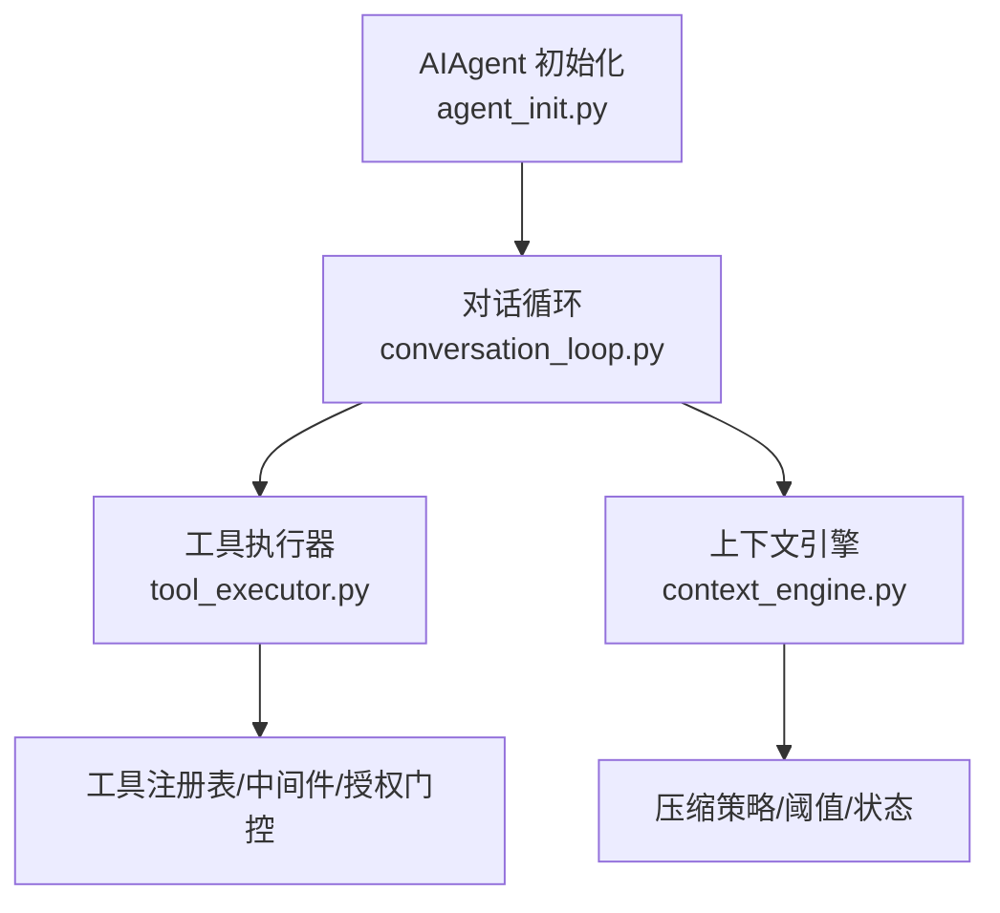
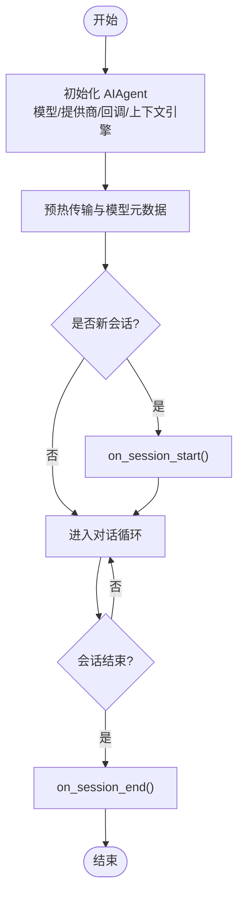
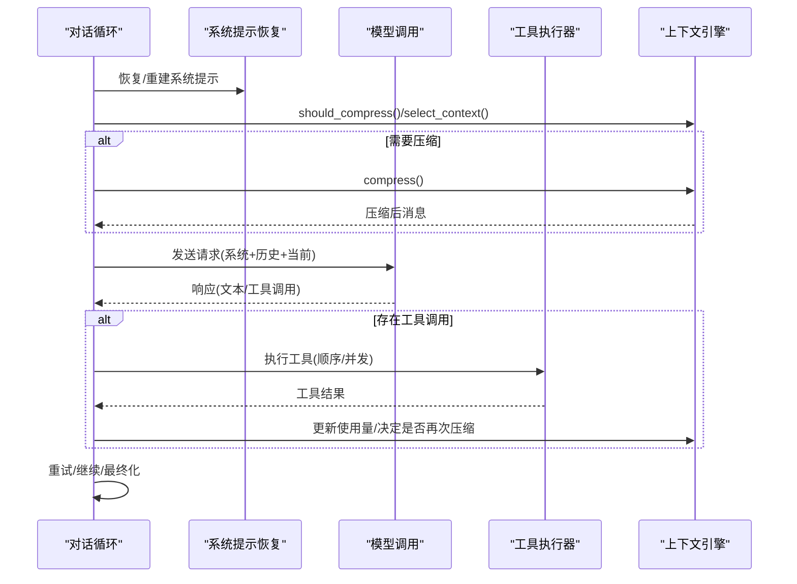
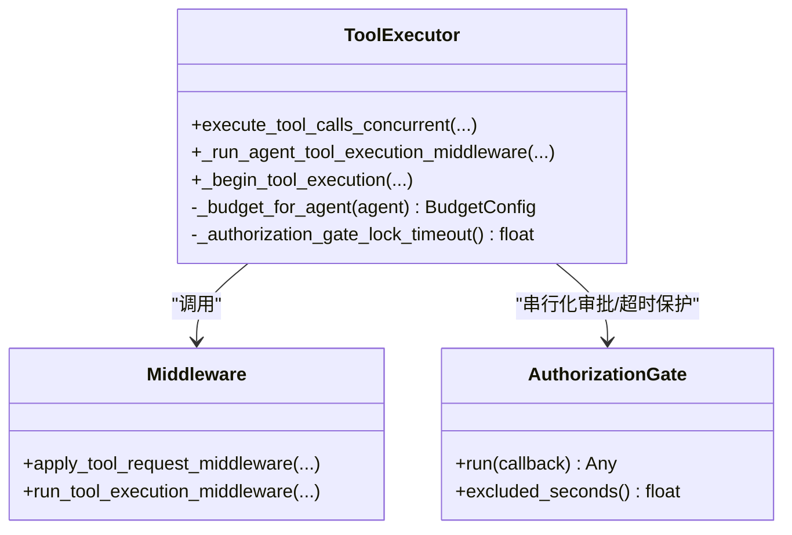
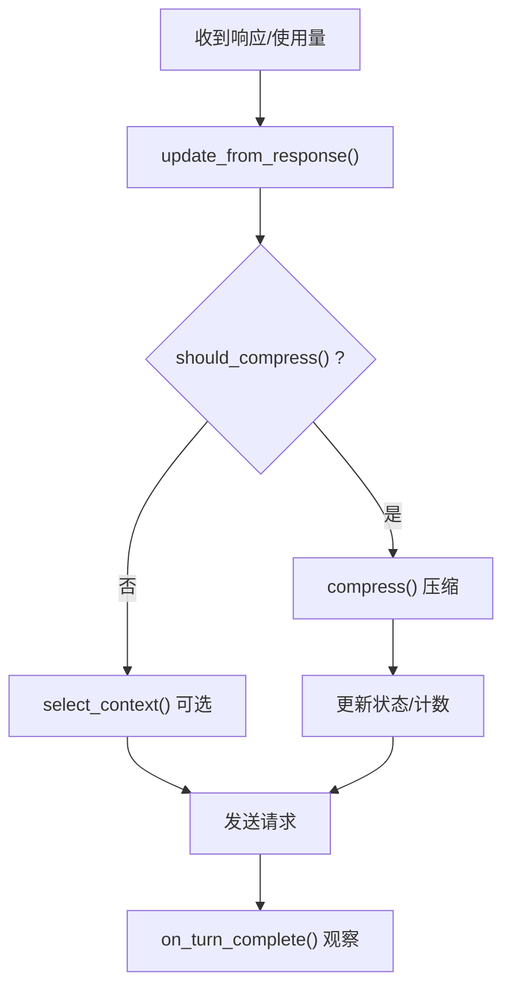
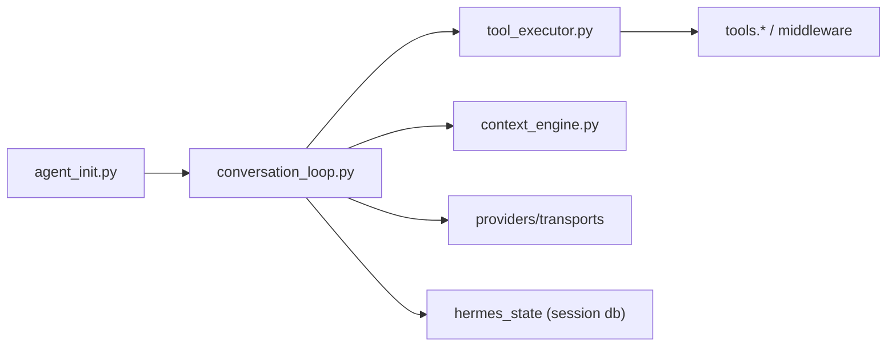

# Agent 核心引擎

<cite>
**本文引用的文件**
- [agent_init.py](file://agent/agent_init.py)
- [conversation_loop.py](file://agent/conversation_loop.py)
- [tool_executor.py](file://agent/tool_executor.py)
- [context_engine.py](file://agent/context_engine.py)
</cite>

## 目录
1. [简介](#简介)
2. [项目结构](#项目结构)
3. [核心组件](#核心组件)
4. [架构总览](#架构总览)
5. [详细组件分析](#详细组件分析)
6. [依赖关系分析](#依赖关系分析)
7. [性能考量](#性能考量)
8. [故障排查指南](#故障排查指南)
9. [结论](#结论)
10. [附录](#附录)

## 简介
本文件为 Hermes Agent 的核心引擎技术文档，聚焦 AIAgent 的设计模式与实现细节，覆盖对话循环管理、工具调用调度、上下文处理机制；阐述引擎生命周期（初始化到会话结束）；说明工具执行器架构（工具发现、参数校验、并发执行、结果处理）；解释上下文引擎工作原理（消息压缩、记忆集成、状态管理）；并提供扩展点说明（自定义工具开发、回调机制、事件监听）。

## 项目结构
围绕核心引擎的关键模块：
- agent_init.py：AIAgent 初始化与配置装配（模型、提供商、回调、上下文引擎等）
- conversation_loop.py：单轮对话主循环（模型调用、工具调度、重试、压缩、收尾）
- tool_executor.py：工具执行器（顺序/并发、中间件、授权门控、结果持久化）
- context_engine.py：上下文引擎抽象与默认行为（压缩触发、选择上下文、会话钩子）



**图示来源**
- [agent_init.py:459-800](file://agent/agent_init.py#L459-L800)
- [conversation_loop.py:1-120](file://agent/conversation_loop.py#L1-L120)
- [tool_executor.py:1-120](file://agent/tool_executor.py#L1-L120)
- [context_engine.py:1-120](file://agent/context_engine.py#L1-L120)

**章节来源**
- [agent_init.py:459-800](file://agent/agent_init.py#L459-L800)
- [conversation_loop.py:1-120](file://agent/conversation_loop.py#L1-L120)
- [tool_executor.py:1-120](file://agent/tool_executor.py#L1-L120)
- [context_engine.py:1-120](file://agent/context_engine.py#L1-L120)

## 核心组件
- AIAgent 初始化：负责模型/提供商识别、API 模式选择、回调注入、上下文引擎启动、中断与执行线程安全、迭代预算等。
- 对话循环：封装一次用户请求的完整流程，包括系统提示恢复、预检、模型调用、工具调用、压缩、重试、最终化。
- 工具执行器：统一入口，支持顺序与并发执行，包含中间件链、授权门控、结果预算控制、进度与回调。
- 上下文引擎：抽象压缩与上下文选择接口，提供默认阈值、保护头尾消息、会话生命周期钩子、可选工具暴露。

**章节来源**
- [agent_init.py:459-800](file://agent/agent_init.py#L459-L800)
- [conversation_loop.py:1-120](file://agent/conversation_loop.py#L1-L120)
- [tool_executor.py:1-120](file://agent/tool_executor.py#L1-L120)
- [context_engine.py:1-120](file://agent/context_engine.py#L1-L120)

## 架构总览
下图展示从初始化到一轮对话的工具调用与上下文处理的交互关系。

```mermaid
sequenceDiagram
participant Host as "宿主/平台"
participant Agent as "AIAgent<br/>agent_init.py"
participant Loop as "对话循环<br/>conversation_loop.py"
participant Exec as "工具执行器<br/>tool_executor.py"
participant Ctx as "上下文引擎<br/>context_engine.py"
Host->>Agent : 构造并初始化(模型/提供商/回调/上下文引擎)
Agent-->>Host : 就绪
Host->>Loop : 发起一轮对话
Loop->>Loop : 恢复系统提示/构建请求
Loop->>Ctx : should_compress() / select_context()
alt 需要压缩
Loop->>Ctx : compress()
Ctx-->>Loop : 压缩后的消息列表
end
Loop->>Agent : 调用模型(携带消息)
Agent-->>Loop : 返回响应(可能含工具调用)
Loop->>Exec : 执行工具(顺序/并发)
Exec-->>Loop : 工具结果(带预算/回调/中间件)
Loop->>Loop : 重试/继续/最终化
Loop-->>Host : 本轮完成
```

**图示来源**
- [agent_init.py:459-800](file://agent/agent_init.py#L459-L800)
- [conversation_loop.py:1-120](file://agent/conversation_loop.py#L1-L120)
- [tool_executor.py:758-800](file://agent/tool_executor.py#L758-L800)
- [context_engine.py:133-190](file://agent/context_engine.py#L133-L190)

## 详细组件分析

### AIAgent 初始化与生命周期
- 初始化职责
  - 设置模型、提供商、API 模式自动推断与覆盖
  - 注入各类回调（工具进度、思考、推理、流式增量、状态通知等）
  - 初始化上下文引擎、迭代预算、中断机制、线程安全锁
  - 预热传输缓存、模型元数据缓存
- 生命周期钩子
  - on_session_start：新会话时由对话循环触发（用于加载/预热）
  - on_session_end：真实会话结束时清理资源
  - on_session_reset：重置计数与状态



**图示来源**
- [agent_init.py:459-800](file://agent/agent_init.py#L459-L800)
- [conversation_loop.py:548-684](file://agent/conversation_loop.py#L548-L684)
- [context_engine.py:387-410](file://agent/context_engine.py#L387-L410)

**章节来源**
- [agent_init.py:459-800](file://agent/agent_init.py#L459-L800)
- [conversation_loop.py:548-684](file://agent/conversation_loop.py#L548-L684)
- [context_engine.py:387-410](file://agent/context_engine.py#L387-L410)

### 对话循环管理（run_conversation 提取体）
- 系统提示恢复：优先从会话数据库恢复，避免前缀缓存失效
- 预检与压缩：在 API 调用前后进行压缩决策与消息选择
- 模型调用与重试：适配不同提供商错误分类与计费/配额提示
- 工具调用：解析工具调用、分发执行、收集结果、追加消息
- 最终化：写入持久化、触发后置钩子、清理临时状态



**图示来源**
- [conversation_loop.py:1-120](file://agent/conversation_loop.py#L1-L120)
- [conversation_loop.py:548-684](file://agent/conversation_loop.py#L548-L684)
- [tool_executor.py:758-800](file://agent/tool_executor.py#L758-L800)
- [context_engine.py:133-190](file://agent/context_engine.py#L133-L190)

**章节来源**
- [conversation_loop.py:1-120](file://agent/conversation_loop.py#L1-L120)
- [conversation_loop.py:548-684](file://agent/conversation_loop.py#L548-L684)

### 工具执行器架构（发现、验证、并发、结果）
- 工具发现与范围：基于会话启用/禁用的工具集，计算可调用集合
- 参数解析与校验：解析 JSON 参数，失败时返回结构化错误
- 中间件与授权：请求级中间件、前置拦截（插件/护栏）、授权序列化门控
- 并发执行：线程池并行，按原始顺序收集结果；图像生成等慢操作限制并发度
- 结果处理：预算控制、持久化、回调（开始/完成/进度）、终端后钩子



**图示来源**
- [tool_executor.py:482-662](file://agent/tool_executor.py#L482-L662)
- [tool_executor.py:391-468](file://agent/tool_executor.py#L391-L468)
- [tool_executor.py:758-800](file://agent/tool_executor.py#L758-L800)

**章节来源**
- [tool_executor.py:141-158](file://agent/tool_executor.py#L141-L158)
- [tool_executor.py:482-662](file://agent/tool_executor.py#L482-L662)
- [tool_executor.py:758-800](file://agent/tool_executor.py#L758-L800)

### 上下文引擎（压缩、记忆集成、状态管理）
- 压缩触发与阈值：维护 last_prompt_tokens/threshold_tokens 等，支持 per-model 阈值覆盖
- 消息选择：select_context 可在每次请求前替换上下文（检索/路由/分支切换），不影响持久历史
- 会话生命周期：on_session_start/on_session_end/on_session_reset 管理状态
- 记忆集成：sanitize_memory_context 对记忆输出脱敏与截断，保证 egress 边界安全
- 工具暴露：get_tool_schemas/handle_tool_call 允许引擎暴露辅助工具（如 grep/describe）



**图示来源**
- [context_engine.py:133-190](file://agent/context_engine.py#L133-L190)
- [context_engine.py:215-279](file://agent/context_engine.py#L215-L279)
- [context_engine.py:387-410](file://agent/context_engine.py#L387-L410)
- [context_engine.py:40-53](file://agent/context_engine.py#L40-L53)

**章节来源**
- [context_engine.py:133-190](file://agent/context_engine.py#L133-L190)
- [context_engine.py:215-279](file://agent/context_engine.py#L215-L279)
- [context_engine.py:387-410](file://agent/context_engine.py#L387-L410)
- [context_engine.py:40-53](file://agent/context_engine.py#L40-L53)

## 依赖关系分析
- 模块耦合
  - conversation_loop 依赖 context_engine 做压缩与上下文选择
  - conversation_loop 通过 tool_executor 执行工具调用
  - agent_init 装配回调、上下文引擎、迭代预算与中断机制
- 外部依赖
  - 工具注册表/中间件/授权（来自 tools.* 与 hermes_cli.middleware）
  - 提供商适配器（chat_completions/codex_responses/anthropic_messages/bedrock_converse）
  - 会话数据库（system prompt 恢复与持久化）



**图示来源**
- [agent_init.py:459-800](file://agent/agent_init.py#L459-L800)
- [conversation_loop.py:1-120](file://agent/conversation_loop.py#L1-L120)
- [tool_executor.py:482-662](file://agent/tool_executor.py#L482-L662)
- [context_engine.py:133-190](file://agent/context_engine.py#L133-L190)

**章节来源**
- [agent_init.py:459-800](file://agent/agent_init.py#L459-L800)
- [conversation_loop.py:1-120](file://agent/conversation_loop.py#L1-L120)
- [tool_executor.py:482-662](file://agent/tool_executor.py#L482-L662)
- [context_engine.py:133-190](file://agent/context_engine.py#L133-L190)

## 性能考量
- 并发与限流
  - 工具并发上限受 _MAX_TOOL_WORKERS 约束，图像生成有独立并发限制
  - 授权门控串行化审批，避免人机交互交错；具备超时保护防止死锁
- 上下文与压缩
  - 通过 should_compress_preflight 与 should_defer_preflight_to_real_usage 减少误压
  - protect_first_n/protect_last_n 保护关键消息，降低信息丢失风险
- 预算与结果裁剪
  - 工具结果预算随上下文窗口缩放，避免单次大结果撑爆请求
  - prune_tool_results_only 低成本裁剪旧工具结果，缓解长窗口膨胀

[本节为通用性能建议，不直接分析具体文件]

## 故障排查指南
- 工具执行被阻断
  - 检查 pre_tool_block 与 guardrail 决策，确认 scope_block/guardrail_block 原因
  - 查看中间件 trace 与 post_tool_call 钩子输出
- 并发阻塞或超时
  - 关注授权门控锁超时与 start-order gate 等待时间
  - 调整 HERMES_CONCURRENT_TOOL_TIMEOUT_S 或图像并发限制
- 上下文压缩异常
  - 检查 threshold_percent、context_length、protect_first_n/last_n
  - 查看 on_turn_complete 与 get_status 中的 usage_percent/compression_count
- 会话状态不一致
  - 确认 system prompt 恢复路径与 DB 写入是否成功
  - 核对 on_session_start/end/reset 是否被正确调用

**章节来源**
- [tool_executor.py:482-662](file://agent/tool_executor.py#L482-L662)
- [tool_executor.py:758-800](file://agent/tool_executor.py#L758-L800)
- [context_engine.py:435-454](file://agent/context_engine.py#L435-L454)
- [conversation_loop.py:548-684](file://agent/conversation_loop.py#L548-L684)

## 结论
Hermes Agent 核心引擎以 AIAgent 初始化为中心，将对话循环、工具执行器与上下文引擎解耦协作：初始化阶段完成能力装配与回调注入；对话循环负责端到端流程编排；工具执行器提供高内聚的执行管道；上下文引擎保障在有限上下文下的稳定与高效。通过中间件、授权门控与预算控制，系统在可扩展性与安全性之间取得平衡。

## 附录
- 扩展点
  - 自定义上下文引擎：实现 ContextEngine 接口，注册为插件或通过配置选择
  - 自定义工具：遵循工具注册规范，配合中间件与护栏进行安全与审计
  - 回调与事件：通过 tool_progress_callback、event_callback 等接入宿主层
- 最佳实践
  - 合理设置压缩阈值与保护消息数量，避免过度压缩
  - 控制工具并发与超时，避免资源争用与长时间阻塞
  - 利用 on_turn_complete 进行观测与索引，提升下次 select_context 质量

[本节为概念性内容，不直接分析具体文件]