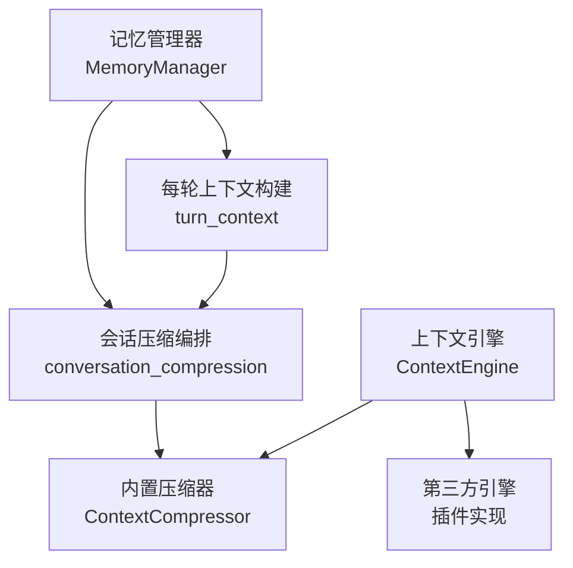
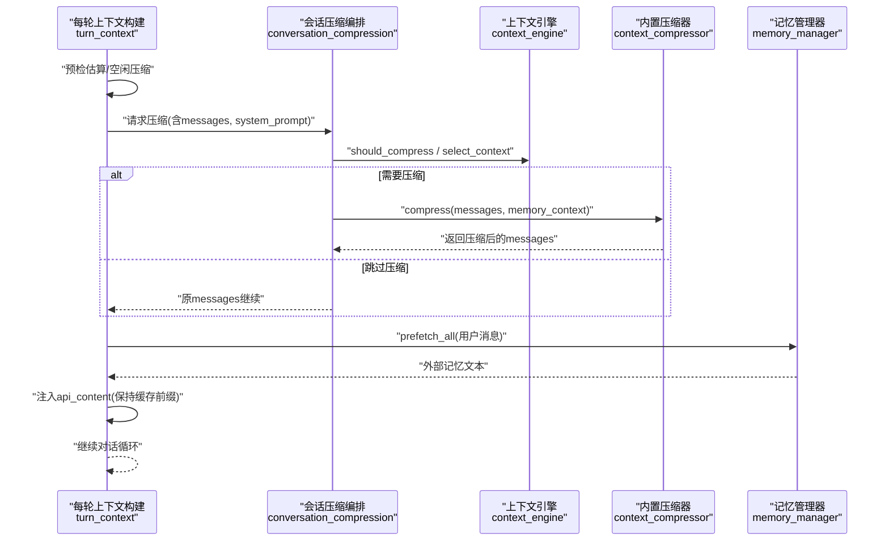
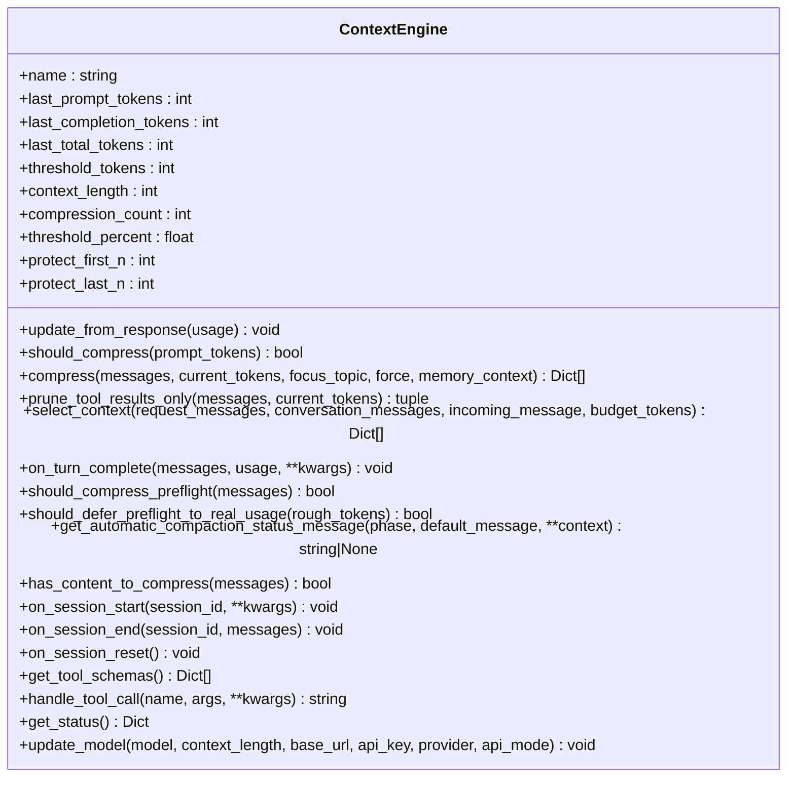
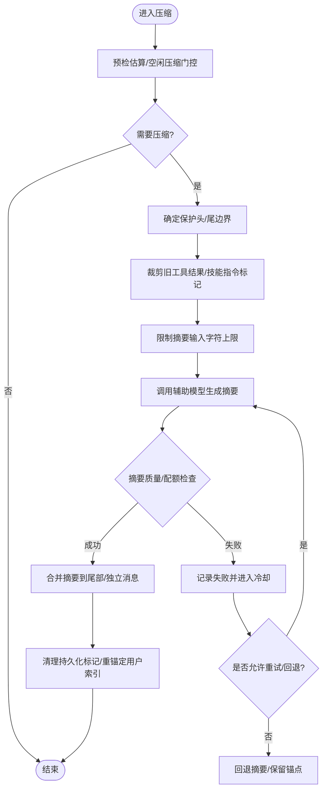
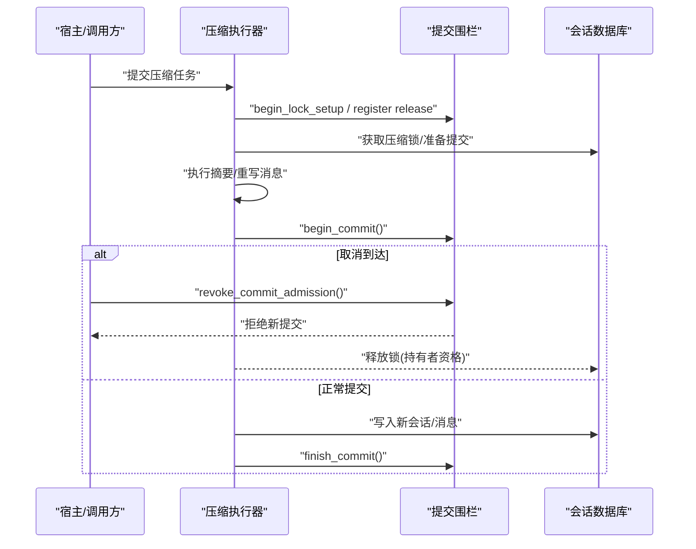
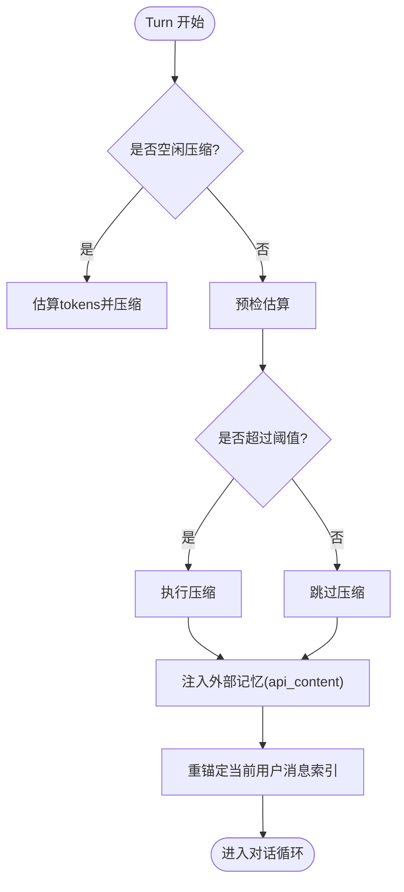
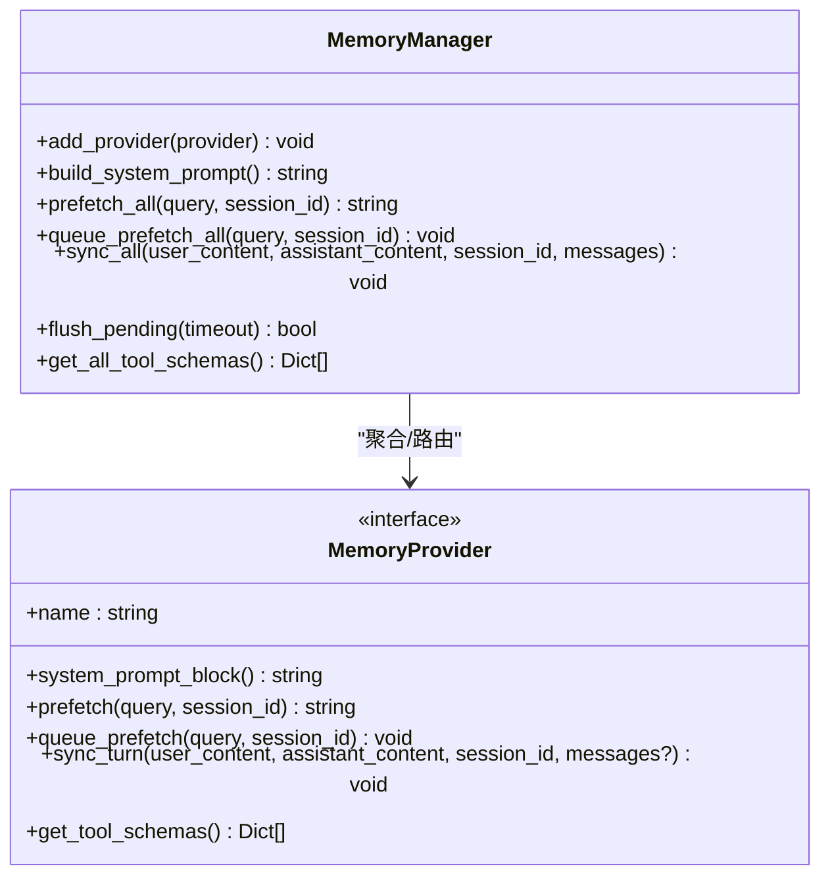

# 上下文处理

<cite>
**本文引用的文件**
- [agent/context_engine.py](file://agent/context_engine.py)
- [agent/context_compressor.py](file://agent/context_compressor.py)
- [agent/conversation_compression.py](file://agent/conversation_compression.py)
- [agent/turn_context.py](file://agent/turn_context.py)
- [agent/memory_manager.py](file://agent/memory_manager.py)
</cite>

## 目录
1. [简介](#简介)
2. [项目结构](#项目结构)
3. [核心组件](#核心组件)
4. [架构总览](#架构总览)
5. [详细组件分析](#详细组件分析)
6. [依赖关系分析](#依赖关系分析)
7. [性能考量](#性能考量)
8. [故障排查指南](#故障排查指南)
9. [结论](#结论)
10. [附录](#附录)

## 简介
本技术文档聚焦 Hermes Agent 的上下文处理系统，围绕上下文引擎、消息压缩算法、记忆集成机制与状态管理策略展开。重点说明：
- 上下文压缩的触发条件、内容保留策略与质量评估机制
- 短期/长期记忆与用户画像的存储与检索
- 上下文窗口管理（token 计算、优先级排序、内存优化）
- 配置选项与性能调优指南，并给出实际使用场景与最佳实践

## 项目结构
Hermes 的上下文处理由“上下文引擎 + 压缩器 + 会话编排 + 记忆管理器”构成，关键模块如下：
- 上下文引擎抽象与扩展点：定义统一接口，支持内置压缩器或第三方引擎
- 内置上下文压缩器：负责消息摘要、工具输出裁剪、尾部保护、滚动微压缩等
- 会话压缩编排：负责超时、并发、提交围栏、冷却期、重试与状态恢复
- 每轮上下文构建：负责预检估算、空闲压缩、注入外部记忆、索引重锚定
- 记忆管理器：聚合多个记忆提供者，提供系统提示、预取、同步与工具暴露

图表来源
- [agent/context_engine.py:89-490](file://agent/context_engine.py#L89-L490)
- [agent/context_compressor.py:1-800](file://agent/context_compressor.py#L1-L800)
- [agent/conversation_compression.py:1-800](file://agent/conversation_compression.py#L1-L800)
- [agent/turn_context.py:314-800](file://agent/turn_context.py#L314-L800)
- [agent/memory_manager.py:364-800](file://agent/memory_manager.py#L364-L800)

章节来源
- [agent/context_engine.py:1-490](file://agent/context_engine.py#L1-L490)
- [agent/context_compressor.py:1-800](file://agent/context_compressor.py#L1-L800)
- [agent/conversation_compression.py:1-800](file://agent/conversation_compression.py#L1-L800)
- [agent/turn_context.py:1-800](file://agent/turn_context.py#L1-L800)
- [agent/memory_manager.py:1-800](file://agent/memory_manager.py#L1-L800)

## 核心组件
- 上下文引擎（ContextEngine）
  - 统一接口：更新用量、判断是否压缩、执行压缩、可选的工具与选择上下文钩子、会话生命周期回调
  - 可插拔：通过配置选择内置压缩器或第三方引擎；仅一个引擎生效
- 内置上下文压缩器（ContextCompressor）
  - 基于辅助模型对中间对话进行摘要，保护头部与尾部
  - 工具结果主动裁剪、技能指令防幽灵化、滚动微压缩、失败冷却与反抖动
- 会话压缩编排（conversation_compression）
  - 超时控制、并发限制、提交围栏、冷却期持久化、重试与恢复
- 每轮上下文构建（turn_context）
  - 预检估算、空闲压缩、外部记忆注入、当前用户消息索引重锚定
- 记忆管理器（MemoryManager）
  - 注册单一外部记忆提供者，合并系统提示、预取与异步同步，暴露记忆工具

章节来源
- [agent/context_engine.py:89-490](file://agent/context_engine.py#L89-L490)
- [agent/context_compressor.py:1-800](file://agent/context_compressor.py#L1-L800)
- [agent/conversation_compression.py:1-800](file://agent/conversation_compression.py#L1-L800)
- [agent/turn_context.py:314-800](file://agent/turn_context.py#L314-L800)
- [agent/memory_manager.py:364-800](file://agent/memory_manager.py#L364-L800)

## 架构总览
上下文处理的端到端流程：
- 每轮开始：构建 TurnContext，完成系统提示恢复、MCP 刷新、会话行创建、空闲压缩（可选）
- 预检阶段：粗略估算 token，决定是否进入完整预检与压缩
- 压缩阶段：调用上下文引擎（默认内置压缩器），必要时多次重试，维护冷却期与反抖动
- 记忆集成：在 API 侧的用户消息中注入外部记忆块，保证缓存前缀稳定
- 提交与恢复：通过提交围栏确保原子性，失败时回滚到安全快照

图表来源
- [agent/turn_context.py:667-800](file://agent/turn_context.py#L667-L800)
- [agent/conversation_compression.py:1-800](file://agent/conversation_compression.py#L1-L800)
- [agent/context_engine.py:131-279](file://agent/context_engine.py#L131-L279)
- [agent/context_compressor.py:1-800](file://agent/context_compressor.py#L1-L800)
- [agent/memory_manager.py:525-595](file://agent/memory_manager.py#L525-L595)

## 详细组件分析

### 上下文引擎（ContextEngine）
- 职责
  - 跟踪 token 用量、阈值、上下文长度与压缩次数
  - 决定何时压缩（should_compress）、如何压缩（compress）
  - 可选地选择本轮上下文（select_context）与观察回合结束（on_turn_complete）
  - 暴露工具（get_tool_schemas/handle_tool_call）与状态（get_status）
- 设计要点
  - 兼容旧引擎：新增方法带默认实现，避免 AttributeError
  - 可抑制自动压缩状态输出，便于后台维护型引擎静默运行
  - 支持 per-model 阈值覆盖与 update_model 回调

图表来源
- [agent/context_engine.py:89-490](file://agent/context_engine.py#L89-L490)

章节来源
- [agent/context_engine.py:1-490](file://agent/context_engine.py#L1-L490)

### 内置上下文压缩器（ContextCompressor）
- 压缩触发条件
  - 基于 threshold_tokens 与 threshold_percent 的动态阈值
  - 预检快速门控：消息数超过保护范围或字符估计超阈值即进入完整估算
  - 空闲压缩：长时间无活动后在进入下一轮前压缩累积历史
- 内容保留策略
  - 保护头部 protect_first_n 与尾部 protect_last_n（按 token 预算而非固定条数）
  - 工具结果主动裁剪（prune_tool_results_only）以减少重复发送的大输出
  - 技能指令防幽灵化：检测即将丢失的 skill_view 指令并插入重加载标记
- 质量评估与稳定性
  - 摘要输入上限（_SUMMARY_INPUT_MAX_CHARS）防止慢后端溢出
  - 摘要大小比例与上限（_SUMMARY_RATIO/_SUMMARY_TOKENS_CEILING）
  - 失败冷却（_SUMMARY_FAILURE_COOLDOWN_SECONDS）与反抖动（连续失败计数）
  - 回退摘要（fallback summary）与最小摘要 token 下限
- 滚动微压缩与迭代更新
  - 微压缩失败连续次数上限，避免死循环
  - 迭代摘要更新，跨多次压缩保留信息连续性

图表来源
- [agent/context_compressor.py:1-800](file://agent/context_compressor.py#L1-L800)
- [agent/turn_context.py:173-203](file://agent/turn_context.py#L173-L203)

章节来源
- [agent/context_compressor.py:1-800](file://agent/context_compressor.py#L1-L800)
- [agent/turn_context.py:173-203](file://agent/turn_context.py#L173-L203)

### 会话压缩编排（conversation_compression）
- 超时与并发
  - 进度感知超时（idle_timeout_seconds/total_ceiling_seconds）
  - 共享线程池最大工作数限制，避免队列无限增长
- 提交围栏（CompressionCommitFence）
  - 保证提交边界的原子性：取消优先于提交，或在提交进行中等待完成
  - 持有者资格化的锁释放，避免并发压缩交叉写入
- 冷却期与恢复
  - 持久化摘要失败冷却，支持精确回滚与权威快照
  - 旋转会话恢复与警告重发

图表来源
- [agent/conversation_compression.py:445-691](file://agent/conversation_compression.py#L445-L691)

章节来源
- [agent/conversation_compression.py:1-800](file://agent/conversation_compression.py#L1-L800)

### 每轮上下文构建（turn_context）
- 预检与空闲压缩
  - 快速门控：消息数或字符估计超过阈值即进入完整估算
  - 空闲压缩：长时间无活动后在进入下一轮前压缩，减少后续读取开销
- 外部记忆注入
  - 将外部记忆以 fenced block 形式注入 api_content，保持缓存前缀稳定
- 索引重锚定
  - 压缩后重建消息列表，需重新定位当前用户消息索引，避免注入错位

图表来源
- [agent/turn_context.py:667-800](file://agent/turn_context.py#L667-L800)
- [agent/turn_context.py:173-203](file://agent/turn_context.py#L173-L203)

章节来源
- [agent/turn_context.py:1-800](file://agent/turn_context.py#L1-L800)

### 记忆管理器（MemoryManager）
- 架构设计
  - 内置提供者始终存在，最多一个外部提供者，避免冲突与工具膨胀
  - 系统提示块聚合：各提供者贡献片段，组合为最终系统提示
  - 预取与同步：prefetch_all 在前，sync_all 在后，均走后台串行执行器
- 短期/长期记忆与用户画像
  - 短期：每轮预取的外部记忆（如检索到的相关条目）
  - 长期：提供者内部存储（例如向量库/图数据库）
  - 用户画像：通过 user 目标块注入系统提示，影响行为与风格
- 工具暴露
  - 将记忆提供者的工具 schema 注入 agent 工具集，供模型调用

图表来源
- [agent/memory_manager.py:364-800](file://agent/memory_manager.py#L364-L800)

章节来源
- [agent/memory_manager.py:1-800](file://agent/memory_manager.py#L1-L800)

## 依赖关系分析
- 耦合与内聚
  - 上下文引擎与压缩器解耦：通过统一接口替换实现
  - 会话编排与引擎协作：编排层负责超时、并发、提交围栏；引擎专注压缩策略
  - 记忆管理器与上下文构建：记忆作为外部上下文注入，不侵入持久化消息体
- 外部依赖
  - 辅助模型用于摘要（通过 auxiliary_client）
  - 会话数据库用于持久化与锁管理
- 潜在循环依赖
  - 通过模块化拆分（engine/compressor/conversation/turn/memory）避免直接循环导入

图表来源
- [agent/context_engine.py:89-490](file://agent/context_engine.py#L89-L490)
- [agent/context_compressor.py:1-800](file://agent/context_compressor.py#L1-L800)
- [agent/conversation_compression.py:1-800](file://agent/conversation_compression.py#L1-L800)
- [agent/turn_context.py:314-800](file://agent/turn_context.py#L314-L800)
- [agent/memory_manager.py:364-800](file://agent/memory_manager.py#L364-L800)

章节来源
- [agent/context_engine.py:89-490](file://agent/context_engine.py#L89-L490)
- [agent/context_compressor.py:1-800](file://agent/context_compressor.py#L1-L800)
- [agent/conversation_compression.py:1-800](file://agent/conversation_compression.py#L1-L800)
- [agent/turn_context.py:314-800](file://agent/turn_context.py#L314-L800)
- [agent/memory_manager.py:364-800](file://agent/memory_manager.py#L364-L800)

## 性能考量
- Token 计算与阈值
  - 使用 estimate_request_tokens_rough 进行预检估算，避免昂贵的全量估算
  - 动态阈值：threshold_percent × context_length，支持 per-model 覆盖
- 优先级排序
  - 保护头部与尾部优先保留，中间内容摘要
  - 工具结果裁剪优先于 LLM 摘要，降低无效传输
- 内存优化
  - 限制摘要输入字符上限，防止慢后端超时
  - 滚动微压缩与失败冷却，避免反复触发导致抖动
  - 提交围栏与并发限制，避免阻塞主循环
- 建议
  - 合理设置 protect_first_n/protect_last_n，平衡历史与活跃上下文
  - 启用空闲压缩，减少长会话的冷读成本
  - 监控摘要失败冷却与重试次数，调整辅助模型与超时参数

[本节为通用指导，不直接分析具体文件]

## 故障排查指南
- 压缩被阻止
  - 现象：上下文超过阈值但压缩被阻止（冷却/反抖动）
  - 处理：查看冷却期与最近失败原因，必要时手动 /compress 或重启会话
- 摘要失败或配额错误
  - 现象：辅助模型鉴权/配额错误
  - 处理：检查辅助模型配置与凭据，确认失败冷却已生效
- 提交阶段卡住
  - 现象：SessionDB 写入超时或挂起
  - 处理：提交围栏会等待完成；若持续占用，检查数据库连接与锁释放钩子
- 外部记忆超时
  - 现象：外部记忆提供者预取超时
  - 处理：增大 external_prefetch_timeout 或禁用慢提供者，避免阻塞主循环

章节来源
- [agent/conversation_compression.py:1-800](file://agent/conversation_compression.py#L1-L800)
- [agent/context_compressor.py:1-800](file://agent/context_compressor.py#L1-L800)
- [agent/memory_manager.py:525-595](file://agent/memory_manager.py#L525-L595)

## 结论
Hermes 的上下文处理系统通过可插拔的上下文引擎、健壮的内置压缩器、严格的会话编排与灵活的记忆集成，实现了在高负载长会话下的稳定与高效。其核心优势在于：
- 明确的触发与保留策略，兼顾历史与活跃上下文
- 强大的容错与恢复能力，确保压缩过程不影响主循环
- 可扩展的记忆体系，支持短期/长期信息与用户画像
- 完善的性能与稳定性保障，包括超时、并发、冷却与反抖动

[本节为总结性内容，不直接分析具体文件]

## 附录
- 配置项参考（示例）
  - compression.context_timeout_seconds：单次压缩的进度感知超时
  - compression.idle_after_seconds：空闲压缩触发间隔
  - context.engine：选择的上下文引擎（默认 compressor）
  - memory.provider：外部记忆提供者名称（最多一个）
- 使用场景与最佳实践
  - 长对话开发调试：开启空闲压缩，减少冷读成本
  - 大工具输出场景：启用工具结果裁剪，避免重复传输
  - 多记忆源场景：仅启用一个外部提供者，避免冲突
  - 高延迟网络：适当增大外部记忆预取超时，避免阻塞

[本节为补充信息，不直接分析具体文件]