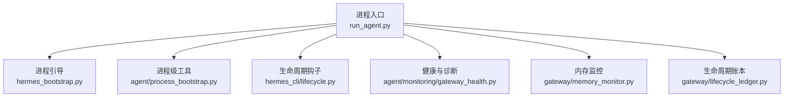
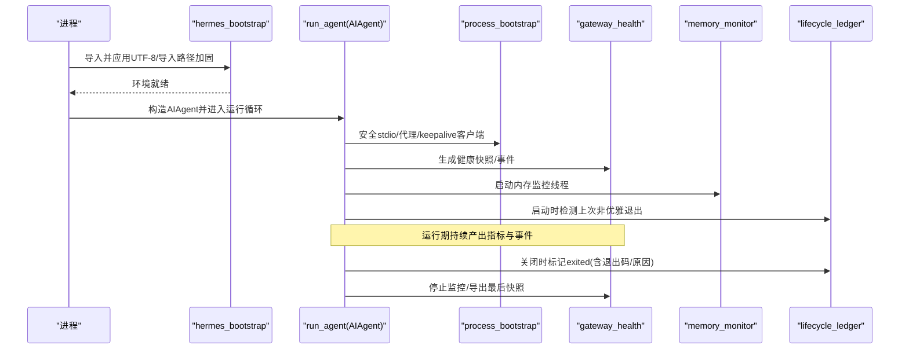
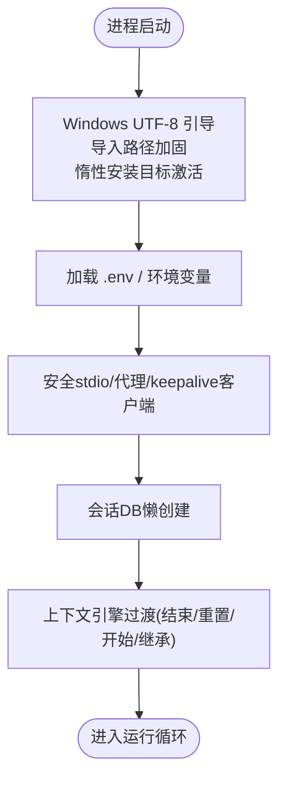
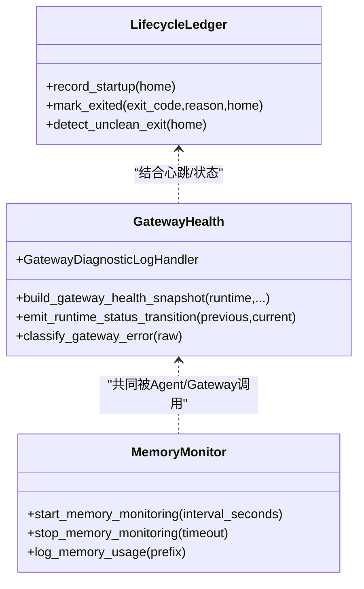
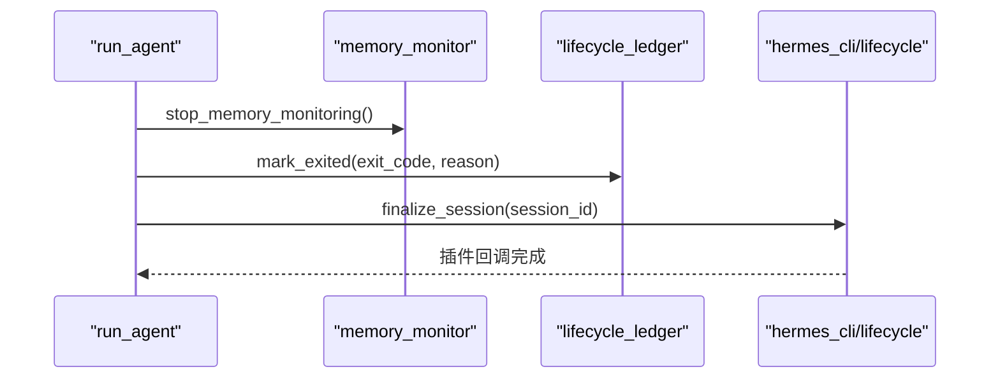
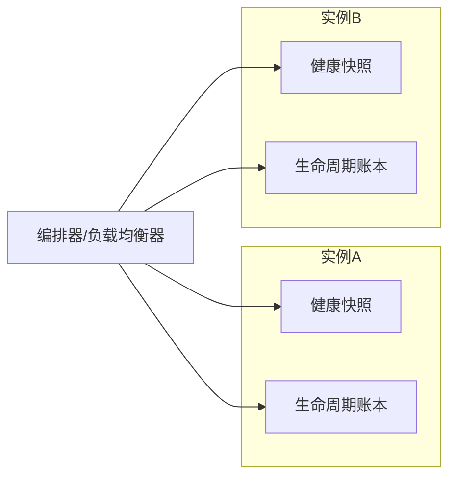
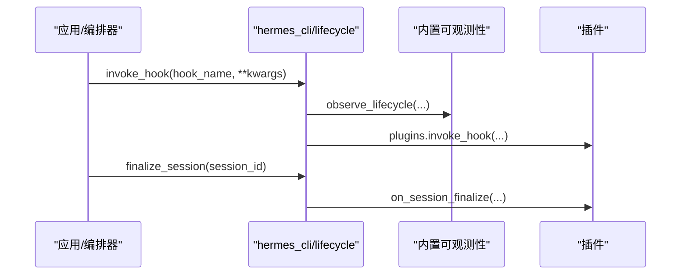
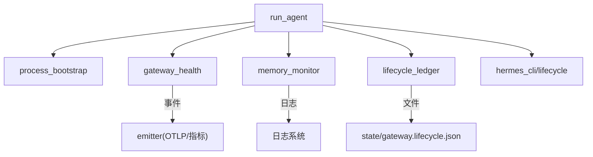

# 代理生命周期

<cite>
**本文引用的文件**
- [hermes_bootstrap.py](file://hermes_bootstrap.py)
- [run_agent.py](file://run_agent.py)
- [agent/process_bootstrap.py](file://agent/process_bootstrap.py)
- [hermes_cli/lifecycle.py](file://hermes_cli/lifecycle.py)
- [gateway/lifecycle_ledger.py](file://gateway/lifecycle_ledger.py)
- [agent/monitoring/gateway_health.py](file://agent/monitoring/gateway_health.py)
- [gateway/memory_monitor.py](file://gateway/memory_monitor.py)
</cite>

## 目录
1. [简介](#简介)
2. [项目结构](#项目结构)
3. [核心组件](#核心组件)
4. [架构总览](#架构总览)
5. [详细组件分析](#详细组件分析)
6. [依赖关系分析](#依赖关系分析)
7. [性能考量](#性能考量)
8. [故障排查指南](#故障排查指南)
9. [结论](#结论)
10. [附录](#附录)

## 简介
本技术文档聚焦 Hermes Agent 的生命周期管理，覆盖启动、运行与关闭三个阶段，并扩展至多实例管理、扩展点设计以及部署运维最佳实践。内容基于仓库中实际实现进行梳理，包括进程级引导、环境初始化、配置加载、依赖检查与服务注册；运行期的健康检查、资源监控与异常恢复；关闭期的资源清理、状态持久化与连接断开处理；以及网关侧的不可优雅退出检测、心跳与健康快照、内存监控等能力。

## 项目结构
围绕生命周期管理的核心代码分布在以下模块：
- 进程级引导与环境准备：hermes_bootstrap、agent/process_bootstrap
- 代理主入口与运行时：run_agent
- 生命周期钩子与插件：hermes_cli/lifecycle
- 网关生命周期账本（不可优雅退出证据）：gateway/lifecycle_ledger
- 健康与诊断信号：agent/monitoring/gateway_health
- 内存监控：gateway/memory_monitor

**图表来源**
- [run_agent.py:1-150](file://run_agent.py#L1-L150)
- [hermes_bootstrap.py:1-240](file://hermes_bootstrap.py#L1-L240)
- [agent/process_bootstrap.py:1-228](file://agent/process_bootstrap.py#L1-L228)
- [hermes_cli/lifecycle.py:1-64](file://hermes_cli/lifecycle.py#L1-L64)
- [agent/monitoring/gateway_health.py:1-470](file://agent/monitoring/gateway_health.py#L1-L470)
- [gateway/memory_monitor.py:1-231](file://gateway/memory_monitor.py#L1-L231)
- [gateway/lifecycle_ledger.py:1-324](file://gateway/lifecycle_ledger.py#L1-L324)

**章节来源**
- [run_agent.py:1-150](file://run_agent.py#L1-L150)
- [hermes_bootstrap.py:1-240](file://hermes_bootstrap.py#L1-L240)
- [agent/process_bootstrap.py:1-228](file://agent/process_bootstrap.py#L1-L228)
- [hermes_cli/lifecycle.py:1-64](file://hermes_cli/lifecycle.py#L1-L64)
- [agent/monitoring/gateway_health.py:1-470](file://agent/monitoring/gateway_health.py#L1-L470)
- [gateway/memory_monitor.py:1-231](file://gateway/memory_monitor.py#L1-L231)
- [gateway/lifecycle_ledger.py:1-324](file://gateway/lifecycle_ledger.py#L1-L324)

## 核心组件
- 进程引导与环境初始化
  - Windows UTF-8 引导、导入路径加固、惰性安装目标激活
  - 安全标准输出包装、HTTP 代理解析与 keepalive 客户端构建
- 代理启动与依赖检查
  - 环境变量加载、会话数据库懒创建、上下文引擎过渡通知
- 运行期健康与监控
  - 健康快照、平台状态分类、日志桥接事件、内存使用率周期性记录
- 关闭与异常恢复
  - 生命周期账本记录上次非优雅退出、标记当前进程退出原因
  - 会话最终化、Relay 会话收尾、插件钩子执行

**章节来源**
- [hermes_bootstrap.py:59-226](file://hermes_bootstrap.py#L59-L226)
- [agent/process_bootstrap.py:63-228](file://agent/process_bootstrap.py#L63-L228)
- [run_agent.py:412-800](file://run_agent.py#L412-L800)
- [agent/monitoring/gateway_health.py:210-470](file://agent/monitoring/gateway_health.py#L210-L470)
- [gateway/memory_monitor.py:139-231](file://gateway/memory_monitor.py#L139-L231)
- [gateway/lifecycle_ledger.py:181-324](file://gateway/lifecycle_ledger.py#L181-L324)
- [hermes_cli/lifecycle.py:11-64](file://hermes_cli/lifecycle.py#L11-L64)

## 架构总览
Hermes Agent 的生命周期由“进程引导 → 代理初始化 → 运行监控 → 关闭收尾”构成。关键交互如下：

**图表来源**
- [hermes_bootstrap.py:59-226](file://hermes_bootstrap.py#L59-L226)
- [run_agent.py:412-800](file://run_agent.py#L412-L800)
- [agent/process_bootstrap.py:63-228](file://agent/process_bootstrap.py#L63-L228)
- [agent/monitoring/gateway_health.py:210-470](file://agent/monitoring/gateway_health.py#L210-L470)
- [gateway/memory_monitor.py:139-231](file://gateway/memory_monitor.py#L139-L231)
- [gateway/lifecycle_ledger.py:224-324](file://gateway/lifecycle_ledger.py#L224-L324)

## 详细组件分析

### 启动流程：环境初始化、配置加载、依赖检查、服务注册
- 环境初始化
  - Windows UTF-8 引导：设置 PYTHONUTF8/PYTHONIOENCODING，重配 stdio，抑制 platform 版本查询导致的控制台闪烁与解码崩溃
  - 导入路径加固：移除当前目录优先项，确保核心包不被同名用户包遮蔽
  - 惰性安装目标激活：在不可变镜像中将数据卷上的惰性安装包加入可导入路径
- 配置加载
  - 加载 .env 与 HERMES_HOME 相关环境变量，记录已加载路径
- 依赖检查与服务注册
  - 通过 process_bootstrap 提供安全的 OpenAI 客户端代理、HTTP keepalive 客户端与代理策略
  - 会话数据库懒创建：首次使用时建立会话行，携带模型配置、系统提示、工作目录等信息
  - 上下文引擎过渡：通知压缩器/插件引擎完成旧会话结束与新会话开始，支持上下文继承

**图表来源**
- [hermes_bootstrap.py:59-226](file://hermes_bootstrap.py#L59-L226)
- [agent/process_bootstrap.py:63-228](file://agent/process_bootstrap.py#L63-L228)
- [run_agent.py:412-800](file://run_agent.py#L412-L800)

**章节来源**
- [hermes_bootstrap.py:59-226](file://hermes_bootstrap.py#L59-L226)
- [agent/process_bootstrap.py:63-228](file://agent/process_bootstrap.py#L63-L228)
- [run_agent.py:412-800](file://run_agent.py#L412-L800)

### 运行状态管理：健康检查、资源监控、异常恢复
- 健康检查
  - 健康快照：聚合 gateway/platform 状态、活跃代理数、繁忙/可排空标志、重启请求标志
  - 平台状态分类：将错误文本归类为认证失败、限流、超时、网络错误、配置无效、启动失败、致命等
  - 日志桥接：仅允许 gateway.* 日志级别≥WARNING 的消息转为诊断事件，避免泄露敏感信息
- 资源监控
  - 内存监控：后台线程每 N 分钟记录 RSS、GC 计数、线程数、运行时长；启动基线、关闭终值
- 异常恢复
  - 生命周期账本：启动时读取上次哨兵，若仍为 running 则判定为不可优雅退出，写入诊断日志并标注疑似 OOM
  - 退出标记：所有优雅退出路径统一标记 exited，附带退出码与原因

**图表来源**
- [agent/monitoring/gateway_health.py:210-470](file://agent/monitoring/gateway_health.py#L210-L470)
- [gateway/memory_monitor.py:139-231](file://gateway/memory_monitor.py#L139-L231)
- [gateway/lifecycle_ledger.py:181-324](file://gateway/lifecycle_ledger.py#L181-L324)

**章节来源**
- [agent/monitoring/gateway_health.py:210-470](file://agent/monitoring/gateway_health.py#L210-L470)
- [gateway/memory_monitor.py:139-231](file://gateway/memory_monitor.py#L139-L231)
- [gateway/lifecycle_ledger.py:181-324](file://gateway/lifecycle_ledger.py#L181-L324)

### 关闭流程：资源清理、状态持久化、连接断开处理
- 资源清理
  - 停止内存监控线程，输出关闭前最后一次内存快照
  - 安全stdio包装确保即使管道断裂也不崩溃
- 状态持久化
  - 生命周期账本标记 exited，包含退出码与原因
  - 会话数据库行已在运行期创建，关闭阶段不再新增写入
- 连接断开处理
  - 会话最终化：通知观察者并硬关闭核心拥有的 Relay 会话
  - 插件钩子：on_session_finalize 统一触发，便于扩展清理

**图表来源**
- [gateway/memory_monitor.py:196-231](file://gateway/memory_monitor.py#L196-L231)
- [gateway/lifecycle_ledger.py:271-324](file://gateway/lifecycle_ledger.py#L271-L324)
- [hermes_cli/lifecycle.py:40-64](file://hermes_cli/lifecycle.py#L40-L64)

**章节来源**
- [gateway/memory_monitor.py:196-231](file://gateway/memory_monitor.py#L196-L231)
- [gateway/lifecycle_ledger.py:271-324](file://gateway/lifecycle_ledger.py#L271-L324)
- [hermes_cli/lifecycle.py:40-64](file://hermes_cli/lifecycle.py#L40-L64)

### 多实例管理：进程间通信、状态同步、负载均衡
- 进程间通信与状态同步
  - 健康快照以 content-free 指标形式输出，便于外部编排器采集与横向对比
  - 生命周期账本提供跨进程的非优雅退出证据，辅助编排层做故障归因与自动重启
- 负载均衡
  - 健康快照中的 busy/drainable 标志可用于流量调度：繁忙实例拒绝新任务，可排空实例承接剩余负载

[此图为概念性示意，不直接映射具体源码]

### 扩展点设计：插件机制、回调系统、事件监听器
- 插件机制
  - 生命周期钩子：invoke_hook/has_hook 统一分发，先走内置可观测性，再走插件
  - 会话最终化：finalize_session 同时触发内置与插件回调
- 回调系统
  - AIAgent 构造函数暴露大量回调参数（工具进度、思考、推理、澄清、终端读取、预览、步骤、流增量、中间助手消息、工具生成、状态、通知等），用于上层集成与 UI 联动
- 事件监听器
  - 健康模块将日志与状态变化转换为结构化事件，供 OTLP/指标系统消费

**图表来源**
- [hermes_cli/lifecycle.py:11-64](file://hermes_cli/lifecycle.py#L11-L64)
- [run_agent.py:435-596](file://run_agent.py#L435-L596)
- [agent/monitoring/gateway_health.py:310-416](file://agent/monitoring/gateway_health.py#L310-L416)

**章节来源**
- [hermes_cli/lifecycle.py:11-64](file://hermes_cli/lifecycle.py#L11-L64)
- [run_agent.py:435-596](file://run_agent.py#L435-L596)
- [agent/monitoring/gateway_health.py:310-416](file://agent/monitoring/gateway_health.py#L310-L416)

## 依赖关系分析
- 低耦合高内聚
  - 健康模块专注指标与事件，不直接修改业务状态
  - 内存监控独立于业务逻辑，仅输出日志
  - 生命周期账本只负责持久化证据，不影响主流程
- 外部依赖
  - HTTP 客户端与代理策略来自 process_bootstrap
  - 会话数据库与状态来自 run_agent 的懒加载路径
  - 插件系统通过 hermes_cli/plugins 动态发现与调用

**图表来源**
- [run_agent.py:412-800](file://run_agent.py#L412-L800)
- [agent/process_bootstrap.py:63-228](file://agent/process_bootstrap.py#L63-L228)
- [agent/monitoring/gateway_health.py:210-470](file://agent/monitoring/gateway_health.py#L210-L470)
- [gateway/memory_monitor.py:139-231](file://gateway/memory_monitor.py#L139-L231)
- [gateway/lifecycle_ledger.py:181-324](file://gateway/lifecycle_ledger.py#L181-L324)
- [hermes_cli/lifecycle.py:11-64](file://hermes_cli/lifecycle.py#L11-L64)

**章节来源**
- [run_agent.py:412-800](file://run_agent.py#L412-L800)
- [agent/process_bootstrap.py:63-228](file://agent/process_bootstrap.py#L63-L228)
- [agent/monitoring/gateway_health.py:210-470](file://agent/monitoring/gateway_health.py#L210-L470)
- [gateway/memory_monitor.py:139-231](file://gateway/memory_monitor.py#L139-L231)
- [gateway/lifecycle_ledger.py:181-324](file://gateway/lifecycle_ledger.py#L181-L324)
- [hermes_cli/lifecycle.py:11-64](file://hermes_cli/lifecycle.py#L11-L64)

## 性能考量
- 启动性能
  - 延迟导入 OpenAI SDK，减少冷启动开销
  - 安全stdio包装避免管道中断引发的异常重试
- 运行期性能
  - 健康快照仅产出无内容指标，降低对业务的影响
  - 内存监控使用轻量级 RSS 读取与 GC 统计，后台线程不阻塞主循环
- 关闭性能
  - 生命周期账本写操作原子且失败不阻断主流程
  - 会话最终化与插件回调均具备异常保护

[本节为通用指导，无需特定文件引用]

## 故障排查指南
- 无法优雅退出的根因定位
  - 查看生命周期账本：若上次哨兵为 running，说明进程未进入任何优雅退出路径
  - 结合最近一次心跳的内存样本判断是否疑似 OOM
- 健康状态异常
  - 检查平台状态分类结果与错误码，确认是否为认证、限流、网络或配置问题
  - 关注日志桥接事件，过滤 gateway.* 的警告/错误
- 内存泄漏怀疑
  - 通过内存监控日志的时间序列观察 RSS 增长趋势，结合 GC 计数与线程数判断
- 插件/回调问题
  - 通过生命周期钩子调用链确认内置可观测性与插件是否成功执行

**章节来源**
- [gateway/lifecycle_ledger.py:181-324](file://gateway/lifecycle_ledger.py#L181-L324)
- [agent/monitoring/gateway_health.py:70-120](file://agent/monitoring/gateway_health.py#L70-L120)
- [gateway/memory_monitor.py:83-127](file://gateway/memory_monitor.py#L83-L127)
- [hermes_cli/lifecycle.py:11-64](file://hermes_cli/lifecycle.py#L11-L64)

## 结论
Hermes Agent 的生命周期管理以稳健的进程引导、完善的运行期健康与资源监控、以及可靠的关闭收尾为核心。通过生命周期账本与健康快照，系统能够在不可优雅退出场景下快速定位根因；通过内存监控与日志桥接，运行期可观测性得到显著增强；通过插件与回调体系，扩展点清晰且易于集成。建议在生产环境中启用全部监控与账本能力，并结合编排器实现自动重启与负载均衡。

## 附录
- 部署与运维最佳实践
  - 始终启用生命周期账本与健康快照，以便编排器感知实例状态
  - 在容器/守护进程中保留 stderr/stdout 管道，确保安全stdio包装有效
  - 合理配置内存监控间隔，平衡可观测性与开销
  - 使用插件钩子在会话结束时释放外部资源（如临时文件、MCP 连接）
  - 对平台适配器遵循 is_reconnect 契约，确保断线重连稳定

[本节为通用指导，无需特定文件引用]